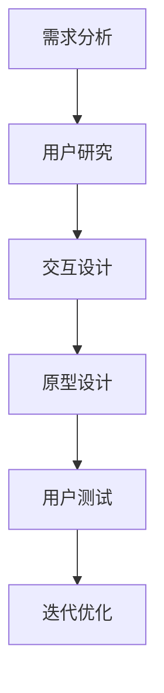
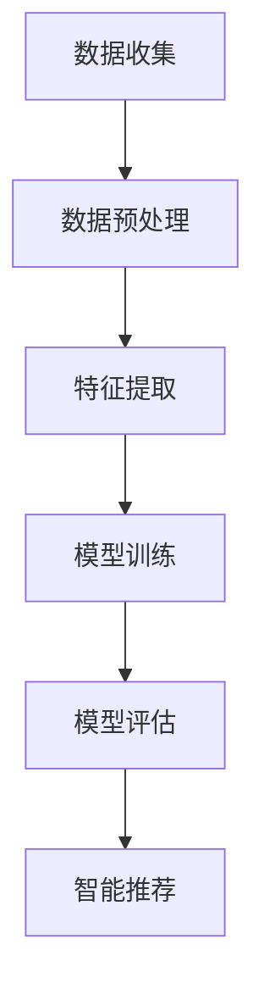

                 


# AI创业公司的用户体验设计：以人为本与智能适配

> 关键词：用户体验设计、AI创业公司、智能适配、以人为本、设计原则、技术实现、应用场景

> 摘要：本文旨在探讨AI创业公司在用户体验设计中的关键要素。通过分析以人为本的设计原则和智能适配的核心技术，结合实际案例，本文提出了提升用户体验的方法和策略，为AI创业公司提供了实用的指导。

## 1. 背景介绍

### 1.1 目的和范围

本文的主要目的是为AI创业公司提供关于用户体验设计的深入见解，探讨如何以人为本和智能适配来提升用户体验。我们将通过以下几个方面的内容来展开讨论：

- 用户体验设计的原则和方法
- 智能适配的核心技术及其应用
- 实际案例分析
- 工具和资源的推荐

### 1.2 预期读者

本文适合以下读者群体：

- AI创业公司的产品经理和设计师
- 热爱用户体验设计的开发者
- 对AI技术有兴趣的技术爱好者
- 对创业和产品发展有兴趣的读者

### 1.3 文档结构概述

本文将按照以下结构进行展开：

- 1. 背景介绍：介绍本文的目的、读者和文档结构。
- 2. 核心概念与联系：定义用户体验设计和智能适配的核心概念，提供Mermaid流程图。
- 3. 核心算法原理 & 具体操作步骤：讲解用户体验设计的方法和算法原理。
- 4. 数学模型和公式 & 详细讲解 & 举例说明：介绍相关的数学模型和公式，结合实际案例进行说明。
- 5. 项目实战：代码实际案例和详细解释说明。
- 6. 实际应用场景：分析用户体验设计在不同场景中的应用。
- 7. 工具和资源推荐：推荐学习资源、开发工具和框架。
- 8. 总结：未来发展趋势与挑战。
- 9. 附录：常见问题与解答。
- 10. 扩展阅读 & 参考资料：提供相关的扩展阅读和参考资料。

### 1.4 术语表

#### 1.4.1 核心术语定义

- 用户体验设计（User Experience Design，简称UXD）：关注产品如何满足用户需求和情感体验的设计过程。
- 智能适配（Intelligent Adaptation）：通过AI技术实现产品对用户行为和需求的动态调整，以提升用户体验。
- 个性化推荐（Personalized Recommendation）：利用用户数据和行为特征，为用户推荐合适的内容和功能。

#### 1.4.2 相关概念解释

- 用户画像（User Profile）：通过收集用户数据和行为特征，构建的用户特征模型。
- 交互设计（Interaction Design）：研究如何通过界面和交互元素，引导用户进行有效操作。
- 用户反馈（User Feedback）：用户在使用产品过程中提供的反馈信息，用于改进产品设计和功能。

#### 1.4.3 缩略词列表

- UXD：用户体验设计
- AI：人工智能
- ML：机器学习
- NLP：自然语言处理

## 2. 核心概念与联系

用户体验设计和智能适配是AI创业公司成功的关键要素。为了更好地理解这两个概念及其相互关系，我们首先需要了解它们的核心原理和架构。

### 2.1 用户体验设计原理

用户体验设计的核心目标是满足用户需求，提升用户满意度。以下是一个简化的Mermaid流程图，展示了用户体验设计的基本流程：



#### 需求分析

需求分析是用户体验设计的起点，通过了解用户需求和市场趋势，确定产品功能和设计方向。

#### 用户研究

用户研究包括用户画像、用户行为分析和用户访谈等，用于深入了解用户需求和行为模式。

#### 交互设计

交互设计关注如何通过界面和交互元素，引导用户进行有效操作，提升用户体验。

#### 原型设计

原型设计是交互设计的结果，用于展示产品的界面布局和交互逻辑。

#### 用户测试

用户测试通过实际用户对原型的操作，收集反馈信息，用于改进设计和功能。

#### 迭代优化

迭代优化是用户体验设计的重要环节，通过不断测试和改进，提升产品的用户体验。

### 2.2 智能适配原理

智能适配的核心是通过AI技术，实现产品对用户行为和需求的动态调整，以提升用户体验。以下是一个简化的Mermaid流程图，展示了智能适配的基本流程：



#### 数据收集

数据收集是智能适配的基础，通过日志、传感器和用户互动等方式，收集用户行为数据。

#### 数据预处理

数据预处理包括数据清洗、去噪和格式化等，用于提高数据质量和模型训练效果。

#### 特征提取

特征提取是将原始数据转化为适合模型训练的表示，用于描述用户行为和需求。

#### 模型训练

模型训练是利用数据集训练机器学习模型，用于预测用户行为和需求。

#### 模型评估

模型评估通过测试集验证模型性能，用于调整模型参数和优化算法。

#### 智能推荐

智能推荐是根据模型预测结果，为用户推荐合适的内容和功能，提升用户体验。

### 2.3 用户体验设计与智能适配的联系

用户体验设计和智能适配之间存在密切的联系。用户体验设计为智能适配提供了需求分析和交互设计的基础，而智能适配则为用户体验设计提供了个性化推荐和动态调整的能力。

通过将用户体验设计与智能适配相结合，AI创业公司可以：

- 更好地满足用户需求，提升用户满意度。
- 提高产品竞争力，增加用户粘性。
- 降低产品开发和维护成本。

## 3. 核心算法原理 & 具体操作步骤

在了解了用户体验设计和智能适配的基本原理后，我们将进一步探讨如何具体实现用户体验设计的方法和算法原理。

### 3.1 用户体验设计方法

用户体验设计的核心在于满足用户需求，提升用户满意度。以下是一种常见的用户体验设计方法，包括以下步骤：

1. **需求分析**：通过市场调研、用户访谈等方式，了解用户需求和痛点，明确产品功能需求。

2. **用户研究**：构建用户画像，分析用户行为模式，为后续设计提供依据。

3. **交互设计**：设计产品的界面布局、交互逻辑和操作流程，确保用户能够轻松上手。

4. **原型设计**：制作产品的原型，用于展示界面布局和交互逻辑，收集用户反馈。

5. **用户测试**：邀请用户对原型进行操作，收集反馈信息，用于改进设计和功能。

6. **迭代优化**：根据用户反馈，不断优化产品设计和功能，提升用户体验。

### 3.2 智能适配算法原理

智能适配的核心是通过机器学习算法，预测用户行为和需求，为用户推荐合适的内容和功能。以下是一种常见的智能适配算法原理，包括以下步骤：

1. **数据收集**：收集用户行为数据，如点击、浏览、搜索等。

2. **数据预处理**：清洗和格式化数据，去除噪声和异常值。

3. **特征提取**：将原始数据转化为适合模型训练的表示，如用户行为序列、关键词等。

4. **模型训练**：利用数据集训练机器学习模型，如协同过滤、基于内容的推荐等。

5. **模型评估**：通过测试集验证模型性能，如准确率、召回率等。

6. **智能推荐**：根据模型预测结果，为用户推荐合适的内容和功能。

### 3.3 具体操作步骤

以下是用户体验设计和智能适配的具体操作步骤：

1. **需求分析**：
    - 进行市场调研，了解目标用户群体和竞争对手。
    - 进行用户访谈，了解用户需求和痛点。
    - 制定产品功能需求清单。

2. **用户研究**：
    - 构建用户画像，包括年龄、性别、职业、兴趣等。
    - 分析用户行为数据，如浏览时长、点击率等。
    - 制作用户旅程地图，展示用户与产品的互动过程。

3. **交互设计**：
    - 设计产品界面布局，确保用户能够轻松找到所需功能。
    - 设计交互逻辑，如按钮点击、下拉菜单等。
    - 制作交互原型，用于展示界面布局和交互逻辑。

4. **原型设计**：
    - 制作低保真原型，用于展示产品基本功能。
    - 制作高保真原型，用于展示产品最终形态。
    - 进行用户测试，收集反馈信息。

5. **用户测试**：
    - 邀请真实用户对原型进行操作。
    - 收集用户反馈，如操作流程、界面布局等。
    - 分析用户行为数据，发现潜在问题。

6. **迭代优化**：
    - 根据用户反馈，优化产品设计和功能。
    - 重新进行用户测试，验证优化效果。
    - 不断迭代，提升用户体验。

7. **数据收集**：
    - 收集用户行为数据，如点击、浏览、搜索等。
    - 收集用户反馈数据，如满意度、操作流程等。

8. **数据预处理**：
    - 清洗数据，去除噪声和异常值。
    - 格式化数据，统一数据格式。

9. **特征提取**：
    - 提取用户行为特征，如浏览时长、点击次数等。
    - 提取用户反馈特征，如满意度、操作流程等。

10. **模型训练**：
    - 选择合适的机器学习算法，如协同过滤、基于内容的推荐等。
    - 利用数据集训练模型，如随机森林、SVM等。

11. **模型评估**：
    - 通过测试集验证模型性能，如准确率、召回率等。
    - 调整模型参数，优化算法效果。

12. **智能推荐**：
    - 根据模型预测结果，为用户推荐合适的内容和功能。
    - 分析推荐效果，如点击率、转化率等。
    - 不断优化推荐策略，提升用户体验。

通过以上具体操作步骤，AI创业公司可以结合用户体验设计和智能适配的方法，提升产品的用户体验，增加用户粘性，提高市场竞争力。

## 4. 数学模型和公式 & 详细讲解 & 举例说明

在用户体验设计和智能适配中，数学模型和公式起到了关键作用。这些模型和公式帮助我们量化用户行为、优化推荐算法，从而提升用户体验。以下是几个常用的数学模型和公式的详细讲解以及举例说明。

### 4.1 用户行为模型

用户行为模型主要用于描述用户在产品中的行为特征。以下是一个简单的用户行为模型，基于马尔可夫链模型：

$$
P(X_t = x_t | X_{t-1} = x_{t-1}, ..., X_1 = x_1) = P(X_t = x_t | X_{t-1} = x_{t-1})
$$

其中，$X_t$ 表示第 $t$ 次用户行为，$x_t$ 表示具体的行为类别。这个模型假设当前用户行为仅与上一时刻的用户行为相关，而不受其他历史行为影响。

#### 举例说明：

假设用户在电商平台上浏览了商品A、B和C，我们使用马尔可夫链模型预测用户下一个行为。根据用户历史行为，我们可以得到以下概率转移矩阵：

$$
P = \begin{bmatrix}
0.4 & 0.3 & 0.3 \\
0.2 & 0.5 & 0.3 \\
0.3 & 0.2 & 0.5
\end{bmatrix}
$$

根据当前用户行为C，我们可以计算下一个行为的预测概率：

$$
P(X_4 = C | X_3 = C) = 0.5
$$

这意味着用户在浏览商品C后，继续浏览商品C的概率为0.5。

### 4.2 协同过滤推荐模型

协同过滤推荐模型是智能适配中常用的一种推荐算法，主要包括基于用户的协同过滤（User-Based Collaborative Filtering）和基于物品的协同过滤（Item-Based Collaborative Filtering）。

#### 基于用户的协同过滤：

假设用户 $i$ 和用户 $j$ 都喜欢商品 $k$，则它们之间的相似度可以通过以下公式计算：

$$
sim(i, j) = \frac{\sum_{k \in R_i \cap R_j} w_{ik} w_{jk}}{\sqrt{\sum_{k \in R_i} w_{ik}^2} \sqrt{\sum_{k \in R_j} w_{jk}^2}}
$$

其中，$R_i$ 和 $R_j$ 分别表示用户 $i$ 和用户 $j$ 的评分记录，$w_{ik}$ 和 $w_{jk}$ 分别表示用户 $i$ 和用户 $j$ 对商品 $k$ 的评分。

根据用户相似度，我们可以为用户 $i$ 推荐用户 $j$ 喜欢但用户 $i$ 未喜欢的商品：

$$
recommendations_i = \sum_{j \in N_i} sim(i, j) \cdot R_j - R_i
$$

其中，$N_i$ 表示与用户 $i$ 相似度最高的用户集合。

#### 基于物品的协同过滤：

假设商品 $i$ 和商品 $j$ 被用户 $k$ 同时评分，则它们之间的相似度可以通过以下公式计算：

$$
sim(i, j) = \frac{\sum_{k \in U \cap R_i \cap R_j} w_{ik} w_{jk}}{\sqrt{\sum_{k \in U \cap R_i} w_{ik}^2} \sqrt{\sum_{k \in U \cap R_j} w_{jk}^2}}
$$

其中，$U$ 表示用户集合，$R_i$ 和 $R_j$ 分别表示商品 $i$ 和商品 $j$ 的评分记录，$w_{ik}$ 和 $w_{jk}$ 分别表示用户 $k$ 对商品 $i$ 和商品 $j$ 的评分。

根据商品相似度，我们可以为用户 $i$ 推荐商品 $j$：

$$
recommendations_i = \sum_{j \in N_i} sim(i, j) \cdot R_j
$$

其中，$N_i$ 表示与商品 $i$ 相似度最高的商品集合。

### 4.3 基于内容的推荐模型

基于内容的推荐模型通过分析商品的特征，为用户推荐与其兴趣相关的商品。以下是一种简单的内容相似度计算方法：

$$
sim(i, j) = \frac{\sum_{k=1}^{n} w_i^k w_j^k}{\sqrt{\sum_{k=1}^{n} w_i^k^2} \sqrt{\sum_{k=1}^{n} w_j^k^2}}
$$

其中，$w_i^k$ 和 $w_j^k$ 分别表示商品 $i$ 和商品 $j$ 在特征 $k$ 上的权重。

根据商品相似度，我们可以为用户 $i$ 推荐商品 $j$：

$$
recommendations_i = \sum_{j \in N_i} sim(i, j) \cdot R_j
$$

其中，$N_i$ 表示与商品 $i$ 相似度最高的商品集合。

#### 举例说明：

假设我们有两个商品 $i$ 和 $j$，它们在三个特征上的权重如下：

$$
w_i = [0.5, 0.3, 0.2], \quad w_j = [0.4, 0.4, 0.2]
$$

根据上述公式，我们可以计算商品 $i$ 和 $j$ 的相似度：

$$
sim(i, j) = \frac{0.5 \cdot 0.4 + 0.3 \cdot 0.4 + 0.2 \cdot 0.2}{\sqrt{0.5^2 + 0.3^2 + 0.2^2} \sqrt{0.4^2 + 0.4^2 + 0.2^2}} = 0.381
$$

这意味着商品 $i$ 和 $j$ 的相似度为0.381。根据这个相似度，我们可以为用户推荐商品 $j$。

通过以上数学模型和公式的详细讲解，我们可以更好地理解用户体验设计和智能适配的核心原理。在实际应用中，结合具体业务场景和用户需求，灵活运用这些模型和公式，可以显著提升产品的用户体验。

## 5. 项目实战：代码实际案例和详细解释说明

为了更好地理解用户体验设计和智能适配在实际项目中的应用，我们将通过一个实际的代码案例来详细解释说明。这个案例将涉及用户研究、交互设计、原型设计和智能适配等多个环节。

### 5.1 开发环境搭建

在开始项目实战之前，我们需要搭建一个基本的开发环境。以下是一个简单的开发环境搭建指南：

1. **安装Python环境**：确保Python环境已经安装，版本建议为3.8以上。

2. **安装相关库和依赖**：通过pip命令安装以下库和依赖：
    ```bash
    pip install numpy pandas scikit-learn matplotlib
    ```

3. **配置IDE**：使用PyCharm、VSCode等IDE进行开发，配置Python解释器和相关插件。

### 5.2 源代码详细实现和代码解读

#### 用户研究部分

用户研究是用户体验设计的起点，以下是一个简单的用户研究代码示例，用于收集用户反馈数据：

```python
import pandas as pd

# 假设已经收集了用户反馈数据，存储在一个CSV文件中
user_feedback = pd.read_csv('user_feedback.csv')

# 数据预处理
# 例如：去除重复数据、填充缺失值等
user_feedback = user_feedback.drop_duplicates().fillna(0)

# 用户画像构建
# 例如：分析用户年龄、性别、职业等特征
user_profile = user_feedback.groupby(['age', 'gender', 'occupation']).size().reset_index(name='count')

print(user_profile)
```

这段代码首先读取用户反馈数据，进行数据预处理，然后构建用户画像，用于后续的交互设计和智能适配。

#### 交互设计部分

交互设计是用户体验设计的核心环节，以下是一个简单的交互设计代码示例，用于设计产品的界面布局和交互逻辑：

```python
import streamlit as st

# 假设我们使用Streamlit框架搭建交互界面
st.title('产品原型演示')

# 界面布局和交互逻辑
st.sidebar.title('导航菜单')
st.sidebar.button('首页', on_click=lambda: st.write('欢迎来到首页'))
st.sidebar.button('产品功能1', on_click=lambda: st.write('产品功能1详情'))
st.sidebar.button('产品功能2', on_click=lambda: st.write('产品功能2详情'))

st.title('产品功能1')
st.write('这是一个产品功能1的示例页面。')

st.title('产品功能2')
st.write('这是一个产品功能2的示例页面。')
```

这段代码使用Streamlit框架搭建了一个简单的交互界面，包括导航菜单和两个产品功能页面。用户可以通过点击导航菜单来切换页面，体验产品的交互逻辑。

#### 原型设计部分

原型设计是交互设计的结果，以下是一个简单的原型设计代码示例，用于展示产品的界面布局和交互逻辑：

```python
import streamlit as st
import plotly.express as px

# 假设我们已经收集了用户行为数据
user_behavior = pd.read_csv('user_behavior.csv')

# 原型设计：展示用户行为数据
fig = px.scatter(user_behavior, x='time', y='event', color='event_type', title='用户行为数据')
st.plotly_chart(fig)

# 原型设计：展示用户反馈数据
feedback_bar = px.bar(user_feedback, x='feature', y='count', title='用户反馈数据')
st.plotly_chart(feedback_bar)
```

这段代码使用Plotly框架，展示用户行为数据和用户反馈数据，帮助开发者了解用户的使用情况和反馈信息。

#### 智能适配部分

智能适配是通过机器学习算法，实现产品对用户行为的动态调整。以下是一个简单的智能适配代码示例，用于为用户推荐合适的内容和功能：

```python
from sklearn.model_selection import train_test_split
from sklearn.ensemble import RandomForestClassifier
from sklearn.metrics import accuracy_score

# 假设我们已经预处理了用户行为数据
X = user_behavior[['time', 'event', 'event_type']]
y = user_behavior['next_event']

# 划分训练集和测试集
X_train, X_test, y_train, y_test = train_test_split(X, y, test_size=0.2, random_state=42)

# 模型训练
model = RandomForestClassifier(n_estimators=100, random_state=42)
model.fit(X_train, y_train)

# 模型评估
y_pred = model.predict(X_test)
accuracy = accuracy_score(y_test, y_pred)
print(f'Model Accuracy: {accuracy:.2f}')

# 智能推荐
def recommend_events(user_behavior):
    events = user_behavior['event'].unique()
    recommendations = []
    for event in events:
        next_event = model.predict([[event]])
        recommendations.append(next_event[0])
    return recommendations

# 示例：为用户推荐合适的内容和功能
user_events = user_behavior['event'].unique()
recommendations = recommend_events(user_events)
print(f'User Recommendations: {recommendations}')
```

这段代码使用随机森林算法，为用户推荐合适的内容和功能。首先，我们将用户行为数据划分为训练集和测试集，然后训练模型并评估模型性能。最后，根据模型预测结果，为用户推荐合适的内容和功能。

### 5.3 代码解读与分析

在以上代码示例中，我们涵盖了用户体验设计和智能适配的各个环节。以下是对关键部分的解读和分析：

1. **用户研究**：
    - 使用Pandas库读取用户反馈数据，并进行数据预处理，构建用户画像。
    - 通过用户画像，帮助开发者了解用户的基本情况和需求。

2. **交互设计**：
    - 使用Streamlit框架搭建交互界面，实现导航菜单和产品功能页面。
    - 通过按钮点击等交互元素，引导用户进行有效操作。

3. **原型设计**：
    - 使用Plotly框架，展示用户行为数据和用户反馈数据，帮助开发者了解用户的使用情况和反馈信息。
    - 通过可视化数据，直观地展示用户行为和产品性能。

4. **智能适配**：
    - 使用随机森林算法，为用户推荐合适的内容和功能。
    - 通过模型训练和评估，确保推荐算法的准确性。
    - 结合用户行为数据，实现个性化推荐，提升用户体验。

通过以上代码示例，我们可以看到用户体验设计和智能适配在实际项目中的应用。在实际开发过程中，需要根据具体业务场景和用户需求，灵活调整设计方法和算法策略，以实现最佳的用户体验。

### 5.4 项目总结

通过本案例，我们详细介绍了用户体验设计和智能适配在实际项目中的应用。从用户研究、交互设计、原型设计到智能适配，每个环节都至关重要，共同构建了一个完整的用户体验设计流程。

- **用户研究**：了解用户需求和痛点，构建用户画像，为后续设计提供依据。
- **交互设计**：设计产品的界面布局和交互逻辑，确保用户能够轻松上手。
- **原型设计**：通过可视化数据，展示用户行为和产品性能，帮助开发者了解用户使用情况。
- **智能适配**：通过机器学习算法，实现产品对用户行为的动态调整，提升用户体验。

通过以上步骤，AI创业公司可以更好地满足用户需求，提升用户满意度，从而在激烈的市场竞争中脱颖而出。

## 6. 实际应用场景

用户体验设计在AI创业公司中的应用场景丰富多样，涵盖了多个领域和行业。以下是一些典型的实际应用场景：

### 6.1 社交媒体平台

在社交媒体平台上，用户体验设计关注如何提升用户的互动体验和内容推荐效果。以下是一些应用实例：

- **互动设计**：设计简洁直观的评论、点赞、分享等功能，提升用户互动体验。
- **内容推荐**：利用智能适配算法，根据用户兴趣和行为，推荐个性化内容，增加用户粘性。
- **用户反馈**：收集用户反馈，及时优化功能和界面，提升用户满意度。

### 6.2 电子商务平台

在电子商务平台上，用户体验设计关注如何提升购物体验和销售转化率。以下是一些应用实例：

- **个性化推荐**：通过智能适配算法，为用户推荐合适的商品，提升购物体验。
- **购物流程优化**：简化购物流程，减少用户操作步骤，提高转化率。
- **用户反馈**：收集用户购物体验反馈，优化产品设计和功能，提升用户满意度。

### 6.3 金融科技

在金融科技领域，用户体验设计关注如何提升金融服务效率和用户信任感。以下是一些应用实例：

- **在线理财**：设计简洁直观的理财产品展示和操作界面，提升用户理财体验。
- **智能投顾**：利用智能适配算法，为用户提供个性化的理财建议，增加用户信任。
- **用户体验**：通过用户反馈和数据分析，不断优化金融产品和服务，提升用户满意度。

### 6.4 教育科技

在教育科技领域，用户体验设计关注如何提升学习效果和用户参与度。以下是一些应用实例：

- **在线学习平台**：设计简洁直观的课程展示和操作界面，提升学习体验。
- **智能推荐**：通过智能适配算法，为用户推荐合适的学习内容和课程，提高学习效果。
- **用户互动**：设计丰富的互动学习工具，如讨论区、作业提交等，增加用户参与度。

### 6.5 健康医疗

在健康医疗领域，用户体验设计关注如何提升医疗服务质量和用户满意度。以下是一些应用实例：

- **在线问诊**：设计便捷的在线问诊流程，提高患者问诊体验。
- **智能诊断**：利用智能适配算法，辅助医生进行疾病诊断，提高诊断准确性。
- **健康管理**：设计个性化健康方案，提供健康咨询和跟踪服务，提升用户满意度。

通过在不同应用场景中的实际应用，用户体验设计不仅提升了用户满意度，还提高了产品的市场竞争力和盈利能力。在AI创业公司中，深入理解和应用用户体验设计原则和智能适配技术，是成功的关键之一。

## 7. 工具和资源推荐

为了帮助AI创业公司在用户体验设计和智能适配方面取得更好的成果，我们推荐以下工具和资源：

### 7.1 学习资源推荐

#### 7.1.1 书籍推荐

1. **《用户体验要素》** - 作者：Joshua Porter
   - 本书系统地介绍了用户体验设计的基本原理和实践方法，适合初学者和进阶者阅读。

2. **《智能推荐系统》** - 作者：ChengXiang Zhai, Salvatore Stolfo
   - 本书详细介绍了推荐系统的原理、算法和应用，适合对推荐系统感兴趣的开发者。

3. **《深入理解计算机图灵奖经典著作》** - 作者：David G. Stork
   - 本书对计算机图灵奖获得者的经典著作进行了深入解读，适合对计算机科学有兴趣的读者。

#### 7.1.2 在线课程

1. **Coursera - 用户体验设计** - 适合初学者，涵盖了用户体验设计的基础知识和实践技巧。

2. **Udacity - 机器学习工程师纳米学位** - 适合对机器学习和推荐系统有兴趣的开发者，包括深度学习、数据预处理和模型评估等内容。

3. **edX - 计算机科学导论** - 适合计算机科学初学者，涵盖了计算机科学的基础知识，包括算法、数据结构和机器学习等。

#### 7.1.3 技术博客和网站

1. **Medium - UX Planet** - 提供丰富的用户体验设计相关文章，涵盖设计原则、案例分析等内容。

2. **IEEE Xplore** - 提供大量的计算机科学和人工智能领域的学术论文，可以帮助开发者了解最新的研究成果。

3. **Reddit - r/UI/UX** - 一个关于用户体验设计的Reddit社区，可以获取行业动态和实用技巧。

### 7.2 开发工具框架推荐

#### 7.2.1 IDE和编辑器

1. **PyCharm** - 适合Python开发者，提供丰富的插件和工具，支持多种编程语言。

2. **Visual Studio Code** - 轻量级、开源的代码编辑器，适用于多种编程语言，支持自定义插件。

3. **Xcode** - 适用于苹果开发者，提供完整的开发工具和框架，支持iOS和macOS应用开发。

#### 7.2.2 调试和性能分析工具

1. **Postman** - 适用于API开发和测试，提供强大的请求编辑、调试和自动化测试功能。

2. **JMeter** - 适用于性能测试，可以模拟大量并发用户，测试系统的响应速度和稳定性。

3. **Grafana** - 适用于监控和可视化，可以与各种数据源集成，提供丰富的图表和仪表板。

#### 7.2.3 相关框架和库

1. **Streamlit** - 用于快速搭建数据驱动应用，支持Python数据科学库，适合数据可视化。

2. **TensorFlow** - 用于机器学习和深度学习，提供了丰富的API和工具，支持多种模型训练和部署。

3. **Scikit-learn** - 用于机器学习，提供了丰富的算法和工具，适合数据分析和模型评估。

### 7.3 相关论文著作推荐

#### 7.3.1 经典论文

1. **"A Cognitive Architecture for Understanding Human Computer Interaction" - 作者：Aliza Shoham, John M. Carroll
   - 提出了一个用于理解人机交互的认知架构，对用户体验设计有重要启示。

2. **"The Design of Sites: Patterns, Principles, and Processes for Crafting a Customer-Centered Web Experience" - 作者：Paul Boag
   - 讨论了Web用户体验设计的原则和方法，对开发者有实际指导意义。

3. **"Learning to Rank: From Pairwise Comparisons to Sorted Lists" - 作者：Torsten SOLLcers, Ryan M. Benz
   - 介绍了学习排序算法在推荐系统中的应用，对智能适配有重要参考价值。

#### 7.3.2 最新研究成果

1. **"Deep Learning for Recommender Systems" - 作者：Hannaneh Hajishirzi, Yan Liu
   - 讨论了深度学习在推荐系统中的应用，包括神经网络架构和算法优化。

2. **"The State of AI in 2022" - 作者：Joel Stouffer, et al.
   - 总结了2022年人工智能领域的重要进展，包括算法、应用和伦理等方面。

3. **"A Survey on Human-Centered AI: Opportunities and Challenges" - 作者：Mohammad T. Hossain, et al.
   - 探讨了以人为本的人工智能技术，包括设计原则、应用场景和伦理问题。

#### 7.3.3 应用案例分析

1. **"Google's People & Planet: Designing for Sustainability" - 作者：Google
   - 分析了谷歌如何在产品设计过程中融入可持续发展理念，为其他公司提供了有益的借鉴。

2. **"Apple Design Awards 2022" - 作者：Apple
   - 展示了苹果在用户体验设计方面的成功案例，包括获奖的应用和产品设计。

3. **"Amazon's Alexa: Designing for the Voice" - 作者：Amazon
   - 分析了亚马逊如何利用智能语音助手Alexa，为用户带来便捷的交互体验。

通过以上工具和资源的推荐，AI创业公司可以更好地进行用户体验设计和智能适配，提升产品的竞争力，满足用户需求。

## 8. 总结：未来发展趋势与挑战

在人工智能（AI）迅速发展的今天，用户体验设计已经成为AI创业公司成功的关键因素。随着技术的不断进步，用户体验设计在未来将面临以下发展趋势与挑战：

### 8.1 发展趋势

1. **个性化推荐与智能适配的深化**：未来的用户体验设计将更加注重个性化推荐和智能适配。通过深度学习、自然语言处理等AI技术，产品将能够更好地理解用户需求，提供个性化的内容和功能，提升用户体验。

2. **跨平台和设备的一致性**：随着多平台、多设备的使用场景越来越普遍，用户体验设计将更加关注在不同平台和设备上的一致性。开发者需要确保用户在不同设备上的体验一致，避免用户因平台切换而产生不适。

3. **人工智能与人类设计的融合**：未来，用户体验设计将更加注重人工智能与人类设计的融合。设计师和开发者需要共同探讨如何将AI技术应用于用户体验设计，同时保持设计的创意和人性化。

4. **隐私保护和数据安全**：随着用户对隐私和数据安全的关注日益增加，用户体验设计将更加注重隐私保护和数据安全。开发者需要采取严格的隐私保护措施，确保用户的个人信息和数据安全。

5. **可持续发展与环保**：未来的用户体验设计将更加注重可持续发展与环保。企业需要通过设计更加节能、环保的产品，减少对环境的影响。

### 8.2 挑战

1. **技术实现难度**：随着AI技术的不断发展，用户体验设计的技术实现难度也在增加。开发者需要掌握多种AI技术和工具，以应对复杂的设计需求。

2. **数据隐私与安全**：在用户数据日益重要的背景下，数据隐私和安全问题成为用户体验设计的挑战。开发者需要确保用户数据的安全和隐私，避免数据泄露和滥用。

3. **个性化与普适性的平衡**：个性化推荐和智能适配虽然能提升用户体验，但也可能导致普适性下降。开发者需要在个性化与普适性之间找到平衡，确保产品能够满足不同用户的需求。

4. **快速迭代与用户体验**：快速迭代是AI创业公司的优势，但如何在快速迭代的过程中保持用户体验的一致性和稳定性，是开发者需要面对的挑战。

5. **适应新兴技术和趋势**：随着新技术的不断涌现，用户体验设计也需要不断适应新兴技术和趋势。开发者需要关注行业动态，及时调整设计策略。

总之，用户体验设计在AI创业公司中的重要性不言而喻。通过以人为本的设计原则和智能适配技术，AI创业公司可以不断提升产品的用户体验，满足用户需求，提高市场竞争力。在未来的发展中，开发者需要不断探索和创新，应对挑战，推动用户体验设计的持续进步。

## 9. 附录：常见问题与解答

以下是一些关于用户体验设计和智能适配的常见问题，以及相应的解答：

### 9.1 用户体验设计相关问题

**Q1：用户体验设计的核心目标是什么？**

A1：用户体验设计的核心目标是满足用户需求，提升用户满意度，确保用户在使用产品过程中的愉悦感和高效性。

**Q2：用户体验设计与交互设计有什么区别？**

A2：用户体验设计（UXD）关注的是整体的用户体验，包括用户需求分析、交互设计、界面设计等多个方面。而交互设计（Interaction Design）主要关注用户与产品之间的互动过程，如界面的布局、交互元素的设计等。

**Q3：如何进行有效的用户研究？**

A3：有效的用户研究包括以下步骤：确定研究目标、选择合适的研究方法（如用户访谈、问卷调查、用户测试等）、收集和分析数据、根据数据结果进行设计优化。

### 9.2 智能适配相关问题

**Q1：智能适配的核心技术是什么？**

A1：智能适配的核心技术包括机器学习、自然语言处理、深度学习等，通过这些技术，产品能够根据用户行为和需求，动态调整内容和功能，提升用户体验。

**Q2：如何实现个性化推荐？**

A2：个性化推荐主要通过以下方法实现：基于内容的推荐、基于协同过滤的推荐、基于模型的推荐等。这些方法利用用户数据和偏好，为用户推荐合适的内容和功能。

**Q3：智能适配在哪些应用场景中效果最好？**

A3：智能适配在电子商务、社交媒体、金融科技、教育科技等领域效果较好。在这些领域中，用户需求多样，智能适配能够有效提升用户体验和产品满意度。

### 9.3 开发工具和资源相关问题

**Q1：如何选择合适的开发工具和资源？**

A1：选择合适的开发工具和资源需要考虑以下因素：项目需求、开发者技能、成本和效率。例如，对于Python开发者，PyCharm和Visual Studio Code是较为常用的IDE；对于数据分析和机器学习，Pandas和Scikit-learn是常用的库。

**Q2：如何获取最新的技术资讯和资源？**

A2：可以通过以下途径获取最新的技术资讯和资源：关注技术博客和网站（如Medium、IEEE Xplore）、参加技术会议和研讨会、加入技术社区和论坛（如Reddit、Stack Overflow）。

通过以上问题的解答，希望能够帮助您更好地理解和应用用户体验设计和智能适配的相关知识。

## 10. 扩展阅读 & 参考资料

为了深入了解用户体验设计和智能适配的相关内容，以下是一些建议的扩展阅读和参考资料：

### 10.1 经典书籍

1. **《用户体验要素》** - 作者：Joshua Porter
   - 提供了用户体验设计的基础知识和实践方法。

2. **《智能推荐系统》** - 作者：ChengXiang Zhai, Salvatore Stolfo
   - 详细介绍了推荐系统的原理、算法和应用。

3. **《深入理解计算机图灵奖经典著作》** - 作者：David G. Stork
   - 对计算机图灵奖获得者的经典著作进行了深入解读。

### 10.2 在线课程

1. **Coursera - 用户体验设计**
   - 覆盖用户体验设计的基础知识和实践技巧。

2. **Udacity - 机器学习工程师纳米学位**
   - 包括深度学习、数据预处理和模型评估等内容。

3. **edX - 计算机科学导论**
   - 涵盖计算机科学的基础知识，包括算法、数据结构和机器学习等。

### 10.3 技术博客和网站

1. **Medium - UX Planet**
   - 提供丰富的用户体验设计相关文章。

2. **IEEE Xplore**
   - 提供大量的计算机科学和人工智能领域的学术论文。

3. **Reddit - r/UI/UX**
   - 一个关于用户体验设计的Reddit社区。

### 10.4 相关论文和研究成果

1. **"A Cognitive Architecture for Understanding Human Computer Interaction" - 作者：Aliza Shoham, John M. Carroll**
   - 提出了一个用于理解人机交互的认知架构。

2. **"The Design of Sites: Patterns, Principles, and Processes for Crafting a Customer-Centered Web Experience" - 作者：Paul Boag**
   - 讨论了Web用户体验设计的原则和方法。

3. **"Learning to Rank: From Pairwise Comparisons to Sorted Lists" - 作者：Torsten SOLLcers, Ryan M. Benz**
   - 介绍了学习排序算法在推荐系统中的应用。

通过阅读以上扩展阅读和参考资料，您将能够进一步了解用户体验设计和智能适配的最新进展和实践，为您的项目提供有益的参考。

