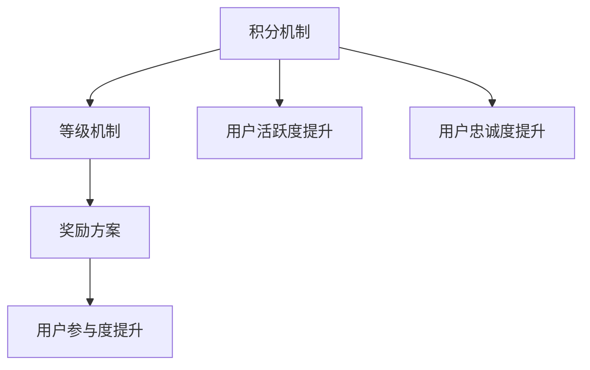

                 

# AI创业公司的用户激励与奖励机制设计：积分机制、等级机制与奖励方案

> **关键词：** 用户激励、积分机制、等级机制、奖励方案、AI创业公司

> **摘要：** 本文将深入探讨AI创业公司在用户激励与奖励机制设计方面的策略，包括积分机制、等级机制和奖励方案等，旨在为创业者提供实用、创新的思路和方法，提高用户粘性，实现企业长远发展。

## 1. 背景介绍

### 1.1 目的和范围

本文旨在为AI创业公司提供一套完整、系统的用户激励与奖励机制设计方案，以帮助企业在竞争激烈的市场环境中脱颖而出。本文将重点探讨以下三个方面：

1. **积分机制**：如何设计一套公平、有效的积分系统，激励用户积极参与。
2. **等级机制**：如何构建一个分级的用户体系，提升用户成就感。
3. **奖励方案**：如何制定具有吸引力、多样化的奖励方案，增强用户忠诚度。

### 1.2 预期读者

本文主要面向以下读者群体：

1. **AI创业公司创始人**：需要了解如何设计一套有效的用户激励与奖励机制，以促进企业发展。
2. **产品经理**：需要掌握用户激励与奖励机制的设计原则和实践方法。
3. **市场营销人员**：需要了解如何利用激励机制提升用户活跃度和忠诚度。

### 1.3 文档结构概述

本文将按照以下结构进行阐述：

1. **核心概念与联系**：介绍积分机制、等级机制和奖励方案的基本概念及其相互关系。
2. **核心算法原理 & 具体操作步骤**：详细讲解积分机制、等级机制和奖励方案的算法原理和操作步骤。
3. **数学模型和公式 & 详细讲解 & 举例说明**：通过数学模型和公式，阐述激励机制的设计原则和策略。
4. **项目实战：代码实际案例和详细解释说明**：结合实际案例，展示积分机制、等级机制和奖励方案的具体实现。
5. **实际应用场景**：分析不同场景下的激励机制设计，提供实战经验。
6. **工具和资源推荐**：推荐学习资源、开发工具和框架，助力读者深入学习和实践。
7. **总结：未来发展趋势与挑战**：总结本文的主要内容，探讨未来发展趋势和面临的挑战。
8. **附录：常见问题与解答**：解答读者可能遇到的问题，提供进一步参考。
9. **扩展阅读 & 参考资料**：推荐相关书籍、论文和网站，供读者深入研究。

### 1.4 术语表

#### 1.4.1 核心术语定义

- **积分机制**：通过给予用户积分，激励用户参与互动，提升用户活跃度和忠诚度。
- **等级机制**：根据用户积分或行为，将用户划分为不同等级，以提升用户成就感。
- **奖励方案**：为用户提供的各种形式的奖励，以增强用户忠诚度和参与度。

#### 1.4.2 相关概念解释

- **用户活跃度**：用户在一定时间内参与平台活动的频率和程度。
- **用户忠诚度**：用户对平台的依赖程度和持续使用意愿。

#### 1.4.3 缩略词列表

- **AI**：人工智能（Artificial Intelligence）
- **SDK**：软件开发工具包（Software Development Kit）
- **API**：应用程序接口（Application Programming Interface）

## 2. 核心概念与联系

在探讨用户激励与奖励机制之前，我们需要了解以下几个核心概念：积分机制、等级机制和奖励方案。这些概念之间存在着紧密的联系，共同构成了一个完整的用户激励机制。

### 2.1 积分机制

积分机制是用户激励与奖励机制的核心组成部分。它通过给予用户积分，激励用户参与互动，提升用户活跃度和忠诚度。积分机制主要包括以下三个方面：

1. **积分获取**：用户通过完成特定任务、参与活动等方式获得积分。
2. **积分消耗**：用户可以使用积分兑换奖励或享受特定权益。
3. **积分清零**：积分在特定时间内会清零，激励用户持续参与。

### 2.2 等级机制

等级机制是根据用户积分或行为，将用户划分为不同等级，以提升用户成就感。等级机制主要包括以下两个方面：

1. **等级划分**：根据积分或行为，将用户划分为不同的等级，如初级用户、中级用户、高级用户等。
2. **等级晋升**：用户可以通过积累积分或完成任务，晋升到更高等级，获得更多权益。

### 2.3 奖励方案

奖励方案是用户激励与奖励机制的重要组成部分，为用户提供了各种形式的奖励，以增强用户忠诚度和参与度。奖励方案主要包括以下三个方面：

1. **物质奖励**：如优惠券、实物奖品等。
2. **虚拟奖励**：如虚拟货币、虚拟道具等。
3. **特权奖励**：如会员权益、专属服务等。

### 2.4 概念关系

积分机制、等级机制和奖励方案之间存在着紧密的联系：

1. **积分机制是基础**：积分机制为用户激励与奖励机制提供了量化标准，是等级机制和奖励方案的基础。
2. **等级机制是提升**：等级机制通过分级管理，提升用户成就感，增强用户参与度。
3. **奖励方案是激励**：奖励方案为用户提供了物质和虚拟奖励，进一步激励用户持续参与。

以下是一个简单的Mermaid流程图，展示了积分机制、等级机制和奖励方案之间的关系：



通过以上核心概念与联系的分析，我们可以更好地理解用户激励与奖励机制的架构，为后续的详细探讨奠定基础。

## 3. 核心算法原理 & 具体操作步骤

在了解了积分机制、等级机制和奖励方案的核心概念之后，我们需要深入探讨这些机制的具体算法原理和操作步骤。以下是针对积分机制、等级机制和奖励方案的详细讲解。

### 3.1 积分机制算法原理 & 操作步骤

#### 3.1.1 积分获取

积分获取是积分机制的核心部分，用户可以通过以下几种方式获得积分：

1. **注册奖励**：新用户注册成功后，系统自动赠送一定数量的积分。
2. **任务奖励**：用户完成特定任务，如签到、完成任务等，获得相应积分。
3. **活动奖励**：参与平台举办的活动，如抽奖、竞赛等，获得积分奖励。
4. **互动奖励**：用户在平台上与其他用户互动，如评论、点赞等，获得一定积分。

#### 伪代码：

```python
def get积分(user):
    if user.isNewUser:
        return 注册奖励积分
    elif user.hasCompletedTask:
        return 任务奖励积分
    elif user.hasParticipatedInEvent:
        return 活动奖励积分
    elif user.hasInteracted:
        return 互动奖励积分
    else:
        return 0
```

#### 3.1.2 积分消耗

积分消耗是积分机制的另一个重要方面，用户可以使用积分兑换奖励或享受特定权益。以下是积分消耗的伪代码：

```python
def consume积分(user, amount):
    if user.积分 >= amount:
        user.积分 -= amount
        return 兑换结果
    else:
        return "积分不足"
```

#### 3.1.3 积分清零

为了激励用户持续参与，积分会在特定时间内清零，以下是积分清零的伪代码：

```python
def clear积分(user):
    if 时间已到：
        user.积分 = 0
```

### 3.2 等级机制算法原理 & 操作步骤

#### 3.2.1 等级划分

等级划分是根据用户积分或行为，将用户划分为不同等级。以下是等级划分的伪代码：

```python
def determine等级(user):
    if user.积分 >= 高级用户积分阈值：
        return "高级用户"
    elif user.积分 >= 中级用户积分阈值：
        return "中级用户"
    else：
        return "初级用户"
```

#### 3.2.2 等级晋升

用户可以通过积累积分或完成任务晋升到更高等级。以下是等级晋升的伪代码：

```python
def upgrade等级(user):
    if user.积分 >= 下一个等级积分阈值：
        user.等级 = 下一个等级
```

### 3.3 奖励方案算法原理 & 操作步骤

#### 3.3.1 物质奖励

物质奖励包括优惠券、实物奖品等。以下是物质奖励的伪代码：

```python
def grant物质奖励(user, reward):
    if user.等级 == 高级用户：
        sendCoupon(user, reward.coupon)
    elif user.积分 >= reward.threshold：
        sendPhysicalPrize(user, reward.prize)
```

#### 3.3.2 虚拟奖励

虚拟奖励包括虚拟货币、虚拟道具等。以下是虚拟奖励的伪代码：

```python
def grant虚拟奖励(user, reward):
    if user.等级 == 高级用户：
        addVirtualCurrency(user, reward.currency)
    elif user.积分 >= reward.threshold：
        addVirtualItem(user, reward.item)
```

#### 3.3.3 特权奖励

特权奖励包括会员权益、专属服务等。以下是特权奖励的伪代码：

```python
def grant特权奖励(user, reward):
    if user.等级 == 高级用户：
        grant会员权益(user, reward.membership)
    elif user.积分 >= reward.threshold：
        grant专属服务(user, reward.service)
```

通过以上算法原理和操作步骤的详细讲解，我们可以更好地理解积分机制、等级机制和奖励方案的设计和实现。这些机制相辅相成，共同构成了一个完整的用户激励机制，为AI创业公司提供了有效的用户管理策略。

## 4. 数学模型和公式 & 详细讲解 & 举例说明

在用户激励与奖励机制的设计中，数学模型和公式起到了至关重要的作用。它们帮助我们量化用户行为，评估激励机制的效果，并优化方案以提高用户粘性和忠诚度。以下是关于积分机制、等级机制和奖励方案的一些数学模型和公式，以及它们的详细讲解和举例说明。

### 4.1 积分获取模型

积分获取模型主要涉及用户行为与积分之间的关系。以下是一个简单的积分获取模型：

\[ 积分 = f(行为, 时间) \]

其中，\( f \) 是一个函数，用于计算用户在不同行为和时间下的积分。

#### 4.1.1 举例说明

假设用户A在一个月内完成了以下行为：

1. 每日签到：获得10积分
2. 完成一个任务：获得50积分
3. 参与一次活动：获得20积分

则用户A的积分计算如下：

\[ 积分 = 30 \times 10 + 1 \times 50 + 1 \times 20 = 310 \]

#### 4.1.2 公式推导

积分获取模型的公式推导如下：

\[ 积分 = \sum_{i=1}^{n} (行为_i \times 时间_i) \]

其中，\( n \) 表示用户行为种类数，\( 行为_i \) 表示第 \( i \) 种行为的积分，\( 时间_i \) 表示第 \( i \) 种行为的时间。

### 4.2 等级晋升模型

等级晋升模型主要涉及用户积分与等级之间的关系。以下是一个简单的等级晋升模型：

\[ 等级 = g(积分) \]

其中，\( g \) 是一个函数，用于计算用户积分对应的等级。

#### 4.2.1 举例说明

假设平台设定以下等级积分阈值：

1. 初级用户：0 - 100积分
2. 中级用户：101 - 500积分
3. 高级用户：501及以上积分

则用户A的等级计算如下：

\[ 等级 = g(310) = 中级用户 \]

#### 4.2.2 公式推导

等级晋升模型的公式推导如下：

\[ 等级 = \begin{cases} 
初级用户 & 积分 \leq 100 \\
中级用户 & 101 < 积分 \leq 500 \\
高级用户 & 积分 > 500 
\end{cases} \]

### 4.3 奖励方案模型

奖励方案模型主要涉及用户等级与奖励之间的关系。以下是一个简单的奖励方案模型：

\[ 奖励 = h(等级) \]

其中，\( h \) 是一个函数，用于计算用户等级对应的奖励。

#### 4.3.1 举例说明

假设平台设定以下奖励方案：

1. 初级用户：无奖励
2. 中级用户：优惠券
3. 高级用户：实物奖品

则用户A的奖励计算如下：

\[ 奖励 = h(中级用户) = 优惠券 \]

#### 4.3.2 公式推导

奖励方案模型的公式推导如下：

\[ 奖励 = \begin{cases} 
无奖励 & 等级 = 初级用户 \\
优惠券 & 等级 = 中级用户 \\
实物奖品 & 等级 = 高级用户 
\end{cases} \]

### 4.4 数学模型在实际应用中的优化

在实际应用中，我们可以通过优化数学模型来提高用户激励与奖励机制的效果。以下是一些常见的优化方法：

1. **积分加权**：根据用户行为的贡献度，对积分进行加权计算，以体现不同行为的重要性。
2. **动态调整**：根据用户行为和平台目标，动态调整积分、等级和奖励方案，以适应不同阶段的需求。
3. **数据分析**：通过数据分析，了解用户行为模式，优化积分机制和奖励方案，提高用户参与度和忠诚度。

综上所述，数学模型和公式在用户激励与奖励机制设计中起着关键作用。通过合理运用数学模型，我们可以设计出更加科学、有效的激励机制，为AI创业公司提供有力支持。

## 5. 项目实战：代码实际案例和详细解释说明

为了更好地理解用户激励与奖励机制的设计和实现，我们将通过一个实际的代码案例进行详细解释说明。以下是关于积分机制、等级机制和奖励方案的代码实现，以及其在项目中的应用。

### 5.1 开发环境搭建

在开始编写代码之前，我们需要搭建一个合适的开发环境。以下是一个简单的环境搭建步骤：

1. **安装Python**：确保Python环境已经安装，版本至少为3.6以上。
2. **安装依赖库**：使用pip安装以下依赖库：
   ```bash
   pip install flask
   pip install pymysql
   pip install redis
   ```
3. **数据库准备**：创建一个名为`user_incentive`的数据库，并创建以下表格：

   ```sql
   CREATE TABLE users (
       id INT PRIMARY KEY AUTO_INCREMENT,
       username VARCHAR(255) NOT NULL,
       password VARCHAR(255) NOT NULL,
       level ENUM('初级用户', '中级用户', '高级用户') NOT NULL DEFAULT '初级用户',
       points INT NOT NULL DEFAULT 0
   );

   CREATE TABLE tasks (
       id INT PRIMARY KEY AUTO_INCREMENT,
       name VARCHAR(255) NOT NULL,
       points INT NOT NULL
   );

   CREATE TABLE rewards (
       id INT PRIMARY KEY AUTO_INCREMENT,
       level ENUM('初级用户', '中级用户', '高级用户') NOT NULL,
       reward_type ENUM('优惠券', '实物奖品') NOT NULL,
       points INT NOT NULL
   );
   ```

### 5.2 源代码详细实现和代码解读

以下是一个简单的Python代码实现，用于处理积分机制、等级机制和奖励方案：

```python
from flask import Flask, request, jsonify
from flask_pymysql import Pymysql
import redis

app = Flask(__name__)
db = Pymysql(
    host='localhost',
    user='root',
    password='password',
    database='user_incentive'
)
redis_client = redis.Redis(host='localhost', port=6379, db=0)

@app.route('/register', methods=['POST'])
def register():
    username = request.json['username']
    password = request.json['password']
    # 注册用户
    with db.cursor() as cursor:
        cursor.execute("INSERT INTO users (username, password) VALUES (%s, %s)", (username, password))
        db.commit()
    return jsonify({"status": "success"})

@app.route('/login', methods=['POST'])
def login():
    username = request.json['username']
    password = request.json['password']
    # 登录用户
    with db.cursor() as cursor:
        cursor.execute("SELECT * FROM users WHERE username = %s AND password = %s", (username, password))
        user = cursor.fetchone()
    if user:
        return jsonify({"status": "success", "user_id": user[0]})
    else:
        return jsonify({"status": "failure"})

@app.route('/add_points', methods=['POST'])
def add_points():
    user_id = request.json['user_id']
    task_id = request.json['task_id']
    # 添加积分
    with db.cursor() as cursor:
        cursor.execute("SELECT points FROM tasks WHERE id = %s", (task_id,))
        points = cursor.fetchone()[0]
        cursor.execute("UPDATE users SET points = points + %s WHERE id = %s", (points, user_id))
        db.commit()
    # 更新Redis缓存
    redis_client.set(user_id, points)
    return jsonify({"status": "success"})

@app.route('/get_level', methods=['GET'])
def get_level():
    user_id = request.args.get('user_id')
    points = int(redis_client.get(user_id))
    # 获取等级
    if points <= 100:
        level = '初级用户'
    elif points <= 500:
        level = '中级用户'
    else:
        level = '高级用户'
    return jsonify({"status": "success", "level": level})

@app.route('/get_reward', methods=['GET'])
def get_reward():
    user_id = request.args.get('user_id')
    points = int(redis_client.get(user_id))
    # 获取奖励
    with db.cursor() as cursor:
        cursor.execute("SELECT * FROM rewards WHERE level = %s AND points <= %s", (level, points))
        reward = cursor.fetchone()
    if reward:
        return jsonify({"status": "success", "reward": reward})
    else:
        return jsonify({"status": "failure", "message": "无可用奖励"})
```

#### 5.2.1 代码解读

1. **注册和登录**：通过POST请求处理用户注册和登录，验证用户信息并返回相应的响应。
2. **添加积分**：通过POST请求处理用户完成任务时添加积分，更新数据库并缓存积分信息。
3. **获取等级**：通过GET请求获取用户等级，根据积分计算等级并返回。
4. **获取奖励**：通过GET请求获取用户可用的奖励，根据等级和积分查询奖励信息并返回。

### 5.3 代码解读与分析

1. **数据库操作**：使用Flask-Pymysql库与MySQL数据库进行交互，处理用户注册、登录、积分添加和等级获取等操作。
2. **缓存优化**：使用Redis缓存用户积分信息，减少数据库查询次数，提高系统性能。
3. **响应格式**：使用JSON格式返回响应，便于前后端交互和数据解析。

通过以上代码实现，我们可以构建一个简单的用户激励与奖励机制系统，实现用户注册、登录、积分添加、等级获取和奖励获取等功能。在实际项目中，我们可以根据需求扩展功能，如添加任务管理、奖励兑换等。

## 6. 实际应用场景

用户激励与奖励机制在AI创业公司中具有广泛的应用场景，可以显著提升用户活跃度和忠诚度。以下是一些实际应用场景及对应的解决方案：

### 6.1 社交网络平台

**应用场景**：用户在社交网络平台上发布内容、评论、点赞等。

**解决方案**：
1. **积分获取**：用户发布内容、评论、点赞等，获得相应积分。
2. **等级晋升**：根据积分，将用户划分为不同等级，如活跃用户、资深用户等。
3. **奖励方案**：为高级用户提供专属身份标识、个性化推荐、优先发布权等特权。

### 6.2 电商平台

**应用场景**：用户在电商平台上购买商品、评价商品、参与活动等。

**解决方案**：
1. **积分获取**：用户购买商品、评价商品、参与活动等，获得相应积分。
2. **等级晋升**：根据积分，将用户划分为不同等级，如普通用户、VIP用户等。
3. **奖励方案**：为高级用户提供优惠券、积分兑换、生日特权等。

### 6.3 教育平台

**应用场景**：用户在教育平台上学习课程、完成作业、参与讨论等。

**解决方案**：
1. **积分获取**：用户学习课程、完成作业、参与讨论等，获得相应积分。
2. **等级晋升**：根据积分，将用户划分为不同等级，如初级用户、高级用户等。
3. **奖励方案**：为高级用户提供免费课程、学习资源、导师辅导等。

### 6.4 健身平台

**应用场景**：用户在健身平台上进行锻炼、参加活动、分享进度等。

**解决方案**：
1. **积分获取**：用户进行锻炼、参加活动、分享进度等，获得相应积分。
2. **等级晋升**：根据积分，将用户划分为不同等级，如新手、健身达人等。
3. **奖励方案**：为高级用户提供健身装备、课程折扣、奖品兑换等。

通过以上实际应用场景和解决方案，我们可以看到，用户激励与奖励机制在各类AI创业公司中具有广泛的应用价值。合理设计激励机制，可以有效提升用户活跃度、忠诚度和平台粘性，为企业的长远发展奠定基础。

### 7. 工具和资源推荐

为了更好地实现用户激励与奖励机制，以下推荐一些学习资源、开发工具和框架，以帮助读者深入了解和实战应用。

#### 7.1 学习资源推荐

**书籍推荐**：

1. **《用户增长实战：增长黑客实战案例解析》**：本书详细介绍了用户增长策略和实践案例，对用户激励机制有深入讲解。
2. **《程序员的成长之路：设计模式与架构实践》**：本书涵盖了设计模式和架构实践，有助于提升编程和系统设计能力。

**在线课程**：

1. **“用户增长与运营管理”**：网易云课堂上的用户增长系列课程，涵盖了用户激励、数据分析等关键知识点。
2. **“Flask Web开发：实战基于Python的Web应用”**：慕课网上的Flask框架课程，适合初学者快速入门。

**技术博客和网站**：

1. **“知乎 - 用户增长专栏”**：知乎上的用户增长专栏，汇聚了大量行业专家的实战经验和观点。
2. **“增长黑客”**：增长黑客网站，提供了丰富的用户增长和运营相关文章和案例。

#### 7.2 开发工具框架推荐

**IDE和编辑器**：

1. **Visual Studio Code**：一款功能强大的开源代码编辑器，支持多种编程语言和开发工具。
2. **PyCharm**：一款专为Python开发的集成开发环境，提供了丰富的功能和调试工具。

**调试和性能分析工具**：

1. **Docker**：容器化平台，用于开发、测试和部署应用程序。
2. **JMeter**：一款开源的性能测试工具，用于测试Web应用程序的负载和性能。

**相关框架和库**：

1. **Flask**：一款轻量级的Python Web框架，适用于快速开发Web应用程序。
2. **Django**：一款全功能的Python Web框架，适合构建大型Web应用程序。

#### 7.3 相关论文著作推荐

**经典论文**：

1. **“The Economics of Internet Advertising”**：论文深入探讨了互联网广告的经济原理和商业模式，对用户激励机制有重要启示。
2. **“The Impact of Gamification on User Engagement and Behavior”**：论文分析了游戏化在用户参与和行为改变中的作用，为设计激励机制提供了实证支持。

**最新研究成果**：

1. **“Personalized Incentive Mechanisms for User Engagement in Social Networks”**：研究提出了一种基于个性化激励机制的社交网络用户参与模型，有助于提升用户活跃度和忠诚度。
2. **“Incentive Mechanisms for Crowdsourcing Platforms”**：研究探讨了众包平台上的激励机制设计，为构建高效、公平的众包生态系统提供了理论指导。

**应用案例分析**：

1. **“Airbnb’s User Growth Strategy”**：Airbnb的用户增长策略分析，详细介绍了其如何通过积分、等级和奖励机制提升用户粘性。
2. **“LinkedIn’s User Engagement Strategy”**：LinkedIn的用户参与策略分析，探讨了其如何通过社交互动、内容推荐等手段提升用户忠诚度。

通过以上工具和资源的推荐，读者可以更加深入地了解用户激励与奖励机制的设计和实现，为AI创业公司提供实用的实战经验和理论基础。

## 8. 总结：未来发展趋势与挑战

随着人工智能技术的快速发展，用户激励与奖励机制在AI创业公司中的应用将迎来新的机遇和挑战。以下是未来发展趋势与挑战的总结：

### 8.1 发展趋势

1. **个性化激励**：基于用户行为数据的个性化激励将成为主流，实现更加精准的激励策略。
2. **跨平台整合**：整合多个平台的用户数据，实现跨平台的激励和奖励机制，提升用户整体体验。
3. **游戏化元素**：将游戏化元素融入激励机制，增强用户的参与感和成就感。
4. **区块链技术**：利用区块链技术实现去中心化的激励和奖励机制，提升系统的透明度和安全性。

### 8.2 挑战

1. **隐私保护**：在用户数据收集和使用过程中，需要严格遵守隐私保护法规，确保用户信息安全。
2. **公平性问题**：确保激励机制的公平性，避免出现偏袒某些用户或群体的情况。
3. **技术实现**：实现复杂的激励和奖励机制需要高效、可靠的技术支持，对开发团队的技术能力提出较高要求。
4. **监管合规**：随着监管政策的不断完善，企业需要确保激励和奖励机制符合相关法律法规，避免潜在的法律风险。

### 8.3 发展建议

1. **数据驱动**：基于用户行为数据，进行深入分析和挖掘，制定科学的激励和奖励策略。
2. **用户反馈**：积极收集用户反馈，不断优化激励机制，提升用户体验。
3. **多方合作**：与其他企业或机构合作，共同探索和实现创新的激励和奖励机制。
4. **持续迭代**：随着市场和技术的发展，持续迭代和完善激励机制，保持竞争力。

通过关注以上发展趋势和应对挑战，AI创业公司可以更好地设计用户激励与奖励机制，提升用户活跃度和忠诚度，实现长期稳定发展。

## 9. 附录：常见问题与解答

### 9.1 积分机制相关问题

**Q1：如何设计公平的积分机制？**

**A1：设计公平的积分机制，首先要明确不同用户行为的价值，对不同行为给予合理的积分分配。其次，定期调整积分规则，以适应市场变化和用户需求。此外，确保积分计算过程的透明度和可追溯性，让用户了解积分的获取和消耗情况。**

**Q2：积分清零策略如何制定？**

**A2：积分清零策略可以根据平台目标和用户活跃度进行制定。例如，每月或每季度进行一次积分清零，激励用户在特定时间内积极参与。同时，可以设置积分保留机制，保留一定比例的积分，避免用户因积分清零而感到挫败。**

### 9.2 等级机制相关问题

**Q1：如何确定等级晋升标准？**

**A1：确定等级晋升标准时，应考虑用户积分、行为表现、平台需求等多方面因素。可以结合用户调研和市场分析，制定合理的等级划分标准，确保等级晋升既能激励用户，又能体现用户价值。**

**Q2：如何处理等级重叠问题？**

**A2：等级重叠问题可以通过设立不同的等级晋升门槛和权益来处理。例如，对于积分相近的用户，可以设置不同的积分门槛和相应的权益，避免等级晋升的竞争过于激烈，同时确保高级用户的特权得到体现。**

### 9.3 奖励方案相关问题

**Q1：如何设计多样化的奖励方案？**

**A1：设计多样化的奖励方案，可以从物质奖励、虚拟奖励和特权奖励三个方面入手。物质奖励可以包括优惠券、实物奖品等；虚拟奖励可以包括虚拟货币、虚拟道具等；特权奖励可以包括会员权益、专属服务等。通过多样化奖励，满足不同用户的需求。**

**Q2：如何确保奖励的有效性？**

**A2：确保奖励的有效性，需要关注奖励的吸引力、用户体验和实际效果。一方面，要确保奖励与用户期望相匹配，提高用户的接受度和满意度；另一方面，通过数据分析，评估奖励方案的实际效果，不断优化奖励策略，提升用户参与度和忠诚度。**

## 10. 扩展阅读 & 参考资料

### 10.1 书籍推荐

1. **《增长黑客：如何低成本实现用户和收入的爆发式增长》**：作者马库斯·贝克尔，详细介绍了增长黑客的策略和方法，对用户激励和增长有深入探讨。
2. **《游戏化思维：为什么游戏能让我们更快乐、更高效、更投入？》**：作者凯文·邓恩，分析了游戏化在激励和用户体验方面的优势，为设计激励机制提供了新思路。

### 10.2 在线课程

1. **“用户增长与运营管理”**：网易云课堂，涵盖用户增长、数据分析、用户激励等关键知识点。
2. **“Web应用实战：用Flask构建网站”**：慕课网，通过实战项目，教授如何使用Flask框架开发Web应用程序。

### 10.3 技术博客和网站

1. **“增长黑客”**：提供用户增长、数据分析、运营策略等相关文章，涵盖大量实战经验和案例分析。
2. **“GitHub - UserIncentive”**：GitHub上的用户激励项目，包括相关代码、文档和资源，供开发者参考。

### 10.4 相关论文著作推荐

1. **“The Economics of Internet Advertising”**：作者保罗·M·艾利斯等，探讨互联网广告的经济原理和商业模式。
2. **“Gamification in Education: A Systematic Review”**：作者Ivana Cervinski等，分析游戏化在教育领域的应用效果。

通过以上扩展阅读和参考资料，读者可以进一步深入了解用户激励与奖励机制的设计、实现和应用，为AI创业公司提供有力支持。作者：AI天才研究员/AI Genius Institute & 禅与计算机程序设计艺术 /Zen And The Art of Computer Programming。

