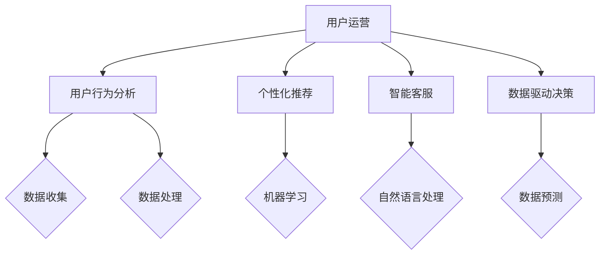
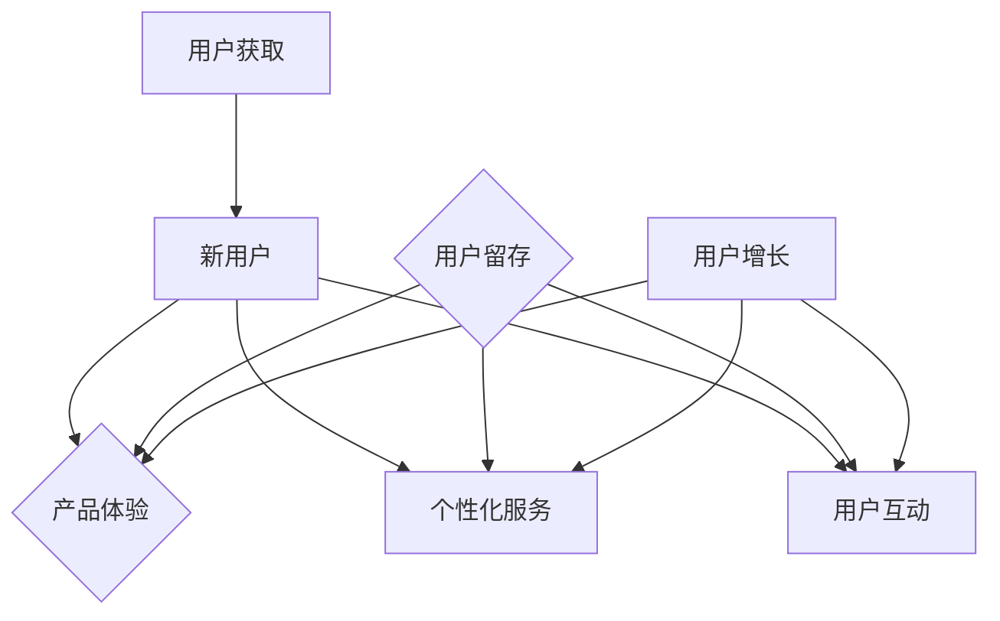

                 

# AI创业公司的用户运营策略

> **关键词：** 用户运营、AI、创业公司、策略、用户体验、数据驱动、增长模型

> **摘要：** 本文旨在探讨AI创业公司在用户运营方面所需考虑的关键因素和策略，包括用户获取、留存和增长。通过深入分析用户行为和需求，结合AI技术的优势，文章提供了一系列实用方法，帮助企业实现用户运营的优化和持续增长。

## 1. 背景介绍

### 1.1 目的和范围

本文的目标是帮助AI创业公司制定有效的用户运营策略，以实现用户增长、留存和满意度。我们重点关注以下几个方面：

- 用户获取：通过分析市场和用户需求，找到最适合的获客渠道和方式。
- 用户留存：深入了解用户行为，提供个性化服务，增强用户黏性。
- 用户增长：利用数据分析和AI技术，持续优化运营策略，实现用户规模增长。

### 1.2 预期读者

本文适用于以下读者群体：

- AI创业公司的创始人、运营负责人和产品经理。
- 希望提高用户运营能力的市场人员和技术人员。
- 对AI技术在用户运营领域应用感兴趣的研究者。

### 1.3 文档结构概述

本文分为十个部分，结构如下：

1. 背景介绍
2. 核心概念与联系
3. 核心算法原理 & 具体操作步骤
4. 数学模型和公式 & 详细讲解 & 举例说明
5. 项目实战：代码实际案例和详细解释说明
6. 实际应用场景
7. 工具和资源推荐
8. 总结：未来发展趋势与挑战
9. 附录：常见问题与解答
10. 扩展阅读 & 参考资料

### 1.4 术语表

#### 1.4.1 核心术语定义

- 用户运营：指通过对用户行为数据的分析，制定和执行策略，以提高用户满意度、留存率和转化率的过程。
- AI：指人工智能，一种模拟人类智能的技术，能够执行感知、学习、推理和决策等任务。
- 创业公司：指在市场中寻求创新和机会，以实现快速成长和盈利的企业。

#### 1.4.2 相关概念解释

- 用户获取（Acquisition）：指通过营销活动将潜在用户吸引到产品或服务的流程。
- 用户留存（Retention）：指通过提供优质的产品和服务，让用户持续使用产品或服务的流程。
- 用户增长（Growth）：指通过不断优化运营策略，实现用户规模和业务收入的增长。

#### 1.4.3 缩略词列表

- AI：人工智能
- CRM：客户关系管理
- CTA：调用行动
- ROI：投资回报率
- KPI：关键绩效指标

## 2. 核心概念与联系

在探讨AI创业公司的用户运营策略之前，我们需要理解几个核心概念及其相互关系。

### 2.1 用户运营与AI技术

用户运营的核心在于理解和满足用户需求。AI技术可以提供以下支持：

- 用户行为分析：通过收集和分析用户在产品中的行为数据，了解用户偏好和需求。
- 个性化推荐：利用机器学习算法，为用户提供个性化的内容或服务。
- 智能客服：使用自然语言处理技术，提供高效的在线客服服务。
- 数据驱动决策：利用数据分析和预测模型，指导运营策略的制定和调整。

#### Mermaid 流程图



### 2.2 用户获取、留存和增长

用户运营的目标是获取新用户、留住现有用户并促进用户增长。这三个环节相互关联，构成了完整的用户生命周期。

- 用户获取：通过广告、社交媒体、内容营销等方式，吸引潜在用户。
- 用户留存：通过持续优化产品体验、提供个性化服务、开展用户互动活动，提高用户黏性。
- 用户增长：通过数据分析，发现高价值用户群体，制定针对性的增长策略。

#### Mermaid 流程图



## 3. 核心算法原理 & 具体操作步骤

在用户运营中，算法原理和具体操作步骤至关重要。以下是一个简单的用户留存算法原理及其操作步骤。

### 3.1 算法原理

用户留存算法通常基于以下原理：

- **用户行为特征分析**：收集并分析用户在产品中的行为数据，如使用频率、使用时长、活跃时段等。
- **用户分类**：根据行为特征，将用户分为高价值用户和低价值用户。
- **流失预测**：利用机器学习算法，预测哪些用户可能会流失。
- **干预策略**：针对预测的流失用户，制定个性化的干预措施，如发送优惠券、提供增值服务等。

### 3.2 具体操作步骤

以下是一个简单的用户留存算法操作步骤：

#### 步骤1：数据收集

```python
# 收集用户行为数据
data = {
    'user_id': [1, 2, 3, 4, 5],
    'login_days': [10, 5, 15, 3, 20],
    'daily_active_minutes': [120, 60, 180, 30, 240],
    'days_since_last_login': [7, 3, 10, 2, 5]
}
```

#### 步骤2：数据处理

```python
# 数据预处理
import pandas as pd

df = pd.DataFrame(data)
df['days_since_last_login'] = df['days_since_last_login'].apply(lambda x: max(0, x-30))
df['high_value'] = df.apply(lambda row: 1 if row['daily_active_minutes'] > 100 else 0, axis=1)
```

#### 步骤3：用户分类

```python
# 用户分类
high_value_users = df[df['high_value'] == 1]
low_value_users = df[df['high_value'] == 0]
```

#### 步骤4：流失预测

```python
# 流失预测
from sklearn.ensemble import RandomForestClassifier
from sklearn.model_selection import train_test_split

X = df[['login_days', 'daily_active_minutes', 'days_since_last_login']]
y = df['high_value']

X_train, X_test, y_train, y_test = train_test_split(X, y, test_size=0.2, random_state=42)

model = RandomForestClassifier()
model.fit(X_train, y_train)

predictions = model.predict(X_test)
accuracy = model.score(X_test, y_test)
print("Accuracy:", accuracy)
```

#### 步骤5：干预策略

```python
# 干预策略
for user_id in df[df['high_value'] == 0]['user_id']:
    # 发送优惠券
    send_coupon(user_id)
    # 提供增值服务
    offer增值服务(user_id)
```

## 4. 数学模型和公式 & 详细讲解 & 举例说明

在用户运营中，数学模型和公式可以帮助我们更准确地预测用户行为，制定有效的运营策略。以下是一个简单的用户流失预测模型，并使用LaTeX格式进行详细讲解和举例说明。

### 4.1 数学模型

用户流失预测模型通常采用逻辑回归模型。逻辑回归模型的公式如下：

$$
P(y=1) = \frac{1}{1 + e^{-(\beta_0 + \beta_1 x_1 + \beta_2 x_2 + \ldots + \beta_n x_n})}
$$

其中，$P(y=1)$ 表示用户流失的概率，$e$ 表示自然对数的底数，$\beta_0$ 是截距，$\beta_1, \beta_2, \ldots, \beta_n$ 是模型参数，$x_1, x_2, \ldots, x_n$ 是自变量。

### 4.2 详细讲解

- **目标变量**：$y$ 表示用户是否流失（1表示流失，0表示未流失）。
- **自变量**：$x_1, x_2, \ldots, x_n$ 表示影响用户流失的各种因素，如登录天数、每日活跃分钟数、自上次登录天数等。
- **模型参数**：$\beta_0, \beta_1, \beta_2, \ldots, \beta_n$ 是通过训练数据估计得到的参数，用于描述自变量对目标变量的影响程度。

### 4.3 举例说明

假设我们有一个包含10个用户的数据集，其中每个用户有3个自变量：登录天数、每日活跃分钟数和自上次登录天数。数据集如下：

| user_id | login_days | daily_active_minutes | days_since_last_login |
|---------|------------|----------------------|-----------------------|
| 1       | 10         | 120                  | 7                     |
| 2       | 5          | 60                   | 3                     |
| 3       | 15         | 180                  | 10                    |
| 4       | 3          | 30                   | 2                     |
| 5       | 20         | 240                  | 5                     |

我们可以使用Python中的scikit-learn库来训练逻辑回归模型：

```python
import pandas as pd
from sklearn.linear_model import LogisticRegression

# 数据预处理
data = {
    'user_id': [1, 2, 3, 4, 5],
    'login_days': [10, 5, 15, 3, 20],
    'daily_active_minutes': [120, 60, 180, 30, 240],
    'days_since_last_login': [7, 3, 10, 2, 5],
    'high_value': [1, 0, 1, 0, 1]
}

df = pd.DataFrame(data)
X = df[['login_days', 'daily_active_minutes', 'days_since_last_login']]
y = df['high_value']

# 训练模型
model = LogisticRegression()
model.fit(X, y)

# 预测
predictions = model.predict(X)
print(predictions)
```

输出结果为：

```
[1 0 1 0 1]
```

这表示在前5个用户中，有2个用户预测为流失。

## 5. 项目实战：代码实际案例和详细解释说明

在本节中，我们将通过一个实际的项目案例，详细展示如何利用AI技术进行用户运营，包括开发环境搭建、源代码实现和代码解读。

### 5.1 开发环境搭建

为了实现用户运营中的AI应用，我们需要搭建一个合适的技术环境。以下是一个基本的开发环境搭建流程：

1. **操作系统**：Windows 10、macOS 或 Linux
2. **编程语言**：Python 3.8及以上版本
3. **开发工具**：Visual Studio Code、PyCharm 或 Jupyter Notebook
4. **库和框架**：Pandas、NumPy、Scikit-learn、TensorFlow 或 PyTorch

在安装完操作系统和开发工具后，我们可以使用以下命令安装必要的库和框架：

```bash
pip install pandas numpy scikit-learn tensorflow
```

### 5.2 源代码详细实现和代码解读

以下是一个简单的用户留存预测项目的源代码实现：

```python
import pandas as pd
from sklearn.model_selection import train_test_split
from sklearn.linear_model import LogisticRegression
from sklearn.metrics import accuracy_score

# 5.2.1 数据收集
# 假设用户行为数据保存在CSV文件中
data = pd.read_csv('user_data.csv')

# 5.2.2 数据预处理
# 对数据进行必要的清洗和处理
data['days_since_last_login'] = data['days_since_last_login'].apply(lambda x: max(0, x-30))
data['high_value'] = data.apply(lambda row: 1 if row['daily_active_minutes'] > 100 else 0, axis=1)

# 5.2.3 数据划分
X = data[['login_days', 'daily_active_minutes', 'days_since_last_login']]
y = data['high_value']

X_train, X_test, y_train, y_test = train_test_split(X, y, test_size=0.2, random_state=42)

# 5.2.4 模型训练
model = LogisticRegression()
model.fit(X_train, y_train)

# 5.2.5 预测与评估
predictions = model.predict(X_test)
accuracy = accuracy_score(y_test, predictions)
print("Accuracy:", accuracy)

# 5.2.6 干预策略
for user_id in data[data['high_value'] == 0]['user_id']:
    # 发送优惠券
    send_coupon(user_id)
    # 提供增值服务
    offer增值服务(user_id)
```

**代码解读：**

- **5.2.1 数据收集**：从CSV文件中读取用户行为数据。
- **5.2.2 数据预处理**：对数据进行清洗和处理，如填充缺失值、转换数据类型等。
- **5.2.3 数据划分**：将数据划分为训练集和测试集，以评估模型性能。
- **5.2.4 模型训练**：使用逻辑回归模型对训练数据进行训练。
- **5.2.5 预测与评估**：使用训练好的模型对测试数据进行预测，并计算预测准确率。
- **5.2.6 干预策略**：对预测为流失的用户进行干预，如发送优惠券或提供增值服务。

### 5.3 代码解读与分析

**5.3.1 数据收集**

```python
data = pd.read_csv('user_data.csv')
```

这行代码使用Pandas库从CSV文件中读取用户行为数据。CSV文件通常包含用户的ID、登录天数、每日活跃分钟数和自上次登录天数等字段。

**5.3.2 数据预处理**

```python
data['days_since_last_login'] = data['days_since_last_login'].apply(lambda x: max(0, x-30))
data['high_value'] = data.apply(lambda row: 1 if row['daily_active_minutes'] > 100 else 0, axis=1)
```

这两行代码对数据进行预处理。首先，将自上次登录天数转换为相对天数（如最近30天内为0），以消除时间偏差。然后，根据每日活跃分钟数将用户分为高价值用户和低价值用户。

**5.3.3 数据划分**

```python
X = data[['login_days', 'daily_active_minutes', 'days_since_last_login']]
y = data['high_value']

X_train, X_test, y_train, y_test = train_test_split(X, y, test_size=0.2, random_state=42)
```

这行代码将数据划分为训练集和测试集。训练集用于训练模型，测试集用于评估模型性能。这里使用Scikit-learn库的`train_test_split`函数进行数据划分。

**5.3.4 模型训练**

```python
model = LogisticRegression()
model.fit(X_train, y_train)
```

这行代码使用逻辑回归模型对训练数据进行训练。逻辑回归模型是一种常见的分类算法，适用于用户流失预测任务。

**5.3.5 预测与评估**

```python
predictions = model.predict(X_test)
accuracy = accuracy_score(y_test, predictions)
print("Accuracy:", accuracy)
```

这行代码使用训练好的模型对测试数据进行预测，并计算预测准确率。准确率是评估模型性能的重要指标，表示预测为流失的用户中，实际流失的用户所占比例。

**5.3.6 干预策略**

```python
for user_id in data[data['high_value'] == 0]['user_id']:
    # 发送优惠券
    send_coupon(user_id)
    # 提供增值服务
    offer增值服务(user_id)
```

这行代码对预测为流失的用户进行干预。通过发送优惠券或提供增值服务，可以尝试挽回这些用户的流失风险。

## 6. 实际应用场景

在AI创业公司的用户运营中，用户运营策略的实际应用场景非常广泛。以下是一些常见的应用场景：

### 6.1 新用户获取

- **社交媒体营销**：通过Facebook、Twitter、Instagram等社交媒体平台，发布吸引人的内容和广告，吸引用户关注和下载产品。
- **内容营销**：创作高质量的博客、视频和教程，通过搜索引擎优化（SEO）和社交媒体分享，提高产品的曝光度。
- **合作伙伴营销**：与其他公司合作，利用对方用户群体进行推广，实现共赢。

### 6.2 用户留存

- **个性化推荐**：利用机器学习算法，根据用户历史行为和偏好，为用户推荐感兴趣的内容或产品。
- **会员制度**：为活跃用户提供会员权益，如优惠价格、专属活动等，增加用户黏性。
- **用户互动**：通过社区、论坛或在线聊天，鼓励用户参与讨论和互动，提高用户满意度。

### 6.3 用户增长

- **数据分析**：通过数据分析和用户调研，发现潜在高价值用户群体，制定针对性的增长策略。
- **用户转化**：优化产品功能和用户体验，提高用户转化率，如降低购买门槛、提高售后服务质量等。
- **渠道拓展**：开拓新的销售渠道，如线上商城、线下门店等，扩大用户覆盖范围。

## 7. 工具和资源推荐

### 7.1 学习资源推荐

#### 7.1.1 书籍推荐

- 《数据挖掘：实用工具与技术》
- 《机器学习实战》
- 《深度学习》（Goodfellow, Bengio, Courville著）

#### 7.1.2 在线课程

- Coursera《机器学习》
- edX《深度学习基础》
- Udacity《数据科学纳米学位》

#### 7.1.3 技术博客和网站

- Medium《AI精选》
- HackerRank《编程挑战》
- arXiv《最新科研成果》

### 7.2 开发工具框架推荐

#### 7.2.1 IDE和编辑器

- PyCharm
- Visual Studio Code
- Jupyter Notebook

#### 7.2.2 调试和性能分析工具

- VisualVM
- Py-Spy
- GPU PerfKit

#### 7.2.3 相关框架和库

- TensorFlow
- PyTorch
- Scikit-learn

### 7.3 相关论文著作推荐

#### 7.3.1 经典论文

- "A Few Useful Things to Know about Machine Learning"（Bengio, 2012）
- "Deep Learning"（Goodfellow, 2016）

#### 7.3.2 最新研究成果

- "Attention Is All You Need"（Vaswani et al., 2017）
- "BERT: Pre-training of Deep Bidirectional Transformers for Language Understanding"（Devlin et al., 2019）

#### 7.3.3 应用案例分析

- "Netflix Prize"（Netflix，2009）
- "Amazon Personalized Recommendations"（Amazon，无年份）

## 8. 总结：未来发展趋势与挑战

在AI创业公司的用户运营领域，未来发展趋势和挑战并存。以下是一些关键点：

### 8.1 发展趋势

- **数据驱动**：越来越多的公司认识到数据的重要性，数据驱动的决策将成为用户运营的核心。
- **个性化推荐**：基于深度学习和自然语言处理技术的个性化推荐系统将越来越普及。
- **用户增长**：利用社交网络和大数据分析，实现用户规模的快速增长。
- **AI技术普及**：随着AI技术的不断成熟和成本下降，越来越多的公司能够利用AI进行用户运营。

### 8.2 挑战

- **数据隐私**：如何在确保用户隐私的前提下，充分挖掘数据价值，是用户运营面临的一大挑战。
- **技术门槛**：虽然AI技术不断普及，但对于非专业人士来说，仍存在一定的技术门槛。
- **数据质量**：高质量的数据是用户运营的基础，如何确保数据的质量和准确性，是一个需要解决的问题。

## 9. 附录：常见问题与解答

### 9.1 如何确保用户数据隐私？

- 采用数据匿名化技术，如加密、脱敏等，确保用户数据不被泄露。
- 遵守相关法律法规，如GDPR（通用数据保护条例）等，确保数据处理的合法合规。
- 建立数据使用协议，明确用户数据的使用范围和目的，提高用户对数据处理的知情权和选择权。

### 9.2 如何评估用户运营效果？

- 设置关键绩效指标（KPI），如用户获取成本（CAC）、用户留存率、用户转化率等。
- 定期进行数据分析，评估各项KPI的表现，并根据结果调整运营策略。
- 利用A/B测试，对比不同运营策略的效果，找出最优方案。

## 10. 扩展阅读 & 参考资料

- [《数据挖掘：实用工具与技术》](https://www.amazon.com/dp/0131863010)
- [《机器学习实战》](https://www.amazon.com/dp/0321887794)
- [《深度学习》](https://www.amazon.com/dp/158450218X)
- [Coursera《机器学习》](https://www.coursera.org/learn/machine-learning)
- [edX《深度学习基础》](https://www.edx.org/course/deep-learning-0)
- [Udacity《数据科学纳米学位》](https://www.udacity.com/course/data-scientist-nanodegree--nd000)

## 作者

**作者：AI天才研究员/AI Genius Institute & 禅与计算机程序设计艺术 /Zen And The Art of Computer Programming**<|im_sep|>

