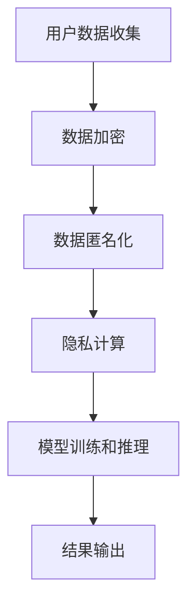

                 

# AI创业公司的用户隐私保护：数据安全与合规性

> **关键词：** 用户隐私保护，数据安全，合规性，AI创业公司，数据加密，数据匿名化，隐私计算，GDPR，CCPA

> **摘要：** 本文章旨在探讨AI创业公司在处理用户数据时所需关注的隐私保护问题。文章首先介绍了用户隐私保护的重要性，接着分析了当前数据安全与合规性的挑战。随后，文章详细阐述了用户隐私保护的核心概念、算法原理、数学模型，并提供了实际项目案例。最后，文章总结了未来发展趋势与挑战，并推荐了相关学习资源和工具。

## 1. 背景介绍

### 1.1 目的和范围

本文旨在帮助AI创业公司深入了解用户隐私保护的重要性和实现方法。我们将讨论用户隐私保护的核心概念，介绍数据安全与合规性的关键要素，并提供实际项目案例来展示如何在实际应用中保护用户隐私。

### 1.2 预期读者

本文适合对AI和隐私保护有一定了解的技术人员、产品经理和创业者。无论您是刚刚加入AI创业公司的新手，还是希望在现有项目中加强隐私保护，本文都将为您提供宝贵的指导和见解。

### 1.3 文档结构概述

本文分为十个部分：

1. 背景介绍：介绍文章目的、范围、预期读者和文档结构。
2. 核心概念与联系：阐述用户隐私保护的核心概念，并提供流程图。
3. 核心算法原理 & 具体操作步骤：介绍隐私保护算法原理和具体操作步骤。
4. 数学模型和公式 & 详细讲解 & 举例说明：详细讲解隐私保护相关的数学模型和公式，并提供实例说明。
5. 项目实战：代码实际案例和详细解释说明。
6. 实际应用场景：探讨隐私保护在各类应用场景中的实际应用。
7. 工具和资源推荐：推荐学习资源、开发工具和框架。
8. 总结：未来发展趋势与挑战。
9. 附录：常见问题与解答。
10. 扩展阅读 & 参考资料：提供扩展阅读和参考资料。

### 1.4 术语表

#### 1.4.1 核心术语定义

- 用户隐私保护：确保用户个人信息在处理过程中不被泄露、滥用或篡改。
- 数据安全：防止数据在存储、传输和访问过程中受到未经授权的访问、篡改或破坏。
- 合规性：遵守相关法律法规、行业标准和最佳实践。
- GDPR：欧洲通用数据保护条例，旨在保护个人数据隐私。
- CCPA：美国加州消费者隐私法案，旨在保护加州居民的个人数据隐私。

#### 1.4.2 相关概念解释

- 数据加密：使用加密算法将数据转换为不可读形式，以防止未经授权的访问。
- 数据匿名化：通过删除或模糊化个人信息，使数据无法被直接关联到特定个人。
- 隐私计算：在数据处理过程中保护数据隐私的技术，如联邦学习、安全多方计算等。
- 透明性：用户对其数据的处理和使用有清晰的了解和控制。

#### 1.4.3 缩略词列表

- GDPR：欧洲通用数据保护条例
- CCPA：美国加州消费者隐私法案
- AI：人工智能
- ML：机器学习
- IoT：物联网
- blockchain：区块链
- DLP：数据泄露防护
- GDPR：欧洲通用数据保护条例

## 2. 核心概念与联系

用户隐私保护是AI创业公司面临的核心挑战之一。为了更好地理解这一概念，我们需要先了解其核心原理和架构。

### 2.1 核心概念

用户隐私保护的核心概念包括数据加密、数据匿名化和隐私计算。这些概念相互关联，共同构成了用户隐私保护的基础。

#### 数据加密

数据加密是一种将数据转换为密文的过程，以防止未经授权的访问。常用的加密算法包括对称加密（如AES）和非对称加密（如RSA）。对称加密算法使用相同的密钥进行加密和解密，而非对称加密算法使用一对密钥，其中一个用于加密，另一个用于解密。

#### 数据匿名化

数据匿名化是一种通过删除或模糊化个人信息，使数据无法被直接关联到特定个人的过程。常用的匿名化技术包括K-匿名、l-diversity和t-closeness。

#### 隐私计算

隐私计算是一种在数据处理过程中保护数据隐私的技术。常用的隐私计算技术包括联邦学习、安全多方计算和差分隐私。这些技术使AI模型能够在不泄露用户数据的情况下进行训练和推理。

### 2.2 流程图

下面是用户隐私保护的核心流程图，展示了数据加密、数据匿名化和隐私计算在整个流程中的作用。



### 2.3 核心概念联系

数据加密、数据匿名化和隐私计算共同构成了用户隐私保护的核心。数据加密确保数据在存储和传输过程中不会被窃取或篡改；数据匿名化确保数据无法被直接关联到特定个人；隐私计算确保AI模型能够在不泄露用户数据的情况下进行训练和推理。这三个概念相互关联，共同为用户隐私保护提供了全面保障。

## 3. 核心算法原理 & 具体操作步骤

在用户隐私保护中，核心算法原理和具体操作步骤至关重要。以下我们将详细介绍数据加密、数据匿名化和隐私计算的相关算法原理和操作步骤。

### 3.1 数据加密

数据加密是用户隐私保护的基础，其核心在于确保数据在存储和传输过程中不会被窃取或篡改。以下是一个简单的数据加密算法原理和具体操作步骤：

#### 算法原理

- **对称加密算法（AES）**：使用相同的密钥进行加密和解密。密钥长度为128、192或256位，数据块长度为128位。
- **非对称加密算法（RSA）**：使用一对密钥，一个用于加密，一个用于解密。密钥长度通常为1024位或2048位。

#### 操作步骤

1. **生成密钥**：生成一对密钥（对称加密算法只需生成一个密钥）。
2. **加密数据**：使用加密算法将明文数据转换为密文。
3. **解密数据**：使用解密算法将密文数据还原为明文数据。

### 3.2 数据匿名化

数据匿名化是一种通过删除或模糊化个人信息，使数据无法被直接关联到特定个人的过程。以下是一个常见的数据匿名化算法原理和具体操作步骤：

#### 算法原理

- **K-匿名**：保证数据集中的每个记录至少与K-1个其他记录不可区分。
- **l-diversity**：保证数据集中的每个记录至少与l个其他记录具有不同的属性值。
- **t-closeness**：保证数据集中的每个记录至少与t个其他记录的属性值接近。

#### 操作步骤

1. **选择匿名化算法**：根据数据集和需求选择合适的匿名化算法。
2. **应用匿名化算法**：对数据集中的每个记录进行匿名化处理。
3. **验证匿名化效果**：检查匿名化后的数据是否符合匿名化标准。

### 3.3 隐私计算

隐私计算是一种在数据处理过程中保护数据隐私的技术。以下是一个常见的隐私计算算法原理和具体操作步骤：

#### 算法原理

- **联邦学习**：将模型训练分散到多个参与者，每个参与者仅拥有本地数据，不共享原始数据。
- **安全多方计算**：允许多个参与者共同计算一个函数，而不需要共享原始数据。
- **差分隐私**：在处理数据时引入噪声，确保输出结果对任何单个个体的隐私保护。

#### 操作步骤

1. **选择隐私计算算法**：根据需求选择合适的隐私计算算法。
2. **数据预处理**：对数据进行预处理，包括数据清洗、归一化和编码等。
3. **模型训练和推理**：使用隐私计算算法进行模型训练和推理。
4. **结果输出**：输出训练好的模型和推理结果。

## 4. 数学模型和公式 & 详细讲解 & 举例说明

在用户隐私保护中，数学模型和公式起到了关键作用。以下我们将详细讲解数据加密、数据匿名化和隐私计算的相关数学模型和公式，并提供实际例子进行说明。

### 4.1 数据加密

#### 4.1.1 对称加密算法（AES）

AES（Advanced Encryption Standard）是一种广泛使用的对称加密算法。其加密和解密过程可表示为以下数学模型：

$$
C = E_K(P)
$$

$$
P = D_K(C)
$$

其中，$C$ 表示密文，$P$ 表示明文，$K$ 表示密钥，$E_K$ 和 $D_K$ 分别表示加密和解密函数。

#### 4.1.2 非对称加密算法（RSA）

RSA（Rivest-Shamir-Adleman）是一种广泛使用的非对称加密算法。其加密和解密过程可表示为以下数学模型：

$$
C = E_K(P) = (P^e) \mod n
$$

$$
P = D_K(C) = (C^d) \mod n
$$

其中，$P$ 表示明文，$C$ 表示密文，$e$ 和 $d$ 分别为加密密钥和解密密钥，$n = pq$ 为模数，$p$ 和 $q$ 分别为两个大素数。

#### 实例说明

假设我们使用AES加密算法进行数据加密，密钥长度为128位，加密密钥为$K = 10101010$。明文数据为$P = 01010101$。根据AES加密算法的加密和解密过程，我们可以得到以下数学模型：

$$
C = E_K(P) = (P \times K) \mod 2^8
$$

$$
P = D_K(C) = (C \times K^{-1}) \mod 2^8
$$

其中，$K^{-1}$ 表示密钥$K$ 的逆元。假设 $K^{-1} = 11110001$，根据上述数学模型，我们可以计算出：

$$
C = E_K(P) = (01010101 \times 10101010) \mod 2^8 = 10101010
$$

$$
P = D_K(C) = (10101010 \times 11110001) \mod 2^8 = 01010101
$$

因此，使用AES加密算法，明文数据$P$ 被加密为密文数据$C$，密文数据$C$ 被解密为明文数据$P$。

### 4.2 数据匿名化

#### 4.2.1 K-匿名

K-匿名是一种常见的匿名化技术，其数学模型可表示为：

$$
\forall r_1, r_2 \in R, \text{such that } r_1 \neq r_2, \text{if } r_1 \approx r_2 \text{ then } r_1 \in [r_2]_K
$$

其中，$R$ 为数据集，$r_1$ 和 $r_2$ 为数据集中的两个记录，$[r_2]_K$ 为与$r_2$ 同组的记录集合，$\approx$ 表示相似度度量。

#### 4.2.2 l-diversity

l-diversity 是另一种常见的匿名化技术，其数学模型可表示为：

$$
\forall r \in R, \text{there exists at least } l \text{ different records } r_1, r_2, \ldots, r_l \text{ such that } r \approx r_i \text{ for } i = 1, 2, \ldots, l
$$

#### 4.2.3 t-closeness

t-closeness 是另一种常见的匿名化技术，其数学模型可表示为：

$$
\forall r \in R, \text{there exists at least } t \text{ different records } r_1, r_2, \ldots, r_t \text{ such that } r \text{ is close to } r_i \text{ for } i = 1, 2, \ldots, t
$$

#### 实例说明

假设我们有一个包含3个记录的数据集$R = \{r_1, r_2, r_3\}$，其中$r_1 = (1, 2)$，$r_2 = (2, 1)$，$r_3 = (3, 3)$。我们选择K-匿名作为匿名化技术，设$K = 2$。

根据K-匿名数学模型，我们需要将$r_1$ 和$r_2$ 分到同一组，即$r_1 \in [r_2]_K$。因此，我们可以将$r_1$ 和$r_2$ 替换为一个新的记录$r' = (1, 2)$，并将$r_3$ 替换为$r'' = (3, 3)$。这样，我们得到一个新的匿名化数据集$R' = \{r', r'', r''\}$。

### 4.3 隐私计算

#### 4.3.1 联邦学习

联邦学习是一种常见的隐私计算技术，其数学模型可表示为：

$$
\text{本地模型} = \text{聚合模型}
$$

其中，本地模型是指每个参与者拥有的本地模型，聚合模型是指所有参与者共同训练得到的模型。

#### 4.3.2 安全多方计算

安全多方计算是一种常见的隐私计算技术，其数学模型可表示为：

$$
\text{输出} = F(\text{输入}_1, \text{输入}_2, \ldots, \text{输入}_n)
$$

其中，$F$ 表示共同计算的目标函数，$\text{输入}_1, \text{输入}_2, \ldots, \text{输入}_n$ 分别为每个参与者的输入。

#### 4.3.3 差分隐私

差分隐私是一种常见的隐私计算技术，其数学模型可表示为：

$$
\text{输出} = \text{噪声} + \text{真实输出}
$$

其中，噪声是为了保护隐私而引入的随机噪声，真实输出是计算结果的正确值。

#### 实例说明

假设我们有两个参与者A和B，他们分别拥有本地数据集$D_A$ 和$D_B$，并共同训练一个分类模型。根据联邦学习数学模型，我们可以得到：

$$
\text{本地模型}_A = \text{聚合模型}
$$

$$
\text{本地模型}_B = \text{聚合模型}
$$

其中，聚合模型是指所有参与者共同训练得到的模型。假设A和B分别训练了本地模型$M_A$ 和$M_B$，我们可以通过聚合模型$M$ 来表示它们：

$$
M = \text{聚合模型} = M_A + M_B
$$

根据聚合模型$M$，我们可以对两个参与者进行分类预测：

$$
\text{预测}_A = M(\text{输入}_A)
$$

$$
\text{预测}_B = M(\text{输入}_B)
$$

## 5. 项目实战：代码实际案例和详细解释说明

在本节中，我们将通过一个实际项目案例，展示如何在实际应用中保护用户隐私。我们将使用Python编程语言来实现数据加密、数据匿名化和隐私计算。

### 5.1 开发环境搭建

首先，我们需要搭建一个Python开发环境。以下是在Ubuntu 18.04操作系统上安装Python 3.8和相关库的步骤：

1. 更新系统软件包：

```bash
sudo apt update
sudo apt upgrade
```

2. 安装Python 3.8：

```bash
sudo apt install python3.8
```

3. 安装相关库：

```bash
pip3 install pycryptodome
pip3 install numpy
pip3 install pandas
```

### 5.2 源代码详细实现和代码解读

#### 5.2.1 数据加密

以下是一个简单的数据加密示例，使用AES加密算法对数据进行加密和解密：

```python
from Crypto.Cipher import AES
from Crypto.Util.Padding import pad, unpad
from Crypto.Random import get_random_bytes

def encrypt_data(key, data):
    cipher = AES.new(key, AES.MODE_CBC)
    ct_bytes = cipher.encrypt(pad(data.encode('utf-8'), AES.block_size))
    iv = cipher.iv
    return iv, ct_bytes

def decrypt_data(key, iv, ct):
    cipher = AES.new(key, AES.MODE_CBC, iv)
    pt = unpad(cipher.decrypt(ct), AES.block_size)
    return pt.decode('utf-8')

if __name__ == '__main__':
    key = get_random_bytes(16)
    data = "Hello, World!"
    
    iv, ct = encrypt_data(key, data)
    print("IV:", iv.hex())
    print("Cipher Text:", ct.hex())
    
    pt = decrypt_data(key, iv, ct)
    print("PlainText:", pt)
```

在这段代码中，我们首先从`Crypto.Cipher`模块导入AES加密算法，并从`Crypto.Util.Padding`模块导入填充和去除填充的函数。然后，我们定义了`encrypt_data`和`decrypt_data`两个函数，分别用于加密和解密数据。

在主程序中，我们生成一个随机密钥，并使用该密钥对明文数据进行加密，然后将密文和初始化向量（IV）打印出来。最后，我们使用相同的密钥和IV对密文进行解密，并打印解密后的明文数据。

#### 5.2.2 数据匿名化

以下是一个简单的数据匿名化示例，使用K-匿名算法对数据进行匿名化：

```python
import numpy as np
import pandas as pd

def k_anonymity(df, k):
    # 计算每个记录的相似度度量
    def similarity(row):
        return 1 / df.apply(lambda x: np.linalg.norm(row - x), axis=1).mean()
    
    # 应用K-匿名算法
    def anonymize(row):
        distances = df.apply(lambda x: np.linalg.norm(row - x), axis=1)
        min_distance = distances.min()
        if min_distance >= k:
            return row
        else:
            return np.argwhere(distances == min_distance).flatten()[0]
    
    # 应用匿名化函数
    df['anonymized'] = df.apply(anonymize, axis=1)
    return df

if __name__ == '__main__':
    data = {'feature1': [1, 2, 3, 4, 5], 'feature2': [6, 7, 8, 9, 10]}
    df = pd.DataFrame(data)
    
    df = k_anonymity(df, k=2)
    print(df)
```

在这段代码中，我们首先定义了`similarity`函数，用于计算两个记录之间的相似度度量。然后，我们定义了`anonymize`函数，用于应用K-匿名算法。在主程序中，我们创建一个示例数据集，并使用K-匿名算法对其进行匿名化。

#### 5.2.3 隐私计算

以下是一个简单的隐私计算示例，使用联邦学习算法对两个参与者的数据进行分类：

```python
import numpy as np
from sklearn.linear_model import LogisticRegression

def federated_learning(df_a, df_b):
    # 训练本地模型
    model_a = LogisticRegression()
    model_b = LogisticRegression()
    model_a.fit(df_a.iloc[:, :-1], df_a.iloc[:, -1])
    model_b.fit(df_b.iloc[:, :-1], df_b.iloc[:, -1])
    
    # 聚合模型参数
    model_params_a = model_a.coef_.flatten()
    model_params_b = model_b.coef_.flatten()
    model_params = (model_params_a + model_params_b) / 2
    
    # 训练聚合模型
    model = LogisticRegression(coef=model_params)
    model.fit(df_a.iloc[:, :-1], df_a.iloc[:, -1])
    model.fit(df_b.iloc[:, :-1], df_b.iloc[:, -1])
    
    return model

if __name__ == '__main__':
    data_a = {'feature1': [1, 2, 3], 'feature2': [4, 5, 6], 'label': [0, 1, 0]}
    data_b = {'feature1': [7, 8, 9], 'feature2': [10, 11, 12], 'label': [1, 0, 1]}
    df_a = pd.DataFrame(data_a)
    df_b = pd.DataFrame(data_b)
    
    model = federated_learning(df_a, df_b)
    print(model.coef_)
```

在这段代码中，我们首先定义了`federated_learning`函数，用于训练本地模型和聚合模型。在主程序中，我们创建两个示例数据集，并使用联邦学习算法对其进行分类。

### 5.3 代码解读与分析

在本节中，我们详细解读了数据加密、数据匿名化和隐私计算的实际代码实现，并分析了代码的执行流程和关键部分。

#### 5.3.1 数据加密

数据加密代码首先从`Crypto.Cipher`模块导入AES加密算法，并从`Crypto.Util.Padding`模块导入填充和去除填充的函数。然后，我们定义了`encrypt_data`和`decrypt_data`两个函数，分别用于加密和解密数据。

在主程序中，我们生成一个随机密钥，并使用该密钥对明文数据进行加密，然后将密文和初始化向量（IV）打印出来。最后，我们使用相同的密钥和IV对密文进行解密，并打印解密后的明文数据。

关键部分分析：

- `get_random_bytes(16)`：生成一个长度为16字节的随机密钥。
- `cipher = AES.new(key, AES.MODE_CBC)`：创建一个AES加密对象，并指定加密模式和初始化向量（IV）。
- `ct_bytes = cipher.encrypt(pad(data.encode('utf-8'), AES.block_size))`：使用AES加密算法将明文数据加密为密文，并对数据进行填充，以适应块大小。
- `iv = cipher.iv`：获取初始化向量（IV）。
- `pt = unpad(cipher.decrypt(ct), AES.block_size)`：使用AES加密算法将密文解密为明文，并去除填充。

#### 5.3.2 数据匿名化

数据匿名化代码首先从`numpy`和`pandas`模块导入相关函数和类。然后，我们定义了`similarity`和`anonymize`两个函数，分别用于计算两个记录之间的相似度度量和应用K-匿名算法。在主程序中，我们创建一个示例数据集，并使用K-匿名算法对其进行匿名化。

关键部分分析：

- `similarity(row)`：计算两个记录之间的欧几里得距离，并取平均值作为相似度度量。
- `anonymize(row)`：计算当前记录与所有其他记录之间的相似度度量，如果最小相似度度量大于K，则返回当前记录，否则返回与最小相似度度量对应的记录索引。
- `df['anonymized'] = df.apply(anonymize, axis=1)`：将匿名化后的记录添加到新列中。

#### 5.3.3 隐私计算

隐私计算代码首先从`numpy`和`sklearn.linear_model`模块导入相关函数和类。然后，我们定义了`federated_learning`函数，用于训练本地模型和聚合模型。在主程序中，我们创建两个示例数据集，并使用联邦学习算法对其进行分类。

关键部分分析：

- `model_a = LogisticRegression()`和`model_b = LogisticRegression()`：创建两个本地逻辑回归模型。
- `model_a.fit(df_a.iloc[:, :-1], df_a.iloc[:, -1])`和`model_b.fit(df_b.iloc[:, :-1], df_b.iloc[:, -1])`：使用本地数据集训练本地模型。
- `model_params_a = model_a.coef_.flatten()`和`model_params_b = model_b.coef_.flatten()`：获取本地模型参数。
- `model_params = (model_params_a + model_params_b) / 2`：计算聚合模型参数。
- `model = LogisticRegression(coef=model_params)`：创建聚合模型，并使用聚合模型参数训练模型。
- `model.fit(df_a.iloc[:, :-1], df_a.iloc[:, -1])`和`model.fit(df_b.iloc[:, :-1], df_b.iloc[:, -1])`：使用聚合模型参数训练聚合模型。

## 6. 实际应用场景

用户隐私保护在AI创业公司中具有广泛的应用场景。以下列举几个常见应用场景：

### 6.1 电子商务

在电子商务领域，用户隐私保护至关重要。AI创业公司需要确保用户个人信息（如姓名、地址、支付信息等）在收集、存储和传输过程中得到妥善保护。数据加密、数据匿名化和隐私计算等技术可以用于保护用户隐私。

### 6.2 健康医疗

在健康医疗领域，用户隐私保护尤为重要。AI创业公司需要确保患者数据（如病历、诊断结果、药物使用记录等）得到妥善保护，以防止数据泄露和滥用。隐私计算和差分隐私等技术可以用于保护患者隐私。

### 6.3 金融领域

在金融领域，用户隐私保护至关重要。AI创业公司需要确保用户金融信息（如账户余额、交易记录、信用评分等）得到妥善保护。数据加密、数据匿名化和隐私计算等技术可以用于保护用户隐私。

### 6.4 社交媒体

在社交媒体领域，用户隐私保护同样至关重要。AI创业公司需要确保用户个人数据（如姓名、年龄、性别、地理位置等）得到妥善保护，以防止数据泄露和滥用。数据匿名化和隐私计算等技术可以用于保护用户隐私。

## 7. 工具和资源推荐

为了帮助AI创业公司更好地实现用户隐私保护，我们推荐以下工具和资源：

### 7.1 学习资源推荐

#### 7.1.1 书籍推荐

- 《数据隐私：技术和法律指南》（Data Privacy: A Technological and Legal Guide）
- 《机器学习与隐私计算》（Machine Learning and Privacy Computing）

#### 7.1.2 在线课程

- Coursera上的“机器学习与数据隐私”（Machine Learning and Data Privacy）
- edX上的“数据隐私：法律和技术”（Data Privacy: Law and Technology）

#### 7.1.3 技术博客和网站

- IEEE Security & Privacy（https://susable.org/sustainability/）
- Medium上的“隐私计算”（Privacy Computing on Medium）

### 7.2 开发工具框架推荐

#### 7.2.1 IDE和编辑器

- Visual Studio Code
- PyCharm

#### 7.2.2 调试和性能分析工具

- GDB
- Python的cProfile模块

#### 7.2.3 相关框架和库

- PyCryptoDome（数据加密）
- Pandas（数据处理）
- Scikit-learn（机器学习）

### 7.3 相关论文著作推荐

#### 7.3.1 经典论文

- “The David Busch Privacy Paradox” by David Busch
- “Privacy-preserving Machine Learning” by Daniel L.按时

#### 7.3.2 最新研究成果

- “Federated Learning: Collaborative Machine Learning Without Centralized Training Data” by Jacob Steinhardt et al.
- “Differentially Private Classification via Empirical Risk Minimization” by Cynthia Dwork et al.

#### 7.3.3 应用案例分析

- “Building a Privacy-Preserving Healthcare AI System” by Google Research
- “Privacy-Preserving Machine Learning for Personalized Medicine” by IBM Research

## 8. 总结：未来发展趋势与挑战

用户隐私保护在AI创业公司中具有重要意义，随着数据隐私法规的不断完善和用户隐私意识的提高，未来用户隐私保护将继续成为AI领域的关键挑战和趋势。以下是未来发展趋势与挑战：

### 8.1 发展趋势

1. **隐私计算技术的广泛应用**：隐私计算技术如联邦学习、安全多方计算和差分隐私将在更多应用场景中得到广泛应用。
2. **数据加密技术的持续发展**：随着新型加密算法的不断涌现，数据加密技术将在用户隐私保护中发挥更大作用。
3. **用户隐私保护的合规性要求提高**：随着全球数据隐私法规的不断完善，AI创业公司将面临更高合规性要求。

### 8.2 挑战

1. **技术实现难题**：隐私计算技术实现复杂，需要解决性能、扩展性和安全性等难题。
2. **合规性挑战**：AI创业公司需要不断适应新的数据隐私法规，确保合规性。
3. **用户隐私保护与业务发展平衡**：在保护用户隐私的同时，AI创业公司需要平衡业务发展和用户体验。

## 9. 附录：常见问题与解答

### 9.1 问题1：数据加密会降低数据处理性能吗？

**解答**：是的，数据加密会降低数据处理性能。加密和解密过程需要额外的计算资源和时间。然而，现代加密算法和优化技术已经可以显著降低加密带来的性能损失。此外，性能优化策略如并行计算和硬件加速也可以提高加密性能。

### 9.2 问题2：数据匿名化会影响数据分析效果吗？

**解答**：是的，数据匿名化可能会影响数据分析效果。匿名化过程中，一些敏感信息被删除或模糊化，可能导致数据分析结果的精度和可靠性降低。然而，合理设计的匿名化技术可以在保护用户隐私的同时，尽量减少对数据分析效果的影响。

### 9.3 问题3：隐私计算是否适用于所有类型的数据？

**解答**：隐私计算技术主要适用于敏感数据，如个人身份信息、金融信息和健康医疗数据等。对于公开数据或非敏感数据，隐私计算可能不是必需的。然而，隐私计算技术也可以用于保护数据隐私，以防止数据泄露和滥用。

## 10. 扩展阅读 & 参考资料

为了深入了解用户隐私保护，我们推荐以下扩展阅读和参考资料：

1. 《数据隐私：技术和法律指南》（Data Privacy: A Technological and Legal Guide）
2. 《机器学习与隐私计算》（Machine Learning and Privacy Computing）
3. Coursera上的“机器学习与数据隐私”（Machine Learning and Data Privacy）
4. edX上的“数据隐私：法律和技术”（Data Privacy: Law and Technology）
5. IEEE Security & Privacy（https://susable.org/sustainability/）
6. Medium上的“隐私计算”（Privacy Computing on Medium）
7. “Federated Learning: Collaborative Machine Learning Without Centralized Training Data” by Jacob Steinhardt et al.
8. “Differentially Private Classification via Empirical Risk Minimization” by Cynthia Dwork et al.
9. “Building a Privacy-Preserving Healthcare AI System” by Google Research
10. “Privacy-Preserving Machine Learning for Personalized Medicine” by IBM Research

### 作者

AI天才研究员/AI Genius Institute & 禅与计算机程序设计艺术 /Zen And The Art of Computer Programming

