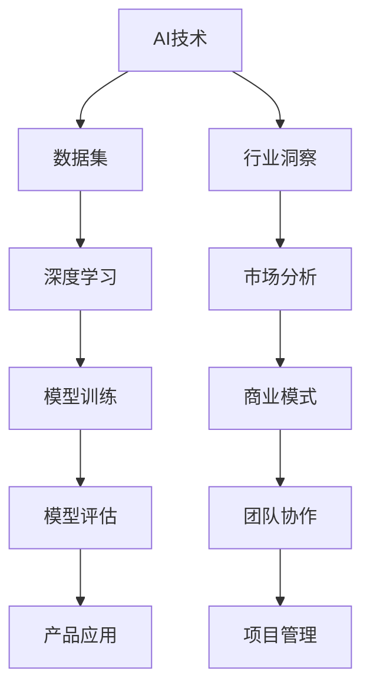

                 

# AI创业团队成长之路：技术积累与行业洞察并重

> **关键词**：AI创业、技术积累、行业洞察、团队管理、项目实战
>
> **摘要**：本文旨在探讨AI创业团队在成长过程中所需的技术积累和行业洞察。我们将逐步分析AI创业的背景，团队管理的关键要素，技术积累的路径，以及如何通过行业洞察实现创新和竞争优势。本文将为有意投身AI创业的读者提供有价值的指导和建议。

## 1. 背景介绍

### 1.1 目的和范围

本文的目标是为正在考虑或已经投身于AI创业的团队提供一条清晰的成长之路。我们将重点关注以下内容：

- **AI创业的背景和趋势**：解释为什么AI成为创业的热门领域，以及它如何推动行业变革。
- **团队管理的关键要素**：探讨如何组建高效的AI创业团队，包括角色分工、沟通和协作。
- **技术积累的路径**：分析如何系统地积累AI技术，包括学习资源、技术框架和工具。
- **行业洞察的重要性**：探讨如何通过行业洞察发现新的商机和竞争优势。
- **项目实战**：通过实际案例展示如何将理论知识应用到实践中。

### 1.2 预期读者

- **AI创业者**：对AI技术有热情，正在寻找创业方向的人。
- **技术团队领导者**：负责AI项目开发的技术团队主管或经理。
- **技术专家**：对AI技术有深入了解，希望为创业团队提供指导。
- **学术研究人员**：关注AI领域最新进展，希望了解实际应用场景。

### 1.3 文档结构概述

本文将分为以下几个部分：

- **1. 背景介绍**：解释文章的目的和范围。
- **2. 核心概念与联系**：介绍AI创业的核心概念和架构。
- **3. 核心算法原理 & 具体操作步骤**：详细阐述AI技术的原理和操作步骤。
- **4. 数学模型和公式 & 详细讲解 & 举例说明**：介绍AI技术的数学基础。
- **5. 项目实战：代码实际案例和详细解释说明**：通过实际案例展示技术应用。
- **6. 实际应用场景**：探讨AI技术在各行业的应用。
- **7. 工具和资源推荐**：推荐学习资源、开发工具和框架。
- **8. 总结：未来发展趋势与挑战**：总结AI创业的挑战和机遇。
- **9. 附录：常见问题与解答**：提供常见问题的解答。
- **10. 扩展阅读 & 参考资料**：推荐进一步阅读的材料。

### 1.4 术语表

#### 1.4.1 核心术语定义

- **AI创业**：指利用人工智能技术进行商业创新和创业活动。
- **团队管理**：指在团队内部建立有效的沟通和协作机制。
- **技术积累**：指在AI领域不断学习和应用新技术，形成技术优势。
- **行业洞察**：指对特定行业的深入理解和分析，以发现商机和竞争优势。

#### 1.4.2 相关概念解释

- **深度学习**：一种机器学习技术，通过多层神经网络模型模拟人脑的学习过程。
- **自然语言处理（NLP）**：使计算机能够理解、解释和生成人类语言的技术。
- **强化学习**：一种机器学习技术，通过试错和反馈来优化决策过程。

#### 1.4.3 缩略词列表

- **AI**：人工智能
- **NLP**：自然语言处理
- **ML**：机器学习
- **DL**：深度学习
- **GAN**：生成对抗网络

## 2. 核心概念与联系

在AI创业过程中，理解核心概念和它们之间的联系至关重要。以下是一个简单的Mermaid流程图，展示AI创业的主要组成部分及其相互关系。



### 2.1 AI技术核心概念

- **数据集**：用于训练和测试AI模型的实际数据。高质量的数据集是AI模型性能的关键。
- **深度学习**：通过多层神经网络模拟人脑学习过程的AI技术。深度学习在图像识别、语音识别等领域有广泛应用。
- **模型训练**：通过大量数据训练AI模型，使其能够进行预测和分类。
- **模型评估**：对训练好的模型进行性能评估，确保其满足业务需求。
- **产品应用**：将AI模型应用到实际产品中，为用户提供服务。

### 2.2 行业洞察与商业模式

- **行业洞察**：对特定行业的深入理解和分析，以发现新的商业机会。
- **市场分析**：通过数据分析了解市场趋势和用户需求。
- **商业模式**：将AI技术转化为商业价值的具体方案。

### 2.3 团队协作与项目管理

- **团队协作**：建立高效的沟通和协作机制，确保团队成员之间的信息共享和任务协同。
- **项目管理**：确保项目按时、按质、按预算完成。包括任务分配、进度跟踪和风险管理。

## 3. 核心算法原理 & 具体操作步骤

### 3.1 深度学习算法原理

深度学习是一种基于多层神经网络的学习方法，其基本原理是模拟人脑神经元之间的连接和交互。以下是一个简单的伪代码，用于说明深度学习模型的训练过程：

```python
# 伪代码：深度学习模型训练
initialize_weights()
while not convergence:
    for each training example (x, y):
        forward_pass(x)
        compute_loss(y)
        backward_pass()
        update_weights()
```

### 3.2 深度学习模型训练步骤

1. **初始化权重**：随机初始化模型的权重。
2. **正向传播**：将输入数据传递到模型中，计算输出结果。
3. **计算损失**：使用损失函数（如均方误差）计算模型输出与真实标签之间的差距。
4. **反向传播**：计算梯度并更新权重，以减少损失。
5. **更新权重**：根据梯度调整模型权重。
6. **循环迭代**：重复上述步骤，直到模型达到收敛条件。

### 3.3 模型评估与优化

1. **交叉验证**：将数据集划分为训练集和验证集，评估模型在验证集上的性能。
2. **超参数调整**：调整学习率、隐藏层神经元数量等超参数，优化模型性能。
3. **模型集成**：使用多个模型组合，提高预测准确性和稳定性。

## 4. 数学模型和公式 & 详细讲解 & 举例说明

在深度学习中，数学模型和公式起着至关重要的作用。以下是一些核心数学概念和公式的详细讲解。

### 4.1 损失函数

损失函数是评估模型性能的核心工具。一个常见的损失函数是均方误差（Mean Squared Error, MSE）：

$$
MSE = \frac{1}{n} \sum_{i=1}^{n} (y_i - \hat{y}_i)^2
$$

其中，$y_i$ 是真实标签，$\hat{y}_i$ 是模型预测值，$n$ 是样本数量。

### 4.2 激活函数

激活函数是深度学习模型中的关键元素，用于引入非线性。一个常用的激活函数是ReLU（Rectified Linear Unit）：

$$
\text{ReLU}(x) = \max(0, x)
$$

### 4.3 梯度下降算法

梯度下降是一种优化算法，用于最小化损失函数。基本思想是沿着损失函数的梯度方向更新模型权重：

$$
w_{t+1} = w_t - \alpha \cdot \nabla_w J(w)
$$

其中，$w_t$ 是当前权重，$\alpha$ 是学习率，$\nabla_w J(w)$ 是权重梯度。

### 4.4 举例说明

假设我们有一个简单的线性模型，预测房价。模型公式如下：

$$
y = w_0 + w_1 \cdot x
$$

其中，$y$ 是房价，$x$ 是某个特征（如面积），$w_0$ 和 $w_1$ 是模型权重。

通过训练数据集，我们可以计算出损失函数和权重梯度：

$$
J(w_0, w_1) = \frac{1}{n} \sum_{i=1}^{n} (y_i - (w_0 + w_1 \cdot x_i))^2
$$

$$
\nabla_w J(w_0, w_1) = \begin{bmatrix}
\frac{\partial J}{\partial w_0} \\
\frac{\partial J}{\partial w_1}
\end{bmatrix}
$$

使用梯度下降算法，我们可以迭代更新权重，最小化损失函数。以下是伪代码示例：

```python
# 伪代码：线性模型权重更新
initialize_weights(w_0, w_1)
while not convergence:
    compute_loss_and_gradients()
    update_weights(w_0, w_1)
```

## 5. 项目实战：代码实际案例和详细解释说明

在本节中，我们将通过一个实际案例，展示如何使用深度学习技术构建一个简单的图像识别模型。我们将使用Python和TensorFlow框架来实现这一目标。

### 5.1 开发环境搭建

在开始之前，确保安装以下工具和库：

- Python 3.x
- TensorFlow 2.x
- NumPy
- Matplotlib

可以使用以下命令安装所需的库：

```bash
pip install python numpy tensorflow matplotlib
```

### 5.2 源代码详细实现和代码解读

以下是完整的代码实现，我们将逐行解释代码的功能。

```python
# 导入所需库
import tensorflow as tf
from tensorflow.keras import layers
import numpy as np
import matplotlib.pyplot as plt

# 加载和预处理数据集
(x_train, y_train), (x_test, y_test) = tf.keras.datasets.mnist.load_data()
x_train = x_train / 255.0
x_test = x_test / 255.0
x_train = x_train.reshape(-1, 28, 28, 1)
x_test = x_test.reshape(-1, 28, 28, 1)

# 创建模型
model = tf.keras.Sequential([
    layers.Conv2D(32, (3, 3), activation='relu', input_shape=(28, 28, 1)),
    layers.MaxPooling2D((2, 2)),
    layers.Conv2D(64, (3, 3), activation='relu'),
    layers.MaxPooling2D((2, 2)),
    layers.Conv2D(64, (3, 3), activation='relu'),
    layers.Flatten(),
    layers.Dense(64, activation='relu'),
    layers.Dense(10, activation='softmax')
])

# 编译模型
model.compile(optimizer='adam',
              loss='sparse_categorical_crossentropy',
              metrics=['accuracy'])

# 训练模型
model.fit(x_train, y_train, epochs=5, batch_size=32, validation_split=0.1)

# 评估模型
test_loss, test_acc = model.evaluate(x_test, y_test)
print(f"Test accuracy: {test_acc:.2f}")

# 可视化预测结果
predictions = model.predict(x_test[:10])
predicted_classes = np.argmax(predictions, axis=1)
for i, img in enumerate(x_test[:10]):
    plt.subplot(2, 5, i+1)
    plt.imshow(img[0], cmap=plt.cm.binary)
    plt.xticks([])
    plt.yticks([])
    plt.grid(False)
    plt.xlabel(f"Predicted: {predicted_classes[i]}")
plt.show()
```

### 5.3 代码解读与分析

1. **导入库**：首先导入所需的库，包括TensorFlow、NumPy和Matplotlib。
2. **加载和预处理数据集**：使用TensorFlow的内置函数加载MNIST数据集，并对图像进行归一化处理。
3. **创建模型**：使用Sequential模型堆叠多个层，包括卷积层、池化层、全连接层。这是深度学习模型的常见架构。
4. **编译模型**：配置模型优化器、损失函数和评价指标。
5. **训练模型**：使用fit函数训练模型，指定训练数据和验证比例。
6. **评估模型**：使用evaluate函数评估模型在测试集上的性能。
7. **可视化预测结果**：使用Matplotlib绘制测试图像及其预测结果。

通过这个实际案例，我们可以看到如何将理论知识应用到实践中，构建一个简单的图像识别模型。

## 6. 实际应用场景

AI技术在各行各业都有广泛的应用，以下是几个典型的应用场景：

### 6.1 医疗健康

- **诊断辅助**：使用深度学习模型分析医学图像，辅助医生进行诊断。
- **个性化治疗**：通过患者数据和基因信息，为医生提供个性化治疗方案。

### 6.2 金融领域

- **风险管理**：使用AI技术分析市场数据，预测金融风险。
- **智能投顾**：根据用户需求和风险偏好，提供个性化的投资建议。

### 6.3 交通运输

- **自动驾驶**：使用深度学习模型进行环境感知和路径规划。
- **智能交通管理**：通过实时数据分析，优化交通流量和信号控制。

### 6.4 教育领域

- **个性化学习**：根据学生的学习进度和风格，提供个性化的学习资源。
- **智能评测**：使用自然语言处理技术，自动评估学生的写作和口语。

### 6.5 娱乐产业

- **内容推荐**：使用深度学习模型分析用户行为，提供个性化的内容推荐。
- **语音识别**：将语音转化为文本，用于智能助手和字幕生成。

## 7. 工具和资源推荐

### 7.1 学习资源推荐

#### 7.1.1 书籍推荐

- 《深度学习》（Ian Goodfellow, Yoshua Bengio, Aaron Courville）
- 《Python深度学习》（François Chollet）
- 《机器学习实战》（Peter Harrington）

#### 7.1.2 在线课程

- Coursera的《深度学习》课程
- edX的《机器学习》课程
- Udacity的《深度学习工程师纳米学位》

#### 7.1.3 技术博客和网站

- [TensorFlow官方网站](https://www.tensorflow.org/)
- [机器学习博客](https://machinelearningmastery.com/)
- [AI博客](https://towardsdatascience.com/)

### 7.2 开发工具框架推荐

#### 7.2.1 IDE和编辑器

- PyCharm
- Visual Studio Code
- Jupyter Notebook

#### 7.2.2 调试和性能分析工具

- TensorBoard
- Spyder
- memory_profiler

#### 7.2.3 相关框架和库

- TensorFlow
- PyTorch
- Keras

### 7.3 相关论文著作推荐

#### 7.3.1 经典论文

- "A Theoretical Framework for Back-Propagating Neural Networks" (Rumelhart, Hinton, Williams)
- "Learning Representations by Maximizing Mutual Information" (Vincent, Larochelle, Lajoie, Bengio, Manzagol)

#### 7.3.2 最新研究成果

- "Deep Learning for Image Recognition" (Krizhevsky, Sutskever, Hinton)
- "Generative Adversarial Networks" (Goodfellow, Pouget-Abadie, Mirza, Xu, Wang, Battaglia, Chen, Sussillo, Adeli)

#### 7.3.3 应用案例分析

- "Deep Learning in Healthcare: A Brief Introduction" (Suk, Lee, Yoo, Kim, Kweon)
- "AI in Financial Markets: A Survey" (Chen, Chen, Hong, Wang)

## 8. 总结：未来发展趋势与挑战

随着AI技术的不断发展，AI创业领域面临着巨大的机遇和挑战。以下是对未来发展趋势和挑战的总结：

### 8.1 发展趋势

- **数据驱动的决策**：越来越多的企业开始使用AI技术进行数据分析和决策支持。
- **跨学科融合**：AI与生物医学、金融、教育等领域的融合，带来新的应用场景和商业模式。
- **开放合作**：企业之间、企业与科研机构之间的合作越来越普遍，共同推动技术进步。
- **伦理和法规**：随着AI技术的广泛应用，伦理和法规问题成为关键挑战，如何确保AI技术的公平、透明和可解释性成为重要议题。

### 8.2 挑战

- **数据质量与隐私**：高质量的数据是AI模型性能的基础，但同时也面临着数据隐私和安全的挑战。
- **计算资源需求**：深度学习模型对计算资源的需求巨大，如何优化计算资源成为重要问题。
- **人才短缺**：AI领域的专业人才短缺，如何培养和吸引优秀的AI人才成为挑战。
- **伦理和责任**：如何确保AI技术的公平性、透明性和可解释性，避免伦理风险和法律纠纷。

## 9. 附录：常见问题与解答

### 9.1 如何选择合适的AI框架？

选择合适的AI框架取决于项目需求、团队技能和开发环境。以下是一些常见的AI框架及其特点：

- **TensorFlow**：适合大规模模型训练和部署，具有良好的生态和社区支持。
- **PyTorch**：具有灵活的动态计算图，易于实现新算法，适合研究和开发。
- **Keras**：基于TensorFlow和Theano，提供简洁的API，适合快速原型开发。

### 9.2 如何处理数据隐私问题？

处理数据隐私问题通常涉及以下策略：

- **数据匿名化**：对敏感数据进行匿名化处理，以保护个人隐私。
- **差分隐私**：在数据分析过程中引入噪声，确保无法推断个体数据。
- **数据加密**：使用加密算法保护数据传输和存储过程中的隐私。

### 9.3 如何平衡模型性能和可解释性？

平衡模型性能和可解释性是AI领域的重要挑战。以下是一些策略：

- **模型简化**：使用更简单的模型结构，提高可解释性。
- **模型解释工具**：使用模型解释工具，如SHAP、LIME，分析模型决策过程。
- **可解释性需求分析**：明确可解释性需求，根据业务场景调整模型。

## 10. 扩展阅读 & 参考资料

本文提供了AI创业团队成长之路的全面概述，以下是一些扩展阅读和参考资料，以帮助读者深入了解相关主题：

- **扩展阅读**：
  - Goodfellow, I., Bengio, Y., & Courville, A. (2016). *Deep Learning*.
  - Bengio, Y. (2009). *Learning Deep Architectures for AI*.
  - Mitchell, T. M. (1997). *Machine Learning*.
- **参考资料**：
  - Coursera的《深度学习》课程：[https://www.coursera.org/learn/deep-learning](https://www.coursera.org/learn/deep-learning)
  - edX的《机器学习》课程：[https://www.edx.org/course/machine-learning](https://www.edx.org/course/machine-learning)
  - TensorFlow官方网站：[https://www.tensorflow.org/](https://www.tensorflow.org/)
  - PyTorch官方网站：[https://pytorch.org/](https://pytorch.org/)

### 作者

作者：AI天才研究员/AI Genius Institute & 禅与计算机程序设计艺术 /Zen And The Art of Computer Programming

