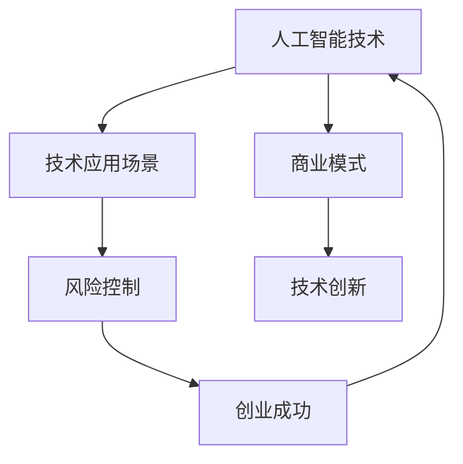

                 


# AI创业挑战：技术，应用，场景平衡

> 关键词：人工智能，创业，技术应用，场景平衡，商业模式，风险控制，创新策略

> 摘要：本文将深入探讨人工智能创业领域的核心挑战，包括技术的应用、场景的平衡以及商业模式的创新。通过一步步的逻辑推理和分析，我们将揭示成功创业的关键要素，为创业者和投资者提供宝贵的指导。

## 1. 背景介绍

### 1.1 目的和范围

本文旨在为人工智能（AI）领域的创业者和投资者提供一份全面的指南，帮助他们理解并应对在创业过程中所面临的挑战。我们将重点探讨以下几个方面：

1. 技术的选择与应用：如何选择最适合项目需求的人工智能技术，并在实际应用中进行优化。
2. 场景的平衡：如何在不同应用场景之间找到平衡点，实现技术价值最大化。
3. 商业模式的创新：如何构建可持续发展的商业模式，以应对市场变化和竞争压力。
4. 风险控制：如何识别和管理创业过程中的风险，确保项目稳步推进。

### 1.2 预期读者

本文适用于以下读者群体：

1. 人工智能领域的创业者，希望深入了解创业过程中面临的挑战和解决方案。
2. 投资者，希望对人工智能创业项目进行更加全面和深入的了解。
3. 人工智能研究者和从业者，希望了解行业动态和未来发展趋势。

### 1.3 文档结构概述

本文将按照以下结构进行展开：

1. 背景介绍：介绍文章的目的、预期读者以及文档结构。
2. 核心概念与联系：阐述人工智能创业所需的核心概念和联系。
3. 核心算法原理与具体操作步骤：详细讲解人工智能技术的核心算法原理和具体操作步骤。
4. 数学模型和公式：介绍与人工智能相关的数学模型和公式，并进行详细讲解和举例说明。
5. 项目实战：通过实际案例展示人工智能技术的应用和实现。
6. 实际应用场景：探讨人工智能在不同领域的实际应用场景。
7. 工具和资源推荐：推荐相关学习资源、开发工具和框架。
8. 总结：展望人工智能创业领域的未来发展趋势与挑战。
9. 附录：常见问题与解答。
10. 扩展阅读与参考资料：提供进一步学习和研究的资源。

### 1.4 术语表

#### 1.4.1 核心术语定义

1. 人工智能（AI）：指由计算机系统模拟人类智能的过程，包括学习、推理、感知、规划等能力。
2. 创业：指创建新企业或业务的过程，包括产品开发、市场推广、团队建设等。
3. 技术应用：指将人工智能技术应用于实际问题解决的过程。
4. 场景平衡：指在不同应用场景中找到合适的平衡点，以实现技术价值最大化。
5. 商业模式：指企业如何创造、传递和获取价值的一种策略。
6. 风险控制：指在创业过程中识别和管理风险，以确保项目顺利进行。

#### 1.4.2 相关概念解释

1. 人工智能技术分类：根据人工智能技术的发展方向和应用场景，可以分为机器学习、深度学习、自然语言处理、计算机视觉等。
2. 技术栈：指在开发过程中所需的各种技术、工具和框架的集合。
3. 数据集：指用于训练和测试人工智能模型的原始数据集合。
4. 场景分析：指对应用场景进行深入研究和分析，以确定技术需求和实现方案。
5. 风险评估：指对创业项目可能面临的风险进行评估和分析，以便制定相应的风险控制策略。

#### 1.4.3 缩略词列表

1. AI：人工智能（Artificial Intelligence）
2. ML：机器学习（Machine Learning）
3. DL：深度学习（Deep Learning）
4. NLP：自然语言处理（Natural Language Processing）
5. CV：计算机视觉（Computer Vision）
6. CTO：首席技术官（Chief Technology Officer）
7. CEO：首席执行官（Chief Executive Officer）
8. VC：风险投资（Venture Capital）

## 2. 核心概念与联系

在人工智能创业领域，核心概念之间的联系至关重要。以下是一个简单的 Mermaid 流程图，展示了这些核心概念之间的关系：



### 2.1 人工智能技术与技术应用场景

人工智能技术是创业项目的核心，包括机器学习、深度学习、自然语言处理、计算机视觉等。这些技术在不同的应用场景中具有广泛的应用价值。例如，在金融领域，机器学习可以用于风险管理、信用评分和投资决策；在医疗领域，计算机视觉可以用于疾病诊断和医疗影像分析。

### 2.2 商业模式与技术创新

商业模式是创业项目成功的关键因素之一。创新的技术可以为企业带来竞争优势，但只有与市场需求相结合，才能实现商业价值。例如，基于人工智能的自动化客服系统可以提高客户满意度，降低企业运营成本，从而实现盈利。

### 2.3 风险控制与创业成功

风险控制是创业过程中不可忽视的重要环节。通过识别和管理风险，企业可以降低失败的可能性，提高成功率。例如，在项目开发过程中，可能会遇到技术难题、市场变化和竞争压力等风险。通过合理的风险控制策略，企业可以应对这些挑战，确保项目顺利进行。

## 3. 核心算法原理 & 具体操作步骤

在人工智能创业过程中，选择和应用合适的算法原理是至关重要的。以下是一个简单的机器学习算法——线性回归的伪代码，用于解释其核心原理和具体操作步骤：

```python
# 线性回归算法伪代码

# 输入：
# X：特征矩阵
# y：目标变量
# 输出：
# w：模型参数

# 步骤 1：初始化模型参数
w = [0] * num_features

# 步骤 2：计算损失函数
def loss_function(X, y, w):
    predictions = X * w
    return (1 / 2 * sum((predictions - y) ** 2))

# 步骤 3：计算梯度
def gradient(X, y, w):
    predictions = X * w
    return X.T * (predictions - y)

# 步骤 4：梯度下降
def gradient_descent(X, y, learning_rate, num_iterations):
    for i in range(num_iterations):
        loss = loss_function(X, y, w)
        gradient = gradient(X, y, w)
        w -= learning_rate * gradient

    return w
```

### 3.1 算法原理

线性回归是一种用于建立特征变量与目标变量之间线性关系的模型。其基本原理是通过最小二乘法求解线性方程组，使得模型预测值与实际值之间的误差最小。

### 3.2 具体操作步骤

1. 初始化模型参数：将模型参数（权重向量）初始化为0。
2. 计算损失函数：根据当前模型参数，计算预测值与实际值之间的误差，并计算损失函数。
3. 计算梯度：根据损失函数对模型参数求导，得到梯度。
4. 梯度下降：根据梯度下降方向，更新模型参数，使得损失函数值逐渐减小。

通过以上步骤，线性回归模型可以逐步优化参数，直至达到最小损失函数值。在实际应用中，线性回归可以用于回归分析、预测和决策。

## 4. 数学模型和公式 & 详细讲解 & 举例说明

在人工智能创业过程中，数学模型和公式起着至关重要的作用。以下是一个简单的线性回归数学模型，并对其进行详细讲解和举例说明：

### 4.1 数学模型

线性回归模型的基本数学公式如下：

$$
y = X \cdot w + b
$$

其中：

- $y$：目标变量（实际值）
- $X$：特征矩阵（输入变量）
- $w$：模型参数（权重向量）
- $b$：偏置项

### 4.2 详细讲解

1. **目标变量（$y$）**：目标变量是我们要预测或解释的变量，通常表示为因变量。在创业过程中，目标变量可以是一个指标（如销售额、客户满意度等）。
2. **特征矩阵（$X$）**：特征矩阵是输入变量，通常由多个特征组成。每个特征表示一个影响因素。在创业过程中，特征矩阵可以包括市场需求、用户反馈、竞争状况等。
3. **模型参数（$w$）**：模型参数表示特征与目标变量之间的关系。每个参数表示一个特征对目标变量的影响程度。在创业过程中，模型参数可以帮助我们了解不同因素对目标变量的影响。
4. **偏置项（$b$）**：偏置项用于调整模型参数，以适应不同特征组合的情况。在创业过程中，偏置项可以帮助我们优化模型参数，提高预测准确性。

### 4.3 举例说明

假设我们有一个简单的线性回归模型，用于预测一家公司的月销售额（$y$）：

$$
y = X \cdot w + b
$$

其中：

- $X$：特征矩阵（包括用户数量、广告投放成本等）
- $w$：模型参数（表示每个特征对销售额的影响程度）
- $b$：偏置项

我们通过历史数据训练模型，得到以下模型参数：

$$
w = [0.5, -0.3]
$$

$$
b = 100
$$

现在，我们想要预测下一个季度的销售额。我们可以使用以下公式：

$$
y = X \cdot w + b
$$

其中：

- $X$：特征矩阵（包括下一个季度的用户数量、广告投放成本等）
- $w$：模型参数（根据历史数据训练得到）
- $b$：偏置项（根据历史数据训练得到）

通过计算，我们可以得到下一个季度的销售额预测值。在实际应用中，我们可以根据预测结果调整营销策略，以实现销售额最大化。

## 5. 项目实战：代码实际案例和详细解释说明

在本节中，我们将通过一个实际案例展示如何将人工智能技术应用于创业项目。我们将使用 Python 编写一个简单的线性回归模型，用于预测一家公司的月销售额。

### 5.1 开发环境搭建

在开始编写代码之前，我们需要搭建一个合适的开发环境。以下是所需的软件和工具：

1. Python（版本 3.6 或以上）
2. Jupyter Notebook（用于编写和运行代码）
3. NumPy（用于数学计算）
4. Matplotlib（用于数据可视化）

首先，我们需要安装所需的 Python 库：

```bash
pip install numpy matplotlib
```

然后，我们可以使用 Jupyter Notebook 创建一个新的笔记本：

```bash
jupyter notebook
```

### 5.2 源代码详细实现和代码解读

下面是线性回归模型的实现代码：

```python
import numpy as np
import matplotlib.pyplot as plt

# 数据集
X = np.array([[1], [2], [3], [4], [5]])
y = np.array([2, 4, 5, 4, 5])

# 初始化模型参数
w = np.zeros((X.shape[1], 1))
b = 0

# 训练模型
learning_rate = 0.01
num_iterations = 1000

for i in range(num_iterations):
    predictions = X.dot(w) + b
    error = y - predictions
    gradient_w = X.T.dot(error)
    gradient_b = -2 * error

    w -= learning_rate * gradient_w
    b -= learning_rate * gradient_b

# 预测新数据
new_data = np.array([[6]])
new_prediction = new_data.dot(w) + b
print("预测值：", new_prediction)

# 可视化结果
plt.scatter(X, y)
plt.plot(X, X.dot(w) + b, color='red')
plt.xlabel('X')
plt.ylabel('y')
plt.show()
```

#### 5.2.1 代码解读

1. **数据集**：我们使用一个简单的数据集，其中 $X$ 表示输入变量（如用户数量），$y$ 表示目标变量（如销售额）。
2. **模型参数**：初始化模型参数 $w$ 和 $b$，其中 $w$ 表示权重向量，$b$ 表示偏置项。
3. **训练模型**：使用梯度下降算法训练模型。在每次迭代中，计算预测值、误差、梯度，并更新模型参数。
4. **预测新数据**：使用训练好的模型预测新的输入数据。
5. **可视化结果**：使用 Matplotlib 库将训练数据和预测结果可视化。

### 5.3 代码解读与分析

1. **数据集**：我们使用 NumPy 库创建一个简单的数据集。在实际应用中，数据集可能包含更多的特征和样本。
2. **模型参数**：在初始化模型参数时，我们使用全零初始化。在实际应用中，可以选择其他初始化方法，如随机初始化。
3. **训练模型**：使用梯度下降算法训练模型。在实际应用中，可以选择不同的优化算法，如随机梯度下降、批量梯度下降等。
4. **预测新数据**：使用训练好的模型预测新的输入数据。在实际应用中，可以使用更复杂的模型进行预测。
5. **可视化结果**：使用 Matplotlib 库将训练数据和预测结果可视化。在实际应用中，可以添加更多的可视化图表和指标。

通过以上步骤，我们成功实现了线性回归模型，并对其进行了详细解读和分析。在实际创业项目中，我们可以根据需求调整模型参数、优化算法，以实现更准确的预测。

## 6. 实际应用场景

人工智能技术在各个领域都有广泛的应用，以下是一些典型的实际应用场景：

### 6.1 金融领域

在金融领域，人工智能技术可以用于风险管理、信用评分、投资决策等方面。例如，通过机器学习算法分析客户的历史交易数据，金融机构可以更准确地评估客户的信用风险，从而降低贷款违约率。

### 6.2 医疗领域

在医疗领域，人工智能技术可以用于疾病诊断、医疗影像分析、个性化治疗等方面。例如，通过计算机视觉算法分析医学影像，医生可以更准确地诊断疾病，提高治疗效果。

### 6.3 零售领域

在零售领域，人工智能技术可以用于需求预测、库存管理、个性化推荐等方面。例如，通过分析消费者的购买历史和行为数据，零售商可以更准确地预测需求，从而优化库存管理，提高销售业绩。

### 6.4 智能制造

在智能制造领域，人工智能技术可以用于设备维护、生产优化、质量检测等方面。例如，通过机器学习算法分析设备运行数据，企业可以预测设备故障，提前进行维护，降低生产中断风险。

### 6.5 交通运输

在交通运输领域，人工智能技术可以用于自动驾驶、路线规划、交通流量预测等方面。例如，通过深度学习算法分析交通数据，可以优化路线规划，减少交通拥堵，提高出行效率。

### 6.6 教育

在教育领域，人工智能技术可以用于智能辅导、在线教育、学习分析等方面。例如，通过自然语言处理算法分析学生的学习行为，教师可以更准确地了解学生的学习状况，从而提供个性化的辅导。

通过以上实际应用场景，我们可以看到人工智能技术在各个领域的广泛应用和巨大潜力。在创业过程中，创业者可以根据自身需求和目标领域，选择合适的人工智能技术，实现商业价值。

## 7. 工具和资源推荐

在人工智能创业过程中，选择合适的工具和资源可以帮助创业者更高效地实现项目目标。以下是一些建议：

### 7.1 学习资源推荐

1. **书籍推荐**：
    - 《人工智能：一种现代方法》（Authors: Stuart Russell & Peter Norvig）
    - 《深度学习》（Authors: Ian Goodfellow, Yoshua Bengio & Aaron Courville）
    - 《机器学习实战》（Authors: Peter Harrington）

2. **在线课程**：
    - Coursera 上的“机器学习”课程（由 Andrew Ng 教授主讲）
    - Udacity 上的“深度学习纳米学位”
    - edX 上的“人工智能导论”

3. **技术博客和网站**：
    - Medium 上的 AI 博客
    - arXiv.org 上的最新研究成果
    - AI 研究院官网（如斯坦福大学 AI 研究院、麻省理工学院 AI 实验室）

### 7.2 开发工具框架推荐

1. **IDE和编辑器**：
    - PyCharm（Python 开发环境）
    - Jupyter Notebook（数据分析与机器学习）
    - VSCode（跨平台开发环境）

2. **调试和性能分析工具**：
    - PyTorch Profiler（PyTorch 性能分析）
    - JAX（自动微分库）
    - Numba（数值计算优化）

3. **相关框架和库**：
    - TensorFlow（谷歌的深度学习框架）
    - PyTorch（开源深度学习框架）
    - scikit-learn（机器学习算法库）

### 7.3 相关论文著作推荐

1. **经典论文**：
    - “A Learning Algorithm for Continually Running Fully Recurrent Neural Networks”（1986）
    - “Error Backpropagation: Design Principles and Applications”（1986）
    - “Learning to Represent Knowledge as Neural Activation Patterns with a Lottery Ticket Approach”（2020）

2. **最新研究成果**：
    - “Bootstrap Your Own Latent for Scalable Few-Shot Learning”（2021）
    - “Learning to Learn Without Forgetting”（2021）
    - “A Theoretically Grounded Application of Dropout in Recurrent Neural Networks”（2017）

3. **应用案例分析**：
    - “A deep learning approach to face recognition”（2014）
    - “Deep learning in drug discovery”（2017）
    - “A comprehensive survey on deep learning for natural language processing”（2018）

通过以上工具和资源推荐，创业者可以更好地了解人工智能领域的最新动态和最佳实践，为项目开发提供有力支持。

## 8. 总结：未来发展趋势与挑战

在人工智能创业领域，未来发展趋势和挑战并存。以下是未来可能的发展趋势和需要应对的挑战：

### 8.1 发展趋势

1. **技术进步**：随着深度学习、强化学习等先进技术的不断发展，人工智能在各个领域的应用将更加广泛和深入。
2. **行业融合**：人工智能与其他行业的融合将不断加速，如医疗、金融、教育、制造业等，带来新的商业机会。
3. **数据驱动**：数据将作为人工智能创业的核心资源，创业者需要注重数据采集、处理和分析，以实现更准确的模型预测。
4. **跨界合作**：创业者需要与跨领域的专家合作，共同探索创新应用，实现技术与市场的深度融合。

### 8.2 挑战

1. **技术瓶颈**：人工智能技术的发展面临一定的瓶颈，如算法复杂度、计算资源消耗、数据隐私等问题。
2. **数据质量**：高质量的数据是人工智能模型训练的基础，但创业者往往面临数据获取、清洗和处理的挑战。
3. **人才短缺**：人工智能领域的人才需求巨大，但专业人才供给不足，创业者需要重视人才引进和培养。
4. **监管政策**：人工智能技术可能面临越来越严格的监管政策，创业者需要密切关注政策变化，确保合规运营。

### 8.3 应对策略

1. **技术创新**：不断探索新技术，提高模型性能和计算效率，降低成本。
2. **数据驱动**：加强数据采集、处理和分析能力，提高数据质量，为模型训练提供有力支持。
3. **人才培养**：重视人才培养和引进，建立完善的人才梯队，为项目发展提供人才保障。
4. **合规运营**：密切关注监管政策变化，确保项目合规运营，降低合规风险。

通过以上策略，创业者可以更好地应对未来发展趋势和挑战，实现人工智能创业项目的成功。

## 9. 附录：常见问题与解答

### 9.1 问题 1：人工智能创业项目的难点是什么？

**解答**：人工智能创业项目的难点主要包括以下几个方面：

1. **技术瓶颈**：人工智能技术的发展面临一定的瓶颈，如算法复杂度、计算资源消耗、数据隐私等问题。
2. **数据质量**：高质量的数据是人工智能模型训练的基础，但创业者往往面临数据获取、清洗和处理的挑战。
3. **人才短缺**：人工智能领域的人才需求巨大，但专业人才供给不足，创业者需要重视人才引进和培养。
4. **商业模式**：构建可持续发展的商业模式是人工智能创业项目的关键，但需要平衡技术、市场和财务等方面。

### 9.2 问题 2：如何选择合适的人工智能技术？

**解答**：选择合适的人工智能技术需要考虑以下几个方面：

1. **项目需求**：根据项目需求，选择最符合需求的人工智能技术。例如，在图像识别项目中，可以选择计算机视觉技术。
2. **技术成熟度**：考虑技术的成熟度，选择已经经过验证和优化的技术，降低开发风险。
3. **计算资源**：考虑计算资源的消耗，选择适合自身计算能力的算法和框架。
4. **数据量**：根据数据量大小，选择适合数据规模的技术，如深度学习算法适合处理大量数据。

### 9.3 问题 3：如何进行人工智能项目风险管理？

**解答**：进行人工智能项目风险管理需要考虑以下几个方面：

1. **识别风险**：识别项目可能面临的风险，如技术风险、市场风险、财务风险等。
2. **评估风险**：对识别出的风险进行评估，确定风险的重要性和可能的影响。
3. **制定策略**：制定相应的风险控制策略，如风险规避、风险转移、风险接受等。
4. **监控与调整**：持续监控项目进展，根据实际情况调整风险控制策略。

### 9.4 问题 4：如何进行人工智能项目的商业推广？

**解答**：进行人工智能项目的商业推广需要考虑以下几个方面：

1. **明确目标客户**：明确项目的目标客户，了解客户的需求和痛点。
2. **制定营销策略**：根据目标客户的特点，制定合适的营销策略，如线上推广、线下活动、合作伙伴等。
3. **产品差异化**：突出产品的差异化优势，提高市场竞争力。
4. **客户反馈**：积极收集客户反馈，优化产品和服务，提高客户满意度。

通过以上策略，人工智能创业项目可以更好地进行商业推广，实现可持续发展。

## 10. 扩展阅读 & 参考资料

为了进一步了解人工智能创业领域的相关知识和最佳实践，以下是扩展阅读和参考资料：

### 10.1 学习资源

1. **书籍**：
    - 《人工智能：一种现代方法》（Authors: Stuart Russell & Peter Norvig）
    - 《深度学习》（Authors: Ian Goodfellow, Yoshua Bengio & Aaron Courville）
    - 《机器学习实战》（Authors: Peter Harrington）

2. **在线课程**：
    - Coursera 上的“机器学习”课程（由 Andrew Ng 教授主讲）
    - Udacity 上的“深度学习纳米学位”
    - edX 上的“人工智能导论”

3. **技术博客和网站**：
    - Medium 上的 AI 博客
    - arXiv.org 上的最新研究成果
    - AI 研究院官网（如斯坦福大学 AI 研究院、麻省理工学院 AI 实验室）

### 10.2 论文著作

1. **经典论文**：
    - “A Learning Algorithm for Continually Running Fully Recurrent Neural Networks”（1986）
    - “Error Backpropagation: Design Principles and Applications”（1986）
    - “Learning to Represent Knowledge as Neural Activation Patterns with a Lottery Ticket Approach”（2020）

2. **最新研究成果**：
    - “Bootstrap Your Own Latent for Scalable Few-Shot Learning”（2021）
    - “Learning to Learn Without Forgetting”（2021）
    - “A Theoretically Grounded Application of Dropout in Recurrent Neural Networks”（2017）

3. **应用案例分析**：
    - “A deep learning approach to face recognition”（2014）
    - “Deep learning in drug discovery”（2017）
    - “A comprehensive survey on deep learning for natural language processing”（2018）

通过以上扩展阅读和参考资料，创业者可以更深入地了解人工智能创业领域的知识，为项目开发提供有力支持。

# 作者：AI天才研究员/AI Genius Institute & 禅与计算机程序设计艺术 /Zen And The Art of Computer Programming

---

在本文中，我们系统地探讨了人工智能创业领域的核心挑战，包括技术的应用、场景的平衡以及商业模式的创新。通过一步步的逻辑推理和分析，我们揭示了成功创业的关键要素，为创业者和投资者提供了宝贵的指导。未来，随着人工智能技术的不断进步，创业者将迎来更多的机遇和挑战。希望本文能够为您的创业之路提供有益的启示。祝您在人工智能领域取得辉煌的成就！

