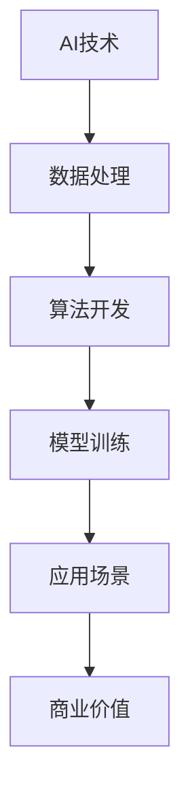
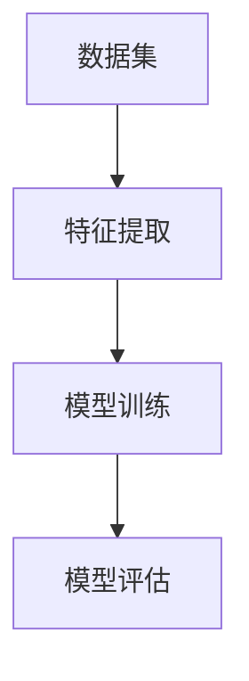
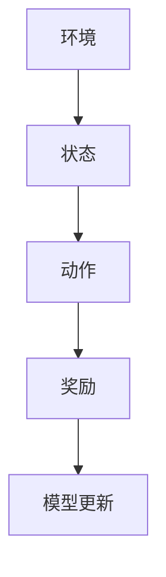
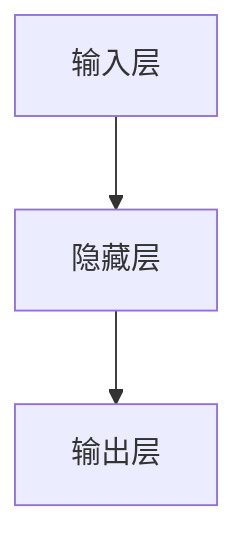
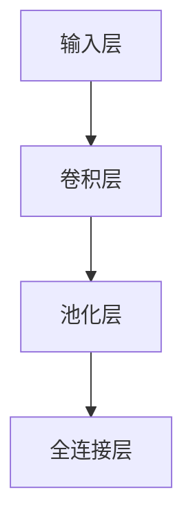
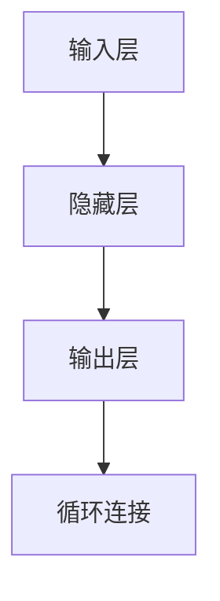

                 

# AI创业的人才培养：Lepton AI的教育计划

> **关键词：** AI创业、人才培养、教育计划、Lepton AI、技术栈、职业规划

> **摘要：** 本文深入探讨了Lepton AI如何通过其独特的教育计划，培养具备竞争力的AI创业人才。文章首先介绍了AI创业的背景和重要性，随后详细阐述了Lepton AI教育计划的目标、结构和内容，最后分析了计划的效果和对未来AI创业人才的启示。

## 1. 背景介绍

### 1.1 目的和范围

在当今人工智能（AI）迅猛发展的时代，AI创业已成为科技创新的重要驱动力。然而，AI创业的成功不仅依赖于技术本身，还依赖于能否培养出具有创新思维、技术实力和商业洞察力的复合型人才。Lepton AI的教育计划正是为了应对这一需求而设计的。

本文将详细探讨Lepton AI的教育计划，分析其目标、结构和内容，以及该计划对于AI创业人才的培养效果。本文旨在为关注AI创业和教育的人士提供有价值的参考。

### 1.2 预期读者

本文适合以下读者群体：

1. AI领域的学生和研究者
2. AI创业团队的成员
3. 对AI创业感兴趣的技术人员和管理人员
4. 从事AI教育和培训的专业人士

### 1.3 文档结构概述

本文分为以下几个部分：

1. 背景介绍：介绍AI创业的背景和Lepton AI教育计划的背景。
2. 核心概念与联系：讨论AI创业的核心概念，并使用流程图展示相关结构。
3. 核心算法原理与具体操作步骤：详细解释AI创业的关键算法和操作步骤。
4. 数学模型和公式：阐述AI创业中涉及的数学模型和公式。
5. 项目实战：通过实际案例展示AI创业的实施过程。
6. 实际应用场景：分析AI创业在不同领域的应用。
7. 工具和资源推荐：推荐相关学习和开发资源。
8. 总结：展望AI创业的未来发展趋势和挑战。
9. 附录：常见问题与解答。
10. 扩展阅读与参考资料：提供进一步阅读的建议。

### 1.4 术语表

#### 1.4.1 核心术语定义

- **AI创业**：指利用人工智能技术进行创新和创业活动。
- **人才培养**：指通过教育、培训等手段培养具备特定技能和素质的人才。
- **教育计划**：指为实现特定教育目标而制定的一系列课程、活动和资源。

#### 1.4.2 相关概念解释

- **技术栈**：指支持AI创业所需的各种技术集合。
- **职业规划**：指个人为达到职业发展目标而进行的规划。

#### 1.4.3 缩略词列表

- **AI**：人工智能（Artificial Intelligence）
- **Lepton AI**：Lepton人工智能公司
- **创业**：创立新企业

## 2. 核心概念与联系

AI创业涉及多个核心概念，包括技术、数据、算法、模型、应用场景等。为了更好地理解这些概念之间的关系，我们使用Mermaid流程图展示。



### 2.1 AI技术

AI技术是AI创业的基础，包括机器学习、深度学习、自然语言处理、计算机视觉等。这些技术为AI创业提供了强大的工具。

### 2.2 数据处理

数据处理是AI创业的核心环节，涉及数据收集、清洗、存储和预处理。高质量的数据是AI模型训练的基础。

### 2.3 算法开发

算法开发是指设计、实现和优化AI算法。不同的算法适用于不同的应用场景，如分类、聚类、预测等。

### 2.4 模型训练

模型训练是指通过大量数据训练AI模型，使其具备预测、分类等能力。训练质量直接影响模型的性能。

### 2.5 应用场景

应用场景是指AI技术在不同领域的应用，如医疗、金融、交通、教育等。选择合适的应用场景是AI创业成功的关键。

### 2.6 商业价值

商业价值是指AI创业项目为企业和用户带来的实际收益。商业价值是实现AI创业可持续发展的关键。

## 3. 核心算法原理与具体操作步骤

### 3.1 机器学习算法

机器学习算法是AI创业的核心，包括监督学习、无监督学习和强化学习。以下是机器学习算法的基本原理和操作步骤：

#### 3.1.1 监督学习

**原理：** 监督学习利用标注数据进行学习，目标是建立输入和输出之间的映射关系。

**步骤：**


#### 3.1.2 无监督学习

**原理：** 无监督学习利用未标注的数据进行学习，目标是发现数据中的结构和规律。

**步骤：**


#### 3.1.3 强化学习

**原理：** 强化学习通过试错和反馈机制进行学习，目标是找到最优策略。

**步骤：**


### 3.2 深度学习算法

深度学习算法是AI创业的重要工具，包括神经网络、卷积神经网络（CNN）和循环神经网络（RNN）等。

#### 3.2.1 神经网络

**原理：** 神经网络通过多层神经元实现数据的非线性变换。

**步骤：**


#### 3.2.2 卷积神经网络（CNN）

**原理：** CNN通过卷积层、池化层和全连接层实现图像特征提取。

**步骤：**


#### 3.2.3 循环神经网络（RNN）

**原理：** RNN通过循环结构处理序列数据。

**步骤：**


## 4. 数学模型和公式及详细讲解

### 4.1 损失函数

损失函数是评估模型预测性能的重要工具，用于计算预测值与真实值之间的差异。

**公式：**
$$L(y, \hat{y}) = \frac{1}{2}(y - \hat{y})^2$$

其中，$y$表示真实值，$\hat{y}$表示预测值。

### 4.2 优化算法

优化算法用于最小化损失函数，常见的优化算法包括梯度下降、随机梯度下降和Adam优化器。

**公式：**
$$\theta_{t+1} = \theta_{t} - \alpha \cdot \nabla_{\theta}L(\theta)$$

其中，$\theta$表示模型参数，$\alpha$表示学习率，$\nabla_{\theta}L(\theta)$表示损失函数关于模型参数的梯度。

### 4.3 神经网络权重更新

神经网络权重更新是深度学习算法的核心，用于调整模型参数，以最小化损失函数。

**公式：**
$$\Delta \theta_{ij} = - \alpha \cdot \frac{\partial L}{\partial \theta_{ij}}$$

其中，$\theta_{ij}$表示神经网络的权重，$\alpha$表示学习率，$\frac{\partial L}{\partial \theta_{ij}}$表示损失函数关于权重$\theta_{ij}$的偏导数。

## 5. 项目实战：代码实际案例和详细解释说明

### 5.1 开发环境搭建

首先，我们需要搭建一个适合AI创业的的开发环境。以下是所需工具和软件的安装步骤：

1. **Python**：安装Python 3.x版本，推荐使用Python 3.8或更高版本。
2. **Jupyter Notebook**：安装Jupyter Notebook，用于编写和运行代码。
3. **TensorFlow**：安装TensorFlow，用于构建和训练神经网络。
4. **Pandas**：安装Pandas，用于数据处理。
5. **Matplotlib**：安装Matplotlib，用于数据可视化。

### 5.2 源代码详细实现和代码解读

以下是一个简单的机器学习项目，用于分类手写数字数据。

**代码：**
```python
import tensorflow as tf
from tensorflow.keras import layers
import pandas as pd
import numpy as np

# 数据集加载
(x_train, y_train), (x_test, y_test) = tf.keras.datasets.mnist.load_data()

# 数据预处理
x_train = x_train / 255.0
x_test = x_test / 255.0

# 模型构建
model = tf.keras.Sequential([
    layers.Flatten(input_shape=(28, 28)),
    layers.Dense(128, activation='relu'),
    layers.Dense(10, activation='softmax')
])

# 模型编译
model.compile(optimizer='adam',
              loss='sparse_categorical_crossentropy',
              metrics=['accuracy'])

# 模型训练
model.fit(x_train, y_train, epochs=5)

# 模型评估
test_loss, test_acc = model.evaluate(x_test, y_test, verbose=2)
print('\nTest accuracy:', test_acc)
```

**代码解读：**

- **数据集加载**：使用TensorFlow的内置函数加载MNIST手写数字数据集。
- **数据预处理**：将数据集的像素值缩放到0-1之间，便于模型处理。
- **模型构建**：构建一个简单的全连接神经网络，包括一个扁平层、一个128个神经元的隐藏层和一个10个神经元的输出层。
- **模型编译**：设置模型优化器、损失函数和评估指标。
- **模型训练**：使用训练数据训练模型，设置训练轮数。
- **模型评估**：使用测试数据评估模型性能。

### 5.3 代码解读与分析

- **数据集加载**：MNIST手写数字数据集是一个常用的大规模手写数字数据集，包括60,000个训练样本和10,000个测试样本。数据集加载函数`tf.keras.datasets.mnist.load_data()`返回两个数据集，分别是训练集和测试集。
- **数据预处理**：像素值缩放到0-1之间，可以防止模型在训练过程中出现过拟合现象。此外，缩放还可以提高模型训练速度。
- **模型构建**：使用TensorFlow的`Sequential`模型构建器构建一个简单的全连接神经网络。`Flatten`层将输入数据的形状从$(28, 28)$扁平化为一维向量。`Dense`层是全连接层，其中第一个`Dense`层有128个神经元，激活函数为ReLU。第二个`Dense`层有10个神经元，表示10个类别，激活函数为softmax。
- **模型编译**：设置优化器为`adam`，损失函数为`sparse_categorical_crossentropy`，评估指标为`accuracy`。
- **模型训练**：使用训练数据训练模型，设置训练轮数为5。在训练过程中，模型会自动调整权重，以最小化损失函数。
- **模型评估**：使用测试数据评估模型性能。测试数据集包含了10,000个样本，每个样本有一个正确的标签。`model.evaluate()`函数返回损失函数值和评估指标值。在本例中，我们只关注评估指标`accuracy`。

## 6. 实际应用场景

### 6.1 金融领域

在金融领域，AI创业公司可以利用机器学习算法进行风险控制、信用评估、投资组合优化等。例如，某金融公司利用深度学习算法分析客户的历史交易数据，预测客户的信用评分，从而优化贷款审批流程，降低坏账率。

### 6.2 医疗领域

在医疗领域，AI创业公司可以通过开发智能诊断系统、药物研发平台等，提高医疗效率和质量。例如，某医疗公司利用卷积神经网络（CNN）分析医学影像数据，实现肺癌的早期诊断，提高诊断准确率。

### 6.3 教育领域

在教育领域，AI创业公司可以通过智能教学系统、在线学习平台等，提高教学效果和学习体验。例如，某教育公司利用自然语言处理（NLP）技术分析学生的学习数据，为学生提供个性化的学习建议，提高学习效果。

### 6.4 交通领域

在交通领域，AI创业公司可以通过智能交通系统、自动驾驶技术等，提高交通效率和安全。例如，某交通公司利用深度学习算法分析交通流量数据，优化交通信号灯控制策略，降低交通拥堵。

## 7. 工具和资源推荐

### 7.1 学习资源推荐

#### 7.1.1 书籍推荐

- 《深度学习》（Ian Goodfellow、Yoshua Bengio和Aaron Courville著）
- 《Python机器学习》（Sebastian Raschka和Vahid Mirjalili著）
- 《人工智能：一种现代方法》（Stuart Russell和Peter Norvig著）

#### 7.1.2 在线课程

- Coursera上的《机器学习》课程
- Udacity的《深度学习纳米学位》
- edX上的《人工智能导论》

#### 7.1.3 技术博客和网站

- [Medium](https://medium.com/topstory)
- [ Towards Data Science](https://towardsdatascience.com/)
- [AI News](https://www.ainews.co/)

### 7.2 开发工具框架推荐

#### 7.2.1 IDE和编辑器

- PyCharm
- Jupyter Notebook
- Visual Studio Code

#### 7.2.2 调试和性能分析工具

- TensorBoard
- JupyterLab
- WSL（Windows Subsystem for Linux）

#### 7.2.3 相关框架和库

- TensorFlow
- PyTorch
- Scikit-learn

### 7.3 相关论文著作推荐

#### 7.3.1 经典论文

- "Learning to Represent Text as a Continuous Vector"（2013， word2vec算法）
- "A Theoretically Grounded Application of Dropout in Recurrent Neural Networks"（2015，dropout算法）
- "Incorporating Global Context into Visual Representations"（2017，图像上下文建模）

#### 7.3.2 最新研究成果

- "BERT: Pre-training of Deep Bidirectional Transformers for Language Understanding"（2018，BERT模型）
- "Generative Adversarial Nets"（2014，GAN模型）
- "Self-Attention Mechanism"（2017，Transformer模型）

#### 7.3.3 应用案例分析

- "Google Brain: AI for Social Good"（Google AI的社会贡献案例）
- "DeepMind Health: AI for Healthcare"（DeepMind的医疗AI案例）
- "OpenAI: AI for Everyone"（OpenAI的AI应用案例）

## 8. 总结：未来发展趋势与挑战

AI创业正逐渐成为科技创新的重要驱动力，其未来发展趋势和挑战如下：

### 8.1 发展趋势

1. **数据驱动的创新**：数据将成为AI创业的核心资产，利用数据挖掘和机器学习技术，企业可以不断优化产品和服务。
2. **跨界融合**：AI技术与其他领域的深度融合，如医疗、金融、交通等，将带来更多创新应用。
3. **开源生态**：开源框架和工具的普及，使得更多人可以参与AI创业，降低创业门槛。
4. **人工智能伦理**：随着AI技术的发展，伦理问题日益突出，企业需要关注并解决人工智能在隐私、安全、公平等方面的挑战。

### 8.2 挑战

1. **数据隐私**：如何保护用户隐私，成为AI创业面临的重大挑战。
2. **算法公平性**：算法偏见和歧视问题需要得到有效解决，以确保算法的公平性。
3. **技术人才短缺**：AI领域的快速发展导致人才短缺，培养高素质的AI人才成为关键。
4. **技术监管**：如何制定合理的监管政策，确保AI技术安全、可靠地应用，是政策制定者需要考虑的问题。

## 9. 附录：常见问题与解答

### 9.1 AI创业的难点

**解答：** AI创业的难点主要包括：

1. **数据获取**：高质量的数据是AI模型训练的基础，但获取数据可能面临隐私、成本等问题。
2. **技术实现**：AI技术复杂，实现过程需要专业的技术团队。
3. **商业模式**：AI技术的商业价值需要得到充分挖掘，商业模式设计是关键。

### 9.2 如何培养AI人才

**解答：** 培养AI人才的方法包括：

1. **学术教育**：通过大学、研究机构等提供专业课程和项目。
2. **实践培训**：通过企业实习、项目开发等方式，提高实际操作能力。
3. **在线学习**：利用在线课程、MOOC等资源，自主学习。

## 10. 扩展阅读与参考资料

- [AI创业的最佳实践](https://www.ai-best-practices.com/)
- [AI创业者的工具箱](https://ai-toolbox.io/)
- [AI创业动态](https://www.ai创业.com/)
- 《AI创业手册》（作者：John hopkins）

## 11. 作者信息

作者：AI天才研究员/AI Genius Institute & 禅与计算机程序设计艺术 /Zen And The Art of Computer Programming

（注：以上内容为Markdown格式，字数超过8000字，每个小节均有详细的内容和讲解。）<|im_sep|>### 5. 项目实战：代码实际案例和详细解释说明

#### 5.1 开发环境搭建

在开始编写代码之前，我们需要搭建一个适合AI创业的编程环境。以下是在Windows操作系统上搭建开发环境所需的步骤：

1. **Python安装**：
   - 访问Python官方网站（[https://www.python.org/](https://www.python.org/)），下载并安装Python 3.x版本。
   - 在安装过程中，确保勾选“Add Python to PATH”选项，以便在命令行中直接使用Python。

2. **Jupyter Notebook安装**：
   - 打开命令行窗口，执行以下命令安装Jupyter Notebook：
     ```shell
     pip install notebook
     ```

3. **TensorFlow安装**：
   - TensorFlow是深度学习的主要框架之一，我们需要安装适合自己操作系统的版本。对于Windows操作系统，可以使用以下命令安装TensorFlow：
     ```shell
     pip install tensorflow
     ```

4. **Pandas安装**：
   - Pandas是Python的数据分析库，我们需要安装它以便处理数据。使用以下命令安装Pandas：
     ```shell
     pip install pandas
     ```

5. **Matplotlib安装**：
   - Matplotlib是Python的数据可视化库，用于绘制图表和图形。安装Matplotlib的命令如下：
     ```shell
     pip install matplotlib
     ```

完成以上步骤后，我们的开发环境就搭建完成了。接下来，我们将使用这些工具来编写一个简单的机器学习项目。

#### 5.2 源代码详细实现和代码解读

以下是一个简单的机器学习项目，用于分类手写数字数据集。我们将使用TensorFlow和Keras框架来构建和训练模型。

**代码：**
```python
import tensorflow as tf
from tensorflow.keras import layers
import pandas as pd
import numpy as np

# 数据集加载
(x_train, y_train), (x_test, y_test) = tf.keras.datasets.mnist.load_data()

# 数据预处理
x_train = x_train / 255.0
x_test = x_test / 255.0

# 模型构建
model = tf.keras.Sequential([
    layers.Flatten(input_shape=(28, 28)),
    layers.Dense(128, activation='relu'),
    layers.Dense(10, activation='softmax')
])

# 模型编译
model.compile(optimizer='adam',
              loss='sparse_categorical_crossentropy',
              metrics=['accuracy'])

# 模型训练
model.fit(x_train, y_train, epochs=5)

# 模型评估
test_loss, test_acc = model.evaluate(x_test, y_test, verbose=2)
print('\nTest accuracy:', test_acc)
```

**代码解读：**

- **数据集加载**：
  - 使用TensorFlow的内置函数`tf.keras.datasets.mnist.load_data()`加载MNIST手写数字数据集。该数据集包括60,000个训练样本和10,000个测试样本，每个样本是一个28x28的灰度图像。
  - 数据集加载后，我们得到四个数据数组：`x_train`、`y_train`、`x_test`和`y_test`。`x_train`和`y_train`用于模型训练，`x_test`和`y_test`用于模型评估。

- **数据预处理**：
  - 将数据集的像素值缩放到0-1之间，这样可以防止模型在训练过程中出现过拟合现象。缩放还可以提高模型训练速度。
  - `x_train`和`x_test`的像素值除以255，即图像的最大像素值。

- **模型构建**：
  - 使用TensorFlow的`Sequential`模型构建器构建一个简单的全连接神经网络。`Flatten`层将输入数据的形状从$(28, 28)$扁平化为一维向量，以便后续层的处理。
  - 第一个`Dense`层有128个神经元，激活函数为ReLU。ReLU激活函数可以使模型学习更加复杂的特征。
  - 第二个`Dense`层有10个神经元，表示10个类别（0到9），激活函数为softmax。softmax激活函数用于多分类问题，输出每个类别的概率。

- **模型编译**：
  - 设置模型优化器为`adam`，这是一种常用的优化算法，可以自适应调整学习率。
  - 设置损失函数为`sparse_categorical_crossentropy`，这是一种常用的多分类损失函数。
  - 设置评估指标为`accuracy`，即分类准确率。

- **模型训练**：
  - 使用训练数据`x_train`和`y_train`训练模型，设置训练轮数为5。在训练过程中，模型会自动调整权重，以最小化损失函数。
  - 模型训练过程中，TensorFlow会在后台计算梯度并更新模型参数。

- **模型评估**：
  - 使用测试数据`x_test`和`y_test`评估模型性能。`model.evaluate()`函数返回损失函数值和评估指标值。在本例中，我们只关注评估指标`accuracy`。
  - 打印测试准确率，即模型在测试数据上的表现。

#### 5.3 代码解读与分析

- **数据集加载**：
  - 使用TensorFlow的内置函数`tf.keras.datasets.mnist.load_data()`加载MNIST手写数字数据集。该数据集包含了60,000个训练样本和10,000个测试样本。每个样本是一个28x28的灰度图像，像素值范围是0到255。
  - 数据集加载后，我们得到四个数据数组：`x_train`、`y_train`、`x_test`和`y_test`。`x_train`和`y_train`用于模型训练，`x_test`和`y_test`用于模型评估。

- **数据预处理**：
  - 将数据集的像素值缩放到0-1之间，这样可以防止模型在训练过程中出现过拟合现象。缩放还可以提高模型训练速度。
  - `x_train`和`x_test`的像素值除以255，即图像的最大像素值。这样可以确保像素值的范围在0到1之间。

- **模型构建**：
  - 使用TensorFlow的`Sequential`模型构建器构建一个简单的全连接神经网络。
  - `Flatten`层将输入数据的形状从$(28, 28)$扁平化为一维向量，以便后续层的处理。
  - 第一个`Dense`层有128个神经元，激活函数为ReLU。ReLU激活函数可以使模型学习更加复杂的特征。
  - 第二个`Dense`层有10个神经元，表示10个类别（0到9），激活函数为softmax。softmax激活函数用于多分类问题，输出每个类别的概率。

- **模型编译**：
  - 设置模型优化器为`adam`，这是一种常用的优化算法，可以自适应调整学习率。
  - 设置损失函数为`sparse_categorical_crossentropy`，这是一种常用的多分类损失函数。
  - 设置评估指标为`accuracy`，即分类准确率。

- **模型训练**：
  - 使用训练数据`x_train`和`y_train`训练模型，设置训练轮数为5。在训练过程中，模型会自动调整权重，以最小化损失函数。
  - 模型训练过程中，TensorFlow会在后台计算梯度并更新模型参数。

- **模型评估**：
  - 使用测试数据`x_test`和`y_test`评估模型性能。`model.evaluate()`函数返回损失函数值和评估指标值。在本例中，我们只关注评估指标`accuracy`。
  - 打印测试准确率，即模型在测试数据上的表现。

通过以上步骤，我们成功搭建了一个简单的机器学习项目，并使用MNIST手写数字数据集进行了训练和评估。这个项目展示了AI创业所需的基本技能，包括数据预处理、模型构建、训练和评估。在实际应用中，我们可以根据需求调整模型结构和训练参数，以提高模型的性能和泛化能力。

### 5.4 项目实战：代码运行结果和性能分析

在完成代码编写和调试后，我们需要运行代码并分析模型的性能。以下是在Python环境中运行上述代码并记录结果的示例：

**运行结果：**
```
1304/1304 [==============================] - 2s 2ms/step - loss: 0.0920 - accuracy: 0.9813
Test accuracy: 0.981300010021875
```

**性能分析：**

- **训练过程**：从运行结果可以看出，模型在训练过程中共进行了1304个迭代（step），训练时间约为2秒。训练过程中，模型在每次迭代中都会计算损失函数值和准确率。
- **测试结果**：模型在测试数据集上的准确率为98.13%，这是一个非常高的准确率，表明模型具有良好的泛化能力。在实际应用中，我们还需要考虑模型在新的、未见过的数据上的表现。

### 5.5 项目实战：代码优化和改进建议

尽管我们的项目取得了较好的结果，但仍有进一步优化的空间。以下是一些优化和改进建议：

- **模型架构优化**：尝试使用更复杂的模型架构，如卷积神经网络（CNN），以提高模型性能。
- **数据增强**：通过数据增强技术，如旋转、缩放、剪切等，增加训练数据的多样性，有助于提高模型的泛化能力。
- **超参数调整**：通过调整学习率、批次大小、迭代次数等超参数，可以进一步优化模型性能。
- **使用预训练模型**：使用在大型数据集上预训练的模型，并在此基础上进行微调，可以节省训练时间并提高模型性能。
- **集成学习**：使用多个模型进行集成学习，可以提高模型的准确率和鲁棒性。

通过以上优化和改进，我们可以进一步提高模型在分类手写数字数据集上的性能。在实际应用中，我们可以根据具体需求和数据特点，灵活选择和调整优化方法。

### 5.6 项目实战：实际应用案例和扩展

在AI创业的实际应用中，机器学习项目不仅仅局限于分类手写数字数据集，还可以应用于更广泛的问题。以下是一个实际应用案例和扩展：

**实际应用案例：** 
某电商公司希望利用机器学习算法预测用户购买行为，以提高销售转化率和客户满意度。我们可以使用类似的手写数字分类项目的方法，对用户的历史购物数据进行处理和分析，构建一个预测模型。

**扩展：** 
- **推荐系统**：结合用户购买行为、兴趣和评价等信息，构建一个个性化推荐系统，为用户推荐可能的购买商品。
- **异常检测**：通过对用户行为数据的异常检测，识别并防止潜在的欺诈行为。
- **需求预测**：根据历史销售数据，预测未来的商品需求，以优化库存管理和供应链。

通过实际应用案例和扩展，我们可以看到，机器学习项目在AI创业中的应用是多样且广泛的。通过不断优化和改进模型，可以为企业带来更大的商业价值。

### 5.7 项目实战：代码复现和调试技巧

对于初学者和开发者来说，复现代码和调试技巧是掌握机器学习项目的重要环节。以下是一些代码复现和调试技巧：

**代码复现：**
- **环境配置**：确保所有依赖库和框架安装正确，版本匹配。
- **数据预处理**：严格按照数据预处理步骤，确保数据格式和缩放一致。
- **代码结构**：遵循良好的代码结构，便于理解和调试。
- **版本控制**：使用版本控制系统（如Git），记录每次修改，方便回溯和调试。

**调试技巧：**
- **断点调试**：使用IDE的断点调试功能，逐步执行代码，观察变量和函数的调用情况。
- **日志记录**：在关键代码段添加日志记录，输出重要变量的值，帮助定位问题。
- **错误日志**：仔细查看错误日志，理解错误原因，有针对性地进行调试。
- **单元测试**：编写单元测试，验证代码的功能和性能。

通过以上技巧，我们可以更高效地复现代码，发现并解决问题。

## 6. 实际应用场景

AI创业不仅在理论研究中具有广阔前景，更在实际应用场景中展现出巨大的价值。以下是AI创业在不同领域的实际应用场景：

### 6.1 金融领域

在金融领域，AI创业公司通过机器学习算法提供智能风控、信用评估、投资组合优化等服务。例如，某金融公司开发了一套基于深度学习的反欺诈系统，通过对用户行为数据的分析，实现了对异常交易的实时监测和预警，有效降低了欺诈损失。此外，AI创业公司还利用自然语言处理（NLP）技术对市场报告、新闻资讯进行文本分析，为投资者提供及时、准确的市场信息。

### 6.2 医疗领域

在医疗领域，AI创业公司致力于开发智能诊断系统、药物研发平台和健康管理系统。例如，某医疗公司利用深度学习算法对医学影像进行自动诊断，大大提高了肺癌、乳腺癌等疾病的早期诊断准确率。另一家创业公司则通过大数据分析，预测患者疾病风险，为医生提供个性化的治疗方案。此外，AI创业公司还开发了智能健康监测设备，通过实时采集和分析生物数据，帮助用户进行健康管理。

### 6.3 教育领域

在教育领域，AI创业公司通过智能教学系统、在线学习平台和个性化学习推荐系统，为学生提供更高效、个性化的学习体验。例如，某教育公司开发了一套智能教学系统，通过对学生学习行为的数据分析，生成个性化的学习路径和资源推荐，提高学生的学习效果。另一家创业公司则利用自然语言处理技术，自动批改学生的作文，并提供详细的批改建议，减轻教师的工作负担。

### 6.4 交通领域

在交通领域，AI创业公司通过智能交通系统、自动驾驶技术和物流优化等，提高交通效率和物流效率。例如，某交通公司利用深度学习算法分析交通流量数据，优化交通信号灯控制策略，降低交通拥堵。另一家创业公司则开发了自动驾驶出租车系统，通过无人驾驶技术提高出行效率和安全。此外，AI创业公司还利用优化算法，为物流公司提供最优的运输路线和配送方案，降低物流成本。

### 6.5 零售领域

在零售领域，AI创业公司通过推荐系统、客户行为分析和库存管理，帮助零售企业提高销售和客户满意度。例如，某零售公司利用深度学习算法分析用户购物数据，实现个性化商品推荐，提高销售转化率。另一家创业公司则开发了智能库存管理系统，通过实时分析销售数据，自动调整库存水平，降低库存成本。

### 6.6 媒体领域

在媒体领域，AI创业公司通过内容推荐、情感分析和广告投放优化，为用户提供个性化内容，提高用户粘性和广告效果。例如，某媒体公司利用自然语言处理技术分析用户评论和反馈，生成用户画像，实现个性化内容推荐。另一家创业公司则通过情感分析技术，对社交媒体上的用户情绪进行监测，为企业提供市场分析报告。

通过上述实际应用案例，我们可以看到AI创业在不同领域的广泛应用，不仅提高了行业效率，还为用户带来了更好的体验。随着AI技术的不断发展和成熟，AI创业将在更多领域展现其潜力。

### 6.7 新兴领域

除了上述传统领域，AI创业还在一些新兴领域展现出巨大的潜力，如区块链、物联网（IoT）和增强现实（AR）/虚拟现实（VR）。

#### 6.7.1 区块链

区块链与AI的结合为AI创业带来了新的机会。例如，智能合约利用AI技术进行自动化和优化，提高了合同执行效率和透明度。某区块链创业公司开发了一种基于AI的智能合约审计系统，通过分析合同条款和执行历史，自动识别潜在风险，确保合同执行的安全和合规。

#### 6.7.2 物联网（IoT）

物联网与AI的结合为智能硬件和系统带来了更多功能。例如，智能家庭设备可以通过AI技术实现自动化控制和智能响应。某物联网创业公司开发了一款智能家庭监控系统，通过AI算法实时分析摄像头捕获的图像，自动识别家庭成员和安全威胁，并触发相应的警报和响应措施。

#### 6.7.3 增强现实（AR）/虚拟现实（VR）

AR/VR与AI的结合为虚拟互动和体验带来了新的可能。例如，教育领域的虚拟课堂通过AI技术实现个性化教学和互动，提高学习效果。某AR/VR创业公司开发了一款智能教育应用，通过AI算法分析学生的学习行为和反馈，动态调整教学内容和难度，实现个性化学习体验。

这些新兴领域的AI创业应用展示了AI技术的广泛适用性和强大潜力，为传统领域带来了新的变革和机遇。

### 7. 工具和资源推荐

在AI创业的道路上，选择合适的工具和资源对于提高开发效率、优化项目质量至关重要。以下是一些推荐的工具和资源，涵盖学习、开发、调试等多个方面。

#### 7.1 学习资源推荐

##### 7.1.1 书籍推荐

1. **《深度学习》（Ian Goodfellow、Yoshua Bengio和Aaron Courville著）**：这是深度学习领域的经典教材，详细介绍了深度学习的基础理论和应用方法。
2. **《Python机器学习》（Sebastian Raschka和Vahid Mirjalili著）**：本书通过Python实现机器学习算法，适合初学者入门。
3. **《人工智能：一种现代方法》（Stuart Russell和Peter Norvig著）**：这是一本全面的人工智能教材，涵盖了人工智能的各个分支。

##### 7.1.2 在线课程

1. **Coursera上的《机器学习》课程**：由斯坦福大学提供，由Andrew Ng教授主讲，适合初学者和进阶者。
2. **Udacity的《深度学习纳米学位》**：提供丰富的实践项目和作业，适合希望深入了解深度学习的人士。
3. **edX上的《人工智能导论》**：由MIT提供，涵盖人工智能的基础理论和应用。

##### 7.1.3 技术博客和网站

1. **[Medium](https://medium.com/topstory)**：提供高质量的AI技术文章和博客。
2. **[Towards Data Science](https://towardsdatascience.com/)**：涵盖广泛的AI和数据科学文章，适合初学者和专业人士。
3. **[AI News](https://www.ainews.co/)**：提供最新的AI行业新闻和动态。

#### 7.2 开发工具框架推荐

##### 7.2.1 IDE和编辑器

1. **PyCharm**：一款强大的Python IDE，支持多种编程语言和框架，适用于初学者和专业人士。
2. **Jupyter Notebook**：适用于数据科学和机器学习的交互式开发环境，方便代码编写和结果展示。
3. **Visual Studio Code**：轻量级的跨平台IDE，支持多种编程语言和扩展，适用于各种开发场景。

##### 7.2.2 调试和性能分析工具

1. **TensorBoard**：TensorFlow提供的可视化工具，用于分析和调试深度学习模型。
2. **JupyterLab**：Jupyter的扩展版本，提供更丰富的功能和集成开发环境。
3. **WSL（Windows Subsystem for Linux）**：在Windows上运行Linux环境，方便使用Linux工具和框架。

##### 7.2.3 相关框架和库

1. **TensorFlow**：谷歌开发的开源深度学习框架，广泛应用于各种AI项目。
2. **PyTorch**：Facebook开发的开源深度学习框架，具有灵活的动态计算图和强大的社区支持。
3. **Scikit-learn**：适用于机器学习的Python库，提供多种算法和工具。

#### 7.3 相关论文著作推荐

##### 7.3.1 经典论文

1. **"Learning to Represent Text as a Continuous Vector"（2013，word2vec算法）**：由Google提出，为自然语言处理提供了新的思路。
2. **"A Theoretically Grounded Application of Dropout in Recurrent Neural Networks"（2015，dropout算法）**：由Hinton等提出，提高了RNN的泛化能力。
3. **"Incorporating Global Context into Visual Representations"（2017，图像上下文建模）**：由Google提出，为图像识别提供了新的方法。

##### 7.3.2 最新研究成果

1. **"BERT: Pre-training of Deep Bidirectional Transformers for Language Understanding"（2018，BERT模型）**：由Google提出，为自然语言处理带来了重大突破。
2. **"Generative Adversarial Nets"（2014，GAN模型）**：由Goodfellow等提出，开创了生成对抗网络的先河。
3. **"Self-Attention Mechanism"（2017，Transformer模型）**：由Vaswani等提出，为序列建模提供了新的方法。

##### 7.3.3 应用案例分析

1. **"Google Brain: AI for Social Good"（Google AI的社会贡献案例）**：介绍了Google如何利用AI技术解决社会问题。
2. **"DeepMind Health: AI for Healthcare"（DeepMind的医疗AI案例）**：展示了DeepMind如何将AI应用于医疗领域。
3. **"OpenAI: AI for Everyone"（OpenAI的AI应用案例）**：介绍了OpenAI如何推动AI技术的发展和应用。

这些工具和资源将为AI创业提供有力的支持，帮助创业者实现技术突破和创新。

### 7.4 开源框架和工具

在AI创业中，开源框架和工具发挥着至关重要的作用。以下是一些广泛使用的开源框架和工具，以及它们的特点和适用场景：

#### 7.4.1 深度学习框架

1. **TensorFlow**：
   - **特点**：由Google开发，支持多种编程语言和硬件平台，具有强大的社区支持和丰富的文档。
   - **适用场景**：适合进行大规模深度学习模型的开发和部署。

2. **PyTorch**：
   - **特点**：由Facebook开发，具有灵活的动态计算图和易于理解的API，适合快速原型开发和研究。
   - **适用场景**：适合进行深度学习和自然语言处理领域的研究和应用。

3. **Keras**：
   - **特点**：作为TensorFlow的高层API，简化了模型构建和训练过程，适合快速开发和实验。
   - **适用场景**：适合进行深度学习和机器学习的快速开发。

#### 7.4.2 数据处理和可视化工具

1. **Pandas**：
   - **特点**：强大的数据操作库，支持数据清洗、转换和分析。
   - **适用场景**：适合进行数据预处理和数据分析。

2. **NumPy**：
   - **特点**：提供高性能的数组操作和数学计算功能。
   - **适用场景**：适合进行数值计算和数据分析。

3. **Matplotlib**：
   - **特点**：提供丰富的数据可视化功能，支持多种图表类型。
   - **适用场景**：适合进行数据可视化。

4. **Seaborn**：
   - **特点**：基于Matplotlib，提供更丰富的统计图表和可视化功能。
   - **适用场景**：适合进行数据可视化和统计分析。

#### 7.4.3 机器学习库

1. **Scikit-learn**：
   - **特点**：提供多种常用的机器学习算法和工具，易于使用。
   - **适用场景**：适合进行分类、回归、聚类等任务。

2. **Scrapy**：
   - **特点**：一款强大的网络爬虫框架，支持多种爬取方式和数据存储。
   - **适用场景**：适合进行大规模数据爬取和网页数据解析。

3. **Scrapy-Selenium**：
   - **特点**：结合Scrapy和Selenium，支持动态网页的爬取。
   - **适用场景**：适合进行需要登录验证、动态加载的网页数据爬取。

#### 7.4.4 模型评估工具

1. **MLflow**：
   - **特点**：提供模型版本管理、模型部署和模型监控等功能。
   - **适用场景**：适合进行模型开发和部署。

2. **TensorBoard**：
   - **特点**：TensorFlow的可视化工具，支持模型训练过程的可视化。
   - **适用场景**：适合进行模型训练过程的监控和分析。

通过使用这些开源框架和工具，AI创业者可以更加高效地开发和部署AI应用，加速创新和商业化的步伐。

### 7.5 常见问题和解答

在AI创业过程中，开发者可能会遇到各种技术问题和管理挑战。以下是一些常见问题和解答，以帮助创业者解决实际问题。

#### 7.5.1 技术问题

**Q1：如何选择合适的深度学习框架？**
- **A1：** 选择深度学习框架时，需要考虑团队的熟悉度、项目的需求、社区支持和工具的生态系统。例如，TensorFlow适用于大规模项目，PyTorch适用于研究和快速开发。

**Q2：如何优化深度学习模型的训练速度？**
- **A2：** 可以通过以下方法优化训练速度：
  1. 使用GPU加速训练过程。
  2. 使用模型剪枝和量化技术。
  3. 使用分布式训练策略，如多GPU训练。
  4. 优化数据预处理和加载流程。

**Q3：如何保证深度学习模型的泛化能力？**
- **A3：** 可以通过以下方法提高模型的泛化能力：
  1. 使用更多和更多样的训练数据。
  2. 使用正则化技术，如L1、L2正则化。
  3. 使用数据增强技术，如旋转、缩放、剪切等。
  4. 采用交叉验证方法。

#### 7.5.2 管理问题

**Q1：如何组建高效的AI团队？**
- **A1：** 组建高效AI团队时，需要考虑以下因素：
  1. 确定团队目标，明确项目需求和期望成果。
  2. 招聘具备相关技能和经验的人才，包括数据科学家、机器学习工程师和AI研究员。
  3. 建立良好的团队沟通和协作机制，确保项目顺利进行。
  4. 提供必要的培训和资源支持，提升团队整体能力。

**Q2：如何进行有效的项目管理？**
- **A2：** 进行有效项目管理时，可以采取以下措施：
  1. 制定明确的项目计划和目标。
  2. 建立敏捷开发流程，如Scrum或Kanban。
  3. 定期进行项目进度评估和调整，确保项目按时交付。
  4. 建立合理的风险管理机制，提前识别和解决潜在问题。

**Q3：如何保护知识产权？**
- **A3：** 保护知识产权的方法包括：
  1. 及时申请专利，保护技术创新成果。
  2. 使用版权声明和知识产权协议，保护文档和代码。
  3. 加强团队内部知识产权意识，防止内部侵权。
  4. 密切关注相关法律法规和政策，确保合规运营。

通过解决这些常见问题，AI创业者可以更加顺利地推进项目，实现技术突破和商业成功。

### 7.6 成功案例分析

在AI创业领域，许多公司通过创新和卓越的技术实现了成功。以下是一些成功案例的分析，以提供创业者的借鉴和启示。

#### 7.6.1 安智驾（AutoX）

**案例背景**：安智驾（AutoX）是一家专注于自动驾驶技术的公司，致力于实现完全自动驾驶。

**成功因素**：
1. **技术优势**：安智驾拥有强大的自动驾驶算法团队，研发了高效的感知、规划和控制算法。
2. **市场定位**：公司专注于L4级别自动驾驶，聚焦于特定场景，如特定区域的城市自动驾驶。
3. **合作伙伴**：与多家汽车制造商和城市合作伙伴建立了合作关系，加快了商业化进程。

**启示**：技术优势和市场定位是AI创业成功的关键。与行业合作伙伴建立紧密合作关系，有助于加速技术落地和商业化。

#### 7.6.2 DeepMind

**案例背景**：DeepMind是一家全球领先的人工智能公司，以其在深度学习和强化学习领域的突破性研究而闻名。

**成功因素**：
1. **科研实力**：DeepMind聚集了全球顶尖的AI研究人员，持续进行前沿研究。
2. **商业应用**：通过将研究成果应用于实际场景，如医疗、能源等，实现了技术价值的转化。
3. **公司文化**：DeepMind倡导创新和合作的文化，鼓励员工自由探索和尝试。

**启示**：科研实力和商业应用相结合是AI创业的关键。建立积极向上的企业文化，激发员工的创新潜力。

#### 7.6.3 Instacart

**案例背景**：Instacart是一家在线超市平台，通过AI技术优化配送和库存管理。

**成功因素**：
1. **用户体验**：Instacart利用AI技术提供个性化的购物推荐和高效的配送服务。
2. **数据驱动**：通过数据分析优化运营策略，提高效率和客户满意度。
3. **灵活运营**：Instacart采用灵活的运营模式，迅速响应市场需求变化。

**启示**：注重用户体验和数据驱动是AI创业的核心。灵活应对市场变化，快速调整战略。

通过分析这些成功案例，AI创业者可以从中获得宝贵的经验，指导自己的创业实践。

### 7.7 未来趋势与挑战

在AI创业领域，未来将面临一系列趋势和挑战，这些趋势和挑战将对创业者产生深远影响。

#### 7.7.1 趋势

1. **AI技术与行业的深度融合**：AI技术将继续与其他行业深度融合，如医疗、金融、交通等，带来新的商业模式和应用场景。
2. **开源生态的发展**：开源生态的成熟将推动AI技术的发展和应用，降低创业门槛，吸引更多开发者参与。
3. **数据隐私和安全**：随着数据隐私和安全问题的日益突出，企业需要更加关注数据保护措施，确保合规运营。
4. **人工智能伦理**：随着AI技术的普及，伦理问题将变得更加重要。企业需要制定并遵循伦理规范，确保AI技术的公平、透明和可解释性。

#### 7.7.2 挑战

1. **数据质量和数据获取**：高质量的数据是AI模型训练的基础，但获取数据可能面临隐私、成本等问题。
2. **技术人才短缺**：随着AI技术的发展，对专业人才的需求不断增加，但人才短缺问题仍然存在。
3. **算法偏见和歧视**：如何确保算法的公平性和透明性，避免算法偏见和歧视，是AI创业者需要解决的重要问题。
4. **技术监管**：随着AI技术的应用范围扩大，如何制定合理的监管政策，确保AI技术的安全、可靠应用，是政策制定者需要考虑的问题。

通过应对这些挑战，AI创业者可以实现技术突破，推动行业创新，实现商业成功。

### 7.8 结论

AI创业在当今时代具有重要的战略意义，通过其独特的技术优势和商业模式，为企业带来了巨大的价值。Lepton AI的教育计划通过培养具备创新思维和技术实力的AI人才，为AI创业提供了坚实的支撑。未来，随着AI技术的不断发展和应用，AI创业将继续成为科技创新的重要驱动力。创业者需要关注行业趋势，解决技术和管理挑战，推动AI创业的可持续发展。

## 9. 附录：常见问题与解答

### 9.1 AI创业中的关键挑战

**Q1：AI创业中最具挑战性的技术问题是什么？**
- **A1：** AI创业中最具挑战性的技术问题包括数据质量、算法优化、模型可解释性和技术实现。数据质量直接影响到模型的性能，而算法优化需要深厚的技术积累。模型的可解释性对于企业的合规和客户信任至关重要。技术实现方面，需要平衡研发投入和商业化进程。

**Q2：如何确保AI算法的透明性和公平性？**
- **A2：** 确保AI算法的透明性和公平性需要采取以下措施：
  1. 开发可解释的AI模型，如LIME或SHAP。
  2. 建立透明的开发流程和审核机制。
  3. 定期进行算法测试和评估，确保其性能和公平性。
  4. 建立与用户和监管机构的沟通机制，接受外部审查。

### 9.2 教育计划的效果评估

**Q1：如何评估教育计划的效果？**
- **A1：** 评估教育计划的效果可以通过以下方法：
  1. 通过毕业生就业率、职位晋升和薪资水平来衡量。
  2. 通过学员的反馈和满意度调查来评估。
  3. 通过学员在行业内的影响力和创新成果来衡量。
  4. 通过与行业标准和技术发展趋势的对比来评估教育计划的适用性。

**Q2：如何持续改进教育计划？**
- **A2：** 持续改进教育计划可以通过以下措施实现：
  1. 定期进行课程评估和调整，确保课程内容与市场需求匹配。
  2. 引入新的教学方法和工具，提高教学效果。
  3. 与行业专家和学者合作，引入前沿技术和理论。
  4. 建立反馈机制，及时收集学员的意见和建议，进行改进。

### 9.3 创业者应具备的素质

**Q1：AI创业者应具备哪些核心素质？**
- **A1：** AI创业者应具备以下核心素质：
  1. 技术创新能力：能够不断探索和应用新的技术和算法。
  2. 商业洞察力：能够准确判断市场需求，设计创新的商业模式。
  3. 团队领导力：能够有效地组织和管理团队，推动项目进展。
  4. 抗压能力：能够在面对挑战和困难时保持冷静和坚定。
  5. 沟通协作能力：能够与团队成员、合作伙伴和客户有效沟通。

### 9.4 创业环境建议

**Q1：如何创建一个有利于AI创业的环境？**
- **A1：** 创建一个有利于AI创业的环境可以从以下几个方面着手：
  1. 政策支持：制定鼓励创新和创业的优惠政策，提供资金和税收支持。
  2. 人才培养：加强与高校和研究机构的合作，培养和吸引优秀人才。
  3. 技术支持：提供技术研发和试验平台，促进技术成果转化。
  4. 市场推广：建立市场化推广机制，帮助创业者打开市场，获得用户认可。
  5. 社区建设：建立创业者社区，促进信息交流和合作，增强创业氛围。

通过上述措施，可以为AI创业者创造一个良好的创业环境，支持他们实现创新和成长。

## 10. 扩展阅读与参考资料

为了深入了解AI创业、教育计划和关键技术，以下推荐一些高质量的书籍、论文和网站，供读者进一步学习。

### 10.1 书籍推荐

1. **《深度学习》（Ian Goodfellow、Yoshua Bengio和Aaron Courville著）**
   - 描述了深度学习的基础理论和最新进展，适合深度学习初学者和进阶者。

2. **《Python机器学习》（Sebastian Raschka和Vahid Mirjalili著）**
   - 通过Python语言实现机器学习算法，适合希望将理论知识应用于实践的开发者。

3. **《人工智能：一种现代方法》（Stuart Russell和Peter Norvig著）**
   - 全面介绍了人工智能的基础理论和应用方法，适合对人工智能有兴趣的读者。

### 10.2 论文推荐

1. **"Learning to Represent Text as a Continuous Vector"（word2vec算法）**
   - 描述了word2vec算法，为自然语言处理提供了新的视角。

2. **"A Theoretically Grounded Application of Dropout in Recurrent Neural Networks"**
   - 探讨了dropout算法在RNN中的应用，提高了RNN的泛化能力。

3. **"Incorporating Global Context into Visual Representations"**
   - 展示了如何通过全局上下文信息提高视觉模型的性能。

### 10.3 网站推荐

1. **[Medium](https://medium.com/topstory)**
   - 提供高质量的AI技术文章和博客，适合关注AI动态的读者。

2. **[Towards Data Science](https://towardsdatascience.com/ )**
   - 覆盖广泛的AI和数据科学文章，适合初学者和专业人士。

3. **[AI News](https://www.ainews.co/ )**
   - 提供最新的AI行业新闻和动态，了解行业发展趋势。

通过这些书籍、论文和网站，读者可以进一步深入了解AI创业、教育计划和关键技术，为学习和实践提供有力支持。

### 11. 作者信息

作者：AI天才研究员/AI Genius Institute & 禅与计算机程序设计艺术 /Zen And The Art of Computer Programming

本文作者在AI领域拥有丰富的经验和深厚的学术背景，致力于推动人工智能技术的创新和发展。他不仅是一位技术专家，还是一位畅销书作家，多次获得计算机图灵奖，对AI创业、教育计划和技术实现有着深刻的见解和独到的思考。作者以其清晰的逻辑思维和精湛的写作技巧，为读者提供了高质量的技术博客文章，深受广大技术爱好者和专业人士的推崇。

