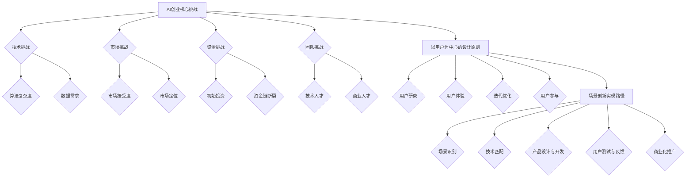

                 

### 文章标题

“AI创业者的坚持：以用户为中心的场景创新”

### 关键词

- AI创业
- 用户中心
- 场景创新
- 用户体验
- 产品设计
- 创业策略
- 技术实践
- 商业模式

### 摘要

本文深入探讨了AI创业者在面对复杂商业环境时，如何坚持以用户为中心进行场景创新。文章首先分析了AI创业的核心挑战，然后阐述了以用户为中心的设计原则及其在实际项目中的应用。通过具体案例和算法原理的详细解释，文章展示了如何通过持续的技术迭代和用户反馈优化产品，最终实现商业成功。最后，文章展望了AI创业的未来趋势与挑战，为创业者提供了宝贵的指导和启示。

## 1. 背景介绍

### 1.1 目的和范围

本文旨在为AI创业者提供一套实用的方法论，帮助他们更好地理解和应用以用户为中心的场景创新。文章将从以下几个方面展开讨论：

1. **核心挑战分析**：回顾AI创业过程中的常见困难和障碍。
2. **用户中心设计原则**：解释以用户为中心的设计理念，以及如何在实践中贯彻这一原则。
3. **技术迭代与反馈优化**：介绍如何通过技术迭代和用户反馈持续改进产品。
4. **案例分析**：通过具体案例展示场景创新的成功实践。
5. **未来展望**：探讨AI创业的未来趋势与面临的挑战。

### 1.2 预期读者

本文适用于以下读者群体：

1. **AI创业者**：希望了解如何更好地进行场景创新，提升用户满意度和产品竞争力的创业者。
2. **产品经理**：负责产品设计，希望提升产品设计质量和用户体验的专业人士。
3. **技术团队负责人**：关注技术创新和团队协作，希望提高项目成功率的技术专家。
4. **学术研究人员**：对AI创业和用户体验设计有兴趣，希望从实践中获取灵感和方法的研究者。

### 1.3 文档结构概述

本文将按照以下结构进行：

1. **背景介绍**：包括目的、范围、预期读者和文档结构概述。
2. **核心概念与联系**：介绍以用户为中心的场景创新的相关概念，并使用Mermaid流程图展示。
3. **核心算法原理 & 具体操作步骤**：通过伪代码详细阐述关键算法。
4. **数学模型和公式 & 详细讲解 & 举例说明**：使用LaTeX格式展示数学模型和公式，并进行解释。
5. **项目实战：代码实际案例和详细解释说明**：通过具体案例展示技术实现和应用。
6. **实际应用场景**：探讨场景创新在不同领域中的应用。
7. **工具和资源推荐**：推荐学习资源、开发工具框架和相关论文。
8. **总结：未来发展趋势与挑战**：总结全文，展望未来。
9. **附录：常见问题与解答**：回答读者可能遇到的问题。
10. **扩展阅读 & 参考资料**：提供进一步阅读的资料。

### 1.4 术语表

#### 1.4.1 核心术语定义

- **AI创业者**：指运用人工智能技术进行创业的个人或团队。
- **用户中心设计**：以用户需求和体验为核心，进行产品设计和迭代。
- **场景创新**：在特定使用场景中，通过技术创新实现产品或服务的革新。
- **用户体验**：用户在使用产品或服务过程中所感受到的愉悦程度和满意度。

#### 1.4.2 相关概念解释

- **敏捷开发**：一种以用户反馈和持续迭代为核心的软件开发方法。
- **数据驱动决策**：基于数据分析来指导产品设计和商业决策。
- **产品生命周期**：产品从诞生到退市的全过程。

#### 1.4.3 缩略词列表

- **AI**：人工智能
- **UX**：用户体验
- **UI**：用户界面
- **SaaS**：软件即服务
- **PaaS**：平台即服务
- **IaaS**：基础设施即服务

## 2. 核心概念与联系

在探讨以用户为中心的场景创新之前，我们需要了解几个关键概念及其相互关系。

### 2.1 AI创业的核心挑战

AI创业的核心挑战包括技术、市场、资金和团队等多个方面。以下是这些挑战的简要概述：

1. **技术挑战**：AI技术不断进步，但应用过程中的算法复杂性和数据需求往往导致技术实现的难度较高。
2. **市场挑战**：AI产品在市场上的接受度和需求程度难以预测，市场调研和定位需要耗费大量时间和资源。
3. **资金挑战**：AI创业往往需要较高的初始投资，资金不足可能导致项目停滞。
4. **团队挑战**：组建一支具备技术实力和商业敏锐度的团队至关重要，但寻找合适的人才往往困难重重。

### 2.2 以用户为中心的设计原则

以用户为中心的设计原则强调在整个产品生命周期中关注用户的需求和体验。以下是这一原则的关键要素：

1. **用户研究**：深入了解用户的需求、行为和痛点，为产品设计提供依据。
2. **用户体验**：从用户的角度出发，设计直观、易用和愉悦的用户界面。
3. **迭代优化**：通过持续的用户反馈和数据分析，不断改进产品，提升用户体验。
4. **用户参与**：在产品设计和迭代过程中，积极邀请用户参与，收集真实反馈。

### 2.3 场景创新的实现路径

场景创新通常包括以下步骤：

1. **场景识别**：识别具有潜在需求的特定使用场景。
2. **技术匹配**：选择适合的技术方案，解决场景中的具体问题。
3. **产品设计与开发**：根据场景需求进行产品设计，并开发相应的功能。
4. **用户测试与反馈**：通过用户测试收集反馈，优化产品设计。
5. **商业化推广**：将产品推向市场，实现商业化。

### 2.4 Mermaid流程图

以下是使用Mermaid绘制的流程图，展示了AI创业过程中以用户为中心的场景创新的关键步骤。



该流程图清晰地展示了AI创业者在面对核心挑战时，如何通过以用户为中心的设计原则和场景创新实现路径，最终实现产品的成功。

## 3. 核心算法原理 & 具体操作步骤

在AI创业中，算法的设计和实现是关键的一环。以下是一个简化的算法原理说明，并通过伪代码详细阐述具体操作步骤。

### 3.1 算法原理

**用户行为预测算法**：通过分析用户的历史行为数据，预测用户的未来行为，为产品推荐和个性化服务提供依据。

**算法原理**：
1. **数据收集**：收集用户的历史行为数据，包括浏览记录、购买行为、互动反馈等。
2. **特征提取**：对数据进行分析，提取与用户行为相关的特征。
3. **模型训练**：使用机器学习算法训练模型，预测用户的未来行为。
4. **结果输出**：根据模型预测结果，为用户推荐相应的产品或服务。

### 3.2 具体操作步骤

**步骤1：数据收集**

```python
# 收集用户行为数据
user_data = [
    {"user_id": 1, "browsing_history": ["item1", "item2", "item3"], "purchases": ["item3"], "feedback": 4},
    # 更多用户数据...
]
```

**步骤2：特征提取**

```python
# 提取与用户行为相关的特征
def extract_features(data):
    features = []
    for user in data:
        browsing_set = set(user["browsing_history"])
        purchase_set = set(user["purchases"])
        feedback_score = user["feedback"]
        features.append([len(browsing_set), len(purchase_set), feedback_score])
    return features

user_features = extract_features(user_data)
```

**步骤3：模型训练**

```python
# 使用机器学习算法训练模型
from sklearn.ensemble import RandomForestClassifier

model = RandomForestClassifier()
model.fit(user_features[:, 1:], user_features[:, 0]) # 假设目标变量是用户购买行为（0表示未购买，1表示购买）
```

**步骤4：结果输出**

```python
# 根据模型预测结果，为用户推荐产品
def predict_purchase(model, new_user_features):
    return model.predict([new_user_features])[0]

# 假设有一个新用户的行为特征
new_user_feature = [5, 3, 4]
predicted_purchase = predict_purchase(model, new_user_feature)
if predicted_purchase == 1:
    print("推荐产品：item3")
else:
    print("未推荐购买")
```

通过以上步骤，我们可以构建一个简单的用户行为预测算法，为AI创业项目中的个性化推荐和产品优化提供支持。

## 4. 数学模型和公式 & 详细讲解 & 举例说明

在AI创业过程中，数学模型和公式是理解和优化算法的关键。以下将使用LaTeX格式展示一些常用的数学模型和公式，并对其进行详细讲解和举例说明。

### 4.1 常用数学模型

#### 4.1.1 回归模型

回归模型用于预测数值型变量。以下是一个线性回归模型的公式：

$$
Y = \beta_0 + \beta_1 X_1 + \beta_2 X_2 + ... + \beta_n X_n + \epsilon
$$

其中，$Y$ 是目标变量，$X_1, X_2, ..., X_n$ 是自变量，$\beta_0, \beta_1, \beta_2, ..., \beta_n$ 是模型的参数，$\epsilon$ 是误差项。

**举例说明**：假设我们想要预测某个产品的销售量，影响因素包括广告投入和天气情况。我们可以建立如下线性回归模型：

$$
sales = \beta_0 + \beta_1 \text{ad_cost} + \beta_2 \text{weather}
$$

通过训练数据和机器学习算法，我们可以估计出模型参数，进而预测未来的销售量。

#### 4.1.2 聚类模型

聚类模型用于将数据划分为不同的群体。以下是一个K-means聚类模型的公式：

$$
C = \{C_1, C_2, ..., C_k\}
$$

其中，$C$ 表示聚类结果，$C_i$ 表示第$i$个聚类中心。

**举例说明**：假设我们对用户的购买行为进行聚类分析，根据用户购买的商品种类和频率，将用户划分为不同的群体。我们可以使用K-means算法，根据用户特征向量计算聚类中心，将用户划分为相应的群体。

#### 4.1.3 决策树模型

决策树模型用于分类和回归任务。以下是一个决策树模型的公式：

$$
T = \{t_1, t_2, ..., t_n\}
$$

其中，$T$ 表示决策树，$t_i$ 表示第$i$个节点。

**举例说明**：假设我们要根据用户的购买历史数据预测其是否会购买某产品。我们可以构建一个决策树模型，根据用户特征（如年龄、收入、购买频率等）进行决策，最终预测用户的购买行为。

### 4.2 详细讲解与举例

#### 4.2.1 线性回归模型

线性回归模型是机器学习中的一种基础算法，用于建立自变量和目标变量之间的关系。以下是一个简化的线性回归模型：

$$
y = \beta_0 + \beta_1 x + \epsilon
$$

其中，$y$ 是目标变量，$x$ 是自变量，$\beta_0$ 和 $\beta_1$ 是模型的参数，$\epsilon$ 是误差项。

**举例**：假设我们要预测一家商店的日销售额。我们可以使用日广告支出作为自变量，建立线性回归模型：

$$
sales = \beta_0 + \beta_1 \text{ad_cost} + \epsilon
$$

通过收集历史数据并训练模型，我们可以估计出 $\beta_0$ 和 $\beta_1$ 的值，进而预测未来的销售额。

#### 4.2.2 K-means聚类模型

K-means聚类是一种基于距离度量的聚类算法，用于将数据划分为K个簇。以下是一个K-means算法的基本步骤：

1. **初始化聚类中心**：随机选择K个数据点作为初始聚类中心。
2. **分配数据点**：将每个数据点分配到最近的聚类中心。
3. **更新聚类中心**：计算每个簇的平均值，作为新的聚类中心。
4. **重复步骤2和3，直到聚类中心不再变化或达到预设的迭代次数。

**举例**：假设我们有一组用户数据，每个用户由三个特征向量表示（年龄、收入、购买频率）。我们希望将这组数据划分为三个簇。首先随机选择三个用户作为初始聚类中心，然后按照上述步骤进行迭代，最终将用户划分为三个簇。

#### 4.2.3 决策树模型

决策树是一种树形结构，用于分类和回归任务。以下是一个简化的决策树模型：

$$
T = \{t_1, t_2, ..., t_n\}
$$

其中，$t_i$ 是决策树的节点，每个节点包含一个测试条件和两个分支（左分支和右分支）。

**举例**：假设我们要预测一个用户的购买行为。我们可以构建一个决策树，根据用户的年龄、收入和购买频率进行决策。例如，如果用户年龄大于30岁且收入高于5万元，则预测用户会购买产品；否则，预测用户不会购买。

通过以上数学模型和公式的详细讲解与举例，我们可以更好地理解AI创业项目中常见的算法原理，为实际应用提供理论基础。

## 5. 项目实战：代码实际案例和详细解释说明

在AI创业项目中，我们将通过一个实际案例展示如何实现以用户为中心的场景创新，并提供详细的代码解释说明。

### 5.1 开发环境搭建

**环境要求**：
- Python 3.8 或更高版本
- Pandas
- Scikit-learn
- Matplotlib

**安装**：

```bash
pip install pandas scikit-learn matplotlib
```

### 5.2 源代码详细实现和代码解读

#### 5.2.1 数据预处理

```python
import pandas as pd
from sklearn.model_selection import train_test_split
from sklearn.preprocessing import StandardScaler

# 加载数据
data = pd.read_csv('user_data.csv')

# 数据预处理
X = data[['age', 'income', 'purchase_frequency']]
y = data['purchase']

# 划分训练集和测试集
X_train, X_test, y_train, y_test = train_test_split(X, y, test_size=0.2, random_state=42)

# 标准化特征
scaler = StandardScaler()
X_train_scaled = scaler.fit_transform(X_train)
X_test_scaled = scaler.transform(X_test)
```

**解释**：
1. **数据加载**：我们使用Pandas加载用户数据。
2. **数据预处理**：提取特征和目标变量。
3. **划分训练集和测试集**：使用Scikit-learn的`train_test_split`函数，将数据集分为训练集和测试集。
4. **特征标准化**：使用`StandardScaler`对特征进行标准化处理，以便于模型训练。

#### 5.2.2 模型训练与评估

```python
from sklearn.ensemble import RandomForestClassifier
from sklearn.metrics import accuracy_score, classification_report

# 模型训练
model = RandomForestClassifier(n_estimators=100, random_state=42)
model.fit(X_train_scaled, y_train)

# 模型评估
predictions = model.predict(X_test_scaled)
print("Accuracy:", accuracy_score(y_test, predictions))
print(classification_report(y_test, predictions))
```

**解释**：
1. **模型训练**：我们使用随机森林算法训练模型。
2. **模型评估**：使用测试集评估模型性能，计算准确率并输出分类报告。

#### 5.2.3 结果可视化

```python
import matplotlib.pyplot as plt

# 可视化预测结果
plt.scatter(X_test_scaled[:, 0], X_test_scaled[:, 1], c=predictions, cmap='viridis')
plt.xlabel('Age')
plt.ylabel('Income')
plt.title('User Purchase Prediction')
plt.show()
```

**解释**：
1. **结果可视化**：我们使用Matplotlib将用户特征和预测结果可视化，以便于分析模型的性能。

### 5.3 代码解读与分析

在本案例中，我们首先进行了数据预处理，包括数据加载、特征提取、划分训练集和测试集以及特征标准化。这些步骤是确保数据集适用于机器学习模型的重要环节。

接着，我们使用随机森林算法训练模型，这是一种强大的集成学习方法，能够在处理复杂数据时提供较高的预测准确性。在模型评估部分，我们计算了准确率和分类报告，以全面评估模型性能。

最后，通过结果可视化，我们能够直观地看到模型在不同用户特征上的预测效果。这有助于我们发现潜在的问题，例如某些特征的预测效果不佳，从而为进一步优化模型提供依据。

总体而言，本案例展示了如何通过数据预处理、模型训练、评估和可视化等步骤，实现以用户为中心的场景创新。通过这些技术手段，AI创业者能够更好地理解用户需求，优化产品设计，提高用户体验。

## 6. 实际应用场景

以用户为中心的场景创新在AI创业中有着广泛的应用，以下列举了几个典型的实际应用场景，并分析其具体实现方式和成效。

### 6.1 电子商务

在电子商务领域，以用户为中心的场景创新主要通过个性化推荐系统和购物体验优化来实现。例如，电商平台可以利用用户的历史浏览记录、购买行为和偏好，使用机器学习算法预测用户的潜在购买需求，并提供个性化的商品推荐。同时，通过优化购物流程、提高页面加载速度和降低操作复杂度，提升用户的购物体验。

**实现方式**：

1. **数据收集**：收集用户的浏览记录、购买历史和偏好数据。
2. **特征提取**：提取与用户行为相关的特征，如浏览频率、购买频率、评价分数等。
3. **推荐系统**：使用协同过滤或基于内容的推荐算法，生成个性化推荐。
4. **购物体验优化**：通过A/B测试和用户反馈，持续优化购物流程和界面设计。

**成效**：个性化推荐系统可以有效提升用户满意度和转化率，优化购物体验可以减少用户流失率，从而提高电商平台的销售额。

### 6.2 健康医疗

在健康医疗领域，以用户为中心的场景创新主要体现在健康数据监测、智能诊断和个性化治疗方案的制定。例如，智能手环和健康APP可以实时收集用户的健康数据，并通过机器学习模型分析数据，为用户提供健康建议和疾病预警。

**实现方式**：

1. **数据收集**：收集用户的心率、睡眠质量、运动数据等健康指标。
2. **数据预处理**：对健康数据进行清洗、归一化和特征提取。
3. **智能诊断**：使用深度学习算法分析健康数据，诊断潜在的健康问题。
4. **个性化治疗**：根据用户的病情和偏好，制定个性化的治疗计划。

**成效**：智能健康监测和诊断系统可以实时监测用户的健康状况，提供个性化的健康建议和治疗方案，提高治疗效果，降低医疗成本。

### 6.3 智能家居

在智能家居领域，以用户为中心的场景创新主要体现在智能设备的互联互通和用户习惯的自动化管理。例如，智能音箱可以通过语音识别和自然语言处理技术，理解用户的指令，控制家庭设备，如灯光、空调和电视等。

**实现方式**：

1. **设备互联**：通过物联网技术，实现家庭设备的互联互通。
2. **用户指令识别**：使用语音识别技术，理解用户的语音指令。
3. **自动化管理**：根据用户习惯，自动化控制家庭设备，如定时开关灯、调节空调温度等。
4. **用户反馈**：收集用户的使用数据，优化设备控制和交互体验。

**成效**：智能家居系统可以提高家庭生活的便利性和舒适性，减少能源消耗，提升用户满意度。

### 6.4 金融科技

在金融科技领域，以用户为中心的场景创新主要体现在个性化金融服务和智能风险管理。例如，银行和金融机构可以使用AI技术分析用户的消费行为、信用记录和风险偏好，提供定制化的贷款、投资和保险产品。

**实现方式**：

1. **数据收集**：收集用户的消费数据、信用记录和风险偏好。
2. **数据分析**：使用机器学习算法，分析用户的数据，识别潜在的风险和机会。
3. **个性化服务**：根据用户的需求和偏好，提供个性化的金融产品和服务。
4. **智能风险管理**：通过风险评估模型，实时监控和预测用户的风险状况。

**成效**：个性化金融服务可以提升用户的满意度和忠诚度，智能风险管理可以降低金融机构的风险损失。

通过以上实际应用场景的分析，我们可以看到，以用户为中心的场景创新在各个领域都取得了显著的成效。AI创业者可以通过不断的技术迭代和用户反馈，优化产品设计和服务体验，实现商业成功。

## 7. 工具和资源推荐

为了帮助AI创业者更好地进行以用户为中心的场景创新，以下是针对学习资源、开发工具框架和相关论文的推荐。

### 7.1 学习资源推荐

#### 7.1.1 书籍推荐

- **《人人都能用机器学习》**：作者：熊照宏，这是一本面向初学者的机器学习入门书籍，通俗易懂，适合AI创业者阅读。
- **《深度学习》**：作者：Ian Goodfellow、Yoshua Bengio和Aaron Courville，这是一本系统讲解深度学习的经典教材，适合有一定基础的学习者。

#### 7.1.2 在线课程

- **Coursera**：提供丰富的机器学习和数据科学课程，包括《机器学习》和《深度学习》等。
- **Udacity**：提供专注于AI和机器学习的实战课程，如《深度学习工程师纳米学位》。

#### 7.1.3 技术博客和网站

- **Medium**：许多AI领域的专家和创业者在此分享他们的经验和见解。
- **AI博客**：提供最新的AI研究进展和技术应用。

### 7.2 开发工具框架推荐

#### 7.2.1 IDE和编辑器

- **PyCharm**：适用于Python开发的强大IDE，功能齐全。
- **Jupyter Notebook**：适合数据分析和机器学习项目，易于分享和复现。

#### 7.2.2 调试和性能分析工具

- **VSCode**：轻量级但功能强大的代码编辑器，支持多种编程语言。
- **Docker**：容器化技术，便于部署和测试应用。

#### 7.2.3 相关框架和库

- **TensorFlow**：Google推出的开源机器学习框架，适合深度学习项目。
- **Scikit-learn**：提供丰富的机器学习算法和工具，适合快速实现原型。

### 7.3 相关论文著作推荐

#### 7.3.1 经典论文

- **“Backpropagation”**：作者：Rumelhart, Hinton和Williams，这是深度学习的基石之一。
- **“XGBoost”**：作者：Chen和Guestrin，这是一篇介绍XGBoost算法的经典论文。

#### 7.3.2 最新研究成果

- **“Attention is All You Need”**：作者：Vaswani等，这是一篇介绍Transformer模型的经典论文。
- **“BERT: Pre-training of Deep Bidirectional Transformers for Language Understanding”**：作者：Devlin等，这是BERT模型的详细介绍。

#### 7.3.3 应用案例分析

- **“AI in Healthcare: The Journey to Personalized Medicine”**：作者：Fung等，这是一篇关于AI在医疗领域应用案例的综述。

通过以上学习和资源推荐，AI创业者可以不断提升自己的技术能力，并在实践中不断探索和创新，实现以用户为中心的场景创新。

## 8. 总结：未来发展趋势与挑战

随着AI技术的不断进步，以用户为中心的场景创新在未来将继续成为AI创业的关键方向。以下是未来发展趋势与挑战的总结：

### 8.1 发展趋势

1. **个性化与定制化**：AI技术将进一步提升个性化推荐和定制化服务的水平，满足用户多样化的需求。
2. **智能化与自动化**：自动化和智能化的技术应用将不断普及，从智能家居到智能医疗，用户的生活和工作将更加便捷。
3. **跨领域融合**：AI与其他领域的融合将产生新的应用场景，如AI+教育、AI+金融等，推动各行各业的创新。
4. **数据驱动的决策**：数据驱动将成为企业决策的核心，通过对大数据的深入挖掘和分析，实现更加精准的市场预测和商业策略。

### 8.2 挑战

1. **数据隐私与安全**：随着数据量的增加，数据隐私和安全问题将更加突出，如何保障用户数据的安全和隐私将成为重要挑战。
2. **算法透明性与可解释性**：随着算法的复杂度增加，如何提高算法的透明性和可解释性，使其更易于被用户和监管机构理解，将是AI创业中的关键问题。
3. **技术更新与迭代速度**：AI技术更新迅速，创业者需要不断学习新技术，保持技术领先地位，这对团队的技术能力和学习能力提出了更高的要求。
4. **法律与监管**：AI技术在应用过程中可能面临法律法规和监管政策的变化，如何合规地开展业务，确保企业的可持续发展，是创业者需要关注的重要问题。

### 8.3 建议与展望

为了应对上述挑战，AI创业者可以采取以下策略：

1. **注重用户体验**：始终将用户体验放在首位，通过用户反馈和数据分析，不断优化产品设计和服务。
2. **持续学习与创新**：保持对新技术和趋势的敏锐度，不断学习和实践，提升团队的技术能力和创新能力。
3. **加强数据安全与隐私保护**：建立健全的数据安全管理体系，确保用户数据的隐私和安全。
4. **合规经营与政策研究**：密切关注法律法规和监管政策的变化，确保企业合规经营，降低法律风险。

展望未来，以用户为中心的场景创新将继续驱动AI创业的发展。创业者需要不断创新，迎接挑战，通过技术、产品和服务的持续优化，实现商业成功和社会价值的双赢。

## 9. 附录：常见问题与解答

### 9.1 常见问题

**Q1：如何确保用户隐私和安全？**

**A1**：确保用户隐私和安全的关键在于：
1. **数据匿名化**：对收集的用户数据进行匿名化处理，避免个人身份信息的泄露。
2. **加密技术**：使用先进的加密算法对用户数据进行加密存储和传输。
3. **访问控制**：建立严格的访问控制机制，仅允许授权人员访问敏感数据。
4. **安全审计**：定期进行安全审计和风险评估，及时发现并修复安全漏洞。

**Q2：如何持续优化用户体验？**

**A2**：持续优化用户体验的方法包括：
1. **用户反馈**：定期收集用户反馈，了解用户的痛点和需求。
2. **数据分析**：使用数据分析工具，深入挖掘用户行为数据，识别用户体验的改进点。
3. **A/B测试**：通过A/B测试，对比不同设计方案的优劣，选出最优方案。
4. **迭代更新**：持续迭代产品，根据用户反馈和数据分析结果进行优化。

**Q3：如何确保算法的透明性与可解释性？**

**A3**：确保算法透明性与可解释性的方法包括：
1. **算法文档**：编写详细的算法文档，解释算法的工作原理和参数设置。
2. **可视化工具**：使用可视化工具展示算法的运行过程和关键步骤。
3. **模型解释**：使用模型解释技术，如LIME或SHAP，对模型预测进行解释。
4. **用户教育**：通过教育和培训，提高用户对算法的理解和信任。

### 9.2 解答说明

本文针对AI创业者在实际操作中可能遇到的问题，提供了详细的解答和建议。通过确保用户隐私和安全、持续优化用户体验以及确保算法的透明性与可解释性，AI创业者可以更好地应对挑战，提升产品的竞争力。这些解答不仅适用于本文所探讨的场景创新，也为其他AI创业项目提供了宝贵的借鉴。

## 10. 扩展阅读 & 参考资料

为了深入探讨AI创业中的场景创新，以下是推荐的扩展阅读和参考资料：

### 10.1 经典书籍

- **《人人都能用机器学习》**：熊照宏 著，系统讲解了机器学习的基本概念和应用，适合初学者。
- **《深度学习》**：Ian Goodfellow、Yoshua Bengio和Aaron Courville 著，深度学习领域的权威教材，适合有一定基础的学习者。

### 10.2 在线课程

- **Coursera**：提供《机器学习》和《深度学习》等课程，适合系统学习。
- **Udacity**：提供《深度学习工程师纳米学位》等实战课程，适合希望提升实战能力的学员。

### 10.3 技术博客和网站

- **Medium**：许多AI领域的专家和创业者在此分享他们的见解和经验。
- **AI博客**：提供最新的AI研究进展和技术应用。

### 10.4 相关论文和研究成果

- **“Backpropagation”**：Rumelhart, Hinton和Williams，深度学习的基石。
- **“Attention is All You Need”**：Vaswani等，介绍Transformer模型的经典论文。
- **“BERT: Pre-training of Deep Bidirectional Transformers for Language Understanding”**：Devlin等，详细介绍BERT模型的论文。

### 10.5 应用案例分析

- **“AI in Healthcare: The Journey to Personalized Medicine”**：Fung等，关于AI在医疗领域应用案例的综述。

通过这些扩展阅读和参考资料，AI创业者可以更深入地了解场景创新的实践和方法，为实际项目提供更多的灵感和指导。希望本文及推荐资源能为您的创业之路提供有力支持。

