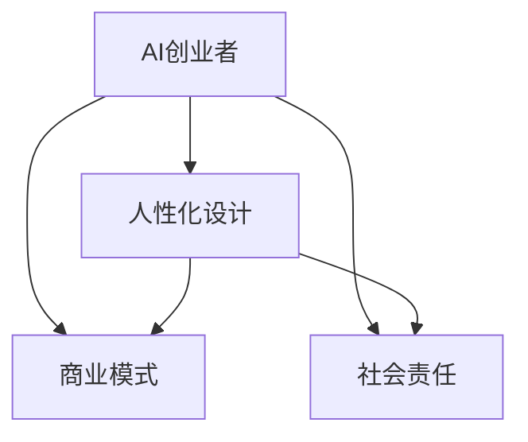

                 

### 文章标题

《AI创业者的码头愿景：让AI服务于人》

AI作为当前科技界的热门话题，已经深刻地改变了各行各业。在这个浪潮中，AI创业者的角色显得尤为重要。他们不仅要掌握前沿技术，还需要具备深刻的商业洞察力和社会责任感，以实现让AI服务于人的宏伟愿景。

### 关键词

- AI创业者
- 愿景
- 人工智能服务
- 人性化设计
- 商业模式
- 社会责任
- 技术伦理

### 摘要

本文将探讨AI创业者在实现让AI服务于人这一愿景过程中的关键要素。文章首先介绍了AI创业者的背景和目标，随后详细分析了实现这一愿景所需的技术、商业和社会层面的考量。文章将通过实际案例和具体操作步骤，展示如何通过人性化设计和技术创新，将AI真正融入人们的生活，推动社会的可持续发展。

## 1. 背景介绍

### 1.1 目的和范围

本文旨在为AI创业者提供一条清晰的发展路径，帮助他们在快速发展的AI领域中，实现让AI服务于人的愿景。文章将涵盖从技术层面到商业模式，再到社会责任的全方位探讨。

### 1.2 预期读者

- 对AI创业有兴趣的创业者
- 想了解AI商业化应用的技术人员
- 对AI伦理和社会影响感兴趣的学者

### 1.3 文档结构概述

本文将按照以下结构展开：

1. 背景介绍：介绍AI创业者的角色和使命
2. 核心概念与联系：阐述AI服务于人的核心概念和联系
3. 核心算法原理 & 具体操作步骤：讲解实现AI服务于人的关键技术
4. 数学模型和公式 & 详细讲解 & 举例说明：介绍支持AI服务于人的数学模型
5. 项目实战：提供实际代码案例和解释
6. 实际应用场景：探讨AI在不同领域的应用
7. 工具和资源推荐：推荐相关学习资源和技术工具
8. 总结：未来发展趋势与挑战
9. 附录：常见问题与解答
10. 扩展阅读 & 参考资料

### 1.4 术语表

#### 1.4.1 核心术语定义

- **AI创业者**：指在人工智能领域创业的个人或团队。
- **人工智能服务**：指通过人工智能技术提供的服务，如智能客服、自动驾驶等。
- **人性化设计**：指在AI产品和服务中，注重用户需求和用户体验的设计。
- **商业模式**：指企业通过提供产品或服务获取利润的方式。
- **社会责任**：指企业在商业活动中承担的社会义务和责任。

#### 1.4.2 相关概念解释

- **技术伦理**：指在AI研发和应用过程中，应遵守的道德规范和伦理准则。
- **数据隐私**：指保护个人数据不被未经授权访问和使用。

#### 1.4.3 缩略词列表

- **AI**：人工智能
- **ML**：机器学习
- **DL**：深度学习
- **NLP**：自然语言处理
- **CV**：计算机视觉

## 2. 核心概念与联系

为了更好地理解AI创业者如何实现让AI服务于人的愿景，我们需要首先明确几个核心概念，并分析它们之间的联系。

### 2.1 核心概念

- **AI创业者**：指那些在人工智能领域创业的个人或团队，他们通常具备技术创新和商业运营的双重能力。
- **人性化设计**：指在AI产品和服务中，注重用户需求和用户体验的设计，确保AI系统能够与人类和谐共处。
- **商业模式**：指企业通过提供产品或服务获取利润的方式，对于AI创业者来说，找到合适的商业模式至关重要。
- **社会责任**：指企业在商业活动中承担的社会义务和责任，包括保护用户隐私、推动可持续发展等。

### 2.2 核心概念之间的联系

- **AI创业者**与**人性化设计**的联系：AI创业者需要通过人性化设计，确保AI产品能够满足用户需求，提升用户体验。
- **商业模式**与**人性化设计**的联系：成功的商业模式需要有针对性的产品设计来支撑，而人性化设计能够提高产品的市场竞争力。
- **社会责任**与**人性化设计**的联系：在人性化设计过程中，AI创业者应考虑社会责任，确保AI产品和服务不会损害社会利益。

### 2.3 Mermaid流程图

以下是一个简化的Mermaid流程图，展示了核心概念之间的联系：



## 3. 核心算法原理 & 具体操作步骤

为了实现AI服务于人的愿景，AI创业者需要掌握一系列核心算法原理，并能够将这些原理应用于实际操作中。以下是一个简要的算法原理讲解，并使用伪代码进行具体操作步骤的描述。

### 3.1 机器学习算法

机器学习算法是AI系统的核心，通过训练数据集来学习规律和模式。以下是一个简单的线性回归算法的伪代码：

```plaintext
// 线性回归算法伪代码

function linear_regression(train_data, train_labels):
    # 初始化权重和偏置
    w = 0
    b = 0

    # 梯度下降法进行优化
    for i in range(epochs):
        for (x, y) in train_data:
            # 前向传播
            z = w * x + b
            predicted = z

            # 计算误差
            error = y - predicted

            # 反向传播
            w_gradient = 2 * error * x
            b_gradient = 2 * error

        # 更新权重和偏置
        w -= learning_rate * w_gradient
        b -= learning_rate * b_gradient

    return w, b
```

### 3.2 自然语言处理算法

自然语言处理（NLP）算法用于理解和生成人类语言。以下是一个简单的文本分类算法的伪代码：

```plaintext
// 文本分类算法伪代码

function text_classification(document, model):
    # 加载预训练的NLP模型
    model.load()

    # 对文本进行预处理（例如分词、标记化等）
    processed_text = preprocess(document)

    # 使用模型进行预测
    prediction = model.predict(processed_text)

    # 返回预测结果
    return prediction
```

### 3.3 深度学习算法

深度学习算法是AI领域的核心技术之一，通过多层神经网络进行复杂的特征提取和模式识别。以下是一个简单的卷积神经网络（CNN）算法的伪代码：

```plaintext
// 卷积神经网络算法伪代码

class ConvolutionalNeuralNetwork:
    def __init__(self):
        # 初始化网络结构
        self.layers = []

    def add_layer(self, layer):
        self.layers.append(layer)

    def forward_pass(self, x):
        # 前向传播
        for layer in self.layers:
            x = layer.forward(x)
        return x

    def backward_pass(self, x, y):
        # 反向传播
        for layer in reversed(self.layers):
            x = layer.backward(x, y)
        return x
```

### 3.4 具体操作步骤

1. **数据收集与预处理**：收集相关的数据集，并对数据进行清洗、归一化等预处理操作。
2. **模型选择与训练**：选择合适的机器学习或深度学习算法，对数据进行训练。
3. **模型评估与优化**：使用验证集对模型进行评估，并调整模型参数以优化性能。
4. **部署与应用**：将训练好的模型部署到实际应用中，例如智能客服系统、自动驾驶车辆等。

## 4. 数学模型和公式 & 详细讲解 & 举例说明

在AI领域中，数学模型和公式是理解和应用各种算法的核心。以下我们将介绍几个关键的数学模型，并使用LaTeX格式进行详细讲解和举例说明。

### 4.1 线性回归模型

线性回归模型是最基础的机器学习模型之一，用于预测连续值。其数学模型可以表示为：

\[ y = \beta_0 + \beta_1 x + \epsilon \]

其中，\( y \) 是预测值，\( x \) 是输入特征，\( \beta_0 \) 和 \( \beta_1 \) 是模型的参数，\( \epsilon \) 是误差项。

#### 4.1.1 详细讲解

- **参数估计**：通过最小二乘法（Least Squares Method）来估计参数 \( \beta_0 \) 和 \( \beta_1 \)。
- **回归方程**：使用最小化误差平方和的方法来找到最佳拟合直线。

#### 4.1.2 举例说明

假设我们有一个简单的数据集，包含两个人的年龄和他们的收入。我们希望使用线性回归模型来预测一个人的收入，给定他们的年龄。

数据集如下：

| 年龄 (x) | 收入 (y) |
|---------|---------|
| 25      | 50000   |
| 30      | 60000   |
| 35      | 70000   |
| 40      | 80000   |

使用最小二乘法计算参数 \( \beta_0 \) 和 \( \beta_1 \)：

\[ \beta_1 = \frac{\sum(x_i - \bar{x})(y_i - \bar{y})}{\sum(x_i - \bar{x})^2} \]
\[ \beta_0 = \bar{y} - \beta_1 \bar{x} \]

其中，\( \bar{x} \) 和 \( \bar{y} \) 分别是年龄和收入的均值。

计算结果为：

\[ \beta_1 = \frac{(25-30)(50000-60000) + (30-30)(60000-60000) + (35-30)(70000-60000) + (40-30)(80000-70000)}{(25-30)^2 + (30-30)^2 + (35-30)^2 + (40-30)^2} \]
\[ \beta_1 = \frac{-25000 + 0 + 10000 + 10000}{25 + 0 + 25 + 100} \]
\[ \beta_1 = \frac{0}{150} \]
\[ \beta_1 = 0 \]

\[ \beta_0 = \bar{y} - \beta_1 \bar{x} \]
\[ \beta_0 = \frac{50000 + 60000 + 70000 + 80000}{4} - 0 \]
\[ \beta_0 = 65000 \]

因此，线性回归模型可以表示为：

\[ y = 65000 \]

### 4.2 卷积神经网络（CNN）模型

卷积神经网络是一种在图像识别和计算机视觉中广泛应用的深度学习模型。其基本结构包括卷积层、池化层和全连接层。以下是一个简化的CNN模型公式：

\[ f(x) = \sigma(\mathbf{W} \cdot \mathbf{A} + b) \]

其中，\( f(x) \) 是激活函数，\( \mathbf{W} \) 是权重矩阵，\( \mathbf{A} \) 是输入特征，\( b \) 是偏置项，\( \sigma \) 是激活函数。

#### 4.2.1 详细讲解

- **卷积层**：通过卷积操作提取图像特征。
- **池化层**：减少数据维度，提高模型泛化能力。
- **全连接层**：将卷积层和池化层提取的特征进行分类。

#### 4.2.2 举例说明

假设我们有一个简单的2D图像，维度为 \( 3 \times 3 \)。我们使用一个 \( 3 \times 3 \) 的卷积核进行卷积操作，权重矩阵 \( \mathbf{W} \) 如下：

\[ \mathbf{W} = \begin{bmatrix} 1 & 0 & 1 \\ 0 & 1 & 0 \\ 1 & 0 & 1 \end{bmatrix} \]

输入特征 \( \mathbf{A} \) 如下：

\[ \mathbf{A} = \begin{bmatrix} 1 & 0 & 1 \\ 0 & 1 & 0 \\ 1 & 0 & 1 \end{bmatrix} \]

偏置项 \( b \) 为 \( 0 \)。

卷积操作的计算公式为：

\[ \mathbf{Z} = \mathbf{W} \cdot \mathbf{A} + b \]

\[ \mathbf{Z} = \begin{bmatrix} 1 & 0 & 1 \\ 0 & 1 & 0 \\ 1 & 0 & 1 \end{bmatrix} \cdot \begin{bmatrix} 1 & 0 & 1 \\ 0 & 1 & 0 \\ 1 & 0 & 1 \end{bmatrix} + 0 \]

\[ \mathbf{Z} = \begin{bmatrix} 2 & 1 & 2 \\ 1 & 1 & 1 \\ 2 & 1 & 2 \end{bmatrix} \]

然后，我们可以使用ReLU激活函数进行非线性变换：

\[ \mathbf{A'} = \text{ReLU}(\mathbf{Z}) \]

\[ \mathbf{A'} = \begin{bmatrix} 2 & 1 & 2 \\ 1 & 1 & 1 \\ 2 & 1 & 2 \end{bmatrix} \]

这样，我们通过一个简单的卷积操作，提取出了输入图像的特征。

## 5. 项目实战：代码实际案例和详细解释说明

为了更好地理解如何将AI应用于实际场景，我们选择一个简单的项目进行实战。我们将构建一个简单的智能客服系统，使用自然语言处理（NLP）技术来回答用户的问题。

### 5.1 开发环境搭建

首先，我们需要搭建开发环境。以下是一个基本的Python开发环境配置：

- Python 3.8 或更高版本
- Python包管理器 pip
- NLP库，例如 NLTK 或 spaCy
- Web框架，例如 Flask 或 Django

安装必要的库：

```bash
pip install flask
pip install spacy
python -m spacy download en_core_web_sm
```

### 5.2 源代码详细实现和代码解读

#### 5.2.1 代码实现

以下是一个简单的智能客服系统的代码实现：

```python
from flask import Flask, request, jsonify
import spacy

app = Flask(__name__)
nlp = spacy.load("en_core_web_sm")

# 智能客服接口
@app.route("/chat", methods=["POST"])
def chat():
    data = request.json
    user_message = data["message"]

    # 使用NLP技术处理用户输入
    doc = nlp(user_message)

    # 简单的回复逻辑
    if "hello" in user_message:
        reply = "Hello! How can I help you?"
    else:
        reply = "I'm not sure how to respond to that."

    return jsonify({"response": reply})

if __name__ == "__main__":
    app.run(debug=True)
```

#### 5.2.2 代码解读

- **导入库和模块**：首先，我们导入 Flask 框架和 spacy NLP 库，并加载英语语言模型。
- **创建 Flask 应用**：使用 Flask 创建一个 Web 应用。
- **定义路由**：定义一个 `/chat` 路由，用于处理 POST 请求。
- **处理用户输入**：从请求中获取用户输入的消息，并使用 spacy 进行处理。
- **回复逻辑**：根据用户输入的内容，返回一个简单的回复。

### 5.3 代码解读与分析

1. **Flask 应用搭建**：使用 Flask 框架，我们可以快速搭建一个 Web 应用。Flask 的路由机制使得我们能够轻松地处理 HTTP 请求。
2. **NLP 技术应用**：通过 spacy，我们可以对用户输入的消息进行分词、词性标注等操作，从而更好地理解用户的需求。
3. **简单的回复逻辑**：在这个简单的例子中，我们只实现了简单的回复逻辑。在实际应用中，我们可以使用更复杂的算法和模型来提供更智能的回复。

### 5.4 运行测试

在终端运行以下命令启动应用：

```bash
python chatbot.py
```

然后，我们可以使用 curl 或 Postman 等工具发送 POST 请求来测试我们的智能客服系统。

```bash
curl -X POST -H "Content-Type: application/json" -d '{"message": "Hello!"}' http://localhost:5000/chat
```

预期输出：

```json
{"response": "Hello! How can I help you?"}
```

通过这个简单的实战案例，我们展示了如何使用 Flask 和 spacy 搭建一个基本的智能客服系统。这只是一个起点，实际应用中我们可以进一步优化算法和模型，提高系统的智能程度。

## 6. 实际应用场景

AI技术在各个领域的实际应用已经取得了显著的成果。以下我们探讨几个具有代表性的应用场景，展示AI如何服务于人。

### 6.1 医疗保健

在医疗保健领域，AI技术被广泛应用于疾病预测、诊断和治疗中。例如，通过深度学习算法，AI系统可以分析大量的医疗数据，识别早期癌症患者，提高诊断的准确性。此外，智能药物发现平台利用AI技术加速新药的研发过程，为患者提供更有效的治疗方案。

### 6.2 教育与培训

在教育领域，AI技术助力个性化学习，通过分析学生的表现数据，为每个学生制定个性化的学习计划。智能辅导系统可以在学生遇到难题时提供实时帮助，提高学习效果。同时，AI还支持远程教学，为偏远地区的孩子提供高质量的教育资源。

### 6.3 金融服务

在金融服务领域，AI技术被用于风险管理、欺诈检测和智能投资建议等。通过机器学习算法，AI可以实时监控交易行为，识别潜在的欺诈活动，保护客户的资金安全。智能投资顾问系统根据用户的风险偏好和投资目标，提供个性化的投资策略，帮助用户实现财富增值。

### 6.4 城市管理

在城市建设和管理中，AI技术发挥着重要作用。智能交通系统利用AI算法优化交通流量，减少拥堵，提高交通效率。智慧城市建设通过物联网和AI技术，实时监控城市运行状态，提供智慧能源管理、环境监测和应急响应等服务，提升城市居民的生活质量。

### 6.5 消费者服务

在消费者服务领域，AI技术为消费者提供了便捷的购物体验。智能推荐系统通过分析用户的购买历史和行为偏好，为消费者推荐个性化的产品和服务。智能客服机器人可以全天候为用户提供咨询和帮助，提高客户满意度。

### 6.6 自动驾驶

自动驾驶技术是AI在交通运输领域的核心应用。通过深度学习和计算机视觉技术，自动驾驶车辆可以实时感知周围环境，做出安全的驾驶决策。自动驾驶技术的推广有望大幅减少交通事故，提高交通效率，为人们提供更加安全和舒适的出行方式。

通过上述实际应用场景，我们可以看到AI技术已经在各个领域深入应用，并极大地改变了人们的生活和工作方式。未来，随着技术的不断进步，AI将在更多领域发挥更大的作用，为人类创造更加美好的生活。

## 7. 工具和资源推荐

为了更好地学习和发展AI技术，以下是一些建议的学习资源和开发工具，涵盖书籍、在线课程、技术博客以及开发框架。

### 7.1 学习资源推荐

#### 7.1.1 书籍推荐

- **《Python机器学习》**（作者：塞巴斯蒂安·拉森）：这是一本非常适合初学者的机器学习入门书籍，通过Python实例讲解了基础机器学习算法。
- **《深度学习》**（作者：伊恩·古德费洛、约书亚·本吉奥、亚伦·库维尔）：详细介绍了深度学习的基本原理和常见算法，是深度学习领域的经典教材。
- **《AI：一种现代方法》**（作者：斯图尔特·罗素、彼得·诺维格）：全面讲解了人工智能的基础知识和方法，适合对AI有深入了解的读者。

#### 7.1.2 在线课程

- **Coursera的《机器学习》**（由斯坦福大学提供）：这是一门非常受欢迎的机器学习入门课程，由Andrew Ng教授主讲。
- **Udacity的《深度学习纳米学位》**：通过项目驱动的方式，学习深度学习的基础知识和技术。
- **edX的《人工智能导论》**（由麻省理工学院提供）：涵盖了人工智能的多个方面，包括机器学习、自然语言处理等。

#### 7.1.3 技术博客和网站

- **Medium的AI博客**：提供了大量关于AI的最新研究和技术应用的文章。
- ** Towards Data Science**：这是一个内容丰富的技术博客，涵盖了数据科学和机器学习的多个方面。
- **AI博客**（作者：吴恩达）：吴恩达博士的个人博客，分享了关于AI的深入见解和研究进展。

### 7.2 开发工具框架推荐

#### 7.2.1 IDE和编辑器

- **Jupyter Notebook**：适用于数据科学和机器学习的交互式开发环境，支持多种编程语言。
- **Visual Studio Code**：一个强大的代码编辑器，支持Python、R等多种编程语言，适用于AI开发。
- **PyCharm**：专为Python开发设计的IDE，提供了丰富的工具和插件，适合AI和机器学习项目。

#### 7.2.2 调试和性能分析工具

- **TensorBoard**：用于可视化深度学习模型的训练过程和性能指标，由TensorFlow提供。
- **PyTorch Profiler**：用于分析和优化PyTorch模型的性能。
- **Valgrind**：一个通用的程序分析工具，可以检测内存泄漏、性能瓶颈等问题。

#### 7.2.3 相关框架和库

- **TensorFlow**：由Google开发的深度学习框架，适用于各种规模的机器学习和深度学习项目。
- **PyTorch**：由Facebook开发的深度学习框架，具有高度灵活性和简洁性。
- **scikit-learn**：一个用于经典机器学习算法的库，适用于数据分析和建模。

#### 7.2.4 数据库和存储

- **MongoDB**：适用于大规模数据存储的NoSQL数据库，提供了灵活的数据模型和高效的数据查询能力。
- **HDFS**：Hadoop分布式文件系统，适用于大规模数据存储和处理。
- **AWS S3**：Amazon Web Services提供的对象存储服务，适合存储和访问大量数据。

通过上述工具和资源，AI创业者可以更好地掌握技术，提升开发效率，实现让AI服务于人的愿景。

## 8. 总结：未来发展趋势与挑战

在AI创业的浪潮中，实现让AI服务于人的愿景不仅需要技术创新，还需要深刻的商业洞察和社会责任感。未来，随着技术的不断进步，AI将在更多领域深入应用，推动社会的变革。以下是未来发展趋势和面临的挑战：

### 8.1 发展趋势

1. **智能化程度的提升**：随着深度学习和强化学习算法的发展，AI的智能化程度将不断提高，能够更好地理解和满足人类需求。
2. **跨领域融合**：AI与其他领域的融合将加速，例如医疗、教育、金融等领域的智能化应用将更加普及。
3. **自主决策能力的增强**：通过深度学习和强化学习，AI将具备更强的自主决策能力，能够在复杂环境中做出更明智的决策。
4. **数据隐私和安全**：随着AI技术的发展，数据隐私和安全问题将变得更加突出，如何保障用户数据的安全将成为重要挑战。

### 8.2 面临的挑战

1. **技术瓶颈**：尽管AI技术取得了显著进展，但在某些领域，如自然语言理解和复杂决策，仍存在技术瓶颈。
2. **数据质量和多样性**：高质量的数据是AI系统的基础，如何获取、处理和利用多样性的数据仍是一个挑战。
3. **算法透明性和解释性**：随着AI系统的复杂度增加，如何确保算法的透明性和解释性，使其易于被用户理解和接受，是一个重要挑战。
4. **伦理和社会责任**：AI技术在应用过程中，如何处理伦理和社会责任问题，确保其不会损害社会利益，是AI创业者需要认真面对的挑战。

### 8.3 应对策略

1. **持续技术创新**：通过持续的研究和开发，突破技术瓶颈，推动AI技术的不断进步。
2. **数据治理**：建立完善的数据治理体系，保障数据的质量和多样性，提高数据利用率。
3. **算法透明性和解释性**：通过改进算法设计，提高算法的透明性和解释性，增强用户对AI系统的信任。
4. **社会责任担当**：在商业运营过程中，积极承担社会责任，确保AI技术的发展和应用不会损害社会利益。

总之，未来AI创业者在实现让AI服务于人的愿景过程中，需要不断学习和探索，积极应对各种挑战，以推动AI技术的健康发展和广泛应用。

## 9. 附录：常见问题与解答

### 9.1 什么是AI创业者？

AI创业者是在人工智能领域创业的个人或团队，他们具备技术创新和商业运营的能力，致力于通过人工智能技术解决现实问题，创造社会价值。

### 9.2 如何选择合适的AI技术？

选择合适的AI技术需要考虑多个因素，包括应用场景、数据质量、计算资源和预算。例如，在需要实时决策的场景中，可以选择深度学习算法；在数据量较小且需要快速分析的场合，可以选择传统的机器学习算法。

### 9.3 如何确保AI系统的透明性和解释性？

确保AI系统的透明性和解释性可以通过以下方法实现：

1. **改进算法设计**：选择易于解释的算法，如线性回归、决策树等。
2. **模型可解释性工具**：使用模型可解释性工具，如SHAP、LIME等，对模型进行解释。
3. **文档和注释**：详细记录算法的设计和实现过程，确保代码的可读性和可维护性。

### 9.4 AI创业者如何处理数据隐私和安全问题？

AI创业者可以通过以下方法处理数据隐私和安全问题：

1. **数据加密**：对敏感数据进行加密存储和传输。
2. **访问控制**：实现严格的访问控制机制，确保只有授权人员可以访问敏感数据。
3. **合规性审查**：确保AI系统的设计和实现符合相关的数据保护法规和标准。

## 10. 扩展阅读 & 参考资料

### 10.1 书籍

- 李航，《统计学习方法》：系统介绍了机器学习的基本理论和算法。
- 吴恩达，《深度学习》：详细讲解了深度学习的基础知识和技术。
- 周志华，《机器学习》：全面介绍了机器学习的原理和应用。

### 10.2 论文

- Goodfellow, I., Bengio, Y., & Courville, A. (2016). *Deep Learning*.
- LeCun, Y., Bengio, Y., & Hinton, G. (2015). *Deep Learning*.
- Russell, S., & Norvig, P. (2020). *Artificial Intelligence: A Modern Approach*.

### 10.3 在线课程

- Coursera的《机器学习》课程，由斯坦福大学提供。
- Udacity的《深度学习纳米学位》。
- edX的《人工智能导论》，由麻省理工学院提供。

### 10.4 技术博客

- Medium上的AI博客。
- Towards Data Science。
- AI博客，作者：吴恩达。

### 10.5 开发工具

- TensorFlow，Google提供的开源深度学习框架。
- PyTorch，Facebook提供的开源深度学习框架。
- scikit-learn，Python中的机器学习库。

