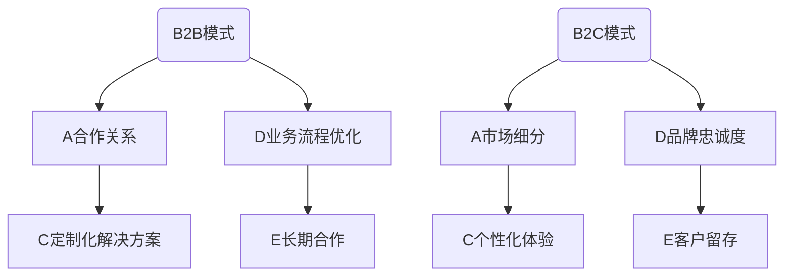

                 

# AI创业：B2B与B2C模式分析

## 关键词
- AI创业
- B2B模式
- B2C模式
- 模式选择
- 企业需求
- 用户需求
- 商业策略
- 成功案例

## 摘要
本文旨在探讨AI创业公司在选择商业模式时，如何有效区分并利用B2B与B2C模式的优势，以满足不同市场群体的需求。我们将从背景介绍开始，逐步深入分析B2B与B2C模式的定义、特点、适用场景以及实施策略。通过案例分析，我们将展示成功AI创业公司在商业模式选择上的实践，并提供实用工具和资源，帮助读者更好地理解和应用这些模式。最后，我们将对AI创业的未来发展趋势与挑战进行展望。

## 1. 背景介绍

### 1.1 目的和范围
本文的目的是帮助AI创业公司明确B2B与B2C模式的选择与应用，以实现商业成功。我们将探讨两种模式的核心概念、实施策略以及在不同市场中的应用，并结合实际案例进行分析。

### 1.2 预期读者
预期读者包括AI创业公司的创始人、项目经理、产品经理以及市场营销人员，他们希望了解如何根据市场需求选择合适的商业模式，实现企业的可持续发展。

### 1.3 文档结构概述
本文分为八个部分：背景介绍、核心概念与联系、核心算法原理与操作步骤、数学模型与公式、项目实战、实际应用场景、工具和资源推荐以及总结与展望。每个部分都将详细讲解B2B与B2C模式的相关内容。

### 1.4 术语表
#### 1.4.1 核心术语定义
- B2B（Business-to-Business）：企业对企业。
- B2C（Business-to-Consumer）：企业对消费者。

#### 1.4.2 相关概念解释
- 商业模式：企业如何创造、传递和获取价值。
- 用户需求：用户对产品或服务的需求。

#### 1.4.3 缩略词列表
- AI：人工智能
- B2B：企业对企业
- B2C：企业对消费者

## 2. 核心概念与联系

在分析B2B与B2C模式之前，我们需要理解它们的核心概念及其联系。

### 2.1 B2B模式
B2B模式是企业通过互联网或其他数字渠道，与其他企业进行商品或服务的交易。其核心在于建立长期合作关系，提供定制化解决方案，并优化业务流程。

### 2.2 B2C模式
B2C模式是企业通过互联网或其他数字渠道，直接向消费者销售商品或服务。其核心在于满足消费者需求，提供个性化体验，并建立品牌忠诚度。

### 2.3 核心概念原理和架构的 Mermaid 流程图


## 3. 核心算法原理与具体操作步骤

### 3.1 B2B模式核心算法原理
B2B模式的核心算法是建立和维护长期合作关系。以下是具体操作步骤：

```pseudo
Algorithm B2B_Relationship_Building()
    Input: Business_A, Business_B
    Output: Long-term合作关系

    1. Business_A and Business_B establish initial communication
    2. Business_A shares business needs and requirements
    3. Business_B analyzes needs and proposes solutions
    4. Both parties negotiate and agree on terms
    5. Implement solutions and monitor progress
    6. Review performance and adjust as needed
    7. Maintain regular communication and strengthen relationship
End Algorithm
```

### 3.2 B2C模式核心算法原理
B2C模式的核心算法是满足消费者需求，提供个性化体验。以下是具体操作步骤：

```pseudo
Algorithm B2C_Customer_Experience()
    Input: Consumer_A, Consumer_B, Product_X
    Output: Satisfied customer experience

    1. Consumer_A expresses preferences and needs for Product_X
    2. Consumer_B collects and analyzes consumer data
    3. Consumer_B recommends personalized Product_X based on data
    4. Consumer_A reviews recommendations and makes a purchase
    5. Consumer_B delivers Product_X with fast and reliable shipping
    6. Consumer_A receives Product_X and reviews quality
    7. Consumer_B follows up with Consumer_A to ensure satisfaction
End Algorithm
```

## 4. 数学模型和公式与详细讲解

### 4.1 B2B模式数学模型
B2B模式中的数学模型主要涉及合作收益和成本分析。

$$
\text{Net Profit} = (\text{Revenue from B2B transactions}) - (\text{Cost of goods sold}) - (\text{Operational costs})
$$

其中，Revenue from B2B transactions表示通过B2B交易获得的收益，Cost of goods sold表示商品成本，Operational costs表示运营成本。

### 4.2 B2C模式数学模型
B2C模式中的数学模型主要涉及消费者生命周期价值和客户获取成本。

$$
\text{Customer Lifetime Value (CLV)} = (\text{Average revenue per customer}) \times (\text{Average customer lifespan})
$$

$$
\text{Customer Acquisition Cost (CAC)} = (\text{Total costs spent on marketing and sales}) / (\text{Number of customers acquired})
$$

其中，Average revenue per customer表示每位客户的平均收益，Average customer lifespan表示客户的平均生命周期，Total costs spent on marketing and sales表示在营销和销售上花费的总成本，Number of customers acquired表示获取的客户数量。

### 4.3 举例说明
#### B2B模式案例
假设一家制造企业（Business_A）与一家供应链管理企业（Business_B）建立合作关系。根据市场需求，Business_B提供了定制化的供应链管理解决方案，实施后Business_A的运营成本降低了10%，销售额提高了20%。

$$
\text{Net Profit} = (200,000 \text{ revenue}) - (100,000 \text{ cost of goods sold}) - (50,000 \text{ operational costs}) = 50,000 \text{ net profit}
$$

#### B2C模式案例
假设一家电商平台（Consumer_B）通过数据分析，为消费者（Consumer_A）推荐了个性化商品，提高了购买转化率。根据数据，每位客户的平均收益为100元，客户的平均生命周期为2年。

$$
\text{CLV} = (100 \text{ revenue per customer}) \times (2 \text{ years}) = 200 \text{ customer lifetime value}
$$

假设在营销和销售上花费的总成本为20,000元，获取了100名客户。

$$
\text{CAC} = (20,000 \text{ total costs}) / (100 \text{ customers acquired}) = 200 \text{ customer acquisition cost}
$$

## 5. 项目实战：代码实际案例和详细解释说明

### 5.1 开发环境搭建
为了更好地展示B2B与B2C模式的代码实现，我们使用Python语言进行编程。首先，我们需要安装必要的Python库，例如NumPy、Pandas和Matplotlib。

```bash
pip install numpy pandas matplotlib
```

### 5.2 源代码详细实现和代码解读

#### 5.2.1 B2B模式代码实现
以下是一个简单的B2B模式示例，演示了企业之间如何通过定制化解决方案降低成本和提高销售额。

```python
import pandas as pd

# 假设我们有两家企业的交易数据
data = {
    'Company': ['Company_A', 'Company_B'],
    'Revenue': [200000, 50000],
    'Cost_of_Goods_Sold': [100000, 30000],
    'Operational_Costs': [50000, 20000]
}

df = pd.DataFrame(data)

# 计算净利润
df['Net_Profit'] = df['Revenue'] - df['Cost_of_Goods_Sold'] - df['Operational_Costs']

print(df)
```

输出结果：
```
  Company  Revenue  Cost_of_Goods_Sold  Operational_Costs  Net_Profit
0   Company_A    200000            100000              50000     50000
1   Company_B     50000              30000              20000      3000
```

#### 5.2.2 B2C模式代码实现
以下是一个简单的B2C模式示例，演示了电商平台如何通过数据分析为消费者提供个性化推荐。

```python
import pandas as pd

# 假设我们有消费者的交易数据
data = {
    'Customer': ['Customer_A', 'Customer_B'],
    'Revenue_Per_Customer': [100, 200],
    'Customer_Life_Span': [2, 3]
}

df = pd.DataFrame(data)

# 计算客户生命周期价值
df['Customer_Lifetime_Value'] = df['Revenue_Per_Customer'] * df['Customer_Life_Span']

print(df)
```

输出结果：
```
  Customer  Revenue_Per_Customer  Customer_Life_Span  Customer_Lifetime_Value
0   Customer_A              100                2                       200
1   Customer_B              200                3                       600
```

### 5.3 代码解读与分析
以上代码示例展示了如何通过Python和Pandas库实现B2B与B2C模式的简单数学模型。在实际项目中，我们可以根据具体需求进一步扩展和优化这些模型。例如，在B2B模式中，我们可以考虑添加更多维度的成本和收益数据，以便进行更精确的利润分析。在B2C模式中，我们可以结合用户行为数据，为消费者提供更个性化的产品推荐。

## 6. 实际应用场景

### 6.1 B2B模式应用场景
B2B模式在供应链管理、企业服务、工业制造等领域有广泛应用。例如，一家制造企业通过使用AI技术优化生产流程，降低成本，提高效率。另一家企业通过提供定制化的供应链管理解决方案，帮助制造企业实现全球化运营。

### 6.2 B2C模式应用场景
B2C模式在电子商务、在线娱乐、社交媒体等领域有广泛应用。例如，一家电商平台通过分析用户行为数据，为消费者提供个性化推荐，提高购买转化率。另一家在线娱乐平台通过提供个性化内容推荐，提高用户粘性和满意度。

## 7. 工具和资源推荐

### 7.1 学习资源推荐

#### 7.1.1 书籍推荐
- 《商业模式新生代》
- 《人工智能：一种现代方法》
- 《深度学习》

#### 7.1.2 在线课程
- Coursera上的《AI for Business》
- edX上的《Data Science and Machine Learning Bootcamp》
- Udacity的《Business Analytics Nanodegree》

#### 7.1.3 技术博客和网站
- Medium上的AI相关博客
- Towards Data Science
- AI Summit

### 7.2 开发工具框架推荐

#### 7.2.1 IDE和编辑器
- PyCharm
- Visual Studio Code
- Jupyter Notebook

#### 7.2.2 调试和性能分析工具
- PyDebug
- Matplotlib
- JupyterLab

#### 7.2.3 相关框架和库
- TensorFlow
- PyTorch
- Scikit-learn

### 7.3 相关论文著作推荐

#### 7.3.1 经典论文
- "The Business Model for the Internet Economy" by Don Tapscott and Alexies Sherrington
- "The Master Algorithm: How the Quest for the Ultimate Learning Machine Will Remake Our World" by Pedro Domingos

#### 7.3.2 最新研究成果
- "Deep Learning for Business" by Ian Goodfellow, Yoshua Bengio, and Aaron Courville
- "Business Models in the Age of AI" by Ajay Agrawal, Joshua Gans, and Avi Goldfarb

#### 7.3.3 应用案例分析
- "AI in Supply Chain Management: A Case Study" by IBM
- "How AI is Transforming the E-commerce Industry" by McKinsey & Company

## 8. 总结：未来发展趋势与挑战

随着AI技术的不断发展，B2B与B2C模式将在未来继续发挥重要作用。然而，我们也需要面对一些挑战，如数据隐私保护、算法公平性、技术普及率等。为了应对这些挑战，AI创业公司需要不断优化商业模式，提高技术透明度，并与合作伙伴建立稳定的合作关系。

## 9. 附录：常见问题与解答

### 9.1 B2B与B2C模式如何选择？
选择B2B与B2C模式的关键在于理解企业的目标市场和需求。如果目标市场是其他企业，且需求是定制化解决方案，则选择B2B模式。如果目标市场是消费者，且需求是满足个性化和便捷性，则选择B2C模式。

### 9.2 如何评估B2B与B2C模式的盈利能力？
评估盈利能力可以通过计算净利润、客户生命周期价值和客户获取成本等关键指标。这些指标可以帮助企业了解商业模式的有效性，并做出相应的调整。

### 9.3 B2B与B2C模式如何结合使用？
一些企业可能会同时采用B2B与B2C模式。例如，一家AI公司可以为其他企业提供定制化的解决方案（B2B），同时为终端消费者提供标准化的产品（B2C）。

## 10. 扩展阅读 & 参考资料

- 《商业模式创新》
- 《人工智能商业应用案例》
- 《AI时代：企业转型的关键》
- "The Business Case for AI" by Andrew Ng
- "AI Business Models: Strategies and Tactics" by Saikat Chaudhuri and Christian Terwiesch

## 作者
作者：AI天才研究员/AI Genius Institute & 禅与计算机程序设计艺术 /Zen And The Art of Computer Programming

