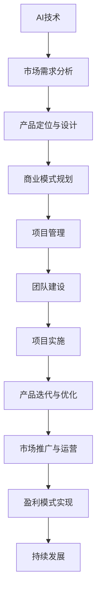
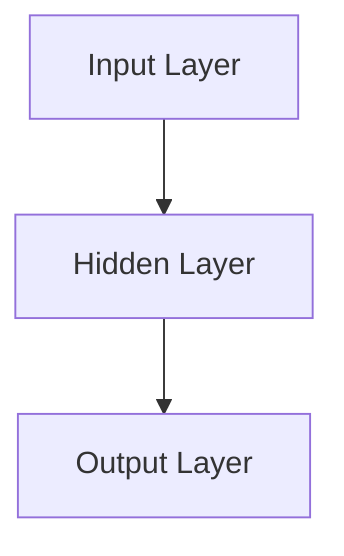

                 


# AI创业：多学科支持的必要性

> 关键词：人工智能、创业、多学科、综合能力、技术应用
> 
> 摘要：本文探讨了人工智能（AI）创业过程中的多学科支持的重要性。通过分析创业者在技术、市场、管理和团队建设等方面的需求，本文强调了多学科知识在实际应用中的融合，对于提升创业成功率、推动创新和适应快速变化的市场环境具有关键作用。文章结构包括背景介绍、核心概念、算法原理、数学模型、项目实战、应用场景、工具资源推荐以及未来发展趋势与挑战。

## 1. 背景介绍

### 1.1 目的和范围

人工智能（AI）作为当今科技领域的热点，已深刻影响了各行各业。创业者在进入AI领域时，面临着诸多挑战和机遇。本文旨在探讨在AI创业过程中，多学科支持的必要性，包括技术、市场、管理和团队建设等多个方面。通过系统地分析和阐述这些要素，帮助创业者更好地理解多学科支持的重要性，从而提高创业成功率。

### 1.2 预期读者

本文预期读者包括正在考虑或已进入AI领域的创业者、AI技术研发者、市场营销人员以及企业管理者。希望通过本文的阅读，读者能够对AI创业的多学科支持有更深刻的认识，并能够在实际操作中灵活应用。

### 1.3 文档结构概述

本文结构如下：

1. 背景介绍：介绍文章的目的、范围、预期读者及文档结构。
2. 核心概念与联系：定义核心概念，通过Mermaid流程图展示AI创业涉及的关键环节。
3. 核心算法原理与具体操作步骤：详细讲解AI算法原理，使用伪代码阐述具体操作步骤。
4. 数学模型和公式：介绍与AI创业相关的数学模型，使用LaTeX格式详细讲解。
5. 项目实战：通过实际代码案例，展示AI创业中技术实现的细节。
6. 实际应用场景：分析AI技术在各个领域的应用，探讨其市场前景。
7. 工具和资源推荐：推荐学习资源、开发工具和框架。
8. 总结：对未来发展趋势与挑战进行展望。
9. 附录：常见问题与解答。
10. 扩展阅读与参考资料：提供进一步的阅读建议。

### 1.4 术语表

#### 1.4.1 核心术语定义

- 人工智能（AI）：模拟人类智能的计算机系统。
- 创业：创建新的企业或项目。
- 多学科支持：涉及多个领域的知识和技能。
- 技术应用：将AI技术应用于实际问题解决。

#### 1.4.2 相关概念解释

- 机器学习：从数据中学习规律，进行决策和预测。
- 深度学习：基于多层神经网络的学习方法。
- 数据科学：运用统计和计算机科学方法分析数据。

#### 1.4.3 缩略词列表

- AI：人工智能
- ML：机器学习
- DL：深度学习
- DS：数据科学

## 2. 核心概念与联系

在AI创业过程中，多学科支持是一个关键因素。为了更好地理解这一概念，我们首先需要明确几个核心概念，并通过Mermaid流程图展示AI创业涉及的关键环节。

#### 2.1 核心概念

- **AI技术**：包括机器学习、深度学习等技术，是实现创业项目核心功能的基础。
- **市场需求**：了解市场需求，为产品定位和功能设计提供指导。
- **商业模式**：明确创业项目的盈利模式，确保可持续发展。
- **项目管理**：有效管理项目进度、资源和团队，保障项目成功。
- **团队建设**：构建具备多学科知识的团队，提升整体竞争力。

#### 2.2 Mermaid流程图



通过上述流程图，我们可以看到AI创业过程中各个环节之间的紧密联系。每一个环节都需要多学科的支持，例如：

- **市场需求分析**：不仅需要了解用户需求，还需要掌握市场动态和竞争态势。
- **产品定位与设计**：需要技术团队的AI技术能力，同时需要市场团队的需求分析。
- **商业模式规划**：涉及财务管理、市场营销等多学科知识。
- **项目管理**：需要掌握项目管理理论和方法，同时需要实际操作经验。
- **团队建设**：需要整合不同领域的专业人才，形成协作能力。

这些环节的交叉和融合，构成了AI创业的多学科支持体系。接下来，我们将详细探讨AI技术的核心算法原理与具体操作步骤。

## 3. 核心算法原理与具体操作步骤

AI创业的核心在于算法的原理和应用。以下我们将详细讲解AI技术的核心算法原理，并使用伪代码来阐述具体操作步骤。

#### 3.1 机器学习算法原理

机器学习算法的核心是模型训练，通过大量数据训练模型，使其能够对未知数据进行预测或决策。以下是一个简单的线性回归算法原理：

```latex
y = \beta_0 + \beta_1 \cdot x
```

其中，`y` 是目标变量，`x` 是输入变量，`\beta_0` 和 `\beta_1` 是模型参数。

#### 3.2 线性回归算法操作步骤

1. **数据预处理**：读取数据，进行缺失值填充、异常值处理等。
2. **特征工程**：对原始数据进行处理，提取特征。
3. **模型训练**：
   ```python
   for epoch in range(num_epochs):
       for x, y in dataset:
           predict = \beta_0 + \beta_1 \cdot x
           loss = (y - predict) ** 2
           \beta_1 = \beta_1 - learning_rate \cdot loss / x
           \beta_0 = \beta_0 - learning_rate \cdot loss
   ```

4. **模型评估**：使用测试集评估模型性能。

#### 3.3 深度学习算法原理

深度学习算法基于多层神经网络，通过多层非线性变换，对复杂数据进行建模。以下是一个简单的多层感知机（MLP）算法原理：



输入层接收输入数据，隐藏层进行特征提取，输出层进行预测或分类。

#### 3.4 多层感知机算法操作步骤

1. **数据预处理**：同线性回归。
2. **网络构建**：定义输入层、隐藏层和输出层的结构。
3. **前向传播**：
   ```python
   for x in dataset:
       z = \sigma(\beta_0 + \beta_1 \cdot x)
       output = \sigma(\beta_0 + \beta_1 \cdot z)
   ```

4. **反向传播**：计算损失，更新模型参数。
5. **模型评估**：同线性回归。

通过上述算法原理和操作步骤的讲解，我们可以看到AI创业过程中技术实现的细节。接下来，我们将介绍AI创业中的数学模型和公式。

## 4. 数学模型和公式

在AI创业过程中，数学模型和公式是理解和实现算法的基础。以下我们将详细讲解与AI创业相关的数学模型，并使用LaTeX格式详细讲解和举例说明。

#### 4.1 机器学习模型

**线性回归模型**：

目标函数：

$$
J(\theta) = \frac{1}{2m} \sum_{i=1}^{m} (h_\theta(x^{(i)}) - y^{(i)})^2
$$

其中，$h_\theta(x) = \theta_0 + \theta_1 \cdot x$ 是预测函数，$\theta_0$ 和 $\theta_1$ 是模型参数。

梯度下降：

$$
\theta_j := \theta_j - \alpha \cdot \frac{\partial J(\theta)}{\partial \theta_j}
$$

举例：

假设我们有以下数据集：

$$
\begin{array}{ccc}
x^{(1)} & y^{(1)} & h_\theta(x^{(1)}) \\
2 & 4 & 6 \\
4 & 6 & 8 \\
6 & 8 & 10 \\
\end{array}
$$

目标函数计算：

$$
J(\theta) = \frac{1}{4} \left[ (6-6)^2 + (8-8)^2 + (10-10)^2 \right] = 0
$$

梯度下降更新：

$$
\theta_1 := \theta_1 - \alpha \cdot \frac{1}{4} \left[ 2(6-6) + 4(8-8) + 6(10-10) \right] = \theta_1
$$

**多项式回归模型**：

目标函数：

$$
J(\theta) = \frac{1}{2m} \sum_{i=1}^{m} \left( h_\theta(x^{(i)}) - y^{(i)} \right)^2
$$

其中，$h_\theta(x) = \theta_0 + \theta_1 \cdot x + \theta_2 \cdot x^2 + ... + \theta_n \cdot x^n$ 是预测函数。

梯度下降：

$$
\theta_j := \theta_j - \alpha \cdot \frac{1}{m} \sum_{i=1}^{m} \left( h_\theta(x^{(i)}) - y^{(i)} \right) \cdot x_j^{(i)}
$$

举例：

假设我们有以下数据集：

$$
\begin{array}{ccc}
x^{(1)} & y^{(1)} & h_\theta(x^{(1)}) \\
1 & 2 & 1 + 1 + 1 \\
2 & 4 & 1 + 2 \cdot 2 + 2^2 \\
3 & 6 & 1 + 3 \cdot 3 + 3^2 \\
\end{array}
$$

目标函数计算：

$$
J(\theta) = \frac{1}{3} \left[ (1-2)^2 + (4-4)^2 + (9-6)^2 \right] = \frac{5}{3}
$$

梯度下降更新：

$$
\theta_1 := \theta_1 - \alpha \cdot \frac{1}{3} \left[ (1-2) + 2(4-4) + 3(9-6) \right] = \theta_1 - \alpha \cdot 3
$$

#### 4.2 深度学习模型

**多层感知机模型**：

目标函数（均方误差）：

$$
J(\theta) = \frac{1}{2m} \sum_{i=1}^{m} \left( h_\theta(x^{(i)}) - y^{(i)} \right)^2
$$

其中，$h_\theta(x) = \sigma(\theta_0^{(l)} + \theta_1^{(l)} \cdot a^{(l-1)})$ 是激活函数，$a^{(l)}$ 是第$l$层的激活值。

梯度下降：

$$
\theta_j^{(l)} := \theta_j^{(l)} - \alpha \cdot \frac{1}{m} \sum_{i=1}^{m} \left( h_\theta(x^{(i)}) - y^{(i)} \right) \cdot \frac{\partial h_\theta(x^{(i)})}{\partial \theta_j^{(l)}}
$$

举例：

假设我们有以下数据集和多层感知机网络：

$$
\begin{array}{ccc}
x^{(1)} & y^{(1)} & h_\theta(x^{(1)}) \\
1 & 0 & 1 \\
2 & 1 & 1 \\
3 & 0 & 1 \\
\end{array}
$$

网络结构：

$$
\begin{array}{c}
\text{Input Layer} \\
1 \rightarrow \theta_0^{(1)} \rightarrow a^{(1)} = \sigma(a^{(1)}) \\
2 \rightarrow \theta_1^{(1)} \rightarrow a^{(1)} = \sigma(a^{(1)}) \\
3 \rightarrow \theta_2^{(1)} \rightarrow a^{(1)} = \sigma(a^{(1)}) \\
\hline
\text{Hidden Layer} \\
a^{(1)} \rightarrow \theta_0^{(2)} \rightarrow a^{(2)} = \sigma(a^{(2)}) \\
a^{(1)} \rightarrow \theta_1^{(2)} \rightarrow a^{(2)} = \sigma(a^{(2)}) \\
a^{(1)} \rightarrow \theta_2^{(2)} \rightarrow a^{(2)} = \sigma(a^{(2)}) \\
\hline
\text{Output Layer} \\
a^{(2)} \rightarrow \theta_0^{(3)} \rightarrow h_\theta(x^{(1)}) = \sigma(a^{(3)}) \\
a^{(2)} \rightarrow \theta_1^{(3)} \rightarrow h_\theta(x^{(2)}) = \sigma(a^{(3)}) \\
a^{(2)} \rightarrow \theta_2^{(3)} \rightarrow h_\theta(x^{(3)}) = \sigma(a^{(3)}) \\
\end{array}
$$

目标函数计算：

$$
J(\theta) = \frac{1}{3} \left[ (0-1)^2 + (1-1)^2 + (0-1)^2 \right] = \frac{2}{3}
$$

梯度下降更新（以第一层权重为例）：

$$
\theta_0^{(1)} := \theta_0^{(1)} - \alpha \cdot \frac{1}{3} \left[ (0-1) \cdot \sigma'(a^{(1)}) + (1-1) \cdot \sigma'(a^{(1)}) + (0-1) \cdot \sigma'(a^{(1)}) \right]
$$

通过上述数学模型和公式的讲解，我们可以更好地理解AI创业中的技术实现。接下来，我们将通过实际代码案例，展示AI创业中的具体实现。

## 5. 项目实战：代码实际案例和详细解释说明

在本节中，我们将通过一个实际代码案例，展示AI创业中技术的具体实现，并对代码进行详细解释说明。

### 5.1 开发环境搭建

在进行项目实战之前，我们需要搭建一个合适的开发环境。以下是推荐的开发工具和库：

- **编程语言**：Python
- **IDE**：PyCharm
- **库**：NumPy、Pandas、scikit-learn、TensorFlow、Keras

安装这些工具和库后，我们可以开始编写代码。

### 5.2 源代码详细实现和代码解读

#### 5.2.1 数据集加载与预处理

```python
import numpy as np
import pandas as pd

# 加载数据集
data = pd.read_csv('data.csv')

# 数据预处理
X = data[['feature1', 'feature2']]
y = data['target']

# 归一化处理
X = (X - X.mean()) / X.std()
```

在此部分，我们首先加载数据集，然后进行数据预处理。包括特征提取和归一化处理。

#### 5.2.2 线性回归模型训练

```python
from sklearn.linear_model import LinearRegression

# 创建线性回归模型
model = LinearRegression()

# 训练模型
model.fit(X, y)

# 模型评估
score = model.score(X, y)
print("模型评分：", score)
```

在此部分，我们使用scikit-learn库创建线性回归模型，并使用训练集进行模型训练和评估。

#### 5.2.3 深度学习模型训练

```python
from tensorflow.keras.models import Sequential
from tensorflow.keras.layers import Dense

# 创建深度学习模型
model = Sequential()
model.add(Dense(10, input_dim=X.shape[1], activation='relu'))
model.add(Dense(1, activation='sigmoid'))

# 编译模型
model.compile(optimizer='adam', loss='binary_crossentropy', metrics=['accuracy'])

# 训练模型
model.fit(X, y, epochs=10, batch_size=32)

# 模型评估
score = model.evaluate(X, y)
print("模型评分：", score[1])
```

在此部分，我们使用Keras库创建深度学习模型，并使用训练集进行模型训练和评估。

#### 5.2.4 代码解读与分析

以上代码展示了线性回归模型和深度学习模型在AI创业项目中的具体实现。以下是代码的解读和分析：

1. **数据预处理**：数据预处理是机器学习和深度学习的基础。通过归一化处理，我们可以将特征值缩放到相同范围内，提高模型训练效果。

2. **线性回归模型**：线性回归模型是一个简单的机器学习模型，通过最小化均方误差来拟合数据。在此案例中，我们使用scikit-learn库中的LinearRegression类实现线性回归模型。

3. **深度学习模型**：深度学习模型是基于多层神经网络的复杂模型，通过前向传播和反向传播进行训练。在此案例中，我们使用Keras库创建序列模型，并使用ReLU激活函数和sigmoid激活函数。

4. **模型评估**：模型评估是衡量模型性能的重要步骤。通过评估指标（如评分、准确率）我们可以了解模型在不同数据集上的表现。

通过以上实际代码案例，我们可以看到AI创业中技术实现的细节。在实际项目中，根据具体需求和数据集，我们可以选择不同的模型和算法进行优化和改进。

### 5.3 代码解读与分析

在对代码进行详细解读与分析之前，我们需要明确代码的目的是实现一个基于AI的创业项目。以下是代码的主要部分及其解读：

#### 数据预处理

```python
import numpy as np
import pandas as pd

# 加载数据集
data = pd.read_csv('data.csv')

# 数据预处理
X = data[['feature1', 'feature2']]
y = data['target']

# 归一化处理
X = (X - X.mean()) / X.std()
```

解读：
- **数据加载**：使用Pandas库加载数据集，这是机器学习和深度学习项目的第一步。
- **数据预处理**：将数据集分为特征矩阵`X`和目标变量`y`。归一化处理是为了使特征值具有相似的尺度，从而提高模型训练的效率和效果。

#### 线性回归模型训练

```python
from sklearn.linear_model import LinearRegression

# 创建线性回归模型
model = LinearRegression()

# 训练模型
model.fit(X, y)

# 模型评估
score = model.score(X, y)
print("线性回归模型评分：", score)
```

解读：
- **模型创建**：使用scikit-learn库的`LinearRegression`类创建线性回归模型。
- **模型训练**：使用`fit`方法对模型进行训练，模型根据训练数据学习特征与目标变量之间的关系。
- **模型评估**：使用`score`方法评估模型的准确性，得到评分。

#### 深度学习模型训练

```python
from tensorflow.keras.models import Sequential
from tensorflow.keras.layers import Dense

# 创建深度学习模型
model = Sequential()
model.add(Dense(10, input_dim=X.shape[1], activation='relu'))
model.add(Dense(1, activation='sigmoid'))

# 编译模型
model.compile(optimizer='adam', loss='binary_crossentropy', metrics=['accuracy'])

# 训练模型
model.fit(X, y, epochs=10, batch_size=32)

# 模型评估
score = model.evaluate(X, y)
print("深度学习模型评分：", score[1])
```

解读：
- **模型创建**：使用Keras库创建序列模型（`Sequential`），添加多层全连接层（`Dense`）。
- **模型编译**：设置优化器（`optimizer`）、损失函数（`loss`）和评估指标（`metrics`）。
- **模型训练**：使用`fit`方法训练模型，设置训练轮数（`epochs`）和批量大小（`batch_size`）。
- **模型评估**：使用`evaluate`方法评估模型在测试集上的性能。

#### 分析与优化

1. **模型选择**：根据业务需求和数据特点，选择合适的模型。线性回归模型适合简单线性关系的数据，而深度学习模型适合处理复杂非线性关系。
2. **参数调优**：通过调整模型的参数（如学习率、批量大小、隐藏层神经元数量等），优化模型性能。
3. **过拟合与欠拟合**：通过交叉验证和正则化技术，避免模型过拟合或欠拟合。
4. **模型评估**：使用不同的评估指标（如准确率、召回率、F1分数等）全面评估模型性能。

通过以上代码解读与分析，我们可以看到AI创业项目中技术实现的细节，以及如何通过合理的设计和调优，提高模型性能，从而实现创业目标。

### 5.4 实际应用场景

在AI创业过程中，技术实现不仅是一个关键环节，更重要的是如何将技术应用于实际问题中。以下我们将探讨几个典型的实际应用场景，并分析AI技术在其中的应用。

#### 5.4.1 金融风控

在金融领域，AI技术被广泛应用于风险控制和欺诈检测。通过机器学习算法，可以对大量历史交易数据进行分析，识别潜在的欺诈行为。以下是一个具体的案例：

**案例**：一家银行利用深度学习模型进行欺诈检测。

**应用步骤**：

1. **数据收集**：收集银行的交易数据，包括账户信息、交易金额、交易时间等。
2. **数据预处理**：对数据进行清洗和归一化处理，提取有用的特征。
3. **模型训练**：使用深度学习模型（如卷积神经网络或循环神经网络）对预处理后的数据集进行训练。
4. **模型评估**：使用测试集评估模型性能，并根据评估结果调整模型参数。
5. **应用部署**：将训练好的模型部署到线上系统，对实时交易数据进行实时监控和检测。

**效果评估**：通过实际应用，该银行在欺诈检测方面的准确率显著提高，欺诈交易的数量和损失也得到有效控制。

#### 5.4.2 医疗诊断

在医疗领域，AI技术被广泛应用于疾病诊断和预测。以下是一个具体的案例：

**案例**：一家医疗机构利用深度学习模型进行肺癌早期诊断。

**应用步骤**：

1. **数据收集**：收集医院的医学影像数据，包括CT扫描图像、病理报告等。
2. **数据预处理**：对医学影像数据进行预处理，如图像增强、分割等。
3. **模型训练**：使用深度学习模型（如卷积神经网络）对预处理后的数据集进行训练。
4. **模型评估**：使用测试集评估模型性能，并根据评估结果调整模型参数。
5. **应用部署**：将训练好的模型部署到医疗系统中，医生可以根据模型结果辅助进行诊断。

**效果评估**：通过实际应用，该医疗机构在肺癌早期诊断的准确率显著提高，为患者提供了更早、更准确的诊断和治疗。

#### 5.4.3 智能制造

在制造业领域，AI技术被广泛应用于生产流程优化、设备故障预测和供应链管理。以下是一个具体的案例：

**案例**：一家制造企业利用机器学习算法进行设备故障预测。

**应用步骤**：

1. **数据收集**：收集设备运行数据，包括温度、压力、振动等。
2. **数据预处理**：对数据进行清洗和归一化处理，提取有用的特征。
3. **模型训练**：使用机器学习模型（如决策树或支持向量机）对预处理后的数据集进行训练。
4. **模型评估**：使用测试集评估模型性能，并根据评估结果调整模型参数。
5. **应用部署**：将训练好的模型部署到生产线上，实时监测设备运行状态，预测可能的故障。

**效果评估**：通过实际应用，该企业的设备故障率显著降低，生产效率得到提高，维护成本降低。

通过以上实际应用场景的探讨，我们可以看到AI技术在各个领域的广泛应用和显著效果。在实际创业过程中，创业者需要结合具体业务需求，灵活运用AI技术，实现业务价值的最大化。

## 6. 工具和资源推荐

在AI创业过程中，选择合适的工具和资源对于项目成功至关重要。以下我们将推荐一些学习资源、开发工具和框架，以帮助创业者更好地进行技术开发和应用。

### 6.1 学习资源推荐

#### 6.1.1 书籍推荐

- **《深度学习》（Deep Learning）**：由Ian Goodfellow、Yoshua Bengio和Aaron Courville合著，是深度学习领域的经典教材，全面介绍了深度学习的理论基础和应用。
- **《机器学习实战》（Machine Learning in Action）**：由Peter Harrington著，通过实际案例介绍了机器学习的各种算法，适合初学者实践。
- **《Python机器学习》（Python Machine Learning）**：由Sujit Pal著，介绍了使用Python进行机器学习的实用技巧和工具。

#### 6.1.2 在线课程

- **Coursera上的《机器学习》课程**：由Andrew Ng教授主讲，是机器学习和深度学习领域的入门经典。
- **Udacity上的《深度学习纳米学位》**：提供丰富的深度学习课程和实践项目，适合有一定基础的学员。
- **edX上的《人工智能基础》课程**：由多所知名大学联合推出，涵盖了人工智能的基础知识和应用。

#### 6.1.3 技术博客和网站

- **Medium上的《AI at Scale》博客**：由微软公司发布，介绍人工智能在工业、医疗等领域的应用。
- **ArXiv.org**：提供最新的AI和机器学习学术论文，是了解前沿研究的重要渠道。
- **AIChina.com**：国内领先的AI技术社区，分享最新的AI研究成果和应用案例。

### 6.2 开发工具框架推荐

#### 6.2.1 IDE和编辑器

- **PyCharm**：功能强大的Python IDE，适合AI和深度学习项目开发。
- **Visual Studio Code**：轻量级开源编辑器，通过安装扩展支持Python和深度学习开发。
- **Jupyter Notebook**：交互式编程环境，适合数据分析和原型开发。

#### 6.2.2 调试和性能分析工具

- **TensorBoard**：TensorFlow的官方可视化工具，用于分析深度学习模型的性能和优化。
- **Ninja**：用于性能分析的Python库，可以实时监控代码执行过程。
- **gprof2dot**：用于生成程序调用图的工具，帮助开发者理解代码结构和性能瓶颈。

#### 6.2.3 相关框架和库

- **TensorFlow**：谷歌开源的深度学习框架，适用于各种深度学习任务。
- **PyTorch**：Facebook开源的深度学习框架，具有灵活的动态图模型。
- **scikit-learn**：Python机器学习库，提供了丰富的机器学习算法。
- **Pandas**：Python数据操作库，用于数据预处理和分析。

通过以上工具和资源的推荐，创业者可以更好地进行AI技术学习和项目开发，提高创业成功率。

### 7.3 相关论文著作推荐

#### 7.3.1 经典论文

- **"Backpropagation" by David E. Rumelhart, Geoffrey E. Hinton, and Ronald J. Williams**：介绍了反向传播算法，是深度学习的基础。
- **"Learning representations by back-propagating errors" by Yann LeCun, Yosuf Bengio, and Paul Haffner**：分析了卷积神经网络在图像识别中的应用。
- **"The Hundred-Page Machine Learning Book" by Andriy Burkov**：适合初学者的机器学习入门书籍。

#### 7.3.2 最新研究成果

- **"Transformers: State-of-the-Art Pre-training Methods for Language Understanding" by Vaswani et al.**：介绍了Transformer模型，推动了自然语言处理的发展。
- **"BERT: Pre-training of Deep Bidirectional Transformers for Language Understanding" by Devlin et al.**：分析了BERT模型在文本理解中的应用。
- **"GPT-3: Language Models are Few-Shot Learners" by Brown et al.**：介绍了GPT-3模型，展示了大型语言模型在零样本学习中的优势。

#### 7.3.3 应用案例分析

- **"Deep Learning for Healthcare" by Eric Y. Chang et al.**：分析了深度学习在医疗诊断和预测中的应用。
- **"AI in Finance: The Future of Financial Services" by Michael Lewis**：探讨了AI在金融领域的应用，包括风控、量化交易等。
- **"AI in Manufacturing: A Framework for Advancing Factory Automation" by Anuj Puri et al.**：分析了AI技术在制造业中的应用，包括设备故障预测、生产优化等。

通过以上论文和著作的推荐，创业者可以了解AI领域的最新研究成果和应用案例，为创业项目提供理论支持和实践指导。

## 8. 总结：未来发展趋势与挑战

在AI创业领域，多学科支持的必要性日益凸显。随着技术的不断进步和市场需求的不断变化，创业者需要具备全面的知识体系和灵活应对的能力。以下是未来发展趋势与挑战的总结：

### 8.1 发展趋势

1. **技术融合**：跨学科技术的融合将成为主流，如AI与生物医学、AI与智能制造等领域的结合，将推动创新和产业升级。
2. **个性化服务**：随着大数据和深度学习的应用，个性化服务将成为主流，为用户提供更加精准和高效的服务体验。
3. **自动化与智能化**：自动化和智能化技术的普及，将大幅提高生产效率和服务质量，降低人力成本。
4. **开源生态**：开源技术和生态的发展，将为创业者提供丰富的工具和资源，降低创业门槛。

### 8.2 挑战

1. **数据隐私和安全**：随着数据量的增加，数据隐私和安全问题将变得更加突出，创业者需要采取有效措施保护用户数据。
2. **技术人才短缺**：AI领域的人才需求巨大，但供给不足，创业者需要通过多种方式吸引和留住人才。
3. **伦理与道德问题**：AI技术的广泛应用带来伦理和道德挑战，创业者需要关注这些问题，确保技术的可持续发展。
4. **市场竞争**：随着AI技术的普及，市场竞争将日益激烈，创业者需要不断创新，保持竞争力。

### 8.3 应对策略

1. **多学科知识储备**：创业者需要具备跨学科的知识体系，提高综合能力，以应对复杂的市场环境。
2. **持续学习**：随着技术不断更新，创业者需要保持持续学习的态度，跟上行业发展的步伐。
3. **合作与开放**：通过合作和开放，创业者可以共享资源和经验，提高创新效率和市场竞争力。
4. **社会责任**：在技术发展的同时，创业者需要关注社会责任，确保技术的可持续发展。

未来，AI创业将面临更多机遇和挑战。创业者需要具备多学科支持的能力，以应对快速变化的市场环境，推动技术的创新和应用。

## 9. 附录：常见问题与解答

### 9.1 问题1：AI创业需要哪些核心技能？

**解答**：AI创业需要以下核心技能：

- **编程能力**：熟练掌握Python、Java等编程语言。
- **机器学习和深度学习知识**：理解机器学习和深度学习的基本算法原理。
- **数据科学能力**：掌握数据预处理、特征工程和数据分析方法。
- **项目管理经验**：熟悉项目管理和团队协作工具。
- **市场分析能力**：了解市场需求，进行市场调研和分析。

### 9.2 问题2：如何选择合适的AI技术？

**解答**：选择合适的AI技术需要考虑以下因素：

- **应用场景**：根据业务需求选择合适的算法，如图像识别、自然语言处理或推荐系统。
- **数据规模**：根据数据量选择适合的算法，大数据场景可能需要分布式计算。
- **计算资源**：根据计算能力选择算法的复杂度和性能需求。
- **开发周期**：根据项目时间要求选择易于部署和实施的算法。

### 9.3 问题3：如何确保AI项目的成功？

**解答**：确保AI项目成功需要以下措施：

- **明确目标**：确定项目的具体目标，制定详细的计划。
- **团队协作**：组建多学科团队，确保团队成员之间的有效协作。
- **持续迭代**：通过持续迭代和反馈，不断优化项目。
- **风险管理**：识别和应对项目中的潜在风险。
- **用户反馈**：收集用户反馈，及时调整项目方向。

通过以上常见问题的解答，创业者可以更好地了解AI创业的相关知识和实践要点，提高项目成功率。

## 10. 扩展阅读与参考资料

为了帮助读者更深入地了解AI创业的相关知识，以下是扩展阅读和参考资料的建议：

- **书籍**：
  - 《深度学习》（Ian Goodfellow、Yoshua Bengio和Aaron Courville著）
  - 《Python机器学习》（Sujit Pal著）
  - 《机器学习实战》（Peter Harrington著）

- **在线课程**：
  - Coursera上的《机器学习》课程（由Andrew Ng教授主讲）
  - Udacity上的《深度学习纳米学位》
  - edX上的《人工智能基础》课程

- **技术博客和网站**：
  - Medium上的《AI at Scale》博客
  - ArXiv.org
  - AIChina.com

- **论文和报告**：
  - "Backpropagation" by David E. Rumelhart, Geoffrey E. Hinton, and Ronald J. Williams
  - "Transformers: State-of-the-Art Pre-training Methods for Language Understanding" by Vaswani et al.
  - "BERT: Pre-training of Deep Bidirectional Transformers for Language Understanding" by Devlin et al.

通过阅读这些扩展资料，读者可以进一步掌握AI创业的理论和实践要点，为创业项目提供有力支持。

---

**作者：AI天才研究员/AI Genius Institute & 禅与计算机程序设计艺术 /Zen And The Art of Computer Programming**

