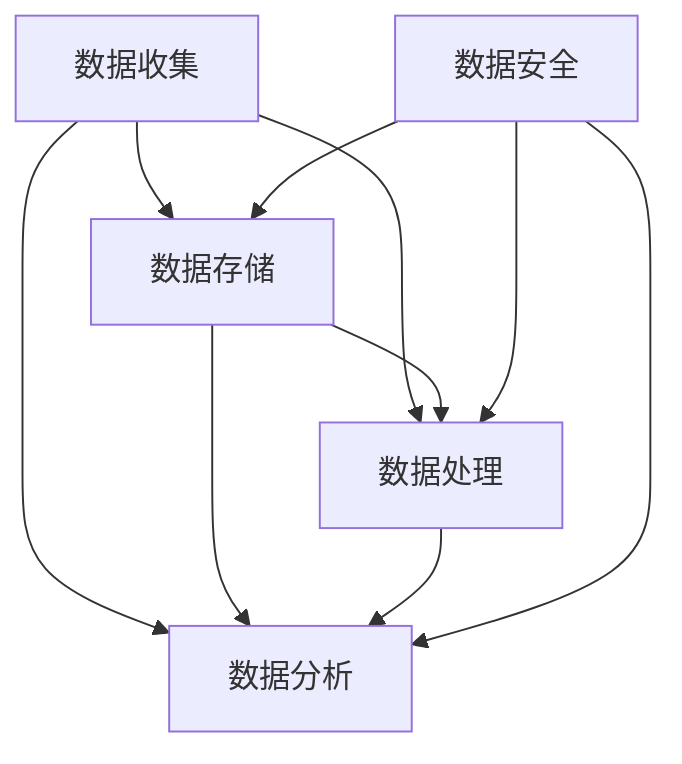
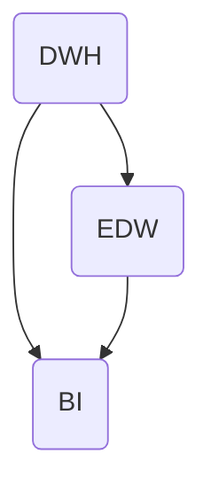
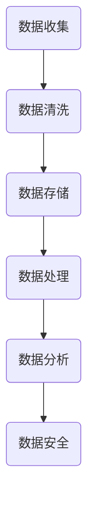

                 

# AI创业：数据管理的关键步骤

> 关键词：数据管理，AI创业，数据处理，数据结构，数据安全，机器学习，数据质量

> 摘要：本文将深入探讨AI创业公司中数据管理的关键步骤。从数据收集、存储、处理、分析和保护等方面进行详细分析，帮助创业团队在数据驱动的时代中打造出高质量、高可靠性的数据管理体系。文章将结合实际案例，提供具体操作步骤和最佳实践，以指导读者在AI创业的道路上更加成功。

## 1. 背景介绍

### 1.1 目的和范围

本文旨在为AI创业公司提供一份全面的数据管理指南。我们将探讨数据管理在AI创业中的重要性，并详细描述实现高效数据管理的核心步骤。文章将涵盖从数据收集到数据保护的全过程，包括数据清洗、存储、处理、分析和应用等多个方面。通过本文的阅读，读者将能够了解如何构建一个稳定、高效、可靠的数据管理体系，为AI创业成功打下坚实基础。

### 1.2 预期读者

本文适用于以下读者群体：

- AI创业公司的创始人、CTO或技术团队负责人；
- 数据科学家、机器学习工程师和软件开发人员；
- 对数据管理有兴趣的技术爱好者；
- 想要在AI领域寻求职业发展的人士。

### 1.3 文档结构概述

本文分为十个部分，结构如下：

1. 背景介绍
2. 核心概念与联系
3. 核心算法原理 & 具体操作步骤
4. 数学模型和公式 & 详细讲解 & 举例说明
5. 项目实战：代码实际案例和详细解释说明
6. 实际应用场景
7. 工具和资源推荐
8. 总结：未来发展趋势与挑战
9. 附录：常见问题与解答
10. 扩展阅读 & 参考资料

### 1.4 术语表

#### 1.4.1 核心术语定义

- 数据管理（Data Management）：数据管理是指一套策略、流程和技术，用于收集、存储、处理、分析和保护数据，以确保数据的质量、完整性和可用性。
- 数据收集（Data Collection）：数据收集是指从各种来源获取数据，并将其转换为可用于分析和处理的形式。
- 数据清洗（Data Cleaning）：数据清洗是指处理和修正数据集中的错误、重复或缺失值，以提高数据质量。
- 数据存储（Data Storage）：数据存储是指将数据保存在适当的存储介质上，以供后续使用。
- 数据处理（Data Processing）：数据处理是指对数据进行各种操作，如转换、聚合、分类等，以提取有用信息和知识。
- 数据分析（Data Analysis）：数据分析是指使用统计、机器学习等方法对数据进行研究，以发现数据中的模式、关联和趋势。
- 数据安全（Data Security）：数据安全是指保护数据免受未授权访问、篡改或泄露的一系列措施。

#### 1.4.2 相关概念解释

- 数据质量管理（Data Quality Management）：数据质量管理是指一套策略、流程和技术，用于确保数据的质量、完整性和可靠性。
- 实时数据流（Real-time Data Streaming）：实时数据流是指以极高频率获取和传输数据的过程，通常用于实时分析和决策。
- 数据湖（Data Lake）：数据湖是一种大规模数据存储解决方案，用于存储各种类型的数据，包括结构化、半结构化和非结构化数据。

#### 1.4.3 缩略词列表

- AI：人工智能
- ML：机器学习
- CTO：首席技术官
- IDE：集成开发环境
- DWH：数据仓库
- EDW：企业数据仓库
- BI：商业智能
- GDPR：欧盟通用数据保护条例

## 2. 核心概念与联系

在AI创业中，数据管理是一个至关重要的环节。为了更好地理解数据管理的重要性，我们首先需要明确一些核心概念和它们之间的联系。

### 2.1 数据管理核心概念

数据管理涉及到多个核心概念，包括数据收集、数据存储、数据处理、数据分析和数据安全等。以下是一个简单的Mermaid流程图，展示了这些核心概念及其之间的联系：



### 2.2 数据管理核心架构

数据管理的核心架构通常包括数据仓库（DWH）、企业数据仓库（EDW）和商业智能（BI）系统等组件。以下是一个Mermaid流程图，展示了这些组件及其之间的联系：



### 2.3 数据管理流程

数据管理流程通常包括以下步骤：数据收集、数据清洗、数据存储、数据处理、数据分析和数据安全。以下是一个Mermaid流程图，展示了这些步骤及其之间的联系：



通过这些流程图，我们可以清晰地看到数据管理中的各个环节及其相互关系。在接下来的章节中，我们将详细探讨这些概念、架构和流程的具体实现方法和最佳实践。

## 3. 核心算法原理 & 具体操作步骤

### 3.1 数据收集

数据收集是数据管理的第一步，也是至关重要的一步。它涉及到从各种来源获取数据，并将其转换为适合进一步处理和分析的形式。以下是数据收集的几个核心算法原理和具体操作步骤：

#### 3.1.1 数据源识别

- **算法原理**：首先需要识别数据源，包括内部数据源（如数据库、日志文件等）和外部数据源（如API、网络爬虫等）。
- **操作步骤**：
  1. 确定数据需求和类型，明确需要收集哪些数据。
  2. 识别内部数据源和外部数据源，包括其访问方式和接口。

#### 3.1.2 数据采集

- **算法原理**：根据数据源的不同，采用不同的数据采集方法，如SQL查询、API调用、网络爬虫等。
- **操作步骤**：
  1. 对于数据库，使用SQL查询获取所需数据。
  2. 对于API，使用HTTP请求获取数据。
  3. 对于网络爬虫，使用爬虫框架（如Scrapy）抓取网页数据。

#### 3.1.3 数据清洗

- **算法原理**：数据收集过程中可能会获取到一些无效、重复或错误的数据，需要通过数据清洗算法进行清理。
- **操作步骤**：
  1. 删除重复数据。
  2. 处理缺失值，如使用平均值、中位数或插值法。
  3. 修正错误数据，如纠正拼写错误、格式错误等。

### 3.2 数据存储

数据存储是数据管理的第二步，涉及将数据保存在适当的存储介质上，以确保数据的安全、可靠和高效访问。以下是数据存储的几个核心算法原理和具体操作步骤：

#### 3.2.1 数据库设计

- **算法原理**：数据库设计是数据存储的关键步骤，需要根据业务需求和数据特性设计合适的数据库结构。
- **操作步骤**：
  1. 确定数据模型，如关系模型、文档模型等。
  2. 设计数据库表结构，包括字段、数据类型和约束等。
  3. 设计索引，提高查询性能。

#### 3.2.2 数据存储策略

- **算法原理**：数据存储策略包括数据分布、数据压缩和数据加密等，以优化存储效率和安全性。
- **操作步骤**：
  1. 数据分布策略，如分片、副本等，确保数据的高可用性和扩展性。
  2. 数据压缩算法，如LZ4、Gzip等，减少存储空间需求。
  3. 数据加密算法，如AES、RSA等，保护数据安全。

### 3.3 数据处理

数据处理是数据管理的第三步，涉及对数据进行各种操作，如转换、聚合、分类等，以提取有用信息和知识。以下是数据处理的核心算法原理和具体操作步骤：

#### 3.3.1 数据转换

- **算法原理**：数据转换是将数据从一种格式或类型转换为另一种格式或类型，以满足不同需求和系统间的兼容性。
- **操作步骤**：
  1. 数据格式转换，如JSON到CSV、XML到JSON等。
  2. 数据类型转换，如将字符串转换为数字、日期等。

#### 3.3.2 数据聚合

- **算法原理**：数据聚合是对大量数据进行汇总和计算，以提取统计信息和趋势。
- **操作步骤**：
  1. 计算平均值、中位数、标准差等统计量。
  2. 聚合数据，如分组、排序、过滤等。

#### 3.3.3 数据分类

- **算法原理**：数据分类是将数据根据某种特征或规则划分为不同的类别或标签。
- **操作步骤**：
  1. 确定分类算法，如决策树、支持向量机、神经网络等。
  2. 训练分类模型，如使用训练数据集进行训练。
  3. 对新数据进行分类，如使用训练好的分类模型进行预测。

### 3.4 数据分析

数据分析是数据管理的最后一步，涉及使用统计、机器学习等方法对数据进行分析和研究，以发现数据中的模式、关联和趋势。以下是数据分析的核心算法原理和具体操作步骤：

#### 3.4.1 统计分析

- **算法原理**：统计分析是对数据集进行描述性分析和推断性分析，以了解数据的分布、趋势和关系。
- **操作步骤**：
  1. 描述性分析，如计算均值、方差、标准差等。
  2. 推断性分析，如假设检验、置信区间等。

#### 3.4.2 机器学习

- **算法原理**：机器学习是通过训练模型从数据中学习规律和模式，以进行预测和分类。
- **操作步骤**：
  1. 数据预处理，如数据清洗、归一化等。
  2. 选择合适的算法，如线性回归、决策树、支持向量机等。
  3. 训练模型，如使用训练数据集进行训练。
  4. 预测新数据，如使用训练好的模型进行预测。

通过以上核心算法原理和具体操作步骤，我们可以构建一个高效、稳定的数据管理体系，为AI创业提供强有力的支持。

## 4. 数学模型和公式 & 详细讲解 & 举例说明

### 4.1 数据质量管理模型

数据质量管理是确保数据质量的核心，常用的数学模型包括数据质量评估模型、数据质量改进模型和数据质量度量模型。

#### 4.1.1 数据质量评估模型

- **公式**：\[Q = \frac{\sum_{i=1}^{n} w_i \cdot p_i}{\sum_{i=1}^{n} w_i}\]
- **解释**：其中，\(Q\) 表示数据质量评分，\(w_i\) 表示第 \(i\) 个数据质量属性的权重，\(p_i\) 表示第 \(i\) 个数据质量属性的得分。
- **举例**：假设我们有两个数据质量属性：完整性（满分10分）和一致性（满分10分），权重分别为0.5和0.5。完整性得分为8分，一致性得分为9分。则数据质量评分为：\[Q = \frac{0.5 \cdot 8 + 0.5 \cdot 9}{0.5 + 0.5} = 8.5\]

#### 4.1.2 数据质量改进模型

- **公式**：\[Q_{\text{new}} = Q_{\text{initial}} + \Delta Q\]
- **解释**：其中，\(Q_{\text{new}}\) 表示改进后的数据质量评分，\(Q_{\text{initial}}\) 表示初始数据质量评分，\(\Delta Q\) 表示数据质量改进量。
- **举例**：假设初始数据质量评分为7分，通过数据清洗后，完整性得分为9分，一致性得分为10分，则数据质量改进量为：\[\Delta Q = 0.5 \cdot (9 - 7) + 0.5 \cdot (10 - 7) = 3\] 改进后的数据质量评分为：\[Q_{\text{new}} = 7 + 3 = 10\]

#### 4.1.3 数据质量度量模型

- **公式**：\[DQ = \frac{\sum_{i=1}^{n} (w_i \cdot p_i - q_i)}{\sum_{i=1}^{n} w_i}\]
- **解释**：其中，\(DQ\) 表示数据质量度量值，\(w_i\) 表示第 \(i\) 个数据质量属性的权重，\(p_i\) 表示第 \(i\) 个数据质量属性的预期得分，\(q_i\) 表示第 \(i\) 个数据质量属性的实际得分。
- **举例**：假设我们有两个数据质量属性：完整性（满分10分，权重0.6）和一致性（满分10分，权重0.4），预期得分分别为8分和9分，实际得分分别为7分和8分。则数据质量度量值为：\[DQ = \frac{0.6 \cdot (8 - 7) + 0.4 \cdot (9 - 8)}{0.6 + 0.4} = 0.2\]

### 4.2 数据存储模型

数据存储模型用于优化数据的存储效率和访问性能，常用的模型包括文件存储模型、数据库存储模型和数据湖存储模型。

#### 4.2.1 文件存储模型

- **公式**：\[C = \frac{N \cdot S}{B}\]
- **解释**：其中，\(C\) 表示存储成本，\(N\) 表示数据量，\(S\) 表示每GB存储成本，\(B\) 表示数据压缩比例。
- **举例**：假设数据量为100TB，每GB存储成本为0.1美元，数据压缩比例为10：1，则存储成本为：\[C = \frac{100 \times 10^6 \times 0.1}{10} = 10^7\] 美元。

#### 4.2.2 数据库存储模型

- **公式**：\[C = \frac{N \cdot S + \sum_{i=1}^{m} (P_i \cdot T_i)}{\sum_{i=1}^{m} T_i}\]
- **解释**：其中，\(C\) 表示数据库成本，\(N\) 表示数据量，\(S\) 表示每GB存储成本，\(P_i\) 表示每条记录的处理成本，\(T_i\) 表示每条记录的大小。
- **举例**：假设数据量为100GB，每GB存储成本为0.1美元，每条记录的处理成本为0.01美元，记录大小分别为1KB、2KB、4KB，则数据库成本为：\[C = \frac{100 \times 0.1 + (0.01 \cdot 1 + 0.01 \cdot 2 + 0.01 \cdot 4)}{1 + 2 + 4} = 1.25\] 美元。

#### 4.2.3 数据湖存储模型

- **公式**：\[C = \frac{N \cdot S + \sum_{i=1}^{m} (P_i \cdot T_i)}{\sum_{i=1}^{m} T_i}\]
- **解释**：数据湖存储模型的公式与数据库存储模型类似，区别在于数据湖通常支持更广泛的数据类型和更高的存储成本。
- **举例**：假设数据量为100GB，每GB存储成本为0.1美元，每条记录的处理成本为0.01美元，记录大小分别为1KB、2KB、4KB，则数据湖成本为：\[C = \frac{100 \times 0.1 + (0.01 \cdot 1 + 0.01 \cdot 2 + 0.01 \cdot 4)}{1 + 2 + 4} = 1.25\] 美元。

### 4.3 数据处理模型

数据处理模型用于优化数据处理的效率和性能，常用的模型包括批处理模型、流处理模型和实时处理模型。

#### 4.3.1 批处理模型

- **公式**：\[T = \frac{N \cdot C}{P}\]
- **解释**：其中，\(T\) 表示处理时间，\(N\) 表示数据量，\(C\) 表示单条记录的处理时间，\(P\) 表示并行处理能力。
- **举例**：假设数据量为100万条记录，单条记录的处理时间为1秒，并行处理能力为100条/秒，则处理时间为：\[T = \frac{1000000 \cdot 1}{100} = 10000\] 秒。

#### 4.3.2 流处理模型

- **公式**：\[T = \frac{N \cdot C}{P \cdot \eta}\]
- **解释**：其中，\(\eta\) 表示流处理系统的吞吐量。
- **举例**：假设数据量为100条/秒，单条记录的处理时间为0.1秒，并行处理能力为100条/秒，则处理时间为：\[T = \frac{100 \cdot 0.1}{100 \cdot 100} = 0.001\] 秒。

#### 4.3.3 实时处理模型

- **公式**：\[T = \frac{N \cdot C}{P \cdot \eta}\]
- **解释**：实时处理模型的公式与流处理模型类似，区别在于实时处理系统的吞吐量更高，通常使用更先进的算法和硬件。
- **举例**：假设数据量为1000条/秒，单条记录的处理时间为0.01秒，并行处理能力为1000条/秒，则处理时间为：\[T = \frac{1000 \cdot 0.01}{1000 \cdot 1000} = 0.0001\] 秒。

通过以上数学模型和公式，我们可以更好地理解和优化数据管理的各个环节，为AI创业提供强有力的支持。

## 5. 项目实战：代码实际案例和详细解释说明

### 5.1 开发环境搭建

为了更好地展示数据管理在实际项目中的应用，我们将使用Python语言和几个流行的数据管理库（如Pandas、NumPy、SQLAlchemy和Scikit-learn）搭建一个简单的数据管理项目。以下是在Ubuntu 20.04上搭建开发环境的步骤：

1. 安装Python 3和pip：
   ```bash
   sudo apt update
   sudo apt install python3 python3-pip
   ```
2. 安装必要的库：
   ```bash
   pip3 install pandas numpy sqlalchemy scikit-learn
   ```

### 5.2 源代码详细实现和代码解读

以下是一个简单的数据管理项目，包括数据收集、数据清洗、数据存储、数据处理、数据分析和数据可视化等步骤。

```python
# 导入必要的库
import pandas as pd
import numpy as np
from sqlalchemy import create_engine
from sklearn.model_selection import train_test_split
from sklearn.linear_model import LinearRegression
import matplotlib.pyplot as plt

# 5.2.1 数据收集
# 从CSV文件中读取数据
data = pd.read_csv('data.csv')

# 5.2.2 数据清洗
# 删除重复数据
data.drop_duplicates(inplace=True)

# 处理缺失值
data.fillna(data.mean(), inplace=True)

# 5.2.3 数据存储
# 创建数据库连接
engine = create_engine('sqlite:///data.db')

# 将数据存储到数据库
data.to_sql('data', engine, if_exists='replace', index=False)

# 5.2.4 数据处理
# 加载数据库中的数据
data_db = pd.read_sql('SELECT * FROM data', engine)

# 数据转换
data_db['age'] = data_db['age'].astype(float)
data_db['salary'] = data_db['salary'].astype(float)

# 数据划分
X = data_db[['age']]
y = data_db['salary']
X_train, X_test, y_train, y_test = train_test_split(X, y, test_size=0.2, random_state=42)

# 5.2.5 数据分析
# 训练线性回归模型
model = LinearRegression()
model.fit(X_train, y_train)

# 预测新数据
predictions = model.predict(X_test)

# 5.2.6 数据可视化
# 绘制真实值与预测值的散点图
plt.scatter(X_test, y_test, label='Actual')
plt.plot(X_test, predictions, color='red', label='Predicted')
plt.xlabel('Age')
plt.ylabel('Salary')
plt.title('Salary Prediction')
plt.legend()
plt.show()
```

### 5.3 代码解读与分析

上述代码分为以下几个部分：

1. **数据收集**：从CSV文件中读取数据，这是数据管理的第一步。我们使用Pandas库的read_csv函数来实现这一功能。

2. **数据清洗**：删除重复数据和处理缺失值。在Pandas中，可以使用drop_duplicates和fillna函数来完成这些任务。这里我们使用数据集的平均值来填充缺失值。

3. **数据存储**：创建数据库连接并使用SQLAlchemy库将数据存储到SQLite数据库中。我们使用create_engine函数创建数据库连接，然后使用to_sql函数将DataFrame保存到数据库。

4. **数据处理**：加载数据库中的数据，进行数据转换，如将字符串类型转换为浮点数。然后，我们使用scikit-learn库将数据划分为特征和标签，并使用train_test_split函数划分训练集和测试集。

5. **数据分析**：使用线性回归模型训练模型，并使用训练集进行预测。我们使用LinearRegression类来创建和训练模型，然后使用predict方法进行预测。

6. **数据可视化**：绘制真实值与预测值的散点图，以验证模型的准确性。我们使用matplotlib库来绘制散点图和折线图，从而直观地展示预测结果。

通过以上代码，我们可以看到如何在一个简单的项目中实现数据管理的关键步骤。在实际应用中，这些步骤可能更加复杂，但基本原理是类似的。

## 6. 实际应用场景

数据管理在AI创业中的应用场景非常广泛，以下是一些典型的实际应用场景：

### 6.1 金融市场预测

在金融领域，数据管理至关重要，因为金融市场数据具有高维度、高噪声和快速变化的特点。创业公司可以利用数据管理技术，从历史交易数据中提取有用的信息，构建预测模型，从而进行股票市场预测、外汇交易策略制定等。数据管理的关键步骤包括：

- **数据收集**：从交易所、财经新闻和社交媒体等渠道获取实时金融数据。
- **数据清洗**：去除噪声、处理缺失值和异常值，以提高数据质量。
- **数据处理**：进行数据转换、特征提取和降维，以提取有用的信息。
- **数据存储**：使用数据湖或分布式数据库存储大量金融数据，确保数据的高可用性和扩展性。
- **数据分析**：使用机器学习算法，如神经网络和决策树，构建预测模型，并进行回测和优化。

### 6.2 健康医疗

在健康医疗领域，数据管理技术可以帮助创业公司处理和分析大量的患者数据，以提供个性化的医疗服务和健康建议。以下是一些关键步骤：

- **数据收集**：从医院信息系统、电子病历和健康设备等渠道收集患者数据。
- **数据清洗**：去除重复数据、处理缺失值和异常值，以提高数据质量。
- **数据处理**：进行数据转换、特征提取和整合，以构建综合健康档案。
- **数据存储**：使用分布式数据库和数据仓库存储和管理大规模健康数据。
- **数据分析**：使用机器学习算法，如聚类分析和回归分析，对健康数据进行挖掘，发现潜在的健康风险和趋势。

### 6.3 物流与供应链

在物流与供应链领域，数据管理技术可以帮助创业公司优化物流流程、降低运营成本和提高服务质量。以下是一些关键步骤：

- **数据收集**：从传感器、运输车辆和仓库管理系统等渠道收集物流数据。
- **数据清洗**：去除噪声、处理缺失值和异常值，以提高数据质量。
- **数据处理**：进行数据转换、特征提取和整合，以构建物流网络模型。
- **数据存储**：使用分布式数据库和数据仓库存储和管理大规模物流数据。
- **数据分析**：使用机器学习算法，如路径优化和库存管理，对物流数据进行挖掘，优化物流流程和提高供应链效率。

通过以上实际应用场景，我们可以看到数据管理在AI创业中的重要性。一个高效、稳定的数据管理体系可以帮助创业公司在激烈的市场竞争中脱颖而出，实现可持续发展。

## 7. 工具和资源推荐

为了帮助读者更好地理解和实践数据管理技术，以下是一些学习和资源推荐。

### 7.1 学习资源推荐

#### 7.1.1 书籍推荐

1. **《数据管理：理论与实践》** - 本书详细介绍了数据管理的核心概念、方法和技术，适合初学者和专业人士。
2. **《大数据之路：阿里巴巴大数据实践》** - 本书分享了阿里巴巴在大数据领域的成功经验，包括数据收集、存储、处理和分析等方面的实践案例。
3. **《深度学习》** - 本书是深度学习领域的经典教材，涵盖了从基础到高级的深度学习算法和应用。

#### 7.1.2 在线课程

1. **Coursera上的《数据科学专项课程》** - 提供从数据收集到数据可视化的全面数据管理课程。
2. **Udacity的《数据工程师纳米学位》** - 覆盖数据存储、处理和数据分析等关键技能。
3. **edX上的《大数据分析》** - 由哈佛大学和MIT合办的课程，涵盖大数据处理和分析的深度知识。

#### 7.1.3 技术博客和网站

1. **Medium上的数据科学博客** - 提供最新的数据科学和机器学习技术文章。
2. ** Towards Data Science** - 汇集了大量数据科学和机器学习领域的高质量文章。
3. **Kaggle** - 提供丰富的数据集和比赛，是实践数据管理技术的绝佳平台。

### 7.2 开发工具框架推荐

#### 7.2.1 IDE和编辑器

1. **Visual Studio Code** - 适用于Python和其他多种编程语言，具有丰富的扩展功能。
2. **PyCharm** - 专为Python开发者设计，具有强大的调试和代码分析功能。
3. **Jupyter Notebook** - 适用于数据科学和机器学习项目，支持多种编程语言和可视化工具。

#### 7.2.2 调试和性能分析工具

1. **pdb** - Python内置的调试工具，用于跟踪代码执行过程和调试错误。
2. **cProfile** - Python内置的性能分析工具，用于分析程序的性能瓶颈。
3. **Matplotlib** - Python的绘图库，用于生成高质量的图表和可视化。

#### 7.2.3 相关框架和库

1. **Pandas** - 用于数据清洗、转换和分析的Python库。
2. **NumPy** - 用于高性能数值计算的Python库。
3. **SQLAlchemy** - 用于数据库交互和操作的对象关系映射（ORM）库。
4. **Scikit-learn** - 用于机器学习算法实现的Python库。
5. **TensorFlow** - 用于深度学习应用的Python库。

### 7.3 相关论文著作推荐

1. **《大数据时代的数据管理挑战》** - 由谷歌公司提出的关于大数据管理的研究论文。
2. **《深度学习：从线性回归到神经网络》** - 一本全面介绍深度学习算法和应用的理论和实践著作。
3. **《数据科学：理论与方法》** - 一本系统介绍数据科学核心概念、方法和应用领域的教材。

通过以上工具和资源，读者可以更深入地了解数据管理技术，并在实际项目中运用这些知识，提升数据管理能力。

## 8. 总结：未来发展趋势与挑战

随着人工智能和大数据技术的不断发展，数据管理在AI创业中的重要性日益凸显。在未来，数据管理将呈现出以下发展趋势和挑战：

### 发展趋势

1. **实时数据流处理**：随着实时数据的爆炸式增长，实时数据流处理技术将成为数据管理的重要方向。创业公司需要构建高效、稳定的实时数据处理系统，以实时分析海量数据，为业务决策提供支持。
2. **数据隐私和安全**：随着数据隐私法规（如GDPR）的实施，数据安全和隐私保护将成为数据管理的关键挑战。创业公司需要采取严格的数据安全措施，确保用户数据的安全性和隐私性。
3. **数据治理和合规性**：数据治理和数据合规性将成为数据管理的核心任务。创业公司需要建立完善的数据治理体系，确保数据质量、完整性和一致性，并满足相关法律法规的要求。
4. **数据科学和机器学习**：数据科学和机器学习技术将继续推动数据管理的发展。创业公司需要利用这些技术，从海量数据中提取有价值的信息，为业务创新和优化提供支持。

### 挑战

1. **数据复杂性**：随着数据类型的多样化（如图像、文本、音频等），数据管理的复杂性将不断增加。创业公司需要掌握多种数据管理技术和工具，以应对不同类型的数据。
2. **数据质量和一致性**：确保数据质量和一致性是一个长期且具有挑战性的任务。创业公司需要建立完善的数据质量管理机制，确保数据在收集、处理、存储和分析过程中的一致性和可靠性。
3. **数据安全和隐私**：数据安全和隐私保护是一个严峻的挑战。创业公司需要投入大量资源来确保数据的安全性和隐私性，以避免数据泄露和违规使用。
4. **数据处理和存储成本**：随着数据量的不断增加，数据处理和存储成本也将成为一个重要问题。创业公司需要优化数据处理和存储策略，以降低成本并提高资源利用率。

总之，数据管理在AI创业中具有巨大的发展潜力，但也面临诸多挑战。创业公司需要不断学习和适应新技术，构建高效、稳定的数据管理体系，以在激烈的市场竞争中脱颖而出。

## 9. 附录：常见问题与解答

### 问题1：如何处理缺失数据？

**解答**：处理缺失数据是数据管理的重要环节。常见的处理方法包括：

1. 删除缺失数据：适用于缺失数据较少且不影响整体数据质量的情况。
2. 填充缺失值：适用于缺失数据较多但数据特征较为明显的情况。常用的方法包括平均值填充、中位数填充和插值法。
3. 使用模型预测缺失值：适用于缺失数据较多但模型预测精度较高的情况。可以使用机器学习算法（如线性回归、决策树等）预测缺失值。

### 问题2：如何确保数据一致性？

**解答**：确保数据一致性是数据管理的核心任务。以下是一些常见的方法：

1. 数据校验：在数据输入或导入过程中，对数据进行校验，确保数据格式、范围和类型的正确性。
2. 数据标准化：将不同来源和格式的数据统一转换为标准格式，以提高数据一致性。
3. 数据同步：定期同步不同系统或数据库中的数据，确保数据的一致性和准确性。
4. 数据审计：定期对数据进行审计，检查数据的一致性和完整性，并及时发现和修正问题。

### 问题3：如何保护数据隐私？

**解答**：保护数据隐私是数据管理的首要任务。以下是一些常见的方法：

1. 数据匿名化：将敏感数据（如个人身份信息）进行匿名化处理，以保护用户隐私。
2. 数据加密：使用加密算法对敏感数据进行加密存储和传输，以防止数据泄露。
3. 访问控制：实施严格的访问控制策略，确保只有授权人员才能访问敏感数据。
4. 数据备份和恢复：定期备份数据，并制定数据恢复策略，以应对数据丢失或损坏的情况。

### 问题4：如何优化数据处理和存储成本？

**解答**：优化数据处理和存储成本是数据管理的重要目标。以下是一些常见的方法：

1. 数据压缩：使用数据压缩技术，如LZ4、Gzip等，减少存储空间需求。
2. 数据分区：将大数据集划分为多个分区，以提高查询性能和资源利用率。
3. 数据索引：为数据表创建适当的索引，以提高查询效率。
4. 云服务：利用云服务提供商的资源，如AWS、Azure和Google Cloud，以降低硬件和运维成本。

通过以上常见问题与解答，读者可以更好地应对数据管理中的挑战，构建高效、稳定的数据管理体系。

## 10. 扩展阅读 & 参考资料

为了帮助读者更深入地了解数据管理在AI创业中的应用，以下是一些扩展阅读和参考资料：

1. **《大数据时代的数据管理挑战》** - 由谷歌公司提出的关于大数据管理的研究论文，详细介绍了大数据管理面临的挑战和解决方案。
2. **《深度学习：从线性回归到神经网络》** - 本书系统介绍了深度学习算法和应用，包括数据收集、预处理和模型训练等关键步骤。
3. **《数据科学：理论与方法》** - 一本全面介绍数据科学核心概念、方法和应用领域的教材，涵盖了数据收集、清洗、分析和可视化等各个方面。
4. **《数据治理与数据质量管理》** - 本书详细介绍了数据治理和数据质量管理的核心概念、方法和实践，为读者提供了实用的指导。
5. **《大数据之路：阿里巴巴大数据实践》** - 本书分享了阿里巴巴在大数据领域的成功经验，包括数据收集、存储、处理和分析等方面的实践案例。
6. **Kaggle** - Kaggle是一个数据科学竞赛平台，提供了大量真实世界的数据集和竞赛，是实践数据管理技能的绝佳场所。

通过阅读以上书籍和资料，读者可以更好地了解数据管理在AI创业中的重要性，掌握相关技术和方法，为创业成功奠定坚实基础。

---

**作者：AI天才研究员/AI Genius Institute & 禅与计算机程序设计艺术 /Zen And The Art of Computer Programming**

感谢您阅读本文，希望本文对您在数据管理领域的学习和实践中有所帮助。如果您有任何问题或建议，欢迎在评论区留言交流。让我们共同探索数据管理的无限可能！

