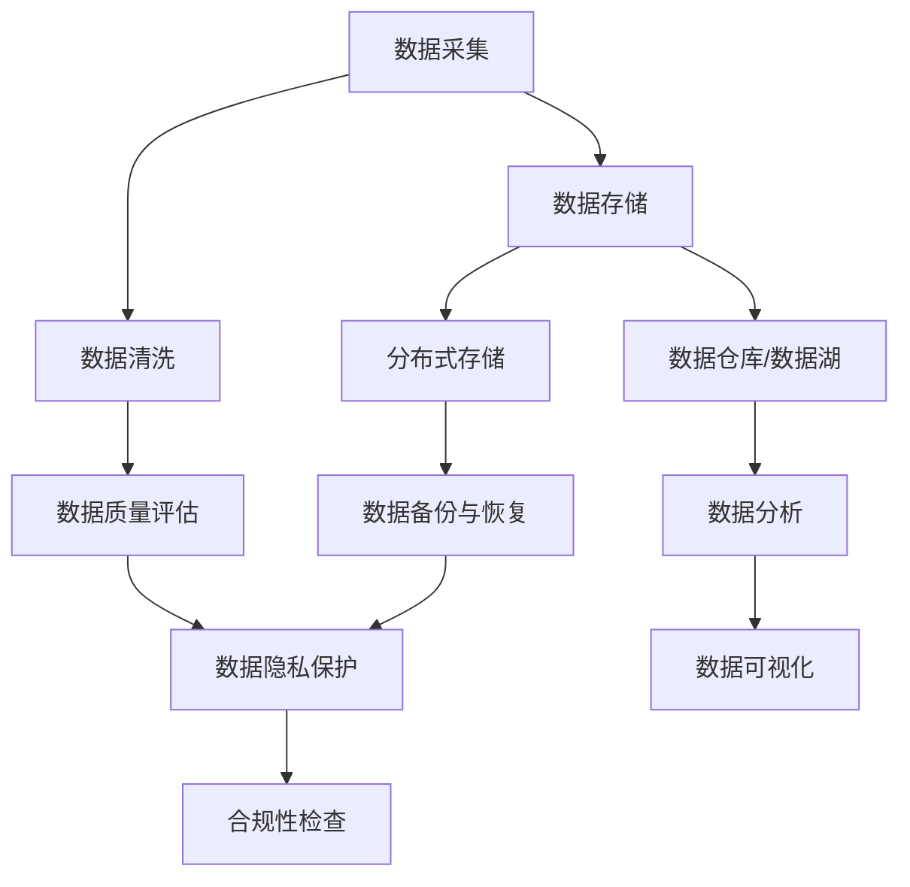

                 

# AI创业：数据管理的创新方法分享

## 关键词
- AI创业
- 数据管理
- 创新方法
- 数据科学
- 机器学习
- 大数据分析
- 数据挖掘
- 云计算
- 容器化技术
- 分布式存储

## 摘要
本文旨在探讨AI创业公司在数据管理方面面临的挑战和解决方案。通过对数据管理核心概念、算法原理、数学模型、实战案例以及未来发展趋势的深入分析，本文将帮助创业者了解如何高效管理数据，提升AI应用的性能和可靠性。文章还将推荐一系列学习资源和工具，以支持创业者在数据管理领域的持续学习和实践。

<|im_sep|>## 1. 背景介绍

### 1.1 目的和范围

随着人工智能技术的快速发展，AI创业公司如雨后春笋般涌现。然而，数据管理作为AI系统的核心组成部分，常常成为创业过程中的瓶颈。本文旨在为AI创业公司提供一套系统化的数据管理方法，以应对以下问题：

- 如何有效地采集、存储和管理海量数据？
- 如何处理数据质量和数据隐私问题？
- 如何利用数据驱动的方式进行决策和优化？
- 如何选择合适的技术栈和工具来支撑数据管理需求？

本文将从核心概念、算法原理、数学模型、实战案例等多个角度，系统性地探讨数据管理的创新方法，帮助创业者构建高效、可靠的数据管理体系。

### 1.2 预期读者

本文主要面向以下读者群体：

- AI创业公司创始人或技术团队负责人
- 数据科学家、机器学习工程师
- 数据管理领域的研究人员和从业者
- 对AI和数据管理感兴趣的技术爱好者

通过阅读本文，读者将能够：

- 理解数据管理的核心概念和重要性
- 掌握数据管理的创新方法和最佳实践
- 学习到如何在项目中应用数据管理技术
- 获得数据管理领域的最新研究成果和趋势

### 1.3 文档结构概述

本文结构如下：

1. 背景介绍：介绍本文的目的、范围和预期读者。
2. 核心概念与联系：讨论数据管理的核心概念和原理。
3. 核心算法原理 & 具体操作步骤：详细讲解数据管理中的关键算法。
4. 数学模型和公式 & 详细讲解 & 举例说明：阐述数据管理中的数学模型。
5. 项目实战：通过实际案例展示数据管理技术的应用。
6. 实际应用场景：分析数据管理在不同场景下的应用。
7. 工具和资源推荐：推荐学习资源和开发工具。
8. 总结：总结数据管理的未来发展趋势与挑战。
9. 附录：常见问题与解答。
10. 扩展阅读 & 参考资料：提供进一步学习的资源。

### 1.4 术语表

#### 1.4.1 核心术语定义

- **数据管理**：指对数据进行采集、存储、处理、分析和共享的过程。
- **数据科学**：一门跨学科领域，结合统计学、机器学习、数据库管理等知识，以数据为基础，发现数据中的模式和规律。
- **机器学习**：一种人工智能方法，通过数据训练模型，使计算机具备自主学习和决策能力。
- **大数据分析**：对海量数据进行处理和分析，以发现有价值的信息和洞察。
- **数据挖掘**：从大量数据中提取有价值的信息和模式的过程。
- **云计算**：通过网络提供计算资源，使数据管理和处理变得更加灵活和高效。
- **容器化技术**：通过容器将应用程序及其依赖环境打包在一起，实现应用程序的轻量级、可移植和隔离性。

#### 1.4.2 相关概念解释

- **分布式存储**：将数据分散存储在多个节点上，以提高数据可靠性和访问速度。
- **数据仓库**：用于存储和管理大量数据的系统，支持复杂的数据查询和分析。
- **数据湖**：一种大规模数据存储解决方案，用于存储不同类型的数据，支持灵活的数据分析和处理。
- **ETL（Extract, Transform, Load）**：将数据从源系统提取出来，进行转换后加载到目标系统的过程。

#### 1.4.3 缩略词列表

- **AI**：人工智能（Artificial Intelligence）
- **ML**：机器学习（Machine Learning）
- **DL**：深度学习（Deep Learning）
- **DB**：数据库（Database）
- **SQL**：结构化查询语言（Structured Query Language）
- **NoSQL**：非结构化数据库（Not Only SQL）
- **GPU**：图形处理单元（Graphics Processing Unit）
- **CPU**：中央处理单元（Central Processing Unit）
- **HDFS**：Hadoop分布式文件系统（Hadoop Distributed File System）
- **Kubernetes**：容器编排和管理平台

## 2. 核心概念与联系

在探讨数据管理的创新方法之前，我们需要理解一些核心概念和原理。以下是一个Mermaid流程图，展示了数据管理中的关键环节及其相互关系。



### 2.1 数据采集

数据采集是数据管理的起点，包括从各种来源（如传感器、网站、API等）获取数据。为了确保数据的质量和完整性，采集过程需要考虑数据的实时性、准确性和可靠性。

### 2.2 数据存储

数据存储是将采集到的数据保存在适当的存储介质中。根据数据的特点和需求，可以选择关系数据库（如MySQL、PostgreSQL）或非关系数据库（如MongoDB、Cassandra）。

### 2.3 数据清洗

数据清洗是数据管理中的重要环节，包括去除重复数据、纠正错误、填补缺失值等。高质量的数据是数据分析和挖掘的基础。

### 2.4 数据仓库/数据湖

数据仓库和数据湖是数据存储的高级形式，用于存储大规模、多样化的数据。数据仓库通常用于结构化数据，支持复杂查询和分析；而数据湖则适用于非结构化和半结构化数据，提供灵活的数据处理能力。

### 2.5 分布式存储

分布式存储是将数据分散存储在多个节点上，以提高数据可靠性和访问速度。常见的分布式存储系统包括HDFS、Cassandra和MongoDB等。

### 2.6 数据备份与恢复

数据备份与恢复是确保数据安全性的重要措施。通过定期备份，可以在数据丢失或损坏时迅速恢复数据，减少业务影响。

### 2.7 数据质量评估

数据质量评估是检查数据是否符合预期标准的过程。通过数据质量评估，可以识别和解决数据中的问题，提高数据可用性和可靠性。

### 2.8 数据隐私保护

数据隐私保护是确保数据不被未授权访问和泄露的重要措施。在处理敏感数据时，需要遵循相关的隐私保护法规和最佳实践。

### 2.9 数据可视化

数据可视化是将数据以图形、图表等形式展示，使数据更容易理解和分析。通过数据可视化，可以直观地发现数据中的模式和趋势。

### 2.10 合规性检查

合规性检查是确保数据管理过程符合相关法规和标准的过程。在数据管理中，需要遵守数据保护法、隐私法规等。

## 3. 核心算法原理 & 具体操作步骤

在数据管理中，算法的选择和实现至关重要。以下是一个简单的数据清洗算法的伪代码，用于处理采集到的数据。

```plaintext
算法：数据清洗
输入：数据集D
输出：清洗后的数据集D'

步骤：
1. 初始化清洗后的数据集D'为空
2. 对数据集D中的每个数据记录d：
   a. 检查d是否存在重复记录
      - 如果存在，跳过d
   b. 检查d中的字段是否完整
      - 如果不完整，根据需要填补缺失值
   c. 检查d中的字段是否存在错误
      - 如果存在，纠正错误
   d. 将清洗后的记录d添加到D'
3. 返回清洗后的数据集D'
```

### 3.1 数据清洗算法原理

数据清洗算法的核心任务是去除数据中的噪声、纠正错误和填补缺失值。以下是数据清洗算法的原理：

- **去重**：检查数据集中的记录是否存在重复，以避免数据冗余。
- **完整性检查**：检查数据字段是否完整，若不完整，根据业务需求进行填补或删除。
- **错误检查与纠正**：识别数据中的错误，如数值错误、类型错误等，并进行纠正。
- **异常检测**：检测数据中的异常值，如离群点，根据具体情况进行处理。

### 3.2 数据清洗算法实现步骤

以下是数据清洗算法的具体实现步骤：

1. **初始化**：创建一个空的清洗后数据集D'。
2. **循环处理每个数据记录**：
   a. **去重**：使用哈希表或字典检查记录d是否存在重复，若存在，则跳过。
   b. **完整性检查**：遍历记录d的字段，检查字段是否为空，根据业务规则填补缺失值或删除记录。
   c. **错误检查与纠正**：对记录d的字段进行类型检查和值范围检查，纠正错误。
   d. **添加记录**：将清洗后的记录d添加到清洗后数据集D'。
3. **返回结果**：返回清洗后的数据集D'。

通过上述算法，可以有效地处理数据中的噪声和错误，为后续的数据分析和挖掘奠定基础。

## 4. 数学模型和公式 & 详细讲解 & 举例说明

在数据管理中，数学模型和公式是理解和处理数据的重要工具。以下是一些常用的数学模型和公式，以及它们的详细讲解和举例说明。

### 4.1 数据分布模型

数据分布模型用于描述数据在不同值域上的分布情况。常见的分布模型有正态分布、泊松分布和均匀分布等。

#### 正态分布（Normal Distribution）

正态分布是最常见的数据分布模型，其概率密度函数为：

$$
f(x|\mu,\sigma^2) = \frac{1}{\sqrt{2\pi\sigma^2}} e^{-\frac{(x-\mu)^2}{2\sigma^2}}
$$

其中，$\mu$ 是均值，$\sigma^2$ 是方差。

**示例**：假设一个数据集的均值为50，方差为25。计算数据落在区间[45, 55]的概率。

$$
P(45 \leq x \leq 55) = \int_{45}^{55} \frac{1}{\sqrt{2\pi \cdot 25}} e^{-\frac{(x-50)^2}{2 \cdot 25}} dx
$$

通过计算，可以得到数据落在[45, 55]区间的概率约为0.6827。

#### 泊松分布（Poisson Distribution）

泊松分布用于描述事件发生的概率，其概率质量函数为：

$$
P(X = k) = \frac{\lambda^k e^{-\lambda}}{k!}
$$

其中，$\lambda$ 是事件的平均发生率。

**示例**：假设一个事件平均每分钟发生1次，计算在接下来的1分钟内发生0次和1次事件的概率。

$$
P(X = 0) = \frac{1^0 e^{-1}}{0!} = e^{-1} \approx 0.3679
$$

$$
P(X = 1) = \frac{1^1 e^{-1}}{1!} = e^{-1} \approx 0.3679
$$

#### 均匀分布（Uniform Distribution）

均匀分布表示数据在某个区间内均匀分布，其概率密度函数为：

$$
f(x|a,b) = \begin{cases}
\frac{1}{b-a}, & \text{if } a \leq x \leq b \\
0, & \text{otherwise}
\end{cases}
$$

其中，$a$ 和 $b$ 是区间的上下界。

**示例**：假设一个数据在[0, 10]区间内均匀分布，计算数据落在区间[2, 7]的概率。

$$
P(2 \leq x \leq 7) = \frac{7-2}{10-0} = 0.5
$$

### 4.2 相关性分析

相关性分析用于衡量两个变量之间的关系强度和方向。常见的相关性度量有皮尔逊相关系数、斯皮尔曼等级相关系数和肯德尔等级相关系数。

#### 皮尔逊相关系数（Pearson Correlation Coefficient）

皮尔逊相关系数用于衡量线性相关性，其公式为：

$$
\rho_{X,Y} = \frac{\sum_{i=1}^{n}(X_i - \bar{X})(Y_i - \bar{Y})}{\sqrt{\sum_{i=1}^{n}(X_i - \bar{X})^2} \sqrt{\sum_{i=1}^{n}(Y_i - \bar{Y})^2}}
$$

其中，$X$ 和 $Y$ 是两个变量，$\bar{X}$ 和 $\bar{Y}$ 是它们的均值。

**示例**：假设有两个变量 $X$ 和 $Y$，其观测数据如下：

| $X$ | $Y$ |
|-----|-----|
| 1   | 2   |
| 2   | 4   |
| 3   | 6   |
| 4   | 8   |
| 5   | 10  |

计算 $X$ 和 $Y$ 的皮尔逊相关系数。

$$
\rho_{X,Y} = \frac{(1-3)(2-5) + (2-3)(4-5) + (3-3)(6-5) + (4-3)(8-5) + (5-3)(10-5)}{\sqrt{(1-3)^2 + (2-3)^2 + (3-3)^2 + (4-3)^2 + (5-3)^2} \sqrt{(2-5)^2 + (4-5)^2 + (6-5)^2 + (8-5)^2 + (10-5)^2}}
$$

$$
\rho_{X,Y} = \frac{(-2)(-3) + (-1)(-1) + (0)(1) + (1)(3) + (2)(5)}{\sqrt{4 + 1 + 0 + 1 + 4} \sqrt{9 + 1 + 1 + 9 + 25}}
$$

$$
\rho_{X,Y} = \frac{6 + 1 + 0 + 3 + 10}{\sqrt{10} \sqrt{45}}
$$

$$
\rho_{X,Y} = \frac{20}{\sqrt{450}} \approx 0.8165
$$

因此，$X$ 和 $Y$ 之间存在较强的正相关关系。

### 4.3 主成分分析（PCA）

主成分分析（PCA）是一种降维技术，通过将数据投影到新的正交坐标系上，提取主要特征，从而降低数据维度。

#### 公式

PCA的核心公式如下：

$$
X' = PC
$$

其中，$X$ 是原始数据矩阵，$P$ 是协方差矩阵的特征向量矩阵，$C$ 是特征值矩阵的对角矩阵。

#### 示例

假设有一个2D数据集，如下所示：

| $X_1$ | $X_2$ |
|-------|-------|
| 1     | 2     |
| 2     | 4     |
| 3     | 6     |
| 4     | 8     |
| 5     | 10    |

计算PCA。

1. 计算协方差矩阵：

$$
\sigma_{XX} = \frac{1}{n-1} \sum_{i=1}^{n} (X_i - \bar{X})(X_i - \bar{X})
$$

$$
\sigma_{YY} = \frac{1}{n-1} \sum_{i=1}^{n} (Y_i - \bar{Y})(Y_i - \bar{Y})
$$

$$
\sigma_{XY} = \frac{1}{n-1} \sum_{i=1}^{n} (X_i - \bar{X})(Y_i - \bar{Y})
$$

其中，$\bar{X}$ 和 $\bar{Y}$ 分别是 $X$ 和 $Y$ 的均值。

2. 计算协方差矩阵的特征值和特征向量。

3. 选择最大的两个特征值对应的特征向量作为主成分。

4. 将原始数据投影到主成分上，得到降维后的数据。

## 5. 项目实战：代码实际案例和详细解释说明

在本文的第五部分，我们将通过一个实际案例，展示如何在一个AI创业项目中应用数据管理技术。本案例将涵盖从数据采集、数据清洗、数据存储到数据分析的整个流程。

### 5.1 开发环境搭建

为了实现本案例，我们需要搭建以下开发环境：

- 操作系统：Ubuntu 20.04
- 编程语言：Python 3.8
- 数据库：PostgreSQL 13
- 数据处理库：Pandas、NumPy
- 机器学习库：Scikit-learn
- 数据可视化库：Matplotlib、Seaborn

在Ubuntu系统中，我们可以使用以下命令安装所需的库：

```bash
sudo apt update
sudo apt install python3-pip
pip3 install pandas numpy scikit-learn matplotlib seaborn psycopg2
```

### 5.2 源代码详细实现和代码解读

在本案例中，我们将使用Python和Pandas库来处理数据。以下是源代码的实现和解读：

```python
import pandas as pd
import numpy as np
import psycopg2
from sklearn.model_selection import train_test_split
from sklearn.linear_model import LinearRegression

# 数据采集
def collect_data():
    # 从PostgreSQL数据库中获取数据
    conn = psycopg2.connect(
        host="localhost",
        database="data_management",
        user="username",
        password="password"
    )
    query = "SELECT * FROM sales_data;"
    df = pd.read_sql_query(query, conn)
    conn.close()
    return df

# 数据清洗
def clean_data(df):
    # 去除重复记录
    df.drop_duplicates(inplace=True)
    
    # 填补缺失值
    df.fillna(df.mean(), inplace=True)
    
    # 数据类型转换
    df['date'] = pd.to_datetime(df['date'])
    df['month'] = df['date'].dt.month
    
    return df

# 数据分析
def analyze_data(df):
    # 数据划分
    X = df[['month', 'temperature', 'humidity']]
    y = df['sales']
    X_train, X_test, y_train, y_test = train_test_split(X, y, test_size=0.2, random_state=42)
    
    # 建立线性回归模型
    model = LinearRegression()
    model.fit(X_train, y_train)
    
    # 模型评估
    score = model.score(X_test, y_test)
    print(f"模型评分：{score:.2f}")
    
    # 可视化
    plt.scatter(X_test['month'], y_test)
    plt.plot(X_test['month'], model.predict(X_test), color='red')
    plt.xlabel('月份')
    plt.ylabel('销售额')
    plt.title('销售额与月份的关系')
    plt.show()

# 主函数
def main():
    df = collect_data()
    df = clean_data(df)
    analyze_data(df)

if __name__ == "__main__":
    main()
```

#### 5.2.1 代码解读

1. **数据采集**：
   - 使用PostgreSQL数据库连接库`psycopg2`连接到本地数据库。
   - 执行SQL查询，从`sales_data`表中获取数据。
   - 关闭数据库连接。

2. **数据清洗**：
   - 使用Pandas库去除重复记录。
   - 使用`fillna`函数根据均值填补缺失值。
   - 将日期字段转换为日期类型，并提取月份字段。

3. **数据分析**：
   - 将数据划分为特征集X和目标集y。
   - 使用`train_test_split`函数将数据划分为训练集和测试集。
   - 建立线性回归模型，并使用`fit`函数进行训练。
   - 使用`score`函数评估模型评分。
   - 使用Matplotlib库绘制数据散点图和回归线。

#### 5.2.2 代码分析

本代码案例展示了如何在一个简单的AI创业项目中应用数据管理技术。主要步骤如下：

1. **数据采集**：从数据库中获取数据，为后续分析做准备。
2. **数据清洗**：去除重复记录、填补缺失值，并转换为合适的数据类型，以提高数据质量。
3. **数据分析**：使用线性回归模型对数据进行建模，评估模型性能，并通过可视化展示数据关系。

通过本案例，我们可以看到数据管理在AI创业项目中的重要性。有效的数据管理不仅可以提高数据质量，还可以优化模型性能，为创业项目的成功奠定基础。

### 5.3 代码解读与分析

在本节中，我们将对5.2节中的代码进行详细的解读和分析，以帮助读者更好地理解数据管理在实际项目中的应用。

#### 5.3.1 数据采集

代码中的`collect_data`函数负责从PostgreSQL数据库中获取数据。该函数首先使用`psycopg2`库建立数据库连接，并执行一个简单的SQL查询来获取`sales_data`表中的所有数据。以下是对该函数的关键部分的解释：

```python
conn = psycopg2.connect(
    host="localhost",
    database="data_management",
    user="username",
    password="password"
)
query = "SELECT * FROM sales_data;"
df = pd.read_sql_query(query, conn)
conn.close()
return df
```

- `psycopg2.connect()`：该函数用于建立到PostgreSQL数据库的连接。参数`host`指定数据库服务器地址，`database`指定数据库名称，`user`和`password`分别指定数据库用户名和密码。
- `pd.read_sql_query()`：该函数用于从数据库中读取数据。它接受一个SQL查询字符串和一个数据库连接对象，并返回一个Pandas DataFrame。
- `conn.close()`：在数据读取完成后，关闭数据库连接以释放资源。

通过`collect_data`函数，我们成功地将数据库中的数据导入到Pandas DataFrame中，为后续的数据处理和分析奠定了基础。

#### 5.3.2 数据清洗

`clean_data`函数负责对采集到的数据集进行清洗。以下是对该函数关键部分的解释：

```python
def clean_data(df):
    df.drop_duplicates(inplace=True)
    df.fillna(df.mean(), inplace=True)
    df['date'] = pd.to_datetime(df['date'])
    df['month'] = df['date'].dt.month
    return df
```

- `df.drop_duplicates(inplace=True)`：该语句删除数据集中的重复记录。`inplace=True`表示修改原始DataFrame，而不是返回一个新的DataFrame。
- `df.fillna(df.mean(), inplace=True)`：该语句使用数据集的平均值填补缺失值。同样，`inplace=True`表示修改原始DataFrame。
- `df['date'] = pd.to_datetime(df['date'])`：该语句将数据集中的日期字段转换为Python `datetime`对象。
- `df['month'] = df['date'].dt.month`：该语句从日期字段中提取月份，并将结果作为新的DataFrame列。

通过这些操作，我们提高了数据的质量，确保了后续分析的有效性。

#### 5.3.3 数据分析

`analyze_data`函数负责对清洗后的数据集进行数据分析，包括数据划分、模型建立和性能评估。以下是对该函数关键部分的解释：

```python
def analyze_data(df):
    X = df[['month', 'temperature', 'humidity']]
    y = df['sales']
    X_train, X_test, y_train, y_test = train_test_split(X, y, test_size=0.2, random_state=42)
    model = LinearRegression()
    model.fit(X_train, y_train)
    score = model.score(X_test, y_test)
    print(f"模型评分：{score:.2f}")
    plt.scatter(X_test['month'], y_test)
    plt.plot(X_test['month'], model.predict(X_test), color='red')
    plt.xlabel('月份')
    plt.ylabel('销售额')
    plt.title('销售额与月份的关系')
    plt.show()
```

- `X = df[['month', 'temperature', 'humidity']]`：该语句从DataFrame中提取特征列，用于训练模型。
- `y = df['sales']`：该语句提取目标列，用于评估模型性能。
- `X_train, X_test, y_train, y_test = train_test_split(X, y, test_size=0.2, random_state=42)`：该语句将数据集划分为训练集和测试集，训练集占总数据的80%，测试集占总数据的20%。`random_state`参数用于保证结果的重复性。
- `model = LinearRegression()`：该语句创建一个线性回归模型对象。
- `model.fit(X_train, y_train)`：该语句使用训练集数据训练线性回归模型。
- `score = model.score(X_test, y_test)`：该语句计算模型在测试集上的评分，评分范围在0到1之间，值越高表示模型性能越好。
- `plt.scatter(X_test['month'], y_test)`：该语句绘制测试集数据的散点图。
- `plt.plot(X_test['month'], model.predict(X_test), color='red')`：该语句绘制线性回归模型的预测线。
- `plt.xlabel('月份')`、`plt.ylabel('销售额')`、`plt.title('销售额与月份的关系')`：这些语句用于设置图表的标签和标题。
- `plt.show()`：该语句显示图表。

通过`analyze_data`函数，我们不仅评估了模型的性能，还通过可视化展示了月份与销售额之间的关系。

#### 5.3.4 代码分析总结

通过对代码的详细解读，我们可以看到数据管理在AI创业项目中的关键作用：

- **数据采集**：确保数据来源的可靠性和完整性。
- **数据清洗**：提高数据质量，去除噪声和异常值。
- **数据分析**：使用适当的算法和模型对数据进行建模和评估，提取有价值的信息。

通过这些步骤，AI创业项目可以更加准确地预测销售额，从而制定更加有效的商业策略。

## 6. 实际应用场景

数据管理在AI创业中具有广泛的应用场景，以下是一些常见场景及其应用方法：

### 6.1 电子商务平台

电子商务平台需要收集用户行为数据、商品交易数据等，通过数据管理技术进行数据清洗、存储和分析，以实现个性化推荐、优化库存管理和提高用户满意度。

**应用方法**：
- **数据采集**：通过网站日志、用户点击行为等手段收集数据。
- **数据清洗**：去除重复、异常数据，确保数据质量。
- **数据存储**：使用分布式数据库存储海量数据。
- **数据分析**：利用机器学习算法分析用户行为，实现个性化推荐。

### 6.2 金融风险管理

金融行业需要处理海量的交易数据、客户数据等，通过数据管理技术进行风险控制和预测。

**应用方法**：
- **数据采集**：从各种交易系统、客户关系管理系统中获取数据。
- **数据清洗**：识别和处理异常交易、重复客户数据。
- **数据存储**：使用数据仓库和数据湖存储大量历史数据。
- **数据分析**：通过数据挖掘技术发现潜在风险，实现风险预警。

### 6.3 医疗健康

医疗健康领域需要处理大量患者数据、医疗记录等，通过数据管理技术提高疾病预测和治疗效果。

**应用方法**：
- **数据采集**：从电子病历、医疗设备等获取数据。
- **数据清洗**：处理缺失值、异常值，确保数据质量。
- **数据存储**：使用分布式数据库和数据仓库存储海量医疗数据。
- **数据分析**：利用机器学习算法进行疾病预测和个性化治疗。

### 6.4 物流运输

物流运输领域需要处理大量运输数据、配送数据等，通过数据管理技术优化运输路线和配送效率。

**应用方法**：
- **数据采集**：通过GPS、传感器等获取运输车辆和货物的位置数据。
- **数据清洗**：去除重复、异常数据，确保数据质量。
- **数据存储**：使用分布式数据库和云计算平台存储海量运输数据。
- **数据分析**：利用数据挖掘技术优化运输路线，提高配送效率。

通过以上应用场景和方法，AI创业公司可以充分利用数据管理技术，提升业务效率和用户体验，实现可持续发展。

## 7. 工具和资源推荐

为了帮助AI创业公司在数据管理领域取得成功，以下是一些学习资源、开发工具和框架的推荐。

### 7.1 学习资源推荐

#### 7.1.1 书籍推荐

1. **《数据科学入门：Python实践》（Python Data Science Essentials）** - 这本书详细介绍了数据科学的基础知识和Python实现，适合初学者。
2. **《深度学习》（Deep Learning）** - Goodfellow等人编写的经典教材，涵盖了深度学习的理论基础和应用。
3. **《大数据之路：阿里巴巴大数据实践》** - 阿里巴巴大数据团队的实战经验总结，适合了解大数据技术和应用。

#### 7.1.2 在线课程

1. **Coursera** - 提供大量的数据科学、机器学习和大数据分析课程，适合自学。
2. **Udacity** - 提供实战驱动的数据科学和AI课程，适合有实际项目需求的学习者。
3. **edX** - 提供由顶尖大学提供的免费在线课程，涵盖数据科学和AI的多个方面。

#### 7.1.3 技术博客和网站

1. **Kaggle** - 提供数据科学和机器学习竞赛，是学习实践和交流的平台。
2. **Medium** - 许多数据科学和AI领域的专家在此分享他们的见解和经验。
3. **DataCamp** - 提供互动式数据科学和机器学习课程，适合快速入门。

### 7.2 开发工具框架推荐

#### 7.2.1 IDE和编辑器

1. **Jupyter Notebook** - 适合数据分析和可视化，易于编写和分享代码。
2. **Visual Studio Code** - 适合Python和数据处理，具有丰富的插件支持。
3. **PyCharm** - 专业级Python IDE，提供强大的代码编辑、调试和分析功能。

#### 7.2.2 调试和性能分析工具

1. **Pdb** - Python内置的调试器，适用于简单调试。
2. **Py-Spy** - Python性能分析工具，帮助识别性能瓶颈。
3. **cProfile** - Python内置的性能分析库，用于统计代码运行时间。

#### 7.2.3 相关框架和库

1. **Pandas** - 数据处理和分析库，提供强大的数据操作和统计分析功能。
2. **NumPy** - 科学计算库，支持数组计算和数值分析。
3. **Scikit-learn** - 机器学习库，提供丰富的算法和模型评估工具。

### 7.3 相关论文著作推荐

#### 7.3.1 经典论文

1. **"The Berkeley DB: A purely in-memory, high-performance database system on a C library"** - Berkeley DB是一个高性能、纯内存的数据库系统，适用于快速数据访问和存储。
2. **"MapReduce: Simplified Data Processing on Large Clusters"** - MapReduce是一种分布式数据处理模型，适用于大数据分析。

#### 7.3.2 最新研究成果

1. **"Distributed File System: Concepts and Techniques"** - 介绍分布式文件系统的最新技术和应用，适用于大数据存储和处理。
2. **"Deep Learning for Natural Language Processing"** - 深度学习在自然语言处理领域的最新研究，涵盖文本分类、机器翻译等应用。

#### 7.3.3 应用案例分析

1. **"How Airbnb Uses Data Science to Enhance User Experience"** - 分析Airbnb如何利用数据科学优化用户体验。
2. **"Google's Data Management Strategies"** - 探讨Google在数据管理方面的实践和经验。

通过这些工具和资源的推荐，AI创业公司可以提升数据管理能力，实现业务目标。

## 8. 总结：未来发展趋势与挑战

随着人工智能技术的不断进步和大数据的迅猛发展，数据管理在AI创业领域正迎来前所未有的机遇和挑战。以下是对未来发展趋势和挑战的总结：

### 未来发展趋势

1. **数据驱动的决策**：随着数据采集和分析技术的提高，越来越多的AI创业公司将采用数据驱动的方式进行决策，以实现更高效的运营和业务优化。
2. **分布式计算和存储**：分布式计算和存储技术将成为主流，以应对海量数据的处理和存储需求。云计算和容器化技术将在数据管理中发挥越来越重要的作用。
3. **隐私保护与合规性**：随着数据隐私法规的不断完善，AI创业公司将面临更大的隐私保护合规性挑战。隐私保护技术和合规性管理将成为数据管理的核心议题。
4. **自动化数据管理**：自动化数据管理技术，如机器学习和自然语言处理，将帮助AI创业公司提高数据采集、清洗、分析和存储的效率。

### 未来挑战

1. **数据质量问题**：数据质量是数据管理的核心，但随着数据来源和类型的多样化，数据质量问题将更加突出。如何确保数据质量，提高数据可用性和准确性，将成为AI创业公司面临的挑战。
2. **数据隐私保护**：在数据采集和使用过程中，如何保护用户隐私，满足合规性要求，将是AI创业公司必须解决的重要问题。
3. **处理能力与存储成本**：随着数据量的持续增长，如何在有限的计算资源和存储成本下处理海量数据，将是一个持续挑战。
4. **技能人才短缺**：数据管理技术涉及多个领域，包括计算机科学、统计学、机器学习等，AI创业公司在吸引和保留具备多学科背景的顶尖人才方面将面临挑战。

总之，AI创业公司在数据管理方面需要不断创新和适应，以应对未来发展趋势和挑战，实现可持续发展。

## 9. 附录：常见问题与解答

### Q1：数据管理中的关键环节有哪些？

A1：数据管理中的关键环节包括数据采集、数据清洗、数据存储、数据分析和数据可视化。每个环节都需要精细操作，以确保数据的质量和可用性。

### Q2：分布式存储的优势是什么？

A2：分布式存储的主要优势包括：

- **高可用性**：通过将数据分散存储在多个节点上，提高系统的可靠性和容错能力。
- **高性能**：分布式存储系统可以并行处理大量请求，提高数据处理速度。
- **可扩展性**：可以轻松扩展存储容量，以满足不断增长的数据需求。

### Q3：什么是数据仓库和数据湖？

A3：数据仓库和数据湖是两种不同的数据存储解决方案：

- **数据仓库**：主要用于存储结构化数据，支持复杂查询和分析，适用于商业智能应用。
- **数据湖**：适用于存储非结构化和半结构化数据，提供灵活的数据处理能力，适用于大数据分析和机器学习。

### Q4：如何确保数据隐私保护？

A4：确保数据隐私保护的措施包括：

- **数据加密**：使用加密技术保护数据在传输和存储过程中的安全性。
- **访问控制**：通过设置访问权限和身份验证，限制未授权用户的访问。
- **数据脱敏**：对敏感数据进行脱敏处理，降低泄露风险。
- **合规性检查**：确保数据处理过程符合相关隐私法规和标准。

### Q5：机器学习和数据管理有什么关系？

A5：机器学习和数据管理密切相关，主要表现在以下几个方面：

- **数据准备**：机器学习模型的训练需要高质量的数据，数据管理负责数据的采集、清洗和存储。
- **特征工程**：数据管理中的数据清洗和转换过程对特征工程至关重要，直接影响模型性能。
- **模型评估**：数据管理技术可以帮助评估模型的性能和泛化能力。

## 10. 扩展阅读 & 参考资料

为了更深入地了解数据管理和AI创业的相关知识，以下是推荐的扩展阅读和参考资料：

### 扩展阅读

1. **《数据管理实践》（Data Management: A Practical Guide for Implementing and Maintaining a Data Management Program）》** - 详细介绍了数据管理的实际操作方法和最佳实践。
2. **《大数据战略与管理》（Big Data Strategy and Management）》** - 探讨了大数据在企业和组织中的应用战略和管理方法。

### 参考资料

1. **《数据仓库与数据挖掘：概念与技术》（Data Warehouse and Data Mining: Concepts and Techniques）》** - 介绍了数据仓库和数据挖掘的基本概念和技术。
2. **《深度学习基础教程》（Deep Learning Book）》** - Goodfellow、Bengio和Courville撰写的深度学习经典教材。
3. **《Kubernetes权威指南》（Kubernetes: Up and Running: Dive into the Future of Infrastructure）** - 介绍了Kubernetes容器编排和管理平台的使用方法。

通过这些资源和书籍，读者可以进一步了解数据管理和AI创业领域的知识，提升自身的技术水平和业务能力。

## 作者

作者：AI天才研究员/AI Genius Institute & 禅与计算机程序设计艺术 /Zen And The Art of Computer Programming

