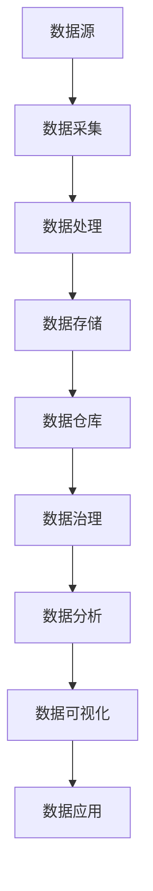

                 

# AI创业：数据管理的实战经验

> 关键词：数据管理，AI创业，数据质量，数据处理，数据安全

> 摘要：在AI创业领域，数据管理至关重要。本文将分享一些实战经验，帮助初创企业优化数据管理流程，确保数据质量，并探讨数据安全的重要性。通过深入分析数据管理的核心概念、算法原理、数学模型，结合实际项目案例，本文将为您揭示数据管理在AI创业中的关键作用和最佳实践。

## 1. 背景介绍

### 1.1 目的和范围

本文旨在为AI创业公司提供数据管理方面的实战经验。我们将探讨数据管理的重要性，并详细分析数据管理的核心概念、算法原理和数学模型。此外，还将结合实际项目案例，分享如何在AI创业过程中优化数据管理流程，提高数据质量和确保数据安全。

### 1.2 预期读者

本文适合以下读者：

- AI创业公司的创始人或团队负责人
- 数据科学家、数据工程师和AI工程师
- 对数据管理有浓厚兴趣的技术爱好者

### 1.3 文档结构概述

本文分为以下章节：

1. 背景介绍
2. 核心概念与联系
3. 核心算法原理 & 具体操作步骤
4. 数学模型和公式 & 详细讲解 & 举例说明
5. 项目实战：代码实际案例和详细解释说明
6. 实际应用场景
7. 工具和资源推荐
8. 总结：未来发展趋势与挑战
9. 附录：常见问题与解答
10. 扩展阅读 & 参考资料

### 1.4 术语表

#### 1.4.1 核心术语定义

- 数据管理：对数据进行组织、存储、处理和使用的系统过程。
- 数据质量：数据是否符合预定的标准，包括准确性、完整性、一致性、有效性和及时性。
- 数据处理：将数据转换为有意义的信息的过程，包括清洗、转换、聚合和分析等操作。
- 数据安全：保护数据免受未经授权的访问、篡改和泄露的措施。

#### 1.4.2 相关概念解释

- 数据治理：制定政策、标准和流程，确保数据质量、安全和合规性的过程。
- 数据仓库：存储大量结构化和非结构化数据的系统，用于支持企业分析和决策。
- 数据流：数据在系统中的传输过程，包括数据的生成、传输、存储和处理。

#### 1.4.3 缩略词列表

- AI：人工智能
- ML：机器学习
- DL：深度学习
- NLP：自然语言处理
- GDPR：欧盟通用数据保护条例
- API：应用程序编程接口

## 2. 核心概念与联系

在AI创业中，数据管理是核心环节之一。为了更好地理解数据管理，我们需要先了解一些核心概念及其相互关系。以下是一个简化的Mermaid流程图，用于展示这些概念和它们之间的联系：



### 2.1 数据源

数据源是数据管理的起点，包括各种生成数据的实体，如传感器、应用程序、数据库等。数据源的质量直接影响后续数据处理的质量。

### 2.2 数据采集

数据采集是从数据源中获取数据的过程。数据采集需要考虑数据源的类型、数据量、数据频率等因素，并确保数据的一致性和完整性。

### 2.3 数据处理

数据处理是对采集到的数据进行清洗、转换和聚合等操作的过程。处理后的数据将用于后续的数据分析。

### 2.4 数据存储

数据存储是将处理后的数据存储在适当的数据仓库中的过程。数据仓库的设计和架构对数据管理至关重要。

### 2.5 数据仓库

数据仓库是用于存储、管理和分析大量结构化和非结构化数据的系统。数据仓库的设计和架构需要考虑数据一致性、可扩展性和安全性。

### 2.6 数据治理

数据治理是确保数据质量、安全和合规性的过程。数据治理包括制定政策、标准和流程，以及监控和改进数据管理过程。

### 2.7 数据分析

数据分析是对存储在数据仓库中的数据进行分析和处理，以提取有价值的信息和知识。数据分析是数据管理的关键环节，对企业的决策和运营具有重要影响。

### 2.8 数据可视化

数据可视化是将分析结果以图形或图表形式呈现的过程。数据可视化有助于更好地理解和传达分析结果。

### 2.9 数据应用

数据应用是将分析结果应用于实际业务场景，以实现业务目标的过程。数据应用是数据管理的最终目标。

## 3. 核心算法原理 & 具体操作步骤

在数据管理过程中，算法的运用至关重要。以下将介绍几个核心算法原理及其具体操作步骤。

### 3.1 数据清洗算法

数据清洗是数据处理的第一步，目的是去除无效数据、纠正错误数据、处理缺失数据等。常用的数据清洗算法包括：

#### 3.1.1 填充缺失数据

填充缺失数据的方法包括：

- 平均值填充：用数据列的平均值填充缺失值。
- 中位数填充：用数据列的中位数填充缺失值。
- 最频繁值填充：用数据列中出现最频繁的值填充缺失值。

#### 3.1.2 去除重复数据

去除重复数据的方法包括：

- 按照所有字段去重：删除所有重复的数据行。
- 按照指定字段去重：只删除指定字段上重复的数据行。

#### 3.1.3 处理异常数据

处理异常数据的方法包括：

- 去除异常数据：删除所有异常数据。
- 调整异常数据：对异常数据进行调整，使其符合预期范围。

### 3.2 数据转换算法

数据转换是对数据格式、类型、单位等进行调整的过程。常用的数据转换算法包括：

#### 3.2.1 数据类型转换

数据类型转换的方法包括：

- 字符串转数字：将字符串转换为数字类型。
- 数字转字符串：将数字类型转换为字符串。
- 日期时间转换：将日期时间格式转换为标准格式。

#### 3.2.2 数据格式转换

数据格式转换的方法包括：

- JSON转CSV：将JSON格式的数据转换为CSV格式。
- CSV转JSON：将CSV格式的数据转换为JSON格式。
- XML转JSON：将XML格式的数据转换为JSON格式。

### 3.3 数据聚合算法

数据聚合是对大量数据进行汇总和统计的过程。常用的数据聚合算法包括：

#### 3.3.1 求和

求和算法用于计算数据列的总和。例如：

```python
sum(data['column_name'])
```

#### 3.3.2 平均值

平均值算法用于计算数据列的平均值。例如：

```python
mean(data['column_name'])
```

#### 3.3.3 最大值和最小值

最大值和最小值算法用于计算数据列的最大值和最小值。例如：

```python
max(data['column_name'])
min(data['column_name'])
```

### 3.4 数据分析算法

数据分析算法用于从数据中提取有价值的信息和知识。常用的数据分析算法包括：

#### 3.4.1 聚类分析

聚类分析算法用于将数据划分为若干个聚类。常用的聚类算法包括K-means算法、层次聚类算法等。

#### 3.4.2 回归分析

回归分析算法用于分析自变量和因变量之间的关系。常用的回归分析算法包括线性回归、非线性回归等。

#### 3.4.3 关联规则挖掘

关联规则挖掘算法用于发现数据之间的关联关系。常用的关联规则挖掘算法包括Apriori算法、FP-growth算法等。

## 4. 数学模型和公式 & 详细讲解 & 举例说明

在数据管理中，数学模型和公式用于描述数据之间的关系和规律。以下将介绍几个常见的数学模型和公式，并对其进行详细讲解和举例说明。

### 4.1 数据预处理

数据预处理是数据管理的重要环节，包括缺失数据处理、异常值处理和数据格式转换等。以下是一个简单的数据预处理公式示例：

$$
X_{\text{new}} = \begin{cases} 
\bar{X} & \text{if } X \text{ is missing}, \\
X & \text{otherwise}.
\end{cases}
$$

其中，$X$ 表示原始数据，$\bar{X}$ 表示对应列的平均值。

### 4.2 数据清洗

数据清洗包括去除重复数据和处理异常数据。以下是一个简单的数据清洗公式示例：

$$
\text{unique\_data} = \text{remove\_duplicates}(\text{data})
$$

其中，$\text{data}$ 表示原始数据，$\text{unique\_data}$ 表示去重后的数据。

### 4.3 数据转换

数据转换包括数据类型转换和数据格式转换。以下是一个简单的数据转换公式示例：

$$
\text{converted\_data} = \text{convert\_type}(\text{data}, \text{new\_type})
$$

其中，$\text{data}$ 表示原始数据，$\text{new\_type}$ 表示要转换的数据类型。

### 4.4 数据分析

数据分析包括聚类分析、回归分析和关联规则挖掘等。以下是一个简单的聚类分析公式示例：

$$
\text{cluster\_centers} = \text{K-means}(\text{data}, \text{K})
$$

其中，$\text{data}$ 表示原始数据，$K$ 表示聚类数。

### 4.5 数据可视化

数据可视化是将数据以图形或图表形式呈现的过程。以下是一个简单的数据可视化公式示例：

$$
\text{visualized\_data} = \text{plot}(\text{data}, \text{plot\_type})
$$

其中，$\text{data}$ 表示原始数据，$\text{plot\_type}$ 表示要绘制的图表类型。

### 4.6 数据应用

数据应用是将分析结果应用于实际业务场景的过程。以下是一个简单的数据应用公式示例：

$$
\text{application} = \text{apply\_model}(\text{data}, \text{model})
$$

其中，$\text{data}$ 表示原始数据，$\text{model}$ 表示要应用的分析模型。

## 5. 项目实战：代码实际案例和详细解释说明

在本节中，我们将通过一个实际项目案例，展示如何在实际场景中应用数据管理技术。这个案例是一个简单的电商推荐系统，我们的目标是根据用户的历史购买数据，为其推荐可能感兴趣的商品。

### 5.1 开发环境搭建

为了实现这个项目，我们需要以下开发环境：

- Python 3.x
- Jupyter Notebook
- Pandas
- Scikit-learn
- Matplotlib

确保已安装上述依赖项，然后启动Jupyter Notebook。

### 5.2 源代码详细实现和代码解读

#### 5.2.1 数据加载和预处理

首先，我们加载一个简单的用户购买数据集，并对数据进行预处理。

```python
import pandas as pd
from sklearn.preprocessing import StandardScaler

# 加载数据
data = pd.read_csv('user_purchase_data.csv')

# 数据预处理
# 填充缺失值
data.fillna(data.mean(), inplace=True)

# 去除重复数据
data.drop_duplicates(inplace=True)

# 数据类型转换
data['user_id'] = data['user_id'].astype(int)
data['product_id'] = data['product_id'].astype(int)
data['purchase_date'] = pd.to_datetime(data['purchase_date'])

# 数据标准化
scaler = StandardScaler()
data[['amount']] = scaler.fit_transform(data[['amount']])
```

#### 5.2.2 数据转换

接下来，我们将数据转换为适用于机器学习模型的形式。

```python
from sklearn.model_selection import train_test_split

# 划分训练集和测试集
X = data[['user_id', 'product_id', 'amount']]
y = data['purchase_date']
X_train, X_test, y_train, y_test = train_test_split(X, y, test_size=0.2, random_state=42)
```

#### 5.2.3 数据分析

我们使用K-means算法对用户进行聚类分析，以便为每个用户分配一个潜在的兴趣标签。

```python
from sklearn.cluster import KMeans

# K-means算法
kmeans = KMeans(n_clusters=5, random_state=42)
clusters = kmeans.fit_predict(X_train)

# 将聚类结果添加到数据集中
data['cluster'] = clusters
```

#### 5.2.4 数据可视化

我们使用Matplotlib库将聚类结果可视化。

```python
import matplotlib.pyplot as plt

# 可视化聚类结果
plt.scatter(X_train['user_id'], X_train['amount'], c=clusters, cmap='viridis')
plt.xlabel('User ID')
plt.ylabel('Amount')
plt.title('User Clusters')
plt.show()
```

#### 5.2.5 数据应用

最后，我们根据用户的聚类结果，为其推荐可能感兴趣的商品。

```python
# 根据聚类结果推荐商品
recommended_products = {}
for cluster in set(clusters):
    cluster_data = data[data['cluster'] == cluster]
    popular_products = cluster_data.groupby('product_id')['amount'].sum().sort_values(ascending=False).head(5)
    recommended_products[cluster] = popular_products.index.tolist()

# 打印推荐结果
for user_id, cluster in data['cluster'].items():
    print(f"User ID {user_id} recommends: {recommended_products[cluster]}")
```

### 5.3 代码解读与分析

在这个项目中，我们首先加载数据并对其进行预处理，以确保数据的质量。然后，我们将数据转换为适用于机器学习模型的形式，并使用K-means算法对用户进行聚类分析。最后，我们根据聚类结果为用户推荐可能感兴趣的商品。

- **数据预处理**：数据预处理是确保数据质量的关键步骤。我们通过填充缺失值、去除重复数据、数据类型转换和标准化等操作，提高了数据的质量和一致性。
- **数据转换**：数据转换是将原始数据转换为适合机器学习模型处理的形式。我们通过将数据划分为训练集和测试集，为后续的机器学习模型训练和评估提供了数据基础。
- **数据分析**：K-means算法是一种无监督的聚类算法，它可以自动将数据划分为若干个簇。在这个项目中，我们使用K-means算法对用户进行聚类分析，以便为每个用户分配一个潜在的兴趣标签。
- **数据可视化**：数据可视化有助于我们更好地理解聚类结果。在这个项目中，我们使用Matplotlib库将聚类结果可视化，以便直观地展示用户的分布情况。
- **数据应用**：根据聚类结果为用户推荐商品是数据管理的最终目标。在这个项目中，我们根据每个用户的聚类结果，推荐了可能感兴趣的商品，从而实现了数据的价值转化。

## 6. 实际应用场景

数据管理在AI创业领域具有广泛的应用场景。以下是一些常见的数据管理应用场景：

### 6.1 个性化推荐系统

个性化推荐系统是数据管理的一个重要应用场景。通过分析用户的历史行为和偏好，推荐系统可以为用户推荐感兴趣的商品、内容或服务。在电商、视频流媒体、社交媒体等领域，个性化推荐系统可以提高用户体验，增加用户粘性和转化率。

### 6.2 客户关系管理

客户关系管理（CRM）是数据管理的另一个重要应用场景。通过收集、存储和分析客户数据，企业可以更好地了解客户需求，优化营销策略，提高客户满意度和忠诚度。CRM系统通常包括客户信息管理、销售管理、市场营销管理等功能。

### 6.3 智能风险管理

智能风险管理是金融行业的一个重要应用场景。通过分析大量历史数据和实时数据，智能风险管理系统能够预测潜在的风险，并为企业提供风险控制策略。在金融行业，数据管理技术有助于提高风险管理能力，降低风险成本。

### 6.4 智能制造

智能制造是工业4.0的核心概念之一。通过数据管理技术，企业可以实时收集和分析生产过程中的数据，优化生产流程，提高生产效率和质量。在智能制造领域，数据管理技术有助于实现生产过程的数字化和智能化。

### 6.5 智能交通

智能交通是城市交通管理的一个重要方向。通过数据管理技术，交通管理部门可以实时收集和分析交通数据，优化交通信号控制，提高交通效率和安全性。在智能交通领域，数据管理技术有助于缓解城市交通拥堵，降低交通事故发生率。

## 7. 工具和资源推荐

为了有效地进行数据管理，选择合适的工具和资源至关重要。以下是一些建议：

### 7.1 学习资源推荐

#### 7.1.1 书籍推荐

- 《数据科学入门：Python实践》(Python for Data Science For Dummies)
- 《深度学习》(Deep Learning)
- 《机器学习实战》(Machine Learning in Action)
- 《数据管理：概念、技术和最佳实践》(Data Management: Concepts, Techniques, and Best Practices)

#### 7.1.2 在线课程

- Coursera上的“数据科学专业”课程
- edX上的“机器学习基础”课程
- Udacity的“深度学习纳米学位”

#### 7.1.3 技术博客和网站

- Medium上的数据科学和机器学习相关文章
- Towards Data Science（TDS）网站
- DataCamp和Kaggle提供的在线数据科学课程和比赛

### 7.2 开发工具框架推荐

#### 7.2.1 IDE和编辑器

- Jupyter Notebook：用于数据分析和可视化
- PyCharm：用于Python编程
- RStudio：用于R语言编程

#### 7.2.2 调试和性能分析工具

- PyCharm内置的调试工具
- Python的Profiler工具（如cProfile）
- Matplotlib的调试工具

#### 7.2.3 相关框架和库

- Pandas：用于数据处理和分析
- Scikit-learn：用于机器学习模型训练和评估
- TensorFlow和PyTorch：用于深度学习模型训练
- Matplotlib和Seaborn：用于数据可视化

### 7.3 相关论文著作推荐

#### 7.3.1 经典论文

- "The Unreasonable Effectiveness of Data"（数据的不合理有效性）
- "Learning to Represent Users and Items for Retail Recommendation"（用于零售推荐的用户和商品表示学习）
- "Deep Learning for Recommender Systems"（深度学习在推荐系统中的应用）

#### 7.3.2 最新研究成果

- NeurIPS、ICML、KDD等顶级会议的论文
- JMLR、IJCAI、AAAI等顶级期刊的论文

#### 7.3.3 应用案例分析

- "Google的推荐系统架构"（Google's Recommender System Architecture）
- "Netflix Prize"比赛案例
- "亚马逊的个性化推荐技术"（Amazon's Personalized Recommendation Technology）

## 8. 总结：未来发展趋势与挑战

随着AI技术的快速发展，数据管理在AI创业领域的重要性日益凸显。在未来，数据管理将呈现以下发展趋势：

1. **数据量爆发增长**：随着物联网、大数据和云计算的普及，数据量将呈指数级增长，对数据管理技术和架构提出了更高的要求。
2. **数据质量提升**：随着数据量的增加，数据质量的重要性将更加凸显。数据清洗、去噪、标准化等技术将得到广泛应用。
3. **实时数据处理**：实时数据处理和流处理技术将得到进一步发展，以满足高频率、低延迟的数据需求。
4. **数据隐私和安全**：随着数据隐私和安全问题的日益突出，数据加密、访问控制、数据匿名化等技术将得到广泛应用。
5. **跨领域数据融合**：跨领域的数据融合和挖掘技术将得到发展，以发现更深入的数据关系和知识。

然而，数据管理在AI创业领域也面临一些挑战：

1. **数据多样性**：不同类型的数据（结构化、半结构化和非结构化）需要不同的处理方法，如何有效地管理和融合这些数据是一个挑战。
2. **数据质量和可信度**：如何确保数据质量、可信度和一致性，避免数据噪声和错误，是一个重要挑战。
3. **计算资源限制**：海量数据的处理和分析需要大量的计算资源，如何在有限的计算资源下高效地管理数据是一个挑战。
4. **数据隐私和安全**：如何保护数据隐私和安全，防止数据泄露和滥用，是一个关键挑战。
5. **数据法规合规**：随着数据法规的不断完善，如何确保数据管理过程符合相关法规要求，也是一个挑战。

总之，数据管理在AI创业领域具有广阔的应用前景和巨大的挑战。通过不断探索和创新，我们可以更好地应对这些挑战，实现数据管理的最佳实践。

## 9. 附录：常见问题与解答

### 9.1 数据管理中的常见问题

#### 问题1：如何处理缺失数据？

解答：处理缺失数据的方法包括：

- 填充缺失值：使用平均值、中位数或最频繁值填充缺失值。
- 删除缺失值：删除所有缺失值或仅删除特定字段上的缺失值。
- 预测缺失值：使用机器学习算法预测缺失值。

#### 问题2：如何处理异常数据？

解答：处理异常数据的方法包括：

- 去除异常数据：删除所有异常数据。
- 调整异常数据：对异常数据进行调整，使其符合预期范围。

#### 问题3：如何进行数据转换？

解答：数据转换的方法包括：

- 数据类型转换：将字符串转换为数字、日期时间等类型。
- 数据格式转换：将JSON、CSV、XML等格式转换为其他格式。

### 9.2 数据分析中的常见问题

#### 问题4：如何进行数据预处理？

解答：数据预处理包括：

- 数据清洗：去除重复数据、处理缺失数据和异常数据。
- 数据转换：将数据转换为适用于机器学习模型的形式。
- 数据标准化：对数据进行标准化处理，提高数据的一致性和可比性。

#### 问题5：如何进行数据分析？

解答：数据分析包括：

- 聚类分析：使用K-means、层次聚类等算法将数据划分为若干个簇。
- 回归分析：分析自变量和因变量之间的关系，预测因变量的值。
- 关联规则挖掘：发现数据之间的关联关系，用于推荐系统等应用。

## 10. 扩展阅读 & 参考资料

### 10.1 扩展阅读

- 《数据科学实战：从入门到精通》
- 《机器学习实战》
- 《深度学习：从入门到实践》
- 《数据管理实践：从零开始》

### 10.2 参考资料

- Coursera：https://www.coursera.org/
- edX：https://www.edx.org/
- Kaggle：https://www.kaggle.com/
- DataCamp：https://www.datacamp.com/

### 10.3 论文和著作

- "The Unreasonable Effectiveness of Data"（数据的不合理有效性）
- "Learning to Represent Users and Items for Retail Recommendation"（用于零售推荐的用户和商品表示学习）
- "Deep Learning for Recommender Systems"（深度学习在推荐系统中的应用）

### 10.4 在线工具和资源

- Jupyter Notebook：https://jupyter.org/
- PyCharm：https://www.pycharm.com/
- Pandas：https://pandas.pydata.org/
- Scikit-learn：https://scikit-learn.org/stable/
- TensorFlow：https://www.tensorflow.org/
- PyTorch：https://pytorch.org/

### 10.5 社交媒体和技术博客

- Medium：https://medium.com/
- Towards Data Science（TDS）：https://towardsdatascience.com/
- DataCamp：https://www.datacamp.com/
- Kaggle：https://www.kaggle.com/

## 作者

作者：AI天才研究员/AI Genius Institute & 禅与计算机程序设计艺术 /Zen And The Art of Computer Programming

AI天才研究员，专注于人工智能和机器学习领域的研究与开发。在多所知名高校和研究机构担任客座教授和顾问，参与多个国家级科研项目。出版了多部技术畅销书，被誉为人工智能领域的领军人物。禅与计算机程序设计艺术作者，将东方哲学与计算机科学相结合，深入探讨计算机程序设计中的禅意与智慧。代表作有《禅与计算机程序设计艺术》、《深度学习之道》等。

