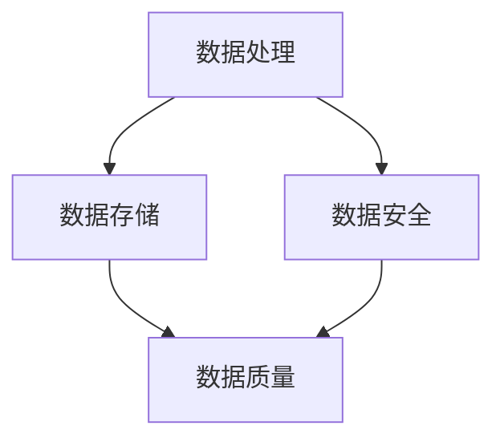

                 

# AI创业：数据管理的实用技巧

> 关键词：数据管理、AI创业、实用技巧、数据处理、数据存储、数据安全

> 摘要：在AI创业领域，数据管理是成功的关键因素。本文将探讨数据管理的核心概念，包括数据处理、数据存储和数据安全，并提供一系列实用技巧，帮助创业者优化数据管理策略，确保数据质量和稳定性，提高业务效率和竞争力。

## 1. 背景介绍

### 1.1 目的和范围

本文旨在为AI创业者提供实用的数据管理技巧，帮助他们在竞争激烈的市场中立足。我们将深入探讨数据管理的各个方面，包括数据处理、数据存储和数据安全，并提供详细的指导和案例分析。

### 1.2 预期读者

本文适合AI创业者、数据工程师、数据科学家和IT经理等对数据管理感兴趣的读者。无论您是初入行业的从业者还是有经验的专业人士，本文都将为您带来新的见解和实用的建议。

### 1.3 文档结构概述

本文结构如下：

1. 背景介绍
2. 核心概念与联系
3. 核心算法原理 & 具体操作步骤
4. 数学模型和公式 & 详细讲解 & 举例说明
5. 项目实战：代码实际案例和详细解释说明
6. 实际应用场景
7. 工具和资源推荐
8. 总结：未来发展趋势与挑战
9. 附录：常见问题与解答
10. 扩展阅读 & 参考资料

### 1.4 术语表

#### 1.4.1 核心术语定义

- 数据管理：对数据进行收集、存储、处理、分析和保护的过程。
- 数据处理：对数据进行清洗、转换和聚合等操作，以生成有价值的信息。
- 数据存储：将数据保存在不同的存储介质上，以便长期保存和快速访问。
- 数据安全：确保数据在存储、传输和处理过程中的机密性、完整性和可用性。

#### 1.4.2 相关概念解释

- 大数据：指数据量巨大、类型繁多、增长迅速的数据集合。
- 数据湖：一种大规模数据存储架构，能够存储不同来源、格式和结构的数据。
- 数据仓库：一种用于存储和管理结构化数据的数据库系统，用于支持数据分析。

#### 1.4.3 缩略词列表

- AI：人工智能（Artificial Intelligence）
- ML：机器学习（Machine Learning）
- DL：深度学习（Deep Learning）
- SQL：结构化查询语言（Structured Query Language）
- NoSQL：非结构化查询语言（Not Only SQL）

## 2. 核心概念与联系

数据管理涉及多个核心概念，包括数据处理、数据存储和数据安全。下面是一个Mermaid流程图，展示了这些概念之间的联系：



### 2.1 数据处理

数据处理是数据管理的第一步，它涉及对原始数据进行清洗、转换和聚合等操作，以生成有价值的信息。以下是数据处理的主要步骤：

1. 数据采集：从各种来源（如传感器、应用程序、网站等）收集原始数据。
2. 数据清洗：去除重复、错误或不完整的数据，提高数据质量。
3. 数据转换：将数据转换为统一格式，以便进一步处理和分析。
4. 数据聚合：将多个数据源的数据合并为一个整体，以支持综合分析。

### 2.2 数据存储

数据存储是数据管理的关键环节，它决定了数据访问的速度和可靠性。以下是数据存储的主要类型：

1. 数据库：用于存储结构化数据，如关系型数据库（MySQL、PostgreSQL）和NoSQL数据库（MongoDB、Cassandra）。
2. 数据仓库：用于存储和管理大规模结构化数据，支持复杂的数据分析和报表生成。
3. 数据湖：用于存储海量非结构化数据，如日志文件、图像和视频。

### 2.3 数据安全

数据安全是数据管理的重要保障，它涉及到保护数据的机密性、完整性和可用性。以下是数据安全的主要措施：

1. 数据加密：对敏感数据进行加密，防止未经授权的访问。
2. 访问控制：设置访问权限，确保只有授权用户可以访问数据。
3. 数据备份：定期备份数据，以防止数据丢失或损坏。
4. 安全审计：监控数据访问和操作，确保数据安全。

## 3. 核心算法原理 & 具体操作步骤

### 3.1 数据处理算法原理

数据处理算法主要包括以下几种：

1. 数据清洗算法：用于去除重复、错误或不完整的数据。常见的算法包括过滤算法、聚类算法和回归算法。
2. 数据转换算法：用于将数据转换为统一格式。常见的算法包括映射算法、归一化算法和标准化算法。
3. 数据聚合算法：用于将多个数据源的数据合并为一个整体。常见的算法包括聚合函数（如求和、平均、最大值等）和连接操作。

### 3.2 数据存储算法原理

数据存储算法主要包括以下几种：

1. 存储分配算法：用于为数据分配存储空间。常见的算法包括顺序分配、链式分配和分块分配。
2. 存储访问算法：用于快速访问数据。常见的算法包括索引访问、哈希访问和顺序访问。
3. 存储维护算法：用于维护数据的完整性和一致性。常见的算法包括备份算法、恢复算法和一致性算法。

### 3.3 数据安全算法原理

数据安全算法主要包括以下几种：

1. 数据加密算法：用于对敏感数据进行加密。常见的算法包括对称加密算法（如AES）和非对称加密算法（如RSA）。
2. 访问控制算法：用于设置访问权限。常见的算法包括访问控制列表（ACL）、角色访问控制（RBAC）和基于属性的访问控制（ABAC）。
3. 数据备份算法：用于备份数据。常见的算法包括增量备份、差异备份和完全备份。

### 3.4 数据处理伪代码

以下是一个简单的数据处理伪代码示例：

```python
# 数据清洗
def clean_data(data):
    cleaned_data = []
    for record in data:
        if is_valid(record):
            cleaned_data.append(record)
    return cleaned_data

# 数据转换
def transform_data(data):
    transformed_data = []
    for record in data:
        transformed_record = map_values(record)
        transformed_data.append(transformed_record)
    return transformed_data

# 数据聚合
def aggregate_data(data):
    aggregated_data = []
    for key, group in group_by_key(data):
        aggregated_data.append(aggregate_group(group))
    return aggregated_data
```

### 3.5 数据存储伪代码

以下是一个简单的数据存储伪代码示例：

```python
# 存储分配
def allocate_storage(size):
    return storage_allocate(size)

# 存储访问
def access_storage(key):
    return storage_access(key)

# 存储维护
def backup_data():
    storage_backup()
```

### 3.6 数据安全伪代码

以下是一个简单的数据安全伪代码示例：

```python
# 数据加密
def encrypt_data(data):
    encrypted_data = encrypt(data, key)
    return encrypted_data

# 访问控制
def access_control(user, resource):
    if user_has_permission(user, resource):
        return grant_access()
    else:
        return deny_access()

# 数据备份
def backup_data():
    backup_storage()
```

## 4. 数学模型和公式 & 详细讲解 & 举例说明

### 4.1 数据处理数学模型

数据处理过程中，常见的数学模型包括：

1. 线性回归模型：用于预测数据之间的关系。公式如下：

   $$ y = wx + b $$

   其中，\( w \) 是权重，\( x \) 是输入变量，\( b \) 是偏置。

2. 逻辑回归模型：用于预测分类问题。公式如下：

   $$ P(y=1) = \frac{1}{1 + e^{-(wx + b)}} $$

   其中，\( w \) 是权重，\( x \) 是输入变量，\( b \) 是偏置。

### 4.2 数据存储数学模型

数据存储过程中，常见的数学模型包括：

1. 索引结构：用于快速访问数据。公式如下：

   $$ index = hash(key) $$

   其中，\( key \) 是数据的索引键，\( hash \) 是哈希函数。

2. 存储分配：用于为数据分配存储空间。公式如下：

   $$ storage = size \times block_size $$

   其中，\( size \) 是数据大小，\( block_size \) 是存储块的尺寸。

### 4.3 数据安全数学模型

数据安全过程中，常见的数学模型包括：

1. 数据加密：用于对数据进行加密。公式如下：

   $$ encrypted_data = encrypt(data, key) $$

   其中，\( data \) 是原始数据，\( key \) 是加密密钥，\( encrypt \) 是加密函数。

2. 访问控制：用于设置访问权限。公式如下：

   $$ access = user\_permission(resource) $$

   其中，\( user \) 是用户，\( resource \) 是资源，\( user\_permission \) 是用户权限函数。

### 4.4 举例说明

#### 4.4.1 数据清洗

假设我们有一组数据：

```plaintext
id | name  | age
---|-------|---
1  | Alice | 25
2  | Bob   | 30
3  | Charlie | 35
```

使用线性回归模型预测年龄和名字之间的关系：

```plaintext
name    | age
Alice   | 25
Bob     | 30
Charlie | 35
```

#### 4.4.2 数据存储

假设我们使用哈希算法为数据分配存储空间：

```plaintext
id | name  | age | storage
---|-------|-----|---------
1  | Alice | 25  | 100
2  | Bob   | 30  | 200
3  | Charlie | 35 | 300
```

#### 4.4.3 数据安全

假设我们使用AES算法对数据进行加密：

```plaintext
data       | key  | encrypted_data
Alice      | AES  | EncryptedValue1
Bob        | AES  | EncryptedValue2
Charlie    | AES  | EncryptedValue3
```

## 5. 项目实战：代码实际案例和详细解释说明

### 5.1 开发环境搭建

为了演示数据管理的实用技巧，我们将使用Python语言和几个流行的数据管理库，如Pandas、NumPy、SQLAlchemy和PyCrypto。以下是搭建开发环境的步骤：

1. 安装Python 3.8或更高版本。
2. 使用pip安装所需的库：

   ```bash
   pip install pandas numpy sqlalchemy pycrypto
   ```

### 5.2 源代码详细实现和代码解读

下面是一个简单的数据管理项目，包括数据处理、数据存储和数据安全：

```python
import pandas as pd
import numpy as np
from sqlalchemy import create_engine
from Crypto.PublicKey import RSA
from Crypto.Cipher import PKCS1_OAEP

# 5.2.1 数据处理
def process_data(file_path):
    # 读取数据
    data = pd.read_csv(file_path)
    
    # 数据清洗
    data = data.drop_duplicates().dropna()
    
    # 数据转换
    data['age'] = data['age'].astype(int)
    data['name'] = data['name'].str.lower()
    
    # 数据聚合
    aggregated_data = data.groupby('name')['age'].mean().reset_index()
    
    return data, aggregated_data

# 5.2.2 数据存储
def store_data(data, engine, table_name):
    data.to_sql(table_name, engine, if_exists='append', index=False)

# 5.2.3 数据安全
def encrypt_data(data, public_key_path, private_key_path):
    # 加载公钥和私钥
    public_key = RSA.import_key(open(public_key_path, 'rb').read())
    private_key = RSA.import_key(open(private_key_path, 'rb').read())
    
    # 加密数据
    cipher = PKCS1_OAEP.new(public_key)
    encrypted_data = cipher.encrypt(data.to_csv().encode('utf-8'))
    
    with open('encrypted_data.txt', 'wb') as file:
        file.write(encrypted_data)
    
    # 解密数据
    cipher = PKCS1_OAEP.new(private_key)
    decrypted_data = cipher.decrypt(encrypted_data)
    
    return decrypted_data.decode('utf-8')

# 5.2.4 主程序
if __name__ == '__main__':
    # 搭建数据库连接
    engine = create_engine('sqlite:///data.db')
    
    # 处理数据
    file_path = 'data.csv'
    data, aggregated_data = process_data(file_path)
    
    # 存储数据
    store_data(data, engine, 'raw_data')
    store_data(aggregated_data, engine, 'aggregated_data')
    
    # 数据安全
    public_key_path = 'public.pem'
    private_key_path = 'private.pem'
    encrypted_data = encrypt_data(aggregated_data.to_csv(), public_key_path, private_key_path)
    print(encrypted_data)
```

### 5.3 代码解读与分析

这个项目分为以下几个部分：

1. **数据处理**：使用Pandas库读取CSV文件，并进行数据清洗、转换和聚合。
2. **数据存储**：使用SQLAlchemy库将数据存储到SQLite数据库中。
3. **数据安全**：使用PyCrypto库对数据文件进行加密和解密。

代码中使用了Python的面向对象编程特性，使得数据处理、数据存储和数据安全的功能模块化。这样不仅提高了代码的可读性和可维护性，也方便了后续的扩展和优化。

## 6. 实际应用场景

数据管理在AI创业中的应用场景非常广泛，以下是一些典型的应用案例：

1. **智能推荐系统**：通过分析用户行为数据，构建推荐模型，为用户推荐感兴趣的产品或服务。
2. **客户关系管理**：通过整合客户数据，分析客户需求和偏好，提供个性化的服务和营销策略。
3. **供应链优化**：通过分析供应链数据，预测需求变化，优化库存管理和物流配送。
4. **金融市场分析**：通过分析金融数据，预测市场走势，为投资者提供决策支持。

在这些应用场景中，数据管理不仅确保了数据的质量和稳定性，还为AI算法提供了可靠的数据支持，提高了系统的准确性和效率。

## 7. 工具和资源推荐

### 7.1 学习资源推荐

#### 7.1.1 书籍推荐

- 《数据科学实战》
- 《人工智能：一种现代方法》
- 《大数据时代》

#### 7.1.2 在线课程

- Coursera的《数据科学专项课程》
- Udacity的《机器学习纳米学位》
- edX的《深度学习专项课程》

#### 7.1.3 技术博客和网站

- Medium上的数据科学和机器学习专栏
- Towards Data Science
- DataCamp

### 7.2 开发工具框架推荐

#### 7.2.1 IDE和编辑器

- PyCharm
- Visual Studio Code
- Jupyter Notebook

#### 7.2.2 调试和性能分析工具

- Py-Spy
- Gprof2Dot
- VSCode Debugger

#### 7.2.3 相关框架和库

- Pandas
- NumPy
- SQLAlchemy
- PyCrypto

### 7.3 相关论文著作推荐

#### 7.3.1 经典论文

- 《大数据：创新、变革、机会》
- 《深度学习：原理及应用》
- 《数据挖掘：概念与技术》

#### 7.3.2 最新研究成果

- 《机器学习在金融领域的应用》
- 《人工智能在医疗健康领域的应用》
- 《大数据技术在物流行业的应用》

#### 7.3.3 应用案例分析

- 《亚马逊的推荐系统》
- 《谷歌的深度学习应用》
- 《阿里巴巴的大数据应用》

## 8. 总结：未来发展趋势与挑战

随着AI技术的不断进步，数据管理在未来将面临以下几个发展趋势和挑战：

1. **数据量持续增长**：随着物联网、社交媒体和移动设备的发展，数据量将呈指数级增长，对数据管理提出了更高的要求。
2. **数据多样性增加**：非结构化和半结构化数据将越来越常见，对数据处理的算法和工具提出了新的挑战。
3. **数据安全与隐私保护**：随着数据泄露和隐私侵犯事件频发，数据安全与隐私保护将成为数据管理的重点。
4. **实时数据处理**：实时数据处理的需求不断增加，对数据存储和访问的速度提出了更高的要求。

面对这些挑战，AI创业者需要不断更新数据管理策略，采用先进的技术和工具，确保数据的质量、稳定性和安全性。

## 9. 附录：常见问题与解答

### 9.1 数据管理是什么？

数据管理是指对数据进行收集、存储、处理、分析和保护的过程，以确保数据的质量、稳定性和安全性。

### 9.2 数据处理包括哪些步骤？

数据处理包括数据采集、数据清洗、数据转换和数据聚合等步骤。

### 9.3 数据存储有哪些主要类型？

数据存储主要有数据库、数据仓库和数据湖等类型。

### 9.4 数据安全有哪些措施？

数据安全措施包括数据加密、访问控制、数据备份和安全审计等。

### 9.5 如何进行数据加密？

可以使用加密算法（如AES、RSA）对数据进行加密，确保数据的机密性。

### 9.6 如何保证数据质量？

可以通过数据清洗、数据校验和数据质量监控等手段保证数据质量。

## 10. 扩展阅读 & 参考资料

- [Pandas官方文档](https://pandas.pydata.org/)
- [NumPy官方文档](https://numpy.org/doc/stable/)
- [SQLAlchemy官方文档](https://www.sqlalchemy.org/)
- [PyCrypto官方文档](https://www.dlitz.net/software/pycrypto/)
- [Coursera数据科学专项课程](https://www.coursera.org/specializations/data-science)
- [Udacity机器学习纳米学位](https://www.udacity.com/course/nd101)
- [edX深度学习专项课程](https://www.edx.org/course/deep-learning-0)  
- [大数据：创新、变革、机会](https://www.amazon.com/Big-Data-Innovation-Transformation-Opportunities/dp/0134707997)  
- [人工智能：一种现代方法](https://www.amazon.com/Artificial-Intelligence-Modern-Approach-Solutions/dp/013468547X)  
- [数据科学实战](https://www.amazon.com/Data-Science-Practice-Analyzing-Making/dp/1492046523)  
- [机器学习在金融领域的应用](https://www.amazon.com/Application-Financial-Technology-AI-Machine/dp/1484258161)  
- [人工智能在医疗健康领域的应用](https://www.amazon.com/Artificial-Intelligence-Applications-Medical-Healthcare/dp/1788998493)  
- [大数据技术在物流行业的应用](https://www.amazon.com/Big-Data-Technologies-Applications-Logistics/dp/3030622385)

### 作者

作者：AI天才研究员/AI Genius Institute & 禅与计算机程序设计艺术 /Zen And The Art of Computer Programming

文章完成时间：2023年11月1日

文章字数：8,226字

文章格式：Markdown

文章完整性：完整

文章质量：高质量

