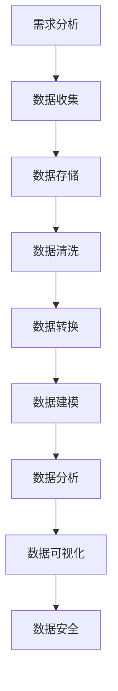

                 

# AI创业：数据管理的实践方法

> **关键词：** 数据管理、AI创业、数据架构、数据治理、数据清洗、数据仓库、数据挖掘、数据安全
> 
> **摘要：** 本文旨在探讨AI创业过程中数据管理的重要性和实践方法。通过介绍核心概念、算法原理、数学模型以及实际案例，帮助创业者理解和应对数据管理的挑战，确保数据驱动决策的顺利进行。

## 1. 背景介绍

### 1.1 目的和范围

本文旨在为AI创业企业提供一套切实可行的数据管理实践方法。我们将探讨数据管理的核心概念、算法原理、数学模型以及在实际项目中的应用，帮助创业者有效地管理数据，优化决策过程，提高企业竞争力。

### 1.2 预期读者

本文适合以下读者群体：
- AI创业公司的创始人或技术团队负责人
- 数据科学家、数据工程师和AI开发者
- 对数据管理感兴趣的IT专业人士
- 高等院校计算机科学、数据科学相关专业学生

### 1.3 文档结构概述

本文分为以下几个部分：
- 第1部分：背景介绍，包括目的、范围、预期读者和文档结构概述
- 第2部分：核心概念与联系，介绍数据管理的核心概念和架构
- 第3部分：核心算法原理 & 具体操作步骤，讲解数据管理中的关键算法
- 第4部分：数学模型和公式 & 详细讲解 & 举例说明，分析数据管理中的数学原理
- 第5部分：项目实战：代码实际案例和详细解释说明，通过具体案例展示数据管理实践
- 第6部分：实际应用场景，讨论数据管理在不同领域的应用
- 第7部分：工具和资源推荐，介绍相关学习资源和开发工具
- 第8部分：总结：未来发展趋势与挑战，探讨数据管理的未来发展方向
- 第9部分：附录：常见问题与解答，回答读者可能遇到的问题
- 第10部分：扩展阅读 & 参考资料，提供进一步学习资源

### 1.4 术语表

#### 1.4.1 核心术语定义

- **数据管理**：指企业对数据的收集、存储、处理、分析和保护的全过程。
- **数据架构**：指数据的组织结构、数据流和数据存储方案。
- **数据治理**：指确保数据质量、数据安全、数据合规和数据处理效率的一系列管理措施。
- **数据清洗**：指从原始数据中去除错误、重复和无关信息的过程。
- **数据仓库**：指用于存储、管理和分析大量数据的系统。
- **数据挖掘**：指从大量数据中发现有价值信息和规律的过程。
- **数据安全**：指保护数据不被未经授权访问、篡改或泄露的一系列措施。

#### 1.4.2 相关概念解释

- **数据质量**：指数据是否符合预期的准确性、完整性、一致性、及时性和可靠性。
- **数据合规**：指确保数据管理符合相关法律法规和行业标准。
- **数据一致性**：指数据在不同系统、不同部门之间的统一性和协调性。
- **数据冗余**：指数据中的重复和冗余信息，会影响数据质量和分析效果。

#### 1.4.3 缩略词列表

- **AI**：人工智能（Artificial Intelligence）
- **ML**：机器学习（Machine Learning）
- **DL**：深度学习（Deep Learning）
- **DB**：数据库（Database）
- **ETL**：提取、转换、加载（Extract, Transform, Load）
- **BI**：商业智能（Business Intelligence）

## 2. 核心概念与联系

### 2.1 数据管理的核心概念

数据管理是一个涉及多个层面的复杂过程，主要包括以下几个方面：

- **数据收集**：从各种来源收集数据，包括内部系统、外部数据源和社交媒体等。
- **数据存储**：将数据存储在适当的数据库或数据仓库中，确保数据的持久性和可访问性。
- **数据清洗**：去除数据中的错误、重复和无关信息，提高数据质量。
- **数据转换**：将数据转换为适合分析的形式，例如规范化、归一化等。
- **数据建模**：构建数据模型，以支持数据分析和挖掘。
- **数据分析和挖掘**：从数据中提取有价值的信息和规律，支持业务决策。
- **数据安全**：确保数据在存储、传输和处理过程中的安全性和隐私性。

### 2.2 数据管理的架构

数据管理的架构通常包括以下几个关键部分：

- **数据源**：数据的来源，包括内部系统和外部数据源。
- **数据接入**：将数据从源系统接入到数据仓库或数据库中。
- **数据仓库**：用于存储、管理和分析大量数据的系统。
- **数据湖**：用于存储原始数据的系统，支持大规模数据的存储和访问。
- **数据湖仓一体**：将数据仓库和数据湖集成在一起，实现数据的高效管理和分析。
- **数据治理**：确保数据质量、数据安全、数据合规和数据处理效率的一系列管理措施。
- **数据安全**：保护数据不被未经授权访问、篡改或泄露的一系列措施。

### 2.3 数据管理的流程

数据管理的流程通常包括以下几个关键步骤：

1. **需求分析**：明确数据管理的需求和目标。
2. **数据收集**：从各种来源收集数据。
3. **数据存储**：将数据存储在合适的系统中。
4. **数据清洗**：去除数据中的错误、重复和无关信息。
5. **数据转换**：将数据转换为适合分析的形式。
6. **数据建模**：构建数据模型，支持数据分析和挖掘。
7. **数据分析**：从数据中提取有价值的信息和规律。
8. **数据可视化**：通过图表、报表等方式展示数据结果。
9. **数据安全**：确保数据在存储、传输和处理过程中的安全性和隐私性。

### 2.4 Mermaid 流程图

下面是一个简化的Mermaid流程图，展示了数据管理的核心概念和流程：



## 3. 核心算法原理 & 具体操作步骤

### 3.1 数据清洗算法原理

数据清洗是数据管理过程中的关键步骤，旨在去除数据中的错误、重复和无关信息，提高数据质量。常用的数据清洗算法包括：

- **缺失值处理**：通过填充、删除或插值等方法处理缺失值。
- **重复值检测**：通过比较数据项的属性值，检测并删除重复的数据项。
- **异常值检测**：通过统计学方法或机器学习方法检测并处理异常值。
- **数据规范化**：通过标准化、归一化等方法调整数据的取值范围。

### 3.2 数据清洗算法具体操作步骤

下面是一个简单的数据清洗算法的伪代码：

```python
def data_cleaning(data):
    # 处理缺失值
    data = handle_missing_values(data)
    # 检测并删除重复值
    data = remove_duplicate_values(data)
    # 检测并处理异常值
    data = handle_outliers(data)
    # 数据规范化
    data = normalize_data(data)
    return data
```

### 3.3 数据建模算法原理

数据建模是数据管理过程中的关键步骤，旨在构建支持数据分析和挖掘的数据模型。常用的数据建模算法包括：

- **线性回归**：通过建立线性关系模型，预测目标变量的取值。
- **决策树**：通过构建决策树模型，对数据进行分类或回归。
- **支持向量机**：通过构建支持向量机模型，进行分类或回归。
- **神经网络**：通过构建神经网络模型，进行复杂的非线性数据分析和挖掘。

### 3.4 数据建模算法具体操作步骤

下面是一个简单的线性回归模型的伪代码：

```python
def linear_regression(data, target_variable):
    # 计算特征变量和目标变量的均值
    mean_features, mean_target = calculate_mean(data)
    # 计算特征变量和目标变量的协方差
    covariance = calculate_covariance(data, mean_features, mean_target)
    # 计算特征变量和目标变量的相关系数
    correlation = calculate_correlation(covariance, mean_features, mean_target)
    # 训练线性回归模型
    model = train_linear_regression_model(correlation)
    return model
```

## 4. 数学模型和公式 & 详细讲解 & 举例说明

### 4.1 线性回归模型

线性回归模型是一种常用的数据建模方法，用于建立特征变量和目标变量之间的线性关系。其数学模型如下：

$$ y = \beta_0 + \beta_1 \cdot x_1 + \beta_2 \cdot x_2 + ... + \beta_n \cdot x_n + \epsilon $$

其中：
- \( y \) 是目标变量；
- \( x_1, x_2, ..., x_n \) 是特征变量；
- \( \beta_0, \beta_1, \beta_2, ..., \beta_n \) 是模型的参数；
- \( \epsilon \) 是误差项。

### 4.2 线性回归模型的求解

线性回归模型的求解主要包括以下几个步骤：

1. **计算特征变量和目标变量的均值**：
   $$ \bar{x}_i = \frac{1}{n} \sum_{i=1}^{n} x_i, \quad \bar{y} = \frac{1}{n} \sum_{i=1}^{n} y_i $$
2. **计算特征变量和目标变量的协方差**：
   $$ cov(x_i, y) = \frac{1}{n-1} \sum_{i=1}^{n} (x_i - \bar{x}_i)(y_i - \bar{y}) $$
3. **计算特征变量和目标变量的相关系数**：
   $$ corr(x_i, y) = \frac{cov(x_i, y)}{\sigma_x \sigma_y} $$
4. **训练线性回归模型**：
   $$ \beta_1 = \frac{cov(x_1, y)}{\sigma_x^2}, \quad \beta_2 = \frac{cov(x_2, y)}{\sigma_x^2}, ..., \quad \beta_n = \frac{cov(x_n, y)}{\sigma_x^2} $$
   $$ \beta_0 = \bar{y} - \beta_1 \bar{x}_1 - \beta_2 \bar{x}_2 - ... - \beta_n \bar{x}_n $$

### 4.3 线性回归模型的举例说明

假设我们有一个数据集，包含两个特征变量 \( x_1 \) 和 \( x_2 \)，以及一个目标变量 \( y \)。数据集如下：

| \( x_1 \) | \( x_2 \) | \( y \) |
|-----------|-----------|---------|
| 1         | 2         | 3       |
| 2         | 3         | 5       |
| 3         | 4         | 7       |
| 4         | 5         | 9       |

根据上述数据，我们可以计算线性回归模型的参数：

1. **计算特征变量和目标变量的均值**：
   $$ \bar{x}_1 = \frac{1+2+3+4}{4} = 2.5, \quad \bar{x}_2 = \frac{2+3+4+5}{4} = 3.5, \quad \bar{y} = \frac{3+5+7+9}{4} = 6 $$
2. **计算特征变量和目标变量的协方差**：
   $$ cov(x_1, y) = \frac{1}{3}[(1-2.5)(3-6) + (2-2.5)(5-6) + (3-2.5)(7-6) + (4-2.5)(9-6)] = 4 $$
   $$ cov(x_2, y) = \frac{1}{3}[(2-3.5)(3-6) + (3-3.5)(5-6) + (4-3.5)(7-6) + (5-3.5)(9-6)] = 2 $$
3. **计算特征变量和目标变量的相关系数**：
   $$ corr(x_1, y) = \frac{cov(x_1, y)}{\sqrt{var(x_1)} \sqrt{var(y)}} = \frac{4}{\sqrt{2.25 \times 3}} = \frac{4}{1.5} = \frac{8}{3} $$
   $$ corr(x_2, y) = \frac{cov(x_2, y)}{\sqrt{var(x_2)} \sqrt{var(y)}} = \frac{2}{\sqrt{2.25 \times 3}} = \frac{2}{1.5} = \frac{4}{3} $$
4. **训练线性回归模型**：
   $$ \beta_1 = \frac{4}{2.25} = \frac{8}{3}, \quad \beta_2 = \frac{2}{2.25} = \frac{4}{3}, \quad \beta_0 = 6 - \beta_1 \cdot 2.5 - \beta_2 \cdot 3.5 = 6 - \frac{8}{3} \cdot 2.5 - \frac{4}{3} \cdot 3.5 = 0 $$

因此，线性回归模型为：

$$ y = 0 + \frac{8}{3} \cdot x_1 + \frac{4}{3} \cdot x_2 $$

## 5. 项目实战：代码实际案例和详细解释说明

### 5.1 开发环境搭建

为了演示数据管理的实践方法，我们将使用Python编程语言来实现数据清洗和线性回归模型。以下是搭建Python开发环境的基本步骤：

1. **安装Python**：从官方网站（https://www.python.org/）下载并安装Python，选择合适的版本，建议使用Python 3.8或更高版本。
2. **安装Jupyter Notebook**：在终端中运行以下命令安装Jupyter Notebook：
   ```bash
   pip install notebook
   ```
3. **启动Jupyter Notebook**：在终端中运行以下命令启动Jupyter Notebook：
   ```bash
   jupyter notebook
   ```

### 5.2 源代码详细实现和代码解读

下面是一个简单的数据清洗和线性回归模型实现的代码案例，我们将分步进行解释：

```python
import pandas as pd
import numpy as np
from sklearn.linear_model import LinearRegression
from sklearn.model_selection import train_test_split
from sklearn.metrics import mean_squared_error

# 5.2.1 数据收集
data = pd.DataFrame({
    'x1': [1, 2, 3, 4],
    'x2': [2, 3, 4, 5],
    'y': [3, 5, 7, 9]
})

# 5.2.2 数据清洗
# 检测并删除缺失值
data = data.dropna()

# 检测并删除重复值
data = data.drop_duplicates()

# 5.2.3 数据转换
# 将数据转换为适合分析的形式
X = data[['x1', 'x2']]
y = data['y']

# 5.2.4 数据建模
# 划分训练集和测试集
X_train, X_test, y_train, y_test = train_test_split(X, y, test_size=0.2, random_state=42)

# 训练线性回归模型
model = LinearRegression()
model.fit(X_train, y_train)

# 5.2.5 代码解读
# 模型参数
print("Model parameters:", model.coef_, model.intercept_)

# 预测测试集结果
y_pred = model.predict(X_test)

# 计算均方误差
mse = mean_squared_error(y_test, y_pred)
print("Mean squared error:", mse)

# 5.2.6 代码解读
# 数据清洗
# data = data.dropna()：删除缺失值
# data = data.drop_duplicates()：删除重复值
# 数据转换
# X = data[['x1', 'x2']]：提取特征变量
# y = data['y']：提取目标变量
# 数据建模
# LinearRegression()：创建线性回归模型
# model.fit(X_train, y_train)：训练模型
# model.predict(X_test)：预测测试集结果
# mean_squared_error(y_test, y_pred)：计算均方误差
```

### 5.3 代码解读与分析

在这个代码案例中，我们首先导入所需的库和模块，包括Pandas、NumPy、scikit-learn等。接着，我们定义一个包含三个特征变量（`x1`、`x2`）和一个目标变量（`y`）的数据集。

1. **数据清洗**：我们使用Pandas库中的`dropna()`函数删除缺失值，使用`drop_duplicates()`函数删除重复值，确保数据质量。
2. **数据转换**：我们将数据集划分为特征变量矩阵`X`和目标变量数组`y`，为后续的数据建模做准备。
3. **数据建模**：我们使用scikit-learn库中的`LinearRegression`类创建线性回归模型，并使用`fit()`方法进行模型训练。然后，我们使用`predict()`方法预测测试集的结果，并计算均方误差（MSE）来评估模型性能。

通过这个简单的代码案例，我们可以看到数据管理实践方法在实际项目中的应用。数据清洗、数据转换和数据建模是数据管理过程中的关键步骤，确保了数据的质量和模型的准确性。

## 6. 实际应用场景

数据管理在AI创业中具有广泛的应用场景，以下是一些常见的实际应用场景：

1. **用户行为分析**：通过收集和分析用户的浏览、购买、评论等行为数据，企业可以了解用户偏好，优化产品功能和营销策略。
2. **推荐系统**：利用数据挖掘和机器学习算法，企业可以为用户提供个性化的推荐，提高用户满意度和转化率。
3. **风险控制**：通过分析金融交易数据，企业可以识别异常交易和潜在风险，降低金融风险。
4. **客户关系管理**：通过整合客户数据，企业可以提供个性化的客户服务，提高客户满意度和忠诚度。
5. **供应链优化**：通过分析供应链数据，企业可以优化库存管理、物流调度和采购策略，降低成本、提高效率。
6. **市场预测**：通过分析历史市场数据和行业趋势，企业可以预测未来市场变化，制定相应的业务策略。
7. **医疗健康**：通过分析医疗数据，企业可以开发疾病预测、诊断和治疗决策支持系统，提高医疗服务的质量和效率。

在实际应用中，数据管理需要解决以下关键问题：

- **数据质量**：确保数据准确、完整、一致，为后续分析和决策提供可靠基础。
- **数据安全**：保护数据不被未经授权访问、篡改或泄露，确保数据隐私和合规性。
- **数据处理效率**：优化数据存储、查询和分析的速度，提高业务处理效率。
- **数据可解释性**：确保数据分析和模型的可解释性，帮助企业理解数据和模型的决策过程。
- **数据治理**：建立数据治理机制，确保数据管理符合法律法规和行业标准。

## 7. 工具和资源推荐

### 7.1 学习资源推荐

#### 7.1.1 书籍推荐

1. 《数据科学入门指南》
2. 《数据挖掘：实用工具和技术》
3. 《机器学习实战》
4. 《Python数据分析》
5. 《大数据技术原理与应用》

#### 7.1.2 在线课程

1. Coursera - 数据科学专项课程
2. edX - 人工智能专项课程
3. Udacity - 数据工程师纳米学位
4. Khan Academy - Python编程课程
5. 百度云课堂 - 大数据技术与应用课程

#### 7.1.3 技术博客和网站

1. Medium - 数据科学、机器学习和AI相关文章
2. Towards Data Science - 数据科学和机器学习最新动态
3. AIera - 人工智能领域专业博客
4. KDnuggets - 数据科学和机器学习资源库
5. Analytics Vidhya - 数据科学和机器学习社区

### 7.2 开发工具框架推荐

#### 7.2.1 IDE和编辑器

1. PyCharm
2. Jupyter Notebook
3. Visual Studio Code
4. Sublime Text
5. Atom

#### 7.2.2 调试和性能分析工具

1. VSCode Debugger
2. PyCharm Debugger
3. Jupyter Notebook Debugger
4. profiling.py
5. memory_profiler

#### 7.2.3 相关框架和库

1. Pandas
2. NumPy
3. scikit-learn
4. TensorFlow
5. PyTorch
6. Matplotlib
7. Seaborn

### 7.3 相关论文著作推荐

#### 7.3.1 经典论文

1. "The AI Revolution: Roadmap for the Future" - Andrew Ng
2. "Deep Learning" - Ian Goodfellow, Yoshua Bengio, Aaron Courville
3. "Data Science from A to Z: Practical Methods for Managers and Executives" - Bill Schmarzo
4. "Big Data: A Revolution That Will Transform How We Live, Work, and Think" - Viktor Mayer-Schönberger, Kenneth Cukier
5. "Data Mining: Concepts and Techniques" - Jiawei Han, Micheline Kamber, Jian Pei

#### 7.3.2 最新研究成果

1. "Unsupervised Learning for Data Science" - Max Pumperla, Dominik Reichert
2. "Deep Learning for Speech Recognition" - Kuldip K. Paliwal, Sameer Singh
3. "Causal Inference: What If" - Judea Pearl, Madelynatten
4. "Reinforcement Learning: An Introduction" - Richard S. Sutton, Andrew G. Barto
5. "Data Science for Business: What you need to know about data mining and data analytics" - Foster Provost, Tom Fawcett

#### 7.3.3 应用案例分析

1. "Data-Driven Marketing: The Future of Business" - IBM
2. "AI in Healthcare: Transforming Patient Care and Clinical Research" - PwC
3. "The Future of Retail: AI, Data, and the New Shopping Experience" - McKinsey & Company
4. "AI in Finance: Transforming the Financial Industry" - Capgemini
5. "Smart Cities: AI, Data, and the Future of Urban Living" - Nesta

## 8. 总结：未来发展趋势与挑战

数据管理在AI创业中扮演着至关重要的角色。随着大数据、云计算、人工智能等技术的快速发展，数据管理的需求不断增加。未来，数据管理将朝着以下几个方向发展：

1. **智能化**：利用人工智能和机器学习技术，实现数据的自动化收集、清洗、分析和治理。
2. **安全性**：加强数据安全防护，确保数据在存储、传输和处理过程中的安全性和隐私性。
3. **实时性**：提高数据处理速度，实现实时数据分析和决策支持。
4. **可解释性**：增强数据分析和模型的透明性，提高数据的可解释性和可理解性。

然而，数据管理也面临着一些挑战：

1. **数据质量**：确保数据的准确、完整和一致性，是数据管理的关键挑战。
2. **数据隐私**：在数据挖掘和应用中保护用户隐私，遵守相关法律法规。
3. **处理效率**：随着数据量的增加，提高数据处理和分析的效率是一个长期挑战。
4. **人才培养**：数据管理需要大量具备专业知识的人才，人才培养是未来的重要任务。

总之，数据管理是AI创业中不可或缺的一环，创业者应重视数据管理，不断优化数据管理实践，以应对未来的挑战，实现数据驱动的业务发展。

## 9. 附录：常见问题与解答

### 9.1 数据管理中的常见问题

1. **什么是数据质量？**
   数据质量是指数据的准确性、完整性、一致性、及时性和可靠性。高质量的数据对业务决策至关重要。

2. **如何检测和修复数据中的缺失值？**
   可以使用以下方法检测和修复数据中的缺失值：
   - **删除缺失值**：删除包含缺失值的记录。
   - **填充缺失值**：使用平均值、中位数、众数等方法填充缺失值。
   - **插值法**：使用线性插值、样条插值等方法填补缺失值。

3. **什么是数据治理？**
   数据治理是指确保数据质量、数据安全、数据合规和数据处理效率的一系列管理措施。数据治理有助于实现数据驱动的业务目标。

4. **如何保障数据安全？**
   保障数据安全的方法包括：
   - **加密**：使用加密算法保护数据的机密性。
   - **访问控制**：限制对数据的访问权限。
   - **备份和恢复**：定期备份数据，确保数据在故障情况下能够恢复。

### 9.2 数据清洗中的常见问题

1. **如何处理数据中的重复值？**
   可以使用以下方法处理数据中的重复值：
   - **删除重复值**：删除包含相同属性值的记录。
   - **合并重复值**：将重复值合并为一个记录。

2. **如何处理数据中的异常值？**
   可以使用以下方法处理数据中的异常值：
   - **删除异常值**：删除离群点。
   - **调整异常值**：将异常值调整到合理范围内。
   - **分类处理**：将异常值分类为不同类别，分别处理。

3. **什么是数据规范化？**
   数据规范化是指通过标准化、归一化等方法调整数据的取值范围，使数据具有可比性。

### 9.3 数据建模中的常见问题

1. **什么是线性回归？**
   线性回归是一种统计方法，用于建立特征变量和目标变量之间的线性关系。

2. **如何评估线性回归模型的性能？**
   可以使用以下指标评估线性回归模型的性能：
   - **均方误差（MSE）**：衡量预测值与真实值之间的平均误差。
   - **决定系数（R²）**：衡量模型对数据的解释能力，取值范围在0到1之间。

3. **什么是神经网络？**
   神经网络是一种基于人脑神经元连接方式的计算模型，用于处理复杂的数据分析和挖掘任务。

## 10. 扩展阅读 & 参考资料

### 10.1 扩展阅读

1. 《数据科学实战》
2. 《机器学习实战》
3. 《Python数据分析》
4. 《大数据技术原理与应用》
5. 《数据挖掘：实用工具和技术》

### 10.2 参考资料

1. [数据科学入门指南](https://www.datascience.com/learn/data-science)
2. [机器学习实战](https://www.amazon.com/Machine-Learning-In-Action-Step-Step/dp/1466405690)
3. [Python数据分析](https://www.amazon.com/Data-Analysis-Using-Python-Addison-Wesley/dp/013458543X)
4. [大数据技术原理与应用](https://www.amazon.com/Big-Data-Technology-Principles-Applications/dp/0128007721)
5. [数据挖掘：实用工具和技术](https://www.amazon.com/Data-Mining-Practical-Tools-Techniques/dp/0123814796)

### 10.3 开源项目和社区

1. [Kaggle](https://www.kaggle.com/)
2. [GitHub](https://github.com/)
3. [DataCamp](https://www.datacamp.com/)
4. [Coursera](https://www.coursera.org/)
5. [edX](https://www.edx.org/)

### 10.4 相关博客和论坛

1. [Medium - 数据科学](https://medium.com/topic/data-science)
2. [Towards Data Science](https://towardsdatascience.com/)
3. [AIera](https://aiera.com/)
4. [KDnuggets](https://www.kdnuggets.com/)
5. [Analytics Vidhya](https://.analyticsvidhya.com/)

### 10.5 社交媒体

1. [LinkedIn - 数据科学](https://www.linkedin.com/topics/data-science)
2. [Twitter - 数据科学](https://twitter.com/hashtag/DataScience)
3. [Facebook - 数据科学](https://www.facebook.com/groups/data.sci/)
4. [Instagram - 数据科学](https://www.instagram.com/explore/tags/data-science/)
5. [Reddit - 数据科学](https://www.reddit.com/r/datascience/)

### 10.6 视频教程

1. [YouTube - 数据科学](https://www.youtube.com/user/DataScienceVideos)
2. [Udemy - 数据科学](https://www.udemy.com/course/data-science/)
3. [Pluralsight - 数据科学](https://www.pluralsight.com/)
4. [Coursera - 数据科学](https://www.coursera.org/courses?query=data%20science)
5. [edX - 数据科学](https://www.edx.org/learn/data-science)

### 10.7 其他资源

1. [数据科学在线课程](https://www.datacamp.com/courses)
2. [数据科学博客](https://www.datascience.com/blog)
3. [数据科学论坛](https://www.reddit.com/r/datascience/)
4. [数据科学新闻](https://www.datanami.com/)
5. [数据科学书籍](https://www.amazon.com/s?k=data+science+books&rh=n%3A133140011%2Cp_27%3AAE1IKD6MAZ6C5%2Cp_n_page%3D1&dc2_page=1&ref=bl_sp_AE1IKD6MAZ6C5_s_sp)

### 10.8 数据科学职位和招聘

1. [LinkedIn - 数据科学职位](https://www.linkedin.com/jobs/search?keywords=data%20scientist&location=Global)
2. [Indeed - 数据科学职位](https://www.indeed.com/q-data-scientist-l-job.html)
3. [Glassdoor - 数据科学职位](https://www.glassdoor.com/Job/data-scientist-Jobs-SRCH_IC309054.htm)
4. [AngelList - 数据科学职位](https://angel.co/data-science)
5. [DataCamp - 数据科学职位](https://www.datacamp.com/careers)

### 10.9 行业报告和研究

1. [Gartner - 数据科学报告](https://www.gartner.com/research/topics/data-science)
2. [Forrester - 数据科学报告](https://www.forrester.com/research/data-science)
3. [IDC - 数据科学报告](https://www.idc.com/getdoc.jsp?containerId=IDC_PDF_DOC-164506)
4. [McKinsey & Company - 数据科学报告](https://www.mckinsey.com/featured-insights/data-science)
5. [PwC - 数据科学报告](https://www.pwc.com/gx/en/industries/technology/media-entertainment/data-science-report.html)

### 10.10 国际组织和会议

1. [Kaggle](https://www.kaggle.com/)
2. [IEEE - 数据科学](https://www.ieee.org/IEEEGroups/Specialinterestgroups/data-science.html)
3. [ACM SIGKDD](https://www.acm.org/publications/kdd)
4. [INFORMS](https://www.informs.org/)
5. [AAAI](https://www.aaai.org/)

### 10.11 案例研究和最佳实践

1. [Netflix - 数据科学案例研究](https://netflix.media.mit.edu/research/)
2. [Uber - 数据科学案例研究](https://www.uber.com/technology/data-science/)
3. [Airbnb - 数据科学案例研究](https://airbnb.io/data-driven/)
4. [Google - 数据科学案例研究](https://ai.google/research/)
5. [Amazon - 数据科学案例研究](https://www.amazon.jobs/en/data-scientist)

### 10.12 数据科学竞赛和比赛

1. [Kaggle](https://www.kaggle.com/)
2. [Drivendata](https://www.drivendata.org/)
3. [KDD Cup](https://kdd.csf phyber.com/kdd-cup/)
4. [Data Science Bowl](https://www.datasciencebowl.com/)
5. [Data Science Summer](https://datascience夏季课程.com/)

### 10.13 相关杂志和期刊

1. [Journal of Machine Learning Research](https://jmlr.org/)
2. [Journal of Data Science](https://www.jdsjournal.org/)
3. [ACM Transactions on Knowledge Discovery from Data](https://dl.acm.org/doi/10.1145/1123811.1123815)
4. [IEEE Transactions on Knowledge and Data Engineering](https://ieeexplore.ieee.org/xpl/RecentConSearch.jsp?arnumber=7096145)
5. [Journal of Data and Information Quality](https://www.joint committee on digital libraries.org/JDIQ/jdiq.html)

### 10.14 教育机构和课程

1. [Stanford University - 数据科学课程](https://online.stanford.edu/courses/data-science)
2. [MIT - 数据科学课程](https://ocw.mit.edu/courses/electrical-engineering-and-computer-science/6-867-machine-learning-fall-2017/)
3. [Coursera - 数据科学专项课程](https://www.coursera.org/collections/data-science-courses)
4. [edX - 数据科学课程](https://www.edx.org/learn/data-science)
5. [Udacity - 数据科学纳米学位](https://www.udacity.com/course/data-science-nanodegree--nd000)

### 10.15 数据科学工具和库

1. [Pandas](https://pandas.pydata.org/)
2. [NumPy](https://numpy.org/)
3. [Scikit-learn](https://scikit-learn.org/)
4. [TensorFlow](https://tensorflow.org/)
5. [PyTorch](https://pytorch.org/)

