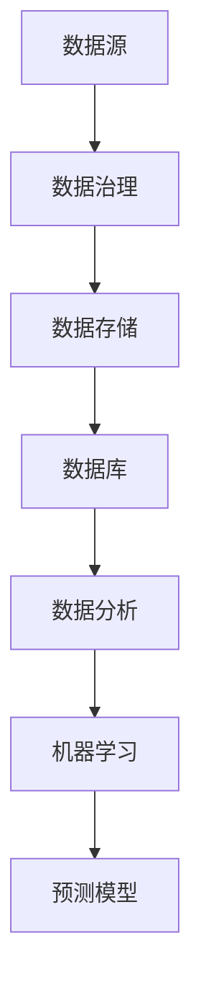

                 

# AI创业：数据管理的策略与实施分析

> 关键词：AI创业、数据管理、策略、实施分析、数据治理、数据分析、机器学习

> 摘要：本文旨在为初创企业探讨如何在激烈的市场竞争中建立有效的数据管理策略，通过详细分析数据管理的核心概念、算法原理、数学模型及实际应用案例，帮助创业者理解数据管理在AI项目中的关键作用，并提供实用的工具和资源推荐，以应对未来的挑战。

## 1. 背景介绍

### 1.1 目的和范围

在人工智能（AI）飞速发展的时代，数据管理已成为初创企业成功的关键因素。本文旨在为AI创业公司提供一套数据管理的策略与实践指南，帮助企业在数据密集型应用中保持竞争力。本文将涵盖以下几个主要方面：

- 数据管理的核心概念与联系
- 核心算法原理与具体操作步骤
- 数学模型和公式的详细讲解与举例
- 项目实战：代码实际案例和详细解释说明
- 实际应用场景分析
- 工具和资源推荐

### 1.2 预期读者

本文主要面向AI初创企业的技术团队、数据科学家、产品经理和CTO等决策层。预期读者具备一定的编程和数据分析基础，希望深入了解数据管理在AI项目中的具体应用。

### 1.3 文档结构概述

本文结构紧凑，分为以下十个部分：

- 引言：背景介绍与摘要
- 1. 数据管理的核心概念与联系
- 2. 核心算法原理与具体操作步骤
- 3. 数学模型和公式的详细讲解与举例
- 4. 项目实战：代码实际案例和详细解释说明
- 5. 实际应用场景分析
- 6. 工具和资源推荐
- 7. 总结：未来发展趋势与挑战
- 8. 附录：常见问题与解答
- 9. 扩展阅读 & 参考资料

### 1.4 术语表

#### 1.4.1 核心术语定义

- 数据治理：确保数据质量、安全和合规性的过程。
- 数据分析：通过数据挖掘、统计分析等方法，从数据中提取有价值的信息。
- 数据库：存储、管理和访问数据的系统。
- 机器学习：利用数据训练模型，使其能够进行预测或分类等任务。

#### 1.4.2 相关概念解释

- 数据质量：数据准确性、完整性、一致性和时效性的综合体现。
- 数据治理策略：一套指导数据管理的原则和规程。
- 数据存储：将数据保存在持久存储设备中的过程。

#### 1.4.3 缩略词列表

- AI：人工智能
- ML：机器学习
- SQL：结构化查询语言
- NoSQL：非关系型数据库

## 2. 核心概念与联系

在探讨数据管理之前，我们需要理解几个核心概念及其相互关系。以下是一个简单的Mermaid流程图，用于展示这些概念：



### 2.1 数据治理

数据治理是一个多维度的过程，涉及数据的创建、管理、使用和保护。它的主要目标包括：

- 确保数据质量：通过数据清洗、去重和标准化等手段，提高数据的准确性和一致性。
- 数据安全与合规性：确保数据在使用过程中遵守相关法律法规，如《通用数据保护条例》（GDPR）。
- 数据使用与权限管理：明确不同用户对数据的访问权限和使用规则。

### 2.2 数据存储

数据存储是数据管理的第一步，涉及将数据保存到硬盘、云存储或其他介质。常见的数据存储技术包括：

- 硬盘存储：传统的本地存储方式，适用于小规模数据。
- 云存储：利用云计算资源进行数据存储，适用于大规模、分布式数据。

### 2.3 数据库

数据库是数据存储的核心，用于管理和访问数据。根据数据模型的不同，数据库可以分为关系型数据库和非关系型数据库：

- 关系型数据库（如MySQL、PostgreSQL）：使用SQL语言进行数据查询，适用于结构化数据。
- 非关系型数据库（如MongoDB、Cassandra）：使用NoSQL查询语言，适用于非结构化或半结构化数据。

### 2.4 数据分析

数据分析是从大量数据中提取有价值信息的过程，包括数据挖掘、统计分析、机器学习等。它有助于企业了解用户行为、市场趋势和业务需求，从而做出更明智的决策。

### 2.5 机器学习

机器学习是人工智能的核心技术之一，通过训练模型，使其能够从数据中学习并做出预测或分类。机器学习在数据管理中的应用包括：

- 数据预处理：对原始数据进行清洗、归一化等处理，提高数据质量。
- 预测分析：利用历史数据预测未来趋势，如股票价格、销售量等。
- 分类分析：将数据分为不同的类别，如文本分类、图像分类等。

## 3. 核心算法原理 & 具体操作步骤

在数据管理中，核心算法原理起着至关重要的作用。以下是一些常见的数据管理算法及其伪代码：

### 3.1 数据清洗算法

```python
def dataCleaning(dataSet):
    # 数据清洗步骤
    # 1. 数据去重
    dataSet = removeDuplicates(dataSet)
    # 2. 数据归一化
    dataSet = normalizeData(dataSet)
    # 3. 数据填充
    dataSet = fillMissingValues(dataSet)
    return dataSet
```

### 3.2 数据挖掘算法

```python
def dataMining(dataSet):
    # 数据挖掘步骤
    # 1. 数据预处理
    preprocessedData = preprocessData(dataSet)
    # 2. 特征选择
    selectedFeatures = featureSelection(preprocessedData)
    # 3. 模型训练
    model = trainModel(selectedFeatures)
    # 4. 预测分析
    predictions = predict(model, newDataSet)
    return predictions
```

### 3.3 机器学习算法

```python
def machineLearning(trainingData, testData):
    # 1. 数据预处理
    preprocessedTrainingData = preprocessData(trainingData)
    preprocessedTestData = preprocessData(testData)
    # 2. 模型训练
    model = trainModel(preprocessedTrainingData)
    # 3. 模型评估
    evaluationResults = evaluateModel(model, preprocessedTestData)
    return evaluationResults
```

## 4. 数学模型和公式 & 详细讲解 & 举例说明

在数据管理中，数学模型和公式用于描述数据之间的关系和特征。以下是一些常见的数学模型和公式：

### 4.1 回归分析

回归分析用于预测一个变量（因变量）与一个或多个自变量之间的关系。线性回归是最基本的回归模型，其公式如下：

$$
y = \beta_0 + \beta_1 \cdot x_1 + \beta_2 \cdot x_2 + \ldots + \beta_n \cdot x_n
$$

其中，$y$ 是因变量，$x_1, x_2, \ldots, x_n$ 是自变量，$\beta_0, \beta_1, \beta_2, \ldots, \beta_n$ 是回归系数。

举例说明：

假设我们要预测一家公司的销售额（$y$）与其广告支出（$x_1$）和促销活动次数（$x_2$）之间的关系。根据历史数据，我们得到以下线性回归模型：

$$
\begin{aligned}
y &= \beta_0 + \beta_1 \cdot x_1 + \beta_2 \cdot x_2 \\
y &= 10 + 2 \cdot x_1 + 1 \cdot x_2
\end{aligned}
$$

如果公司在下一个月计划投入500美元的广告支出和3次促销活动，那么预测的销售额为：

$$
y = 10 + 2 \cdot 500 + 1 \cdot 3 = 1013
$$

### 4.2 聚类分析

聚类分析是一种无监督学习方法，用于将数据集划分为多个集群。最常见的聚类算法是K-means算法，其目标是最小化簇内距离和，公式如下：

$$
\begin{aligned}
J &= \sum_{i=1}^{k} \sum_{x_j \in S_i} ||x_j - \mu_i||^2 \\
\mu_i &= \frac{1}{|S_i|} \sum_{x_j \in S_i} x_j
\end{aligned}
$$

其中，$J$ 是簇内距离和，$k$ 是聚类个数，$S_i$ 是第 $i$ 个簇，$\mu_i$ 是簇中心。

举例说明：

假设我们有一组客户数据，根据他们的购买行为和消费习惯将其划分为3个集群。使用K-means算法，我们得到以下聚类结果：

$$
\begin{aligned}
J &= \sum_{i=1}^{3} \sum_{x_j \in S_i} ||x_j - \mu_i||^2 \\
&= (||x_1 - \mu_1||^2 + ||x_2 - \mu_2||^2 + ||x_3 - \mu_3||^2)
\end{aligned}
$$

其中，$\mu_1, \mu_2, \mu_3$ 分别是3个簇的中心。

## 5. 项目实战：代码实际案例和详细解释说明

在本节中，我们将通过一个实际项目案例，展示如何使用Python和常见的数据管理库（如Pandas、NumPy、Scikit-learn）来处理数据、训练模型和进行预测分析。

### 5.1 开发环境搭建

首先，我们需要搭建一个Python开发环境。可以使用Anaconda来安装Python及相关库，具体步骤如下：

1. 访问Anaconda官方网站（https://www.anaconda.com/products/individual）并下载适用于您的操作系统的Anaconda安装包。
2. 运行安装程序，按照默认选项安装。
3. 打开命令行工具（如Windows的PowerShell或Linux的Terminal），输入以下命令以创建一个新的虚拟环境：

   ```bash
   conda create -n data_management_env python=3.8
   conda activate data_management_env
   ```

4. 安装所需的库：

   ```bash
   conda install numpy pandas scikit-learn matplotlib
   ```

### 5.2 源代码详细实现和代码解读

以下是一个简单的数据管理项目示例，该示例使用Scikit-learn库对鸢尾花数据集进行数据预处理、模型训练和预测分析。

```python
import numpy as np
import pandas as pd
from sklearn import datasets
from sklearn.model_selection import train_test_split
from sklearn.preprocessing import StandardScaler
from sklearn.linear_model import LogisticRegression
from sklearn.metrics import accuracy_score, classification_report

# 加载数据集
iris = datasets.load_iris()
X = iris.data
y = iris.target

# 数据预处理
# 1. 数据标准化
scaler = StandardScaler()
X_scaled = scaler.fit_transform(X)

# 2. 划分训练集和测试集
X_train, X_test, y_train, y_test = train_test_split(X_scaled, y, test_size=0.2, random_state=42)

# 模型训练
# 1. 创建逻辑回归模型
model = LogisticRegression()

# 2. 训练模型
model.fit(X_train, y_train)

# 预测分析
# 1. 对测试集进行预测
y_pred = model.predict(X_test)

# 2. 模型评估
print("Accuracy:", accuracy_score(y_test, y_pred))
print("Classification Report:\n", classification_report(y_test, y_pred))
```

### 5.3 代码解读与分析

1. **数据加载**：使用Scikit-learn内置的鸢尾花数据集，这是一个经典的多元数据集，包含150个样本和4个特征。
2. **数据预处理**：
   - **数据标准化**：使用StandardScaler对数据进行标准化，将特征缩放到相同的尺度，以提高模型训练效果。
   - **划分训练集和测试集**：使用train_test_split函数将数据集划分为训练集和测试集，其中测试集占比20%。
3. **模型训练**：
   - **创建逻辑回归模型**：使用LogisticRegression创建一个逻辑回归模型。
   - **训练模型**：使用fit函数对模型进行训练，输入训练集数据。
4. **预测分析**：
   - **对测试集进行预测**：使用predict函数对测试集进行预测，得到预测结果。
   - **模型评估**：使用accuracy_score和classification_report函数评估模型在测试集上的表现，输出准确率和分类报告。

## 6. 实际应用场景

数据管理在AI创业项目中具有广泛的应用场景，以下是一些常见的应用领域：

- **客户行为分析**：通过分析客户购买历史、浏览记录等数据，帮助企业了解客户需求，优化营销策略。
- **智能推荐系统**：基于用户行为和偏好数据，实现个性化推荐，提高用户满意度和转化率。
- **金融风控**：通过分析历史交易数据，识别异常行为，预防金融风险。
- **医疗诊断**：利用医疗数据进行分析，辅助医生进行疾病诊断和治疗。

### 6.1 案例分析

以客户行为分析为例，某电商企业希望通过数据管理提高客户满意度。具体步骤如下：

1. **数据收集**：收集客户购买记录、浏览记录、评价等数据。
2. **数据预处理**：清洗数据，去除重复和缺失值，对数据进行标准化处理。
3. **特征工程**：提取有用的特征，如客户购买频率、平均订单金额等。
4. **模型训练**：使用机器学习算法，如决策树、随机森林等，训练预测模型。
5. **预测分析**：对客户行为进行预测，如预测客户流失率、购买潜力等。
6. **策略优化**：根据预测结果，调整营销策略，提高客户满意度和转化率。

## 7. 工具和资源推荐

为了帮助AI创业者更好地进行数据管理，以下推荐一些实用的工具和资源：

### 7.1 学习资源推荐

- **书籍推荐**：
  - 《数据科学入门》
  - 《机器学习实战》
  - 《Python数据分析》

- **在线课程**：
  - Coursera的《数据科学专项课程》
  - Udacity的《机器学习纳米学位》

- **技术博客和网站**：
  - Medium上的数据科学博客
  - towardsdatascience.com

### 7.2 开发工具框架推荐

- **IDE和编辑器**：
  - Visual Studio Code
  - PyCharm

- **调试和性能分析工具**：
  - Pythontutor
  - Jupyter Notebook

- **相关框架和库**：
  - Scikit-learn
  - TensorFlow
  - PyTorch

### 7.3 相关论文著作推荐

- **经典论文**：
  - 《Learning to Represent Text with Recurrent Neural Networks》
  - 《Deep Learning for Text Classification》

- **最新研究成果**：
  - arXiv上的最新论文
  - NeurIPS、ICML等顶级会议的最新论文

- **应用案例分析**：
  - 《机器学习在金融领域的应用》
  - 《人工智能在医疗领域的应用》

## 8. 总结：未来发展趋势与挑战

随着AI技术的不断进步，数据管理在AI创业项目中的重要性将日益凸显。未来发展趋势包括：

- **数据治理与合规性**：数据治理将成为企业数据管理的关键环节，确保数据安全和合规性。
- **实时数据处理**：实时数据处理和分析将成为主流，帮助企业迅速响应市场变化。
- **多模态数据融合**：将文本、图像、语音等多种类型的数据进行融合分析，提高模型预测准确性。

同时，数据管理也将面临以下挑战：

- **数据隐私保护**：如何在保护用户隐私的同时，充分利用数据进行业务分析。
- **数据质量与准确性**：如何确保数据的准确性和一致性，提高模型性能。
- **技术更新迭代**：随着技术的快速发展，如何紧跟前沿技术，持续优化数据管理策略。

## 9. 附录：常见问题与解答

### 9.1 数据治理的意义是什么？

数据治理的意义在于确保数据质量、安全性和合规性，从而提高数据的使用价值，降低业务风险。有效的数据治理有助于企业建立数据信任，提升数据透明度和可追溯性。

### 9.2 数据预处理为什么重要？

数据预处理是数据管理的关键步骤，其重要性体现在：

- **数据清洗**：去除重复和缺失值，提高数据质量。
- **数据标准化**：将数据缩放到相同尺度，有利于模型训练。
- **特征工程**：提取有用的特征，提高模型预测准确性。

### 9.3 如何确保数据安全与合规性？

确保数据安全与合规性的方法包括：

- **数据加密**：对敏感数据进行加密处理。
- **访问控制**：实施严格的访问控制策略，限制对数据的访问。
- **审计跟踪**：记录数据操作日志，以便进行审计和追踪。

### 9.4 如何选择合适的机器学习算法？

选择合适的机器学习算法需要考虑以下几个因素：

- **数据类型**：根据数据类型（如分类、回归、聚类等）选择相应的算法。
- **数据规模**：对于大规模数据，选择高效算法，如随机森林、支持向量机等。
- **业务目标**：根据业务目标（如预测准确性、模型可解释性等）选择算法。

## 10. 扩展阅读 & 参考资料

- [数据科学专项课程](https://www.coursera.org/specializations/data-science)
- [机器学习纳米学位](https://www.udacity.com/course/deep-learning-nanodegree--nd133)
- [arXiv](https://arxiv.org/)
- [NeurIPS](https://neurips.cc/)
- [ICML](https://icml.cc/)
- 《数据科学入门》
- 《机器学习实战》
- 《Python数据分析》
- 《机器学习在金融领域的应用》
- 《人工智能在医疗领域的应用》

## 作者

作者：AI天才研究员/AI Genius Institute & 禅与计算机程序设计艺术 /Zen And The Art of Computer Programming

