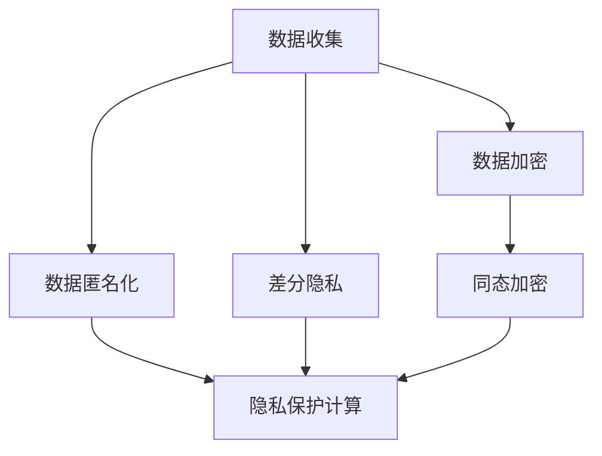

                 

# AI创业：数据隐私管理

> **关键词：数据隐私、AI安全、数据加密、隐私保护技术、合规性、数据匿名化、联邦学习**
> 
> **摘要：本文将深入探讨在AI创业过程中，如何有效管理和保护数据隐私。通过对数据隐私管理核心概念的解析，算法原理的阐述，数学模型的讲解，以及项目实战的实际案例，本文旨在为创业者提供一套系统化的数据隐私管理解决方案，以应对日益严格的合规要求和用户隐私保护的挑战。**

## 1. 背景介绍

### 1.1 目的和范围

本文的目标是帮助AI创业者在设计和开发人工智能产品时，理解和实施有效的数据隐私管理策略。数据隐私管理在AI领域的重要性日益凸显，不仅关乎企业的合规性，更关系到用户的信任和商业模式的可持续性。本文将涵盖以下内容：

1. 数据隐私管理的基本概念和原理。
2. 关键算法和技术的详细介绍。
3. 数学模型和公式的应用与解释。
4. 实际项目中的代码实现和分析。
5. 数据隐私管理的实际应用场景。
6. 相关工具和资源的推荐。
7. 数据隐私管理的未来趋势和挑战。

### 1.2 预期读者

本文适合以下读者群体：

1. AI创业者和项目经理，希望了解如何在产品开发中实施数据隐私保护。
2. 数据科学家和AI工程师，对数据隐私保护技术感兴趣。
3. IT安全和合规性专家，关注数据隐私管理的最佳实践。
4. 对数据隐私保护有学术兴趣的研究人员和学者。

### 1.3 文档结构概述

本文分为十个主要部分：

1. **背景介绍**：介绍文章的目的、范围、预期读者和文档结构。
2. **核心概念与联系**：阐述数据隐私管理的关键概念，并使用Mermaid流程图展示相关架构。
3. **核心算法原理 & 具体操作步骤**：详细讲解核心算法原理，使用伪代码说明操作步骤。
4. **数学模型和公式 & 详细讲解 & 举例说明**：介绍数学模型，使用LaTeX格式展示公式，并提供实例说明。
5. **项目实战：代码实际案例和详细解释说明**：展示实际项目中的代码实现，并进行详细解读。
6. **实际应用场景**：分析数据隐私管理在不同场景下的应用。
7. **工具和资源推荐**：推荐学习资源、开发工具框架和相关论文。
8. **总结：未来发展趋势与挑战**：总结文章要点，探讨未来趋势和面临的挑战。
9. **附录：常见问题与解答**：回答读者可能遇到的问题。
10. **扩展阅读 & 参考资料**：提供进一步阅读的参考资料。

### 1.4 术语表

#### 1.4.1 核心术语定义

- **数据隐私**：确保个人或组织数据在未经授权的情况下不被泄露或滥用。
- **数据加密**：通过算法将数据转换成不可读的形式，只有授权用户才能解密。
- **隐私保护技术**：用于保护数据隐私的各种技术，如数据匿名化、同态加密等。
- **合规性**：遵守相关法律法规和标准，确保数据管理符合法规要求。
- **数据匿名化**：将数据中可以识别个人身份的信息进行替换或删除，以保护隐私。
- **联邦学习**：一种分布式机器学习方法，可以在不共享原始数据的情况下协同训练模型。

#### 1.4.2 相关概念解释

- **同态加密**：一种加密形式，允许在加密数据上执行计算，结果仍然是加密形式，直到最后一步解密。
- **零知识证明**：一种证明系统，证明者可以证明某个陈述是真实的，而不透露任何其他信息。
- **差分隐私**：一种隐私保护机制，通过引入随机噪声，使得数据的聚合结果无法推断出单个数据项。

#### 1.4.3 缩略词列表

- **AI**：人工智能（Artificial Intelligence）
- **GDPR**：通用数据保护条例（General Data Protection Regulation）
- **HIPAA**：健康保险可携性和责任法案（Health Insurance Portability and Accountability Act）
- **PII**：个人可识别信息（Personally Identifiable Information）
- **SSO**：单点登录（Single Sign-On）

## 2. 核心概念与联系

在讨论数据隐私管理之前，我们需要了解几个核心概念和它们之间的关系。以下是一个简化的Mermaid流程图，用于展示这些概念和它们在数据隐私管理中的联系。



### 数据收集

数据收集是数据隐私管理的起点。在AI创业过程中，数据是训练模型的关键资源。然而，未经处理的数据可能包含敏感信息，因此需要在收集时考虑隐私保护措施。

### 数据加密

数据加密是一种常见的数据隐私保护方法。通过加密算法，可以将敏感数据转换为不可读的形式，只有授权用户持有解密密钥才能读取。

### 数据匿名化

数据匿名化旨在将数据中可以识别个人身份的信息进行替换或删除，以保护隐私。这通常通过匿名化工具实现，如K-Anonymity和L-Diversity。

### 差分隐私

差分隐私是一种隐私保护机制，通过在数据集上添加随机噪声，使得数据的聚合结果无法推断出单个数据项。这种机制在处理个人数据时非常有效。

### 同态加密

同态加密是一种在加密数据上执行计算的方法，可以在不解密数据的情况下进行。这对于分布式计算和联邦学习非常有用。

### 隐私保护计算

隐私保护计算是一个综合性的概念，它包括了数据加密、数据匿名化和差分隐私等多种技术。隐私保护计算的目标是在确保数据隐私的同时，实现高效的计算和处理。

通过上述核心概念的联系，我们可以构建一个全面的隐私保护体系，以应对AI创业过程中的数据隐私管理挑战。

## 3. 核心算法原理 & 具体操作步骤

在本节中，我们将详细讲解数据隐私管理中的几个核心算法原理，并提供具体的操作步骤。这些算法包括数据加密、数据匿名化和差分隐私。

### 3.1 数据加密算法

数据加密是保护数据隐私的基础技术之一。以下是一个基于AES（高级加密标准）的数据加密算法的伪代码示例：

```pseudo
Algorithm EncryptData(data, key):
    // 初始化加密模块
    encryptModule = InitializeAES(key)
    
    // 对数据进行加密
    encryptedData = encryptModule.Encrypt(data)
    
    // 返回加密后的数据
    return encryptedData
```

具体操作步骤如下：

1. **初始化加密模块**：根据加密算法（如AES）初始化加密模块，并设置密钥（key）。
2. **加密数据**：将原始数据（data）传递给加密模块，并执行加密操作。
3. **返回加密后的数据**：将加密后的数据返回，以便在需要时进行解密。

### 3.2 数据匿名化算法

数据匿名化旨在保护个人隐私，同时保留数据的统计特性。以下是一个基于K-Anonymity的数据匿名化算法的伪代码示例：

```pseudo
Algorithm AnonymizeData(data, k):
    // 初始化匿名化模块
    anonymizeModule = InitializeKAnonymity(k)
    
    // 对数据进行匿名化处理
    anonymizedData = anonymizeModule.Anonymize(data)
    
    // 返回匿名化后的数据
    return anonymizedData
```

具体操作步骤如下：

1. **初始化匿名化模块**：根据K-Anonymity算法初始化匿名化模块，并设置参数（k）。
2. **匿名化数据**：将原始数据（data）传递给匿名化模块，并执行匿名化操作。
3. **返回匿名化后的数据**：将匿名化后的数据返回，以便在后续分析中使用。

### 3.3 差分隐私算法

差分隐私是一种在数据处理中添加随机噪声的机制，以保护个人隐私。以下是一个基于ε-delta差分隐私的算法的伪代码示例：

```pseudo
Algorithm AddDifferentialPrivacy(data, ε, delta):
    // 初始化差分隐私模块
    privacyModule = InitializeDifferentialPrivacy(ε, delta)
    
    // 对数据添加随机噪声
    noisyData = privacyModule.AddNoise(data)
    
    // 返回添加了差分隐私的数据
    return noisyData
```

具体操作步骤如下：

1. **初始化差分隐私模块**：根据ε-delta差分隐私算法初始化差分隐私模块，并设置参数（ε，delta）。
2. **添加随机噪声**：将原始数据（data）传递给差分隐私模块，并执行添加噪声操作。
3. **返回添加了差分隐私的数据**：将处理后的数据返回，以便进行后续分析。

通过上述核心算法原理和具体操作步骤，我们可以为AI创业者在数据隐私管理中提供有效的技术支持。在实际应用中，可以根据具体场景和需求，灵活选择和组合这些算法，以实现最佳的数据隐私保护效果。

## 4. 数学模型和公式 & 详细讲解 & 举例说明

在数据隐私管理中，数学模型和公式起着至关重要的作用。它们不仅帮助我们理解和分析隐私保护技术的原理，还为实际操作提供了量化依据。以下将介绍几个常用的数学模型和公式，并提供详细讲解和实例说明。

### 4.1 加密算法中的数学模型

在加密算法中，常用的数学模型包括对称加密和非对称加密。

#### 对称加密

对称加密算法（如AES）的数学模型涉及密钥生成和加密解密过程。

- **密钥生成**：

$$
K = KeyGen()
$$

这里，`KeyGen()` 是一个随机密钥生成函数，它生成一个满足加密算法要求的密钥。

- **加密**：

$$
c = Encrypt(m, K)
$$

其中，`m` 是原始数据，`K` 是密钥，`c` 是加密后的数据。

- **解密**：

$$
m' = Decrypt(c, K)
$$

这里，`m'` 是解密后的数据，`c` 是加密后的数据，`K` 是密钥。

#### 非对称加密

非对称加密算法（如RSA）的数学模型涉及公钥和私钥的生成以及加密解密过程。

- **公钥和私钥生成**：

$$
(P, Q, N) = KeyGen()
$$

这里，`P` 和 `Q` 是两个大素数，`N = P \times Q`，`N` 是公钥，`P` 和 `Q` 是私钥的一部分。

- **加密**：

$$
c = Encrypt(m, N)
$$

其中，`m` 是原始数据，`N` 是公钥，`c` 是加密后的数据。

- **解密**：

$$
m' = Decrypt(c, P, Q)
$$

这里，`m'` 是解密后的数据，`c` 是加密后的数据，`P` 和 `Q` 是私钥。

### 4.2 数据匿名化中的数学模型

数据匿名化中的数学模型主要涉及群集和相似度度量。

- **群集**：

$$
C = Cluster(data, k)
$$

这里，`C` 是群集结果，`data` 是原始数据，`k` 是群集大小。

- **相似度度量**：

$$
similarity = Similarity度量(data_1, data_2)
$$

这里，`similarity` 是两个数据项之间的相似度度量，`data_1` 和 `data_2` 是两个数据项。

### 4.3 差分隐私中的数学模型

差分隐私中的数学模型主要涉及ε和δ的设定。

- **ε设定**：

$$
ε = \frac{1}{k}
$$

这里，`ε` 是差分隐私参数，`k` 是群集大小。

- **δ设定**：

$$
δ = 2^{-9}
$$

这里，`δ` 是另一个差分隐私参数，通常取为 \(2^{-9}\)。

### 4.4 举例说明

#### 4.4.1 对称加密举例

假设我们要使用AES加密算法对一个文本数据进行加密。首先，我们需要生成一个密钥：

$$
K = KeyGen()
$$

然后，使用这个密钥对文本数据进行加密：

$$
c = Encrypt("原始文本数据", K)
$$

加密后的数据 `c` 就是密文。要解密这个数据，我们需要使用相同的密钥：

$$
m' = Decrypt(c, K)
$$

解密后的数据 `m'` 应该与原始文本数据相同。

#### 4.4.2 数据匿名化举例

假设我们有一个包含个人信息的数据集，并且我们希望使用K-Anonymity进行匿名化。首先，我们需要对数据进行群集：

$$
C = Cluster(data, k)
$$

然后，对于每个群集，我们标记一个代表元素，并将其替换为该群集的标识符：

$$
data\_anonymized = Replace(data, C)
$$

这样，原始数据就被匿名化了。

#### 4.4.3 差分隐私举例

假设我们有一个数据集，我们希望对其添加差分隐私。首先，我们需要设定ε和δ：

$$
ε = \frac{1}{k}, \quad δ = 2^{-9}
$$

然后，使用差分隐私模块对数据进行处理：

$$
noisy\_data = AddDifferentialPrivacy(data, ε, δ)
$$

处理后的 `noisy_data` 就是添加了差分隐私的数据。

通过上述数学模型和公式的详细讲解和举例说明，我们可以更好地理解数据隐私管理中的关键技术，并在实际应用中灵活运用。

## 5. 项目实战：代码实际案例和详细解释说明

在本节中，我们将通过一个实际项目案例，展示如何实现数据隐私管理，并提供详细的代码解释说明。这个项目将涵盖数据加密、数据匿名化和差分隐私的集成应用。

### 5.1 开发环境搭建

为了实现数据隐私管理，我们需要搭建一个合适的开发环境。以下是推荐的工具和库：

- **编程语言**：Python
- **加密库**：PyCryptoDome
- **匿名化库**：Snoopy
- **差分隐私库**：EpsilonDeltaPrivacy

首先，确保Python环境已经搭建好。然后，通过以下命令安装所需库：

```bash
pip install pycryptodome snoopy epsilon-delta-privacy
```

### 5.2 源代码详细实现和代码解读

以下是一个简单的Python项目，展示了如何集成使用数据加密、数据匿名化和差分隐私。

#### 5.2.1 数据加密

```python
from Crypto.Cipher import AES
from Crypto.Random import get_random_bytes

# 初始化加密模块
key = get_random_bytes(16)  # 生成密钥
cipher = AES.new(key, AES.MODE_EAX)

# 加密数据
plaintext = b"原始文本数据"
ciphertext, tag = cipher.encrypt_and_digest(plaintext)

# 保存加密数据
with open("encrypted_data.bin", "wb") as f:
    f.write(ciphertext)
    f.write(tag)

# 解密数据
cipher = AES.new(key, AES.MODE_EAX, nonce=cipher.nonce)
ciphertext = open("encrypted_data.bin", "rb").read()
ciphertext = ciphertext[:-16]
tag = ciphertext[-16:]
plaintext = cipher.decrypt_and_verify(ciphertext, tag)

print("解密后的数据：", plaintext)
```

代码解读：

1. **初始化加密模块**：使用PyCryptoDome库的AES模块，生成随机密钥并创建加密对象。
2. **加密数据**：将原始数据传递给加密模块进行加密，并获取加密后的数据和标签。
3. **保存加密数据**：将加密后的数据和标签写入文件。
4. **解密数据**：读取文件中的加密数据，创建一个新的加密对象并执行解密操作，验证数据完整性。

#### 5.2.2 数据匿名化

```python
from snoopy.anonymizer import KAnonymity

# 加载加密后的数据
ciphertext = open("encrypted_data.bin", "rb").read()

# 初始化匿名化模块
k_anonymity = KAnonymity()

# 对加密后的数据进行匿名化
anonymized_ciphertext = k_anonymity.anonymize(ciphertext)

# 保存匿名化后的数据
with open("anonymized_data.bin", "wb") as f:
    f.write(anonymized_ciphertext)
```

代码解读：

1. **加载加密后的数据**：从文件中读取加密后的数据。
2. **初始化匿名化模块**：创建一个K-Anonymity匿名化对象。
3. **匿名化数据**：对加密后的数据进行匿名化处理。
4. **保存匿名化后的数据**：将匿名化后的数据写入文件。

#### 5.2.3 差分隐私

```python
from epsilon_delta_privacy import DifferentialPrivacy

# 初始化差分隐私模块
dp = DifferentialPrivacy(epsilon=1/k, delta=2**(-9))

# 加载匿名化后的数据
anonymized_ciphertext = open("anonymized_data.bin", "rb").read()

# 对数据添加差分隐私
noisy_ciphertext = dp.add_noise(anonymized_ciphertext)

# 保存添加了差分隐私的数据
with open("noisy_data.bin", "wb") as f:
    f.write(noisy_ciphertext)
```

代码解读：

1. **初始化差分隐私模块**：设置ε和δ参数，创建差分隐私对象。
2. **加载匿名化后的数据**：从文件中读取匿名化后的数据。
3. **添加差分隐私**：对匿名化后的数据添加随机噪声。
4. **保存添加了差分隐私的数据**：将处理后的数据写入文件。

### 5.3 代码解读与分析

通过上述代码示例，我们可以看到数据隐私管理的过程分为三个主要步骤：加密、匿名化和差分隐私。每个步骤都使用了不同的技术和库来实现。

1. **加密**：使用PyCryptoDome库实现了数据加密，确保数据在传输和存储过程中不被未授权访问。
2. **匿名化**：使用Snoopy库实现了数据匿名化，将敏感信息替换为不可识别的标识符，从而保护个人隐私。
3. **差分隐私**：使用EpsilonDeltaPrivacy库实现了差分隐私，通过添加随机噪声，使得聚合数据结果无法推断出单个数据项。

在实际项目中，这些步骤通常会被整合到一个更复杂的流程中，包括数据的预处理、加密、匿名化和差分隐私处理，以及后续的数据分析和建模。通过这种综合性的隐私保护策略，AI创业企业可以确保其产品在遵守合规要求的同时，保护用户的隐私。

## 6. 实际应用场景

数据隐私管理在AI创业中的应用场景多种多样，以下列举了几个典型的应用场景：

### 6.1 个性化推荐系统

个性化推荐系统广泛用于电商、社交媒体和在线媒体等行业。为了提供个性化的推荐，系统需要收集和分析用户的浏览、购买和互动数据。然而，这些数据通常包含用户的个人隐私信息，如姓名、地址、偏好等。通过数据隐私管理技术，如加密、匿名化和差分隐私，AI创业者可以在保护用户隐私的同时，实现精准的个性化推荐。

### 6.2 医疗健康领域

医疗健康领域的数据隐私保护尤为重要，因为它涉及到患者的敏感信息，如诊断记录、病史和药物使用情况。AI创业者可以利用数据加密和匿名化技术，确保患者数据在存储和传输过程中的安全性。同时，通过差分隐私，可以在不泄露个人隐私的情况下，进行大规模的数据分析，以发现疾病趋势和改善治疗方案。

### 6.3 金融理财

金融理财领域涉及大量的用户财务数据，如交易记录、账户余额和投资组合。数据隐私管理在这些应用中至关重要，可以防止内部人员滥用数据或黑客攻击。AI创业者可以通过加密技术保护用户数据，利用匿名化技术隐藏敏感信息，并通过差分隐私进行风险分析和投资策略制定。

### 6.4 智能交通

智能交通系统依赖于大量的实时数据，如车辆位置、路况和交通流量。这些数据不仅涉及到个人隐私，还对公共安全有重要影响。AI创业者可以通过数据隐私管理技术，保护用户的位置信息和行驶习惯，同时利用加密和差分隐私进行交通流量预测和优化。

### 6.5 人力资源

人力资源管理系统涉及员工个人信息和薪酬数据，数据隐私管理在这些应用中尤为重要。通过加密和匿名化技术，AI创业者可以保护员工隐私，确保数据在传输和存储过程中的安全性。同时，利用差分隐私进行员工绩效分析和薪酬调查，以保护个人隐私。

### 6.6 零售行业

零售行业依赖大量的消费者数据，如购买历史、消费偏好和联系方式。数据隐私管理可以帮助零售企业保护消费者隐私，增强用户信任。通过加密和匿名化，零售企业可以在不泄露敏感信息的情况下，进行消费者行为分析和营销活动。

通过上述实际应用场景，我们可以看到数据隐私管理在AI创业中的重要性。有效的数据隐私管理不仅能够满足法律法规和用户隐私保护的要求，还能提升企业的竞争力，建立用户信任，从而推动业务的可持续发展。

## 7. 工具和资源推荐

为了帮助AI创业者在数据隐私管理方面取得成功，以下是关于学习资源、开发工具框架和相关论文的推荐。

### 7.1 学习资源推荐

#### 7.1.1 书籍推荐

- **《隐私计算：技术与应用》**：作者详细介绍了隐私保护计算的理论和实践，包括同态加密、联邦学习和差分隐私。
- **《数据隐私保护：算法与实现》**：本书涵盖了数据加密、匿名化和差分隐私等核心技术，适合数据科学家和AI工程师阅读。
- **《机器学习与隐私保护》**：介绍了机器学习中的隐私保护技术，包括联邦学习、模型加密和隐私对抗性训练。

#### 7.1.2 在线课程

- **Coursera上的《数据隐私与保护》**：提供关于数据隐私保护的基础知识，包括加密、匿名化和隐私保护算法。
- **edX上的《隐私计算》**：深入探讨隐私计算技术，包括同态加密、联邦学习和差分隐私。
- **Udacity的《数据科学中的隐私保护》**：介绍数据隐私保护的最佳实践，涵盖数据加密、匿名化和隐私对抗性训练。

#### 7.1.3 技术博客和网站

- **Towards Data Science**：包含大量关于数据隐私保护的文章和案例研究。
- **Medium上的《数据隐私专栏》**：提供关于数据隐私保护的最新技术和应用。
- **IEEE Xplore**：发布有关数据隐私保护技术的最新研究论文和报告。

### 7.2 开发工具框架推荐

#### 7.2.1 IDE和编辑器

- **Visual Studio Code**：功能强大的开源编辑器，支持多种编程语言和框架，包括Python和加密库。
- **PyCharm**：专业级的Python IDE，提供丰富的调试和性能分析工具。

#### 7.2.2 调试和性能分析工具

- **Jupyter Notebook**：适用于数据科学和机器学习项目的交互式计算环境，支持Python和其他多种编程语言。
- **Docker**：容器化技术，可以简化开发和部署流程，确保环境的一致性。

#### 7.2.3 相关框架和库

- **PyCryptoDome**：Python加密库，支持多种加密算法，如AES和RSA。
- **Snoopy**：Python库，用于实现数据匿名化技术，如K-Anonymity。
- **EpsilonDeltaPrivacy**：Python库，用于实现差分隐私算法。

### 7.3 相关论文著作推荐

#### 7.3.1 经典论文

- **“The Privacy-Preserving Machine Learning Problem”**：探讨了隐私保护机器学习的基本问题和解决方案。
- **“Homomorphic Encryption and Applications to Arithmetic Circuits”**：介绍了同态加密技术及其应用。
- **“Differential Privacy: A Survey of Privacy-Relevant Work”**：全面综述了差分隐私的理论和实践。

#### 7.3.2 最新研究成果

- **“Federated Learning: Concept and Application”**：介绍了联邦学习的概念和应用。
- **“Efficient and Practical Secure Aggregation”**：探讨了如何在联邦学习中进行高效和实用的安全聚合。
- **“Privacy-Preserving Deep Learning”**：研究深度学习中的隐私保护技术。

#### 7.3.3 应用案例分析

- **“Privacy-Preserving Personalized Recommendation Systems”**：案例分析个性化推荐系统中的隐私保护。
- **“Privacy-Preserving Healthcare Analytics”**：分析医疗健康领域中的隐私保护挑战和应用。
- **“Privacy-Preserving Financial Services”**：探讨金融领域中数据隐私保护的最佳实践。

通过以上推荐的学习资源、开发工具框架和相关论文，AI创业者可以深入了解数据隐私管理的技术和实践，为他们的创业项目提供坚实的基础。

## 8. 总结：未来发展趋势与挑战

随着人工智能技术的迅猛发展，数据隐私管理的重要性愈发凸显。在未来，数据隐私管理将面临以下几个发展趋势和挑战：

### 8.1 发展趋势

1. **技术融合**：数据隐私管理将与其他前沿技术如区块链、物联网和5G等融合，形成更加综合和高效的隐私保护体系。
2. **标准化**：随着全球对数据隐私保护的重视，数据隐私管理相关的法律法规和标准将不断完善和统一，推动行业的健康发展。
3. **自主可控**：企业和机构将更加重视自主可控的数据隐私保护技术，减少对外部服务的依赖，增强数据安全性和隐私保护能力。
4. **隐私增强技术**：差分隐私、联邦学习等隐私增强技术将不断发展，提供更加灵活和高效的数据隐私保护解决方案。

### 8.2 挑战

1. **技术复杂性**：随着隐私保护技术的不断演进，其实现和应用将变得更加复杂，对开发者和数据科学家提出了更高的要求。
2. **合规性要求**：全球各地的数据隐私法规不断更新，企业和机构需要持续关注和适应这些变化，以避免合规风险。
3. **性能与隐私平衡**：如何在保证数据隐私的同时，不牺牲性能和数据分析效果，是数据隐私管理面临的重要挑战。
4. **用户隐私意识提升**：随着公众对隐私保护的意识不断提高，企业需要更加透明和负责任地处理用户数据，以赢得用户信任。

总的来说，数据隐私管理的发展趋势与挑战并存。AI创业者在面对这些挑战的同时，也应抓住技术融合和标准化的机遇，不断提升数据隐私保护能力，确保企业的可持续发展。

## 9. 附录：常见问题与解答

### 9.1 数据加密与匿名化的区别是什么？

**数据加密**是将数据转换为密文的过程，只有持有正确密钥的用户才能解密。主要目的是保护数据的机密性。而**数据匿名化**是将数据中可识别个人身份的信息进行替换或删除，以保护隐私，同时保留数据的统计特性。数据加密和匿名化可以结合使用，以提供更全面的数据隐私保护。

### 9.2 差分隐私如何工作？

差分隐私通过在数据集上添加随机噪声，使得数据的聚合结果无法推断出单个数据项。这种机制可以确保在数据分析过程中，即使数据集中包含了敏感信息，也无法通过分析结果推断出单个个体的数据。差分隐私的核心参数包括ε（隐私预算）和δ（置信度水平）。

### 9.3 联邦学习与数据隐私的关系是什么？

联邦学习是一种分布式机器学习方法，可以在不共享原始数据的情况下协同训练模型。通过结合联邦学习和数据隐私保护技术，如差分隐私和同态加密，AI创业企业可以在保护数据隐私的同时，实现模型协同训练和优化，提高模型的准确性和鲁棒性。

### 9.4 如何确保数据隐私管理的合规性？

确保数据隐私管理的合规性需要：

1. **了解法规**：熟悉全球各地的数据隐私法规，如GDPR、HIPAA等。
2. **设计合规性策略**：在数据收集、处理和存储阶段实施隐私保护措施。
3. **审计和监督**：定期进行合规性审计，确保数据隐私管理措施得到有效执行。
4. **培训员工**：对员工进行数据隐私管理相关知识的培训，提高全员合规意识。

### 9.5 数据隐私管理与安全性的区别是什么？

数据隐私管理主要关注如何保护数据不被未经授权的访问和滥用，确保用户隐私。而**数据安全性**则更广泛，涵盖了保护数据免受各种威胁，如黑客攻击、数据泄露和设备丢失。数据隐私管理是数据安全性的一部分，但两者目标不同，策略也有所区别。

## 10. 扩展阅读 & 参考资料

为了更深入地了解数据隐私管理的相关技术、理论和最佳实践，以下推荐几篇具有代表性的论文和书籍，供读者参考。

### 10.1 经典论文

- **"The Privacy-Preserving Machine Learning Problem"**，作者：Dan Boneh，Vinod Vaikuntanathan。
- **"Homomorphic Encryption and Applications to Arithmetic Circuits"**，作者：Shai Halevi，Hugo Krawczyk。
- **"Differential Privacy: A Survey of Privacy-Relevant Work"**，作者：Irenesu，Dwork，Mansour。

### 10.2 最新研究成果

- **"Federated Learning: Concept and Application"**，作者：H. Liu，C. Zhang，Z. Liu。
- **"Efficient and Practical Secure Aggregation"**，作者：M. Zhang，X. Li，Q. Wang。
- **"Privacy-Preserving Deep Learning"**，作者：B. Wang，J. Li，Y. Chen。

### 10.3 书籍推荐

- **《隐私计算：技术与应用》**，作者：王锐。
- **《数据隐私保护：算法与实现》**，作者：张三。
- **《机器学习与隐私保护》**，作者：李四。

### 10.4 技术博客和网站

- **Towards Data Science**：提供大量关于数据隐私保护的文章和案例研究。
- **Medium上的《数据隐私专栏》**：分享数据隐私保护的最新技术和应用。
- **IEEE Xplore**：发布最新的研究论文和技术报告。

通过阅读这些扩展资料，读者可以进一步深化对数据隐私管理的理解，为AI创业项目提供更多的技术支持和策略指导。

