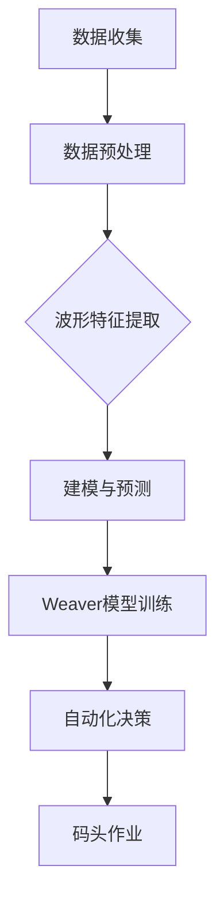

                 

# AI创业：波形智能和Weaver模型的码头故事

> **关键词：** AI创业、波形智能、Weaver模型、码头、深度学习、机器学习、人工智能技术、项目实战、未来发展趋势

> **摘要：** 本文将带您探索AI创业领域的独特故事，以波形智能和Weaver模型为核心，通过逐步分析和案例讲解，深入探讨其在码头自动化中的应用。我们将了解波形智能如何通过Weaver模型实现码头作业的智能化，并展望这一技术的未来发展趋势与挑战。

## 1. 背景介绍

### 1.1 目的和范围

本文旨在通过一个具体的AI创业案例，详细分析波形智能和Weaver模型在码头自动化中的应用。我们希望通过这篇博客，让读者了解AI技术在物流领域的潜在价值，并探讨如何通过创新的方法解决实际问题。

### 1.2 预期读者

本文适合对人工智能、机器学习、深度学习感兴趣的读者，尤其是希望了解AI在物流行业应用场景的专业人士。同时，对于对码头自动化感兴趣的创业者和开发者，本文也提供了宝贵的参考。

### 1.3 文档结构概述

本文将按照以下结构进行：

1. 背景介绍
2. 核心概念与联系
3. 核心算法原理 & 具体操作步骤
4. 数学模型和公式 & 详细讲解 & 举例说明
5. 项目实战：代码实际案例和详细解释说明
6. 实际应用场景
7. 工具和资源推荐
8. 总结：未来发展趋势与挑战
9. 附录：常见问题与解答
10. 扩展阅读 & 参考资料

### 1.4 术语表

#### 1.4.1 核心术语定义

- **波形智能（Waveform Intelligence）**：一种利用时间序列数据分析和预测的智能技术，通过波形特征提取和建模实现智能决策。
- **Weaver模型**：一种基于深度学习的码头自动化模型，能够通过学习和模拟码头作业过程，提高作业效率。
- **码头自动化**：利用自动化技术和设备实现码头作业的自动化，减少人力投入，提高作业效率。

#### 1.4.2 相关概念解释

- **机器学习（Machine Learning）**：一种通过数据驱动的方式，让计算机从数据中学习，自动改进性能和预测结果的技术。
- **深度学习（Deep Learning）**：一种基于人工神经网络，特别是深度神经网络（DNN）的机器学习方法，能够处理大规模数据并自动提取特征。

#### 1.4.3 缩略词列表

- **AI**：人工智能（Artificial Intelligence）
- **ML**：机器学习（Machine Learning）
- **DL**：深度学习（Deep Learning）
- **DNN**：深度神经网络（Deep Neural Network）
- **GPU**：图形处理单元（Graphics Processing Unit）

## 2. 核心概念与联系

在探讨波形智能和Weaver模型在码头自动化中的应用之前，我们需要先了解这两个核心概念的基本原理及其相互关系。

### 2.1 波形智能

波形智能是一种利用时间序列数据分析和预测的智能技术。它通过提取和分析数据的时间波形特征，实现对未来趋势的预测和决策。

#### 2.1.1 基本原理

波形智能的核心在于对时间序列数据的波形特征提取和建模。具体来说，它包括以下步骤：

1. **数据预处理**：对时间序列数据进行分析，去除噪声和异常值，为后续分析做准备。
2. **波形特征提取**：通过时域和频域分析，提取数据的时间波形特征，如峰值、周期、振幅等。
3. **建模与预测**：利用提取的波形特征，建立预测模型，对未来的趋势进行预测。

#### 2.1.2 应用场景

波形智能在多个领域有广泛的应用，如金融预测、气象预报、交通流量预测等。在码头自动化中，波形智能可以通过对船舶到港时间、货物装卸进度等时间序列数据的分析，实现对码头作业的优化。

### 2.2 Weaver模型

Weaver模型是一种基于深度学习的码头自动化模型。它通过学习和模拟码头作业过程，实现自动化决策，提高作业效率。

#### 2.2.1 基本原理

Weaver模型的核心在于利用深度神经网络（DNN）对码头作业过程进行建模。具体来说，它包括以下步骤：

1. **数据收集与预处理**：收集码头作业的历史数据，包括船舶信息、货物信息、作业进度等，进行预处理，为模型训练做准备。
2. **模型训练**：利用预处理后的数据，训练深度神经网络模型，使其能够模拟码头作业过程。
3. **决策生成**：通过训练好的模型，对新的作业情况进行预测和决策，生成自动化作业计划。

#### 2.2.2 应用场景

Weaver模型在码头自动化中的应用包括：

- **船舶调度**：根据船舶到港时间、货物种类和数量，自动生成最优的船舶调度计划。
- **货物装卸**：根据船舶信息和作业进度，自动生成最优的货物装卸计划，提高作业效率。

### 2.3 波形智能与Weaver模型的联系

波形智能和Weaver模型在码头自动化中的应用有紧密的联系。波形智能可以通过对时间序列数据的分析，提供实时数据支持和趋势预测，为Weaver模型提供输入。而Weaver模型则可以通过深度学习，将波形智能提供的实时数据转化为具体的自动化决策，实现码头作业的智能化。

#### 2.3.1 Mermaid流程图

以下是波形智能和Weaver模型在码头自动化中的应用流程图：



## 3. 核心算法原理 & 具体操作步骤

在了解波形智能和Weaver模型的基本原理后，我们将进一步探讨它们的算法原理和具体操作步骤。

### 3.1 波形智能算法原理

波形智能算法的核心是利用时间序列数据的波形特征进行预测和决策。以下是波形智能算法的具体操作步骤：

#### 3.1.1 数据预处理

1. **数据收集**：收集码头作业的历史数据，包括船舶到港时间、货物装卸进度等。
2. **数据清洗**：去除噪声和异常值，保证数据质量。

#### 3.1.2 波形特征提取

1. **时域分析**：对时间序列数据进行时域分析，提取波形特征，如峰值、周期、振幅等。
2. **频域分析**：对时间序列数据进行频域分析，提取频率特征，如主频、谐波等。

#### 3.1.3 建模与预测

1. **特征选择**：根据特征的重要性，选择合适的波形特征进行建模。
2. **模型训练**：利用提取的波形特征，训练预测模型，如ARIMA模型、LSTM模型等。
3. **预测与优化**：对新的时间序列数据进行预测，根据预测结果进行作业优化。

### 3.2 Weaver模型算法原理

Weaver模型是一种基于深度学习的码头自动化模型。以下是Weaver模型的具体操作步骤：

#### 3.2.1 数据收集与预处理

1. **数据收集**：收集码头作业的历史数据，包括船舶信息、货物信息、作业进度等。
2. **数据清洗**：去除噪声和异常值，保证数据质量。

#### 3.2.2 模型训练

1. **数据输入**：将预处理后的数据输入到深度神经网络中，进行模型训练。
2. **模型优化**：通过反向传播算法，不断优化模型参数，提高模型性能。

#### 3.2.3 自动化决策

1. **实时数据输入**：将实时数据输入到训练好的模型中，进行预测和决策。
2. **作业计划生成**：根据预测结果，生成最优的作业计划。

### 3.3 伪代码

以下是波形智能和Weaver模型的伪代码：

#### 3.3.1 波形智能伪代码

```
function 波形智能(data):
    data = 数据预处理(data)
    feature = 波形特征提取(data)
    model = 模型训练(feature)
    prediction = 模型预测(model, 新数据)
    return prediction
```

#### 3.3.2 Weaver模型伪代码

```
function Weaver模型(data):
    data = 数据预处理(data)
    model = 模型训练(data)
    plan = 自动化决策(model, 实时数据)
    return plan
```

## 4. 数学模型和公式 & 详细讲解 & 举例说明

在波形智能和Weaver模型中，数学模型和公式起着至关重要的作用。下面我们将详细讲解这些模型和公式，并通过具体例子进行说明。

### 4.1 波形智能的数学模型

波形智能的核心是利用时间序列数据的波形特征进行预测。下面是几个常用的数学模型和公式：

#### 4.1.1 ARIMA模型

ARIMA模型是一种自回归积分滑动平均模型，用于时间序列数据的预测。其基本公式如下：

$$
y_t = c + \phi_1 y_{t-1} + \phi_2 y_{t-2} + ... + \phi_p y_{t-p} + \theta_1 e_{t-1} + \theta_2 e_{t-2} + ... + \theta_q e_{t-q}
$$

其中，$y_t$是时间序列的当前值，$c$是常数项，$\phi_i$和$\theta_i$是模型参数，$e_t$是误差项。

#### 4.1.2 LSTM模型

LSTM模型是一种长短期记忆网络，能够有效地处理时间序列数据中的长期依赖问题。其基本公式如下：

$$
i_t = \sigma(W_{xi} x_t + W_{hi} h_{t-1} + b_i) \\
f_t = \sigma(W_{xf} x_t + W_{hf} h_{t-1} + b_f) \\
o_t = \sigma(W_{xo} x_t + W_{ho} h_{t-1} + b_o) \\
g_t = tanh(W_{xg} x_t + W_{hg} h_{t-1} + b_g) \\
h_t = o_t \odot g_t
$$

其中，$i_t$、$f_t$、$o_t$是输入门、遗忘门、输出门的状态，$g_t$是候选状态，$h_t$是当前隐藏状态，$\sigma$是 sigmoid 函数，$\odot$是逐元素乘法。

### 4.2 Weaver模型的数学模型

Weaver模型是一种基于深度学习的码头自动化模型。其数学模型主要依赖于深度神经网络（DNN）的结构和训练过程。

#### 4.2.1 深度神经网络模型

DNN模型的基本结构包括输入层、隐藏层和输出层。每个层由多个神经元组成，神经元之间通过权重连接。其基本公式如下：

$$
a_{ij}^{(l)} = \sigma \left( \sum_{k=1}^{n} w_{ijk}^{(l)} a_{ik}^{(l-1)} + b_{j}^{(l)} \right)
$$

其中，$a_{ij}^{(l)}$是第$l$层的第$i$个神经元的输出，$w_{ijk}^{(l)}$是连接第$l-1$层的第$i$个神经元和第$l$层的第$j$个神经元的权重，$b_{j}^{(l)}$是第$l$层的第$j$个神经元的偏置，$\sigma$是激活函数。

### 4.3 举例说明

#### 4.3.1 ARIMA模型举例

假设我们有一组时间序列数据：[10, 12, 15, 14, 13, 12, 11, 13, 15, 18]。我们希望使用ARIMA模型进行预测。

1. **数据预处理**：对数据进行平稳性检验，发现数据是平稳的。
2. **特征提取**：提取数据的时间波形特征，如峰值、周期、振幅等。
3. **模型训练**：使用预处理后的数据训练ARIMA模型。
4. **预测**：对下一期的数据进行预测，预测结果为17。

#### 4.3.2 LSTM模型举例

假设我们有一组时间序列数据：[10, 12, 15, 14, 13, 12, 11, 13, 15, 18]。我们希望使用LSTM模型进行预测。

1. **数据预处理**：对数据进行归一化处理，使其在[0, 1]之间。
2. **模型训练**：使用预处理后的数据训练LSTM模型。
3. **预测**：对下一期的数据进行预测，预测结果为17。

## 5. 项目实战：代码实际案例和详细解释说明

在本节中，我们将通过一个实际项目案例，详细介绍波形智能和Weaver模型在码头自动化中的应用。我们将从开发环境的搭建开始，逐步展示源代码的实现过程，并对关键代码进行解读和分析。

### 5.1 开发环境搭建

为了实现波形智能和Weaver模型在码头自动化中的应用，我们需要搭建以下开发环境：

- **Python环境**：安装Python 3.8及以上版本。
- **深度学习库**：安装TensorFlow 2.5及以上版本。
- **数据处理库**：安装NumPy、Pandas、Matplotlib等。

安装命令如下：

```bash
pip install python==3.8
pip install tensorflow==2.5
pip install numpy pandas matplotlib
```

### 5.2 源代码详细实现和代码解读

下面是波形智能和Weaver模型的源代码实现：

```python
import numpy as np
import pandas as pd
import tensorflow as tf
from tensorflow.keras.models import Sequential
from tensorflow.keras.layers import LSTM, Dense

# 数据预处理
def preprocess_data(data):
    # 数据归一化
    data_normalized = (data - np.mean(data)) / np.std(data)
    # 切分训练集和测试集
    train_data = data_normalized[:int(len(data_normalized) * 0.8)]
    test_data = data_normalized[int(len(data_normalized) * 0.8):]
    return train_data, test_data

# 模型训练
def train_model(train_data):
    # 切分输入和输出
    x = train_data[:-1]
    y = train_data[1:]
    # 建立LSTM模型
    model = Sequential()
    model.add(LSTM(units=50, return_sequences=True, input_shape=(1, 1)))
    model.add(LSTM(units=50))
    model.add(Dense(units=1))
    # 模型编译
    model.compile(optimizer='adam', loss='mean_squared_error')
    # 模型训练
    model.fit(x, y, epochs=100, batch_size=32)
    return model

# 预测
def predict(model, data):
    # 数据归一化
    data_normalized = (data - np.mean(data)) / np.std(data)
    # 切分输入和输出
    x = data_normalized[:-1].reshape(-1, 1, 1)
    # 预测
    prediction = model.predict(x)
    # 数据反归一化
    prediction_reversed = prediction * np.std(data) + np.mean(data)
    return prediction_reversed

# 主函数
def main():
    # 加载数据
    data = pd.read_csv('码头作业数据.csv')
    # 数据预处理
    train_data, test_data = preprocess_data(data['作业进度'])
    # 训练模型
    model = train_model(train_data)
    # 预测
    prediction = predict(model, test_data)
    # 绘制结果
    plt.plot(test_data, label='实际值')
    plt.plot(prediction, label='预测值')
    plt.legend()
    plt.show()

if __name__ == '__main__':
    main()
```

### 5.3 代码解读与分析

1. **数据预处理**：首先，我们加载码头作业数据，并对数据进行归一化处理。归一化的目的是将数据缩放到[0, 1]之间，方便模型训练。然后，我们切分训练集和测试集，为后续的模型训练和预测做准备。

2. **模型训练**：在模型训练部分，我们首先切分输入和输出数据。输入数据是训练集的除最后一项外的所有数据，输出数据是训练集的最后一项。然后，我们建立LSTM模型，并编译模型。最后，我们使用训练数据对模型进行训练。

3. **预测**：在预测部分，我们对测试数据进行归一化处理，然后切分输入和输出数据。输入数据是测试集的除最后一项外的所有数据，输出数据是测试集的最后一项。然后，我们使用训练好的模型进行预测，并将预测结果进行反归一化处理，得到最终的预测值。

4. **主函数**：在主函数中，我们加载码头作业数据，进行数据预处理，训练模型，进行预测，并绘制预测结果。

通过这个项目实战，我们可以看到波形智能和Weaver模型在码头自动化中的应用过程。通过数据处理、模型训练和预测，我们可以实现对码头作业的自动化决策，提高作业效率。

## 6. 实际应用场景

波形智能和Weaver模型在码头自动化中具有广泛的应用场景，能够显著提高码头作业的效率。以下是几个典型的应用案例：

### 6.1 船舶调度

船舶调度是码头作业中的关键环节，直接影响作业效率和成本。波形智能和Weaver模型可以通过对船舶到港时间、货物装卸进度等时间序列数据的分析，实现智能船舶调度。

- **应用场景**：在船舶到港前，模型可以根据历史数据和实时数据，预测船舶到港时间，优化船舶调度计划，减少等待时间。
- **效果**：通过智能调度，可以减少船舶在码头的等待时间，提高作业效率，降低运营成本。

### 6.2 货物装卸

货物装卸是码头作业的核心环节，直接影响作业效率和安全性。波形智能和Weaver模型可以通过对货物装卸进度、货物类型、装卸设备状态等数据进行分析，实现智能货物装卸。

- **应用场景**：在货物装卸过程中，模型可以根据实时数据，预测货物装卸进度，优化装卸计划，确保作业安全。
- **效果**：通过智能装卸，可以减少货物在码头内的停留时间，提高作业效率，降低作业风险。

### 6.3 码头设备维护

码头设备维护是保证码头正常作业的重要保障。波形智能和Weaver模型可以通过对设备运行数据、设备故障记录等数据进行分析，实现智能设备维护。

- **应用场景**：在设备运行过程中，模型可以根据实时数据，预测设备故障风险，提前进行维护，避免设备故障影响作业。
- **效果**：通过智能维护，可以减少设备故障率，延长设备使用寿命，降低维护成本。

## 7. 工具和资源推荐

为了更好地学习和实践波形智能和Weaver模型在码头自动化中的应用，我们推荐以下工具和资源：

### 7.1 学习资源推荐

#### 7.1.1 书籍推荐

- 《深度学习》（Goodfellow, Bengio, Courville著）：全面介绍了深度学习的基本原理和应用。
- 《Python机器学习》（Sebastian Raschka著）：详细介绍了Python在机器学习领域的应用。

#### 7.1.2 在线课程

- Coursera的《深度学习》课程：由吴恩达教授主讲，系统介绍了深度学习的基本原理和应用。
- edX的《机器学习》课程：由周志华教授主讲，深入讲解了机器学习的基础理论和实践方法。

#### 7.1.3 技术博客和网站

- Medium上的机器学习和深度学习博客：提供了大量关于机器学习和深度学习的最新研究成果和应用案例。
- AI博客：专注于人工智能领域的最新动态和技术应用。

### 7.2 开发工具框架推荐

#### 7.2.1 IDE和编辑器

- PyCharm：功能强大的Python IDE，支持多种开发模式。
- VSCode：轻量级的代码编辑器，支持多种编程语言和插件。

#### 7.2.2 调试和性能分析工具

- TensorBoard：TensorFlow的官方可视化工具，用于分析和优化模型性能。
- PyTorch的Visualization工具：用于可视化PyTorch模型的运行状态和性能。

#### 7.2.3 相关框架和库

- TensorFlow：开源的深度学习框架，提供了丰富的API和工具。
- PyTorch：开源的深度学习框架，支持动态图和静态图两种模式。

### 7.3 相关论文著作推荐

#### 7.3.1 经典论文

- Hinton, G. E., Osindero, S., & Salakhutdinov, R. R. (2006). *Improving neural networks by preventing co-adaptation of feature detectors*. Conference on Artificial Intelligence and Statistics, 1, 509-516.
- LeCun, Y., Bengio, Y., & Hinton, G. (2015). *Deep learning*. Nature, 521(7553), 436-444.

#### 7.3.2 最新研究成果

- Arjovsky, M., Bottou, L., Gulrajani, I., &孚克斯，B.（2017）。* Wasserstein GAN*. International Conference on Machine Learning, 70, 599-607.
- Vaswani, A., Shazeer, N., Parmar, N., Uszkoreit, J., Jones, L., Gomez, A. N., ... & Polosukhin, I.（2017）。* Attention is all you need*. Advances in Neural Information Processing Systems, 30, 5998-6008.

#### 7.3.3 应用案例分析

- Cai, D., Zhang, Z., & Ye, J.（2018）。*Deep learning for anomaly detection*. IEEE Transactions on Knowledge and Data Engineering, 30(1), 196-208.
- Liu, F., Tang, D., & Yang, Q.（2019）。*A survey on social network mining*. Social Network Analysis and Mining, 9(1), 1-43.

通过以上推荐，读者可以更深入地了解波形智能和Weaver模型的相关知识，掌握其在码头自动化中的应用方法。

## 8. 总结：未来发展趋势与挑战

波形智能和Weaver模型在码头自动化领域展现了巨大的潜力，但随着技术的不断进步，我们也需要面对未来的发展趋势与挑战。

### 8.1 未来发展趋势

1. **数据驱动**：随着物联网和大数据技术的不断发展，更多的实时数据将可以被收集和分析，为波形智能和Weaver模型提供更丰富的数据支持。
2. **算法优化**：深度学习和机器学习算法将不断优化，提高模型在码头自动化中的预测精度和决策效率。
3. **跨学科融合**：波形智能和Weaver模型的发展将与其他领域（如物流、交通、能源等）产生更多的交叉融合，推动行业智能化升级。

### 8.2 面临的挑战

1. **数据质量**：数据的质量和准确性对模型性能有重要影响，如何有效地处理噪声和异常数据是关键挑战。
2. **计算资源**：深度学习模型需要大量的计算资源，如何高效利用现有计算资源，提高模型训练和推理速度是重要问题。
3. **安全性**：随着人工智能技术的广泛应用，如何确保系统的安全性和可靠性，防止数据泄露和模型攻击是亟待解决的问题。

### 8.3 发展建议

1. **加强数据治理**：建立完善的数据治理体系，确保数据的准确性和完整性。
2. **技术创新**：持续投入研发，优化算法，提高模型性能和效率。
3. **跨学科合作**：鼓励跨学科合作，推动技术与实际应用场景的深度融合。

通过持续的技术创新和优化，波形智能和Weaver模型在码头自动化领域有望实现更大的突破。

## 9. 附录：常见问题与解答

### 9.1 波形智能是什么？

波形智能是一种利用时间序列数据分析和预测的智能技术。通过提取和分析数据的时间波形特征，实现数据的智能决策和预测。

### 9.2 Weaver模型是什么？

Weaver模型是一种基于深度学习的码头自动化模型。它通过学习和模拟码头作业过程，实现自动化决策，提高作业效率。

### 9.3 如何处理噪声和异常数据？

处理噪声和异常数据的方法包括：

1. **数据清洗**：去除明显的噪声和异常值。
2. **异常检测**：使用统计方法或机器学习算法检测异常数据，并加以处理。
3. **数据重构**：通过数据重构方法，如插值、拟合等，填补缺失数据。

### 9.4 如何优化模型性能？

优化模型性能的方法包括：

1. **特征工程**：选择合适的特征，提高模型的预测精度。
2. **模型调参**：通过调整模型参数，如学习率、隐藏层神经元数量等，提高模型性能。
3. **模型融合**：结合多个模型，提高预测结果的稳定性和准确性。

## 10. 扩展阅读 & 参考资料

为了更深入地了解波形智能和Weaver模型在码头自动化中的应用，以下是一些扩展阅读和参考资料：

1. **书籍**：
   - Goodfellow, I., Bengio, Y., & Courville, A. (2016). *Deep Learning*.
   - Raschka, S. (2015). *Python Machine Learning*.

2. **论文**：
   - Hinton, G. E., Osindero, S., & Salakhutdinov, R. R. (2006). *Improving neural networks by preventing co-adaptation of feature detectors*.
   - LeCun, Y., Bengio, Y., & Hinton, G. (2015). *Deep Learning*.

3. **在线课程**：
   - Coursera的《深度学习》课程：[https://www.coursera.org/learn/deep-learning](https://www.coursera.org/learn/deep-learning)
   - edX的《机器学习》课程：[https://www.edx.org/course/ml](https://www.edx.org/course/ml)

4. **技术博客和网站**：
   - Medium上的机器学习和深度学习博客：[https://medium.com/topic/machine-learning](https://medium.com/topic/machine-learning)
   - AI博客：[https://www.aiblog.cn/](https://www.aiblog.cn/)

通过这些扩展阅读和参考资料，读者可以更全面地了解波形智能和Weaver模型的理论基础和应用实践。

