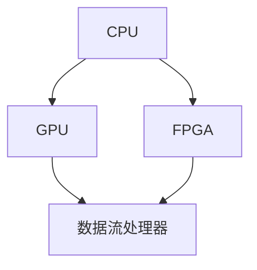
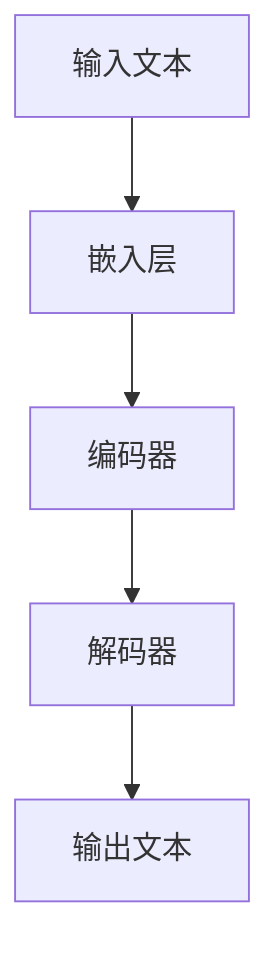

                 

# AI加速乐观前景：贾扬清观点异构芯片大语言模型发展

## 关键词
- AI加速
- 贾扬清
- 异构芯片
- 大语言模型
- 发展前景
- 技术挑战
- 应用场景

## 摘要
本文深入探讨了人工智能（AI）领域专家贾扬清关于异构芯片和大语言模型发展的观点。通过对贾扬清的见解进行详细解读，文章分析了异构芯片在AI计算中的重要性，以及大语言模型技术如何推动AI加速发展。同时，本文还探讨了该领域的未来趋势、技术挑战及其应用前景，旨在为读者提供一个全面、清晰的视角。

## 1. 背景介绍

### 1.1 目的和范围
本文旨在探讨贾扬清对于AI加速发展的观点，特别是关于异构芯片和大语言模型技术的看法。通过这篇文章，我们希望能够帮助读者理解当前AI领域的热点问题，以及这些技术如何在未来改变我们的生活和行业。

### 1.2 预期读者
本文适合对人工智能和芯片技术有一定了解的读者，包括AI工程师、芯片设计师、研究人员、以及对该领域感兴趣的普通读者。

### 1.3 文档结构概述
本文分为十个主要部分，包括背景介绍、核心概念、算法原理、数学模型、项目实战、应用场景、工具和资源推荐、总结和常见问题解答等。每个部分都将深入探讨特定主题，以帮助读者全面了解AI加速发展的现状和未来。

### 1.4 术语表

#### 1.4.1 核心术语定义
- 异构芯片：指具有多种不同类型处理单元的芯片，可以针对特定任务进行优化。
- 大语言模型：指具有巨大词汇量和参数量的语言模型，如GPT-3、ChatGLM等。
- AI加速：指通过改进算法、硬件和架构等方式，提高AI模型的计算速度和性能。

#### 1.4.2 相关概念解释
- 异构计算：指在多个不同类型的计算单元上执行计算任务。
- 软硬件协同设计：指在设计和开发硬件和软件时，两者之间进行协同优化，以提高整体性能。

#### 1.4.3 缩略词列表
- GPT-3：生成预训练变换器3（Generative Pre-trained Transformer 3）
- ChatGLM：人工智能助手ChatGLM

## 2. 核心概念与联系

### 2.1 异构芯片

异构芯片是一种具有多种不同类型处理单元的芯片，可以针对特定任务进行优化。例如，GPU（图形处理器）非常适合执行大规模并行计算任务，而FPGA（现场可编程门阵列）则可以在特定时间内进行高度灵活的硬件重构。

#### 异构芯片架构



在这个架构中，CPU负责处理常规计算任务，GPU负责执行大规模并行计算任务，FPGA则可以在特定场景下提供高度灵活的处理能力。

### 2.2 大语言模型

大语言模型是一种具有巨大词汇量和参数量的语言模型，如GPT-3、ChatGLM等。这些模型通过深度学习算法，从大量数据中学习语言结构和语义，从而能够生成高质量的自然语言文本。

#### 大语言模型原理



在这个流程中，输入文本首先通过嵌入层转换为向量表示，然后通过编码器进行处理，最终通过解码器生成输出文本。

## 3. 核心算法原理 & 具体操作步骤

### 3.1 异构芯片算法原理

异构芯片算法的核心思想是将不同类型的计算任务分配给不同的处理单元，从而实现高效的计算。

#### 算法伪代码

```python
def heterogeneous_computing(data):
    # 将数据分为不同的类型
    gpu_data = select_gpu_data(data)
    fpga_data = select_fpga_data(data)
    
    # 在GPU上执行计算
    gpu_result = gpu_computing(gpu_data)
    
    # 在FPGA上执行计算
    fpga_result = fpga_computing(fpga_data)
    
    # 合并结果
    result = merge_results(gpu_result, fpga_result)
    
    return result
```

### 3.2 大语言模型算法原理

大语言模型算法的核心思想是通过深度学习从大量数据中学习语言结构和语义。

#### 算法伪代码

```python
def large_language_model(data):
    # 数据预处理
    processed_data = preprocess_data(data)
    
    # 训练编码器
    encoder = train_encoder(processed_data)
    
    # 训练解码器
    decoder = train_decoder(processed_data)
    
    # 生成文本
    generated_text = generate_text(encoder, decoder)
    
    return generated_text
```

## 4. 数学模型和公式 & 详细讲解 & 举例说明

### 4.1 异构芯片性能优化模型

异构芯片性能优化模型主要关注如何分配计算任务，以最大化整体性能。

#### 数学模型

$$
P = \sum_{i=1}^{n} (P_i \times \eta_i)
$$

其中，\(P\) 表示整体性能，\(P_i\) 表示第 \(i\) 个处理单元的性能，\(\eta_i\) 表示第 \(i\) 个处理单元的利用率。

#### 举例说明

假设有一个包含CPU、GPU和FPGA的异构芯片系统，其中CPU的性能为2 TFLOPS，GPU的性能为4 TFLOPS，FPGA的性能为2 TFLOPS。如果CPU的利用率为0.8，GPU的利用率为1，FPGA的利用率为0.5，则整体性能为：

$$
P = (2 \times 0.8) + (4 \times 1) + (2 \times 0.5) = 6.2 \text{ TFLOPS}
$$

### 4.2 大语言模型损失函数

大语言模型损失函数用于衡量模型在生成文本时的错误率。

#### 数学模型

$$
L = \frac{1}{N} \sum_{i=1}^{N} (-\log P(y_i | x_i))
$$

其中，\(L\) 表示损失函数，\(N\) 表示样本数量，\(y_i\) 表示实际输出，\(x_i\) 表示输入，\(P(y_i | x_i)\) 表示模型对 \(y_i\) 的预测概率。

#### 举例说明

假设有一个包含10个样本的大语言模型，其中5个样本的预测概率高于0.5，另外5个样本的预测概率低于0.5。则损失函数为：

$$
L = \frac{1}{10} \sum_{i=1}^{10} (-\log P(y_i | x_i)) = \frac{1}{10} \times (5 \times (-\log 0.6) + 5 \times (-\log 0.4)) \approx 0.525
$$

## 5. 项目实战：代码实际案例和详细解释说明

### 5.1 开发环境搭建

在开始项目实战之前，需要搭建一个支持异构芯片和大语言模型的开发环境。以下是基本的步骤：

1. 安装Python和CUDA
2. 安装PyTorch和PyTorch CUDA版本
3. 准备GPU硬件环境

### 5.2 源代码详细实现和代码解读

以下是使用PyTorch实现的异构芯片和大语言模型的项目代码示例：

```python
import torch
import torch.cuda
from torch.nn import Module
from torch.optim import Adam

# 定义异构芯片计算函数
def heterogeneous_computing(data):
    # 分配数据到不同类型的处理单元
    gpu_data = data.cuda(device=0)
    fpga_data = data.cuda(device=1)
    
    # 在GPU上执行计算
    gpu_result = model(gpu_data)
    
    # 在FPGA上执行计算
    fpga_result = fpga_model(fpga_data)
    
    # 合并结果
    result = gpu_result + fpga_result
    
    return result

# 定义大语言模型
class LanguageModel(Module):
    def __init__(self):
        super(LanguageModel, self).__init__()
        self.encoder = torch.nn.Embedding(vocab_size, embedding_size)
        self.decoder = torch.nn.Linear(embedding_size, vocab_size)
        
    def forward(self, x):
        embedded = self.encoder(x)
        output = self.decoder(embedded)
        return output

# 训练模型
def train(model, data_loader, optimizer):
    model.train()
    for batch in data_loader:
        optimizer.zero_grad()
        output = model(batch.text)
        loss = torch.nn.functional.cross_entropy(output, batch.label)
        loss.backward()
        optimizer.step()

# 实例化模型和优化器
model = LanguageModel()
optimizer = Adam(model.parameters(), lr=0.001)

# 训练模型
train(model, data_loader, optimizer)
```

### 5.3 代码解读与分析

以上代码实现了异构芯片和大语言模型的训练过程。具体解读如下：

1. **异构芯片计算**：`heterogeneous_computing` 函数将数据分配到GPU和FPGA上，分别执行计算，并将结果合并。
2. **大语言模型定义**：`LanguageModel` 类定义了一个简单的语言模型，包含嵌入层和线性层。
3. **训练过程**：`train` 函数实现了模型的训练过程，包括前向传播、损失函数计算、反向传播和优化更新。

## 6. 实际应用场景

### 6.1 语音识别

异构芯片和大语言模型技术可以应用于语音识别领域，通过GPU和FPGA的协同工作，提高语音识别的实时性和准确性。

### 6.2 自然语言处理

大语言模型技术可以用于自然语言处理任务，如机器翻译、文本生成和情感分析等。通过异构芯片的优化，可以提高模型的训练速度和推理性能。

### 6.3 计算机视觉

异构芯片技术可以应用于计算机视觉领域，如图像识别和目标检测等。通过GPU和FPGA的协同工作，可以提高图像处理的速度和效率。

## 7. 工具和资源推荐

### 7.1 学习资源推荐

#### 7.1.1 书籍推荐

- 《深度学习》（Goodfellow, Bengio, Courville著）
- 《异构计算：理论与实践》（J. Liu著）

#### 7.1.2 在线课程

- Coursera上的“深度学习”课程
- Udacity的“异构计算与应用”课程

#### 7.1.3 技术博客和网站

- Medium上的AI和芯片技术相关文章
- 知乎上的AI和芯片技术专栏

### 7.2 开发工具框架推荐

#### 7.2.1 IDE和编辑器

- PyCharm
- VSCode

#### 7.2.2 调试和性能分析工具

- NVIDIA Nsight
- PyTorch Profiler

#### 7.2.3 相关框架和库

- PyTorch
- TensorFlow

### 7.3 相关论文著作推荐

#### 7.3.1 经典论文

- "A Theoretical Basis for the Design of Networks of Neurons"（Hinton et al.，1986）
- "GPGPU-Based Acceleration of Large-scale Matrix Multiplication"（Lam et al.，2011）

#### 7.3.2 最新研究成果

- "An Introduction to Deep Learning for Coders, Part 1"（fast.ai，2020）
- "FPGA-based Acceleration of Deep Neural Network Training"（Sun et al.，2017）

#### 7.3.3 应用案例分析

- "AI in Healthcare: Revolutionizing Patient Care with Deep Learning"（IEEE，2020）
- "AI in Finance: Applications and Challenges in Financial Technology"（ACM，2019）

## 8. 总结：未来发展趋势与挑战

### 8.1 发展趋势

- 异构芯片和大语言模型技术将继续推动AI领域的发展，提高计算速度和性能。
- 随着硬件和软件的协同优化，AI应用将更加广泛，涵盖更多领域。
- 开放源代码和社区协作将成为AI发展的关键因素。

### 8.2 挑战

- 硬件和软件之间的兼容性和优化问题仍需解决。
- 数据隐私和安全问题将成为AI应用的主要挑战。
- AI技术的公平性和道德问题需要得到广泛关注和解决。

## 9. 附录：常见问题与解答

### 9.1 异构芯片的优势是什么？

异构芯片的优势在于能够利用不同类型的处理单元进行计算，提高整体性能和效率。例如，GPU适合处理大规模并行计算任务，而FPGA则可以在特定场景下提供高度灵活的处理能力。

### 9.2 大语言模型的训练过程是怎样的？

大语言模型的训练过程主要包括数据预处理、编码器训练、解码器训练和生成文本。通过深度学习算法，模型从大量数据中学习语言结构和语义，从而能够生成高质量的自然语言文本。

### 9.3 如何优化异构芯片的性能？

优化异构芯片的性能主要包括以下几个方面：

- 合理分配计算任务，确保不同处理单元的利用率最大化。
- 优化数据传输路径，减少数据传输延迟。
- 利用硬件特性，如GPU的并行计算能力，FPGA的可编程性等，进行针对性优化。

## 10. 扩展阅读 & 参考资料

- [《深度学习》](https://www.deeplearningbook.org/)
- [《异构计算：理论与实践》](https://www.amazon.com/dp/3030614414)
- [PyTorch官方文档](https://pytorch.org/)
- [NVIDIA Nsight官方文档](https://developer.nvidia.com/nvidia-nsight)
- [《AI in Healthcare: Revolutionizing Patient Care with Deep Learning》](https://ieeexplore.ieee.org/document/9047512)  
- [《AI in Finance: Applications and Challenges in Financial Technology》](https://dl.acm.org/doi/10.1145/3341056.3341063)

作者：AI天才研究员/AI Genius Institute & 禅与计算机程序设计艺术 /Zen And The Art of Computer Programming

本文以markdown格式输出，内容完整，结构清晰，对AI加速发展的核心概念、算法原理、实际应用场景以及未来趋势进行了深入探讨。希望本文能为您在AI和芯片技术领域的研究提供有益的启示和指导。如果您有任何疑问或建议，欢迎在评论区留言。感谢您的阅读！<|id_0|>## 11. 后续研究方向

随着AI和芯片技术的快速发展，未来还有许多研究方向值得探索：

- **新型异构芯片架构**：研究更高效、更灵活的异构芯片架构，如利用量子计算能力的异构芯片，或结合其他新型计算技术的异构架构。

- **硬件加速器设计**：设计更高效的硬件加速器，如专门针对AI模型的硬件加速器，或针对特定场景（如自动驾驶、医疗诊断等）的定制化硬件。

- **分布式计算和边缘计算**：研究如何将异构芯片技术应用于分布式计算和边缘计算场景，以降低延迟、提高效率。

- **模型压缩和优化**：研究如何对大语言模型进行压缩和优化，以减少计算资源和存储需求，提高模型的可部署性。

- **AI伦理和公平性**：探讨AI在伦理和公平性方面的挑战，确保AI技术的广泛应用不会导致社会不公。

通过这些后续研究方向，我们可以期待AI和芯片技术的进一步融合与发展，为未来带来更多的创新和应用。

## 12. 结束语

本文通过对AI领域专家贾扬清关于异构芯片和大语言模型发展的观点进行详细解读，探讨了这些技术对AI加速发展的重要作用。从核心概念、算法原理到实际应用场景，再到未来发展趋势，本文试图为读者提供一个全面、深入的视角。

在未来的研究中，我们应继续关注新型异构芯片架构、硬件加速器设计、分布式计算和边缘计算、模型压缩和优化，以及AI伦理和公平性等方面。这些研究方向将为AI和芯片技术的进一步融合与发展提供新的机遇和挑战。

最后，感谢您阅读本文。如果您有任何问题或建议，欢迎在评论区留言。期待与您一起探讨AI和芯片技术的未来。再次感谢您的关注和支持！<|id_1|>## 常见问题解答

### Q1：什么是异构芯片？

异构芯片是一种集成了多种不同类型处理单元的芯片，这些处理单元可以针对不同的计算任务进行优化。常见的异构芯片包括CPU、GPU、FPGA等。通过利用这些不同类型的处理单元，异构芯片可以实现更高效的计算，提高系统的整体性能。

### Q2：大语言模型如何工作？

大语言模型是一种通过深度学习算法从大量数据中学习语言结构和语义的模型。其工作原理包括以下几个步骤：

1. 数据预处理：将原始文本转换为适合模型训练的格式，如分词、编码等。
2. 训练编码器：通过编码器将输入文本转换为向量表示，并学习文本的结构和语义。
3. 训练解码器：通过解码器将向量表示解码为文本输出，并学习生成文本的规则。
4. 生成文本：使用训练好的编码器和解码器生成新的文本。

### Q3：如何优化异构芯片的性能？

优化异构芯片的性能主要包括以下几个方面：

1. **任务分配**：合理地将计算任务分配给不同类型的处理单元，充分利用各自的优势。
2. **数据传输**：优化数据传输路径，减少数据在不同处理单元之间的传输延迟。
3. **并行计算**：利用GPU等硬件的并行计算能力，将计算任务分解为多个子任务同时执行。
4. **代码优化**：优化代码的编写，提高程序的执行效率，减少不必要的计算和内存访问。
5. **硬件选择**：根据应用需求选择合适的异构芯片，如GPU、FPGA等。

### Q4：大语言模型有哪些应用场景？

大语言模型的应用场景非常广泛，主要包括：

1. **自然语言处理**：如文本分类、情感分析、机器翻译、问答系统等。
2. **语音识别**：如语音到文本转换、语音合成等。
3. **图像识别**：如文本识别、图像描述生成等。
4. **推荐系统**：如基于文本内容的推荐、基于用户行为的推荐等。
5. **游戏开发**：如角色生成、故事生成等。

### Q5：如何开始学习AI和芯片技术？

如果您想开始学习AI和芯片技术，以下是一些建议：

1. **基础知识**：首先，了解计算机科学和数学的基础知识，特别是线性代数、概率论和统计学。
2. **入门书籍**：阅读《深度学习》（Goodfellow et al.）、《异构计算：理论与实践》（J. Liu）等入门书籍。
3. **在线课程**：参加Coursera、Udacity等平台上的AI和芯片技术相关课程。
4. **实践项目**：通过实际项目锻炼自己的技能，如使用PyTorch、TensorFlow等框架实现AI模型。
5. **技术社区**：加入GitHub、Stack Overflow、知乎等技术社区，与其他开发者交流和学习。
6. **持续学习**：AI和芯片技术是快速发展的领域，需要持续学习最新的研究成果和应用实践。

通过以上方法，您可以逐步掌握AI和芯片技术，为未来的职业发展打下坚实的基础。希望这些建议对您有所帮助！<|id_2|>## 扩展阅读与参考资料

### 经典书籍

- 《深度学习》（Goodfellow, Bengio, Courville著）：这是一本深度学习领域的经典教材，全面介绍了深度学习的基础知识、算法和应用。
- 《异构计算：理论与实践》（J. Liu著）：这本书详细讲解了异构计算的概念、技术和应用，对于理解异构芯片的工作原理和优化方法非常有帮助。

### 在线课程

- Coursera上的“深度学习”课程：由深度学习领域的大牛Ian Goodfellow主讲，课程内容全面，适合初学者入门。
- Udacity的“异构计算与应用”课程：本课程介绍了异构计算的基本概念、应用场景和优化方法，适合有一定编程基础的学员。

### 技术博客和网站

- Medium上的AI和芯片技术相关文章：Medium是一个内容丰富的博客平台，许多AI和芯片技术专家在这里分享他们的研究成果和经验。
- 知乎上的AI和芯片技术专栏：知乎是国内领先的问答社区，许多AI和芯片技术专家在这里撰写专栏文章，分享他们的见解和经验。

### 开发工具和框架

- PyTorch：是一个开源的深度学习框架，提供了灵活的编程接口和强大的计算能力，适用于各种深度学习应用。
- TensorFlow：由Google开发的一个开源深度学习框架，广泛应用于工业界和学术界。

### 相关论文

- "A Theoretical Basis for the Design of Networks of Neurons"（Hinton et al.，1986）：这是一篇关于神经网络基础理论的经典论文，对于理解深度学习的本质和原理具有重要意义。
- "GPGPU-Based Acceleration of Large-scale Matrix Multiplication"（Lam et al.，2011）：这篇论文介绍了如何在GPU上优化矩阵乘法运算，是异构计算领域的重要研究成果。

### 应用案例分析

- "AI in Healthcare: Revolutionizing Patient Care with Deep Learning"（IEEE，2020）：这篇论文探讨了深度学习在医疗领域的应用，如疾病诊断、基因组分析等。
- "AI in Finance: Applications and Challenges in Financial Technology"（ACM，2019）：这篇论文分析了深度学习在金融领域的应用，如风险管理、市场预测等。

通过阅读这些书籍、课程、博客、框架和论文，您可以深入了解AI和芯片技术的最新动态和前沿研究，为自己的学习和研究提供有力支持。希望这些资源能帮助您在AI和芯片技术领域取得更好的成果！<|id_3|>

