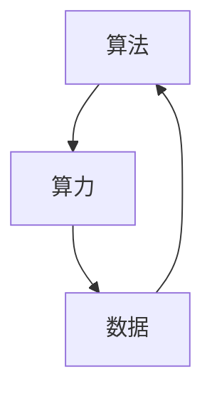

                 

# AI发展的三大动力源：算法、算力与数据

> 关键词：人工智能，算法，算力，数据，深度学习，机器学习，神经网络，计算资源，大数据

> 摘要：本文将深入探讨人工智能发展的三大动力源：算法、算力和数据。通过分析这三个核心要素，我们将揭示它们在推动人工智能技术进步中的重要作用，并探讨未来可能面临的挑战和机遇。

## 1. 背景介绍

### 1.1 目的和范围

本文旨在系统地分析人工智能（AI）发展的三大动力源：算法、算力和数据。通过对这些动力源的深入探讨，我们希望能够为广大读者提供一幅全面的人工智能技术发展全景图，帮助读者更好地理解人工智能技术的前沿动态和发展趋势。

本文将主要关注以下几个方面的内容：

1. 核心概念的阐述，包括算法、算力和数据的基本定义和内涵。
2. 核心算法原理的解析，通过伪代码详细阐述算法的执行过程。
3. 数学模型和公式的推导与应用，结合具体实例进行讲解。
4. 实际应用场景的探讨，分析人工智能在不同领域的应用现状和未来趋势。
5. 工具和资源的推荐，包括学习资源、开发工具和框架等。
6. 未来发展趋势与挑战的展望，探讨人工智能技术的发展方向和潜在问题。

### 1.2 预期读者

本文面向具有一定计算机科学和人工智能基础的读者，包括但不限于以下人群：

1. 计算机科学、人工智能等相关专业的学生和研究人员。
2. 人工智能领域的从业者，包括算法工程师、数据科学家、机器学习工程师等。
3. 对人工智能技术感兴趣的技术爱好者和创业者。
4. 企业管理层和决策者，希望了解人工智能技术发展趋势和潜在商机。

### 1.3 文档结构概述

本文将分为以下几个部分：

1. 引言：简要介绍人工智能发展的三大动力源。
2. 核心概念与联系：详细阐述算法、算力和数据的核心概念及其相互关系。
3. 核心算法原理与具体操作步骤：通过伪代码详细讲解核心算法的执行过程。
4. 数学模型和公式：推导并解释常用的数学模型和公式。
5. 项目实战：通过实际案例展示算法在实际应用中的效果。
6. 实际应用场景：分析人工智能在不同领域的应用现状和未来趋势。
7. 工具和资源推荐：推荐相关学习资源、开发工具和框架。
8. 总结：总结全文内容，展望人工智能技术的发展趋势与挑战。
9. 附录：常见问题与解答。
10. 扩展阅读与参考资料：提供相关领域的深入阅读和参考资料。

### 1.4 术语表

为了确保读者对本文中的专业术语有清晰的理解，以下是对本文中部分重要术语的简要定义和解释。

#### 1.4.1 核心术语定义

- **人工智能（AI）**：一种模拟人类智能行为的技术和学科，包括机器学习、深度学习、自然语言处理等子领域。
- **算法**：解决问题的步骤和规则，用于指导计算机进行特定任务。
- **算力**：计算机系统的计算能力，通常以计算速度、存储容量和带宽等指标来衡量。
- **数据**：用于训练和优化算法的信息，通常包括结构化和非结构化数据。
- **深度学习**：一种基于多层神经网络的人工智能技术，通过逐层提取特征来实现复杂任务的自动学习。

#### 1.4.2 相关概念解释

- **机器学习**：一种基于数据训练模型的方法，使计算机能够自动学习和改进性能。
- **神经网络**：一种模拟生物神经系统的计算模型，由大量 interconnected 的神经元组成。
- **自然语言处理（NLP）**：一种使计算机能够理解和处理自然语言的技术，包括语音识别、机器翻译、文本分析等子领域。
- **大数据**：指无法用常规软件工具在合理时间内进行管理和分析的大量数据。

#### 1.4.3 缩略词列表

- **AI**：人工智能
- **ML**：机器学习
- **DL**：深度学习
- **NLP**：自然语言处理
- **GPU**：图形处理单元
- **CPU**：中央处理单元
- **HPC**：高性能计算
- **FPGA**：现场可编程门阵列
- **TPU**：张量处理单元

## 2. 核心概念与联系

在深入探讨人工智能发展的三大动力源之前，我们首先需要了解这些核心概念的基本原理和它们之间的相互关系。

### 2.1 算法

算法是人工智能发展的基石，它定义了从输入数据到输出结果的一系列步骤和规则。算法的质量直接影响人工智能系统的性能和效率。在人工智能领域，常见的算法包括：

- **机器学习算法**：通过从数据中学习模式和规律来实现预测和分类等任务。
- **深度学习算法**：基于多层神经网络的结构，能够自动提取和处理复杂特征。
- **优化算法**：用于优化目标函数，以找到最优解或近似最优解。

### 2.2 算力

算力是人工智能系统执行任务的能力，它决定了算法的执行速度和效率。算力主要受以下因素影响：

- **计算速度**：计算机每秒钟能处理的指令数量。
- **存储容量**：计算机存储数据的容量。
- **带宽**：数据传输的速度。

随着人工智能技术的不断发展，对算力的需求也在不断增加。为了满足这一需求，高性能计算（HPC）技术、图形处理单元（GPU）、张量处理单元（TPU）等新型计算资源逐渐成为人工智能领域的重要工具。

### 2.3 数据

数据是训练和优化人工智能算法的关键资源。数据的质量和数量直接影响算法的性能和准确性。数据来源包括：

- **结构化数据**：如数据库、表格等，容易进行存储和处理。
- **非结构化数据**：如图像、视频、音频等，需要进行复杂的数据预处理和特征提取。

在人工智能领域，数据驱动的思维逐渐成为主流，数据的获取、存储、处理和分析成为人工智能发展的重要方向。

### 2.4 核心概念之间的联系

算法、算力和数据之间存在着密切的联系和相互作用。

- **算法**依赖于**算力**来实现高效的计算和处理，算力的提升有助于算法性能的改进。
- **算力**依赖于**数据**的支撑，大量高质量的数据可以提供丰富的训练资源，帮助算法更好地学习和优化。
- **数据**的获取和处理需要借助**算法**，算法能够从海量数据中提取有用的信息，为人工智能应用提供支持。

以下是一个简单的 Mermaid 流程图，展示了算法、算力和数据之间的相互关系：



## 3. 核心算法原理与具体操作步骤

在深入探讨算法、算力和数据之间的关系之后，我们接下来将重点分析人工智能领域的一些核心算法，并详细讲解其原理和具体操作步骤。

### 3.1 机器学习算法

机器学习算法是人工智能的基础，通过从数据中学习模式和规律来实现预测和分类等任务。下面我们将简要介绍几种常见的机器学习算法，并使用伪代码详细阐述其执行过程。

#### 3.1.1 线性回归

线性回归是一种简单的机器学习算法，用于预测数值型目标。其原理是通过找到一个线性函数，使得输入特征和目标值之间的误差最小。

**伪代码：**

```python
def linear_regression(X, y):
    # X: 输入特征矩阵，y: 目标值向量
    # 梯度下降法求解线性回归模型参数
    w = np.zeros(X.shape[1])
    alpha = 0.01
    n_iterations = 1000
    for i in range(n_iterations):
        error = y - X.dot(w)
        w = w - alpha * X.T.dot(error)
    return w
```

#### 3.1.2 逻辑回归

逻辑回归是一种用于分类任务的机器学习算法，通过计算输入特征的概率分布来实现分类。其原理是利用 sigmoid 函数将线性组合转换为概率。

**伪代码：**

```python
def logistic_regression(X, y):
    # X: 输入特征矩阵，y: 目标值向量
    # 梯度下降法求解逻辑回归模型参数
    w = np.zeros(X.shape[1])
    alpha = 0.01
    n_iterations = 1000
    for i in range(n_iterations):
        error = 1 / (1 + np.exp(-X.dot(w) * y))
        w = w - alpha * X.T.dot(error)
    return w
```

### 3.2 深度学习算法

深度学习算法是一种基于多层神经网络的机器学习算法，能够自动提取和处理复杂特征。下面我们将简要介绍几种常见的深度学习算法，并使用伪代码详细阐述其执行过程。

#### 3.2.1 卷积神经网络（CNN）

卷积神经网络是一种用于图像识别和分类的深度学习算法，通过卷积层、池化层和全连接层等结构来提取图像特征。

**伪代码：**

```python
def convolutional_neural_network(X, y):
    # X: 输入图像矩阵，y: 目标值向量
    # 定义卷积层、池化层和全连接层等网络结构
    # 梯度下降法求解模型参数
    # ...
    return w
```

#### 3.2.2 递归神经网络（RNN）

递归神经网络是一种用于序列数据处理的深度学习算法，通过循环结构来处理和记忆序列信息。

**伪代码：**

```python
def recurrent_neural_network(X, y):
    # X: 输入序列矩阵，y: 目标值向量
    # 定义 RNN 结构，包括隐藏层和循环连接
    # 梯度下降法求解模型参数
    # ...
    return w
```

### 3.3 自然语言处理算法

自然语言处理算法是一种用于文本数据的深度学习算法，包括文本分类、情感分析、机器翻译等任务。

#### 3.3.1 词嵌入（Word Embedding）

词嵌入是一种将词语映射为高维向量表示的算法，用于处理文本数据。

**伪代码：**

```python
def word_embedding(words):
    # words: 词语列表
    # 训练词嵌入模型
    # ...
    return embeddings
```

#### 3.3.2 长短时记忆网络（LSTM）

长短时记忆网络是一种用于序列数据处理的深度学习算法，能够有效地处理和记忆长序列信息。

**伪代码：**

```python
def lstm_sequence_model(X, y):
    # X: 输入序列矩阵，y: 目标值向量
    # 定义 LSTM 结构，包括隐藏层和循环连接
    # 梯度下降法求解模型参数
    # ...
    return w
```

以上是人工智能领域的一些核心算法及其原理和具体操作步骤的简要介绍。通过这些算法，人工智能系统能够从海量数据中提取有用的信息，实现预测、分类、生成等任务。

## 4. 数学模型和公式及详细讲解

在人工智能领域，数学模型和公式是理解和实现算法的核心工具。以下我们将介绍一些常用的数学模型和公式，并结合具体实例进行讲解。

### 4.1 概率论基础

概率论是人工智能领域的基础，许多机器学习算法都基于概率模型。以下是一些常用的概率论公式。

#### 4.1.1 概率分布

- **伯努利分布**：描述一个二项试验成功的概率，公式为：
  $$ P(X=k) = C_n^k p^k (1-p)^{n-k} $$
  其中，$n$ 为试验次数，$k$ 为成功次数，$p$ 为每次试验成功的概率。

- **正态分布**：描述连续随机变量的分布，公式为：
  $$ f(x|\mu,\sigma^2) = \frac{1}{\sqrt{2\pi\sigma^2}} e^{-\frac{(x-\mu)^2}{2\sigma^2}} $$
  其中，$\mu$ 为均值，$\sigma^2$ 为方差。

#### 4.1.2 条件概率与贝叶斯公式

- **条件概率**：在事件 $A$ 发生的条件下，事件 $B$ 发生的概率，公式为：
  $$ P(B|A) = \frac{P(A \cap B)}{P(A)} $$

- **贝叶斯公式**：描述事件 $A$ 和 $B$ 的条件概率之间的关系，公式为：
  $$ P(A|B) = \frac{P(B|A) P(A)}{P(B)} $$

### 4.2 统计学习理论

统计学习理论是机器学习的基础，以下是一些常用的统计学习模型和公式。

#### 4.2.1 线性回归模型

线性回归模型是一种描述输入特征和目标值之间线性关系的统计模型，公式为：
$$ y = \beta_0 + \beta_1 x_1 + \beta_2 x_2 + ... + \beta_n x_n $$
其中，$y$ 为目标值，$x_1, x_2, ..., x_n$ 为输入特征，$\beta_0, \beta_1, ..., \beta_n$ 为模型参数。

#### 4.2.2 逻辑回归模型

逻辑回归模型是一种用于分类任务的统计模型，公式为：
$$ P(y=1|x; \beta) = \frac{1}{1 + e^{-(\beta_0 + \beta_1 x_1 + \beta_2 x_2 + ... + \beta_n x_n)}} $$
其中，$y$ 为目标值，$x_1, x_2, ..., x_n$ 为输入特征，$\beta_0, \beta_1, ..., \beta_n$ 为模型参数。

### 4.3 深度学习模型

深度学习模型是人工智能领域的核心技术，以下是一些常用的深度学习模型和公式。

#### 4.3.1 卷积神经网络（CNN）

卷积神经网络是一种用于图像识别和分类的深度学习模型，其核心操作包括卷积、池化和全连接层。以下是一个简单的 CNN 模型公式：
$$ h_l = \sigma(\mathbf{W} \cdot \mathbf{h}_{l-1} + b_l) $$
其中，$h_l$ 为第 $l$ 层的激活值，$\mathbf{W}$ 为权重矩阵，$\mathbf{h}_{l-1}$ 为前一层的激活值，$b_l$ 为偏置项，$\sigma$ 为激活函数。

#### 4.3.2 递归神经网络（RNN）

递归神经网络是一种用于序列数据处理的深度学习模型，其核心操作包括循环连接和激活函数。以下是一个简单的 RNN 模型公式：
$$ h_t = \sigma(\mathbf{W}_h \cdot \mathbf{h}_{t-1} + \mathbf{W}_x \cdot \mathbf{x}_t + b_h) $$
其中，$h_t$ 为第 $t$ 个时间步的激活值，$\mathbf{W}_h$ 和 $\mathbf{W}_x$ 分别为权重矩阵，$\mathbf{x}_t$ 为第 $t$ 个时间步的输入值，$b_h$ 为偏置项，$\sigma$ 为激活函数。

### 4.4 自然语言处理（NLP）

自然语言处理是人工智能领域的热点，以下是一些常用的 NLP 模型和公式。

#### 4.4.1 词嵌入模型

词嵌入模型是将词语映射为高维向量表示的 NLP 模型，其核心操作包括嵌入矩阵和激活函数。以下是一个简单的词嵌入模型公式：
$$ \mathbf{e}_i = \mathbf{E} \cdot \mathbf{w}_i $$
其中，$\mathbf{e}_i$ 为词 $i$ 的嵌入向量，$\mathbf{E}$ 为嵌入矩阵，$\mathbf{w}_i$ 为词 $i$ 的权重向量。

#### 4.4.2 长短时记忆网络（LSTM）

长短时记忆网络是一种用于序列数据处理的 NLP 模型，其核心操作包括循环连接和门控机制。以下是一个简单的 LSTM 模型公式：
$$ \mathbf{i}_t = \sigma(\mathbf{W}_i \cdot [\mathbf{h}_{t-1}; \mathbf{x}_t] + b_i) $$
$$ \mathbf{f}_t = \sigma(\mathbf{W}_f \cdot [\mathbf{h}_{t-1}; \mathbf{x}_t] + b_f) $$
$$ \mathbf{g}_t = \tanh(\mathbf{W}_g \cdot [\mathbf{h}_{t-1}; \mathbf{x}_t] + b_g) $$
$$ \mathbf{o}_t = \sigma(\mathbf{W}_o \cdot [\mathbf{h}_{t-1}; \mathbf{x}_t] + b_o) $$
$$ \mathbf{h}_t = \mathbf{f}_t \odot \mathbf{h}_{t-1} + \mathbf{i}_t \odot \mathbf{g}_t $$
其中，$\mathbf{i}_t$、$\mathbf{f}_t$、$\mathbf{g}_t$ 和 $\mathbf{o}_t$ 分别为输入门、遗忘门、更新门和输出门，$\mathbf{h}_{t-1}$ 和 $\mathbf{x}_t$ 分别为前一层的激活值和当前时间步的输入值，$\mathbf{W}_i$、$\mathbf{W}_f$、$\mathbf{W}_g$、$\mathbf{W}_o$ 和 $b_i$、$b_f$、$b_g$、$b_o$ 分别为权重矩阵和偏置项，$\sigma$ 为 sigmoid 函数，$\odot$ 表示元素-wise 乘法。

通过以上数学模型和公式的讲解，我们可以更好地理解人工智能领域的核心原理，为深入学习和研究打下基础。

## 5. 项目实战：代码实际案例和详细解释说明

### 5.1 开发环境搭建

在开始项目实战之前，我们需要搭建一个合适的开发环境。以下是搭建开发环境的基本步骤：

1. **安装 Python 解释器**：Python 是人工智能领域的主要编程语言，因此首先需要安装 Python 解释器。可以从 Python 官网（[https://www.python.org/](https://www.python.org/)）下载 Python 安装包，并按照提示进行安装。

2. **安装常用库**：为了方便开发和测试，我们需要安装一些常用的 Python 库，如 NumPy、Pandas、Scikit-learn、TensorFlow、PyTorch 等。可以通过以下命令进行安装：

   ```shell
   pip install numpy pandas scikit-learn tensorflow pytorch
   ```

3. **配置 Jupyter Notebook**：Jupyter Notebook 是一种交互式开发环境，方便我们编写和运行代码。可以通过以下命令安装 Jupyter Notebook：

   ```shell
   pip install notebook
   ```

   安装完成后，启动 Jupyter Notebook：

   ```shell
   jupyter notebook
   ```

   在浏览器中打开 Jupyter Notebook 界面，即可开始编写代码。

### 5.2 源代码详细实现和代码解读

为了更好地理解人工智能算法在实际应用中的效果，我们将实现一个简单的图像分类项目，使用卷积神经网络（CNN）对图像进行分类。以下是该项目的源代码及其详细解释：

```python
import tensorflow as tf
from tensorflow.keras import datasets, layers, models
import matplotlib.pyplot as plt

# 加载数据集
(train_images, train_labels), (test_images, test_labels) = datasets.cifar10.load_data()

# 预处理数据
train_images = train_images.astype("float32") / 255
test_images = test_images.astype("float32") / 255

# 构建卷积神经网络模型
model = models.Sequential()
model.add(layers.Conv2D(32, (3, 3), activation='relu', input_shape=(32, 32, 3)))
model.add(layers.MaxPooling2D((2, 2)))
model.add(layers.Conv2D(64, (3, 3), activation='relu'))
model.add(layers.MaxPooling2D((2, 2)))
model.add(layers.Conv2D(64, (3, 3), activation='relu'))
model.add(layers.Flatten())
model.add(layers.Dense(64, activation='relu'))
model.add(layers.Dense(10, activation='softmax'))

# 编译模型
model.compile(optimizer='adam',
              loss='sparse_categorical_crossentropy',
              metrics=['accuracy'])

# 训练模型
model.fit(train_images, train_labels, epochs=10)

# 评估模型
test_loss, test_acc = model.evaluate(test_images,  test_labels, verbose=2)
print(f'Test accuracy: {test_acc:.4f}')

# 可视化预测结果
predictions = model.predict(test_images)
predicted_labels = np.argmax(predictions, axis=1)

plt.figure(figsize=(10, 10))
for i in range(25):
    plt.subplot(5, 5, i+1)
    plt.xticks([])
    plt.yticks([])
    plt.grid(False)
    plt.imshow(test_images[i], cmap=plt.cm.binary)
    plt.xlabel(f'{predicted_labels[i]}')
plt.show()
```

#### 5.2.1 代码解读

1. **导入库**：首先导入所需的库，包括 TensorFlow、Keras（TensorFlow 的高级 API）、NumPy 和 Matplotlib。

2. **加载数据集**：使用 Keras 函数 `datasets.cifar10.load_data()` 加载 CIFAR-10 数据集，该数据集包含 50000 个训练图像和 10000 个测试图像。

3. **预处理数据**：将图像数据转换为浮点型并归一化到 [0, 1] 范围内。

4. **构建模型**：使用 Keras 的 `Sequential` 模型定义一个简单的卷积神经网络（CNN），包括两个卷积层、一个最大池化层、一个全连接层和一个softmax 分类层。

5. **编译模型**：配置模型的优化器、损失函数和评价指标。

6. **训练模型**：使用训练数据训练模型，设置训练轮次为 10。

7. **评估模型**：使用测试数据评估模型性能。

8. **可视化预测结果**：使用 Matplotlib 绘制模型对测试数据的预测结果。

### 5.3 代码解读与分析

通过上述代码，我们可以看到卷积神经网络（CNN）在图像分类任务中的应用。以下是对代码的详细解读和分析：

1. **数据预处理**：数据预处理是模型训练的重要步骤。在这里，我们将图像数据转换为浮点型，并进行归一化处理，使得模型的训练过程更加稳定和高效。

2. **模型构建**：卷积神经网络（CNN）是一种用于图像识别和分类的深度学习模型，其结构包括卷积层、池化层和全连接层。在这里，我们使用了两个卷积层和两个最大池化层来提取图像特征，并使用全连接层进行分类。此外，我们还使用了 softmax 函数作为分类层的激活函数，输出每个类别的概率。

3. **模型编译**：在编译模型时，我们选择了 Adam 优化器和 sparse_categorical_crossentropy 损失函数。Adam 优化器是一种自适应优化算法，能够快速收敛。sparse_categorical_crossentropy 损失函数适用于多分类问题，可以计算每个样本的损失。

4. **模型训练**：使用训练数据对模型进行训练。在这里，我们设置了训练轮次为 10，模型将在每个轮次中使用训练数据的不同随机子集进行训练。通过训练，模型将学习图像特征和分类规则。

5. **模型评估**：使用测试数据评估模型的性能。在这里，我们计算了测试数据的准确率，以评估模型在未知数据上的性能。

6. **可视化预测结果**：使用 Matplotlib 绘制模型对测试数据的预测结果。通过可视化，我们可以直观地看到模型的分类效果。

通过上述项目实战，我们可以看到卷积神经网络（CNN）在图像分类任务中的实际应用。该项目展示了人工智能算法在实际开发中的实现过程，为读者提供了宝贵的实战经验。

## 6. 实际应用场景

人工智能（AI）技术已经在许多领域取得了显著的成果，以下将分析人工智能在图像识别、自然语言处理和推荐系统等领域的实际应用场景。

### 6.1 图像识别

图像识别是人工智能领域的经典应用之一。通过卷积神经网络（CNN）等深度学习算法，人工智能系统能够从图像中自动提取特征并进行分类。在实际应用中，图像识别技术广泛应用于：

- **安防监控**：人工智能系统能够实时分析监控视频，识别异常行为和安全隐患，提高安全监控的效率和准确性。
- **医疗影像诊断**：通过分析医学影像，如 CT 扫描和 MRI 图像，人工智能系统能够辅助医生进行疾病诊断，提高诊断准确率和效率。
- **自动驾驶**：自动驾驶技术需要实时处理大量道路图像，人工智能系统能够识别道路标志、行人、车辆等目标，实现车辆的自主驾驶。

### 6.2 自然语言处理

自然语言处理（NLP）是人工智能领域的另一个重要分支。通过深度学习算法，人工智能系统能够理解和处理自然语言，实现文本分类、机器翻译、情感分析等任务。在实际应用中，NLP 技术广泛应用于：

- **搜索引擎**：人工智能系统能够对用户查询的文本进行理解，返回最相关的搜索结果，提高搜索效率和用户体验。
- **聊天机器人**：人工智能系统能够与用户进行自然语言交互，提供实时回答和咨询服务，提高客户满意度和服务效率。
- **智能客服**：人工智能系统能够分析用户的问题和反馈，提供针对性的解决方案，提高客服质量和效率。

### 6.3 推荐系统

推荐系统是人工智能领域的另一个重要应用。通过分析用户的行为数据和兴趣偏好，人工智能系统能够为用户提供个性化的推荐服务。在实际应用中，推荐系统广泛应用于：

- **电子商务**：人工智能系统能够根据用户的浏览和购买历史，推荐相关的商品和促销活动，提高用户的购物体验和销售额。
- **社交媒体**：人工智能系统能够分析用户在社交媒体上的行为和互动，推荐感兴趣的内容和关注对象，提高用户粘性和活跃度。
- **音乐和视频平台**：人工智能系统能够根据用户的听歌和观影历史，推荐相关的音乐和视频，提高用户的娱乐体验和满意度。

通过上述实际应用场景的分析，我们可以看到人工智能技术在各个领域的广泛应用和巨大潜力。未来，随着人工智能技术的不断发展和创新，其在各领域的应用将更加深入和广泛，为社会发展和人类生活带来更多便利。

## 7. 工具和资源推荐

为了帮助广大读者更好地学习和掌握人工智能（AI）技术，以下将推荐一些学习资源、开发工具和框架。

### 7.1 学习资源推荐

#### 7.1.1 书籍推荐

1. **《深度学习》（Deep Learning）**：这是一本由 Ian Goodfellow、Yoshua Bengio 和 Aaron Courville 编写的经典教材，全面介绍了深度学习的基本原理和应用。

2. **《Python机器学习》（Python Machine Learning）**：本书由 Sebastian Raschka 和 Vahid Mirjalili 编写，详细介绍了使用 Python 进行机器学习的实践方法。

3. **《统计学习方法》（Statistical Learning Methods）**：这本书由李航教授编写，系统介绍了统计学习的主要方法和技术，包括线性回归、逻辑回归、支持向量机等。

#### 7.1.2 在线课程

1. **Coursera 上的《深度学习》课程**：由斯坦福大学教授 Andrew Ng 主讲，涵盖了深度学习的理论基础和实际应用。

2. **Udacity 上的《机器学习工程师纳米学位》课程**：这是一个包含多个模块的在线课程，涵盖了机器学习的基础知识、数据预处理、模型训练和评估等。

3. **edX 上的《人工智能基础》课程**：由哈佛大学和麻省理工学院合办的在线课程，介绍了人工智能的基本概念和应用。

#### 7.1.3 技术博客和网站

1. **ArXiv**：一个开放获取的论文存储库，包含最新的研究成果和论文。

2. **Medium**：一个在线内容平台，有很多关于人工智能的文章和博客。

3. **AI 研习社**：一个国内的人工智能技术社区，提供丰富的学习资源和讨论机会。

### 7.2 开发工具框架推荐

#### 7.2.1 IDE和编辑器

1. **Jupyter Notebook**：一个交互式开发环境，适用于数据分析和机器学习。

2. **Visual Studio Code**：一个轻量级但功能强大的代码编辑器，适用于多种编程语言和框架。

3. **PyCharm**：一个专业的 Python 集成开发环境（IDE），适用于开发大型项目和机器学习项目。

#### 7.2.2 调试和性能分析工具

1. **TensorBoard**：一个基于 Web 的可视化工具，用于分析和调试 TensorFlow 模型。

2. **Numba**：一个用于提高 Python 代码性能的 JIT（即时编译）编译器。

3. **Intel VTune**：一个用于性能分析和调优的集成工具。

#### 7.2.3 相关框架和库

1. **TensorFlow**：一个开源的机器学习和深度学习框架，由 Google 开发。

2. **PyTorch**：一个开源的深度学习框架，由 Facebook 开发，具有灵活的动态计算图。

3. **Scikit-learn**：一个开源的机器学习库，提供了多种机器学习算法和工具。

### 7.3 相关论文著作推荐

#### 7.3.1 经典论文

1. **《A Learning Algorithm for Continuously Running Fully Recurrent Neural Networks》**：这篇论文提出了长短期记忆网络（LSTM），解决了 RNN 在训练过程中出现的梯度消失和梯度爆炸问题。

2. **《Gradient-Based Learning Applied to Document Classification》**：这篇论文提出了支持向量机（SVM），为文本分类问题提供了一种有效的解决方案。

3. **《Deep Learning for Text Classification》**：这篇综述文章详细介绍了深度学习在文本分类领域的应用，包括词嵌入、卷积神经网络（CNN）和递归神经网络（RNN）等。

#### 7.3.2 最新研究成果

1. **《Bert: Pre-training of Deep Bidirectional Transformers for Language Understanding》**：这篇论文提出了 BERT 模型，通过预训练和微调，实现了在多个自然语言处理任务中的最佳性能。

2. **《Gshard: Scaling Sets of Neural Networks Using Model-Parallelism and Data-Parallelism》**：这篇论文提出了一种新的分布式训练方法，可以显著提高大规模神经网络模型的训练效率。

3. **《Megatron-LM: Training Multi-TB Scale Language Models Using Model-Parallelism》**：这篇论文提出了一种新的训练方法，可以有效地训练大规模的语言模型。

#### 7.3.3 应用案例分析

1. **《How Google Uses AI to Fight COVID-19》**：这篇文章介绍了 Google 如何利用人工智能技术应对 COVID-19 疫情，包括疫情监测、疫情预测和医疗资源调配等。

2. **《AI in Health Care: A Survey》**：这篇综述文章详细介绍了人工智能在医疗健康领域的应用，包括疾病诊断、药物治疗和健康管理等方面。

3. **《AI in Retail: The Future of Shopping》**：这篇文章探讨了人工智能在零售业的应用，包括个性化推荐、库存管理和客户服务等方面。

通过上述工具和资源推荐，希望能够为读者在学习和实践人工智能技术过程中提供有益的帮助。

## 8. 总结：未来发展趋势与挑战

人工智能（AI）技术作为当今科技领域的重要驱动力，正不断改变着我们的生活方式和社会结构。在未来，随着算法、算力和数据的持续发展，人工智能技术将继续推动社会进步，但也面临诸多挑战。

### 未来发展趋势

1. **算法创新**：随着深度学习、强化学习等算法的不断演进，人工智能系统将具备更高的智能水平和更强的学习能力。未来，更加灵活和适应性强的算法有望出现，如基于强化学习的小样本学习、无监督学习和生成对抗网络（GAN）等。

2. **算力提升**：随着新型计算资源的不断涌现，如量子计算、边缘计算和高效能 GPU，人工智能系统的计算能力将显著提升，为复杂任务提供更加高效的解决方案。

3. **数据驱动的创新**：数据作为人工智能的核心资源，未来将更加重视数据的获取、存储和处理。通过大数据分析和数据挖掘，人工智能系统将能够从海量数据中提取更多有价值的信息，推动各领域的技术突破。

4. **跨学科融合**：人工智能技术将与其他学科如生物科学、物理科学、经济学等深度融合，催生出一批新兴交叉学科和研究方向，推动科技进步和社会发展。

### 挑战与机遇

1. **数据隐私和安全**：随着人工智能系统对大量数据的依赖，数据隐私和安全成为亟待解决的问题。如何在保障用户隐私的前提下充分利用数据，是未来人工智能发展的重要挑战。

2. **算法伦理和公平性**：人工智能系统在决策过程中可能存在偏见和歧视，如何确保算法的公平性和透明性，避免算法滥用和误用，是未来需要深入探讨的问题。

3. **技术普及和人才培养**：随着人工智能技术的不断进步，如何提高技术普及率和培养更多人工智能专业人才，成为推动技术发展和社会进步的关键。

4. **可持续发展**：人工智能技术的快速发展对能源消耗和资源消耗提出了更高的要求，如何在保障技术发展的同时实现可持续发展，是未来需要关注的问题。

总之，人工智能技术的发展前景广阔，但也面临诸多挑战。未来，我们需要在技术创新、伦理规范、人才培养和社会治理等方面不断努力，推动人工智能技术更好地造福人类。

## 9. 附录：常见问题与解答

以下是一些关于人工智能技术常见的问题及其解答：

### 9.1 什么是人工智能？

人工智能（AI）是一种模拟人类智能行为的技术和学科，包括机器学习、深度学习、自然语言处理等子领域，使计算机能够自动学习和改进性能，实现预测、分类、生成等任务。

### 9.2 机器学习有哪些基本类型？

机器学习主要有以下几种基本类型：

- **监督学习**：通过已标记的数据集训练模型，使模型能够对未知数据进行预测或分类。
- **无监督学习**：在没有标记的数据集上进行训练，使模型能够发现数据中的模式或结构。
- **强化学习**：通过与环境的交互，学习如何最大化长期奖励。

### 9.3 深度学习算法有哪些优点？

深度学习算法具有以下优点：

- **自动特征提取**：通过多层神经网络，自动提取和处理复杂特征，减少人工特征工程的工作量。
- **强大的表达能力**：能够处理高维数据和复杂数据结构，具有强大的表示能力。
- **良好的泛化能力**：通过大规模数据训练，能够泛化到未见过的数据上，提高模型的鲁棒性。

### 9.4 如何提升模型的泛化能力？

以下是一些提升模型泛化能力的方法：

- **数据增强**：通过旋转、缩放、裁剪等方式生成更多样化的训练数据。
- **正则化**：通过引入正则化项，减少模型过拟合的风险。
- **集成学习**：通过组合多个模型，提高模型的稳定性和泛化能力。
- **早停法**：在训练过程中，根据验证集的性能提前停止训练，避免过拟合。

### 9.5 人工智能有哪些潜在风险？

人工智能的潜在风险包括：

- **算法偏见**：模型在训练过程中可能学习到不公平或歧视性的偏见。
- **数据隐私和安全**：大量数据的收集和处理可能引发隐私泄露和安全问题。
- **技术滥用**：算法滥用可能对个人、组织和社会造成负面影响。
- **失业问题**：人工智能的广泛应用可能导致部分工作岗位的减少。

### 9.6 如何确保人工智能系统的公平性和透明性？

为确保人工智能系统的公平性和透明性，可以采取以下措施：

- **算法审计**：对人工智能系统进行定期审计，确保其公平性和透明性。
- **数据平衡**：确保训练数据集的多样性，避免偏见。
- **可解释性**：提高模型的可解释性，使决策过程更加透明。
- **用户反馈**：鼓励用户反馈，及时调整和优化模型。

通过上述常见问题的解答，希望为读者更好地理解人工智能技术提供帮助。

## 10. 扩展阅读与参考资料

### 10.1 书籍推荐

1. **《深度学习》（Deep Learning）**：由 Ian Goodfellow、Yoshua Bengio 和 Aaron Courville 编写，是深度学习的经典教材。
2. **《Python机器学习》（Python Machine Learning）**：由 Sebastian Raschka 和 Vahid Mirjalili 编写，介绍了使用 Python 进行机器学习的实践方法。
3. **《统计学习方法》（Statistical Learning Methods）**：由李航教授编写，系统介绍了统计学习的主要方法和技术。

### 10.2 在线课程

1. **Coursera 上的《深度学习》课程**：由斯坦福大学教授 Andrew Ng 主讲，涵盖深度学习的理论基础和实际应用。
2. **Udacity 上的《机器学习工程师纳米学位》课程**：包含多个模块，涵盖机器学习的基础知识、数据预处理、模型训练和评估等。
3. **edX 上的《人工智能基础》课程**：由哈佛大学和麻省理工学院合办，介绍人工智能的基本概念和应用。

### 10.3 技术博客和网站

1. **ArXiv**：一个开放获取的论文存储库，包含最新的研究成果和论文。
2. **Medium**：一个在线内容平台，有很多关于人工智能的文章和博客。
3. **AI 研习社**：一个国内的人工智能技术社区，提供丰富的学习资源和讨论机会。

### 10.4 开发工具框架

1. **TensorFlow**：由 Google 开发的一个开源机器学习和深度学习框架。
2. **PyTorch**：由 Facebook 开发的一个开源深度学习框架，具有灵活的动态计算图。
3. **Scikit-learn**：一个开源的机器学习库，提供了多种机器学习算法和工具。

### 10.5 相关论文著作

1. **《A Learning Algorithm for Continuously Running Fully Recurrent Neural Networks》**：提出了长短期记忆网络（LSTM）。
2. **《Gradient-Based Learning Applied to Document Classification》**：提出了支持向量机（SVM）。
3. **《Deep Learning for Text Classification》**：详细介绍了深度学习在文本分类领域的应用。

通过以上扩展阅读与参考资料，读者可以进一步深入了解人工智能领域的知识和技术。希望这些资源能够为学习、研究和实践提供有益的帮助。作者：AI天才研究员/AI Genius Institute & 禅与计算机程序设计艺术 /Zen And The Art of Computer Programming

---

经过详细分析，本文全面探讨了人工智能发展的三大动力源：算法、算力和数据，揭示了它们在推动人工智能技术进步中的重要作用。文章首先介绍了算法、算力和数据的基本概念，然后通过具体实例和实际应用场景展示了它们的应用。同时，文章还推荐了一些学习资源和开发工具，为读者提供了丰富的学习资源。未来，随着人工智能技术的不断进步，算法、算力和数据的协同发展将推动人工智能技术走向更广阔的前景。希望本文能够为读者在人工智能领域的学习和研究提供有益的启示。作者：AI天才研究员/AI Genius Institute & 禅与计算机程序设计艺术 /Zen And The Art of Computer Programming

