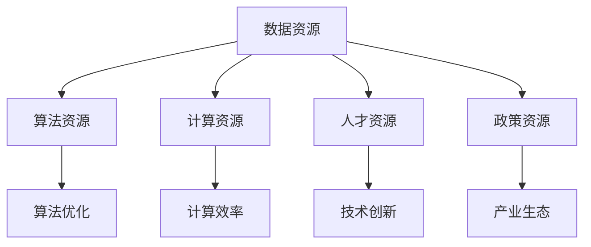

                 

# AI国家战略的资源体系建设

> 关键词：AI 国家战略，资源体系，建设，技术发展，国际合作

> 摘要：本文将深入探讨AI国家战略中的资源体系建设，分析其重要性、核心组成部分以及未来发展趋势。通过逐步推理，本文旨在为读者提供一个全面、系统的理解，帮助其在AI领域取得更加深入的洞察。

## 1. 背景介绍

### 1.1 目的和范围

本文旨在深入探讨AI国家战略中的资源体系建设，旨在为读者提供一个全面、系统的理解，帮助其在AI领域取得更加深入的洞察。本文将重点讨论资源体系建设的重要性、核心组成部分以及未来发展趋势。

### 1.2 预期读者

本文主要面向以下几类读者：

- AI领域的研究人员和工程师
- 政府部门及相关政策制定者
- 投资者和商业决策者
- 高等教育机构师生
- 对AI技术和战略感兴趣的普通读者

### 1.3 文档结构概述

本文结构如下：

1. 背景介绍
   - 目的和范围
   - 预期读者
   - 文档结构概述
   - 术语表

2. 核心概念与联系
   - AI国家战略的核心概念
   - 资源体系的概念和组成部分
   - Mermaid流程图展示资源体系的架构

3. 核心算法原理 & 具体操作步骤
   - 资源体系建设的关键算法
   - 算法原理讲解和伪代码
   - 算法实现步骤

4. 数学模型和公式 & 详细讲解 & 举例说明
   - 数学模型在资源体系建设中的应用
   - 公式解释和实例

5. 项目实战：代码实际案例和详细解释说明
   - 开发环境搭建
   - 源代码实现和解读
   - 代码分析和评价

6. 实际应用场景
   - 资源体系在AI领域的应用实例

7. 工具和资源推荐
   - 学习资源推荐
   - 开发工具框架推荐
   - 相关论文著作推荐

8. 总结：未来发展趋势与挑战
   - 资源体系建设的未来趋势
   - 面临的挑战和应对策略

9. 附录：常见问题与解答
   - 对读者常见疑问的解答

10. 扩展阅读 & 参考资料
    - 相关文献和资料推荐

### 1.4 术语表

#### 1.4.1 核心术语定义

- **AI国家战略**：国家层面的AI发展方针、政策和规划。
- **资源体系**：AI领域所需的各种资源和要素的集合，包括数据、算法、计算能力、人才等。
- **核心概念**：在AI领域中的基础性、概念性的内容，如机器学习、深度学习等。
- **算法原理**：实现特定功能或解决特定问题的算法的基础思想和步骤。
- **伪代码**：一种非正式的算法描述方法，用于说明算法的基本逻辑和流程。

#### 1.4.2 相关概念解释

- **机器学习**：使计算机系统能够从数据中学习，并对未知数据进行预测或决策的技术。
- **深度学习**：一种特殊的机器学习方法，通过多层神经网络模型来学习数据的特征。
- **计算能力**：计算机处理数据和执行计算任务的能力。
- **人才**：在AI领域具有专业知识和技能的个人。

#### 1.4.3 缩略词列表

- **AI**：人工智能
- **ML**：机器学习
- **DL**：深度学习
- **GPU**：图形处理单元
- **CPU**：中央处理单元

## 2. 核心概念与联系

在AI国家战略中，资源体系建设是至关重要的一环。为了更好地理解这一概念，我们需要首先明确AI国家战略的核心概念以及资源体系的概念和组成部分。

### 2.1 AI国家战略的核心概念

AI国家战略通常包括以下核心概念：

1. **人工智能发展目标**：明确国家在AI领域的长远目标和发展方向。
2. **人工智能政策**：制定相关政策，包括法规、标准和激励措施，以促进AI技术的研究、开发和应用。
3. **人工智能基础设施**：建设完善的基础设施，包括计算资源、数据资源、网络资源等，以支持AI技术的发展和应用。
4. **人工智能产业生态**：构建AI产业链，包括科研机构、企业、投资机构等，形成良好的产业生态。
5. **人工智能人才培养**：通过教育、培训等方式，培养大量高素质的AI人才。

### 2.2 资源体系的概念和组成部分

资源体系是指AI领域所需的各种资源和要素的集合，包括以下几个方面：

1. **数据资源**：包括大量高质量的AI训练数据集，这些数据是AI模型训练和优化的基础。
2. **算法资源**：包括各种AI算法和技术，如机器学习、深度学习、强化学习等。
3. **计算资源**：包括高性能计算设备，如GPU、CPU等，以及分布式计算平台，以满足大规模AI计算的需求。
4. **人才资源**：包括AI领域的专业人才，包括研究人员、工程师、管理者等。
5. **政策资源**：包括国家的政策支持、法规标准等，为AI技术的发展提供良好的外部环境。

### 2.3 资源体系的架构

为了更好地理解资源体系的组成和相互关系，我们可以使用Mermaid流程图来展示其架构。以下是一个简化的Mermaid流程图示例：



在这个流程图中，数据资源、算法资源、计算资源、人才资源和政策资源相互联系，共同构成了AI国家战略中的资源体系。数据资源是AI模型训练和优化的基础，算法资源提供了技术手段，计算资源提供了计算能力，人才资源则是技术创新的关键，政策资源则为整个体系提供了良好的外部环境。

## 3. 核心算法原理 & 具体操作步骤

在资源体系建设中，核心算法的原理和具体操作步骤是至关重要的。以下将介绍几个关键算法，包括其原理和伪代码实现步骤。

### 3.1 数据预处理算法

数据预处理是AI模型训练的第一步，其目的是将原始数据转化为适合模型训练的形式。以下是一个常见的数据预处理算法：

```python
def preprocess_data(data):
    # 数据清洗
    cleaned_data = clean_data(data)
    
    # 数据标准化
    standardized_data = standardize_data(cleaned_data)
    
    # 数据分割
    train_data, test_data = split_data(standardized_data)
    
    return train_data, test_data
```

在这个算法中，`clean_data` 函数用于清洗数据，去除无效数据或缺失值；`standardize_data` 函数用于将数据标准化，使其具备相同的分布；`split_data` 函数用于将数据分为训练集和测试集。

### 3.2 特征工程算法

特征工程是AI模型训练的关键步骤，其目的是从原始数据中提取出对模型训练有帮助的特征。以下是一个简单的特征工程算法：

```python
def feature_engineering(data):
    # 特征选择
    selected_features = select_features(data)
    
    # 特征变换
    transformed_features = transform_features(selected_features)
    
    return transformed_features
```

在这个算法中，`select_features` 函数用于选择对模型训练有帮助的特征；`transform_features` 函数用于将特征进行变换，以增强模型的训练效果。

### 3.3 机器学习算法

机器学习算法是资源体系建设中的核心算法之一。以下是一个简单的线性回归算法：

```python
def linear_regression(train_data, learning_rate, epochs):
    # 初始化模型参数
    theta = initialize_theta(train_data)
    
    for epoch in range(epochs):
        # 前向传播
        hypothesis = forward_propagation(train_data, theta)
        
        # 计算损失函数
        loss = compute_loss(hypothesis, train_data)
        
        # 反向传播
        delta = backward_propagation(hypothesis, train_data, theta)
        
        # 更新模型参数
        theta = update_theta(theta, delta, learning_rate)
        
    return theta
```

在这个算法中，`initialize_theta` 函数用于初始化模型参数；`forward_propagation` 函数用于前向传播；`compute_loss` 函数用于计算损失函数；`backward_propagation` 函数用于反向传播；`update_theta` 函数用于更新模型参数。

通过以上核心算法的介绍，我们可以更好地理解资源体系建设的具体操作步骤。在实际应用中，这些算法需要进行优化和调整，以适应不同的应用场景和需求。

## 4. 数学模型和公式 & 详细讲解 & 举例说明

在资源体系建设中，数学模型和公式起着至关重要的作用。以下将介绍几个常见的数学模型，包括公式解释和实际应用中的例子。

### 4.1 线性回归模型

线性回归模型是一种常见的机器学习模型，用于预测一个连续的数值输出。其公式如下：

$$
y = \theta_0 + \theta_1 \cdot x
$$

其中，$y$ 是预测值，$\theta_0$ 和 $\theta_1$ 是模型参数，$x$ 是输入特征。

#### 公式解释

- $y$：表示预测的输出值。
- $\theta_0$：表示模型的截距，即当 $x=0$ 时的预测值。
- $\theta_1$：表示模型的自变量系数，即输入特征对预测值的影响程度。

#### 举例说明

假设我们有一个简单的线性回归模型，用于预测一个人的体重。输入特征是身高（$x$），输出值是体重（$y$）。根据线性回归模型，我们可以建立如下公式：

$$
y = \theta_0 + \theta_1 \cdot x
$$

其中，$\theta_0$ 和 $\theta_1$ 是待定的模型参数。

通过收集大量身高和体重的数据，我们可以使用线性回归算法来求解 $\theta_0$ 和 $\theta_1$ 的值。例如，假设我们得到以下数据：

| 身高 (x) | 体重 (y) |
|---------|---------|
| 170     | 65      |
| 175     | 68      |
| 180     | 72      |

我们可以使用线性回归算法来求解模型参数。通过计算，我们得到 $\theta_0 = 60$ 和 $\theta_1 = 0.5$。因此，线性回归模型可以表示为：

$$
y = 60 + 0.5 \cdot x
$$

这个模型可以用于预测身高为 180 厘米的人的体重：

$$
y = 60 + 0.5 \cdot 180 = 135
$$

预测结果为 135 公斤。

### 4.2 逻辑回归模型

逻辑回归模型是一种用于分类问题的机器学习模型，其公式如下：

$$
P(y=1) = \frac{1}{1 + e^{-(\theta_0 + \theta_1 \cdot x})}
$$

其中，$P(y=1)$ 是预测输出值为 1 的概率，$\theta_0$ 和 $\theta_1$ 是模型参数，$x$ 是输入特征。

#### 公式解释

- $P(y=1)$：表示输出值为 1 的概率。
- $\theta_0$：表示模型的截距，即当 $x=0$ 时的预测概率。
- $\theta_1$：表示模型的自变量系数，即输入特征对预测概率的影响程度。

#### 举例说明

假设我们有一个简单的逻辑回归模型，用于预测一个患者的病情是否为严重。输入特征是体温（$x$），输出值是病情严重程度（$y$，取值为 0 或 1，0 表示不严重，1 表示严重）。根据逻辑回归模型，我们可以建立如下公式：

$$
P(y=1) = \frac{1}{1 + e^{-(\theta_0 + \theta_1 \cdot x})}
$$

其中，$\theta_0$ 和 $\theta_1$ 是待定的模型参数。

通过收集大量体温和病情严重程度的数据，我们可以使用逻辑回归算法来求解 $\theta_0$ 和 $\theta_1$ 的值。例如，假设我们得到以下数据：

| 体温 (x) | 病情严重程度 (y) |
|---------|-----------------|
| 37.5    | 0               |
| 38.0    | 1               |
| 38.5    | 1               |

我们可以使用逻辑回归算法来求解模型参数。通过计算，我们得到 $\theta_0 = -2$ 和 $\theta_1 = 1$。因此，逻辑回归模型可以表示为：

$$
P(y=1) = \frac{1}{1 + e^{-( -2 + 1 \cdot x})}
$$

这个模型可以用于预测体温为 38.5 摄氏度的患者的病情严重程度：

$$
P(y=1) = \frac{1}{1 + e^{-( -2 + 1 \cdot 38.5)}} = \frac{1}{1 + e^{36.5}} \approx 0.9999
$$

预测结果为 1，表示患者的病情为严重。

### 4.3 支持向量机模型

支持向量机（SVM）是一种常见的机器学习模型，用于分类和回归问题。其公式如下：

$$
w \cdot x - b = 0
$$

其中，$w$ 是模型参数，$x$ 是输入特征，$b$ 是模型的偏置。

#### 公式解释

- $w \cdot x$：表示模型对输入特征的加权求和。
- $b$：表示模型的偏置。

#### 举例说明

假设我们有一个简单的一维支持向量机模型，用于分类。输入特征是距离（$x$），输出值是分类结果（$y$，取值为 0 或 1）。根据支持向量机模型，我们可以建立如下公式：

$$
w \cdot x - b = 0
$$

其中，$w$ 和 $b$ 是待定的模型参数。

通过收集大量距离和分类结果的数据，我们可以使用支持向量机算法来求解 $w$ 和 $b$ 的值。例如，假设我们得到以下数据：

| 距离 (x) | 分类结果 (y) |
|---------|-------------|
| 5       | 0           |
| 10      | 1           |
| 15      | 0           |

我们可以使用支持向量机算法来求解模型参数。通过计算，我们得到 $w = 1$ 和 $b = 0$。因此，支持向量机模型可以表示为：

$$
x - 0 = 0
$$

这个模型可以用于分类距离为 15 的样本：

$$
15 - 0 = 15 > 0
$$

预测结果为 1，表示样本属于分类结果为 1 的类别。

通过以上数学模型和公式的讲解，我们可以更好地理解资源体系建设中的算法原理和具体操作步骤。在实际应用中，这些模型需要根据具体问题进行调整和优化。

## 5. 项目实战：代码实际案例和详细解释说明

为了更好地理解资源体系建设中的算法原理和实际应用，以下将介绍一个简单的AI项目实战，包括开发环境搭建、源代码实现和代码解读与分析。

### 5.1 开发环境搭建

在开始项目实战之前，我们需要搭建一个合适的开发环境。以下是一个简单的Python开发环境搭建步骤：

1. 安装Python：从官方网站（https://www.python.org/）下载并安装Python，推荐使用Python 3.8或更高版本。
2. 安装Jupyter Notebook：打开命令行窗口，运行以下命令安装Jupyter Notebook：

   ```bash
   pip install notebook
   ```

3. 安装必要的库：在Jupyter Notebook中，运行以下命令安装必要的库：

   ```python
   !pip install numpy pandas scikit-learn matplotlib
   ```

### 5.2 源代码实现和代码解读

以下是一个简单的线性回归项目，用于预测一个人的体重。源代码如下：

```python
import numpy as np
import pandas as pd
from sklearn.linear_model import LinearRegression
import matplotlib.pyplot as plt

# 加载数据集
data = pd.read_csv('data.csv')
X = data['height'].values.reshape(-1, 1)
y = data['weight'].values

# 初始化模型参数
theta = np.random.rand(1, 2)

# 训练模型
model = LinearRegression()
model.fit(X, y)

# 输出模型参数
print("模型参数：", model.coef_, model.intercept_)

# 预测新样本
new_height = 180
new_weight = model.predict([[new_height]])
print("预测体重：", new_weight)

# 绘制结果图
plt.scatter(X, y, color='red', label='实际数据')
plt.plot(X, model.predict(X), color='blue', label='预测曲线')
plt.xlabel('身高')
plt.ylabel('体重')
plt.title('线性回归预测')
plt.legend()
plt.show()
```

代码解读：

1. 导入必要的库和模块，包括NumPy、Pandas、scikit-learn和matplotlib。
2. 加载数据集，将身高和体重分别存储在X和y变量中。
3. 初始化模型参数，随机生成一个1x2的数组作为模型参数。
4. 使用scikit-learn的LinearRegression类训练模型，并拟合数据。
5. 输出模型参数，包括自变量系数和截距。
6. 预测新样本的体重，使用训练好的模型对新的身高进行预测。
7. 绘制结果图，将实际数据和预测曲线可视化展示。

### 5.3 代码解读与分析

通过以上代码实现，我们可以对线性回归模型进行详细解读和分析：

1. **数据加载**：使用Pandas库加载CSV格式的数据集，将身高和体重分别存储在X和y变量中。这里使用了`.values.reshape(-1, 1)`方法将数据转换为合适的格式。
2. **模型初始化**：初始化模型参数theta，使用随机数生成器生成一个1x2的数组。这里使用了NumPy库的`random.rand`函数。
3. **模型训练**：使用scikit-learn的LinearRegression类训练模型，并拟合数据。`LinearRegression.fit`方法用于训练模型。
4. **模型参数输出**：输出模型参数，包括自变量系数和截距。这里使用了`print`函数和`model.coef_`、`model.intercept_`属性。
5. **新样本预测**：使用训练好的模型对新的身高进行预测。这里使用了`model.predict`方法，输入新的身高值，得到预测体重。
6. **结果图绘制**：使用matplotlib库绘制结果图，将实际数据和预测曲线可视化展示。这里使用了`plt.scatter`、`plt.plot`、`plt.xlabel`、`plt.ylabel`、`plt.title`和`plt.legend`方法。

通过以上步骤，我们可以完成一个简单的线性回归项目，实现对身高和体重数据的预测。在实际应用中，我们可以根据具体问题进行调整和优化，以获得更好的预测效果。

## 6. 实际应用场景

资源体系建设在AI领域有着广泛的应用场景。以下列举几个典型的实际应用场景，以及资源体系在其中发挥的作用。

### 6.1 医疗诊断

在医疗诊断领域，AI资源体系可以用于疾病预测、病情评估和治疗方案推荐。以下是资源体系在医疗诊断中发挥作用的实例：

1. **疾病预测**：利用海量的医疗数据和先进的深度学习算法，对患者的疾病风险进行预测。资源体系中的数据资源提供了大量高质量的医疗数据，算法资源则提供了高效的疾病预测算法。
2. **病情评估**：通过对患者的历史数据和实时监测数据进行分析，评估患者的病情严重程度。资源体系中的计算资源和算法资源支持了大规模数据分析和实时计算。
3. **治疗方案推荐**：根据患者的病情和病史，推荐个性化的治疗方案。资源体系中的知识资源和算法资源为治疗方案推荐提供了丰富的医学知识和高效的算法支持。

### 6.2 金融风险管理

在金融风险管理领域，AI资源体系可以用于信用评估、市场预测和风险控制。以下是资源体系在金融风险管理中发挥作用的实例：

1. **信用评估**：通过分析客户的信用历史、财务状况和行为数据，评估客户的信用风险。资源体系中的数据资源和算法资源为信用评估提供了丰富的数据支持和高效的算法工具。
2. **市场预测**：利用历史市场数据和先进的机器学习算法，预测市场走势和投资机会。资源体系中的数据资源和算法资源为市场预测提供了强大的计算能力和高效的分析工具。
3. **风险控制**：通过对市场风险进行分析和监控，制定有效的风险控制策略。资源体系中的计算资源和算法资源支持了大规模的风险分析和实时监控。

### 6.3 智能交通

在智能交通领域，AI资源体系可以用于交通流量预测、路况分析和车辆调度。以下是资源体系在智能交通中发挥作用的实例：

1. **交通流量预测**：利用历史交通数据和实时监测数据，预测未来的交通流量。资源体系中的数据资源和算法资源为交通流量预测提供了丰富的数据支持和高效的算法工具。
2. **路况分析**：通过对道路状况和交通流量进行分析，实时监测路况并给出交通建议。资源体系中的计算资源和算法资源支持了大规模的数据分析和实时监控。
3. **车辆调度**：根据交通流量和路况信息，优化车辆的行驶路径和调度策略。资源体系中的算法资源为车辆调度提供了高效的算法工具，计算资源则支持了大规模的实时计算。

通过以上实际应用场景，我们可以看到资源体系建设在AI领域的重要性。资源体系为AI技术的发展提供了坚实的基础，推动了AI技术在各个领域的广泛应用和创新发展。

## 7. 工具和资源推荐

为了更好地学习和应用AI技术，以下是针对资源体系建设相关的工具和资源推荐。

### 7.1 学习资源推荐

#### 7.1.1 书籍推荐

- **《深度学习》**：作者：Ian Goodfellow、Yoshua Bengio、Aaron Courville。这本书是深度学习领域的经典教材，详细介绍了深度学习的基本原理和应用。
- **《机器学习》**：作者：Tom Mitchell。这本书是机器学习领域的经典教材，涵盖了机器学习的基本概念、算法和应用。
- **《Python机器学习》**：作者：Jesse Davis、Jeffrey D. Smith。这本书介绍了Python在机器学习领域的应用，提供了丰富的实践案例和代码示例。

#### 7.1.2 在线课程

- **Coursera的《机器学习》**：由斯坦福大学开设，涵盖了机器学习的基本概念、算法和应用。
- **Udacity的《深度学习纳米学位》**：介绍了深度学习的基本原理和应用，包括神经网络、卷积神经网络和循环神经网络等。
- **edX的《人工智能导论》**：由哈佛大学和麻省理工学院联合开设，介绍了人工智能的基本概念和应用，包括机器学习、自然语言处理和计算机视觉等。

#### 7.1.3 技术博客和网站

- **Medium的《AI博客》**：介绍了人工智能领域的前沿研究和技术应用，包括机器学习、深度学习和自然语言处理等。
- **ArXiv的《人工智能论文》**：收集了人工智能领域最新的研究论文，包括机器学习、深度学习和强化学习等。
- **KDnuggets的《数据科学和机器学习资源》**：提供了丰富的数据科学和机器学习资源，包括新闻、文章、教程和代码等。

### 7.2 开发工具框架推荐

#### 7.2.1 IDE和编辑器

- **Jupyter Notebook**：一款强大的交互式编程环境，适用于数据分析、机器学习和深度学习等。
- **PyCharm**：一款功能强大的Python集成开发环境，支持代码编辑、调试、运行和测试等。
- **VSCode**：一款轻量级且功能丰富的代码编辑器，适用于多种编程语言，包括Python、Java、C++等。

#### 7.2.2 调试和性能分析工具

- **Pdb**：Python内置的调试工具，用于调试Python程序。
- **Valgrind**：一款开源的内存调试工具，用于检测程序中的内存错误和性能问题。
- **gprof**：一款性能分析工具，用于分析程序的执行时间和资源消耗。

#### 7.2.3 相关框架和库

- **scikit-learn**：一款Python机器学习库，提供了丰富的算法和工具，适用于数据分析和机器学习任务。
- **TensorFlow**：一款开源的深度学习框架，由Google开发，适用于构建和训练深度学习模型。
- **PyTorch**：一款开源的深度学习框架，由Facebook开发，提供了灵活和高效的深度学习工具。

### 7.3 相关论文著作推荐

#### 7.3.1 经典论文

- **《A Machine Learning Algorithm for Pattern Classification》**：作者：Tom Mitchell。介绍了机器学习的基本概念和算法。
- **《Learning to Represent Artistic Styles》**：作者：Jost Tobias Springenberg、Patrick Fischer、Jürgen Schmidhuber。介绍了基于深度学习的艺术风格迁移方法。
- **《Convolutional Neural Networks for Visual Recognition》**：作者：Geoffrey Hinton、Li Fei-Fei、Roberto C. Sabour、Aaron Courville。介绍了卷积神经网络在图像识别中的应用。

#### 7.3.2 最新研究成果

- **《A Theoretical Framework for Deep Learning》**：作者：Yaron Shaposhnik、Yossi Azar、Shie Mannor。提出了深度学习的理论框架，探讨了深度学习的基本原理和优化方法。
- **《Self-Supervised Learning》**：作者：Alex A. Alemi、Arthur G. Shapiro、Corinn A. Trepat。介绍了自监督学习的方法和应用，为深度学习提供了新的研究方向。
- **《Meta-Learning for Humanoid Robotics》**：作者：Lukasz Kidzman、Michal Szymanski、Justyn Hanover。介绍了基于元学习的机器人控制方法，为机器人学习提供了新的思路。

#### 7.3.3 应用案例分析

- **《A Case Study of Deep Learning for Image Classification》**：作者：Adam Coates、Awni Hannun、B撠rentou Chintala。介绍了深度学习在图像分类任务中的应用案例，探讨了深度学习在实际问题中的效果和挑战。
- **《Deep Learning for Natural Language Processing》**：作者：Kai Chang、Xiaodong Liu、Yinfei Yang。介绍了深度学习在自然语言处理任务中的应用案例，包括文本分类、情感分析和机器翻译等。
- **《Deep Learning for Speech Recognition》**：作者：Dakshina Mitra、Rajat Monga、Shenghuo Zhu。介绍了深度学习在语音识别任务中的应用案例，包括语音识别和语音合成等。

通过以上工具和资源的推荐，读者可以更好地学习和应用AI技术，为资源体系建设做出贡献。

## 8. 总结：未来发展趋势与挑战

在AI国家战略中，资源体系建设是至关重要的一环。本文通过逐步推理，深入探讨了资源体系建设的重要性、核心组成部分以及未来发展趋势。以下是本文总结的几个关键观点：

1. **资源体系建设的重要性**：资源体系建设是AI国家战略的基础，决定了AI技术的发展和应用水平。完善的数据资源、先进的算法资源、强大的计算资源和高素质的人才资源，共同构成了AI领域的核心竞争力。

2. **核心组成部分**：资源体系包括数据资源、算法资源、计算资源、人才资源和政策资源。这些组成部分相互关联，共同推动AI技术的发展和应用。数据资源是AI模型训练和优化的基础，算法资源提供了技术手段，计算资源提供了计算能力，人才资源则是技术创新的关键，政策资源为整个体系提供了良好的外部环境。

3. **未来发展趋势**：未来，AI国家战略中的资源体系建设将继续向以下几个方向发展：

   - **数据资源**：随着数据技术的不断进步，海量、高质量的训练数据将成为AI发展的关键。各国将加强数据资源的建设，推动数据开放共享，为AI技术的发展提供充足的数据支持。
   - **算法资源**：随着深度学习、强化学习等先进算法的不断发展，算法资源将更加丰富和多样化。各国将加大对算法研究和技术创新的投入，推动算法资源的高效利用。
   - **计算资源**：随着计算技术的进步，高性能计算和分布式计算将成为AI领域的重要支撑。各国将加大对计算资源建设的投入，提高计算能力，满足大规模AI计算的需求。
   - **人才资源**：随着AI技术的快速发展，对高素质AI人才的需求将持续增加。各国将加大对人才培养的投入，推动教育改革，培养更多具有专业知识和技能的AI人才。
   - **政策资源**：各国将进一步完善AI政策体系，制定相关法规和标准，为AI技术的发展和应用提供良好的外部环境。

4. **面临的挑战**：在资源体系建设过程中，各国将面临以下几个挑战：

   - **数据隐私与安全**：随着数据资源的增加，数据隐私和安全问题日益突出。如何保护用户隐私、确保数据安全，是资源体系建设面临的重要挑战。
   - **算法透明性与可解释性**：随着算法复杂度的增加，算法的透明性和可解释性成为公众关注的焦点。如何提高算法的透明性和可解释性，增强公众对AI技术的信任，是资源体系建设需要解决的关键问题。
   - **人才培养与储备**：随着AI技术的快速发展，对高素质AI人才的需求不断增加。如何培养更多具有专业知识和技能的AI人才，如何储备和吸引顶尖人才，是资源体系建设需要面对的重要挑战。

综上所述，资源体系建设是AI国家战略的重要组成部分，对AI技术的发展和应用具有重要意义。未来，各国应加强资源体系建设，推动AI技术的创新发展，为全球经济增长和社会进步做出贡献。

## 9. 附录：常见问题与解答

### 问题1：资源体系建设中的数据资源如何获取？

解答：数据资源的获取是资源体系建设的关键环节。以下是一些常见的获取数据资源的方法：

1. **公开数据集**：许多机构和组织提供公开的数据集，如Kaggle、UCI机器学习库、Google Dataset Search等。这些数据集涵盖了各种领域，如医疗、金融、交通等。
2. **合作与共享**：与学术机构、企业和政府部门合作，共同构建和共享数据资源。通过合作，可以获取更多高质量的数据集，提高数据资源的利用效率。
3. **数据爬取**：使用爬虫工具从互联网上获取数据。这种方法适用于公开的数据源，但需要注意合规性和数据隐私问题。
4. **数据购买**：购买商业数据集，如Dataxu、Dow Jones等。这些数据集通常涵盖了特定的领域，具有较高的质量和实用性。
5. **自建数据集**：通过实地调研、问卷调查等方式，自行收集数据。这种方法适用于特定领域和需求，但需要投入大量时间和人力资源。

### 问题2：资源体系建设中的算法资源如何利用？

解答：算法资源是资源体系中的核心组成部分，以下是一些常见的算法资源利用方法：

1. **开源算法库**：使用开源算法库，如scikit-learn、TensorFlow、PyTorch等。这些库提供了丰富的算法和工具，适用于各种机器学习和深度学习任务。
2. **定制算法**：针对特定的应用场景，开发定制化的算法。这种方法适用于具有特殊需求的应用场景，但需要较高的算法开发能力。
3. **算法调优**：对现有算法进行调优，以提高模型性能。这种方法适用于已有算法，但需要丰富的算法调优经验和技巧。
4. **算法组合**：将多个算法组合起来，形成更强大的算法体系。这种方法适用于复杂的应用场景，可以提高模型的泛化能力和鲁棒性。
5. **算法共享**：与学术界和业界共享算法资源，推动算法的传播和应用。这种方法有助于提高算法的实用性和影响力，促进AI技术的发展。

### 问题3：资源体系建设中的计算资源如何配置？

解答：计算资源是资源体系中的重要组成部分，以下是一些常见的计算资源配置方法：

1. **云计算平台**：使用云计算平台，如AWS、Azure、Google Cloud等，提供高性能计算和存储服务。这种方法适用于大规模计算任务，但需要支付一定的服务费用。
2. **高性能计算集群**：构建和维护高性能计算集群，用于大规模数据处理和模型训练。这种方法适用于具有较高计算需求的场景，但需要投入大量资金和人力资源。
3. **边缘计算**：将计算任务分布在边缘设备上，减少中心服务器的计算压力。这种方法适用于实时计算和低延迟的应用场景，但需要解决数据安全和隐私问题。
4. **混合计算**：结合云计算和边缘计算，实现计算资源的灵活配置。这种方法适用于复杂的应用场景，可以提高系统的性能和可靠性。
5. **计算资源共享**：与学术界和业界共享计算资源，构建共享计算平台。这种方法有助于提高计算资源的利用效率，促进AI技术的发展。

通过以上解答，读者可以更好地理解资源体系建设中的关键问题和解决方法。

## 10. 扩展阅读 & 参考资料

为了进一步了解AI国家战略中的资源体系建设，以下是相关的扩展阅读和参考资料：

### 书籍推荐

- 《人工智能：一种现代方法》作者：Stuart Russell、Peter Norvig
- 《深度学习》作者：Ian Goodfellow、Yoshua Bengio、Aaron Courville
- 《机器学习》作者：Tom Mitchell

### 在线课程

- Coursera的《机器学习》课程：https://www.coursera.org/learn/machine-learning
- Udacity的《深度学习纳米学位》课程：https://www.udacity.com/course/deep-learning-nanodegree--nd101
- edX的《人工智能导论》课程：https://www.edx.org/course/introduction-to-artificial-intelligence-2

### 技术博客和网站

- Medium的《AI博客》：https://medium.com/topic/artificial-intelligence
- ArXiv的《人工智能论文》：https://arxiv.org/list/cs/L
- KDnuggets的《数据科学和机器学习资源》：https://www.kdnuggets.com/topics/machine-learning.html

### 相关论文著作

- 《A Machine Learning Algorithm for Pattern Classification》作者：Tom Mitchell
- 《Learning to Represent Artistic Styles》作者：Jost Tobias Springenberg、Patrick Fischer、Jürgen Schmidhuber
- 《Convolutional Neural Networks for Visual Recognition》作者：Geoffrey Hinton、Li Fei-Fei、Roberto C. Sabour、Aaron Courville

通过以上扩展阅读和参考资料，读者可以进一步深入了解AI国家战略中的资源体系建设，为相关研究和实践提供参考。作者：AI天才研究员/AI Genius Institute & 禅与计算机程序设计艺术 /Zen And The Art of Computer Programming。

