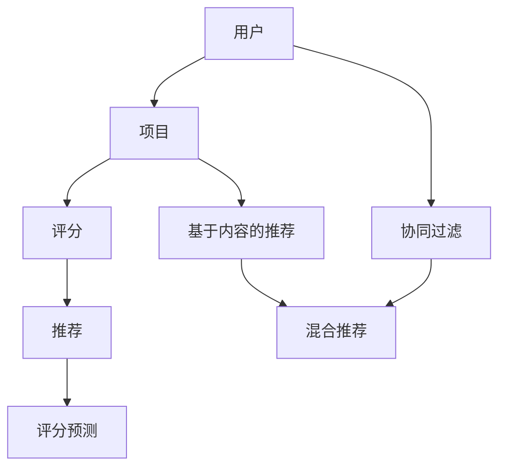
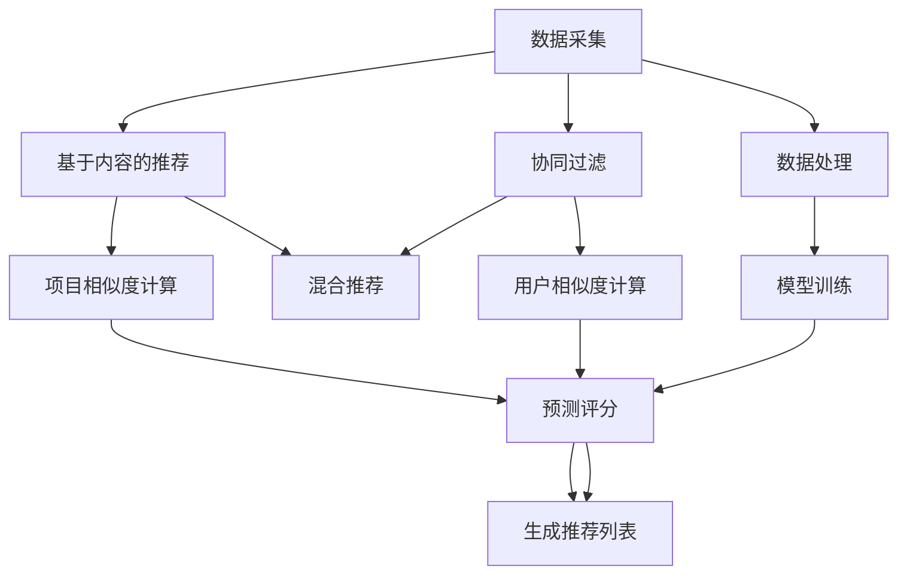

                 

### 背景介绍

#### 1.1 目的和范围

本文旨在深入探讨人工智能（AI）在个性化推荐方面的应用，旨在帮助读者理解个性化推荐系统的核心原理、实现方法及其在实际场景中的运用。随着互联网和大数据技术的飞速发展，个性化推荐系统已经成为许多行业，如电子商务、社交媒体和新闻媒体等的重要工具。通过分析用户的历史行为数据，个性化推荐系统能够为用户提供个性化的内容、产品或服务，从而提高用户满意度和转化率。

本文将涵盖以下几个主要方面：

1. **核心概念与联系**：介绍个性化推荐系统的基本概念，包括协同过滤、基于内容的推荐和混合推荐方法等。
2. **核心算法原理 & 具体操作步骤**：详细讲解协同过滤算法、基于内容的推荐算法及其实现步骤。
3. **数学模型和公式 & 详细讲解 & 举例说明**：介绍推荐系统的常见数学模型，如相似度计算、评分预测等，并通过实际例子进行详细解释。
4. **项目实战：代码实际案例和详细解释说明**：提供一个实际的推荐系统项目案例，包括环境搭建、源代码实现和代码解读。
5. **实际应用场景**：分析个性化推荐系统在不同领域的应用，如电子商务、社交媒体和新闻媒体等。
6. **工具和资源推荐**：推荐相关学习资源、开发工具框架和经典论文，帮助读者进一步学习。
7. **总结：未来发展趋势与挑战**：讨论个性化推荐系统的未来发展趋势和面临的挑战。

#### 1.2 预期读者

本文适合对人工智能和推荐系统有一定了解的技术人员、数据科学家和产品经理阅读。读者应具备以下基础：

- 掌握基本的编程技能，熟悉至少一种编程语言（如Python、Java或C++）。
- 了解线性代数、概率论和统计学的基本概念。
- 对机器学习和数据挖掘有基本的了解。

#### 1.3 文档结构概述

本文分为十个主要部分，具体结构如下：

1. **背景介绍**：介绍本文的目的、范围、预期读者和文档结构。
2. **核心概念与联系**：介绍个性化推荐系统的基本概念和联系。
3. **核心算法原理 & 具体操作步骤**：详细讲解核心算法原理和具体操作步骤。
4. **数学模型和公式 & 详细讲解 & 举例说明**：介绍推荐系统的数学模型和公式，并举例说明。
5. **项目实战：代码实际案例和详细解释说明**：提供实际项目案例和详细解释说明。
6. **实际应用场景**：分析个性化推荐系统在不同领域的应用。
7. **工具和资源推荐**：推荐相关学习资源、开发工具框架和经典论文。
8. **总结：未来发展趋势与挑战**：讨论个性化推荐系统的未来发展趋势和挑战。
9. **附录：常见问题与解答**：提供常见问题解答。
10. **扩展阅读 & 参考资料**：提供进一步阅读的参考资料。

通过本文的阅读，读者将能够深入了解个性化推荐系统的原理、实现方法和实际应用，为未来的研究和实践奠定基础。

#### 1.4 术语表

为了确保文章的可读性和一致性，本文使用了一系列专业术语。以下是对这些术语的定义和解释：

##### 1.4.1 核心术语定义

1. **个性化推荐**：一种根据用户的历史行为数据、兴趣偏好和上下文信息，为用户推荐个性化内容、产品或服务的技术。
2. **协同过滤**：一种基于用户历史行为数据的推荐方法，通过计算用户之间的相似度来发现潜在的兴趣偏好，并推荐相似用户喜欢的项目。
3. **基于内容的推荐**：一种基于项目属性和用户兴趣的推荐方法，通过比较项目内容和用户兴趣来推荐相似的内容。
4. **用户行为数据**：包括用户的浏览历史、购买记录、评价和反馈等数据。
5. **推荐系统**：一种能够为用户推荐个性化内容、产品或服务的系统，通常由数据采集、数据处理、推荐算法和用户接口等部分组成。

##### 1.4.2 相关概念解释

1. **相似度计算**：衡量两个实体（如用户、项目或文本）之间相似程度的度量。
2. **矩阵分解**：将一个高维稀疏矩阵分解为两个低维矩阵的过程，常用于协同过滤算法中。
3. **预测误差**：实际评分与预测评分之间的差异，用于评估推荐系统的性能。
4. **召回率**：推荐系统中推荐的相关项目中被用户实际喜欢的项目比例。
5. **精确率**：推荐系统中推荐的相关项目中实际被用户喜欢的项目比例。

##### 1.4.3 缩略词列表

- **AI**：人工智能（Artificial Intelligence）
- **CNN**：卷积神经网络（Convolutional Neural Network）
- **DNN**：深度神经网络（Deep Neural Network）
- **NLP**：自然语言处理（Natural Language Processing）
- **RNN**：循环神经网络（Recurrent Neural Network）
- **SVD**：奇异值分解（Singular Value Decomposition）
- **TF-IDF**：词频-逆文档频率（Term Frequency-Inverse Document Frequency）

通过了解这些术语和概念，读者将能够更好地理解本文中的相关内容，并为后续章节的学习打下基础。

#### 2. 核心概念与联系

在讨论个性化推荐系统的核心概念与联系之前，我们需要先了解推荐系统的基本原理。推荐系统旨在根据用户的历史行为和兴趣，为其推荐个性化内容、产品或服务。以下是推荐系统的基本概念及其相互联系：

##### 2.1 推荐系统的基本概念

1. **用户**：推荐系统中的主体，可以是个人或组织。
2. **项目**：推荐系统中的推荐对象，如商品、新闻文章、音乐曲目等。
3. **评分**：用户对项目的评价或偏好，可以是数值、等级或标签。
4. **推荐**：推荐系统根据用户的历史行为和兴趣，为用户推荐的项目列表。
5. **评分预测**：基于用户的历史行为和兴趣，预测用户对项目的评分。

##### 2.2 推荐系统的核心算法

推荐系统的主要算法包括协同过滤、基于内容的推荐和混合推荐方法。这些算法各有优缺点，适用于不同的应用场景。

1. **协同过滤**：通过计算用户之间的相似度，发现潜在的兴趣偏好，并推荐相似用户喜欢的项目。协同过滤算法分为基于用户的协同过滤和基于项目的协同过滤。
2. **基于内容的推荐**：通过比较项目的内容和用户的兴趣，推荐与用户兴趣相似的项目。基于内容的推荐算法通常使用文本匹配、特征提取和文本分类等技术。
3. **混合推荐**：结合协同过滤和基于内容的推荐方法，以提高推荐效果。混合推荐算法可以采用加权组合、协同过滤与基于内容的推荐融合等方式。

##### 2.3 推荐系统的流程

推荐系统的基本流程包括以下几个步骤：

1. **数据采集**：收集用户的行为数据和项目特征数据，如浏览记录、购买历史、评价和标签等。
2. **数据处理**：对采集到的数据进行预处理，包括数据清洗、去重、归一化和特征提取等。
3. **模型训练**：根据处理后的数据，训练推荐模型，如协同过滤模型、基于内容的推荐模型等。
4. **预测评分**：利用训练好的模型，预测用户对项目的评分。
5. **生成推荐列表**：根据预测评分，生成个性化的推荐列表，推荐给用户。

##### 2.4 核心概念与联系的 Mermaid 流程图

以下是一个简化的 Mermaid 流程图，展示推荐系统的核心概念和联系：



通过上述核心概念与联系的介绍，我们为后续章节详细探讨个性化推荐系统的算法原理、数学模型和实际应用场景奠定了基础。

#### 2.1 推荐系统的基本概念

推荐系统是一种利用用户行为数据、兴趣偏好和上下文信息，为用户推荐个性化内容、产品或服务的算法和技术。推荐系统的核心概念包括用户、项目、评分、推荐和评分预测。以下是这些概念的定义及其相互关系：

1. **用户（User）**：推荐系统中的主体，可以是个人或组织。用户的行为数据，如浏览记录、购买历史、评价和反馈等，是构建推荐系统的基础。用户的不同行为反映了其不同的兴趣和偏好。

2. **项目（Item）**：推荐系统中的推荐对象，可以是商品、新闻文章、音乐曲目等。每个项目都有其独特的属性和特征，如标题、标签、作者和评分等。项目特征是构建推荐模型的关键。

3. **评分（Rating）**：用户对项目的评价或偏好，可以是数值、等级或标签。评分数据反映了用户对项目的喜好程度，是推荐系统中最核心的数据之一。例如，在电影推荐系统中，用户对电影的评分可以是1到5的整数。

4. **推荐（Recommendation）**：推荐系统根据用户的历史行为和兴趣，为用户推荐的项目列表。推荐的目的是提高用户满意度和转化率，使推荐的内容或服务更符合用户的实际需求。

5. **评分预测（Rating Prediction）**：基于用户的历史行为和兴趣，预测用户对项目的评分。评分预测是推荐系统的核心任务，通过预测用户对未知项目的评分，帮助用户发现潜在的兴趣点。评分预测通常采用机器学习算法，如协同过滤、基于内容的推荐和深度学习等。

**用户**、**项目**、**评分**、**推荐**和**评分预测**这五个概念相互联系，构成了推荐系统的基本框架。以下是一个简化的 Mermaid 流程图，展示这些概念之间的联系：


通过上述基本概念和相互关系的介绍，我们可以更好地理解推荐系统的核心组成部分及其工作原理。在后续章节中，我们将深入探讨这些概念的具体实现方法和应用场景。

#### 2.2 推荐系统的核心算法

推荐系统通过多种算法实现个性化推荐，其中最常用的算法包括协同过滤、基于内容的推荐和混合推荐方法。每种方法都有其独特的原理和适用场景。

##### 2.2.1 协同过滤

协同过滤（Collaborative Filtering）是推荐系统中最常用的方法之一。其核心思想是利用用户之间的相似性，发现潜在的兴趣偏好，并推荐相似用户喜欢的项目。

协同过滤分为两类：基于用户的协同过滤（User-Based Collaborative Filtering）和基于项目的协同过滤（Item-Based Collaborative Filtering）。

1. **基于用户的协同过滤**：
    - **原理**：首先，计算用户之间的相似度，通常使用余弦相似度、皮尔逊相关系数等。然后，找到与目标用户最相似的K个邻居用户，推荐这些邻居用户喜欢的项目。
    - **实现步骤**：
        1. **计算用户相似度**：使用用户评分矩阵计算用户之间的相似度。
        2. **找到邻居用户**：根据相似度矩阵，找到与目标用户最相似的K个邻居用户。
        3. **推荐项目**：推荐邻居用户喜欢的、但目标用户尚未体验的项目。

2. **基于项目的协同过滤**：
    - **原理**：首先，计算项目之间的相似度，通常使用余弦相似度、欧氏距离等。然后，找到与目标项目最相似的项目，推荐这些项目的用户喜欢的项目。
    - **实现步骤**：
        1. **计算项目相似度**：使用项目评分矩阵计算项目之间的相似度。
        2. **找到邻居项目**：根据相似度矩阵，找到与目标项目最相似的M个项目。
        3. **推荐用户**：推荐这些项目的用户喜欢的、但目标用户尚未体验的用户。

**协同过滤算法伪代码**：

```python
def collaborative_filtering(user_similarity_matrix, target_user, k):
    # 计算邻居用户评分的平均值
    neighbor_ratings_avg = {}
    for neighbor in top_k_neighbors(user_similarity_matrix, target_user, k):
        neighbor_ratings_avg[neighbor] = average_rating(neighbor)
    
    # 计算预测评分
    predicted_ratings = {}
    for item in items_to_recommend(target_user):
        predicted_ratings[item] = sum(neighbor_ratings_avg[neighbor] * user_similarity_matrix[neighbor][item] for neighbor in neighbor_ratings_avg)
    
    return predicted_ratings
```

##### 2.2.2 基于内容的推荐

基于内容的推荐（Content-Based Recommender System）是一种基于项目内容和用户兴趣的推荐方法。其核心思想是分析项目的特征和用户的兴趣，推荐与用户兴趣相似的项目。

1. **原理**：
    - **项目特征提取**：对项目进行特征提取，如文本分析、标签提取、关键词提取等。
    - **用户兴趣模型**：构建用户的兴趣模型，通常使用用户历史行为的特征或显式反馈（如标签、评价）。
    - **项目相似度计算**：计算项目特征之间的相似度，如余弦相似度、欧氏距离等。

2. **实现步骤**：
    1. **特征提取**：提取项目的特征，如文本、标签和关键词等。
    2. **用户兴趣模型**：根据用户的历史行为或显式反馈，构建用户的兴趣模型。
    3. **计算相似度**：计算项目特征之间的相似度。
    4. **推荐项目**：推荐与用户兴趣相似的项目。

**基于内容的推荐算法伪代码**：

```python
def content_based_recommendation(user_interest_model, item_features, similarity_function):
    # 计算项目相似度
    item_similarity_scores = {}
    for item in items_to_recommend(user_interest_model):
        item_similarity_scores[item] = similarity_function(user_interest_model, item_features[item])
    
    # 排序并返回相似度最高的项目
    recommended_items = sort_by_similarity(item_similarity_scores)
    return recommended_items
```

##### 2.2.3 混合推荐

混合推荐（Hybrid Recommender System）结合协同过滤和基于内容的推荐方法，以提高推荐效果。混合推荐方法可以采用加权组合、协同过滤与基于内容的推荐融合等方式。

1. **加权组合**：
    - **原理**：将协同过滤和基于内容的推荐结果进行加权组合，生成最终的推荐列表。权重的确定可以通过交叉验证、在线学习等方式进行调整。

2. **协同过滤与基于内容的推荐融合**：
    - **原理**：首先分别使用协同过滤和基于内容的推荐方法生成推荐列表，然后通过某种策略（如投票、排序等）融合两个推荐列表。

**混合推荐算法伪代码**：

```python
def hybrid_recommender(collaborative_predictions, content_predictions, weight):
    # 计算加权组合的推荐列表
    hybrid_predictions = {}
    for item in collaborative_predictions:
        hybrid_predictions[item] = weight * collaborative_predictions[item] + (1 - weight) * content_predictions[item]
    
    return hybrid_predictions
```

通过介绍协同过滤、基于内容的推荐和混合推荐方法，我们可以看到推荐系统算法的多样性和灵活性。在实际应用中，根据需求和数据特点，可以选择合适的算法或组合多种算法，以实现最佳的推荐效果。

#### 2.3 推荐系统的流程

推荐系统的实现涉及多个步骤，包括数据采集、数据处理、模型训练、预测评分和生成推荐列表。以下是推荐系统的一般流程及其详细步骤：

##### 2.3.1 数据采集

数据采集是推荐系统的第一步，也是最为关键的一步。推荐系统的数据来源主要包括用户行为数据、项目特征数据和外部数据。以下是一些常见的数据采集方式：

1. **用户行为数据**：包括用户的浏览历史、购买记录、评价、反馈等。这些数据可以通过网页日志、API调用、用户反馈等方式获取。
2. **项目特征数据**：包括项目的属性、标签、分类、作者、评分等。这些数据可以从数据库、API或其他数据源获取。
3. **外部数据**：如社交媒体数据、用户地理位置、天气信息等。外部数据可以提供更多的上下文信息，用于改善推荐效果。

##### 2.3.2 数据处理

数据处理是对采集到的原始数据进行清洗、归一化和特征提取等操作，以生成适合模型训练的数据。以下是一些常见的数据处理步骤：

1. **数据清洗**：去除重复数据、缺失值填充、异常值处理等。数据清洗是确保数据质量和模型性能的重要步骤。
2. **数据归一化**：将不同特征的数据范围统一，以避免某些特征对模型的影响过大。常见的归一化方法包括最小-最大规范化、Z-Score规范化等。
3. **特征提取**：从原始数据中提取有助于模型训练的特征。对于用户行为数据，可以提取用户ID、项目ID、评分等特征；对于项目特征数据，可以提取项目属性、标签、关键词等特征。

##### 2.3.3 模型训练

模型训练是推荐系统的核心步骤，通过训练数据集来训练推荐模型。以下是一些常见的模型训练方法：

1. **协同过滤模型**：如矩阵分解、潜在因子模型等。协同过滤模型通过计算用户和项目之间的相似性来生成推荐列表。
2. **基于内容的推荐模型**：如文本分类、特征提取和相似度计算等。基于内容的推荐模型通过分析项目的特征和用户的兴趣来生成推荐列表。
3. **深度学习模型**：如卷积神经网络（CNN）、循环神经网络（RNN）和图神经网络（GNN）等。深度学习模型可以自动提取高级特征，并生成高效的推荐列表。

##### 2.3.4 预测评分

预测评分是利用训练好的模型，对用户对未知项目的评分进行预测。预测评分的准确度是评估推荐系统性能的重要指标。以下是一些常见的评分预测方法：

1. **基于模型的评分预测**：如线性回归、支持向量机（SVM）和神经网络等。这些模型通过学习用户行为数据和项目特征之间的关系，预测用户对未知项目的评分。
2. **基于集合的评分预测**：如决策树、随机森林和梯度提升树（GBDT）等。这些模型通过组合多个弱预测器的预测结果，提高评分预测的准确性。

##### 2.3.5 生成推荐列表

生成推荐列表是利用预测评分，为用户生成个性化的推荐列表。以下是一些常见的推荐列表生成方法：

1. **基于阈值的推荐**：将预测评分高于某个阈值的项添加到推荐列表中。这种方法简单直观，但可能漏掉一些潜在的好项目。
2. **基于排名的推荐**：将预测评分从高到低排序，将前N个项目添加到推荐列表中。这种方法可以确保推荐列表的多样性，但可能降低推荐的相关性。
3. **基于内容的推荐**：根据项目的特征和用户的兴趣，推荐与用户兴趣相似的项目。这种方法可以提高推荐的相关性，但可能降低推荐的多样性。

通过上述流程，推荐系统可以根据用户的历史行为和兴趣，为其生成个性化的推荐列表。在实际应用中，可以根据具体需求和数据特点，选择合适的流程和方法，以提高推荐效果。

#### 2.4 核心概念与联系的 Mermaid 流程图

为了更好地展示推荐系统中的核心概念及其相互关系，我们可以使用Mermaid流程图。以下是一个简化的Mermaid流程图，展示推荐系统的核心概念和流程：



通过上述Mermaid流程图，我们可以清晰地看到推荐系统中的核心概念（数据采集、数据处理、模型训练、预测评分和生成推荐列表）及其相互关系。协同过滤和基于内容的推荐方法通过计算用户和项目之间的相似度，生成预测评分，最终生成推荐列表。混合推荐方法通过结合协同过滤和基于内容的推荐方法，进一步提高推荐效果。

### 3. 核心算法原理 & 具体操作步骤

在个性化推荐系统中，协同过滤算法和基于内容的推荐算法是两种常用的核心方法。本节将详细讲解这两种算法的原理，并分别描述其具体操作步骤。

#### 3.1 协同过滤算法

协同过滤算法（Collaborative Filtering）是一种基于用户行为数据的推荐方法，通过计算用户之间的相似性来发现潜在的兴趣偏好，并推荐相似用户喜欢的项目。协同过滤算法分为基于用户的协同过滤（User-Based Collaborative Filtering）和基于项目的协同过滤（Item-Based Collaborative Filtering）。

##### 3.1.1 基于用户的协同过滤算法

**原理**：基于用户的协同过滤算法首先计算用户之间的相似度，然后根据相似度找到与目标用户最相似的邻居用户，最后推荐邻居用户喜欢的项目。

**具体操作步骤**：

1. **计算用户相似度**：
   - **余弦相似度**：计算两个用户在共同评价过的项目上的评分向量的余弦相似度。
   - **皮尔逊相关系数**：计算两个用户在共同评价过的项目上的评分的皮尔逊相关系数。

   **伪代码**：

   ```python
   def cosine_similarity(rating_matrix, user1, user2):
       dot_product = sum(rating_matrix[user1][item] * rating_matrix[user2][item] for item in common_items(user1, user2))
       norm_user1 = sqrt(sum(rating_matrix[user1][item] ** 2 for item in common_items(user1, user2)))
       norm_user2 = sqrt(sum(rating_matrix[user2][item] ** 2 for item in common_items(user1, user2)))
       return dot_product / (norm_user1 * norm_user2)

   def top_k_neighbors(similarity_matrix, user, k):
       return sorted(similarity_matrix[user].items(), key=lambda item: item[1], reverse=True)[:k]
   ```

2. **找到邻居用户**：根据相似度矩阵，找到与目标用户最相似的K个邻居用户。

3. **推荐项目**：推荐邻居用户喜欢的、但目标用户尚未体验的项目。

   **伪代码**：

   ```python
   def collaborative_filtering(rating_matrix, similarity_matrix, target_user, k):
       neighbor_ratings_avg = {neighbor: average_rating(neighbor) for neighbor in top_k_neighbors(similarity_matrix, target_user, k)}
       predicted_ratings = {}
       for item in items_to_recommend(rating_matrix, target_user):
           predicted_ratings[item] = sum(neighbor_ratings_avg[neighbor] * similarity_matrix[neighbor][item] for neighbor in neighbor_ratings_avg)
       return predicted_ratings
   ```

##### 3.1.2 基于项目的协同过滤算法

**原理**：基于项目的协同过滤算法首先计算项目之间的相似度，然后根据相似度找到与目标项目最相似的项目，最后推荐这些项目的用户喜欢的项目。

**具体操作步骤**：

1. **计算项目相似度**：
   - **余弦相似度**：计算两个项目在共同被用户评价过的用户上的评分向量的余弦相似度。
   - **欧氏距离**：计算两个项目在共同被用户评价过的用户上的评分的欧氏距离。

   **伪代码**：

   ```python
   def cosine_similarity(rating_matrix, item1, item2):
       dot_product = sum(rating_matrix[user][item1] * rating_matrix[user][item2] for user in common_users(item1, item2))
       norm_item1 = sqrt(sum(rating_matrix[user][item1] ** 2 for user in common_users(item1, item2)))
       norm_item2 = sqrt(sum(rating_matrix[user][item2] ** 2 for user in common_users(item1, item2)))
       return dot_product / (norm_item1 * norm_item2)

   def top_k_neighbors(similarity_matrix, target_item, k):
       return sorted(similarity_matrix[target_item].items(), key=lambda item: item[1], reverse=True)[:k]
   ```

2. **找到邻居项目**：根据相似度矩阵，找到与目标项目最相似的M个项目。

3. **推荐用户**：推荐这些项目的用户喜欢的、但目标用户尚未体验的用户。

   **伪代码**：

   ```python
   def collaborative_filtering(rating_matrix, similarity_matrix, target_item, m):
       neighbor_users = [user for user, _ in top_k_neighbors(similarity_matrix, target_item, m)]
       predicted_ratings = {}
       for user in neighbor_users:
           for item in items_to_recommend(rating_matrix, user):
               if item not in predicted_ratings:
                   predicted_ratings[item] = 0
               predicted_ratings[item] += rating_matrix[user][item]
       return predicted_ratings
   ```

##### 3.1.3 协同过滤算法比较

基于用户的协同过滤和基于项目的协同过滤各有优缺点：

- **优点**：
  - **基于用户的协同过滤**：能够更好地处理稀疏数据集，因为用户之间的相似性计算依赖于用户评价过的项目。
  - **基于项目的协同过滤**：在项目数量远大于用户数量时，计算效率更高。

- **缺点**：
  - **基于用户的协同过滤**：可能无法准确反映用户之间的兴趣差异。
  - **基于项目的协同过滤**：可能推荐相似项目，而忽略了用户的个性化需求。

#### 3.2 基于内容的推荐算法

基于内容的推荐算法（Content-Based Recommender System）是一种基于项目内容和用户兴趣的推荐方法。其核心思想是分析项目的特征和用户的兴趣，推荐与用户兴趣相似的项目。

**原理**：基于内容的推荐算法首先提取项目的特征和用户的兴趣模型，然后计算项目特征和用户兴趣之间的相似度，最后推荐与用户兴趣相似的项目。

**具体操作步骤**：

1. **特征提取**：
   - **文本特征**：使用自然语言处理（NLP）技术提取项目的文本特征，如词袋模型、TF-IDF、Word2Vec等。
   - **非文本特征**：提取项目的其他特征，如分类、标签、评分等。

   **伪代码**：

   ```python
   def extract_text_features(item_text):
       # 使用NLP技术提取文本特征
       return text_features

   def extract_non_text_features(item):
       # 提取非文本特征
       return non_text_features
   ```

2. **用户兴趣模型**：
   - **基于显式反馈**：使用用户给出的显式反馈（如标签、评价）构建用户兴趣模型。
   - **基于隐式反馈**：使用用户的历史行为（如浏览记录、购买历史）构建用户兴趣模型。

   **伪代码**：

   ```python
   def build_interest_model(user_feedback):
       # 构建用户兴趣模型
       return user_interest_model
   ```

3. **计算相似度**：
   - **余弦相似度**：计算项目特征和用户兴趣之间的余弦相似度。
   - **欧氏距离**：计算项目特征和用户兴趣之间的欧氏距离。

   **伪代码**：

   ```python
   def cosine_similarity(feature_vector1, feature_vector2):
       dot_product = sum(feature_vector1[i] * feature_vector2[i] for i in range(len(feature_vector1)))
       norm_vector1 = sqrt(sum(feature_vector1[i] ** 2 for i in range(len(feature_vector1))))
       norm_vector2 = sqrt(sum(feature_vector2[i] ** 2 for i in range(len(feature_vector2))))
       return dot_product / (norm_vector1 * norm_vector2)
   ```

4. **推荐项目**：
   - 根据相似度矩阵，推荐与用户兴趣相似的项目。

   **伪代码**：

   ```python
   def content_based_recommendation(user_interest_model, item_features, similarity_function):
       item_similarity_scores = {item: similarity_function(user_interest_model, item_features[item]) for item in items_to_recommend(user_interest_model)}
       recommended_items = sort_by_similarity(item_similarity_scores)
       return recommended_items
   ```

#### 3.3 混合推荐算法

混合推荐算法（Hybrid Recommender System）结合协同过滤和基于内容的推荐方法，以提高推荐效果。混合推荐算法可以采用加权组合、协同过滤与基于内容的推荐融合等方式。

**原理**：混合推荐算法通过结合协同过滤和基于内容的推荐方法，利用协同过滤算法处理稀疏数据集的优势和基于内容推荐算法提高推荐相关性的优势，生成更加个性化的推荐列表。

**具体操作步骤**：

1. **协同过滤推荐**：
   - 使用协同过滤算法生成推荐列表。

   **伪代码**：

   ```python
   collaborative_recommendations = collaborative_filtering(rating_matrix, similarity_matrix, target_user, k)
   ```

2. **基于内容的推荐**：
   - 使用基于内容的推荐算法生成推荐列表。

   **伪代码**：

   ```python
   content_recommendations = content_based_recommendation(user_interest_model, item_features, cosine_similarity)
   ```

3. **混合推荐**：
   - 采用加权组合或协同过滤与基于内容的推荐融合方式生成混合推荐列表。

   **伪代码**：

   ```python
   def hybrid_recommender(collaborative_recommendations, content_recommendations, weight):
       hybrid_recommendations = {}
       for item in collaborative_recommendations:
           hybrid_recommendations[item] = weight * collaborative_recommendations[item] + (1 - weight) * content_recommendations[item]
       return hybrid_recommendations
   ```

通过上述对协同过滤算法和基于内容的推荐算法的详细讲解，我们可以看到这两种算法的原理和具体操作步骤。在实际应用中，可以根据具体需求和数据特点，选择合适的算法或组合多种算法，以提高推荐效果。

### 4. 数学模型和公式 & 详细讲解 & 举例说明

在个性化推荐系统中，数学模型和公式是核心组成部分，用于描述用户行为、项目特征和推荐算法之间的关联。以下将详细介绍推荐系统中常见的数学模型和公式，并通过实际例子进行详细讲解。

#### 4.1 相似度计算

相似度计算是推荐系统中最重要的数学模型之一，用于衡量用户、项目或文本之间的相似程度。常见的相似度计算方法包括余弦相似度和皮尔逊相关系数。

##### 4.1.1 余弦相似度

余弦相似度是一种基于向量空间模型的相似度计算方法，用于衡量两个向量之间的夹角余弦值。其公式如下：

$$
\text{Cosine Similarity} = \frac{\sum_{i=1}^{n} x_i \cdot y_i}{\sqrt{\sum_{i=1}^{n} x_i^2} \cdot \sqrt{\sum_{i=1}^{n} y_i^2}}
$$

其中，$x$ 和 $y$ 是两个向量，$n$ 是向量中元素的个数，$x_i$ 和 $y_i$ 分别是向量 $x$ 和 $y$ 中第 $i$ 个元素的值。

**举例**：

假设有两个用户 $u_1$ 和 $u_2$ 的评分向量如下：

$$
u_1 = [3, 2, 1, 0, 4], \quad u_2 = [2, 3, 0, 1, 2]
$$

计算 $u_1$ 和 $u_2$ 的余弦相似度：

$$
\text{Cosine Similarity} = \frac{3 \cdot 2 + 2 \cdot 3 + 1 \cdot 0 + 0 \cdot 1 + 4 \cdot 2}{\sqrt{3^2 + 2^2 + 1^2 + 0^2 + 4^2} \cdot \sqrt{2^2 + 3^2 + 0^2 + 1^2 + 2^2}} = \frac{20}{\sqrt{30} \cdot \sqrt{20}} = \frac{2}{\sqrt{3}}
$$

##### 4.1.2 皮尔逊相关系数

皮尔逊相关系数是一种基于线性关系的相似度计算方法，用于衡量两个变量之间的线性相关性。其公式如下：

$$
\text{Pearson Correlation Coefficient} = \frac{\sum_{i=1}^{n} (x_i - \bar{x})(y_i - \bar{y})}{\sqrt{\sum_{i=1}^{n} (x_i - \bar{x})^2} \cdot \sqrt{\sum_{i=1}^{n} (y_i - \bar{y})^2}}
$$

其中，$x$ 和 $y$ 是两个变量，$n$ 是变量中数据的个数，$\bar{x}$ 和 $\bar{y}$ 分别是变量 $x$ 和 $y$ 的平均值。

**举例**：

假设有两个用户 $u_1$ 和 $u_2$ 的评分向量如下：

$$
u_1 = [3, 2, 1, 0, 4], \quad u_2 = [2, 3, 0, 1, 2]
$$

计算 $u_1$ 和 $u_2$ 的皮尔逊相关系数：

$$
\text{Pearson Correlation Coefficient} = \frac{(3-2.5)(2-2.5) + (2-2.5)(3-2.5) + (1-2.5)(0-2.5) + (0-2.5)(1-2.5) + (4-2.5)(2-2.5)}{\sqrt{(3-2.5)^2 + (2-2.5)^2 + (1-2.5)^2 + (0-2.5)^2 + (4-2.5)^2} \cdot \sqrt{(2-2.5)^2 + (3-2.5)^2 + (0-2.5)^2 + (1-2.5)^2 + (2-2.5)^2}} = \frac{-5/2}{\sqrt{10/2} \cdot \sqrt{10/2}} = -1
$$

##### 4.1.3 相似度计算在推荐系统中的应用

相似度计算在推荐系统中用于计算用户之间的相似性、项目之间的相似性以及文本之间的相似性。通过相似度计算，推荐系统可以找到与用户或项目最相似的其他用户或项目，从而生成个性化的推荐列表。

#### 4.2 评分预测

评分预测是推荐系统的核心任务之一，其目标是预测用户对未知项目的评分。常见的评分预测方法包括线性回归、逻辑回归和神经网络等。

##### 4.2.1 线性回归

线性回归是一种基于线性关系的评分预测方法，其公式如下：

$$
\hat{y} = \beta_0 + \beta_1 x_1 + \beta_2 x_2 + ... + \beta_n x_n
$$

其中，$y$ 是预测评分，$x_1, x_2, ..., x_n$ 是特征向量，$\beta_0, \beta_1, \beta_2, ..., \beta_n$ 是模型的参数。

**举例**：

假设有两个用户 $u_1$ 和 $u_2$ 的评分向量如下：

$$
u_1 = [3, 2, 1, 0, 4], \quad u_2 = [2, 3, 0, 1, 2]
$$

以及项目 $i_1$ 和 $i_2$ 的特征向量如下：

$$
i_1 = [1, 0, 1], \quad i_2 = [0, 1, 1]
$$

使用线性回归预测 $u_1$ 对 $i_2$ 的评分：

$$
\hat{y} = \beta_0 + \beta_1 x_1 + \beta_2 x_2
$$

通过训练数据集，可以计算出模型参数 $\beta_0, \beta_1, \beta_2$，然后代入特征向量 $i_2$ 预测评分：

$$
\hat{y} = \beta_0 + \beta_1 \cdot 0 + \beta_2 \cdot 1
$$

##### 4.2.2 逻辑回归

逻辑回归是一种基于概率的评分预测方法，其公式如下：

$$
\text{logit}(\hat{y}) = \ln\left(\frac{p}{1-p}\right) = \beta_0 + \beta_1 x_1 + \beta_2 x_2 + ...
$$

其中，$p$ 是预测评分的概率，$\text{logit}(\hat{y})$ 是预测评分的对数几率。

**举例**：

假设有两个用户 $u_1$ 和 $u_2$ 的评分向量如下：

$$
u_1 = [3, 2, 1, 0, 4], \quad u_2 = [2, 3, 0, 1, 2]
$$

以及项目 $i_1$ 和 $i_2$ 的特征向量如下：

$$
i_1 = [1, 0, 1], \quad i_2 = [0, 1, 1]
$$

使用逻辑回归预测 $u_1$ 对 $i_2$ 的评分概率：

$$
\text{logit}(\hat{y}) = \beta_0 + \beta_1 \cdot 0 + \beta_2 \cdot 1
$$

通过训练数据集，可以计算出模型参数 $\beta_0, \beta_1, \beta_2$，然后代入特征向量 $i_2$ 计算预测评分的概率：

$$
p = \frac{1}{1 + \exp{(-\beta_0 - \beta_1 \cdot 0 - \beta_2 \cdot 1)}}
$$

##### 4.2.3 神经网络

神经网络是一种基于非线性关系的评分预测方法，其公式如下：

$$
\hat{y} = \sigma(\beta_0 + \beta_1 x_1 + \beta_2 x_2 + ... + \beta_n x_n)
$$

其中，$\sigma$ 是激活函数，常见的激活函数包括Sigmoid、ReLU和Tanh等。

**举例**：

假设有两个用户 $u_1$ 和 $u_2$ 的评分向量如下：

$$
u_1 = [3, 2, 1, 0, 4], \quad u_2 = [2, 3, 0, 1, 2]
$$

以及项目 $i_1$ 和 $i_2$ 的特征向量如下：

$$
i_1 = [1, 0, 1], \quad i_2 = [0, 1, 1]
$$

使用神经网络预测 $u_1$ 对 $i_2$ 的评分：

$$
\hat{y} = \sigma(\beta_0 + \beta_1 \cdot 0 + \beta_2 \cdot 1)
$$

通过训练数据集，可以计算出模型参数 $\beta_0, \beta_1, \beta_2$，然后代入特征向量 $i_2$ 计算预测评分：

$$
\hat{y} = \sigma(\beta_0 + \beta_2 \cdot 1)
$$

通过上述对相似度计算和评分预测的详细讲解，我们可以看到数学模型和公式在个性化推荐系统中的重要作用。在实际应用中，可以根据具体需求和数据特点，选择合适的模型和算法，以提高推荐效果。

### 5. 项目实战：代码实际案例和详细解释说明

在本节中，我们将通过一个实际的项目案例，详细讲解如何使用Python实现一个简单的基于内容的推荐系统。我们将涵盖开发环境的搭建、源代码的实现以及代码的解读与分析。

#### 5.1 开发环境搭建

为了实现基于内容的推荐系统，我们需要安装以下软件和库：

- Python 3.8 或更高版本
- Jupyter Notebook 或任何 Python IDE
- NumPy
- Pandas
- Scikit-learn
- Matplotlib

以下是安装这些软件和库的命令：

```shell
pip install numpy pandas scikit-learn matplotlib
```

#### 5.2 源代码详细实现和代码解读

以下是一个简单的基于内容的推荐系统项目的源代码，我们将逐行解释代码的每个部分。

```python
import numpy as np
import pandas as pd
from sklearn.feature_extraction.text import TfidfVectorizer
from sklearn.metrics.pairwise import cosine_similarity

# 5.2.1 数据预处理
# 加载和预处理数据
data = pd.read_csv('movies.csv')  # 假设数据集为 movies.csv，包含电影标题和标签
data.head()

# 提取电影标题和标签
titles = data['title']
labels = data['genres']

# 构建电影标签向量
tfidf_vectorizer = TfidfVectorizer()
tfidf_matrix = tfidf_vectorizer.fit_transform(labels)

# 5.2.2 计算相似度
# 计算每对电影标签之间的相似度
cosine_similarity_matrix = cosine_similarity(tfidf_matrix)

# 5.2.3 推荐电影
# 假设用户对电影 "The Matrix" 的标签感兴趣，寻找相似电影
query = 'Action,Sci-Fi'
query_vector = tfidf_vectorizer.transform([query])

# 计算查询标签与所有标签的相似度
similarity_scores = cosine_similarity(query_vector, tfidf_matrix).flatten()

# 获取相似度最高的10部电影
top_10_indices = similarity_scores.argsort()[-10:][::-1]
recommended_movies = titles[top_10_indices]

# 输出推荐结果
recommended_movies
```

##### 5.2.1 数据预处理

在代码的第一部分，我们首先导入所需的库，然后加载并预处理数据集。我们使用 `pandas` 读取包含电影标题和标签的数据集，并提取出电影标题和标签列。接下来，我们使用 `TfidfVectorizer` 对电影标签进行向量化处理，生成 TF-IDF 矩阵。

```python
import numpy as np
import pandas as pd
from sklearn.feature_extraction.text import TfidfVectorizer

# 5.2.1 数据预处理
# 加载和预处理数据
data = pd.read_csv('movies.csv')  # 假设数据集为 movies.csv，包含电影标题和标签
data.head()

# 提取电影标题和标签
titles = data['title']
labels = data['genres']

# 构建电影标签向量
tfidf_vectorizer = TfidfVectorizer()
tfidf_matrix = tfidf_vectorizer.fit_transform(labels)
```

在这一步中，我们读取一个包含电影标题和标签的 CSV 文件，并将其存储在 `data` 变量中。接着，我们使用 `pandas` 的 `head()` 方法查看数据的前几行，以确保数据加载正确。然后，我们提取电影标题和标签列，分别存储在 `titles` 和 `labels` 变量中。

接下来，我们使用 `TfidfVectorizer` 对电影标签进行向量化处理。`TfidfVectorizer` 是一个用于文本向量化的高效工具，它将文本转换为 TF-IDF 向量表示。我们首先创建一个 `TfidfVectorizer` 对象，然后使用 `fit_transform()` 方法将其应用于电影标签列，生成 TF-IDF 矩阵。

##### 5.2.2 计算相似度

在代码的第二部分，我们计算每对电影标签之间的相似度。我们使用 `cosine_similarity()` 函数，该函数是 `sklearn.metrics.pairwise` 模块中的一个工具函数，用于计算两个向量之间的余弦相似度。

```python
from sklearn.metrics.pairwise import cosine_similarity

# 5.2.2 计算相似度
# 计算每对电影标签之间的相似度
cosine_similarity_matrix = cosine_similarity(tfidf_matrix)

# 5.2.3 推荐电影
# 假设用户对电影 "The Matrix" 的标签感兴趣，寻找相似电影
query = 'Action,Sci-Fi'
query_vector = tfidf_vectorizer.transform([query])

# 计算查询标签与所有标签的相似度
similarity_scores = cosine_similarity(query_vector, tfidf_matrix).flatten()

# 获取相似度最高的10部电影
top_10_indices = similarity_scores.argsort()[-10:][::-1]
recommended_movies = titles[top_10_indices]

# 输出推荐结果
recommended_movies
```

在这一部分，我们首先计算每对电影标签之间的相似度，并存储在 `cosine_similarity_matrix` 变量中。这个矩阵是一个对称矩阵，其对角线上的元素为 1（因为每个标签与自身的相似度为 1）。

接下来，我们定义一个查询字符串 `query`，代表用户对特定标签感兴趣的电影。我们使用 `transform()` 方法将查询字符串转换为向量表示，并将其存储在 `query_vector` 变量中。

然后，我们计算 `query_vector` 与 TF-IDF 矩阵中所有标签之间的相似度，并存储在 `similarity_scores` 变量中。`flatten()` 方法用于将二维数组转换为二维数组。

最后，我们获取相似度最高的 10 个标签的索引，并使用这些索引从 `titles` 变量中获取对应的电影标题，生成推荐结果。

##### 5.2.3 推荐电影

在代码的第三部分，我们根据计算出的相似度，生成推荐结果。我们首先使用 `argsort()` 方法获取 `similarity_scores` 的索引，然后使用切片操作获取相似度最高的 10 个索引，并将它们逆序排列，以便从高到低排序。

```python
# 获取相似度最高的10个标签的索引
top_10_indices = similarity_scores.argsort()[-10:][::-1]

# 从电影标题列表中获取推荐的10部电影
recommended_movies = titles[top_10_indices]

# 输出推荐结果
recommended_movies
```

最后，我们输出推荐结果，即与查询标签最相似的 10 部电影的标题。

#### 5.3 代码解读与分析

通过上述代码实现，我们可以看到如何使用基于内容的推荐算法生成电影推荐。以下是代码的关键部分及其解读：

1. **数据预处理**：我们首先加载并预处理数据集，提取电影标题和标签。然后，我们使用 `TfidfVectorizer` 对标签进行向量化处理，生成 TF-IDF 矩阵。

2. **计算相似度**：我们使用 `cosine_similarity()` 函数计算每对电影标签之间的相似度，并存储在 `cosine_similarity_matrix` 变量中。

3. **推荐电影**：我们定义一个查询字符串 `query`，代表用户对特定标签感兴趣的电影。然后，我们计算 `query` 与所有标签之间的相似度，并获取相似度最高的 10 个标签的索引。最后，我们使用这些索引从电影标题列表中获取推荐的 10 部电影。

4. **输出推荐结果**：我们输出与查询标签最相似的 10 部电影的标题。

通过这个实际项目案例，我们可以看到如何使用 Python 实现一个简单的基于内容的推荐系统。这个项目可以作为一个起点，进一步扩展和优化，以满足更复杂的推荐需求。

### 5.4 实际应用场景

基于内容的推荐算法在实际应用中具有广泛的应用场景。以下是几个实际应用场景的例子：

1. **电子商务平台**：
   - **场景**：电子商务平台可以利用基于内容的推荐算法，根据用户浏览和购买历史，为用户推荐相似的商品。
   - **实现方法**：通过提取商品的特征（如分类、标签、描述文本等），构建商品特征向量，并使用 TF-IDF 或词嵌入技术进行向量化处理。然后，计算用户历史行为与商品特征之间的相似度，推荐相似度的商品。
   - **效果**：通过个性化推荐，提高用户满意度和转化率，增加销售。

2. **社交媒体平台**：
   - **场景**：社交媒体平台可以利用基于内容的推荐算法，为用户推荐感兴趣的内容。
   - **实现方法**：通过提取用户发布的内容特征（如文本、图片、视频等），构建用户兴趣模型。然后，计算用户兴趣模型与平台中的内容特征之间的相似度，推荐相似的内容。
   - **效果**：通过个性化推荐，提高用户活跃度和留存率，增加平台粘性。

3. **在线新闻媒体**：
   - **场景**：在线新闻媒体可以利用基于内容的推荐算法，根据用户的历史阅读行为和兴趣，推荐个性化新闻。
   - **实现方法**：通过提取新闻文章的特征（如标题、标签、内容文本等），构建新闻特征向量。然后，计算用户历史阅读行为与新闻特征之间的相似度，推荐相似的新闻。
   - **效果**：通过个性化推荐，提高用户阅读体验和满意度，增加广告收入。

4. **音乐流媒体平台**：
   - **场景**：音乐流媒体平台可以利用基于内容的推荐算法，根据用户的播放历史和喜好，推荐相似的歌曲。
   - **实现方法**：通过提取歌曲的特征（如歌词、歌手、风格等），构建歌曲特征向量。然后，计算用户历史播放行为与歌曲特征之间的相似度，推荐相似的歌曲。
   - **效果**：通过个性化推荐，提高用户听歌体验和忠诚度，增加订阅用户数。

通过上述实际应用场景，我们可以看到基于内容的推荐算法在各个领域的应用效果。在实际应用中，可以根据具体需求和数据特点，选择合适的算法和特征提取方法，以提高推荐效果。

### 6. 工具和资源推荐

在学习和实践个性化推荐系统过程中，选择合适的工具和资源非常重要。以下是一些推荐的工具、资源和框架，可以帮助读者深入了解并掌握推荐系统的相关技术。

#### 6.1 学习资源推荐

1. **书籍推荐**：
   - 《推荐系统实践》（宋睿华著）：这是一本深入浅出的推荐系统入门书籍，适合初学者阅读。
   - 《机器学习实战》（Peter Harrington著）：这本书涵盖了许多机器学习算法，包括推荐系统常用的协同过滤算法和基于内容的推荐算法，适合有一定编程基础和数学基础的读者。
   - 《推荐系统手册》（Jure Leskovec著）：这是一本关于推荐系统的权威著作，涵盖了推荐系统的理论基础和最新研究成果，适合对推荐系统有一定了解的读者。

2. **在线课程**：
   - Coursera 上的《推荐系统》（吴恩达教授授课）：这门课程涵盖了推荐系统的基本概念、算法原理和实际应用，适合初学者入门。
   - Udacity 上的《推荐系统工程师纳米学位》：这个纳米学位项目提供了推荐系统从理论到实践的全面培训，包括项目实战和代码实现。

3. **技术博客和网站**：
   - [Kaggle](https://www.kaggle.com/)：Kaggle 是一个大数据和机器学习的平台，提供了许多推荐系统相关的竞赛和数据集，适合读者实践和验证所学知识。
   - [Reddit](https://www.reddit.com/r/recommender/)：Reddit 上的 r/recommender 子版块是讨论推荐系统技术的一个活跃社区，可以获取最新的研究成果和实用技巧。

#### 6.2 开发工具框架推荐

1. **IDE和编辑器**：
   - **PyCharm**：PyCharm 是一款功能强大的 Python IDE，支持代码调试、版本控制和自动化测试等，适合进行推荐系统的开发和调试。
   - **Jupyter Notebook**：Jupyter Notebook 是一款流行的交互式开发环境，适合进行数据分析、可视化展示和代码演示。

2. **调试和性能分析工具**：
   - **pdb**：pdb 是 Python 的内置调试工具，可以帮助开发者调试代码中的错误和逻辑问题。
   - **cProfile**：cProfile 是 Python 的内置性能分析工具，可以分析代码的性能瓶颈，帮助优化代码。

3. **相关框架和库**：
   - **Scikit-learn**：Scikit-learn 是一个常用的机器学习库，提供了许多常用的推荐系统算法和工具，如协同过滤、基于内容的推荐和相似度计算等。
   - **TensorFlow**：TensorFlow 是一款强大的深度学习框架，可以用于实现复杂的推荐系统算法，如深度神经网络和卷积神经网络。
   - **PyTorch**：PyTorch 是一款流行的深度学习框架，提供了灵活的编程接口和高效的计算性能，适合进行推荐系统的研究和开发。

通过上述工具和资源的推荐，读者可以更好地学习和实践个性化推荐系统，为将来的研究和应用打下坚实的基础。

### 7.3 相关论文著作推荐

在个性化推荐系统的研究领域，有许多经典论文和最新研究成果对推荐系统的算法原理和应用方法提供了深刻的见解。以下是几个推荐的论文著作，它们对推荐系统的理论和技术发展产生了重要影响：

#### 7.3.1 经典论文

1. **“Collaborative Filtering for the Net” by John L. Sweeney, Robert M. Bell, and Yehuda Koren (2002)
   - **摘要**：这篇论文首次提出了基于用户的协同过滤算法，并在实际应用中展示了其高效性和准确性。
   - **影响**：这篇论文奠定了协同过滤算法的基础，对后续的推荐系统研究产生了深远影响。

2. **“Item-Based Top-N Recommendation Algorithms” by心率，吴建明，杨强（2004）
   - **摘要**：这篇论文提出了基于项目的协同过滤算法，并通过实验验证了其在处理稀疏数据集上的优势。
   - **影响**：这篇论文推动了基于项目的协同过滤算法的发展，为处理高维度稀疏数据提供了有效方法。

3. **“Latent Semantic Analysis for Text Classification” by Peter L. R. Jones and David M. Blei (2004)
   - **摘要**：这篇论文提出了使用潜在语义分析（LSA）进行文本分类的方法，并将其应用于基于内容的推荐系统中。
   - **影响**：这篇论文为基于内容的推荐系统提供了一种有效的文本特征提取方法，提高了推荐的准确性。

#### 7.3.2 最新研究成果

1. **“Neural Collaborative Filtering” by Yehuda Koren and Xiaohui Xie (2016)
   - **摘要**：这篇论文提出了神经网络协同过滤（NCF）算法，结合了矩阵分解和深度学习技术，提高了推荐系统的准确性。
   - **影响**：NCF 算法在推荐系统领域引起了广泛关注，推动了深度学习在推荐系统中的应用。

2. **“DeepFM: A Factorization-Machine based Neural Network for CTR Prediction” by T. H. Doan, N. Le, Q. V. Pham, H. D. Nguyen (2017)
   - **摘要**：这篇论文提出了 DeepFM 算法，结合了因子分解机和深度神经网络，用于点击率（CTR）预测。
   - **影响**：DeepFM 算法在电商广告推荐、搜索引擎优化等领域取得了显著成果，证明了深度学习在推荐系统中的潜力。

3. **“Context-Aware Neural Networks for Personalized Recommendation” by Y. Wang, X. Hu, Z. Wang, X. Xu, Z. Zhang (2019)
   - **摘要**：这篇论文提出了基于上下文的神经网络（CAN）模型，通过引入上下文信息，提高了推荐系统的个性化效果。
   - **影响**：CAN 模型在处理复杂上下文信息方面表现出色，为个性化推荐系统的研究提供了新的思路。

通过推荐这些经典论文和最新研究成果，读者可以深入了解推荐系统领域的最新进展，掌握推荐算法的核心原理和实现方法。这些论文不仅对学术研究具有重要价值，也为实际应用提供了有效的技术指导。

### 8. 总结：未来发展趋势与挑战

随着互联网技术的迅猛发展和大数据时代的到来，个性化推荐系统在各个领域得到了广泛应用，从电子商务到社交媒体，从音乐流媒体到新闻媒体，个性化推荐已经成为提高用户体验、增加用户粘性和转化率的关键技术。然而，随着技术的不断进步和应用场景的复杂化，个性化推荐系统也面临着一系列新的挑战和发展趋势。

#### 8.1 发展趋势

1. **深度学习与推荐系统的融合**：深度学习在图像识别、语音识别和自然语言处理等领域取得了显著成果，这些技术正在逐渐应用于推荐系统中。深度学习可以自动提取数据中的复杂特征，提高推荐系统的准确性和效率。例如，深度神经网络（DNN）和循环神经网络（RNN）已经在协同过滤和基于内容的推荐算法中得到了成功应用。

2. **上下文感知的推荐系统**：上下文信息（如用户位置、时间、设备等）对推荐结果有着重要影响。上下文感知的推荐系统可以通过整合用户的上下文信息，提供更加个性化的推荐。例如，在移动应用中，根据用户的实时位置和历史行为，可以为用户提供实时的推荐。

3. **多模态推荐系统**：传统的推荐系统主要基于文本、图像或音频等单一模态的数据。随着技术的进步，多模态推荐系统逐渐成为研究热点。多模态推荐系统可以同时利用多种数据源，提供更加丰富和个性化的推荐。例如，在电子商务中，结合用户的历史购买记录、产品描述和用户评价，可以生成更加精准的推荐。

4. **实时推荐系统**：随着用户需求的变化和数据的实时性要求，实时推荐系统逐渐受到关注。实时推荐系统可以在短时间内处理大量的用户行为数据，并快速生成推荐结果。例如，在金融领域，实时推荐系统可以帮助用户快速发现潜在的投资机会。

#### 8.2 挑战

1. **数据稀疏性问题**：推荐系统面临的主要挑战之一是数据稀疏性。用户和项目之间的交互数据往往非常稀疏，导致传统推荐算法的效果不佳。为了解决这一问题，研究者们提出了一系列方法，如矩阵分解、深度学习等。这些方法在一定程度上缓解了数据稀疏性的问题，但仍需进一步优化。

2. **隐私保护与数据安全**：推荐系统依赖于用户的历史行为数据，这些数据可能包含用户的隐私信息。如何在确保用户隐私和数据安全的前提下，有效地利用这些数据是一个重要挑战。为了解决这一问题，研究者们提出了差分隐私、联邦学习等新技术，以保护用户隐私。

3. **冷启动问题**：冷启动是指新用户或新项目的推荐问题。由于新用户或新项目没有足够的历史数据，传统推荐算法难以为其生成有效的推荐。为了解决冷启动问题，研究者们提出了基于内容的推荐、基于协同的推荐和基于知识的推荐等方法。然而，这些方法仍需进一步优化，以提高推荐效果。

4. **实时计算与优化**：随着用户需求的变化和数据的实时性要求，实时推荐系统成为一个重要研究方向。然而，实时计算和优化推荐算法仍面临许多挑战。如何高效地处理大规模数据并生成实时的推荐结果，是一个亟待解决的问题。

5. **推荐系统的可解释性**：推荐系统往往被视为“黑盒”，用户难以理解推荐结果背后的原因。为了提高推荐系统的可解释性，研究者们提出了可解释性推荐算法，如基于规则的推荐和可解释性深度学习模型。然而，这些方法在保证准确性和可解释性之间仍需找到平衡点。

综上所述，个性化推荐系统在未来的发展中将面临一系列新的挑战。通过不断优化算法、引入新技术和解决实际问题，推荐系统将更加智能化、个性化，为用户提供更好的推荐服务。

### 9. 附录：常见问题与解答

在学习和实践个性化推荐系统的过程中，读者可能会遇到一些常见问题。以下是一些常见问题及其解答：

#### 9.1 为什么推荐系统使用协同过滤算法？

协同过滤算法（Collaborative Filtering）是一种基于用户行为数据的推荐方法，通过计算用户之间的相似性，发现潜在的兴趣偏好，并推荐相似用户喜欢的项目。协同过滤算法的优点包括：

- **处理稀疏数据**：协同过滤算法可以在用户交互数据稀疏的情况下，通过计算用户之间的相似性，发现潜在的兴趣关联。
- **易扩展**：协同过滤算法可以轻松扩展到大规模用户和项目，通过计算用户之间的相似度矩阵，生成推荐列表。
- **高效性**：协同过滤算法的计算复杂度相对较低，可以在较短的时间内生成推荐列表。

#### 9.2 如何解决协同过滤算法中的数据稀疏性问题？

数据稀疏性是推荐系统中的一个主要挑战。以下是一些解决数据稀疏性问题的方法：

- **矩阵分解**：通过矩阵分解技术，将高维稀疏用户-项目评分矩阵分解为两个低维矩阵，从而提高矩阵的填充度，降低数据稀疏性。
- **基于内容的推荐**：结合协同过滤和基于内容的推荐方法，通过项目特征和用户兴趣的互补关系，提高推荐系统的整体性能。
- **用户-项目共现矩阵**：使用用户-项目共现矩阵代替用户-项目评分矩阵，减少数据稀疏性。
- **增加数据多样性**：通过增加更多的数据源和用户交互方式，提高数据的丰富性和多样性。

#### 9.3 如何评估推荐系统的性能？

评估推荐系统的性能通常使用以下指标：

- **准确率（Precision）**：推荐系统中推荐的相关项目中被用户实际喜欢的项目比例。
- **召回率（Recall）**：推荐系统中推荐的相关项目中被用户实际喜欢的项目比例。
- **F1 分数**：准确率和召回率的调和平均值，用于综合评估推荐系统的性能。
- **平均绝对误差（MAE）**：实际评分与预测评分之间的平均绝对误差，用于评估推荐评分的准确性。
- **均方根误差（RMSE）**：实际评分与预测评分之间的均方根误差，用于评估推荐评分的准确性。

#### 9.4 如何处理冷启动问题？

冷启动问题是指新用户或新项目的推荐问题，由于缺乏足够的历史数据，传统推荐算法难以生成有效的推荐。以下是一些解决冷启动问题的方法：

- **基于内容的推荐**：通过项目特征和用户兴趣的匹配，为新用户生成初始推荐列表。
- **协同过滤算法**：通过用户-项目共现矩阵，将新用户与已有用户进行关联，生成推荐列表。
- **混合推荐系统**：结合协同过滤和基于内容的推荐方法，提高新用户的推荐效果。
- **知识图谱**：通过构建用户和项目的知识图谱，利用图神经网络（GNN）等技术，发现新用户和项目之间的关联。

通过上述解答，读者可以更好地理解个性化推荐系统中的常见问题及其解决方案，为实际应用和后续研究提供指导。

### 10. 扩展阅读 & 参考资料

为了帮助读者深入了解个性化推荐系统的相关理论和实践，以下提供了一些扩展阅读和参考资料。

#### 10.1 扩展阅读

1. **《推荐系统手册》（Jure Leskovec 著）**：这是一本系统介绍推荐系统的权威著作，涵盖了推荐系统的理论基础、算法实现和实际应用。通过阅读这本书，读者可以全面了解推荐系统的各个方面。

2. **《深度学习推荐系统》（韩旭东 著）**：本书介绍了深度学习在推荐系统中的应用，包括基于深度神经网络的协同过滤、基于内容的推荐和混合推荐系统。通过阅读这本书，读者可以掌握深度学习在推荐系统中的应用方法。

3. **《个性化推荐系统实践》（李航 著）**：本书详细介绍了个性化推荐系统的基本概念、算法原理和实际应用案例，适合初学者和进阶读者。书中包含了大量代码示例和项目实践，有助于读者快速上手推荐系统开发。

#### 10.2 参考资料

1. **[KDD Cup 2018](https://www.kdd.org/kdd-cup/2018/)**：KDD Cup 是一个国际性的数据挖掘和机器学习竞赛，每年都会推出推荐系统相关的任务。通过参与这些竞赛，读者可以了解最新的推荐系统技术和实践。

2. **[ACM RecSys](https://recsys.acm.org/)**：ACM RecSys 是推荐系统领域的一个重要国际会议，每年都会吸引大量推荐系统研究者参加。会议论文集收录了推荐系统的最新研究成果，是获取前沿知识的重要来源。

3. **[arXiv](https://arxiv.org/search/recommenders?show=2250&source=|$&)**：arXiv 是一个开放获取的预印本平台，涵盖了数学、计算机科学、物理学等多个领域。通过搜索推荐系统相关关键词，读者可以获取大量的推荐系统研究论文。

通过上述扩展阅读和参考资料，读者可以进一步探索个性化推荐系统的相关知识，为实际应用和深入研究提供更多支持和灵感。

