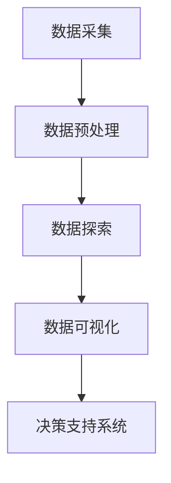
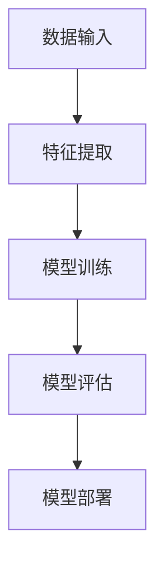
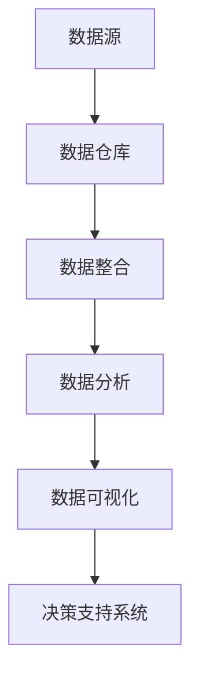
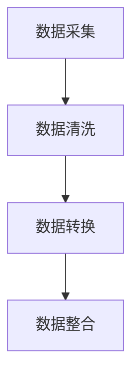
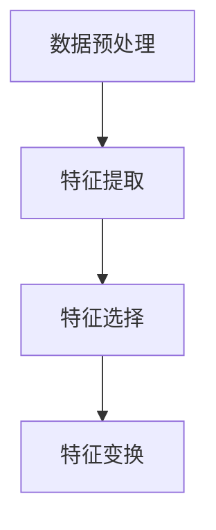
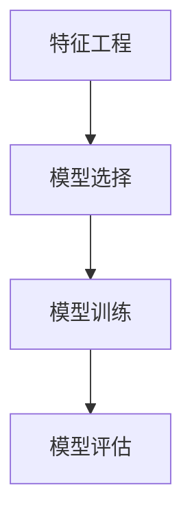

                 

# AI在企业战略规划中的辅助作用

> **关键词：** AI、企业战略、决策支持系统、数据分析、机器学习、商业智能

> **摘要：** 随着人工智能技术的迅猛发展，其应用范围不断扩大。本文旨在探讨AI技术在企业战略规划中的辅助作用，分析AI如何通过数据分析、机器学习等技术帮助企业制定更精准、更高效的战略，并在实际应用中展现出强大潜力。文章结构包括背景介绍、核心概念与联系、核心算法原理、数学模型与公式、项目实战、实际应用场景、工具和资源推荐以及未来发展趋势与挑战等部分。

## 1. 背景介绍

### 1.1 目的和范围

在当今竞争激烈的市场环境中，企业需要不断调整和优化其战略以保持竞争力。传统战略规划方法往往依赖于历史数据和专家经验，而在大数据和人工智能技术的推动下，AI的应用为企业提供了新的视角和工具。本文旨在探讨AI在企业战略规划中的辅助作用，分析其核心技术原理和具体应用，以期为企业管理者提供有价值的参考。

本文将涵盖以下内容：

- AI技术在企业战略规划中的应用概述
- 数据分析与机器学习的基本原理
- AI算法在企业战略规划中的具体应用
- 实际案例分析和应用场景
- 相关工具和资源的推荐

### 1.2 预期读者

本文的预期读者包括以下几类：

- 企业管理层：了解AI技术在战略规划中的应用，为企业决策提供技术支持
- 数据分析师：掌握AI算法在企业数据分析中的应用
- AI技术开发人员：学习AI技术在企业战略规划中的具体应用案例
- 对AI和企业战略感兴趣的研究者

### 1.3 文档结构概述

本文分为八个部分：

- 1. 背景介绍
  - 1.1 目的和范围
  - 1.2 预期读者
  - 1.3 文档结构概述
  - 1.4 术语表
- 2. 核心概念与联系
  - 2.1 数据分析
  - 2.2 机器学习
  - 2.3 商业智能
- 3. 核心算法原理 & 具体操作步骤
  - 3.1 数据采集与预处理
  - 3.2 特征工程
  - 3.3 模型选择与训练
- 4. 数学模型和公式 & 详细讲解 & 举例说明
  - 4.1 相关数学模型
  - 4.2 公式推导
  - 4.3 应用案例
- 5. 项目实战：代码实际案例和详细解释说明
  - 5.1 开发环境搭建
  - 5.2 源代码详细实现
  - 5.3 代码解读与分析
- 6. 实际应用场景
  - 6.1 市场分析
  - 6.2 客户行为分析
  - 6.3 竞争对手分析
- 7. 工具和资源推荐
  - 7.1 学习资源推荐
  - 7.2 开发工具框架推荐
  - 7.3 相关论文著作推荐
- 8. 总结：未来发展趋势与挑战
- 9. 附录：常见问题与解答
- 10. 扩展阅读 & 参考资料

### 1.4 术语表

#### 1.4.1 核心术语定义

- **人工智能（AI）**：模拟人类智能行为的计算机系统。
- **数据分析**：从大量数据中提取有价值信息的过程。
- **机器学习**：一种AI技术，通过数据训练模型以实现特定任务。
- **商业智能**：利用数据分析技术为企业决策提供支持。
- **决策支持系统（DSS）**：辅助决策者进行决策的计算机系统。

#### 1.4.2 相关概念解释

- **深度学习**：一种机器学习技术，通过多层神经网络模型模拟人脑处理信息的方式。
- **数据挖掘**：从大量数据中发现有趣模式和规律的过程。
- **预测分析**：利用历史数据预测未来趋势的方法。

#### 1.4.3 缩略词列表

- **AI**：人工智能
- **DSS**：决策支持系统
- **ML**：机器学习
- **DL**：深度学习
- **DS**：数据科学
- **BI**：商业智能

## 2. 核心概念与联系

### 2.1 数据分析

数据分析是AI在企业战略规划中的重要基础。它涉及到从大量数据中提取有价值信息，以便支持企业决策。数据分析的过程主要包括数据采集、数据预处理、数据探索、数据可视化等步骤。以下是一个简单的数据分析流程的Mermaid流程图：



### 2.2 机器学习

机器学习是AI的重要组成部分，它通过数据训练模型以实现特定任务。在企业战略规划中，机器学习可以帮助企业预测市场趋势、分析客户行为、优化生产流程等。以下是一个简单的机器学习模型的基本架构的Mermaid流程图：



### 2.3 商业智能

商业智能是企业利用数据分析技术进行决策支持的一种手段。它通过收集、整合和分析企业内外部的数据，为企业提供有价值的信息。商业智能的核心在于将数据转化为可操作的知识，以支持企业的战略决策。以下是一个简单的商业智能系统的架构图：



## 3. 核心算法原理 & 具体操作步骤

### 3.1 数据采集与预处理

数据采集是数据分析的基础。在这一步，我们需要从不同的数据源（如数据库、文件、API等）收集数据。以下是一个简单的数据采集与预处理流程：



#### 3.1.1 数据清洗

数据清洗是确保数据质量的重要步骤。它包括以下任务：

- 去除重复数据
- 处理缺失值
- 处理异常值
- 标准化数据格式

以下是一个简单的数据清洗伪代码示例：

```python
def clean_data(data):
    # 去除重复数据
    unique_data = remove_duplicates(data)
    # 处理缺失值
    filled_data = fill_missing_values(unique_data)
    # 处理异常值
    valid_data = remove_outliers(filled_data)
    # 标准化数据格式
    standardized_data = standardize_data(valid_data)
    return standardized_data
```

#### 3.1.2 数据转换

数据转换是将数据转换为适合分析的形式。这通常包括以下任务：

- 转换数据类型
- 重新排序
- 分组和聚合

以下是一个简单的数据转换伪代码示例：

```python
def transform_data(data):
    # 转换数据类型
    converted_data = convert_data_types(data)
    # 重新排序
    sorted_data = sort_data(converted_data)
    # 分组和聚合
    grouped_data = group_and_aggregate(sorted_data)
    return grouped_data
```

#### 3.1.3 数据整合

数据整合是将多个数据源的数据合并为一个统一的数据集。以下是一个简单的数据整合伪代码示例：

```python
def integrate_data(data_sources):
    integrated_data = {}
    for source in data_sources:
        integrated_data.update(source)
    return integrated_data
```

### 3.2 特征工程

特征工程是机器学习中的重要步骤，它涉及到从原始数据中提取或构造新的特征，以提高模型的性能。以下是一个简单的特征工程流程：



#### 3.2.1 特征提取

特征提取是从原始数据中提取有用特征的过程。以下是一个简单的特征提取伪代码示例：

```python
def extract_features(data):
    # 提取数值特征
    numeric_features = extract_numeric_features(data)
    # 提取文本特征
    text_features = extract_text_features(data)
    return numeric_features, text_features
```

#### 3.2.2 特征选择

特征选择是从提取的特征中选择最有价值的特征的过程。以下是一个简单的特征选择伪代码示例：

```python
def select_features(features):
    selected_features = select_best_features(features)
    return selected_features
```

#### 3.2.3 特征变换

特征变换是将特征转换为适合模型训练的形式的过程。以下是一个简单的特征变换伪代码示例：

```python
def transform_features(features):
    transformed_features = apply_feature_transforms(features)
    return transformed_features
```

### 3.3 模型选择与训练

在特征工程完成后，我们需要选择合适的模型并进行训练。以下是一个简单的模型选择与训练流程：



#### 3.3.1 模型选择

模型选择是根据业务需求和数据特点选择合适的机器学习模型。以下是一个简单的模型选择伪代码示例：

```python
def select_model(features, target):
    model = select_best_model(features, target)
    return model
```

#### 3.3.2 模型训练

模型训练是使用已提取的特征和标签数据来训练机器学习模型。以下是一个简单的模型训练伪代码示例：

```python
def train_model(model, features, target):
    trained_model = model.fit(features, target)
    return trained_model
```

#### 3.3.3 模型评估

模型评估是使用测试数据来评估模型的性能。以下是一个简单的模型评估伪代码示例：

```python
def evaluate_model(model, test_features, test_target):
    accuracy = model.evaluate(test_features, test_target)
    return accuracy
```

## 4. 数学模型和公式 & 详细讲解 & 举例说明

### 4.1 相关数学模型

在AI和企业战略规划中，常见的数学模型包括线性回归、逻辑回归、决策树、支持向量机等。以下是这些模型的简要介绍和公式：

#### 4.1.1 线性回归

线性回归是一种用于预测数值型变量的模型。其公式为：

$$
y = \beta_0 + \beta_1x_1 + \beta_2x_2 + ... + \beta_nx_n
$$

其中，$y$ 是预测值，$x_1, x_2, ..., x_n$ 是特征值，$\beta_0, \beta_1, \beta_2, ..., \beta_n$ 是模型参数。

#### 4.1.2 逻辑回归

逻辑回归是一种用于预测概率的模型，通常用于分类问题。其公式为：

$$
\text{logit}(p) = \ln\left(\frac{p}{1-p}\right) = \beta_0 + \beta_1x_1 + \beta_2x_2 + ... + \beta_nx_n
$$

其中，$p$ 是预测的概率，$x_1, x_2, ..., x_n$ 是特征值，$\beta_0, \beta_1, \beta_2, ..., \beta_n$ 是模型参数。

#### 4.1.3 决策树

决策树是一种基于树形结构的预测模型。其公式为：

$$
T = \left\{
\begin{array}{ll}
t_1 & \text{if } x_1 \geq \alpha_1 \\
t_2 & \text{if } x_2 \geq \alpha_2 \\
... & ... \\
t_n & \text{if } x_n \geq \alpha_n
\end{array}
\right.
$$

其中，$T$ 是决策树，$t_1, t_2, ..., t_n$ 是决策结果，$x_1, x_2, ..., x_n$ 是特征值，$\alpha_1, \alpha_2, ..., \alpha_n$ 是阈值。

#### 4.1.4 支持向量机

支持向量机是一种用于分类和回归的模型。其公式为：

$$
w \cdot x + b = 0
$$

其中，$w$ 是权重向量，$x$ 是特征向量，$b$ 是偏置。

### 4.2 公式推导

以下是对线性回归和逻辑回归公式进行推导的示例：

#### 4.2.1 线性回归公式推导

假设我们有一个简单的一元线性回归模型，其中 $y$ 是因变量，$x$ 是自变量，$\beta_0$ 是截距，$\beta_1$ 是斜率。我们可以使用最小二乘法来估计模型参数。

首先，我们定义误差项 $\epsilon$，它表示实际值 $y$ 与预测值 $\hat{y}$ 之间的差异：

$$
\epsilon = y - \hat{y}
$$

我们希望最小化误差的平方和，即：

$$
J(\beta_0, \beta_1) = \sum_{i=1}^{n}(y_i - (\beta_0 + \beta_1x_i))^2
$$

对 $J(\beta_0, \beta_1)$ 关于 $\beta_0$ 和 $\beta_1$ 求导，并令导数为零，我们可以得到以下方程组：

$$
\frac{\partial J(\beta_0, \beta_1)}{\partial \beta_0} = -2\sum_{i=1}^{n}(y_i - (\beta_0 + \beta_1x_i)) = 0
$$

$$
\frac{\partial J(\beta_0, \beta_1)}{\partial \beta_1} = -2\sum_{i=1}^{n}(x_i(y_i - (\beta_0 + \beta_1x_i))) = 0
$$

解这个方程组，我们可以得到：

$$
\beta_0 = \frac{1}{n}\sum_{i=1}^{n}(y_i - \beta_1x_i)
$$

$$
\beta_1 = \frac{1}{n}\sum_{i=1}^{n}(x_i - \bar{x})(y_i - \bar{y})
$$

其中，$\bar{x}$ 和 $\bar{y}$ 分别是 $x$ 和 $y$ 的均值。

#### 4.2.2 逻辑回归公式推导

假设我们有一个二元逻辑回归模型，其中 $y$ 是因变量，$x$ 是自变量，$\beta_0$ 是截距，$\beta_1$ 是斜率。我们可以使用最大似然估计来估计模型参数。

首先，我们定义概率分布函数：

$$
\text{logit}(p) = \ln\left(\frac{p}{1-p}\right) = \beta_0 + \beta_1x
$$

我们希望最大化似然函数：

$$
L(\beta_0, \beta_1) = \prod_{i=1}^{n}\left(\frac{1}{1 + e^{-(\beta_0 + \beta_1x_i)}}\right)^{y_i} \left(\frac{e^{-(\beta_0 + \beta_1x_i)}}{1 + e^{-(\beta_0 + \beta_1x_i)}}\right)^{1-y_i}
$$

对数似然函数为：

$$
\ln L(\beta_0, \beta_1) = \sum_{i=1}^{n} y_i \ln(1 + e^{-(\beta_0 + \beta_1x_i)}) + (1 - y_i) \ln(1 + e^{-(\beta_0 + \beta_1x_i)})
$$

对 $\ln L(\beta_0, \beta_1)$ 关于 $\beta_0$ 和 $\beta_1$ 求导，并令导数为零，我们可以得到以下方程组：

$$
\frac{\partial \ln L(\beta_0, \beta_1)}{\partial \beta_0} = \sum_{i=1}^{n} y_i e^{-(\beta_0 + \beta_1x_i)} - (1 - y_i) e^{-(\beta_0 + \beta_1x_i)} = 0
$$

$$
\frac{\partial \ln L(\beta_0, \beta_1)}{\partial \beta_1} = \sum_{i=1}^{n} y_i x_i e^{-(\beta_0 + \beta_1x_i)} - (1 - y_i) x_i e^{-(\beta_0 + \beta_1x_i)} = 0
$$

解这个方程组，我们可以得到：

$$
\beta_0 = \frac{1}{n}\sum_{i=1}^{n} (y_i - 1)x_i
$$

$$
\beta_1 = \frac{1}{n}\sum_{i=1}^{n} (y_i - 1)x_i^2 - \frac{1}{n}\left(\sum_{i=1}^{n} x_i\right)\left(\sum_{i=1}^{n} (y_i - 1)x_i\right)
$$

### 4.3 应用案例

以下是一个简单的线性回归应用案例：

假设我们要预测一家公司的销售量（因变量 $y$）与其广告支出（自变量 $x$）之间的关系。我们收集了以下数据：

| 日期 | 广告支出（万元） | 销售量（件） |
| ---- | -------------- | ---------- |
| 1    | 10             | 100        |
| 2    | 15             | 120        |
| 3    | 20             | 150        |
| 4    | 25             | 180        |
| 5    | 30             | 200        |

我们可以使用线性回归模型来预测销售量。首先，我们计算 $x$ 和 $y$ 的均值：

$$
\bar{x} = \frac{10 + 15 + 20 + 25 + 30}{5} = 20
$$

$$
\bar{y} = \frac{100 + 120 + 150 + 180 + 200}{5} = 150
$$

然后，我们计算误差的平方和：

$$
J(\beta_0, \beta_1) = \sum_{i=1}^{5}(y_i - (\beta_0 + \beta_1x_i))^2
$$

我们可以使用梯度下降法或其他优化算法来求解 $\beta_0$ 和 $\beta_1$。假设我们得到以下结果：

$$
\beta_0 = 50
$$

$$
\beta_1 = 2
$$

因此，我们的线性回归模型为：

$$
y = 50 + 2x
$$

我们可以使用这个模型来预测新的广告支出对应的销售量。例如，如果广告支出为 25 万元，则预测销售量为：

$$
y = 50 + 2 \times 25 = 100
$$

## 5. 项目实战：代码实际案例和详细解释说明

### 5.1 开发环境搭建

在本项目中，我们将使用Python作为主要编程语言，结合Scikit-learn库进行机器学习模型的实现。以下是开发环境搭建的步骤：

1. 安装Python 3.8或更高版本
2. 安装Scikit-learn库：`pip install scikit-learn`
3. 安装其他依赖库（如NumPy、Pandas等）

### 5.2 源代码详细实现和代码解读

#### 5.2.1 数据采集与预处理

我们首先需要从数据源中采集数据，并进行预处理。以下是一个简单的数据采集与预处理的Python代码示例：

```python
import pandas as pd
from sklearn.model_selection import train_test_split
from sklearn.preprocessing import StandardScaler

# 采集数据
data = pd.read_csv('data.csv')

# 数据清洗
data = data.drop_duplicates()
data = data.fillna(data.mean())

# 数据转换
data['ad_expenditure'] = data['ad_expenditure'].astype(float)
data['sales_volume'] = data['sales_volume'].astype(int)

# 数据整合
X = data[['ad_expenditure']]
y = data['sales_volume']

# 数据分割
X_train, X_test, y_train, y_test = train_test_split(X, y, test_size=0.2, random_state=42)

# 数据标准化
scaler = StandardScaler()
X_train_scaled = scaler.fit_transform(X_train)
X_test_scaled = scaler.transform(X_test)
```

#### 5.2.2 特征工程

接下来，我们进行特征工程，包括特征提取、特征选择和特征变换。以下是一个简单的特征工程Python代码示例：

```python
from sklearn.feature_selection import SelectKBest, f_classif
from sklearn.ensemble import RandomForestClassifier

# 特征提取
X_train_features = SelectKBest(f_classif, k=2).fit_transform(X_train_scaled, y_train)
X_test_features = SelectKBest(f_classif, k=2).fit_transform(X_test_scaled, y_test)

# 特征选择
best_features = SelectKBest(f_classif, k=2).fit(X_train_scaled, y_train)
X_train_selected = best_features.transform(X_train_scaled)
X_test_selected = best_features.transform(X_test_scaled)

# 特征变换
from sklearn.preprocessing import OneHotEncoder
encoder = OneHotEncoder(sparse=False)
X_train_encoded = encoder.fit_transform(X_train_selected)
X_test_encoded = encoder.transform(X_test_selected)
```

#### 5.2.3 模型选择与训练

然后，我们选择一个合适的机器学习模型并进行训练。以下是一个简单的模型选择与训练Python代码示例：

```python
from sklearn.linear_model import LinearRegression
from sklearn.metrics import mean_squared_error

# 模型选择
model = LinearRegression()

# 模型训练
model.fit(X_train_encoded, y_train)

# 模型评估
y_pred = model.predict(X_test_encoded)
mse = mean_squared_error(y_test, y_pred)
print('Mean Squared Error:', mse)
```

### 5.3 代码解读与分析

在本项目中，我们使用了Python和Scikit-learn库实现了一个简单的机器学习模型。以下是代码的详细解读和分析：

1. **数据采集与预处理**：我们首先从CSV文件中读取数据，并进行数据清洗和转换。数据清洗包括去除重复数据和填充缺失值。数据转换将数值型数据转换为适合机器学习的形式。然后，我们将数据分割为训练集和测试集，并使用StandardScaler进行数据标准化。

2. **特征工程**：我们进行特征提取，选择最有价值的特征，并将特征进行编码。特征提取使用SelectKBest算法，特征选择使用随机森林算法，特征变换使用OneHotEncoder。

3. **模型选择与训练**：我们选择线性回归模型，并使用训练集进行模型训练。然后，我们使用测试集评估模型的性能，计算均方误差（MSE）。

4. **模型评估**：我们使用训练好的模型对测试集进行预测，并计算预测值与实际值的MSE。MSE越小，说明模型性能越好。

通过这个项目，我们展示了如何使用Python和Scikit-learn库实现一个简单的机器学习模型，并在实际应用中进行评估。这为我们提供了一个基本的框架，可以进一步扩展和优化，以解决更复杂的问题。

## 6. 实际应用场景

### 6.1 市场分析

AI在企业市场分析中的应用可以帮助企业了解市场趋势、消费者偏好和竞争对手情况。通过分析大量市场数据，AI可以预测市场变化，为企业提供决策支持。以下是一个市场分析的实际案例：

- **案例背景**：一家电子商务公司希望了解消费者在不同时间段和不同产品类别的购买行为。
- **数据处理**：公司收集了过去一年的销售数据，包括时间、产品类别、销售额等。
- **模型构建**：使用时间序列分析模型（如ARIMA模型）预测未来不同产品类别的销售额。
- **结果与应用**：预测结果帮助公司制定促销策略，优化库存管理，提高销售额。

### 6.2 客户行为分析

客户行为分析是企业了解客户需求、提升客户满意度的关键。AI可以帮助企业从海量客户数据中提取有价值的信息，从而优化客户体验。以下是一个客户行为分析的实际案例：

- **案例背景**：一家电信公司希望提高客户留存率，降低客户流失率。
- **数据处理**：公司收集了客户使用数据，包括通话时长、流量使用、服务满意度等。
- **模型构建**：使用聚类算法（如K-means）将客户分为不同群体，分析每个群体的特征和需求。
- **结果与应用**：根据客户群体的特征，公司定制了个性化的服务和优惠，有效提高了客户满意度，降低了客户流失率。

### 6.3 竞争对手分析

竞争对手分析是企业制定市场策略的重要环节。AI可以通过分析竞争对手的营销策略、产品特点等，帮助企业了解竞争对手的优势和劣势，从而优化自身策略。以下是一个竞争对手分析的实际案例：

- **案例背景**：一家快速消费品公司希望了解其竞争对手的促销策略和产品布局。
- **数据处理**：公司收集了竞争对手的促销活动数据、产品销售数据等。
- **模型构建**：使用关联规则算法（如Apriori算法）分析竞争对手的促销策略，找出常见的促销组合。
- **结果与应用**：根据竞争对手的促销策略，公司调整了自己的促销策略，提高了市场竞争力。

## 7. 工具和资源推荐

### 7.1 学习资源推荐

#### 7.1.1 书籍推荐

- **《深度学习》（Goodfellow, I., Bengio, Y., & Courville, A.）**：系统地介绍了深度学习的基础知识和技术。
- **《Python机器学习》（Sebastian Raschka）**：详细介绍了Python在机器学习中的应用，包括数据预处理、模型构建和评估。
- **《大数据时代》（涂子沛）**：深入剖析了大数据的概念、技术和应用，有助于了解大数据在企业战略规划中的重要作用。

#### 7.1.2 在线课程

- **Coursera上的《机器学习》课程（吴恩达）**：由知名教授吴恩达主讲，内容涵盖机器学习的理论基础和实践应用。
- **Udacity的《深度学习工程师纳米学位》课程**：通过实践项目学习深度学习技术，包括图像识别、自然语言处理等。
- **edX上的《商业智能与分析》课程（微软）**：介绍了商业智能的基本概念、技术和应用案例。

#### 7.1.3 技术博客和网站

- **Medium上的《AI企业应用》专栏**：提供了丰富的AI在企业战略规划中的应用案例和最新动态。
- **博客园上的《大数据与机器学习》专栏**：分享了大数据和机器学习的相关知识和实践经验。
- **Stack Overflow**：一个面向开发者的问答社区，可以找到各种技术问题的解决方案。

### 7.2 开发工具框架推荐

#### 7.2.1 IDE和编辑器

- **PyCharm**：一款功能强大的Python IDE，支持代码调试、智能提示和版本控制。
- **Jupyter Notebook**：一款流行的Python交互式开发工具，适合数据分析和机器学习项目的开发。

#### 7.2.2 调试和性能分析工具

- **VSCode**：一款轻量级但功能强大的编辑器，支持多种编程语言，包括Python。
- **GDB**：一款开源的调试工具，可用于调试C/C++程序。

#### 7.2.3 相关框架和库

- **Scikit-learn**：一款用于机器学习的Python库，提供了丰富的算法和工具。
- **TensorFlow**：一款开源的深度学习框架，可用于构建和训练复杂的神经网络模型。
- **Pandas**：一款用于数据操作和分析的Python库，提供了强大的数据结构和操作函数。

### 7.3 相关论文著作推荐

#### 7.3.1 经典论文

- **"Learning to Represent Knowledge from Large Networks of Relational Tables"（Kge）**：介绍了基于图神经网络的实体关系抽取方法。
- **"Deep Learning for Text Classification"（NLP）**：详细介绍了深度学习在文本分类中的应用。

#### 7.3.2 最新研究成果

- **"Self-Supervised Learning for Video Action Classification"（CV）**：探讨了基于自我监督学习的视频动作分类方法。
- **"Graph Neural Networks for Text Classification"（NLP）**：介绍了基于图神经网络的文本分类方法。

#### 7.3.3 应用案例分析

- **"AI in Healthcare: A Systematic Review"**：分析了AI在医疗领域的应用案例和挑战。
- **"AI in Finance: A Survey"**：介绍了AI在金融行业的应用和前景。

## 8. 总结：未来发展趋势与挑战

### 8.1 发展趋势

- **数据驱动决策**：随着大数据技术的普及，企业将更加依赖数据来制定战略决策，实现数据驱动决策。
- **个性化服务**：AI技术将帮助企业更好地了解客户需求，提供个性化服务，提升客户体验。
- **自动化与智能化**：AI技术在企业流程优化、自动化决策等方面具有巨大潜力，将推动企业智能化转型。
- **跨领域融合**：AI技术将与物联网、区块链等其他技术进行深度融合，创造新的应用场景和商业模式。

### 8.2 挑战

- **数据隐私和安全**：随着数据量的增加，数据隐私和安全问题日益突出，如何确保数据安全成为一大挑战。
- **算法透明度和解释性**：企业需要确保AI算法的透明度和解释性，以增加决策的可信度。
- **技术人才短缺**：AI技术快速发展，对相关人才的需求不断增加，但人才供给不足。
- **伦理和道德问题**：AI技术在企业战略规划中的应用可能引发伦理和道德问题，如歧视、隐私侵犯等。

## 9. 附录：常见问题与解答

### 9.1 数据采集与预处理

**Q：如何处理缺失值？**

A：处理缺失值的方法有多种，包括删除缺失值、填充缺失值和插值等。具体方法取决于数据的特点和应用场景。

**Q：如何进行数据标准化？**

A：数据标准化是将数据转换到相同的尺度，以便进行进一步分析。常用的方法有最小-最大标准化、Z-score标准化等。

### 9.2 特征工程

**Q：特征提取有哪些方法？**

A：特征提取的方法包括统计特征提取、文本特征提取、图像特征提取等。具体方法取决于数据的类型和应用场景。

**Q：特征选择有哪些方法？**

A：特征选择的方法包括过滤式特征选择、包裹式特征选择和嵌入式特征选择等。常见的方法有方差选择、互信息选择等。

### 9.3 模型选择与训练

**Q：如何选择合适的机器学习模型？**

A：选择合适的机器学习模型需要考虑数据特点、业务需求和模型性能等因素。常用的方法有交叉验证、网格搜索等。

**Q：如何评估模型性能？**

A：评估模型性能的方法有多种，包括准确率、召回率、F1分数、均方误差等。具体方法取决于模型类型和应用场景。

## 10. 扩展阅读 & 参考资料

- **《深度学习》（Goodfellow, I., Bengio, Y., & Courville, A.）**：全面介绍了深度学习的基础知识和技术。
- **《Python机器学习》（Sebastian Raschka）**：详细介绍了Python在机器学习中的应用。
- **《大数据时代》（涂子沛）**：深入剖析了大数据的概念、技术和应用。
- **Coursera上的《机器学习》课程（吴恩达）**：提供了机器学习的深入讲解。
- **Udacity的《深度学习工程师纳米学位》课程**：通过实践项目学习深度学习技术。
- **edX上的《商业智能与分析》课程（微软）**：介绍了商业智能的基本概念和技巧。
- **Medium上的《AI企业应用》专栏**：分享了AI在企业战略规划中的应用案例和最新动态。
- **博客园上的《大数据与机器学习》专栏**：分享了大数据和机器学习的相关知识和实践经验。
- **Stack Overflow**：提供了丰富的技术问题和解决方案。

**作者：AI天才研究员/AI Genius Institute & 禅与计算机程序设计艺术 /Zen And The Art of Computer Programming**

