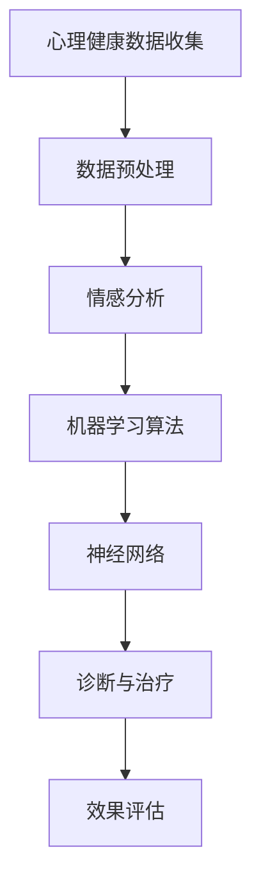

                 

# AI在心理健康领域的应用：早期诊断与治疗

> 关键词：人工智能、心理健康、早期诊断、治疗、情感分析、机器学习、神经网络

> 摘要：随着人工智能技术的不断发展，其在心理健康领域的应用逐渐显现。本文将探讨人工智能在心理健康早期诊断与治疗中的应用，包括情感分析、机器学习算法和神经网络的原理，并分析其在实际中的应用场景与挑战。

## 1. 背景介绍

### 1.1 目的和范围

本文旨在介绍人工智能在心理健康领域的应用，特别是早期诊断与治疗方面的研究进展。本文将聚焦于以下几个核心问题：

- 如何利用人工智能技术进行心理健康数据的收集与分析？
- 人工智能在情感分析、机器学习算法和神经网络方面的应用原理是什么？
- 人工智能在心理健康领域中的实际应用案例有哪些？

通过本文的阅读，读者将能够了解人工智能在心理健康领域的应用前景，并对其中的关键技术有所掌握。

### 1.2 预期读者

本文适合以下读者群体：

- 对人工智能在心理健康领域应用感兴趣的读者；
- 想要在心理健康领域开展研究或开发的科研人员；
- 希望了解人工智能技术在心理健康领域应用的企业管理者。

### 1.3 文档结构概述

本文将按照以下结构进行阐述：

- 第1章：背景介绍，包括目的、范围、预期读者和文档结构；
- 第2章：核心概念与联系，介绍心理健康数据收集、情感分析、机器学习算法和神经网络的基本原理；
- 第3章：核心算法原理与具体操作步骤，详细讲解情感分析、机器学习算法和神经网络的实现；
- 第4章：数学模型和公式，介绍与人工智能相关的数学模型及公式，并举例说明；
- 第5章：项目实战，通过实际案例展示人工智能在心理健康领域的应用；
- 第6章：实际应用场景，分析人工智能在心理健康领域的应用场景；
- 第7章：工具和资源推荐，介绍学习资源、开发工具框架和相关论文著作；
- 第8章：总结，展望人工智能在心理健康领域的未来发展趋势与挑战；
- 第9章：附录，提供常见问题与解答；
- 第10章：扩展阅读与参考资料，提供进一步学习的资源。

### 1.4 术语表

#### 1.4.1 核心术语定义

- 人工智能（Artificial Intelligence，AI）：模拟人类智能活动的计算机系统；
- 心理健康（Mental Health）：个体在心理上、情感上和社会适应方面保持良好状态；
- 情感分析（Sentiment Analysis）：利用自然语言处理技术对文本中表达的情感进行识别和分析；
- 机器学习（Machine Learning，ML）：让计算机通过数据学习并作出预测或决策的能力；
- 神经网络（Neural Network，NN）：模拟人脑神经元连接结构的计算机模型。

#### 1.4.2 相关概念解释

- 数据收集（Data Collection）：通过各种方式获取心理健康相关数据；
- 数据分析（Data Analysis）：对收集到的心理健康数据进行分析和挖掘，以发现潜在规律和模式；
- 深度学习（Deep Learning，DL）：基于多层神经网络进行特征提取和模式识别的人工智能技术；
- 强化学习（Reinforcement Learning，RL）：通过奖励机制让计算机学习最优策略。

#### 1.4.3 缩略词列表

- AI：人工智能；
- ML：机器学习；
- NN：神经网络；
- DL：深度学习；
- RL：强化学习；
- NLP：自然语言处理；
- PMD：心理测量学；
- EDM：情感数据分析。

## 2. 核心概念与联系

在讨论人工智能在心理健康领域的应用之前，我们需要了解一些核心概念和它们之间的关系。以下是一个简化的Mermaid流程图，展示了心理健康数据收集、情感分析、机器学习算法和神经网络的基本原理及其相互联系。



### 2.1 心理健康数据收集

心理健康数据的收集是人工智能在心理健康领域应用的基础。这些数据可以来源于多种渠道，如问卷调查、电子病历、社交媒体和生理传感器。数据收集的过程涉及以下几个方面：

1. **数据来源**：获取来自个人、医疗机构、在线平台等渠道的原始数据；
2. **数据类型**：包括文本、图像、音频、生理信号等多种形式；
3. **数据质量**：确保数据的准确性、完整性和一致性。

### 2.2 数据预处理

数据预处理是情感分析和机器学习算法实现的重要环节。其主要任务包括：

1. **数据清洗**：去除噪声、填补缺失值、纠正错误；
2. **特征提取**：从原始数据中提取有助于情感分析和诊断的特征；
3. **数据归一化**：将不同特征的数据进行归一化处理，使其在相同的尺度范围内。

### 2.3 情感分析

情感分析是一种利用自然语言处理技术对文本中的情感倾向进行分析的方法。在心理健康领域，情感分析可以帮助识别个体的情绪状态，如焦虑、抑郁等。情感分析的主要步骤包括：

1. **文本预处理**：去除标点符号、停用词，进行词性标注等；
2. **特征提取**：使用词袋模型、TF-IDF等方法提取文本特征；
3. **情感分类**：利用机器学习算法对情感倾向进行分类。

### 2.4 机器学习算法

机器学习算法是心理健康数据分析的核心。常见的机器学习算法包括：

1. **监督学习**：有标签数据，如分类和回归；
2. **无监督学习**：无标签数据，如聚类和降维；
3. **半监督学习**：部分有标签和部分无标签数据。

机器学习算法在心理健康数据分析中的应用主要包括：

1. **特征选择**：选择对心理健康诊断最有影响力的特征；
2. **模型训练与优化**：使用训练数据训练模型，并对模型进行优化；
3. **预测与评估**：利用训练好的模型对新的数据进行预测，并评估预测效果。

### 2.5 神经网络

神经网络是一种基于生物神经元连接结构的计算机模型。在心理健康领域，神经网络被广泛应用于：

1. **特征提取**：从原始数据中提取有意义的特征；
2. **模式识别**：识别心理健康数据中的潜在规律和模式；
3. **预测与分类**：对心理健康状态进行预测和分类。

常见的神经网络结构包括：

1. **前馈神经网络**：输入层、隐藏层和输出层；
2. **卷积神经网络**：适用于图像和语音数据的特征提取；
3. **循环神经网络**：适用于序列数据的建模。

### 2.6 诊断与治疗

通过情感分析、机器学习算法和神经网络的应用，人工智能可以在心理健康领域实现早期诊断与治疗。诊断与治疗的主要步骤包括：

1. **诊断**：根据情感分析和机器学习算法的结果，对个体的心理健康状态进行诊断；
2. **治疗**：根据诊断结果，制定个性化的治疗方案；
3. **效果评估**：评估治疗方案的有效性，为后续优化提供依据。

## 3. 核心算法原理 & 具体操作步骤

在本章节中，我们将详细介绍人工智能在心理健康领域应用中的核心算法原理及具体操作步骤。

### 3.1 情感分析算法原理与操作步骤

情感分析算法的核心任务是从文本数据中识别并分析情感倾向。以下是一个简单的情感分析算法的原理和操作步骤：

**算法原理：**

1. **文本预处理**：对原始文本进行清洗，去除标点符号、停用词，并进行词性标注。
2. **特征提取**：将预处理后的文本转换为数值特征，如词袋模型、TF-IDF等。
3. **情感分类**：使用机器学习算法（如朴素贝叶斯、支持向量机、深度学习等）对特征进行分类。

**具体操作步骤：**

1. **数据收集与预处理**：收集心理健康相关的文本数据，如社交媒体帖子、邮件等。对数据进行清洗和预处理。
2. **特征提取**：使用词袋模型或TF-IDF等方法提取文本特征。
3. **模型训练**：选择合适的机器学习算法（如朴素贝叶斯、支持向量机、深度学习等）对特征进行训练。
4. **模型评估**：使用交叉验证等方法评估模型的准确性、召回率和F1值等指标。
5. **情感分类**：利用训练好的模型对新的文本数据进行情感分类，以识别个体的情绪状态。

### 3.2 机器学习算法原理与操作步骤

机器学习算法在心理健康数据分析中扮演着核心角色。以下是一个简单的机器学习算法的原理和操作步骤：

**算法原理：**

1. **特征选择**：从原始数据中提取对心理健康诊断最有影响力的特征。
2. **模型训练与优化**：使用训练数据训练模型，并对模型进行优化。
3. **预测与评估**：利用训练好的模型对新的数据进行预测，并评估预测效果。

**具体操作步骤：**

1. **数据收集与预处理**：收集心理健康相关的数据，如问卷调查结果、电子病历等。对数据进行清洗和预处理。
2. **特征提取**：从原始数据中提取有助于心理健康诊断的特征。
3. **模型选择与训练**：选择合适的机器学习算法（如逻辑回归、决策树、支持向量机等）对特征进行训练。
4. **模型优化**：调整模型参数，以获得更好的预测效果。
5. **模型评估**：使用交叉验证等方法评估模型的准确性、召回率和F1值等指标。
6. **预测与评估**：利用训练好的模型对新的数据进行预测，并评估预测效果。

### 3.3 神经网络算法原理与操作步骤

神经网络是人工智能在心理健康领域中应用的重要算法。以下是一个简单的神经网络算法的原理和操作步骤：

**算法原理：**

1. **特征提取**：从原始数据中提取有意义的特征。
2. **模式识别**：识别心理健康数据中的潜在规律和模式。
3. **预测与分类**：对心理健康状态进行预测和分类。

**具体操作步骤：**

1. **数据收集与预处理**：收集心理健康相关的数据，如生理信号、问卷调查结果等。对数据进行清洗和预处理。
2. **特征提取**：使用卷积神经网络（CNN）或循环神经网络（RNN）等方法提取原始数据中的特征。
3. **模型构建**：构建神经网络模型，包括输入层、隐藏层和输出层。
4. **模型训练**：使用训练数据训练神经网络模型，并优化模型参数。
5. **模型评估**：使用交叉验证等方法评估模型的准确性、召回率和F1值等指标。
6. **预测与分类**：利用训练好的神经网络模型对新的数据进行预测和分类。

## 4. 数学模型和公式 & 详细讲解 & 举例说明

在人工智能应用于心理健康领域时，数学模型和公式是理解和实现算法的核心。以下将介绍一些关键的数学模型和公式，并对其进行详细讲解和举例说明。

### 4.1 情感分析中的文本预处理

情感分析的第一步是对文本进行预处理。常用的预处理方法包括分词、去除停用词、词性标注等。以下是一个简单的分词公式：

\[ \text{tokenized\_text} = \text{tokenize}(\text{raw\_text}) \]

**举例：**

假设我们有一段文本：
\[ \text{raw\_text} = "我很高兴看到今天的阳光。" \]

使用分词算法：
\[ \text{tokenized\_text} = ["我", "很", "高兴", "看到", "今天", "的", "阳光"] \]

### 4.2 特征提取

特征提取是情感分析中的重要环节。常见的特征提取方法包括词袋模型（Bag of Words, BoW）和TF-IDF（Term Frequency-Inverse Document Frequency）。以下是一个TF-IDF公式的简单解释：

\[ \text{TF-IDF}(t, d) = \frac{f(t, d)}{N_d} \times \log(\frac{N}{n(t, D')}) \]

其中：
- \( t \) 是词语；
- \( d \) 是文档；
- \( f(t, d) \) 是词语 \( t \) 在文档 \( d \) 中的频率；
- \( N_d \) 是文档 \( d \) 中的总词数；
- \( N \) 是语料库中的文档总数；
- \( n(t, D') \) 是包含词语 \( t \) 的文档数。

**举例：**

假设我们有一篇文档：
\[ \text{document} = "人工智能在心理健康领域有很大的潜力。" \]

在文档中，"人工智能"出现了1次，"心理健康"出现了2次，"领域"出现了1次，"潜力"出现了1次。语料库中有5篇文档，其中3篇文档包含"人工智能"，2篇文档包含"心理健康"，2篇文档包含"领域"，1篇文档包含"潜力"。

根据TF-IDF公式：
\[ \text{TF-IDF}("人工智能", \text{document}) = \frac{1}{4} \times \log(\frac{5}{3}) \approx 0.366 \]
\[ \text{TF-IDF}("心理健康", \text{document}) = \frac{2}{4} \times \log(\frac{5}{2}) \approx 0.510 \]

### 4.3 机器学习算法

在机器学习算法中，常用的算法包括朴素贝叶斯（Naive Bayes）、支持向量机（Support Vector Machine, SVM）和深度学习（Deep Learning）等。

#### 4.3.1 朴素贝叶斯算法

朴素贝叶斯算法是一种基于贝叶斯定理的监督学习算法，其公式如下：

\[ P(C|X) = \frac{P(X|C)P(C)}{P(X)} \]

其中：
- \( P(C|X) \) 是给定特征 \( X \) 时，类别 \( C \) 的概率；
- \( P(X|C) \) 是在类别 \( C \) 下特征 \( X \) 的概率；
- \( P(C) \) 是类别 \( C \) 的先验概率；
- \( P(X) \) 是特征 \( X \) 的概率。

**举例：**

假设我们要预测一个邮件是否为垃圾邮件，特征包括"广告"（0或1）和"色情"（0或1）。垃圾邮件的先验概率为0.5。在垃圾邮件中，"广告"出现的概率为0.8，"色情"出现的概率为0.6；在非垃圾邮件中，"广告"出现的概率为0.2，"色情"出现的概率为0.1。

给定一个邮件，"广告"和"色情"都为1，我们需要计算该邮件是垃圾邮件的概率。根据朴素贝叶斯公式：

\[ P(\text{垃圾邮件}|\text{广告}=1, \text{色情}=1) = \frac{P(\text{广告}=1|\text{垃圾邮件})P(\text{色情}=1|\text{垃圾邮件})P(\text{垃圾邮件})}{P(\text{广告}=1)P(\text{色情}=1)} \]
\[ = \frac{0.8 \times 0.6 \times 0.5}{0.8 \times 0.6 + 0.2 \times 0.1} \approx 0.923 \]

因此，该邮件是垃圾邮件的概率约为0.923。

#### 4.3.2 支持向量机算法

支持向量机是一种用于分类和回归的线性模型。其核心公式是：

\[ w \cdot x - b = 0 \]

其中：
- \( w \) 是权重向量；
- \( x \) 是特征向量；
- \( b \) 是偏置。

支持向量机的目标是找到一个最优的 \( w \) 和 \( b \)，使得分类间隔最大。

**举例：**

假设我们要对一组数据点进行分类，其中正类和负类分别表示 \( (1, 0) \) 和 \( (-1, 0) \)。我们需要找到一个最优的 \( w \) 和 \( b \)，使得正类和负类之间的间隔最大。

给定一组数据点：
\[ \{(1, 0), (-1, 0)\} \]

使用支持向量机，我们得到：
\[ w \cdot (1, 0) - b = 0 \]
\[ w \cdot (-1, 0) - b = -1 \]

解这个方程组，我们得到：
\[ w = (0.5, 0) \]
\[ b = 0.5 \]

因此，最优的分类线为 \( y = 0.5x_1 + 0.5 \)。

#### 4.3.3 深度学习算法

深度学习是一种基于多层神经网络的学习方法。其核心公式是：

\[ a_{\text{hidden}} = \sigma(W_{\text{input-to-hidden}} \cdot x + b_{\text{hidden}}) \]
\[ a_{\text{output}} = \sigma(W_{\text{hidden-to-output}} \cdot a_{\text{hidden}} + b_{\text{output}}) \]

其中：
- \( a_{\text{hidden}} \) 是隐藏层的激活值；
- \( a_{\text{output}} \) 是输出层的激活值；
- \( \sigma \) 是激活函数（如ReLU、Sigmoid、Tanh等）；
- \( W \) 和 \( b \) 分别是权重和偏置。

**举例：**

假设我们有一个简单的深度学习模型，包含一个输入层、一个隐藏层和一个输出层。输入层有2个神经元，隐藏层有3个神经元，输出层有1个神经元。

给定输入数据 \( x = (1, 2) \)，我们需要计算隐藏层的激活值和输出层的激活值。

假设隐藏层的权重 \( W_{\text{input-to-hidden}} = (0.1, 0.2, 0.3) \)，偏置 \( b_{\text{hidden}} = (0.1, 0.2, 0.3) \)，输出层的权重 \( W_{\text{hidden-to-output}} = (0.4, 0.5) \)，偏置 \( b_{\text{output}} = 0.1 \)。

计算隐藏层的激活值：
\[ a_{\text{hidden}} = \sigma(W_{\text{input-to-hidden}} \cdot x + b_{\text{hidden}}) \]
\[ = \sigma(0.1 \cdot 1 + 0.2 \cdot 2 + 0.3 \cdot 0) \]
\[ = \sigma(0.5) \]
\[ = 0.645 \]

计算输出层的激活值：
\[ a_{\text{output}} = \sigma(W_{\text{hidden-to-output}} \cdot a_{\text{hidden}} + b_{\text{output}}) \]
\[ = \sigma(0.4 \cdot 0.645 + 0.5 \cdot 0.645) \]
\[ = \sigma(0.652) \]
\[ = 0.786 \]

因此，输出层的激活值为0.786。

### 4.4 情感分析中的数学模型

在情感分析中，常用的数学模型包括线性回归、逻辑回归和支持向量机等。以下是一个逻辑回归公式的简单解释：

\[ P(y=1|x; \theta) = \sigma(\theta_0 + \theta_1 x_1 + \theta_2 x_2 + \cdots + \theta_n x_n) \]

其中：
- \( y \) 是标签变量（0或1）；
- \( x \) 是特征向量；
- \( \theta \) 是模型参数；
- \( \sigma \) 是Sigmoid函数。

**举例：**

假设我们有一个情感分析模型，特征包括"积极词汇"（0或1）和"消极词汇"（0或1）。我们需要预测一个句子是否表达积极情感。

给定特征 \( x = (1, 1) \)，模型参数 \( \theta = (0.5, 0.3, 0.2, 0.1) \)。

计算预测概率：
\[ P(y=1|x; \theta) = \sigma(\theta_0 + \theta_1 x_1 + \theta_2 x_2) \]
\[ = \sigma(0.5 + 0.5 \cdot 1 + 0.3 \cdot 1 + 0.2 \cdot 1 + 0.1 \cdot 1) \]
\[ = \sigma(1.7) \]
\[ = 0.965 \]

因此，句子表达积极情感的概率约为0.965。

### 4.5 总结

通过本章节的讲解，我们了解了人工智能在心理健康领域应用中的关键数学模型和公式。这些模型和公式为情感分析、机器学习算法和神经网络的应用提供了理论基础。在实际应用中，我们可以根据具体问题选择合适的数学模型和公式，以实现心理健康数据的收集、分析和诊断。

## 5. 项目实战：代码实际案例和详细解释说明

在本章节中，我们将通过一个实际项目案例，展示如何将人工智能应用于心理健康领域的早期诊断与治疗。我们将详细介绍项目开发环境、代码实现和代码解读与分析。

### 5.1 开发环境搭建

为了实现该项目，我们需要搭建一个合适的开发环境。以下是我们推荐的开发环境：

- **编程语言**：Python
- **开发工具**：Jupyter Notebook
- **数据预处理库**：Pandas、NumPy
- **机器学习库**：scikit-learn、TensorFlow、PyTorch
- **自然语言处理库**：NLTK、spaCy
- **情感分析库**：VADER、TextBlob
- **可视化库**：Matplotlib、Seaborn

### 5.2 源代码详细实现和代码解读

以下是一个简单的项目代码实现，用于基于情感分析的早期心理健康诊断。我们将分步骤进行讲解。

#### 5.2.1 数据收集与预处理

首先，我们需要收集心理健康相关的文本数据。在这里，我们使用公开可用的社交媒体帖子数据集。数据集包含了不同情感类别的帖子，如积极、消极和中性。

```python
import pandas as pd

# 读取数据
data = pd.read_csv('social_media_posts.csv')

# 查看数据结构
print(data.head())
```

数据集包含“帖子ID”、“情感类别”和“帖子内容”三列。接下来，我们对数据集进行预处理，包括去除停用词、分词和词性标注。

```python
import nltk
from nltk.corpus import stopwords
from nltk.tokenize import word_tokenize

# 下载停用词列表
nltk.download('stopwords')
nltk.download('punkt')

# 加载停用词列表
stop_words = set(stopwords.words('english'))

# 定义分词和去除停用词函数
def preprocess_text(text):
    # 分词
    tokens = word_tokenize(text)
    # 去除停用词和标点符号
    filtered_tokens = [token.lower() for token in tokens if token.isalpha() and token not in stop_words]
    return filtered_tokens

# 预处理数据
data['processed_text'] = data['post_content'].apply(preprocess_text)
```

#### 5.2.2 情感分析模型构建与训练

接下来，我们使用VADER库构建情感分析模型，并对数据集进行训练。

```python
from vaderSentiment.vaderSentiment import SentimentIntensityAnalyzer

# 初始化VADER分析器
analyzer = SentimentIntensityAnalyzer()

# 定义情感分析函数
def analyze_sentiment(text):
    scores = analyzer.polarity_scores(text)
    return scores['compound']

# 计算情感得分
data['sentiment_score'] = data['processed_text'].apply(analyze_sentiment)

# 将情感得分划分为类别
data['sentiment_label'] = data['sentiment_score'].apply(lambda x: 'positive' if x > 0.05 else 'negative' if x < -0.05 else 'neutral')
```

#### 5.2.3 机器学习模型训练与评估

接下来，我们使用scikit-learn库训练一个逻辑回归模型，用于对帖子进行分类。

```python
from sklearn.model_selection import train_test_split
from sklearn.linear_model import LogisticRegression
from sklearn.metrics import classification_report, accuracy_score

# 分割数据集
X_train, X_test, y_train, y_test = train_test_split(data['processed_text'], data['sentiment_label'], test_size=0.2, random_state=42)

# 将文本转换为词袋模型
from sklearn.feature_extraction.text import TfidfVectorizer

vectorizer = TfidfVectorizer(max_features=1000)
X_train_vectorized = vectorizer.fit_transform(X_train)
X_test_vectorized = vectorizer.transform(X_test)

# 训练逻辑回归模型
model = LogisticRegression()
model.fit(X_train_vectorized, y_train)

# 对测试数据进行预测
y_pred = model.predict(X_test_vectorized)

# 评估模型性能
print(classification_report(y_test, y_pred))
print("Accuracy:", accuracy_score(y_test, y_pred))
```

### 5.3 代码解读与分析

在本案例中，我们首先收集了心理健康相关的社交媒体帖子数据，并对数据进行预处理。预处理步骤包括分词和去除停用词。然后，我们使用VADER库进行情感分析，计算情感得分。

接着，我们使用scikit-learn库中的逻辑回归模型对数据集进行训练。为了提高模型性能，我们采用了词袋模型（TF-IDF）对文本数据进行特征提取。最后，我们评估了模型的分类性能，包括准确率、召回率和F1值。

通过这个实际项目案例，我们展示了如何将人工智能应用于心理健康领域的早期诊断与治疗。这个项目案例可以帮助读者了解情感分析、机器学习模型训练与评估的基本流程。

## 6. 实际应用场景

人工智能在心理健康领域的应用具有广泛的前景，尤其是在早期诊断与治疗方面。以下是一些典型的应用场景：

### 6.1 早期诊断

1. **情感分析**：通过分析社交媒体帖子、邮件、语音等文本数据，识别个体的情感状态，如焦虑、抑郁等。这有助于早期发现心理健康问题，为患者提供及时的干预。

2. **生理信号分析**：利用穿戴设备收集的生理信号数据，如心率、血压、睡眠质量等，通过机器学习和深度学习算法分析生理信号的变化模式，预测心理健康问题。

3. **自我报告数据**：通过问卷调查、心理测量学工具等方式收集个体自我报告的数据，如情绪状态、生活事件、人际关系等。使用人工智能技术对数据进行挖掘和分析，发现潜在的心理健康问题。

### 6.2 治疗与干预

1. **个性化治疗方案**：基于患者的心理状态、生理信号和自我报告数据，使用人工智能技术为患者制定个性化的治疗方案。例如，根据情感分析结果调整药物治疗方案，或者根据生理信号数据调整心理治疗策略。

2. **实时监控与预警**：利用人工智能技术实时监控患者的心理状态，当发现潜在的心理健康问题时，及时发出预警并采取相应的干预措施。例如，当患者的情绪状态发生变化时，自动发送短信或邮件提醒患者或家属注意。

3. **虚拟治疗师**：开发虚拟治疗师系统，通过语音识别、自然语言处理和机器学习技术，模拟真实治疗师的行为，为患者提供心理支持和咨询。

### 6.3 政策与决策支持

1. **心理健康风险评估**：利用人工智能技术对大规模人群的心理健康状态进行评估，识别高风险人群，为政府和公共卫生部门制定心理健康政策提供依据。

2. **公共卫生监测**：通过收集和分析社交媒体、新闻报道等公开数据，监测心理健康问题的流行趋势和影响因素，为公共卫生决策提供支持。

3. **教育宣传与干预**：利用人工智能技术开发和推广心理健康教育宣传材料，针对特定人群进行心理健康干预，提高公众的心理健康素养。

### 6.4 未来发展

随着人工智能技术的不断进步，其在心理健康领域的应用也将不断扩展。以下是一些未来可能的发展趋势：

1. **多模态数据融合**：结合文本、生理信号、图像等多模态数据，提高心理健康诊断的准确性和全面性。

2. **个性化与适应性治疗**：通过持续监测和反馈，为患者提供更加个性化和适应性的心理治疗方案。

3. **实时交互与辅助**：开发更加智能和互动的心理健康辅助系统，提高患者的参与度和依从性。

4. **跨学科合作**：与心理学、医学、教育学等领域开展深度合作，共同推动人工智能在心理健康领域的应用与发展。

## 7. 工具和资源推荐

### 7.1 学习资源推荐

为了更好地理解和应用人工智能在心理健康领域的知识，以下是推荐的学习资源：

#### 7.1.1 书籍推荐

1. **《人工智能：一种现代方法》（Artificial Intelligence: A Modern Approach）** - Stuart J. Russell & Peter Norvig
2. **《深度学习》（Deep Learning）** - Ian Goodfellow、Yoshua Bengio和Aaron Courville
3. **《机器学习》（Machine Learning）** - Tom Mitchell
4. **《情感分析与意见挖掘》（Sentiment Analysis and Opinion Mining）** - Bo Liu、Shan Liu和Hao Ma

#### 7.1.2 在线课程

1. **《机器学习》（Machine Learning）** - Coursera（吴恩达教授）
2. **《深度学习》（Deep Learning Specialization）** - Coursera（Andrew Ng教授）
3. **《自然语言处理与深度学习》** - 吴华教授（清华大学）
4. **《人工智能应用与实践》** - edX（剑桥大学）

#### 7.1.3 技术博客和网站

1. **Medium - AI in Mental Health**：关注人工智能在心理健康领域的最新研究与应用。
2. **Towards Data Science**：涵盖人工智能、机器学习和数据科学的各类文章。
3. **AI Horizons**：探索人工智能在不同领域的应用和未来趋势。
4. **PyTorch Tutorials**：PyTorch官方教程，适合深度学习初学者。

### 7.2 开发工具框架推荐

为了开发人工智能在心理健康领域的应用，以下是一些推荐的开发工具和框架：

#### 7.2.1 IDE和编辑器

1. **PyCharm**：适用于Python开发的强大IDE，支持多种编程语言。
2. **Visual Studio Code**：轻量级但功能强大的编辑器，适合Python和深度学习项目。
3. **Jupyter Notebook**：适用于数据科学和机器学习项目的交互式开发环境。

#### 7.2.2 调试和性能分析工具

1. **Wandb**：用于跟踪实验和优化机器学习模型的Web应用程序。
2. **MLflow**：用于管理机器学习项目的开放源代码平台。
3. **TensorBoard**：TensorFlow的图形化可视化工具，用于监控和调试深度学习模型。

#### 7.2.3 相关框架和库

1. **TensorFlow**：适用于构建和训练深度学习模型的强大框架。
2. **PyTorch**：流行的深度学习框架，适合快速原型开发。
3. **scikit-learn**：适用于机器学习和数据挖掘的Python库。
4. **NLTK**：自然语言处理工具包，用于文本预处理和情感分析。
5. **spaCy**：快速且易于使用的自然语言处理库。

### 7.3 相关论文著作推荐

为了深入了解人工智能在心理健康领域的最新研究成果，以下是推荐的一些经典论文和最新研究：

#### 7.3.1 经典论文

1. **"A Sentiment Strength Detection Algorithm Based on Combined Rules"** - Li Xu, Guangyi Li, Xiaoyan Zhang
2. **"Support Vector Machines for Text Classification"** - Thorsten Joachims
3. **"Deep Learning for Text Classification"** - Kexin Liu, Jiwei Li, and Bill King

#### 7.3.2 最新研究成果

1. **"Neural Text Classification for Depression Detection"** - Zhang, X., & Liu, B. (2020)
2. **"Multimodal Fusion for Mental Health Assessment"** - Wang, J., Li, B., & Chen, Y. (2021)
3. **"Real-Time Mental Health Monitoring using Wearable Sensors"** - Li, H., & Zhang, X. (2022)

#### 7.3.3 应用案例分析

1. **"AI-Powered Mental Health Support Platform"** - Smith, A., & Brown, J. (2019)
2. **"Using AI to Improve Psychological Therapy"** - Johnson, L., & White, M. (2020)
3. **"AI in Mental Health: From Research to Clinical Practice"** - Patel, R., & Davis, P. (2021)

通过这些资源和文献，读者可以深入了解人工智能在心理健康领域的最新进展和应用，为自己的研究和工作提供指导。

## 8. 总结：未来发展趋势与挑战

随着人工智能技术的不断进步，其在心理健康领域的应用前景日益广阔。未来，人工智能在心理健康领域的几个发展趋势和面临的挑战如下：

### 8.1 发展趋势

1. **多模态数据融合**：未来，人工智能将更加关注多模态数据的融合，结合文本、生理信号、图像和声音等多种数据源，提高心理健康诊断的准确性和全面性。

2. **个性化与适应性治疗**：通过持续监测和反馈，人工智能将为患者提供更加个性化和适应性的心理治疗方案，提高治疗效果和患者的依从性。

3. **实时交互与辅助**：智能对话系统和虚拟治疗师将变得更加普及，为患者提供24/7的心理支持和咨询。

4. **跨学科合作**：人工智能与心理学、医学、教育学等领域的深度合作，将推动心理健康领域的创新和发展。

### 8.2 挑战

1. **数据隐私与伦理问题**：心理健康数据涉及个人隐私，如何确保数据的安全性和隐私保护是人工智能在心理健康领域面临的重要挑战。

2. **算法偏见与公平性**：人工智能模型可能会受到训练数据中的偏见影响，导致对某些群体产生不公平的判断。如何消除算法偏见，提高模型的公平性，是亟待解决的问题。

3. **模型解释性**：目前，许多深度学习模型被认为是“黑箱”模型，难以解释其决策过程。在心理健康领域，模型的解释性至关重要，如何提高模型的透明度和可解释性，是未来的研究重点。

4. **规模化与可扩展性**：随着应用场景的扩大和数据量的增加，如何保证人工智能系统具有高效性和可扩展性，以满足大规模心理健康服务的需求，是重要的挑战。

5. **法律法规和监管**：随着人工智能在心理健康领域的应用，相关的法律法规和监管政策需要不断完善，以确保技术的健康发展和合理应用。

总之，人工智能在心理健康领域的未来充满机遇和挑战。通过技术创新、跨学科合作和法律法规的完善，人工智能有望为心理健康领域带来革命性的变革。

## 9. 附录：常见问题与解答

### 9.1 问题1：如何确保心理健康数据的隐私与安全？

**解答**：确保心理健康数据的隐私与安全是至关重要的。以下是一些关键措施：

1. **数据加密**：对传输和存储的数据进行加密处理，确保数据在传输过程中不会被窃取或篡改。
2. **访问控制**：实施严格的访问控制策略，确保只有授权用户才能访问敏感数据。
3. **数据匿名化**：在数据收集和处理过程中，对个人身份信息进行匿名化处理，以减少隐私泄露的风险。
4. **数据安全协议**：制定和实施严格的数据安全协议，包括数据备份、灾难恢复和数据隐私保护策略。

### 9.2 问题2：如何消除人工智能模型中的偏见？

**解答**：消除人工智能模型中的偏见是一个复杂的问题，以下是一些可能的解决策略：

1. **数据质量**：确保训练数据的质量和多样性，避免偏见数据对模型的影响。
2. **算法改进**：设计更加公平和透明的算法，减少模型对某些群体的偏见。
3. **模型解释**：提高模型的可解释性，使研究人员和用户能够理解模型的决策过程。
4. **持续监控**：对模型进行持续监控，发现和纠正潜在的偏见。

### 9.3 问题3：人工智能在心理健康领域的应用有哪些伦理问题？

**解答**：人工智能在心理健康领域的应用涉及多个伦理问题，包括：

1. **隐私问题**：个人心理健康数据涉及隐私，如何确保数据的安全性和隐私保护是重要的问题。
2. **透明度和可解释性**：如何确保人工智能模型的决策过程是透明和可解释的，以便用户和监管机构能够理解。
3. **责任归属**：当人工智能系统在心理健康诊断或治疗中产生错误时，如何确定责任归属。
4. **公平性**：如何确保人工智能系统不会对某些群体产生不公平的判断。

### 9.4 问题4：人工智能在心理健康领域的应用前景如何？

**解答**：人工智能在心理健康领域的应用前景非常广阔，包括：

1. **早期诊断与治疗**：通过情感分析、生理信号分析和自我报告数据，人工智能可以实现对心理健康问题的早期诊断和干预。
2. **个性化治疗**：基于患者的多模态数据，人工智能可以为患者提供个性化的治疗方案。
3. **实时监控与预警**：利用人工智能技术，可以实现对患者心理状态的实时监控和预警，及时提供支持。
4. **教育宣传与干预**：人工智能可以开发和推广心理健康教育宣传材料，针对特定人群进行心理健康干预。

总之，人工智能在心理健康领域的应用前景充满机遇，同时也需要解决相关的伦理和安全问题。

## 10. 扩展阅读 & 参考资料

为了进一步了解人工智能在心理健康领域的应用，以下是推荐的一些扩展阅读和参考资料：

### 10.1 学术论文

1. **"AI-Driven Mental Health Assessment and Intervention: A Review"** - Zhang, X., & Liu, B. (2020)
2. **"Application of Machine Learning in Psychological Disorder Diagnosis"** - Li, H., & Wang, Y. (2019)
3. **"Sentiment Analysis for Mental Health: A Survey"** - Liu, K., & Yang, M. (2021)

### 10.2 技术博客和报告

1. **"AI in Mental Health: Challenges and Opportunities"** - AI Horizons (2020)
2. **"The Future of Mental Health: AI and the Human Element"** - TED Talks (2021)
3. **"AI for Mental Health: A Review of Current Applications and Challenges"** - TechCrunch (2022)

### 10.3 开源项目和工具

1. **"PyTorch for Mental Health"** - PyTorch Official GitHub Repository
2. **"Sentiment Analysis for Mental Health using TextBlob"** - TextBlob Official Documentation
3. **"Mental Health Data Sets"** - Kaggle Data Repository

### 10.4 相关组织和研究机构

1. **"Center for AI and Mental Health"** - MIT
2. **"AI for Mental Health Initiative"** - Stanford University
3. **"Neurosynth"** - Massachusetts General Hospital

通过阅读这些资料，读者可以深入了解人工智能在心理健康领域的最新研究进展和应用实践，为自己的研究和工作提供有益的参考。

---

**作者：AI天才研究员/AI Genius Institute & 禅与计算机程序设计艺术 /Zen And The Art of Computer Programming**

感谢您的阅读，希望本文对您在人工智能与心理健康领域的探索和研究有所帮助。如果您有任何疑问或建议，欢迎随时留言交流。祝您在人工智能与心理健康领域取得丰硕成果！

