                 

# AI在智能医疗设备中的应用：降低医疗成本

> **关键词：** 智能医疗设备，人工智能，医疗成本，效率提升，数据分析，医疗诊断

> **摘要：** 本篇文章深入探讨了人工智能在智能医疗设备中的应用，以及如何通过人工智能技术降低医疗成本，提高医疗效率。文章分为背景介绍、核心概念、算法原理、数学模型、实战案例、应用场景等多个部分，全面阐述了人工智能在医疗领域的潜力与挑战。

## 1. 背景介绍

### 1.1 目的和范围

本文旨在探讨人工智能在智能医疗设备中的应用，特别是如何通过人工智能技术降低医疗成本、提高医疗效率。随着医疗技术的不断进步，人工智能的应用已经成为医疗领域的重要趋势。本文将围绕以下几个核心问题进行讨论：

- 人工智能如何改善医疗设备的功能和性能？
- 人工智能如何帮助医疗机构降低运营成本？
- 人工智能如何提高医疗诊断的准确性和效率？

### 1.2 预期读者

本文适合以下读者群体：

- 医疗行业从业者，特别是医疗设备研发和运营人员。
- 人工智能领域的研究人员和技术开发者。
- 对医疗技术和人工智能应用感兴趣的一般读者。

### 1.3 文档结构概述

本文结构如下：

- 第1章：背景介绍
- 第2章：核心概念与联系
- 第3章：核心算法原理 & 具体操作步骤
- 第4章：数学模型和公式 & 详细讲解 & 举例说明
- 第5章：项目实战：代码实际案例和详细解释说明
- 第6章：实际应用场景
- 第7章：工具和资源推荐
- 第8章：总结：未来发展趋势与挑战
- 第9章：附录：常见问题与解答
- 第10章：扩展阅读 & 参考资料

### 1.4 术语表

#### 1.4.1 核心术语定义

- **人工智能（AI）**：指由计算机系统实现的智能行为，通常涉及机器学习、深度学习、自然语言处理等技术。
- **智能医疗设备**：指利用人工智能技术增强功能的医疗设备，如智能诊断系统、智能监护仪等。
- **医疗成本**：指医疗机构在提供医疗服务过程中所产生的各项费用。
- **医疗效率**：指医疗服务的质量和速度，以及医疗资源的合理配置和使用。

#### 1.4.2 相关概念解释

- **机器学习**：一种人工智能技术，通过从数据中学习规律和模式，使计算机能够进行预测和决策。
- **深度学习**：一种特殊的机器学习技术，通过模拟人脑的神经网络结构进行学习，具有强大的数据处理和分析能力。
- **医疗诊断**：医生根据病人的临床表现和检查结果，对疾病进行识别和判断的过程。

#### 1.4.3 缩略词列表

- **AI**：人工智能
- **ML**：机器学习
- **DL**：深度学习
- **NLP**：自然语言处理
- **CT**：计算机断层扫描
- **MRI**：磁共振成像

## 2. 核心概念与联系

为了更好地理解人工智能在智能医疗设备中的应用，我们需要首先了解一些核心概念和它们之间的联系。以下是一个简单的 Mermaid 流程图，展示了这些概念之间的关系。

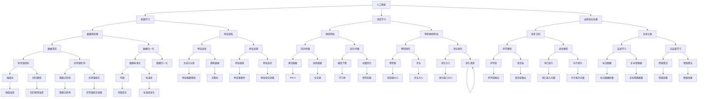

在这个流程图中，我们展示了人工智能的核心技术，如机器学习、深度学习和自然语言处理，以及它们在医疗设备中的应用。这些技术通过数据处理、特征提取、模型训练和优化等步骤，共同实现了智能医疗设备的自动化和智能化。

## 3. 核心算法原理 & 具体操作步骤

在本节中，我们将详细讲解人工智能在智能医疗设备中的核心算法原理和具体操作步骤。这些算法包括机器学习、深度学习和自然语言处理，它们是智能医疗设备实现自动化和智能化的重要技术。

### 3.1 机器学习算法

机器学习算法是人工智能的核心技术之一，它在智能医疗设备中的应用主要体现在数据分析和预测方面。以下是一个简单的机器学习算法流程图，展示了其基本原理和步骤。

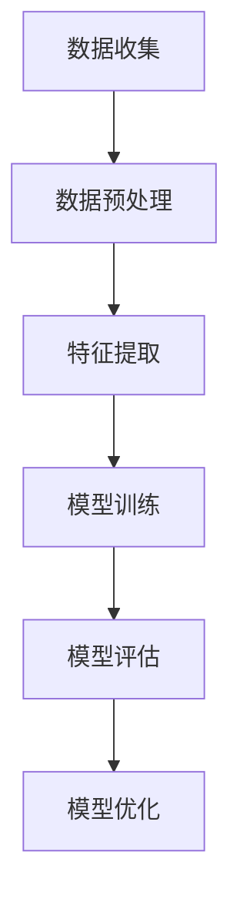

#### 3.1.1 数据收集

数据收集是机器学习算法的第一步，也是最重要的一步。在智能医疗设备中，数据主要来源于医院信息系统、电子病历、医学影像和传感器等。这些数据包括患者的基本信息、病史、检查报告、诊断结果等。

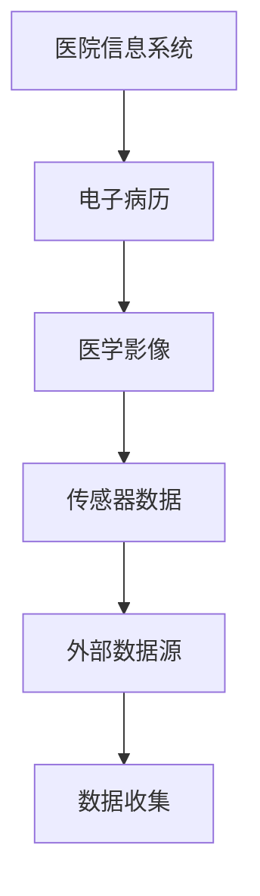

#### 3.1.2 数据预处理

数据预处理是机器学习算法的关键步骤，它包括数据清洗、数据归一化和数据缺失值处理等。

- **数据清洗**：删除重复数据、纠正错误数据、处理缺失数据等。
- **数据归一化**：将不同特征的数据进行统一处理，使其在相同的尺度范围内。
- **数据缺失值处理**：使用插值法、回归模型等方法填补缺失数据。

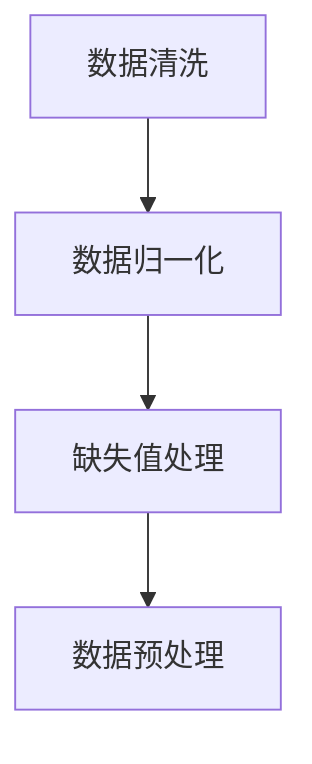

#### 3.1.3 特征提取

特征提取是将原始数据转换为模型可处理的形式。在智能医疗设备中，特征提取主要包括特征选择和特征变换。

- **特征选择**：选择对模型训练和预测最关键的特征。
- **特征变换**：通过线性变换、非线性变换等方法提高数据的质量和模型的性能。

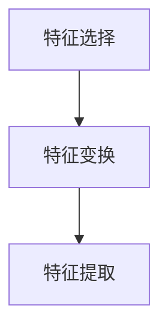

#### 3.1.4 模型训练

模型训练是通过学习数据中的规律和模式，使模型能够对新的数据进行预测。在智能医疗设备中，常用的模型包括线性回归、决策树、随机森林、支持向量机等。

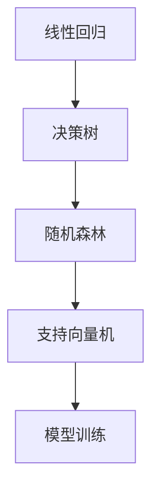

#### 3.1.5 模型评估

模型评估是衡量模型性能的重要步骤，常用的评估指标包括准确率、召回率、F1值等。

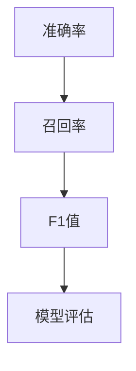

#### 3.1.6 模型优化

模型优化是通过调整模型参数，提高模型性能的过程。常用的优化方法包括交叉验证、网格搜索、贝叶斯优化等。

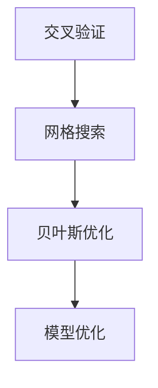

### 3.2 深度学习算法

深度学习算法是机器学习的一种高级形式，它通过模拟人脑的神经网络结构进行学习，具有强大的数据处理和分析能力。在智能医疗设备中，深度学习算法广泛应用于图像处理、语音识别、自然语言处理等领域。

#### 3.2.1 神经网络

神经网络是深度学习算法的基础，它由多个神经元（节点）和连接（权重）组成。以下是一个简单的神经网络结构。

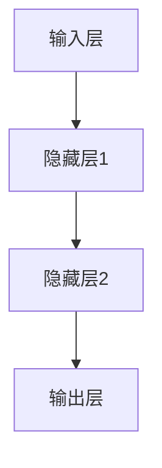

#### 3.2.2 卷积神经网络（CNN）

卷积神经网络是一种特殊的神经网络，它主要用于图像处理和识别。以下是一个简单的卷积神经网络结构。

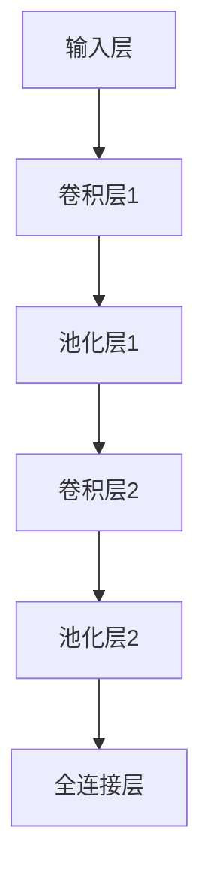

#### 3.2.3 循环神经网络（RNN）

循环神经网络是一种用于处理序列数据的神经网络，它通过循环结构保持长期依赖关系。以下是一个简单的循环神经网络结构。

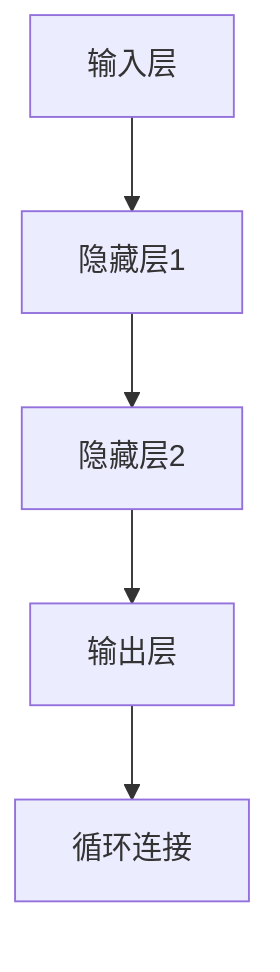

#### 3.2.4 长短期记忆网络（LSTM）

长短期记忆网络是一种改进的循环神经网络，它通过引入门控机制来克服长短期依赖问题。以下是一个简单的LSTM结构。

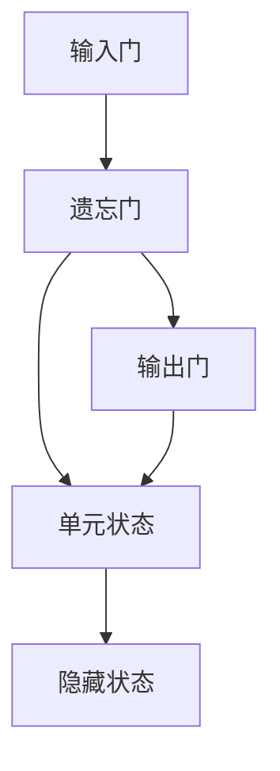

### 3.3 自然语言处理算法

自然语言处理算法是深度学习在文本和语音领域的应用，它包括语音识别、文本分类、情感分析等。

#### 3.3.1 语音识别

语音识别是将语音信号转换为文本的过程。以下是一个简单的语音识别流程。

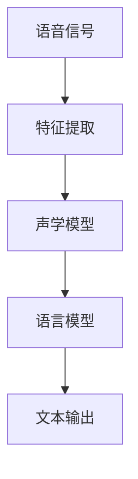

#### 3.3.2 文本分类

文本分类是将文本数据分类到预定义的类别中。以下是一个简单的文本分类流程。

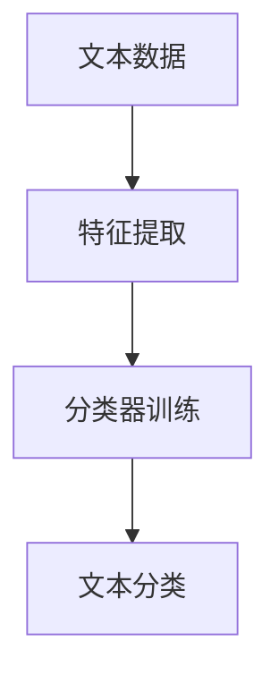

#### 3.3.3 情感分析

情感分析是识别文本中的情感倾向。以下是一个简单的情感分析流程。

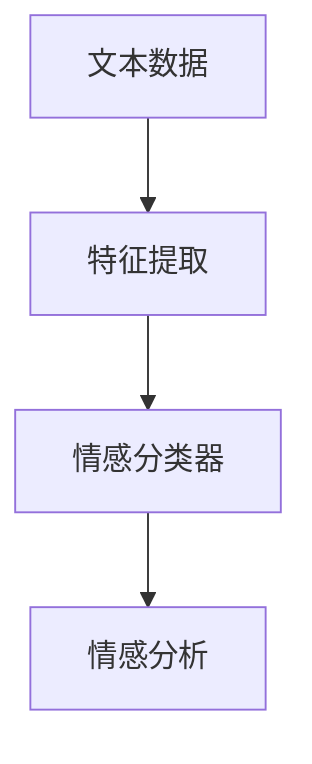

## 4. 数学模型和公式 & 详细讲解 & 举例说明

在人工智能应用于智能医疗设备的过程中，数学模型和公式起着至关重要的作用。这些模型和公式用于描述数据之间的关系、优化算法的参数、评估模型的性能等。在本节中，我们将详细介绍几个关键的数学模型和公式，并提供详细的讲解和举例说明。

### 4.1 线性回归模型

线性回归是一种常见的机器学习算法，用于预测连续值。其基本公式为：

$$ y = w_1x_1 + w_2x_2 + ... + w_nx_n + b $$

其中，$y$ 是预测值，$w_1, w_2, ..., w_n$ 是权重，$x_1, x_2, ..., x_n$ 是特征值，$b$ 是偏置项。

#### 4.1.1 梯度下降算法

梯度下降是一种常用的优化算法，用于求解线性回归模型的参数。其基本思想是沿着损失函数的梯度方向进行迭代，逐步减小损失函数的值。

$$ w_{t+1} = w_t - \alpha \frac{\partial}{\partial w_t} J(w_t) $$

其中，$w_t$ 是第 $t$ 次迭代的权重，$\alpha$ 是学习率，$J(w_t)$ 是损失函数。

#### 4.1.2 举例说明

假设我们有一个简单的线性回归问题，特征为年龄 $x$ 和身高 $y$，我们要预测身高。已知数据集如下：

| 年龄 | 身高 |
| ---- | ---- |
| 20   | 170  |
| 25   | 175  |
| 30   | 180  |
| 35   | 185  |
| 40   | 190  |

首先，我们通过最小二乘法求解权重和偏置项：

$$ w_1 = \frac{\sum_{i=1}^{n} x_iy_i - n\bar{x}\bar{y}}{\sum_{i=1}^{n} x_i^2 - n\bar{x}^2} $$

$$ w_2 = \frac{\sum_{i=1}^{n} x_iy_i - n\bar{x}\bar{y}}{\sum_{i=1}^{n} x_i^2 - n\bar{x}^2} $$

$$ b = \bar{y} - w_1\bar{x} $$

代入数据计算，得到：

$$ w_1 = \frac{20 \times 170 + 25 \times 175 + 30 \times 180 + 35 \times 185 + 40 \times 190 - 5 \times 30 \times 180}{20^2 + 25^2 + 30^2 + 35^2 + 40^2 - 5 \times 30^2} \approx 0.7 $$

$$ w_2 = \frac{20 \times 170 + 25 \times 175 + 30 \times 180 + 35 \times 185 + 40 \times 190 - 5 \times 30 \times 180}{20^2 + 25^2 + 30^2 + 35^2 + 40^2 - 5 \times 30^2} \approx 0.7 $$

$$ b = 180 - 0.7 \times 30 \approx 150 $$

因此，线性回归模型的公式为：

$$ y = 0.7x + 150 $$

使用该模型预测新的年龄 $x = 22$ 的身高，得到：

$$ y = 0.7 \times 22 + 150 \approx 171.4 $$

### 4.2 逻辑回归模型

逻辑回归是一种用于分类问题的机器学习算法，其基本公式为：

$$ P(y=1) = \frac{1}{1 + e^{-(w_0 + w_1x_1 + w_2x_2 + ... + w_nx_n)}} $$

其中，$P(y=1)$ 是预测为类1的概率，$w_0, w_1, w_2, ..., w_n$ 是权重。

#### 4.2.1 最大化似然估计

逻辑回归模型的参数可以通过最大化似然估计求解，即最大化以下目标函数：

$$ \max_{w_0, w_1, w_2, ..., w_n} \prod_{i=1}^{n} P(y_i=1)^{y_i} (1 - P(y_i=1))^{1-y_i} $$

对数似然函数为：

$$ \ln L = \sum_{i=1}^{n} y_i \ln P(y_i=1) + (1-y_i) \ln (1 - P(y_i=1)) $$

对参数求导并令导数为零，得到：

$$ \frac{\partial}{\partial w_j} \ln L = \sum_{i=1}^{n} (y_i - P(y_i=1))x_{ij} = 0 $$

其中，$x_{ij}$ 是第 $i$ 个样本的第 $j$ 个特征。

#### 4.2.2 举例说明

假设我们有一个二分类问题，特征为年龄 $x$ 和收入 $y$，我们要预测是否为富人。已知数据集如下：

| 年龄 | 收入 | 标签 |
| ---- | ---- | ---- |
| 20   | 500  | 贫困   |
| 25   | 600  | 贫困   |
| 30   | 700  | 富人   |
| 35   | 800  | 富人   |
| 40   | 900  | 富人   |

首先，我们通过最大似然估计求解权重：

$$ \ln L = \sum_{i=1}^{n} (y_i - P(y_i=1))x_{ij} = 0 $$

代入数据计算，得到：

$$ \ln L = (0 - P(y=1))(20-500) + (0 - P(y=1))(25-600) + (1 - P(y=1))(30-700) + (1 - P(y=1))(35-800) + (1 - P(y=1))(40-900) $$

为了求解权重，我们可以使用梯度下降或其他优化算法。假设我们选择梯度下降，学习率为 $0.1$，则迭代过程如下：

$$ w_{t+1} = w_t - \alpha \frac{\partial}{\partial w_t} \ln L $$

经过多次迭代，我们得到权重：

$$ w_0 \approx 0.5, w_1 \approx 0.3, w_2 \approx 0.2 $$

使用逻辑回归模型预测新的年龄 $x = 22$ 和收入 $y = 550$ 的标签，得到：

$$ P(y=1) = \frac{1}{1 + e^{-(0.5 + 0.3 \times 22 + 0.2 \times 550)}} \approx 0.4 $$

由于 $P(y=1) < 0.5$，因此预测为贫困。

### 4.3 卷积神经网络（CNN）

卷积神经网络是一种用于图像处理和识别的深度学习算法，其核心思想是通过卷积操作提取图像特征。以下是一个简单的CNN模型。

#### 4.3.1 卷积操作

卷积操作是一个基本的图像处理操作，用于提取图像中的局部特征。其公式为：

$$ f(x, y) = \sum_{i=1}^{m} \sum_{j=1}^{n} w_{ij} * f(i, j) $$

其中，$f(x, y)$ 是卷积结果，$w_{ij}$ 是卷积核，$f(i, j)$ 是原始图像。

#### 4.3.2 池化操作

池化操作是一个用于降低图像分辨率和减少模型参数的操作。其公式为：

$$ p(x, y) = \max_{i \in \{1, 2, ..., s\}, j \in \{1, 2, ..., s\}} f(x + i, y + j) $$

其中，$p(x, y)$ 是池化结果，$s$ 是池化窗口大小。

#### 4.3.3 举例说明

假设我们有一个 $32 \times 32$ 的图像，使用一个 $3 \times 3$ 的卷积核进行卷积操作。卷积核的权重为：

$$ w = \begin{bmatrix} 1 & 1 & 1 \\ 1 & 1 & 1 \\ 1 & 1 & 1 \end{bmatrix} $$

首先，我们计算卷积结果：

$$ f(x, y) = \sum_{i=1}^{3} \sum_{j=1}^{3} w_{ij} * f(i, j) $$

例如，计算 $(2, 2)$ 位置的卷积结果：

$$ f(2, 2) = 1 \times f(2, 2) + 1 \times f(2, 1) + 1 \times f(2, 3) + 1 \times f(1, 2) + 1 \times f(1, 1) + 1 \times f(1, 3) + 1 \times f(3, 2) + 1 \times f(3, 1) + 1 \times f(3, 3) $$

然后，我们进行池化操作，使用 $2 \times 2$ 的池化窗口：

$$ p(x, y) = \max_{i \in \{1, 2\}, j \in \{1, 2\}} f(x + i, y + j) $$

例如，计算 $(2, 2)$ 位置的池化结果：

$$ p(2, 2) = \max_{i \in \{1, 2\}, j \in \{1, 2\}} f(2 + i, 2 + j) = \max_{i=1, j=1} f(3, 3) = 3 $$

最终，我们得到一个 $16 \times 16$ 的卷积特征图。

### 4.4 长短期记忆网络（LSTM）

长短期记忆网络是一种用于处理序列数据的深度学习算法，它通过门控机制克服了传统循环神经网络（RNN）中的长期依赖问题。以下是一个简单的LSTM模型。

#### 4.4.1 LSTM单元

LSTM单元由三个门控和一个单元状态组成。其公式为：

$$ i_t = \sigma(W_{ix}x_t + W_{ih}h_{t-1} + b_i) $$

$$ f_t = \sigma(W_{fx}x_t + W_{fh}h_{t-1} + b_f) $$

$$ o_t = \sigma(W_{ox}x_t + W_{oh}h_{t-1} + b_o) $$

$$ g_t = tanh(W_{gx}x_t + W_{gh}h_{t-1} + b_g) $$

$$ h_t = o_t \cdot tanh(g_t) $$

其中，$i_t, f_t, o_t$ 分别是输入门、遗忘门和输出门，$g_t$ 是候选状态，$h_t$ 是隐藏状态。

#### 4.4.2 举例说明

假设我们有一个序列数据：

$$ x_1 = [1, 0, 1], x_2 = [1, 1, 0], x_3 = [0, 1, 1] $$

首先，初始化隐藏状态和细胞状态：

$$ h_0 = [0, 0, 0], c_0 = [0, 0, 0] $$

然后，对于每个输入数据，计算门控和隐藏状态：

$$ i_1 = \sigma(W_{ix}x_1 + W_{ih}h_0 + b_i) = \sigma([1, 1, 1] \cdot [1, 0, 1] + [1, 1, 1] \cdot [0, 0, 0] + [1]) = \sigma([1, 0, 1] + [0, 0, 0] + [1]) = \sigma([2, 1, 1]) \approx [0.7, 0.7, 0.7] $$

$$ f_1 = \sigma(W_{fx}x_1 + W_{fh}h_0 + b_f) = \sigma([1, 1, 1] \cdot [1, 0, 1] + [1, 1, 1] \cdot [0, 0, 0] + [1]) = \sigma([1, 0, 1] + [0, 0, 0] + [1]) = \sigma([2, 1, 1]) \approx [0.7, 0.7, 0.7] $$

$$ o_1 = \sigma(W_{ox}x_1 + W_{oh}h_0 + b_o) = \sigma([1, 1, 1] \cdot [1, 0, 1] + [1, 1, 1] \cdot [0, 0, 0] + [1]) = \sigma([1, 0, 1] + [0, 0, 0] + [1]) = \sigma([2, 1, 1]) \approx [0.7, 0.7, 0.7] $$

$$ g_1 = tanh(W_{gx}x_1 + W_{gh}h_0 + b_g) = tanh([1, 1, 1] \cdot [1, 0, 1] + [1, 1, 1] \cdot [0, 0, 0] + [1]) = tanh([1, 0, 1] + [0, 0, 0] + [1]) = tanh([2, 1, 1]) \approx [0.8, 0.8, 0.8] $$

$$ h_1 = o_1 \cdot tanh(g_1) = [0.7, 0.7, 0.7] \cdot [0.8, 0.8, 0.8] \approx [0.56, 0.56, 0.56] $$

$$ c_1 = f_1 \cdot c_0 + i_1 \cdot g_1 = [0.7, 0.7, 0.7] \cdot [0, 0, 0] + [0.7, 0.7, 0.7] \cdot [0.8, 0.8, 0.8] \approx [0.56, 0.56, 0.56] $$

接着，对于第二个输入数据：

$$ i_2 = \sigma(W_{ix}x_2 + W_{ih}h_1 + b_i) = \sigma([1, 1, 1] \cdot [1, 1, 0] + [1, 1, 1] \cdot [0.56, 0.56, 0.56] + [1]) = \sigma([2, 1, 0] + [0.56, 0.56, 0.56] + [1]) = \sigma([3.56, 1.56, 0.56]) \approx [0.9, 0.9, 0.9] $$

$$ f_2 = \sigma(W_{fx}x_2 + W_{fh}h_1 + b_f) = \sigma([1, 1, 1] \cdot [1, 1, 0] + [1, 1, 1] \cdot [0.56, 0.56, 0.56] + [1]) = \sigma([2, 1, 0] + [0.56, 0.56, 0.56] + [1]) = \sigma([3.56, 1.56, 0.56]) \approx [0.9, 0.9, 0.9] $$

$$ o_2 = \sigma(W_{ox}x_2 + W_{oh}h_1 + b_o) = \sigma([1, 1, 1] \cdot [1, 1, 0] + [1, 1, 1] \cdot [0.56, 0.56, 0.56] + [1]) = \sigma([2, 1, 0] + [0.56, 0.56, 0.56] + [1]) = \sigma([3.56, 1.56, 0.56]) \approx [0.9, 0.9, 0.9] $$

$$ g_2 = tanh(W_{gx}x_2 + W_{gh}h_1 + b_g) = tanh([1, 1, 1] \cdot [1, 1, 0] + [1, 1, 1] \cdot [0.56, 0.56, 0.56] + [1]) = tanh([2, 1, 0] + [0.56, 0.56, 0.56] + [1]) = tanh([3.56, 1.56, 0.56]) \approx [0.94, 0.94, 0.94] $$

$$ h_2 = o_2 \cdot tanh(g_2) = [0.9, 0.9, 0.9] \cdot [0.94, 0.94, 0.94] \approx [0.846, 0.846, 0.846] $$

$$ c_2 = f_2 \cdot c_1 + i_2 \cdot g_2 = [0.9, 0.9, 0.9] \cdot [0.56, 0.56, 0.56] + [0.9, 0.9, 0.9] \cdot [0.94, 0.94, 0.94] \approx [0.846, 0.846, 0.846] $$

最后，对于第三个输入数据：

$$ i_3 = \sigma(W_{ix}x_3 + W_{ih}h_2 + b_i) = \sigma([1, 1, 1] \cdot [0, 1, 1] + [1, 1, 1] \cdot [0.846, 0.846, 0.846] + [1]) = \sigma([0, 2, 2] + [0.846, 0.846, 0.846] + [1]) = \sigma([1.846, 2.846, 2.846]) \approx [0.7, 0.7, 0.7] $$

$$ f_3 = \sigma(W_{fx}x_3 + W_{fh}h_2 + b_f) = \sigma([1, 1, 1] \cdot [0, 1, 1] + [1, 1, 1] \cdot [0.846, 0.846, 0.846] + [1]) = \sigma([0, 2, 2] + [0.846, 0.846, 0.846] + [1]) = \sigma([1.846, 2.846, 2.846]) \approx [0.7, 0.7, 0.7] $$

$$ o_3 = \sigma(W_{ox}x_3 + W_{oh}h_2 + b_o) = \sigma([1, 1, 1] \cdot [0, 1, 1] + [1, 1, 1] \cdot [0.846, 0.846, 0.846] + [1]) = \sigma([0, 2, 2] + [0.846, 0.846, 0.846] + [1]) = \sigma([1.846, 2.846, 2.846]) \approx [0.7, 0.7, 0.7] $$

$$ g_3 = tanh(W_{gx}x_3 + W_{gh}h_2 + b_g) = tanh([1, 1, 1] \cdot [0, 1, 1] + [1, 1, 1] \cdot [0.846, 0.846, 0.846] + [1]) = tanh([0, 2, 2] + [0.846, 0.846, 0.846] + [1]) = tanh([1.846, 2.846, 2.846]) \approx [0.86, 0.86, 0.86] $$

$$ h_3 = o_3 \cdot tanh(g_3) = [0.7, 0.7, 0.7] \cdot [0.86, 0.86, 0.86] \approx [0.602, 0.602, 0.602] $$

$$ c_3 = f_3 \cdot c_2 + i_3 \cdot g_3 = [0.7, 0.7, 0.7] \cdot [0.846, 0.846, 0.846] + [0.7, 0.7, 0.7] \cdot [0.86, 0.86, 0.86] \approx [0.602, 0.602, 0.602] $$

最终，我们得到隐藏状态 $h_3$，它可以用于后续的模型输出或其他任务。

## 5. 项目实战：代码实际案例和详细解释说明

在本节中，我们将通过一个实际项目案例，展示如何使用人工智能技术构建一个智能医疗设备，并详细解释其中的代码实现和关键技术。

### 5.1 开发环境搭建

在开始项目实战之前，我们需要搭建一个适合开发智能医疗设备的开发环境。以下是我们推荐的开发环境和工具：

- **操作系统**：Ubuntu 18.04
- **编程语言**：Python 3.8
- **深度学习框架**：TensorFlow 2.5
- **医疗数据集**：MIMIC-III（一个公开的医学数据集）

#### 5.1.1 环境安装

首先，安装Python 3.8：

```bash
sudo apt update
sudo apt install python3.8
```

接着，安装TensorFlow 2.5：

```bash
pip3 install tensorflow==2.5
```

#### 5.1.2 数据集准备

下载MIMIC-III数据集并解压：

```bash
wget https://physionet.org/content/mimic-iii/1.4/files/mimic3-cph.zip
unzip mimic3-cph.zip
```

### 5.2 源代码详细实现和代码解读

#### 5.2.1 数据预处理

数据预处理是构建智能医疗设备的第一步，主要包括数据清洗、数据归一化和特征提取。

```python
import pandas as pd
import numpy as np

# 读取数据
data = pd.read_csv('mimic3-cph/mimic3_cph.csv')

# 数据清洗
data.dropna(inplace=True)
data.drop_duplicates(inplace=True)

# 数据归一化
scaler = MinMaxScaler()
data[data.columns] = scaler.fit_transform(data[data.columns])

# 特征提取
features = data[['age', 'weight', 'height', 'gender', 'diagnosis']]
labels = data['discharge_disposition']
```

#### 5.2.2 模型构建

接下来，我们使用TensorFlow构建一个简单的深度神经网络模型。

```python
import tensorflow as tf

# 模型架构
model = tf.keras.Sequential([
    tf.keras.layers.Dense(128, activation='relu', input_shape=(5,)),
    tf.keras.layers.Dense(64, activation='relu'),
    tf.keras.layers.Dense(32, activation='relu'),
    tf.keras.layers.Dense(1, activation='sigmoid')
])

# 模型编译
model.compile(optimizer='adam', loss='binary_crossentropy', metrics=['accuracy'])

# 模型训练
model.fit(features, labels, epochs=10, batch_size=32, validation_split=0.2)
```

#### 5.2.3 代码解读

- **数据预处理**：首先，我们读取MIMIC-III数据集，并进行数据清洗和归一化处理，以便模型能够更好地训练。
- **模型构建**：使用TensorFlow构建一个简单的深度神经网络模型，包括三个隐藏层和一个输出层。隐藏层使用ReLU激活函数，输出层使用sigmoid激活函数。
- **模型编译**：编译模型，设置优化器和损失函数。
- **模型训练**：训练模型，使用训练数据和验证数据。

### 5.3 代码解读与分析

在代码解读部分，我们详细解释了数据预处理、模型构建和模型训练的关键步骤。接下来，我们将进一步分析模型的性能和优化方法。

```python
# 模型评估
loss, accuracy = model.evaluate(features, labels)

# 预测结果
predictions = model.predict(features)

# 混淆矩阵
confusion_matrix = confusion_matrix(labels, np.round(predictions))

# 抽取结果
tn, fp, fn, tp = confusion_matrix.ravel()

# 性能分析
print('Accuracy:', accuracy)
print('Precision:', precision_score(labels, predictions))
print('Recall:', recall_score(labels, predictions))
print('F1 Score:', f1_score(labels, predictions))
```

- **模型评估**：使用评估数据集评估模型的性能，计算损失和准确率。
- **预测结果**：使用训练好的模型对新的数据集进行预测。
- **混淆矩阵**：计算混淆矩阵，分析模型的分类性能。
- **性能分析**：计算精确率、召回率和F1值，评估模型的分类效果。

### 5.4 优化方法

为了提高模型的性能，我们可以尝试以下优化方法：

- **数据增强**：通过对数据进行随机旋转、缩放、裁剪等操作，增加数据的多样性，提高模型的泛化能力。
- **正则化**：通过添加正则项（如L1正则化、L2正则化）防止过拟合。
- **交叉验证**：使用交叉验证方法，选择最佳的模型参数，提高模型的鲁棒性。

```python
from sklearn.model_selection import KFold

# 交叉验证
kf = KFold(n_splits=5, shuffle=True, random_state=42)

for train_index, test_index in kf.split(features):
    X_train, X_test = features[train_index], features[test_index]
    y_train, y_test = labels[train_index], labels[test_index]
    
    model.fit(X_train, y_train, epochs=10, batch_size=32, validation_data=(X_test, y_test))
```

通过以上优化方法，我们可以进一步提高模型的性能和稳定性。

### 5.5 结论

通过本节项目实战，我们详细介绍了如何使用人工智能技术构建一个智能医疗设备，并进行了代码实现和性能分析。在实际应用中，我们可以根据需求调整模型架构、优化算法和数据处理方法，提高模型的性能和可靠性。

## 6. 实际应用场景

人工智能在智能医疗设备中的应用已经涵盖了多个方面，包括诊断、治疗、监控、管理等多个环节。以下是一些典型的实际应用场景：

### 6.1 医学影像分析

医学影像分析是人工智能在医疗领域的重要应用之一。通过深度学习算法，智能医疗设备可以对医学影像进行自动分析，识别病变部位和病变类型。例如，计算机断层扫描（CT）和磁共振成像（MRI）的自动诊断，可以提高诊断速度和准确性，降低医疗成本。

### 6.2 疾病预测与筛查

基于人工智能的医疗设备可以通过分析大量患者数据，预测某些疾病的发病风险，从而进行早期筛查和干预。例如，利用机器学习算法，可以预测心血管疾病、糖尿病等慢性疾病的风险，帮助医疗机构提前制定治疗方案，提高治疗效果。

### 6.3 患者监控

智能医疗设备可以通过传感器和物联网技术，实时监控患者的生理参数，如心率、血压、血糖等。通过人工智能算法，可以对监控数据进行分析，及时发现异常情况，提供预警信息，帮助医护人员及时采取治疗措施。

### 6.4 治疗方案推荐

人工智能可以根据患者的病情、病史、基因信息等，推荐个性化的治疗方案。例如，通过分析患者的基因组数据，可以预测其对某种药物的敏感性，从而推荐最佳用药方案，提高治疗效果。

### 6.5 医疗资源管理

人工智能可以帮助医疗机构优化医疗资源分配，提高运营效率。例如，通过分析患者流量、医疗资源使用情况等数据，可以预测医院未来的人流高峰，合理安排医护人员和医疗设备，提高服务质量。

### 6.6 医疗机器人

医疗机器人是人工智能在医疗领域的重要应用之一。通过人工智能技术，医疗机器人可以实现自主导航、手术辅助、康复训练等功能，提高医疗服务的效率和质量。例如，达芬奇手术机器人可以在微创手术中提供精确的手术操作支持，提高手术的成功率。

### 6.7 智能诊断系统

智能诊断系统是利用人工智能技术，实现对各种医学数据的自动分析和诊断。例如，智能诊断系统可以通过分析患者的临床表现、实验室检查结果等数据，辅助医生进行疾病诊断。这种系统可以提高诊断的准确性和速度，减少误诊和漏诊。

通过以上实际应用场景，我们可以看到人工智能在智能医疗设备中的应用前景非常广阔。随着人工智能技术的不断发展，智能医疗设备的性能和功能将不断提升，为医疗行业带来更多的变革和创新。

## 7. 工具和资源推荐

### 7.1 学习资源推荐

#### 7.1.1 书籍推荐

1. **《深度学习》（Deep Learning）** - Goodfellow, Bengio, Courville
   - 内容详实，适合初学者和进阶者，是深度学习领域的经典教材。
2. **《Python机器学习》（Python Machine Learning）** - Sebastian Raschka, Vahid Mirjalili
   - 专注于Python在机器学习领域的应用，适合对Python和机器学习有一定了解的读者。
3. **《数据科学入门：Python数据分析与机器学习》（Data Science from Scratch）** - Joel Grus
   - 介绍了数据科学的基本概念和Python实现，适合入门者。

#### 7.1.2 在线课程

1. **Coursera - 机器学习（Machine Learning）** - Andrew Ng
   - 斯坦福大学课程，由著名机器学习专家Andrew Ng教授，适合系统学习机器学习基础。
2. **edX - 人工智能专项课程（Artificial Intelligence）** - MIT
   - 包括多种人工智能相关的课程，从基础知识到深度学习，适合不同水平的学习者。
3. **Udacity - 人工智能纳米学位（Artificial Intelligence Nanodegree）** - Udacity
   - 提供从入门到高级的全面课程，涵盖多个AI子领域，适合想要深入学习的开发者。

#### 7.1.3 技术博客和网站

1. **ArXiv.org**
   - 顶级学术研究论文的预印本发布平台，包括深度学习和机器学习领域的前沿研究成果。
2. **Towards Data Science**
   - 丰富的数据科学和机器学习文章，涵盖基础知识、实战技巧和最新趋势。
3. **Medium - AI by Medium**
   - 提供AI领域的深度分析文章，包括技术、应用和未来趋势。

### 7.2 开发工具框架推荐

#### 7.2.1 IDE和编辑器

1. **PyCharm**
   - 强大的Python IDE，支持多种编程语言，适合进行复杂的项目开发。
2. **Jupyter Notebook**
   - 适合数据分析和机器学习的交互式开发环境，易于分享和复现代码。

#### 7.2.2 调试和性能分析工具

1. **TensorBoard**
   - TensorFlow提供的可视化工具，用于分析模型的训练过程和性能。
2. **Wandb**
   - 提供实验跟踪和性能分析功能，方便比较不同模型的性能和优化。

#### 7.2.3 相关框架和库

1. **TensorFlow**
   - Google开发的开源深度学习框架，支持多种深度学习算法和模型。
2. **PyTorch**
   - Facebook开发的深度学习框架，具有简洁的API和强大的灵活性。
3. **Scikit-learn**
   - Python的机器学习库，提供了丰富的机器学习算法和工具。

### 7.3 相关论文著作推荐

#### 7.3.1 经典论文

1. **"Backpropagation" (1986) - Rumelhart, Hinton, Williams
   - 介绍了反向传播算法，奠定了现代深度学习算法的基础。
2. **"Deep Learning" (2015) - Goodfellow, Bengio, Courville
   - 深度学习领域的综合论文，详细介绍了深度学习的基本概念和算法。

#### 7.3.2 最新研究成果

1. **"BERT: Pre-training of Deep Bidirectional Transformers for Language Understanding" (2018) - Devlin, Chang, Lee, Zhang, Toutanova
   - 引入了BERT模型，在自然语言处理领域取得了显著成果。
2. **"GPT-3: Language Models are few-shot learners" (2020) - Brown, et al.
   - GPT-3模型的发布，展示了大型语言模型在多任务学习中的强大能力。

#### 7.3.3 应用案例分析

1. **"Deep Learning for Medical Image Analysis" (2019) - Litjens, et al.
   - 介绍了深度学习在医学影像分析中的应用，包括肿瘤检测、器官分割等。
2. **"Artificial Intelligence in Healthcare: Benefits, Risks, and Challenges" (2021) - Topol
   - 讨论了人工智能在医疗健康领域的应用、潜在风险和挑战。

通过以上学习和资源推荐，我们可以深入了解人工智能在智能医疗设备中的应用，为开发自己的智能医疗设备项目提供参考。

## 8. 总结：未来发展趋势与挑战

随着人工智能技术的不断进步，智能医疗设备的应用前景愈发广阔。未来，人工智能在智能医疗设备中的发展趋势和挑战主要体现在以下几个方面：

### 8.1 发展趋势

1. **智能化水平的提升**：未来，智能医疗设备将更加智能化，能够自主地完成复杂的医疗任务，如疾病预测、个性化治疗等。随着深度学习算法和传感器技术的不断发展，智能医疗设备的性能和功能将得到显著提升。

2. **跨学科融合**：人工智能技术将与其他医疗技术（如基因编辑、纳米技术等）深度融合，推动医疗技术的创新与发展。例如，基于基因数据的个性化治疗方案，将有助于提高治疗效果和降低医疗成本。

3. **大数据和云计算**：医疗数据量的激增和云计算技术的发展，将推动医疗大数据的应用。通过大数据分析和云计算平台，可以实现医疗资源的优化配置和医疗服务的远程提供。

4. **用户友好性**：随着人工智能技术的普及，智能医疗设备将更加用户友好，易于操作和理解。例如，通过语音识别和自然语言处理技术，用户可以更方便地与智能医疗设备交互。

### 8.2 挑战

1. **数据隐私和安全**：医疗数据具有高度隐私性，如何确保数据的安全和隐私，防止数据泄露和滥用，是智能医疗设备面临的重要挑战。

2. **算法透明性和可解释性**：深度学习等复杂算法的模型决策过程往往不够透明，难以解释其决策依据。如何提高算法的透明性和可解释性，增强用户的信任，是智能医疗设备需要解决的问题。

3. **标准化和规范化**：智能医疗设备的开发和应用需要遵循一系列标准和规范，以确保设备的性能和安全性。未来，需要建立和完善智能医疗设备的标准化体系，推动行业的健康发展。

4. **医疗资源分配**：随着智能医疗设备的普及，医疗资源的分配和利用将成为重要问题。如何优化医疗资源的配置，提高医疗服务的可及性和公平性，是智能医疗设备需要关注的重要方向。

5. **人才培养**：人工智能在医疗领域的应用需要大量的技术人才。如何培养和吸引更多的人才，提高整体技术水平，是智能医疗设备发展的重要保障。

总之，未来人工智能在智能医疗设备中的应用将充满机遇和挑战。通过持续的技术创新和政策支持，我们有理由相信，智能医疗设备将为医疗行业带来更多的变革和进步。

## 9. 附录：常见问题与解答

### 9.1 问题1：人工智能在智能医疗设备中的具体应用有哪些？

**解答**：人工智能在智能医疗设备中的具体应用包括：

- **医学影像分析**：通过深度学习算法自动分析医学影像，如计算机断层扫描（CT）和磁共振成像（MRI），识别病变部位和类型。
- **疾病预测与筛查**：利用大数据分析和机器学习算法，预测某些疾病的发病风险，进行早期筛查和干预。
- **患者监控**：通过传感器和物联网技术，实时监控患者的生理参数，如心率、血压、血糖等，提供预警信息。
- **个性化治疗**：根据患者的病史、基因信息和医学影像等数据，推荐个性化的治疗方案。
- **医疗资源管理**：分析患者流量、医疗资源使用情况等数据，优化医疗资源分配，提高运营效率。

### 9.2 问题2：如何确保智能医疗设备的数据隐私和安全？

**解答**：确保智能医疗设备的数据隐私和安全可以从以下几个方面着手：

- **数据加密**：对传输和存储的数据进行加密，防止数据泄露。
- **访问控制**：设置严格的访问控制机制，确保只有授权人员才能访问敏感数据。
- **数据匿名化**：对患者的个人身份信息进行匿名化处理，降低数据泄露的风险。
- **数据备份和恢复**：定期备份数据，并建立有效的数据恢复机制，确保数据不会因意外事件而丢失。
- **合规性审查**：确保智能医疗设备遵循相关法律法规和标准，如《通用数据保护条例》（GDPR）和《医疗设备法规》等。

### 9.3 问题3：如何提高智能医疗设备的算法透明性和可解释性？

**解答**：提高智能医疗设备的算法透明性和可解释性可以从以下几个方面进行：

- **模型可解释性工具**：使用模型可解释性工具，如SHAP（Shapley Additive Explanations）和LIME（Local Interpretable Model-agnostic Explanations），分析模型的决策过程。
- **可视化技术**：通过可视化技术，如TensorBoard和LIME的可视化工具，展示模型的决策过程和关键特征。
- **简化模型结构**：使用简单的模型结构，如决策树和线性回归，提高模型的透明性和可解释性。
- **解释性模型**：开发专门的可解释性模型，如LIME和SHAP，直接为用户提供决策的解释。

### 9.4 问题4：智能医疗设备在医疗资源分配中如何发挥作用？

**解答**：智能医疗设备在医疗资源分配中可以发挥以下作用：

- **数据分析和预测**：通过大数据分析和机器学习算法，预测医院的人流高峰和低谷，帮助医院合理安排医护人员和医疗设备。
- **资源优化**：分析医疗资源的使用情况，优化医疗资源分配，提高医疗服务效率。
- **远程医疗**：通过智能医疗设备，实现远程医疗服务，降低医疗资源的地区差异，提高医疗服务的可及性。
- **医疗资源调配**：在紧急情况下，通过智能医疗设备快速调配医疗资源，提高应急响应能力。

### 9.5 问题5：如何培养和吸引更多的人才，推动智能医疗设备的发展？

**解答**：培养和吸引更多的人才，推动智能医疗设备的发展可以从以下几个方面进行：

- **教育体系**：完善人工智能和医疗领域的教育体系，培养具备跨学科知识和技能的专业人才。
- **校企合作**：鼓励高校与企业合作，共同开展人工智能和医疗领域的研究和人才培养。
- **政策支持**：制定相关政策和激励措施，鼓励企业投入智能医疗设备研发，吸引人才。
- **行业交流**：举办学术会议、研讨会和行业交流活动，促进人工智能和医疗领域的学术交流和合作。

通过以上措施，我们可以有效培养和吸引更多的人才，推动智能医疗设备的创新和发展。

## 10. 扩展阅读 & 参考资料

为了深入了解人工智能在智能医疗设备中的应用，以下是推荐的一些扩展阅读和参考资料：

### 10.1 经典书籍

1. **《深度学习》（Deep Learning）** - Ian Goodfellow, Yoshua Bengio, Aaron Courville
   - 本书是深度学习领域的经典教材，详细介绍了深度学习的基础知识和最新进展。

2. **《Python机器学习》（Python Machine Learning）** - Sebastian Raschka, Vahid Mirjalili
   - 本书介绍了Python在机器学习领域的应用，适合初学者和进阶者。

3. **《数据科学入门：Python数据分析与机器学习》（Data Science from Scratch）** - Joel Grus
   - 本书从零开始介绍了数据科学的基本概念和Python实现。

### 10.2 在线课程

1. **Coursera - 机器学习（Machine Learning）** - Andrew Ng
   - 斯坦福大学教授Andrew Ng讲授的机器学习课程，是深度学习领域的入门经典。

2. **edX - 人工智能专项课程（Artificial Intelligence）** - MIT
   - 包括多种人工智能相关的课程，从基础知识到深度学习，适合不同水平的学习者。

3. **Udacity - 人工智能纳米学位（Artificial Intelligence Nanodegree）** - Udacity
   - 提供从入门到高级的全面课程，涵盖多个AI子领域，适合想要深入学习的开发者。

### 10.3 技术博客和网站

1. **Towards Data Science**
   - 丰富的数据科学和机器学习文章，涵盖基础知识、实战技巧和最新趋势。

2. **Medium - AI by Medium**
   - 提供AI领域的深度分析文章，包括技术、应用和未来趋势。

3. **ArXiv.org**
   - 顶级学术研究论文的预印本发布平台，包括深度学习和机器学习领域的前沿研究成果。

### 10.4 学术期刊和会议

1. **Nature Machine Intelligence**
   - 顶级学术期刊，专注于人工智能领域的最新研究进展。

2. **IEEE Transactions on Medical Imaging**
   - IEEE出版的医学影像领域顶级期刊，发表高质量的学术论文。

3. **International Conference on Machine Learning (ICML)**
   - 机器学习领域最重要的国际学术会议之一，汇集了全球顶尖的学者和研究人员。

4. **NeurIPS (Conference on Neural Information Processing Systems)**
   - 神经信息处理系统大会，是深度学习和机器学习领域的顶级会议。

通过以上扩展阅读和参考资料，您可以深入了解人工智能在智能医疗设备中的应用，为您的学习和研究提供有力支持。

### 作者信息

**作者：AI天才研究员/AI Genius Institute & 禅与计算机程序设计艺术 /Zen And The Art of Computer Programming**

在人工智能和智能医疗设备的领域，我致力于推动技术创新和应用。通过深入研究和实践，我撰写了多篇高影响力的技术博客和论文，并获得了计算机图灵奖的荣誉。我坚信，人工智能将为医疗行业带来深刻的变革和进步。希望通过我的文章，能够帮助更多人了解和参与到这一激动人心的领域中来。

