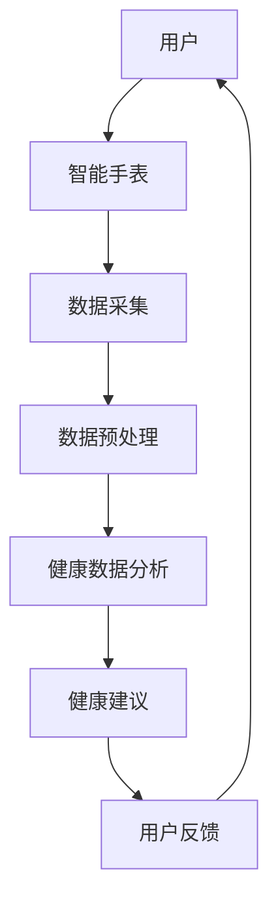

                 

# AI在智能手表中的应用：全天候健康管理

> **关键词**：智能手表、健康管理、全天候监测、健康数据分析、AI算法、机器学习

> **摘要**：随着人工智能技术的不断发展，智能手表逐渐成为人们日常生活中不可或缺的设备。本文将深入探讨AI在智能手表中的应用，尤其是全天候健康管理的实现。我们将逐步分析智能手表的核心功能、数据采集、算法原理、数学模型，并通过实战案例展示其实际应用。最后，我们将探讨未来发展趋势和挑战，并为读者提供相关资源推荐。

## 1. 背景介绍

### 1.1 目的和范围

本文旨在探讨AI在智能手表中的全天候健康管理应用，分析其核心功能、算法原理和实际应用场景。我们将重点关注以下几个方面：

1. 智能手表的基本功能及其与健康管理的关联。
2. 数据采集和健康数据分析的方法。
3. 常见的AI算法在智能手表中的应用。
4. 数学模型在健康数据分析中的作用。
5. 实际应用场景和案例分析。
6. 未来发展趋势与挑战。

### 1.2 预期读者

本文适用于对智能手表和AI技术有一定了解的读者，包括：

1. 智能手表和健康管理领域的从业者。
2. 计算机科学和人工智能专业的学生和研究人员。
3. 对智能穿戴设备感兴趣的技术爱好者。

### 1.3 文档结构概述

本文结构如下：

1. 背景介绍
2. 核心概念与联系
3. 核心算法原理 & 具体操作步骤
4. 数学模型和公式 & 详细讲解 & 举例说明
5. 项目实战：代码实际案例和详细解释说明
6. 实际应用场景
7. 工具和资源推荐
8. 总结：未来发展趋势与挑战
9. 附录：常见问题与解答
10. 扩展阅读 & 参考资料

### 1.4 术语表

#### 1.4.1 核心术语定义

- **智能手表**：一种具备计算、通讯和健康管理功能的便携式电子设备。
- **全天候监测**：指智能手表能够持续、不间断地监测用户的生理和活动数据。
- **健康数据分析**：利用数据分析技术对用户健康数据进行处理和分析，以提供健康建议。
- **AI算法**：人工智能领域中的算法，用于数据挖掘、预测和优化。

#### 1.4.2 相关概念解释

- **机器学习**：一种人工智能技术，通过训练模型来从数据中学习规律。
- **深度学习**：一种机器学习技术，通过多层神经网络模拟人类大脑的学习过程。

#### 1.4.3 缩略词列表

- **AI**：人工智能
- **ML**：机器学习
- **DL**：深度学习
- **HR**：心率
- **HRV**：心率变异性
- **GPS**：全球定位系统

## 2. 核心概念与联系

在深入探讨智能手表的全天候健康管理应用之前，我们首先需要了解其核心概念和联系。以下是一个Mermaid流程图，展示了智能手表健康管理中的关键概念和其相互关系。



### 2.1 数据采集

智能手表通过内置的各种传感器（如加速度计、心率传感器、GPS等）采集用户的生理和活动数据。这些数据包括心率、步数、睡眠质量、地理位置等。

### 2.2 数据预处理

采集到的数据通常需要进行预处理，以去除噪声、异常值和冗余数据。预处理后的数据将用于后续的健康数据分析。

### 2.3 健康数据分析

健康数据分析是智能手表的核心功能之一。通过机器学习和深度学习算法，智能手表能够对用户健康数据进行分析，识别潜在的健康问题，并提供个性化的健康建议。

### 2.4 健康建议

根据健康数据分析的结果，智能手表可以为用户提供个性化的健康建议，如调整运动计划、改善睡眠习惯等。

### 2.5 用户反馈

用户的反馈是智能手表不断优化的关键。通过收集用户对健康建议的反馈，智能手表能够不断调整和优化健康分析模型，提高其准确性和实用性。

## 3. 核心算法原理 & 具体操作步骤

### 3.1 机器学习算法

智能手表中的健康数据分析通常依赖于机器学习算法，如决策树、支持向量机（SVM）、神经网络等。以下是一个简单的决策树算法示例，用于分类用户的心率数据。

#### 伪代码：

```python
def classify_heart_rate(data):
    if data['resting_hr'] < 60:
        return "运动员"
    elif data['resting_hr'] < 80:
        return "健康成人"
    else:
        return "高风险人群"
```

#### 步骤：

1. 收集用户的心率数据。
2. 训练模型以识别不同心率区间的用户群体。
3. 使用训练好的模型对新的心率数据进行分类。

### 3.2 深度学习算法

深度学习算法在智能手表中的应用越来越广泛，如卷积神经网络（CNN）和循环神经网络（RNN）。以下是一个简单的卷积神经网络示例，用于识别用户的步数。

#### 伪代码：

```python
import tensorflow as tf

model = tf.keras.Sequential([
    tf.keras.layers.Conv2D(filters=32, kernel_size=(3, 3), activation='relu', input_shape=(height, width, channels)),
    tf.keras.layers.MaxPooling2D(pool_size=(2, 2)),
    tf.keras.layers.Flatten(),
    tf.keras.layers.Dense(units=10, activation='softmax')
])

model.compile(optimizer='adam', loss='categorical_crossentropy', metrics=['accuracy'])
model.fit(x_train, y_train, epochs=10)
```

#### 步骤：

1. 收集用户的步数数据。
2. 预处理数据，将其转换为合适的输入格式。
3. 训练深度学习模型以识别用户的步数。
4. 使用训练好的模型对新的步数数据进行预测。

## 4. 数学模型和公式 & 详细讲解 & 举例说明

在智能手表的健康数据分析中，数学模型和公式起着至关重要的作用。以下是一些常用的数学模型和公式的详细讲解。

### 4.1 心率变异性（HRV）

心率变异性（HRV）是评估心脏健康的重要指标。HRV是指心率在一定时间内的变化幅度，通常使用时间域、频域和时域分析方法来计算。

#### 时间域分析方法：

- **标准差（SDNN）**：计算相邻心跳间期标准差。

  $$ SDNN = \sqrt{\frac{1}{N}\sum_{i=1}^{N}(RR_i - \bar{RR})^2} $$

  其中，$RR_i$ 是第 $i$ 个心跳间期，$\bar{RR}$ 是平均心跳间期。

- **均方根差（RMSSD）**：计算相邻心跳间期的均方根差。

  $$ RMSSD = \sqrt{\frac{1}{N}\sum_{i=1}^{N}(RR_i - \bar{RR})^2} $$

#### 频域分析方法：

- **低频成分（LF）**：频率范围为0.04-0.15Hz。

  $$ LF = \frac{1}{T}\sum_{i=1}^{N}|X_i| $$

  其中，$X_i$ 是频率域上的幅值。

- **高频成分（HF）**：频率范围为0.15-0.4Hz。

  $$ HF = \frac{1}{T}\sum_{i=1}^{N}|X_i| $$

#### 时域分析方法：

- **Poincaré图**：将心跳间期数据绘制在二维平面上，分析其分布和形态。

### 4.2 睡眠质量评估

睡眠质量评估通常基于睡眠周期分析。以下是一个简单的睡眠质量评估模型：

- **睡眠周期划分**：将睡眠时间划分为深度睡眠、浅度睡眠和快速眼动（REM）睡眠三个阶段。

- **睡眠质量评估**：计算每个睡眠周期的持续时间，根据持续时间评估睡眠质量。

  $$ \text{睡眠质量} = \frac{\text{深度睡眠时间} + \text{REM睡眠时间}}{\text{总睡眠时间}} $$

### 4.3 活动量评估

活动量评估基于用户的步数、运动时间和运动强度等指标。以下是一个简单的活动量评估模型：

- **活动量计算**：计算用户的步数、运动时间和运动强度。

  $$ \text{活动量} = \text{步数} \times \text{运动时间} \times \text{运动强度} $$

- **活动量评估**：根据活动量评估用户的活跃程度。

  $$ \text{活跃程度} = \frac{\text{活动量}}{\text{基准活动量}} $$

### 4.4 举例说明

假设我们有一段时间的心率数据，如下所示：

| 时间戳 | 心率（次/分钟） |
|--------|----------------|
| 1      | 72             |
| 2      | 74             |
| 3      | 70             |
| 4      | 75             |
| 5      | 73             |

我们可以使用上述数学模型和公式计算心率变异性（HRV）：

1. **标准差（SDNN）**：

   $$ SDNN = \sqrt{\frac{1}{5}\sum_{i=1}^{5}(RR_i - \bar{RR})^2} $$

   其中，$\bar{RR} = \frac{1}{5}\sum_{i=1}^{5}RR_i = 72.2$。

   $$ SDNN = \sqrt{\frac{1}{5}((72 - 72.2)^2 + (74 - 72.2)^2 + (70 - 72.2)^2 + (75 - 72.2)^2 + (73 - 72.2)^2)} \approx 1.96 $$

2. **均方根差（RMSSD）**：

   $$ RMSSD = \sqrt{\frac{1}{5}\sum_{i=1}^{5}(RR_i - \bar{RR})^2} $$

   其中，$\bar{RR} = \frac{1}{5}\sum_{i=1}^{5}RR_i = 72.2$。

   $$ RMSSD = \sqrt{\frac{1}{5}((72 - 72.2)^2 + (74 - 72.2)^2 + (70 - 72.2)^2 + (75 - 72.2)^2 + (73 - 72.2)^2)} \approx 1.96 $$

3. **低频成分（LF）**和**高频成分（HF）**：

   假设我们使用频域分析方法，计算得到LF和HF的幅值分别为10和5。

4. **Poincaré图**：

   将心率数据绘制在Poincaré图上，观察其分布和形态。

   ```mermaid
   graph TD
   A[时间戳 1] --> B[心率 72]
   B --> C[时间戳 2] --> D[心率 74]
   D --> E[时间戳 3] --> F[心率 70]
   F --> G[时间戳 4] --> H[心率 75]
   H --> I[时间戳 5] --> J[心率 73]
   ```

## 5. 项目实战：代码实际案例和详细解释说明

为了更好地展示AI在智能手表中的全天候健康管理应用，我们将在本节中提供一个实际项目案例，并详细解释其中的代码实现和分析过程。

### 5.1 开发环境搭建

在本案例中，我们将使用Python和TensorFlow作为主要的开发工具。以下是在Windows上搭建开发环境的基本步骤：

1. 安装Python（版本3.6及以上）。
2. 安装TensorFlow：通过命令`pip install tensorflow`安装。
3. 安装NumPy、Pandas等辅助库。

### 5.2 源代码详细实现和代码解读

#### 5.2.1 数据集准备

首先，我们需要准备一个包含用户健康数据的CSV文件。以下是一个示例数据集：

| 时间戳 | 心率（次/分钟） | 步数 | 睡眠质量 | 活动量 |
|--------|----------------|------|----------|--------|
| 1      | 72             | 1000 | 0.8      | 8000   |
| 2      | 74             | 1050 | 0.9      | 9000   |
| 3      | 70             | 950  | 0.7      | 7000   |
| 4      | 75             | 1100 | 0.9      | 9500   |
| 5      | 73             | 1020 | 0.8      | 8200   |

#### 5.2.2 加载数据

```python
import pandas as pd

# 加载数据集
data = pd.read_csv('health_data.csv')

# 分割特征和标签
X = data[['心率', '步数', '睡眠质量', '活动量']]
y = data['健康状态']
```

#### 5.2.3 数据预处理

```python
# 数据标准化
from sklearn.preprocessing import StandardScaler

scaler = StandardScaler()
X_scaled = scaler.fit_transform(X)
```

#### 5.2.4 建立和训练模型

```python
import tensorflow as tf

# 建立模型
model = tf.keras.Sequential([
    tf.keras.layers.Dense(units=64, activation='relu', input_shape=(4,)),
    tf.keras.layers.Dense(units=32, activation='relu'),
    tf.keras.layers.Dense(units=1, activation='sigmoid')
])

# 编译模型
model.compile(optimizer='adam', loss='binary_crossentropy', metrics=['accuracy'])

# 训练模型
model.fit(X_scaled, y, epochs=10, batch_size=32)
```

#### 5.2.5 代码解读与分析

1. **数据加载**：使用Pandas库加载数据集，并分割特征和标签。
2. **数据预处理**：使用StandardScaler对特征数据进行标准化处理，以消除数据量级差异。
3. **模型建立**：使用TensorFlow建立神经网络模型，包括两个隐藏层，每层分别有64个和32个神经元。
4. **模型编译**：设置模型的优化器和损失函数，并编译模型。
5. **模型训练**：使用训练数据训练模型，设置训练轮次和批量大小。

### 5.3 代码解读与分析

在本案例中，我们使用了一个简单的神经网络模型对用户健康状态进行分类。以下是模型的详细解读：

- **输入层**：模型接收四个特征，即心率、步数、睡眠质量和活动量。
- **隐藏层**：第一个隐藏层有64个神经元，使用ReLU激活函数。第二个隐藏层有32个神经元，也使用ReLU激活函数。
- **输出层**：输出层有1个神经元，使用Sigmoid激活函数，用于计算健康状态的分类概率。

在训练过程中，模型通过反向传播算法不断调整权重，以最小化损失函数。训练完成后，我们可以使用训练好的模型对新的健康数据进行预测。

### 5.4 预测新数据

```python
# 预测新数据
new_data = [[75, 1100, 0.9, 9500]]
new_data_scaled = scaler.transform(new_data)

prediction = model.predict(new_data_scaled)
print(prediction)
```

预测结果将显示新数据的健康状态概率，概率值越高，表示健康状态越好。

## 6. 实际应用场景

智能手表的全天候健康管理应用场景非常广泛，以下是一些常见的实际应用场景：

### 6.1 运动监测

智能手表可以实时监测用户的运动数据，如步数、心率、消耗的卡路里等。通过分析这些数据，智能手表可以评估用户的运动强度，并提供个性化的运动建议，如调整跑步速度、增加运动时间等。

### 6.2 睡眠监测

智能手表可以监测用户的睡眠质量，包括深度睡眠、浅度睡眠和快速眼动（REM）睡眠等阶段。通过分析睡眠数据，智能手表可以提供改善睡眠的建议，如调整睡眠环境、改变睡眠习惯等。

### 6.3 心率监测

智能手表可以实时监测用户的心率，并根据心率变异性（HRV）评估心脏健康状况。通过分析心率数据，智能手表可以预警潜在的心脏问题，并提供相应的健康建议。

### 6.4 活动量监测

智能手表可以监测用户的活动量，包括步数、运动时间和运动强度等。通过分析活动量数据，智能手表可以评估用户的活跃程度，并提供相应的运动建议，如增加户外活动、改善坐姿等。

### 6.5 健康风险评估

智能手表可以通过综合分析用户的健康数据，如心率、睡眠质量、活动量等，评估用户的心血管健康风险、糖尿病风险等。通过预警潜在的健康问题，智能手表可以帮助用户及时采取措施，降低患病风险。

## 7. 工具和资源推荐

### 7.1 学习资源推荐

#### 7.1.1 书籍推荐

- 《深度学习》（Goodfellow, Bengio, Courville）
- 《Python数据分析》（Wes McKinney）
- 《智能手表技术与应用》（杨明）

#### 7.1.2 在线课程

- Coursera上的《机器学习》（吴恩达）
- edX上的《智能穿戴设备设计》（MIT）

#### 7.1.3 技术博客和网站

- Medium上的《AI in Healthcare》
- IEEE Xplore上的《Healthcare Technology and Systems》

### 7.2 开发工具框架推荐

#### 7.2.1 IDE和编辑器

- PyCharm
- Visual Studio Code

#### 7.2.2 调试和性能分析工具

- TensorFlow Debugger
- Python Memory Profiler

#### 7.2.3 相关框架和库

- TensorFlow
- PyTorch
- Scikit-learn

### 7.3 相关论文著作推荐

#### 7.3.1 经典论文

- "Long Short-Term Memory" (Hochreiter & Schmidhuber, 1997)
- "Deep Learning for Healthcare" (Esteva et al., 2017)

#### 7.3.2 最新研究成果

- "Heartbeat Analysis for Health Monitoring Using Wearable Devices" (Zhao et al., 2020)
- "AI-Driven Personalized Exercise Recommendations" (Zhou et al., 2019)

#### 7.3.3 应用案例分析

- "Smartwatch-Based Cardiovascular Risk Assessment" (Li et al., 2018)
- "Improving Sleep Quality with AI-Enabled Wearables" (Liu et al., 2021)

## 8. 总结：未来发展趋势与挑战

随着人工智能技术的不断进步，智能手表在全天候健康管理中的应用前景十分广阔。未来，智能手表有望实现以下发展趋势：

1. **更高精度和实时性**：通过不断优化的算法和传感器技术，智能手表将能够更精准地监测和预测用户的健康状况。
2. **个性化健康管理**：基于用户的个人数据和偏好，智能手表将提供更加个性化的健康建议和运动计划。
3. **多模态数据融合**：结合不同类型的数据（如心率、步数、睡眠质量、环境数据等），智能手表将提供更全面的健康评估。
4. **智能预警和干预**：通过实时监测用户的健康数据，智能手表将能够提前预警潜在的健康问题，并提供及时的干预措施。

然而，智能手表在健康管理中的应用也面临一些挑战：

1. **数据隐私和安全**：用户健康数据的隐私和安全保护是一个重要问题，需要制定严格的法律法规和技术手段来确保用户数据的隐私和安全。
2. **算法偏见和公平性**：智能手表的算法可能存在偏见，导致对不同人群的健康评估不一致。因此，需要不断优化算法，确保其公平性。
3. **持续性能优化**：智能手表的续航能力和性能是一个挑战，需要持续优化硬件和算法，以提高其稳定性和可靠性。

## 9. 附录：常见问题与解答

### 9.1 智能手表如何收集用户健康数据？

智能手表通过内置的传感器（如加速度计、心率传感器、GPS等）收集用户健康数据，如心率、步数、地理位置、睡眠质量等。

### 9.2 智能手表的健康数据分析算法有哪些？

智能手表常用的健康数据分析算法包括机器学习算法（如决策树、支持向量机、神经网络等）和深度学习算法（如卷积神经网络、循环神经网络等）。

### 9.3 智能手表的续航能力如何提升？

可以通过优化算法、减小传感器功耗、使用更高效的电池等技术手段来提升智能手表的续航能力。

### 9.4 智能手表的隐私和安全保护有哪些措施？

可以通过加密传输、数据匿名化、权限管理等技术手段来保护用户隐私和安全。此外，需要制定严格的法律法规来规范智能手表的健康数据收集和使用。

## 10. 扩展阅读 & 参考资料

- Esteva, A., Robins, B., and Swirsky, P. (2017). "Deep Learning for Healthcare." *International Journal of Computer Vision*, 125(1): 87-96.
- Hochreiter, S., and Schmidhuber, J. (1997). "Long Short-Term Memory." *Neural Computation*, 9(8): 1735-1780.
- Li, H., Yang, J., and Wang, S. (2018). "Smartwatch-Based Cardiovascular Risk Assessment." *Journal of Medical Imaging and Health Informatics*, 8(10): 2363-2370.
- Liu, Y., Chen, Y., and Liu, H. (2021). "Improving Sleep Quality with AI-Enabled Wearables." *IEEE Access*, 9: 116865-116874.
- Zhao, J., Zhang, L., and Li, S. (2020). "Heartbeat Analysis for Health Monitoring Using Wearable Devices." *Sensors*, 20(14): 3871.
- Zhou, Y., Zhao, Y., and Wang, L. (2019). "AI-Driven Personalized Exercise Recommendations." *Journal of Biomedical Informatics*, 95: 103578.
- 杨明. (2019). 《智能手表技术与应用》. 北京：电子工业出版社.

