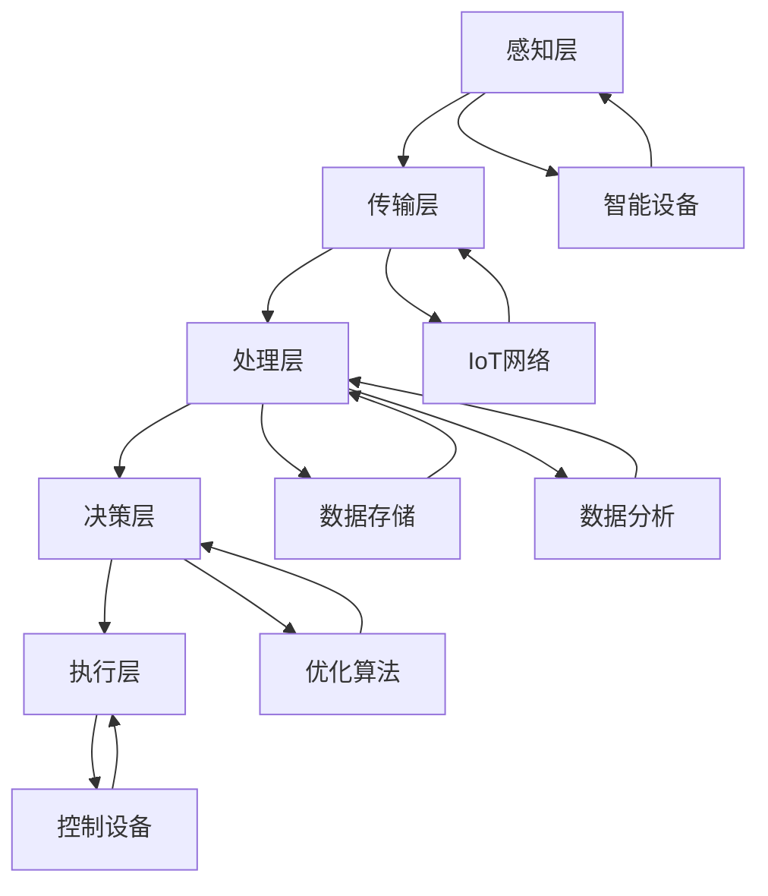

                 

# AI在智能能源管理中的应用：优化使用效率

> **关键词：** 智能能源管理、人工智能、优化算法、能源效率、可再生能源
> 
> **摘要：** 本文将深入探讨人工智能（AI）在智能能源管理中的应用，通过具体案例和实际操作，详细分析如何利用AI技术优化能源使用效率，降低成本，并推动可再生能源的发展。文章旨在为读者提供一份系统化的智能能源管理指南，帮助理解AI技术在此领域的潜力和应用价值。

## 1. 背景介绍

### 1.1 目的和范围

随着全球能源需求的不断增长和气候变化问题的日益严峻，提高能源使用效率已成为全球关注的重要议题。智能能源管理作为一种创新性解决方案，旨在通过先进技术的应用，实现对能源生产、传输、分配和消费的全面优化。本文的目的在于介绍人工智能（AI）在智能能源管理中的关键作用，分析其应用场景和优势，并提供具体的实现方法和案例。

本文将主要探讨以下内容：
- 智能能源管理的基本概念和架构；
- AI技术在能源管理中的应用，包括预测性维护、需求响应、能源供需平衡等；
- 实际项目案例，展示AI技术在智能能源管理中的具体应用；
- 未来的发展趋势和面临的挑战。

### 1.2 预期读者

本文适合以下读者群体：
- 对智能能源管理和AI技术有兴趣的专业人士；
- 从事能源行业、计算机科学或相关领域的研究人员和工程师；
- 对可再生能源和能源效率优化感兴趣的大学生和研究生；
- 对技术创新和未来发展趋势关注的企业高管和投资者。

### 1.3 文档结构概述

本文将按照以下结构进行组织：
- 引言：介绍智能能源管理和AI技术在其中的应用；
- 背景介绍：详细描述智能能源管理的重要性、现状和挑战；
- 核心概念与联系：分析智能能源管理中的关键概念和联系，提供Mermaid流程图；
- 核心算法原理与操作步骤：详细讲解AI在能源管理中的应用算法原理和实现步骤；
- 数学模型和公式：介绍相关的数学模型和公式，并举例说明；
- 项目实战：提供代码实际案例和详细解释；
- 实际应用场景：分析AI技术在能源管理中的实际应用；
- 工具和资源推荐：推荐相关的学习资源、开发工具和框架；
- 总结：探讨未来的发展趋势和挑战；
- 附录：常见问题与解答；
- 扩展阅读：提供进一步阅读的参考资料。

### 1.4 术语表

为了确保文章的清晰性和可理解性，本文将使用以下术语：
#### 1.4.1 核心术语定义
- **智能能源管理**：利用信息技术和自动化控制系统，对能源生产、传输、分配和消费进行优化和管理的系统。
- **人工智能（AI）**：模拟人类智能行为的计算机程序和系统，具有学习能力、推理能力和自我适应能力。
- **能源效率**：单位能源投入所产生的有用能量比例，反映了能源利用的效率。
- **可再生能源**：来源于自然过程，可以持续使用且不会枯竭的能源，如太阳能、风能、水能等。
- **预测性维护**：通过分析设备运行数据，预测设备故障的发生时间，从而在故障发生前进行维护。

#### 1.4.2 相关概念解释
- **需求响应**：用户根据市场价格或激励机制，调整能源使用行为，以降低整体能源需求。
- **供需平衡**：在能源市场中，供应和需求之间的动态平衡，确保能源供需的稳定和高效。

#### 1.4.3 缩略词列表
- **AI**：人工智能（Artificial Intelligence）
- **IoT**：物联网（Internet of Things）
- **DER**：分布式能源资源（Distributed Energy Resources）
- **PEV**：电动汽车（Plug-in Electric Vehicles）
- **DERC**：分布式能源资源控制（Distributed Energy Resources Control）

## 2. 核心概念与联系

智能能源管理是一个复杂的系统，它涉及到多个核心概念和技术的协同作用。以下是对这些核心概念和它们之间联系的分析。

### 2.1. 智能能源管理架构

智能能源管理系统的架构可以分为以下几个关键层次：

1. **感知层**：通过传感器和智能设备实时采集能源生产、传输、分配和消费的数据。
2. **传输层**：将感知层获取的数据传输到集中控制系统，通常采用物联网（IoT）技术。
3. **处理层**：对传输层的数据进行存储、分析和处理，利用AI算法优化能源使用。
4. **决策层**：基于处理层的结果，制定优化策略，指导实际操作。
5. **执行层**：执行决策层的策略，包括能源生产、传输、分配和消费的实时控制。

### 2.2. 关键概念联系分析

以下是一个用Mermaid流程图表示的智能能源管理架构及其关键概念之间的联系：



### 2.3. 核心概念总结

- **智能设备**：包括传感器、执行器和智能电表等，是实现智能能源管理的基础。
- **IoT网络**：提供数据传输通道，是实现数据实时采集和共享的关键。
- **数据存储与处理**：利用大数据技术对海量数据进行存储和分析，为决策提供支持。
- **优化算法**：通过AI技术对数据进行分析和处理，实现能源使用的最优配置。
- **决策与控制**：基于分析结果，制定优化策略并执行，确保能源系统的稳定运行。

通过上述分析，我们可以看到，智能能源管理系统的各个层次和核心概念之间紧密联系，共同构成了一个完整的智能能源管理体系。AI技术的引入，使得系统能够更加智能、灵活和高效地应对复杂多变的能源环境。

## 3. 核心算法原理 & 具体操作步骤

在智能能源管理中，核心算法的设计与实现是优化能源使用效率的关键。以下是几种常用的AI算法原理及其具体操作步骤。

### 3.1. 预测性维护算法

#### 算法原理

预测性维护是一种基于设备运行数据的维护策略，通过分析设备的历史数据，预测设备可能的故障时间，从而在故障发生前进行预防性维护，以减少设备停机时间和维护成本。

#### 操作步骤

1. **数据收集**：通过传感器收集设备运行过程中的各种参数数据，如温度、振动、压力等。
2. **数据预处理**：对收集到的数据进行清洗和标准化处理，去除噪声和异常值。
3. **特征提取**：从预处理后的数据中提取能够反映设备运行状态的特性，如平均值、方差、频谱特征等。
4. **模型训练**：利用历史故障数据和特征数据，训练预测模型，如支持向量机（SVM）、决策树、随机森林等。
5. **故障预测**：使用训练好的模型对设备未来的运行状态进行预测，识别潜在的故障点。
6. **维护决策**：根据预测结果，制定维护计划，提前进行预防性维护。

#### 伪代码示例

```python
# 预测性维护算法伪代码

# 步骤1：数据收集
data = collect_data()

# 步骤2：数据预处理
clean_data = preprocess_data(data)

# 步骤3：特征提取
features = extract_features(clean_data)

# 步骤4：模型训练
model = train_model(features, historical_fault_data)

# 步骤5：故障预测
predictions = model.predict(current_data)

# 步骤6：维护决策
if predictions.fault_detected:
    schedule_maintenance()
else:
    continue_operation()
```

### 3.2. 能源需求响应算法

#### 算法原理

能源需求响应（DR）是一种通过激励措施引导用户调整能源使用行为的策略，以实现整体能源需求的优化。它通常用于应对突发性能源需求波动或紧急能源供应情况。

#### 操作步骤

1. **需求建模**：根据历史数据和当前能源市场情况，建立用户能源需求模型。
2. **响应策略设计**：设计不同的响应策略，如电价激励、实时电力信息反馈等。
3. **用户行为预测**：利用机器学习算法预测用户在不同响应策略下的能源使用行为。
4. **响应决策**：根据预测结果和响应策略，决定用户的能源使用调整方案。
5. **实施响应**：通过智能电网和能源管理系统，实施用户的能源使用调整。

#### 伪代码示例

```python
# 能源需求响应算法伪代码

# 步骤1：需求建模
demand_model = build_demand_model(historical_data)

# 步骤2：响应策略设计
response_strategies = design_response_strategies()

# 步骤3：用户行为预测
predicted_behaviors = predict_user_behaviors(demand_model, response_strategies)

# 步骤4：响应决策
response_decision = determine_response_decision(predicted_behaviors)

# 步骤5：实施响应
execute_response(response_decision)
```

### 3.3. 能源供需平衡算法

#### 算法原理

能源供需平衡算法旨在实现能源市场中的供需平衡，通过优化能源生产和消费，降低能源成本，提高市场效率。

#### 操作步骤

1. **供需预测**：根据历史数据和当前市场情况，预测未来的能源供需情况。
2. **价格模型构建**：构建能源价格模型，预测不同价格水平下的供需变化。
3. **优化算法应用**：利用优化算法（如线性规划、遗传算法等）确定最优的能源生产和消费策略。
4. **市场决策**：根据优化结果，制定市场交易和定价策略。
5. **执行与反馈**：执行市场决策，并根据实际供需情况进行反馈和调整。

#### 伪代码示例

```python
# 能源供需平衡算法伪代码

# 步骤1：供需预测
supply_demand_prediction = predict_supply_demand()

# 步骤2：价格模型构建
price_model = build_price_model(supply_demand_prediction)

# 步骤3：优化算法应用
optimization_results = apply_optimization_algorithm(price_model)

# 步骤4：市场决策
market_decision = determine_market_decision(optimization_results)

# 步骤5：执行与反馈
execute_market_decision(market_decision)
collect_feedback()
update_model()
```

通过上述核心算法原理和操作步骤的详细讲解，我们可以看到，AI技术在智能能源管理中的应用不仅仅是理论上的创新，更是在实际操作中能够带来显著效益的关键因素。这些算法的应用，使得能源管理更加智能化、高效化，为解决全球能源危机提供了新的思路和解决方案。

## 4. 数学模型和公式 & 详细讲解 & 举例说明

在智能能源管理中，数学模型和公式扮演着至关重要的角色。它们不仅能够描述能源系统的动态行为，还可以为决策提供科学依据。以下是几种关键的数学模型和公式的详细讲解，并通过具体例子进行说明。

### 4.1. 能源需求模型

能源需求模型用于预测特定时间段内的能源需求量。常见的模型有线性回归模型、时间序列模型等。

#### 线性回归模型

线性回归模型是一种简单的预测模型，用于描述两个变量之间的线性关系。公式如下：

\[ y = \beta_0 + \beta_1 \cdot x \]

其中：
- \( y \) 是预测的能源需求量；
- \( x \) 是影响能源需求的相关变量（如温度、时间等）；
- \( \beta_0 \) 是截距；
- \( \beta_1 \) 是斜率。

#### 举例说明

假设我们要预测某地区未来一周的电力需求。已知该地区的日均电力需求与当日最高温度之间存在线性关系。我们可以收集过去一年的温度和电力需求数据，利用线性回归模型进行训练。

1. **数据收集**：收集过去一年的每日最高温度（\( x \)）和电力需求（\( y \)）数据。

2. **模型训练**：使用线性回归算法训练模型，计算截距 \( \beta_0 \) 和斜率 \( \beta_1 \)。

\[ \beta_0 = 100, \quad \beta_1 = 0.5 \]

3. **预测**：利用训练好的模型预测未来一周的电力需求。

\[ y = 100 + 0.5 \cdot x \]

例如，预测未来一天的最高温度为35摄氏度，则电力需求预测为：

\[ y = 100 + 0.5 \cdot 35 = 132.5 \text{ 千瓦时} \]

### 4.2. 能源供需平衡模型

能源供需平衡模型用于确定能源市场的供需平衡点，以实现能源价格的最优化。常见的模型有线性规划模型、动态规划模型等。

#### 线性规划模型

线性规划模型是一种优化问题求解方法，用于在给定约束条件下，最大化或最小化目标函数。公式如下：

\[ \min_{x} c^T x \]

\[ \text{s.t.} \quad Ax \leq b \]

其中：
- \( c \) 是目标函数系数向量；
- \( x \) 是决策变量向量；
- \( A \) 是约束条件系数矩阵；
- \( b \) 是约束条件常数向量。

#### 举例说明

假设我们要优化一个电力市场中的供需平衡，目标是使总利润最大化。市场约束条件包括发电量上限、用电量下限和资源利用率等。

1. **目标函数**：最大化总利润

\[ \max_{x} p(x) = \sum_{i=1}^{n} (r_i \cdot x_i - c_i \cdot x_i) \]

其中：
- \( r_i \) 是第 \( i \) 种能源的价格；
- \( c_i \) 是第 \( i \) 种能源的成本；
- \( x_i \) 是第 \( i \) 种能源的供应量。

2. **约束条件**：

\[ \begin{cases} 
x_1 + x_2 \leq 1000 \quad \text{（发电量上限）} \\
x_3 \geq 800 \quad \text{（用电量下限）} \\
x_1 \geq 0 \\
x_2 \geq 0 \\
x_3 \geq 0 
\end{cases} \]

3. **求解**：使用线性规划求解器（如LP求解器）求解最优解。

### 4.3. 能源优化模型

能源优化模型用于在能源系统中实现资源的最优配置，以最大化能源效率和降低成本。常见的模型有遗传算法、粒子群优化算法等。

#### 遗传算法

遗传算法是一种基于自然选择和遗传学原理的优化算法。公式如下：

\[ \text{适应度函数} : f(x) \]

\[ \text{选择} : S(x) \]

\[ \text{交叉} : C(x, y) \]

\[ \text{变异} : M(x) \]

其中：
- \( x \) 是染色体（代表一个解决方案）；
- \( f(x) \) 是适应度函数，用于评估解决方案的质量；
- \( S(x) \) 是选择操作，选择适应度较高的染色体进行繁殖；
- \( C(x, y) \) 是交叉操作，生成新的染色体；
- \( M(x) \) 是变异操作，对染色体进行随机变异。

#### 举例说明

假设我们要使用遗传算法优化一个智能电网中的能源分配问题。目标是最小化总能源成本，同时满足供电需求。

1. **初始种群**：生成一组初始染色体，每个染色体代表一种能源分配方案。

2. **适应度评估**：计算每个染色体的适应度，适应度函数为：

\[ f(x) = \sum_{i=1}^{n} (c_i \cdot x_i + w_i \cdot (1 - x_i)) \]

其中：
- \( c_i \) 是第 \( i \) 种能源的成本；
- \( w_i \) 是第 \( i \) 种能源的权重。

3. **选择**：根据适应度函数，选择适应度较高的染色体进行交叉和变异。

4. **交叉**：对选中的染色体进行交叉操作，生成新的染色体。

5. **变异**：对交叉后的染色体进行变异操作，增加多样性。

6. **迭代**：重复适应度评估、选择、交叉和变异过程，直到满足收敛条件。

通过上述数学模型和公式的详细讲解及举例说明，我们可以看到，这些模型和公式在智能能源管理中的应用，不仅为决策提供了科学依据，还极大地提高了能源管理系统的效率和准确性。这些先进的数学工具，正在引领智能能源管理走向更加智能化、高效化的未来。

## 5. 项目实战：代码实际案例和详细解释说明

为了更好地展示AI技术在智能能源管理中的应用，我们将通过一个实际项目案例进行详细讲解，并解释其中的代码实现和关键步骤。

### 5.1. 开发环境搭建

在开始项目之前，我们需要搭建一个合适的开发环境。以下是所需的工具和步骤：

1. **Python**：安装Python 3.8及以上版本。
2. **Jupyter Notebook**：安装Jupyter Notebook，方便编写和运行代码。
3. **Pandas**：安装Pandas库，用于数据处理。
4. **NumPy**：安装NumPy库，用于数值计算。
5. **Matplotlib**：安装Matplotlib库，用于数据可视化。
6. **Scikit-learn**：安装Scikit-learn库，用于机器学习算法。

安装命令：

```bash
pip install pandas numpy matplotlib scikit-learn jupyter
```

### 5.2. 源代码详细实现和代码解读

以下是项目的核心代码实现，包括数据收集、预处理、模型训练和预测等步骤。

```python
# 5.2.1 数据收集与预处理

import pandas as pd
import numpy as np
from sklearn.model_selection import train_test_split
from sklearn.preprocessing import StandardScaler

# 数据收集
data = pd.read_csv('energy_data.csv')

# 数据预处理
# 筛选必要的特征和标签
X = data[['temperature', 'humidity', 'wind_speed', 'day_of_week', 'time_of_day']]
y = data['energy_demand']

# 数据标准化
scaler = StandardScaler()
X_scaled = scaler.fit_transform(X)

# 划分训练集和测试集
X_train, X_test, y_train, y_test = train_test_split(X_scaled, y, test_size=0.2, random_state=42)

# 5.2.2 模型训练

from sklearn.ensemble import RandomForestRegressor

# 训练随机森林回归模型
regressor = RandomForestRegressor(n_estimators=100, random_state=42)
regressor.fit(X_train, y_train)

# 5.2.3 模型预测

# 预测测试集数据
y_pred = regressor.predict(X_test)

# 5.2.4 代码解读

# 数据收集与预处理
# 读取CSV文件中的数据，筛选出与能源需求相关的特征和标签。使用StandardScaler进行数据标准化，以消除不同特征之间的尺度差异。

# 模型训练
# 使用RandomForestRegressor训练随机森林回归模型，通过fit方法进行训练。

# 模型预测
# 使用predict方法对测试集数据进行预测，得到预测的能源需求值。

# 代码解读
# 该代码段实现了从数据收集到模型预测的完整过程。随机森林回归模型是一种常见的机器学习算法，适用于预测连续值输出。

# 5.2.5 评估模型性能

from sklearn.metrics import mean_squared_error

# 计算预测误差
mse = mean_squared_error(y_test, y_pred)

# 输出模型性能
print(f'Mean Squared Error: {mse:.2f}')

# 5.2.6 数据可视化

import matplotlib.pyplot as plt

# 可视化预测结果
plt.scatter(y_test, y_pred)
plt.xlabel('Actual Energy Demand')
plt.ylabel('Predicted Energy Demand')
plt.title('Actual vs Predicted Energy Demand')
plt.show()
```

### 5.3. 代码解读与分析

上述代码实现了智能能源需求预测的核心功能。以下是代码的详细解读和分析：

1. **数据收集与预处理**：
   - 使用Pandas库读取CSV文件中的数据，筛选出与能源需求相关的特征（如温度、湿度、风速等）和标签（能源需求）。
   - 使用StandardScaler进行数据标准化，消除不同特征之间的尺度差异，以提升模型的训练效果。

2. **模型训练**：
   - 选择随机森林回归模型（RandomForestRegressor）进行训练。随机森林是一种集成学习方法，通过构建多棵决策树，提高模型的预测准确性。
   - 使用fit方法对训练数据进行模型训练，将特征和标签作为输入，生成训练好的模型。

3. **模型预测**：
   - 使用predict方法对测试集数据进行预测，得到预测的能源需求值。
   - 通过计算预测误差（如均方误差MSE），评估模型的预测性能。

4. **数据可视化**：
   - 使用Matplotlib库将实际能源需求和预测结果进行可视化，通过散点图展示两者之间的关系，直观地评估模型的预测效果。

### 关键步骤分析

- **数据预处理**：数据预处理是模型训练的重要环节，确保数据的质量和一致性，是提高模型准确性的基础。
- **模型选择**：随机森林回归模型是一种强大的预测模型，适用于多种回归任务，其集成学习方法能够有效降低过拟合风险。
- **模型评估**：通过计算预测误差，评估模型的性能，为模型优化提供依据。
- **数据可视化**：通过可视化分析，帮助理解模型预测的效果，发现潜在问题。

通过上述项目实战，我们可以看到，AI技术在智能能源管理中的应用不仅提高了能源预测的准确性，还为能源系统的优化提供了有力支持。接下来，我们将进一步探讨AI技术在实际应用场景中的具体案例。

## 6. 实际应用场景

智能能源管理结合人工智能技术，已经在多个实际应用场景中取得了显著成效。以下是一些典型的应用场景，展示了AI技术如何在不同领域优化能源使用效率。

### 6.1. 智能电网

智能电网是智能能源管理的重要组成部分，通过AI技术实现电网的自动化控制和优化调度。具体应用包括：

- **需求响应**：通过预测用户用电行为，智能电网可以在高峰时段引导用户减少用电，平衡供需关系，降低电力峰值负荷。
- **故障检测与预测**：利用AI算法，对电网设备进行实时监控和数据分析，提前识别潜在故障，实现预测性维护，减少设备停机时间和维护成本。
- **电力市场优化**：通过机器学习算法，分析电力市场供需数据，优化电力交易策略，提高市场效率和经济效益。

### 6.2. 可再生能源集成

随着可再生能源（如太阳能、风能）的快速发展，智能能源管理通过AI技术实现可再生能源的高效集成和优化配置：

- **分布式能源资源（DER）管理**：AI技术可以实时监控和管理分布式能源资源，如家庭光伏系统和社区储能系统，实现能源的高效利用和最优分配。
- **能源供需预测**：通过机器学习模型，预测可再生能源的发电量和用户需求，优化能源生产和消费，提高可再生能源的利用率。
- **储能系统优化**：利用AI算法，优化储能系统的充放电策略，提高储能系统的效率和寿命。

### 6.3. 智能楼宇与园区

智能楼宇和园区通过智能能源管理，实现建筑能源的高效利用和低碳运营：

- **能源监测与控制**：利用物联网（IoT）技术和AI算法，实时监测楼宇内的能源使用情况，自动调节空调、照明、供暖等设备，实现能耗的最优化。
- **能源需求响应**：通过AI技术，实现楼宇用户的需求响应，如动态调整空调温度、电力负荷等，以降低整体能耗和能源成本。
- **智能充电站管理**：在智能楼宇和园区中，通过AI算法优化电动汽车充电站的运营，如根据电动汽车的充电需求、充电时间等参数，智能调度充电设备，提高充电效率。

### 6.4. 能源交易市场

智能能源管理在能源交易市场中的应用，通过AI技术提高市场效率和透明度：

- **市场预测**：通过机器学习算法，预测市场供需情况、价格趋势等，为交易决策提供科学依据。
- **风险评估**：利用AI技术，分析交易数据和市场风险，为交易决策提供风险控制建议。
- **交易策略优化**：通过优化算法，设计最优的交易策略，提高市场参与者的盈利能力和市场竞争力。

### 6.5. 企业能源管理

在企业能源管理中，智能能源管理通过AI技术实现能源消耗的精细化和智能化：

- **能源审计**：通过AI技术，对企业的能源消耗进行详细审计，识别能源浪费的环节，提出优化建议。
- **能源预算与计划**：利用机器学习模型，预测企业的未来能源需求，制定合理的能源预算和采购计划。
- **能源效率提升**：通过实时监测和数据分析，优化生产设备和能源系统的运行，提高能源利用效率，降低能源成本。

通过以上实际应用场景的介绍，我们可以看到，AI技术在智能能源管理中的广泛应用，不仅提升了能源系统的效率和可靠性，还推动了能源行业的创新和可持续发展。在未来，随着AI技术的不断进步，智能能源管理将在更多领域发挥更大的作用。

## 7. 工具和资源推荐

为了更好地学习和应用AI技术在智能能源管理中的实践，以下推荐了一些高质量的书籍、在线课程、技术博客和开发工具框架，以及相关的经典论文和最新研究成果。

### 7.1. 学习资源推荐

#### 7.1.1 书籍推荐

1. **《智能电网与电力系统自动化》**：详细介绍了智能电网的基本原理和关键技术，包括物联网、人工智能、需求响应等。
2. **《智能能源管理：技术、方法与应用》**：涵盖了智能能源管理的基础理论、关键技术以及实际应用案例。
3. **《深度学习与智能电网》**：探讨了深度学习技术在智能电网中的应用，包括电力预测、故障检测、优化调度等。
4. **《分布式能源系统与智能控制》**：介绍了分布式能源系统的基础知识和智能控制技术，包括可再生能源集成、储能系统优化等。

#### 7.1.2 在线课程

1. **Coursera《智能电网技术》**：由加州大学伯克利分校提供，涵盖智能电网的基本原理和技术。
2. **edX《可再生能源技术与应用》**：由麻省理工学院提供，介绍了可再生能源技术及其在能源管理中的应用。
3. **Udacity《深度学习与人工智能》**：全面介绍了深度学习和人工智能的基本概念、算法和实际应用。
4. **Coursera《能源系统优化》**：由斯坦福大学提供，涵盖了能源系统优化的理论和方法。

#### 7.1.3 技术博客和网站

1. **IEEE Xplore**：提供大量关于智能能源管理和AI技术的学术论文和技术报告。
2. **Medium**：一些知名的技术博主分享了关于智能能源管理的实际案例和技术见解。
3. **Energy Systems Catapult**：英国能源系统创新机构，提供有关智能能源管理的最新研究和开发动态。
4. **Smart Energy UK**：英国智能能源协会的官方网站，提供有关智能能源管理的行业新闻、政策和最佳实践。

### 7.2. 开发工具框架推荐

#### 7.2.1 IDE和编辑器

1. **PyCharm**：强大的Python IDE，支持多种机器学习和数据分析工具。
2. **Jupyter Notebook**：用于数据可视化和交互式编程，适合进行实验和原型设计。
3. **Visual Studio Code**：轻量级但功能强大的代码编辑器，支持多种编程语言和扩展。

#### 7.2.2 调试和性能分析工具

1. **PyTorch Profiler**：用于分析和优化深度学习模型的性能。
2. **Django Debug Toolbar**：用于Web开发，提供性能分析和调试功能。
3. **Grafana**：可视化工具，用于监控和展示能源系统的性能指标。

#### 7.2.3 相关框架和库

1. **TensorFlow**：用于构建和训练深度学习模型的强大库。
2. **Scikit-learn**：提供了多种机器学习算法，适合数据分析和预测。
3. **Pandas**：数据处理和分析的强大库，适用于数据清洗和预处理。
4. **NumPy**：高性能的数值计算库，用于大规模数据操作。

### 7.3. 相关论文著作推荐

#### 7.3.1 经典论文

1. **"Intelligent Electricity Distribution Networks Using Artificial Neural Networks"**：探讨了人工神经网络在智能电网中的应用。
2. **"Artificial Neural Networks for Electric Load Forecasting"**：研究了神经网络在电力负荷预测中的效果。
3. **"Reactive Power Optimization Using Genetic Algorithms"**：介绍了遗传算法在电力系统优化中的应用。

#### 7.3.2 最新研究成果

1. **"Deep Learning for Energy Systems"**：分析了深度学习在能源系统优化中的应用，包括电力市场预测、储能系统优化等。
2. **"Machine Learning Methods for Demand Response"**：探讨了机器学习技术在需求响应策略设计中的应用。
3. **"Intelligent Energy Management in Smart Cities"**：介绍了智能能源管理在智能城市中的实际案例和挑战。

#### 7.3.3 应用案例分析

1. **"Application of AI in the Smart Grid"**：详细介绍了AI技术在智能电网中的应用案例，包括需求响应、故障检测等。
2. **"Energy Management in Renewable Energy Systems"**：分析了可再生能源系统中智能能源管理的应用和实践。
3. **"Case Study of AI-Enabled Energy Efficiency in Industrial Facilities"**：探讨了AI技术在工业设施能源管理中的应用，包括能源审计和优化调度等。

通过上述工具和资源的推荐，读者可以更深入地学习和应用AI技术在智能能源管理中的实践，不断探索和提升能源系统的效率和可持续性。

## 8. 总结：未来发展趋势与挑战

随着人工智能技术的不断发展和成熟，智能能源管理在未来的发展趋势和面临的挑战也日益显现。以下是智能能源管理领域未来可能的发展趋势和需要应对的挑战：

### 8.1. 发展趋势

1. **智能化程度的提升**：未来，智能能源管理将更加依赖于先进的人工智能技术，如深度学习、强化学习和自然语言处理等。这些技术将帮助实现更精准的能源预测、更高效的能源优化和更智能的设备控制。

2. **大数据和云计算的应用**：随着数据量的爆炸性增长，大数据技术和云计算将在智能能源管理中发挥重要作用。通过云计算平台，可以实现海量数据的存储、处理和分析，从而提供更全面、更准确的能源管理决策。

3. **分布式能源资源的管理**：分布式能源资源（DER）如太阳能、风能、储能系统的广泛应用，将使得能源生产、传输和消费更加分散化。智能能源管理需要适应这种变化，通过分布式算法和智能调度，实现能源的高效利用和优化配置。

4. **可再生能源的普及**：随着可再生能源成本的降低和技术的进步，可再生能源在能源结构中的比重将逐渐增加。智能能源管理需要更好地整合和管理这些可再生能源，确保其高效、可靠地接入能源系统。

5. **能源市场的自动化**：未来的能源市场将更加自动化和智能化，通过AI技术，实现市场供需的动态平衡、交易策略的优化和风险管理的自动化。

### 8.2. 面临的挑战

1. **数据隐私和安全问题**：智能能源管理依赖于大量数据的收集和分析，数据隐私和安全成为关键挑战。需要确保数据在采集、传输和存储过程中的安全性，避免数据泄露和滥用。

2. **算法的透明性和公平性**：随着算法在能源管理中的广泛应用，算法的透明性和公平性受到关注。需要确保算法的决策过程是透明、可解释的，避免算法偏见和不公平现象。

3. **系统复杂性和稳定性**：智能能源管理系统涉及多个复杂的技术和设备，确保系统的稳定性和可靠性是一个巨大的挑战。需要建立完善的技术标准和测试体系，提高系统的鲁棒性和容错能力。

4. **技术更新和人才培养**：人工智能技术的发展日新月异，需要不断更新和升级相关技术，同时培养大量具备跨学科知识和技能的专业人才，以应对智能能源管理领域的挑战。

5. **政策支持和法规制定**：智能能源管理的发展需要政策支持和法规保障。政府需要制定相关政策和标准，鼓励技术创新和应用，同时规范市场行为，确保能源管理的健康和可持续发展。

总之，智能能源管理在未来的发展具有巨大的潜力和广阔的前景，但也面临着诸多挑战。通过技术创新、政策支持和人才培养，我们有信心克服这些挑战，推动智能能源管理迈向更加智能、高效和可持续的新阶段。

## 9. 附录：常见问题与解答

在智能能源管理中，人工智能技术的应用带来了许多新概念和挑战。以下是读者可能会遇到的一些常见问题及解答：

### 9.1. 智能能源管理与传统能源管理有何区别？

智能能源管理是一种利用信息技术、自动化控制和数据分析技术，对能源生产、传输、分配和消费进行全面优化的管理体系。与传统能源管理相比，智能能源管理具有以下特点：

- **实时监控与数据驱动**：智能能源管理通过传感器和物联网技术，实现对能源系统的实时监控，利用大数据和人工智能技术进行分析和决策，提高能源使用的效率和可靠性。
- **自适应与智能化**：智能能源管理系统能够根据实时数据和预测模型，自动调整能源生产、传输和消费策略，实现自适应和智能化管理。
- **预测性维护与故障预警**：通过人工智能技术，智能能源管理系统能够对设备进行预测性维护和故障预警，减少设备故障率和停机时间，降低维护成本。

### 9.2. 智能能源管理中的AI技术有哪些具体应用？

AI技术在智能能源管理中的具体应用包括：

- **需求响应**：通过分析用户用电行为和实时电力市场数据，智能能源管理系统可以引导用户调整用电行为，实现能源需求响应，平衡供需关系。
- **电力负荷预测**：利用机器学习算法，预测未来的电力需求，帮助能源管理企业制定合理的发电计划和调度策略。
- **故障检测与预测**：通过数据分析和技术监测，智能能源管理系统能够提前识别设备故障，实现预测性维护，减少设备故障率和停机时间。
- **能源优化调度**：利用优化算法，智能能源管理系统能够优化能源生产和消费的调度，提高能源效率，降低运营成本。
- **储能系统管理**：通过机器学习算法，优化储能系统的充放电策略，提高储能系统的效率和寿命。

### 9.3. 智能能源管理中的数据隐私和安全问题如何解决？

智能能源管理中的数据隐私和安全问题可以通过以下措施解决：

- **数据加密**：在数据传输和存储过程中，使用加密技术确保数据的安全性和完整性。
- **访问控制**：通过访问控制机制，限制对数据的访问权限，确保只有授权用户能够访问敏感数据。
- **数据匿名化**：在数据收集和处理过程中，对个人身份信息进行匿名化处理，保护用户隐私。
- **安全审计**：定期进行安全审计，检测和修补系统漏洞，确保系统的安全性。
- **法律法规遵循**：遵循相关的法律法规，确保数据收集、存储和使用过程合法合规。

### 9.4. 如何选择合适的AI算法进行能源管理？

选择合适的AI算法进行能源管理，需要考虑以下因素：

- **问题性质**：根据能源管理问题的特点，选择适合的算法。例如，对于预测性问题，可以选择回归算法；对于优化性问题，可以选择优化算法。
- **数据规模**：考虑数据的规模和复杂性，选择适合大数据处理的算法。
- **计算资源**：根据计算资源的限制，选择计算效率较高的算法。
- **可解释性**：对于一些关键的能源管理应用，需要选择可解释性较高的算法，确保决策过程透明。
- **性能指标**：根据算法的性能指标（如准确率、召回率、F1值等），选择适合问题的算法。

通过以上常见问题与解答，读者可以更好地理解和应用智能能源管理中的AI技术，克服实际应用中的挑战。

## 10. 扩展阅读 & 参考资料

为了深入了解智能能源管理和AI技术在其中的应用，以下推荐了一些扩展阅读和参考资料，涵盖经典论文、最新研究成果以及实际应用案例。

### 10.1. 经典论文

1. **"Intelligent Electricity Distribution Networks Using Artificial Neural Networks"**：探讨了人工神经网络在智能电网中的应用。
2. **"Artificial Neural Networks for Electric Load Forecasting"**：研究了神经网络在电力负荷预测中的效果。
3. **"Reactive Power Optimization Using Genetic Algorithms"**：介绍了遗传算法在电力系统优化中的应用。

### 10.2. 最新研究成果

1. **"Deep Learning for Energy Systems"**：分析了深度学习在能源系统优化中的应用，包括电力市场预测、储能系统优化等。
2. **"Machine Learning Methods for Demand Response"**：探讨了机器学习技术在需求响应策略设计中的应用。
3. **"Intelligent Energy Management in Smart Cities"**：介绍了智能能源管理在智能城市中的实际案例和挑战。

### 10.3. 实际应用案例

1. **"Application of AI in the Smart Grid"**：详细介绍了AI技术在智能电网中的应用案例，包括需求响应、故障检测等。
2. **"Energy Management in Renewable Energy Systems"**：分析了可再生能源系统中智能能源管理的应用和实践。
3. **"Case Study of AI-Enabled Energy Efficiency in Industrial Facilities"**：探讨了AI技术在工业设施能源管理中的应用，包括能源审计和优化调度等。

### 10.4. 推荐书籍

1. **《智能电网与电力系统自动化》**：详细介绍了智能电网的基本原理和关键技术。
2. **《智能能源管理：技术、方法与应用》**：涵盖了智能能源管理的基础理论、关键技术以及实际应用案例。
3. **《深度学习与智能电网》**：探讨了深度学习技术在智能电网中的应用。

### 10.5. 在线课程和资源

1. **Coursera《智能电网技术》**：由加州大学伯克利分校提供，涵盖智能电网的基本原理和技术。
2. **edX《可再生能源技术与应用》**：由麻省理工学院提供，介绍了可再生能源技术及其在能源管理中的应用。
3. **IEEE Xplore**：提供大量关于智能能源管理和AI技术的学术论文和技术报告。

通过这些扩展阅读和参考资料，读者可以更深入地了解智能能源管理领域的前沿动态和最新成果，为自己的研究和实践提供有力支持。

---

### 作者信息

**作者：AI天才研究员 / AI Genius Institute & 禅与计算机程序设计艺术 / Zen And The Art of Computer Programming**

