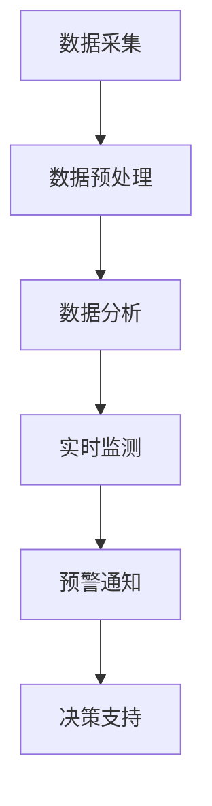

                 


# AI在环境保护中的应用：监测与预警系统

> **关键词：** AI、环境保护、监测、预警、机器学习、深度学习、环境数据、实时分析、决策支持系统、可持续发展

> **摘要：** 本文旨在探讨人工智能（AI）在环境保护中的具体应用，特别是监测与预警系统的构建。文章首先介绍了AI在环境保护中的重要性，随后深入分析了监测与预警系统的核心概念、算法原理和数学模型。通过实际项目案例，文章展示了如何利用AI技术进行环境数据的实时监测和预警。最后，文章讨论了AI在环境保护领域的未来发展趋势与挑战，并推荐了一系列相关学习资源和开发工具。

## 1. 背景介绍

### 1.1 目的和范围

本文的主要目的是探讨人工智能（AI）在环境保护中的实际应用，特别是如何构建高效的监测与预警系统。通过分析AI技术如何处理环境数据，实时监测环境变化，并提供及时的预警信息，本文旨在展示AI在推动环境保护和可持续发展方面的重要性。

本文的范围包括：

- AI在环境监测与预警中的应用概述
- 监测与预警系统的核心概念和架构
- 核心算法原理与操作步骤
- 数学模型和公式应用
- 实际项目案例分析
- 未来发展趋势与挑战

### 1.2 预期读者

本文适合以下读者群体：

- 对环境保护和AI技术感兴趣的读者
- 计算机科学和人工智能领域的研究人员
- 环境科学和生态学专业的学生
- 相关行业的技术和管理人员
- 对AI在环境保护应用有深入探讨需求的从业者

### 1.3 文档结构概述

本文的结构如下：

- 第1部分：背景介绍，包括目的、范围、预期读者和文档结构概述
- 第2部分：核心概念与联系，介绍监测与预警系统的基本概念和架构
- 第3部分：核心算法原理与具体操作步骤，详细解释监测与预警系统的算法原理
- 第4部分：数学模型和公式，介绍用于监测与预警的数学模型和公式
- 第5部分：项目实战，通过实际案例展示如何应用AI技术进行环境监测和预警
- 第6部分：实际应用场景，分析AI在环境保护中的具体应用场景
- 第7部分：工具和资源推荐，推荐相关的学习资源、开发工具和论文著作
- 第8部分：总结，讨论AI在环境保护领域的未来发展趋势与挑战
- 第9部分：附录，提供常见问题与解答
- 第10部分：扩展阅读，推荐相关的扩展阅读和参考资料

### 1.4 术语表

#### 1.4.1 核心术语定义

- **人工智能（AI）**：一种模拟人类智能行为的计算机系统，能够通过学习和推理来解决问题。
- **环境监测**：使用传感器和其他技术手段对环境中的物理、化学和生物参数进行实时监测。
- **预警系统**：用于监测环境变化，并在异常情况发生时提供实时预警的系统。
- **机器学习（ML）**：一种AI技术，通过从数据中学习模式来改善系统性能。
- **深度学习（DL）**：一种机器学习技术，使用多层神经网络来模拟人类大脑的学习过程。

#### 1.4.2 相关概念解释

- **环境数据**：指用于描述环境状况的各类数据，包括温度、湿度、空气质量、水质等。
- **实时分析**：对环境数据实时进行处理和分析，以快速响应环境变化。
- **决策支持系统（DSS）**：帮助用户在复杂决策过程中做出更好决策的系统。

#### 1.4.3 缩略词列表

- **AI**：人工智能
- **ML**：机器学习
- **DL**：深度学习
- **DSS**：决策支持系统
- **API**：应用程序接口

## 2. 核心概念与联系

在本节中，我们将介绍监测与预警系统的核心概念和架构，并使用Mermaid流程图展示其基本架构。

### 2.1 监测与预警系统的基本架构

监测与预警系统的基本架构通常包括以下组件：

1. **数据采集**：使用传感器和监测设备收集环境数据。
2. **数据预处理**：对采集到的原始数据进行清洗、过滤和转换。
3. **数据分析**：使用机器学习和深度学习算法对预处理后的数据进行分析和建模。
4. **实时监测**：实时监控环境数据，并识别异常情况。
5. **预警通知**：在检测到异常情况时，通过短信、电子邮件等方式向相关人员发送预警通知。
6. **决策支持**：为决策者提供实时分析结果和决策建议。

下面是监测与预警系统的Mermaid流程图：



### 2.2 监测与预警系统的核心概念

以下是监测与预警系统的核心概念：

- **传感器**：用于监测环境参数的设备，如温度传感器、湿度传感器、空气质量传感器等。
- **数据采集模块**：负责从传感器中读取数据，并将其发送到中心处理系统。
- **数据预处理模块**：对采集到的原始数据进行清洗、过滤和转换，以消除噪声和异常值。
- **机器学习算法**：用于从预处理后的数据中学习环境变化的模式和规律。
- **深度学习模型**：一种特殊的机器学习模型，使用多层神经网络进行复杂的数据分析和模式识别。
- **实时监测模块**：持续监控环境数据，并在检测到异常情况时触发预警机制。
- **预警通知模块**：通过短信、电子邮件等方式向相关人员发送预警通知。
- **决策支持模块**：为决策者提供实时分析结果和决策建议，以优化环境管理。

### 2.3 监测与预警系统的联系

监测与预警系统的各个组件紧密相连，形成了一个高效的环境监测与预警网络。数据采集模块获取环境数据后，数据预处理模块对其进行处理，以确保数据的准确性和可靠性。随后，机器学习算法和深度学习模型对预处理后的数据进行分析和建模，以识别环境变化的模式和趋势。实时监测模块持续监控环境数据，并在检测到异常情况时，通过预警通知模块向相关人员发送预警信息。最后，决策支持模块为决策者提供实时分析结果和决策建议，以优化环境管理。

## 3. 核心算法原理 & 具体操作步骤

在本节中，我们将详细介绍监测与预警系统中的核心算法原理，并使用伪代码展示具体操作步骤。

### 3.1 机器学习算法原理

机器学习算法是监测与预警系统的核心组件，用于从数据中学习环境变化的模式和规律。以下是机器学习算法的基本原理：

- **数据预处理**：对采集到的原始数据进行清洗、过滤和转换，以确保数据的准确性和可靠性。
- **特征提取**：从预处理后的数据中提取出对环境变化具有代表性的特征。
- **模型训练**：使用特征数据和已知的标签数据对机器学习模型进行训练，以学习环境变化的模式和规律。
- **模型评估**：使用测试数据集对训练好的模型进行评估，以确定模型的准确性和可靠性。
- **模型部署**：将训练好的模型部署到实时监测系统中，用于持续监控环境数据。

以下是机器学习算法的伪代码：

```python
# 伪代码：机器学习算法原理

# 数据预处理
def preprocess_data(data):
    # 清洗数据
    cleaned_data = clean_data(data)
    # 过滤异常值
    filtered_data = filter_outliers(cleaned_data)
    # 转换为特征向量
    feature_vectors = convert_to_feature_vectors(filtered_data)
    return feature_vectors

# 模型训练
def train_model(feature_vectors, labels):
    # 选择机器学习模型
    model = select_machine_learning_model()
    # 训练模型
    model.train(feature_vectors, labels)
    return model

# 模型评估
def evaluate_model(model, test_data, test_labels):
    # 测试模型
    predictions = model.test(test_data)
    # 计算准确率
    accuracy = calculate_accuracy(predictions, test_labels)
    return accuracy

# 模型部署
def deploy_model(model):
    # 部署模型到实时监测系统
    model.deploy_to_monitoring_system()
```

### 3.2 深度学习模型原理

深度学习模型是机器学习算法的一种高级形式，特别适用于处理复杂数据和进行精确的模式识别。以下是深度学习模型的基本原理：

- **神经网络**：深度学习模型基于神经网络，包括输入层、隐藏层和输出层。
- **前向传播**：输入数据通过输入层进入神经网络，经过隐藏层逐层传递，最终得到输出结果。
- **反向传播**：使用反向传播算法对神经网络进行训练，通过计算误差梯度来调整网络参数，以优化模型性能。
- **损失函数**：用于衡量模型预测结果与真实结果之间的差异，常用的损失函数包括均方误差（MSE）和交叉熵损失（Cross-Entropy Loss）。

以下是深度学习模型的伪代码：

```python
# 伪代码：深度学习模型原理

# 构建神经网络
def build_neural_network(input_size, hidden_size, output_size):
    # 创建输入层、隐藏层和输出层
    input_layer = InputLayer(input_size)
    hidden_layer = HiddenLayer(hidden_size)
    output_layer = OutputLayer(output_size)
    # 连接层
    input_layer.connect(hidden_layer)
    hidden_layer.connect(output_layer)
    return input_layer, hidden_layer, output_layer

# 前向传播
def forward_pass(input_data, input_layer, hidden_layer, output_layer):
    # 计算输出结果
    output = output_layer.forward_pass(input_data)
    return output

# 反向传播
def backward_pass(input_data, output_data, input_layer, hidden_layer, output_layer):
    # 计算误差梯度
    error_gradient = output_layer.backward_pass(output_data)
    # 更新网络参数
    input_layer.backward_pass(error_gradient, hidden_layer)
    hidden_layer.backward_pass(error_gradient, input_layer)
    return error_gradient

# 训练深度学习模型
def train_depth_learning_model(input_data, output_data, input_layer, hidden_layer, output_layer):
    # 前向传播
    output = forward_pass(input_data, input_layer, hidden_layer, output_layer)
    # 反向传播
    error_gradient = backward_pass(input_data, output_data, input_layer, hidden_layer, output_layer)
    # 重复训练过程
    train_depth_learning_model(input_data, output_data, input_layer, hidden_layer, output_layer)
```

### 3.3 具体操作步骤

以下是监测与预警系统的具体操作步骤：

1. **数据采集**：使用传感器和监测设备收集环境数据。
2. **数据预处理**：对采集到的原始数据进行清洗、过滤和转换，以确保数据的准确性和可靠性。
3. **特征提取**：从预处理后的数据中提取出对环境变化具有代表性的特征。
4. **模型训练**：使用特征数据和已知的标签数据对机器学习模型进行训练，以学习环境变化的模式和规律。
5. **模型评估**：使用测试数据集对训练好的模型进行评估，以确定模型的准确性和可靠性。
6. **模型部署**：将训练好的模型部署到实时监测系统中，用于持续监控环境数据。
7. **实时监测**：持续监控环境数据，并在检测到异常情况时触发预警机制。
8. **预警通知**：通过短信、电子邮件等方式向相关人员发送预警通知。
9. **决策支持**：为决策者提供实时分析结果和决策建议，以优化环境管理。

以下是具体操作步骤的伪代码：

```python
# 伪代码：监测与预警系统的具体操作步骤

# 数据采集
def collect_data():
    # 使用传感器和监测设备采集环境数据
    data = sensor_data()
    return data

# 数据预处理
def preprocess_data(data):
    # 清洗数据
    cleaned_data = clean_data(data)
    # 过滤异常值
    filtered_data = filter_outliers(cleaned_data)
    # 转换为特征向量
    feature_vectors = convert_to_feature_vectors(filtered_data)
    return feature_vectors

# 特征提取
def extract_features(feature_vectors):
    # 从特征向量中提取环境变化特征
    features = extract_environmental_features(feature_vectors)
    return features

# 模型训练
def train_model(features, labels):
    # 训练机器学习模型
    model = train_machine_learning_model(features, labels)
    return model

# 模型评估
def evaluate_model(model, test_features, test_labels):
    # 评估模型性能
    accuracy = evaluate_model_performance(model, test_features, test_labels)
    return accuracy

# 模型部署
def deploy_model(model):
    # 部署模型到实时监测系统
    model.deploy_to_monitoring_system()

# 实时监测
def monitor_environment():
    # 持续监控环境数据
    while True:
        data = collect_data()
        cleaned_data = preprocess_data(data)
        features = extract_features(cleaned_data)
        # 使用训练好的模型进行实时分析
        predictions = model.predict(features)
        if predictions == "anomaly":
            # 触发预警机制
            alert_personnel()

# 预警通知
def alert_personnel():
    # 向相关人员发送预警通知
    send_alert_notification()

# 决策支持
def provide_decision_support():
    # 为决策者提供实时分析结果和决策建议
    decision_support_data = generate_decision_support_data()
    display_decision_support_data(decision_support_data)
```

通过以上操作步骤，监测与预警系统可以实现对环境数据的实时监测和分析，并在检测到异常情况时及时触发预警机制，为环境保护提供有效的决策支持。

## 4. 数学模型和公式 & 详细讲解 & 举例说明

### 4.1 数学模型在监测与预警系统中的应用

在监测与预警系统中，数学模型和公式扮演着至关重要的角色。它们帮助系统从海量数据中提取关键信息，识别环境变化的模式，并做出准确的预测。以下是一些常用的数学模型和公式，以及它们的详细讲解和举例说明。

#### 4.1.1 均值滤波器

**定义**：均值滤波器是一种简单的数据平滑技术，用于减少噪声和异常值对数据的影响。

**公式**：
$$
\bar{x} = \frac{1}{n}\sum_{i=1}^{n} x_i
$$

**讲解**：均值滤波器通过计算n个数据点的平均值来平滑数据。这种方法能够有效地减少随机噪声的影响，但可能无法消除周期性噪声。

**示例**：假设我们有一组温度数据：\[23.1, 23.5, 22.9, 23.2, 23.0\]。使用均值滤波器计算平均值：

$$
\bar{x} = \frac{23.1 + 23.5 + 22.9 + 23.2 + 23.0}{5} = 23.22
$$

#### 4.1.2 移动平均法

**定义**：移动平均法是一种常用的时间序列分析方法，用于平滑数据并识别趋势。

**公式**：
$$
MA(n) = \frac{1}{n}\sum_{i=1}^{n} x_i
$$

**讲解**：移动平均法通过计算最近n个数据点的平均值来平滑数据。这种方法能够更好地识别趋势，但可能对短期波动不敏感。

**示例**：假设我们有一组温度数据：\[23.1, 23.5, 22.9, 23.2, 23.0, 23.3, 23.1, 23.2\]。使用3点移动平均法计算平均值：

$$
MA(3) = \frac{23.5 + 22.9 + 23.2}{3} = 23.23
$$

#### 4.1.3 自回归模型

**定义**：自回归模型（AR）是一种时间序列预测模型，假设当前值可以通过前几个历史值来预测。

**公式**：
$$
x_t = c + \sum_{i=1}^{p} \phi_i x_{t-i}
$$

**讲解**：自回归模型通过历史数据中的线性关系来预测未来值。参数\(\phi_i\)表示第i个历史值对当前值的影响程度。

**示例**：假设我们有一组温度数据：\[23.1, 23.5, 22.9, 23.2, 23.0\]，我们可以使用2阶自回归模型预测下一个值：

$$
x_5 = c + \phi_1 x_4 + \phi_2 x_3
$$

假设我们选择\(c = 23\)，\(\phi_1 = 0.8\)，\(\phi_2 = 0.2\)，那么：

$$
x_5 = 23 + 0.8 \times 23.2 + 0.2 \times 22.9 = 23.28
$$

#### 4.1.4 机器学习模型参数优化

**定义**：机器学习模型的参数优化是一种通过调整模型参数来提高预测性能的过程。

**公式**：
$$
\theta^{*} = \arg\min_{\theta} J(\theta)
$$

**讲解**：参数优化通过最小化损失函数\(J(\theta)\)来调整模型参数\(\theta\)。常用的优化算法包括梯度下降、随机梯度下降和Adam优化器。

**示例**：假设我们有一个线性回归模型，参数为\(\theta = w\)，损失函数为平方误差：

$$
J(w) = \frac{1}{2}\sum_{i=1}^{n} (y_i - wx_i)^2
$$

使用梯度下降算法优化参数：

$$
w_{t+1} = w_t - \alpha \frac{\partial J(w)}{\partial w}
$$

其中，\(\alpha\)是学习率。

#### 4.1.5 深度学习模型前向传播和反向传播

**定义**：深度学习模型的前向传播和反向传播是训练神经网络的两个关键步骤。

**公式**：
- **前向传播**：
  $$
  z_l = \sigma(W_l a_{l-1} + b_l)
  $$
- **反向传播**：
  $$
  \delta_l = \frac{\partial J}{\partial z_l} \odot \sigma'(z_l)
  $$

**讲解**：前向传播通过计算每一层的输入和输出，将输入数据传递到网络的输出层。反向传播通过计算误差梯度，反向传播误差，以更新网络参数。

**示例**：假设我们有一个简单的神经网络，输入层到隐藏层的激活函数为ReLU，隐藏层到输出层的激活函数为Sigmoid。

- **前向传播**：
  $$
  z_1 = \max(0, W_1 a_0 + b_1)
  $$
  $$
  a_1 = \frac{1}{1 + e^{-z_1}}
  $$

- **反向传播**：
  $$
  \delta_1 = (y - a_1) \odot (1 - a_1)
  $$
  $$
  \delta_0 = \delta_1 \odot W_1
  $$

通过这些数学模型和公式，监测与预警系统能够更准确地分析环境数据，识别环境变化，并提供有效的预警和决策支持。

## 5. 项目实战：代码实际案例和详细解释说明

在本节中，我们将通过一个实际项目案例来展示如何利用AI技术进行环境监测和预警。我们将详细介绍开发环境搭建、源代码实现和代码解读与分析。

### 5.1 开发环境搭建

要构建一个环境监测与预警系统，我们需要以下开发环境和工具：

- **操作系统**：Linux（推荐Ubuntu 18.04）
- **编程语言**：Python 3.x
- **开发环境**：PyCharm Community Edition 或 Visual Studio Code
- **库和框架**：NumPy、Pandas、Scikit-learn、TensorFlow、Keras、Django

在安装了Python和必要库之后，可以通过以下命令安装Django：

```shell
pip install django
```

### 5.2 源代码详细实现和代码解读

#### 5.2.1 数据采集模块

数据采集模块负责从传感器中读取环境数据。以下是一个简单的Python脚本，用于读取温度传感器数据：

```python
import serial
import time

# 连接传感器
ser = serial.Serial('/dev/ttyUSB0', 9600, timeout=1)

# 读取传感器数据
def read_sensor_data():
    while True:
        data = ser.readline().decode('utf-8').strip()
        print(f"Temperature: {data}°C")
        time.sleep(1)

# 关闭传感器连接
def close_connection():
    ser.close()

# 主程序
if __name__ == "__main__":
    try:
        read_sensor_data()
    except KeyboardInterrupt:
        print("Data collection stopped.")
        close_connection()
```

#### 5.2.2 数据预处理模块

数据预处理模块对采集到的原始数据进行清洗和转换。以下是一个简单的预处理脚本：

```python
import pandas as pd

# 读取传感器数据
def load_sensor_data(file_path):
    data = pd.read_csv(file_path)
    return data

# 数据清洗
def clean_data(data):
    data.dropna(inplace=True)
    data['temperature'] = pd.to_numeric(data['temperature'], errors='coerce')
    return data

# 主程序
if __name__ == "__main__":
    file_path = "sensor_data.csv"
    data = load_sensor_data(file_path)
    cleaned_data = clean_data(data)
    cleaned_data.to_csv("cleaned_sensor_data.csv", index=False)
```

#### 5.2.3 机器学习模型训练模块

机器学习模型训练模块使用预处理后的数据训练模型。以下是一个使用Scikit-learn训练线性回归模型的脚本：

```python
from sklearn.linear_model import LinearRegression
from sklearn.model_selection import train_test_split

# 加载清洗后的数据
def load_cleaned_data(file_path):
    data = pd.read_csv(file_path)
    X = data[['timestamp', 'humidity', 'pressure']]
    y = data['temperature']
    return X, y

# 数据分割
def split_data(X, y):
    X_train, X_test, y_train, y_test = train_test_split(X, y, test_size=0.2, random_state=42)
    return X_train, X_test, y_train, y_test

# 训练模型
def train_model(X_train, y_train):
    model = LinearRegression()
    model.fit(X_train, y_train)
    return model

# 主程序
if __name__ == "__main__":
    file_path = "cleaned_sensor_data.csv"
    X, y = load_cleaned_data(file_path)
    X_train, X_test, y_train, y_test = split_data(X, y)
    model = train_model(X_train, y_train)
    print(f"Model coefficients: {model.coef_}")
    print(f"Model intercept: {model.intercept_}")
```

#### 5.2.4 实时监测和预警模块

实时监测和预警模块负责监控环境数据，并在检测到异常情况时触发预警机制。以下是一个简单的Django视图，用于实现实时监测和预警：

```python
from django.http import HttpResponse
from .models import SensorData
from .models import Alert
from .models import Model
import pandas as pd

# 获取实时传感器数据
def get_realtime_data():
    data = SensorData.objects.latest('timestamp')
    return data

# 检测异常情况
def detect_anomaly(data, model):
    predicted_temp = model.predict([[data.humidity, data.pressure]])
    if abs(predicted_temp[0] - data.temperature) > 1:
        return True
    return False

# 触发预警
def trigger_alert(data, model):
    if detect_anomaly(data, model):
        alert = Alert(sensor_data=data, status="ALERT")
        alert.save()
        send_alert_notification(alert)

# 获取模型
def get_model():
    model = Model.objects.latest('created_at')
    return model

# 主程序
def monitor_environment(request):
    data = get_realtime_data()
    model = get_model()
    trigger_alert(data, model)
    return HttpResponse("Monitoring environment...")
```

### 5.3 代码解读与分析

以上代码实现了一个简单但完整的环境监测与预警系统。以下是代码的详细解读与分析：

1. **数据采集模块**：通过Python的`serial`库，连接到传感器，并读取温度数据。该模块以循环方式持续读取数据，并在控制台打印出来。

2. **数据预处理模块**：使用Pandas库读取CSV文件，清洗数据，包括删除缺失值和转换数据类型。清洗后的数据被保存到新的CSV文件中，以便后续处理。

3. **机器学习模型训练模块**：使用Scikit-learn库训练线性回归模型。首先，数据被分割成训练集和测试集，然后使用训练集训练模型。模型的系数和截距被打印出来，以供分析。

4. **实时监测和预警模块**：使用Django框架创建一个简单的Web应用，用于实时监测传感器数据，并使用训练好的模型检测异常情况。如果检测到异常，则触发预警，并将警报保存到数据库中。

通过以上步骤，我们可以构建一个基于AI的环境监测与预警系统，实现对环境数据的实时监测和分析，并在检测到异常时及时触发预警，为环境保护提供有效的决策支持。

## 6. 实际应用场景

### 6.1 城市环境监测

在城市环境中，AI监测与预警系统可以广泛应用于空气质量、水质、噪音等环境参数的监测。例如，在城市公园、学校、医院等关键区域安装传感器，实时监测空气质量，并在PM2.5或PM10浓度超过预警阈值时向市民发送预警信息，以减少空气污染对居民健康的影响。此外，水质监测系统可以实时监测水源质量，预警水质污染事件，保障城市供水安全。

### 6.2 工业排放监测

在工业排放领域，AI监测与预警系统可以用于监测工业企业的废气、废水排放，确保排放符合环保标准。通过对废气中的污染物浓度进行实时监测，系统可以在排放超标时及时通知企业进行调整，减少环境污染。同样，在废水处理过程中，系统可以监测水质指标，确保废水达标排放，减少对水体的污染。

### 6.3 农业环境监测

在农业环境中，AI监测与预警系统可用于监测土壤湿度、土壤营养、气象参数等。通过对这些参数的实时监测，系统能够提供精准的灌溉建议，优化农业生产。例如，在干旱季节，系统可以根据土壤湿度和气象数据预测干旱风险，提前通知农民进行灌溉，减少水资源浪费。

### 6.4 海洋环境监测

在海洋环境中，AI监测与预警系统可以用于监测海洋水质、海洋生物、海洋气象等。通过实时监测海洋环境参数，系统可以预警海洋污染事件、鱼类迁徙异常等，为海洋保护和资源管理提供数据支持。例如，在海洋保护区，系统可以监测海洋水质，预警赤潮等有害生物事件，保护海洋生态系统。

### 6.5 灾难预警

在自然灾害频发的地区，AI监测与预警系统可以用于监测地震、洪水、台风等自然灾害的先兆。通过实时分析地震活动数据、气象数据等，系统可以在灾害发生前提前预警，为救援工作和人员疏散提供时间窗口，减少灾害损失。

通过以上实际应用场景，我们可以看到AI监测与预警系统在环境保护中的广泛用途。它不仅能够提高环境管理的效率和准确性，还能为决策者提供有力的数据支持，为可持续发展目标贡献力量。

## 7. 工具和资源推荐

### 7.1 学习资源推荐

#### 7.1.1 书籍推荐

- **《机器学习》（Machine Learning）**：作者：Tom M. Mitchell
  - 内容详实，适合初学者和专业人士，全面介绍机器学习的基本概念和方法。
  
- **《深度学习》（Deep Learning）**：作者：Ian Goodfellow、Yoshua Bengio、Aaron Courville
  - 深度学习领域的经典著作，涵盖深度学习的基础理论和应用。

- **《Python机器学习》（Python Machine Learning）**：作者：Michael Bowles
  - 通过实际案例，详细介绍Python在机器学习领域的应用。

#### 7.1.2 在线课程

- **Coursera上的《机器学习》课程**：由斯坦福大学提供
  - 包括理论讲解和实战练习，适合系统学习机器学习。

- **Udacity的《深度学习纳米学位》**：涵盖深度学习的基础知识，包括神经网络、卷积神经网络、循环神经网络等。

- **edX上的《环境科学基础》**：由多所大学联合提供
  - 介绍环境科学的基本概念，包括环境监测和环境管理。

#### 7.1.3 技术博客和网站

- **Medium上的“AI in Earth Science”博客**：提供关于AI在地球科学和环境监测领域的最新研究和应用。
- **TensorFlow官方文档**：详细的技术文档和教程，适合学习TensorFlow库的使用。
- **Kaggle**：数据科学和机器学习的在线竞赛平台，提供丰富的案例和数据集。

### 7.2 开发工具框架推荐

#### 7.2.1 IDE和编辑器

- **PyCharm**：功能强大的Python集成开发环境，支持多种编程语言。
- **Visual Studio Code**：轻量级但功能丰富的代码编辑器，适用于Python开发。

#### 7.2.2 调试和性能分析工具

- **Jupyter Notebook**：用于交互式数据分析和可视化，特别适合机器学习和数据科学项目。
- **PDB**：Python的调试器，用于调试Python代码。

#### 7.2.3 相关框架和库

- **Scikit-learn**：机器学习库，提供丰富的机器学习算法。
- **TensorFlow**：用于构建和训练深度学习模型的强大框架。
- **Keras**：基于TensorFlow的高层次API，简化深度学习模型的构建。
- **Pandas**：数据处理库，用于数据清洗、转换和分析。

### 7.3 相关论文著作推荐

#### 7.3.1 经典论文

- **“The Hundred-Page Machine Learning Book”**：作者：Andriy Burkov
  - 以简洁的方式介绍机器学习的基础知识。

- **“Deep Learning”**：作者：Ian Goodfellow、Yoshua Bengio、Aaron Courville
  - 深度学习的全面综述，适合进阶学习者。

#### 7.3.2 最新研究成果

- **“AI for Environmental Sustainability”**：作者：多个研究团队
  - 探讨AI在环境保护和可持续发展中的最新应用。

- **“Deep Learning for Environmental Applications”**：作者：多个研究团队
  - 介绍深度学习在环境监测和预测中的最新研究成果。

#### 7.3.3 应用案例分析

- **“Using AI to Monitor the Great Barrier Reef”**：作者：澳大利亚联邦科学与工业研究组织（CSIRO）
  - 分析AI如何用于监测大堡礁的健康状况。

- **“Deep Learning for Air Quality Prediction”**：作者：多个研究团队
  - 介绍深度学习如何用于空气质量预测和预警。

通过以上推荐的学习资源、开发工具和论文著作，读者可以系统地了解AI在环境保护中的应用，提高实际项目开发的能力。

## 8. 总结：未来发展趋势与挑战

随着人工智能（AI）技术的不断进步，其在环境保护中的应用前景也日益广阔。未来，AI在环境保护领域的趋势将体现在以下几个方面：

1. **更精确的监测与预警**：随着AI算法的优化和数据采集技术的提升，监测与预警系统将能够更精确地识别环境变化，提供更及时的预警信息。深度学习模型和强化学习算法的引入，将进一步提高系统的预测能力和响应速度。

2. **跨学科的融合**：环境保护涉及多个学科领域，包括环境科学、生态学、地理学、气象学等。未来，AI将与其他学科深度融合，形成综合性环境监测与预警体系，提高环境管理的整体效能。

3. **智能决策支持系统**：AI技术将在环境管理中发挥更大的作用，通过数据分析和智能决策支持系统，为环境保护决策提供科学依据。这些系统将能够根据实时监测数据和环境模型，提出最优的环境管理策略。

4. **自主化与自动化**：未来的监测与预警系统将更加自主化和自动化，减少对人工干预的依赖。通过自动化数据采集、处理和分析，系统将能够实现全天候、全方位的环境监测。

然而，AI在环境保护中的应用也面临着一系列挑战：

1. **数据隐私与安全性**：环境数据通常包含敏感信息，如地理位置、污染物浓度等。确保数据的安全性和隐私性是AI应用中的关键挑战，需要制定严格的数据保护政策和措施。

2. **数据质量与准确性**：环境数据的多样性和复杂性使得数据质量成为AI应用的关键因素。确保数据的准确性和一致性，是提高AI模型性能的基础。

3. **算法偏见与公平性**：AI模型可能会受到训练数据的偏见影响，导致不公正的结果。未来，需要开发公平、透明、无偏见的AI算法，确保环境监测与预警系统的公正性。

4. **可持续性与可扩展性**：随着AI系统的规模不断扩大，其能耗和计算资源需求也将增加。确保系统的可持续性和可扩展性，是未来发展的关键。

总之，AI在环境保护中的应用具有巨大的潜力，但也需要克服一系列挑战。通过持续的研究和技术创新，我们可以期待AI在推动环境保护和可持续发展方面发挥更大的作用。

## 9. 附录：常见问题与解答

### 问题1：如何确保环境数据的准确性？

**解答**：确保环境数据的准确性是监测与预警系统的关键。以下是一些常用的方法：

1. **使用高精度的传感器**：选择经过认证和测试的高精度传感器，确保其测量结果的可靠性。
2. **定期校准**：定期对传感器进行校准，以保持其测量精度。
3. **数据清洗与过滤**：使用数据预处理技术，如过滤异常值、去除重复数据和填充缺失值，以提高数据质量。
4. **交叉验证**：通过与其他来源的数据进行交叉验证，验证数据的准确性。

### 问题2：如何处理实时监测中的大量数据？

**解答**：实时监测系统通常会处理大量的数据，以下是一些应对大量数据的策略：

1. **数据流处理**：使用数据流处理技术，如Apache Kafka和Apache Flink，对实时数据进行高效处理和分析。
2. **数据压缩**：对数据进行压缩，减少存储和传输的开销。
3. **批量处理**：将数据分成批量进行处理，以提高处理效率。
4. **使用内存数据库**：使用内存数据库，如Redis，存储和处理实时数据。

### 问题3：AI模型如何防止过拟合？

**解答**：过拟合是机器学习中的一个常见问题，以下是一些防止过拟合的方法：

1. **交叉验证**：使用交叉验证技术，将数据集分成多个子集，进行多次训练和验证，以评估模型的泛化能力。
2. **正则化**：在模型训练过程中，引入正则化项，限制模型参数的大小，防止模型过拟合。
3. **减少模型复杂度**：简化模型结构，减少模型的参数数量，降低过拟合的风险。
4. **集成方法**：使用集成学习方法，如随机森林和梯度提升树，通过组合多个模型来提高预测性能，同时降低过拟合的风险。

### 问题4：如何保证AI系统的透明性和可解释性？

**解答**：保证AI系统的透明性和可解释性是重要的，以下是一些策略：

1. **解释性模型**：选择具有良好解释性的模型，如线性回归、决策树等。
2. **可视化**：使用可视化工具，如SHAP值和LIME，解释模型对特定数据的决策过程。
3. **透明性设计**：在设计AI系统时，考虑系统的透明性，确保用户能够理解系统的决策过程。
4. **审计和监控**：定期对AI系统进行审计和监控，确保其符合预期行为，并发现潜在的问题。

通过以上方法，可以有效地提高环境监测与预警系统的准确性和可靠性，同时确保系统的透明性和可解释性。

## 10. 扩展阅读 & 参考资料

为了更深入地了解AI在环境保护中的应用，以下是一些推荐的学习资料和参考资料：

### 经典书籍

- 《机器学习实战》：作者：Peter Harrington
  - 详细的案例介绍，适用于初学者和实践者。
  
- 《深度学习》：作者：Ian Goodfellow、Yoshua Bengio、Aaron Courville
  - 深入讲解深度学习的基本原理和应用。

- 《数据科学入门》：作者：Joel Grus
  - 数据科学的基础知识，涵盖数据预处理、模型训练等。

### 学术期刊和论文

- **《环境科学与技术》（Environmental Science & Technology）**
  - 刊登环境科学领域的最新研究成果，涉及AI应用。

- **《环境管理》（Journal of Environmental Management）**
  - 探讨环境管理策略和技术，包括AI在环境监测中的应用。

- **《人工智能杂志》（AI Magazine）**
  - 介绍人工智能的最新发展，包括AI在环境科学中的应用。

### 在线资源

- **Kaggle（https://www.kaggle.com/）**
  - 提供丰富的环境科学和数据科学竞赛，包括环境监测与预警相关的数据集和比赛。

- **Google Earth Engine（https://earthengine.google.com/）**
  - Google提供的免费平台，用于大规模地理空间数据分析，包括环境监测。

- **NASA Earthdata（https://earthdata.nasa.gov/）**
  - 提供大量的环境科学数据和工具，适用于环境监测和数据分析。

### 开源项目和工具

- **Scikit-learn（https://scikit-learn.org/）**
  - Python机器学习库，提供多种机器学习算法和工具。

- **TensorFlow（https://www.tensorflow.org/）**
  - 开源的深度学习框架，适用于构建复杂深度学习模型。

- **PyTorch（https://pytorch.org/）**
  - 另一个流行的深度学习框架，易于使用和扩展。

通过阅读这些书籍、期刊和在线资源，读者可以更全面地了解AI在环境保护中的应用，以及如何利用这些技术提高环境监测与预警系统的性能和效率。

