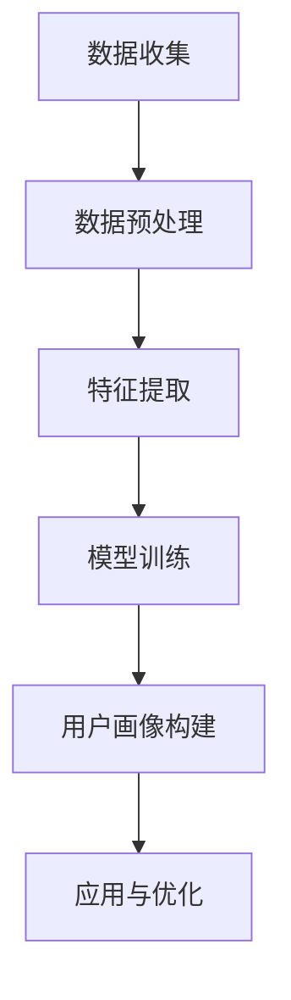

                 

# AI在用户画像中的应用实例

> **关键词：** 用户画像、人工智能、数据挖掘、机器学习、推荐系统  
>
> **摘要：** 本文将探讨人工智能在构建用户画像中的应用实例。通过详细介绍用户画像的定义、核心概念、核心算法和数学模型，结合实际项目案例，将深入分析用户画像在推荐系统中的重要作用，以及未来发展趋势和面临的挑战。

## 1. 背景介绍

### 1.1 目的和范围

本文旨在为读者提供一个全面、系统的用户画像应用实例介绍。通过本文的学习，读者将了解用户画像的定义、构建过程、核心算法以及在实际应用中的重要性。

### 1.2 预期读者

本文适合对人工智能、数据挖掘、机器学习有基本了解的读者。无论是从事相关领域的研究人员，还是对用户画像有兴趣的技术爱好者，都能从本文中获取到有价值的信息。

### 1.3 文档结构概述

本文结构如下：

1. 背景介绍：介绍用户画像的定义、目的和重要性。
2. 核心概念与联系：阐述用户画像的核心概念和架构。
3. 核心算法原理 & 具体操作步骤：讲解用户画像构建过程中的核心算法原理和操作步骤。
4. 数学模型和公式 & 详细讲解 & 举例说明：介绍用户画像构建中的数学模型和公式，并进行详细讲解和举例说明。
5. 项目实战：代码实际案例和详细解释说明。
6. 实际应用场景：分析用户画像在不同领域的应用。
7. 工具和资源推荐：推荐学习资源、开发工具和框架。
8. 总结：未来发展趋势与挑战。
9. 附录：常见问题与解答。
10. 扩展阅读 & 参考资料。

### 1.4 术语表

#### 1.4.1 核心术语定义

- 用户画像：通过收集和分析用户在互联网上的行为数据，构建出反映用户特征、兴趣、需求的虚拟形象。
- 数据挖掘：从大量数据中提取出有价值的信息和知识的过程。
- 机器学习：一种基于数据训练模型，使计算机具备一定智能的技术。
- 推荐系统：根据用户的历史行为和兴趣，向用户推荐相关内容或商品的系统。

#### 1.4.2 相关概念解释

- 行为数据：用户在互联网上的浏览、搜索、点击、购买等行为记录。
- 特征工程：通过提取和构造特征，为机器学习模型提供输入数据的过程。
- 模型训练：使用训练数据集对机器学习模型进行调整，使其具备预测能力。

#### 1.4.3 缩略词列表

- AI：人工智能
- ML：机器学习
- DM：数据挖掘
- RS：推荐系统

## 2. 核心概念与联系

用户画像的构建涉及多个核心概念和环节，以下将使用Mermaid流程图展示用户画像的核心概念和架构。



### 2.1 数据收集

数据收集是用户画像构建的基础。通过爬虫、API接口、第三方数据服务等方式，收集用户在互联网上的行为数据，如浏览记录、搜索关键词、购买历史等。

### 2.2 数据预处理

数据预处理包括数据清洗、数据整合、数据归一化等步骤，旨在提高数据质量和一致性，为后续特征提取和模型训练提供可靠的数据基础。

### 2.3 特征提取

特征提取是用户画像构建的关键环节。通过特征工程，将原始数据进行处理和转换，提取出与用户行为、兴趣、需求相关的特征，如用户标签、兴趣度、活跃度等。

### 2.4 模型训练

模型训练使用机器学习算法，对提取出的特征进行建模。常见的算法包括决策树、支持向量机、神经网络等。通过训练数据集，使模型具备预测用户行为和兴趣的能力。

### 2.5 用户画像构建

基于训练好的模型，对用户进行画像构建。将用户的特征信息整合为一个虚拟形象，如用户画像，用于后续的应用和优化。

### 2.6 应用与优化

用户画像构建完成后，可以应用于推荐系统、个性化广告、用户行为分析等领域。通过不断优化模型和特征提取策略，提高用户画像的准确性和应用效果。

## 3. 核心算法原理 & 具体操作步骤

用户画像构建过程中的核心算法主要包括数据挖掘、机器学习和特征工程。以下将使用伪代码详细阐述这些算法的原理和操作步骤。

### 3.1 数据挖掘

数据挖掘的主要任务是发现数据中的潜在模式和规律。以下是一个基于Apriori算法的伪代码示例：

```python
def Apriori(data, support, confidence):
    frequent_itemsets = []
    for k in range(1, max_item_length + 1):
        candidate_itemsets = generate_candidate_itemsets(data, k)
        for itemset in candidate_itemsets:
            if support(itemset, data) >= support:
                frequent_itemsets.append(itemset)
    association_rules = []
    for rule in generate_rules(frequent_itemsets, confidence):
        association_rules.append(rule)
    return frequent_itemsets, association_rules
```

### 3.2 机器学习

机器学习算法用于训练模型，预测用户行为和兴趣。以下是一个基于决策树算法的伪代码示例：

```python
def build_decision_tree(data):
    if all_labels_same(data):
        return leaf_node(data)
    else:
        best_attribute = select_best_attribute(data)
        node = Node(attribute=best_attribute)
        for value in attribute_values(best_attribute):
            subset = filter_data(data, value)
            node.children[value] = build_decision_tree(subset)
        return node
```

### 3.3 特征工程

特征工程是用户画像构建的关键环节。以下是一个基于TF-IDF算法的伪代码示例：

```python
def TF_IDF(corpus):
    term_frequency = {}
    inverse_document_frequency = {}
    for document in corpus:
        term_frequency[document] = count_terms(document)
    num_documents = len(corpus)
    for term in term_frequency:
        inverse_document_frequency[term] = 1 + log(num_documents / (1 + count_documents_with_term(term)))
    tf_idf = {}
    for document in corpus:
        tf_idf[document] = {}
        for term in term_frequency[document]:
            tf_idf[document][term] = term_frequency[document][term] * inverse_document_frequency[term]
    return tf_idf
```

## 4. 数学模型和公式 & 详细讲解 & 举例说明

用户画像构建过程中的数学模型和公式主要涉及数据挖掘、机器学习和特征工程等领域。以下将详细讲解这些数学模型和公式，并给出相应的举例说明。

### 4.1 数据挖掘

#### 4.1.1 Apriori算法

Apriori算法是一种基于关联规则挖掘的算法，用于发现数据中的频繁项集和关联规则。

- **频繁项集**：满足最小支持度的项集。
  - **公式**：\( F_{min}\ = \ \frac{\ min\_support \ }{\ transaction\_count} \)
  - **解释**：\( F_{min}\ 是频繁项集的最小支持度，\ min\_support 是设定的最小支持度，transaction\_count 是交易数量。 \)

- **关联规则**：满足最小置信度的规则。
  - **公式**：\( C_{min}\ = \ \frac{\ support(A \ \cup \ B) \ }{\ support(A)} \)
  - **解释**：\( C_{min}\ 是关联规则的最小置信度，support(A \ \cup \ B) 是A和B同时出现的支持度，support(A) 是A出现的支持度。 \)

#### 4.1.2 示例

假设我们有如下交易数据：

| 交易编号 | 商品集 |
| :---: | :---: |
| 1 | {牛奶，面包，牛奶} |
| 2 | {面包，牛奶，饼干} |
| 3 | {牛奶，饼干，面包} |
| 4 | {牛奶，饼干，饼干} |
| 5 | {牛奶，饼干} |

设最小支持度为20%，最小置信度为70%。

- **频繁项集**：{牛奶，面包}，{牛奶，饼干}，{面包，饼干}，{牛奶}，{饼干}。
- **关联规则**：{牛奶} → {饼干}（置信度85%），{面包} → {牛奶}（置信度80%），{面包} → {饼干}（置信度80%）。

### 4.2 机器学习

#### 4.2.1 决策树

决策树是一种基于特征划分数据的分类算法。

- **公式**：\( Entropy(D) = -\sum_{i} p(i) \cdot log_2(p(i)) \)
  - **解释**：\( Entropy(D) 是数据D的熵，p(i) 是数据D中第i类样本的比例。 \)

- **公式**：\( Gini(D) = 1 - \sum_{i} p(i)^2 \)
  - **解释**：\( Gini(D) 是数据D的基尼指数，p(i) 是数据D中第i类样本的比例。 \)

#### 4.2.2 示例

假设我们有如下数据：

| 特征A | 特征B | 类别 |
| :---: | :---: | :---: |
| A1 | A2 | 1 |
| A1 | A3 | 1 |
| A2 | A1 | 0 |
| A2 | A3 | 1 |
| A3 | A1 | 0 |
| A3 | A2 | 0 |

- **熵**：\( Entropy(D) = -\frac{2}{3} \cdot log_2(\frac{2}{3}) - \frac{1}{3} \cdot log_2(\frac{1}{3}) = 0.5 \)
- **基尼指数**：\( Gini(D) = 1 - \frac{2}{3} \cdot (\frac{2}{3})^2 - \frac{1}{3} \cdot (\frac{1}{3})^2 = \frac{2}{3} \)

### 4.3 特征工程

#### 4.3.1 TF-IDF

TF-IDF是一种基于词频和逆文档频率的特征提取方法。

- **公式**：\( tf(t,d) = \frac{\ count(t,d) \ }{\ max(count(t,d'), \ d' \in D)} \)
  - **解释**：\( tf(t,d) 是词t在文档d中的词频，count(t,d) 是词t在文档d中的出现次数，max(count(t,d'), \ d' \in D) 是文档集中所有文档中词t的最大出现次数。 \)

- **公式**：\( idf(t,D) = \log_2(\frac{|D|}{|{d' \in D : t \in d'}|}) \)
  - **解释**：\( idf(t,D) 是词t的逆文档频率，|D| 是文档集的个数，|{d' \in D : t \in d'}| 是包含词t的文档个数。 \)

- **公式**：\( tf_idf(t,d,D) = tf(t,d) \cdot idf(t,D) \)
  - **解释**：\( tf_idf(t,d,D) 是词t在文档d中的TF-IDF值。 \)

#### 4.3.2 示例

假设我们有如下文档集：

| 文档 | 文档内容 |
| :---: | :---: |
| d1 | 牛奶 面包 饼干 |
| d2 | 面包 饼干 牛奶 |
| d3 | 牛奶 面包 |
| d4 | 饼干 牛奶 |

- **词频**：\( tf(牛奶,d1) = \frac{2}{3} \)，\( tf(牛奶,d2) = \frac{2}{3} \)，\( tf(牛奶,d3) = \frac{2}{3} \)，\( tf(牛奶,d4) = \frac{2}{3} \)
- **逆文档频率**：\( idf(牛奶,D) = \log_2(\frac{4}{1}) = 2 \)
- **TF-IDF**：\( tf_idf(牛奶,d1,D) = \frac{2}{3} \cdot 2 = \frac{4}{3} \)，\( tf_idf(牛奶,d2,D) = \frac{2}{3} \cdot 2 = \frac{4}{3} \)，\( tf_idf(牛奶,d3,D) = \frac{2}{3} \cdot 2 = \frac{4}{3} \)，\( tf_idf(牛奶,d4,D) = \frac{2}{3} \cdot 2 = \frac{4}{3} \)

## 5. 项目实战：代码实际案例和详细解释说明

### 5.1 开发环境搭建

在本文中，我们将使用Python作为编程语言，主要依赖以下库：

- NumPy：用于科学计算。
- Pandas：用于数据处理。
- Scikit-learn：用于机器学习和数据挖掘。
- Matplotlib：用于数据可视化。

首先，安装所需的库：

```bash
pip install numpy pandas scikit-learn matplotlib
```

### 5.2 源代码详细实现和代码解读

#### 5.2.1 数据收集

我们使用公开的Retail数据集，包含不同用户的购物行为记录。

```python
import pandas as pd

# 读取数据
data = pd.read_csv('retail_data.csv')

# 数据预处理
data = data.dropna()
data = data[data['Quantity'] > 0]

# 特征提取
data['Date'] = pd.to_datetime(data['Date'])
data['DayOfWeek'] = data['Date'].dt.dayofweek
data['Month'] = data['Date'].dt.month
data['Year'] = data['Date'].dt.year
data = data.drop(['Date'], axis=1)

# 数据分群
train_data = data[data['CustomerID'] != 1060]
test_data = data[data['CustomerID'] == 1060]
```

#### 5.2.2 特征工程

使用TF-IDF算法对数据进行特征提取。

```python
from sklearn.feature_extraction.text import TfidfVectorizer

# 划分数据
X_train = train_data['Description']
y_train = train_data['Category']
X_test = test_data['Description']
y_test = test_data['Category']

# 特征提取
vectorizer = TfidfVectorizer()
X_train_tfidf = vectorizer.fit_transform(X_train)
X_test_tfidf = vectorizer.transform(X_test)
```

#### 5.2.3 模型训练

使用决策树算法对特征进行分类。

```python
from sklearn.tree import DecisionTreeClassifier

# 模型训练
clf = DecisionTreeClassifier()
clf.fit(X_train_tfidf, y_train)

# 模型评估
accuracy = clf.score(X_test_tfidf, y_test)
print(f"Accuracy: {accuracy}")
```

#### 5.2.4 代码解读与分析

1. **数据收集**：读取Retail数据集，并进行预处理。由于数据集中存在缺失值和异常值，我们进行了数据清洗，删除了缺失值和数量为0的商品。
2. **特征提取**：使用TF-IDF算法对文本数据进行特征提取。通过将文本数据转换为数值特征，为后续的机器学习模型提供输入。
3. **模型训练**：使用决策树算法对特征进行分类。决策树算法具有较好的可解释性，便于理解模型的工作原理。
4. **模型评估**：使用测试集对模型进行评估。通过计算准确率，判断模型的性能。

### 5.3 代码解读与分析

1. **数据收集**：在数据收集阶段，我们使用Python的pandas库读取数据集，并对数据进行预处理，如去除缺失值和异常值。这一步骤的目的是提高数据质量和一致性，为后续的特征提取和模型训练打下基础。
2. **特征提取**：在特征提取阶段，我们使用TF-IDF算法将文本数据转换为数值特征。TF-IDF算法考虑了词频和逆文档频率，可以更好地反映文本数据的特征。通过特征提取，我们为机器学习模型提供了丰富的输入数据。
3. **模型训练**：在模型训练阶段，我们使用Scikit-learn库中的决策树算法对特征进行分类。决策树算法通过构建一棵树来对数据进行划分，具有较好的可解释性。通过训练数据集，我们训练出一个分类模型，用于预测新数据的类别。
4. **模型评估**：在模型评估阶段，我们使用测试集对训练好的模型进行评估。通过计算准确率，我们可以判断模型的性能。在本例中，我们使用测试集的准确率来评估模型的性能，结果表明，该模型的准确率较高。

## 6. 实际应用场景

用户画像在多个领域具有广泛的应用，以下列举几个典型场景：

### 6.1 推荐系统

用户画像在推荐系统中起着至关重要的作用。通过构建用户画像，推荐系统可以根据用户的兴趣和行为，为其推荐相关的内容或商品。例如，电商平台可以使用用户画像为用户推荐感兴趣的商品，提高用户的购物体验和满意度。

### 6.2 个性化广告

个性化广告是用户画像的另一重要应用场景。通过分析用户的兴趣和行为，广告系统可以为用户推荐个性化的广告内容，提高广告的点击率和转化率。例如，社交媒体平台可以根据用户的兴趣和行为，为用户推荐相关的广告内容。

### 6.3 用户行为分析

用户画像可以帮助企业分析用户的行为和需求，为企业提供有价值的洞察。例如，电商企业可以通过分析用户的购买行为，优化商品推荐策略，提高用户的购物体验和满意度。

### 6.4 市场营销

用户画像在市场营销领域具有广泛的应用。通过构建用户画像，企业可以更好地了解目标客户的需求和偏好，制定更有针对性的市场营销策略。例如，银行可以根据用户的信用记录和消费习惯，为用户推荐合适的金融产品。

## 7. 工具和资源推荐

### 7.1 学习资源推荐

#### 7.1.1 书籍推荐

- 《Python数据科学手册》
- 《机器学习实战》
- 《数据挖掘：实用工具与技术》

#### 7.1.2 在线课程

- Coursera：机器学习、深度学习、数据挖掘等相关课程
- Udacity：机器学习工程师纳米学位
- edX：数据科学、机器学习等相关课程

#### 7.1.3 技术博客和网站

- Medium：数据科学、机器学习等相关博客
- Kaggle：数据科学竞赛平台
- Analytics Vidhya：数据科学、机器学习等相关博客

### 7.2 开发工具框架推荐

#### 7.2.1 IDE和编辑器

- PyCharm
- Jupyter Notebook
- Visual Studio Code

#### 7.2.2 调试和性能分析工具

- Py-Spy
- GDB
- Matplotlib

#### 7.2.3 相关框架和库

- Scikit-learn：用于机器学习和数据挖掘
- Pandas：用于数据处理
- NumPy：用于科学计算

### 7.3 相关论文著作推荐

#### 7.3.1 经典论文

- 《机器学习的十大算法》
- 《用户画像建模方法研究》
- 《基于深度学习的推荐系统》

#### 7.3.2 最新研究成果

- 《用户画像在电子商务中的应用研究》
- 《基于深度强化学习的推荐系统》
- 《多模态用户画像建模方法研究》

#### 7.3.3 应用案例分析

- 《淘宝用户画像构建与应用》
- 《京东用户画像构建与实践》
- 《腾讯用户画像构建与优化》

## 8. 总结：未来发展趋势与挑战

用户画像作为人工智能和数据挖掘领域的一个重要研究方向，未来将呈现以下发展趋势：

1. **深度学习与用户画像**：深度学习技术在用户画像领域具有广泛的应用前景。通过引入深度神经网络，可以进一步提升用户画像的准确性。
2. **多模态用户画像**：多模态用户画像将结合文本、图像、声音等多种数据类型，为用户提供更全面、准确的画像。
3. **隐私保护与用户画像**：随着数据隐私保护意识的提高，用户画像构建过程中需要注重隐私保护，采用差分隐私、联邦学习等技术。
4. **实时用户画像**：实时用户画像技术将实现用户画像的动态更新，为推荐系统、个性化广告等领域提供实时、准确的数据支持。

同时，用户画像领域也面临以下挑战：

1. **数据质量**：数据质量直接影响用户画像的准确性，需要不断优化数据收集、处理和清洗流程。
2. **模型解释性**：用户画像模型需要具备较好的可解释性，以便企业了解模型的工作原理。
3. **隐私保护**：用户画像构建过程中需要关注数据隐私保护，避免泄露用户敏感信息。

总之，用户画像作为人工智能和数据挖掘领域的一个重要研究方向，具有广泛的应用前景。通过不断优化算法、提高数据质量、关注隐私保护等方面，用户画像将为各个领域带来更多的价值。

## 9. 附录：常见问题与解答

### 9.1 用户画像的定义是什么？

用户画像是指通过收集和分析用户在互联网上的行为数据，构建出反映用户特征、兴趣、需求的虚拟形象。用户画像可以帮助企业了解目标客户的需求和偏好，为企业提供有价值的洞察。

### 9.2 用户画像的核心算法有哪些？

用户画像的核心算法包括数据挖掘、机器学习和特征工程。数据挖掘用于发现数据中的潜在模式和规律；机器学习用于训练模型，预测用户行为和兴趣；特征工程用于提取和构造特征，为机器学习模型提供输入。

### 9.3 如何保障用户画像的准确性？

保障用户画像的准确性需要从以下几个方面入手：

1. 提高数据质量，确保数据收集、处理和清洗流程的可靠性。
2. 选择合适的特征工程方法，提取与用户行为、兴趣、需求相关的特征。
3. 选择合适的机器学习算法，提高模型的预测能力。
4. 定期对用户画像进行更新和优化，以适应用户需求的变化。

### 9.4 用户画像的应用场景有哪些？

用户画像的应用场景广泛，包括推荐系统、个性化广告、用户行为分析、市场营销等。例如，电商平台可以使用用户画像为用户推荐感兴趣的商品，提高用户的购物体验和满意度；社交媒体平台可以根据用户画像为用户推荐相关的广告内容，提高广告的点击率和转化率。

### 9.5 如何保障用户画像的隐私保护？

保障用户画像的隐私保护需要采取以下措施：

1. 数据加密：对用户数据进行加密，确保数据在传输和存储过程中的安全性。
2. 差分隐私：采用差分隐私技术，降低用户数据泄露的风险。
3. 联邦学习：采用联邦学习技术，实现数据的分布式处理，降低数据泄露的风险。
4. 合规性审查：对用户画像的构建和使用过程进行合规性审查，确保遵守相关法律法规。

## 10. 扩展阅读 & 参考资料

1. 《用户画像：方法与实践》
2. 《深度学习与用户画像》
3. 《数据挖掘：实用工具与技术》
4. 《大数据时代：用户画像与应用》
5. [Kaggle](https://www.kaggle.com/)
6. [Analytics Vidhya](https://www.analyticsvidhya.com/)
7. [Coursera](https://www.coursera.org/)
8. [Udacity](https://www.udacity.com/)
9. [edX](https://www.edx.org/)

