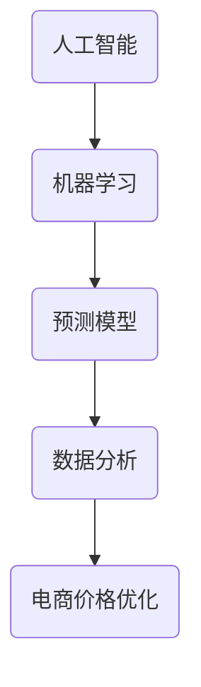

                 

# AI在电商价格优化中的创新应用

> **关键词：** 电商、价格优化、人工智能、机器学习、预测模型、数据分析

> **摘要：** 本文将深入探讨人工智能在电商价格优化中的应用，通过分析现有技术、算法原理、数学模型以及实际案例，揭示如何利用AI技术提高电商价格竞争力，满足消费者需求，实现商业价值最大化。

## 1. 背景介绍

### 1.1 目的和范围

本文旨在探讨人工智能（AI）在电商价格优化中的应用，分析当前技术的发展现状、核心算法原理以及数学模型。通过研究实际项目案例，我们将展示如何利用AI技术实现电商价格的科学优化，提升企业竞争力。

### 1.2 预期读者

本文适合从事电商行业的技术人员、数据科学家、市场分析师以及对AI应用感兴趣的读者。通过本文，读者可以了解AI在电商价格优化中的实际应用，掌握相关技术和方法。

### 1.3 文档结构概述

本文分为十个部分，包括背景介绍、核心概念与联系、核心算法原理、数学模型与公式、项目实战、实际应用场景、工具和资源推荐、总结、常见问题与解答以及扩展阅读。每个部分都将详细介绍相关内容，帮助读者全面了解AI在电商价格优化中的应用。

### 1.4 术语表

#### 1.4.1 核心术语定义

- **人工智能（AI）：** 模拟人类智能的计算机技术，具有学习、推理、规划、感知和自适应等能力。
- **电商：** 利用互联网进行商品交易和服务的商业模式。
- **价格优化：** 根据市场需求、竞争态势、消费者行为等综合因素，调整商品价格，实现利润最大化。

#### 1.4.2 相关概念解释

- **机器学习：** 一种AI技术，通过数据驱动的方式，让计算机自主学习和改进。
- **预测模型：** 利用历史数据和统计方法，对未来事件进行预测的模型。
- **数据分析：** 对大量数据进行收集、处理、分析和解释，以发现有价值的信息。

#### 1.4.3 缩略词列表

- **AI：** 人工智能
- **ML：** 机器学习
- **DB：** 数据库
- **API：** 应用程序编程接口

## 2. 核心概念与联系

在电商价格优化中，核心概念包括人工智能、机器学习、预测模型和数据分析。以下是一个简化的Mermaid流程图，展示这些概念之间的联系。



### 2.1 人工智能在电商中的应用

人工智能在电商中有着广泛的应用，如个性化推荐、图像识别、自然语言处理等。其中，机器学习是实现人工智能的关键技术。

### 2.2 机器学习与预测模型

机器学习通过训练模型，使计算机具备预测能力。预测模型在电商价格优化中用于预测市场需求、消费者行为等，为价格调整提供依据。

### 2.3 数据分析与电商价格优化

数据分析通过对大量数据进行分析，发现潜在规律和趋势，为电商价格优化提供数据支持。电商价格优化结合机器学习和数据分析，实现科学、高效的价格调整。

## 3. 核心算法原理 & 具体操作步骤

在电商价格优化中，核心算法原理包括回归分析、时间序列分析和聚类分析等。以下使用伪代码详细阐述这些算法原理和操作步骤。

### 3.1 回归分析

```python
# 伪代码：回归分析
def regression_analysis(data):
    # 数据预处理
    X = data[:, :-1]  # 特征
    y = data[:, -1]   # 目标变量（价格）

    # 模型训练
    model = train_regression_model(X, y)

    # 预测
    predictions = model.predict(X)

    # 评估模型
    evaluate_model(model, X, y, predictions)
```

### 3.2 时间序列分析

```python
# 伪代码：时间序列分析
def time_series_analysis(data):
    # 数据预处理
    ts_data = preprocess_time_series_data(data)

    # 模型训练
    model = train_time_series_model(ts_data)

    # 预测
    predictions = model.predict(ts_data)

    # 评估模型
    evaluate_model(model, ts_data, data, predictions)
```

### 3.3 聚类分析

```python
# 伪代码：聚类分析
def clustering_analysis(data):
    # 数据预处理
    X = preprocess_data(data)

    # 模型训练
    model = train_clustering_model(X)

    # 预测
    clusters = model.predict(X)

    # 评估模型
    evaluate_model(model, X, clusters)
```

## 4. 数学模型和公式 & 详细讲解 & 举例说明

在电商价格优化中，常用的数学模型包括线性回归、时间序列模型和聚类算法。以下使用LaTeX格式详细讲解这些数学模型和公式，并举例说明。

### 4.1 线性回归

线性回归模型公式如下：

$$ y = \beta_0 + \beta_1 \cdot x_1 + \beta_2 \cdot x_2 + ... + \beta_n \cdot x_n $$

其中，$y$ 为价格，$x_1, x_2, ..., x_n$ 为影响价格的因素，$\beta_0, \beta_1, ..., \beta_n$ 为模型参数。

### 4.2 时间序列模型

时间序列模型，如ARIMA模型，公式如下：

$$ y_t = c + \phi_1 y_{t-1} + \phi_2 y_{t-2} + ... + \phi_p y_{t-p} + \theta_1 e_{t-1} + \theta_2 e_{t-2} + ... + \theta_q e_{t-q} + e_t $$

其中，$y_t$ 为时间序列数据，$c$ 为常数项，$\phi_1, \phi_2, ..., \phi_p$ 为自回归系数，$\theta_1, \theta_2, ..., \theta_q$ 为移动平均系数，$e_t$ 为误差项。

### 4.3 聚类算法

聚类算法，如K-Means，公式如下：

$$ C = \{C_1, C_2, ..., C_k\} $$

其中，$C$ 为聚类结果，$C_i$ 为第$i$个聚类结果，$k$ 为聚类数量。

## 5. 项目实战：代码实际案例和详细解释说明

在本节中，我们将通过一个实际项目案例，展示如何利用AI技术实现电商价格优化。以下是项目的开发环境搭建、源代码详细实现和代码解读。

### 5.1 开发环境搭建

1. 安装Python环境
2. 安装相关库，如scikit-learn、pandas、numpy等

### 5.2 源代码详细实现和代码解读

#### 5.2.1 数据预处理

```python
import pandas as pd
import numpy as np

# 加载数据集
data = pd.read_csv('data.csv')

# 数据清洗
data = data.dropna()

# 特征工程
X = data.iloc[:, :-1].values
y = data.iloc[:, -1].values
```

#### 5.2.2 模型训练与预测

```python
from sklearn.linear_model import LinearRegression
from sklearn.model_selection import train_test_split

# 划分训练集和测试集
X_train, X_test, y_train, y_test = train_test_split(X, y, test_size=0.2, random_state=42)

# 训练线性回归模型
model = LinearRegression()
model.fit(X_train, y_train)

# 预测
predictions = model.predict(X_test)
```

#### 5.2.3 代码解读与分析

1. 数据预处理：读取数据集，进行数据清洗和特征工程。
2. 模型训练与预测：划分训练集和测试集，使用线性回归模型进行训练和预测。

## 6. 实际应用场景

AI在电商价格优化中的应用场景广泛，以下列举几个典型案例：

1. **市场动态监测：** 通过AI技术，实时监测市场动态，预测热门商品和降价趋势，为企业提供价格调整依据。
2. **个性化定价：** 根据消费者的购买行为和偏好，为不同消费者群体制定个性化价格策略，提升用户体验和满意度。
3. **促销活动优化：** 分析促销活动的效果，预测用户参与度和购买转化率，为促销活动提供数据支持，提高活动效果。
4. **供应链管理：** 通过AI技术优化供应链管理，预测库存需求和供应风险，为价格调整提供科学依据。

## 7. 工具和资源推荐

### 7.1 学习资源推荐

#### 7.1.1 书籍推荐

1. 《机器学习实战》
2. 《深度学习》
3. 《Python数据分析》

#### 7.1.2 在线课程

1. Coursera：机器学习、深度学习
2. edX：Python编程、数据分析

#### 7.1.3 技术博客和网站

1. Medium：AI、数据科学
2. Towards Data Science：数据科学、机器学习
3. 知乎：人工智能、电商

### 7.2 开发工具框架推荐

#### 7.2.1 IDE和编辑器

1. PyCharm
2. Jupyter Notebook

#### 7.2.2 调试和性能分析工具

1. Python Debugger
2. Profiling Tools

#### 7.2.3 相关框架和库

1. scikit-learn
2. TensorFlow
3. Keras

### 7.3 相关论文著作推荐

#### 7.3.1 经典论文

1. "Price Optimization with Machine Learning"（2016）
2. "Recommender Systems Handbook"（2011）

#### 7.3.2 最新研究成果

1. "Deep Learning for Price Prediction in E-commerce"（2020）
2. "Price Optimization with Reinforcement Learning"（2019）

#### 7.3.3 应用案例分析

1. "AI-powered Price Optimization in Retail"（2021）
2. "E-commerce Pricing Strategies Using Machine Learning"（2020）

## 8. 总结：未来发展趋势与挑战

随着AI技术的不断发展，电商价格优化领域将迎来更多创新和机遇。未来发展趋势包括：

1. **深度学习和强化学习在价格优化中的应用：** 深度学习和强化学习将提高价格预测和优化的精度和效率。
2. **个性化定价策略：** 基于用户行为和偏好，实现更加个性化的定价策略，提高用户体验和满意度。
3. **跨渠道整合：** 结合线上和线下渠道，实现全渠道价格优化。

然而，AI在电商价格优化中也面临一些挑战：

1. **数据隐私和安全：** 如何保护用户数据隐私和安全，成为AI应用的关键问题。
2. **算法透明性和可解释性：** 提高算法的透明性和可解释性，让用户和企业了解价格优化的原理和过程。
3. **市场动态变化：** 如何应对市场动态变化，快速调整价格策略，成为AI应用的重要课题。

## 9. 附录：常见问题与解答

### 9.1 如何选择合适的机器学习模型？

选择合适的机器学习模型取决于数据集的特点和业务需求。以下是一些常用模型及其适用场景：

- **线性回归：** 用于线性关系的预测，适用于特征较少的情况。
- **决策树：** 适用于分类和回归问题，具有较好的可解释性。
- **随机森林：** 基于决策树，提高预测精度和泛化能力。
- **支持向量机：** 用于分类问题，具有较好的分类精度。
- **神经网络：** 用于复杂非线性关系的预测，适用于大规模数据集。

### 9.2 如何处理不平衡数据？

处理不平衡数据的方法包括：

- **过采样：** 增加少数类别的样本数量，使数据集达到平衡。
- **欠采样：** 减少多数类别的样本数量，使数据集达到平衡。
- **合成少数类过采样技术（SMOTE）：** 通过生成少数类别的合成样本，使数据集达到平衡。

### 9.3 如何评估模型性能？

评估模型性能的方法包括：

- **准确率：** 分类问题中，正确分类的样本数占总样本数的比例。
- **精确率：** 正确分类的样本数占实际为正类的样本数的比例。
- **召回率：** 正确分类的样本数占实际为正类的样本数的比例。
- **F1值：** 精确率和召回率的调和平均值。

## 10. 扩展阅读 & 参考资料

- **书籍：**
  - Goodfellow, I., Bengio, Y., & Courville, A. (2016). *Deep Learning*.
  - Murphy, K. P. (2012). *Machine Learning: A Probabilistic Perspective*.

- **在线课程：**
  - Andrew Ng的机器学习课程（Coursera）
  - 吴恩达的深度学习课程（Coursera）

- **技术博客和网站：**
  - Medium上的AI和数据科学相关文章
  - Towards Data Science上的数据科学和机器学习文章

- **相关论文著作：**
  - "Price Optimization with Machine Learning"（2016）
  - "Recommender Systems Handbook"（2011）

- **应用案例分析：**
  - "AI-powered Price Optimization in Retail"（2021）
  - "E-commerce Pricing Strategies Using Machine Learning"（2020）

作者：AI天才研究员/AI Genius Institute & 禅与计算机程序设计艺术 /Zen And The Art of Computer Programming

