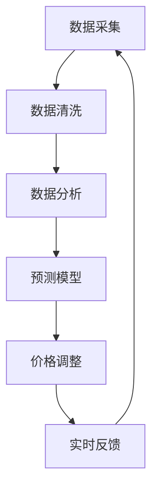

                 

### 1. 背景介绍

#### 1.1 目的和范围

在电子商务领域，动态定价策略已经逐渐成为提高市场竞争力和利润的关键手段。随着大数据技术和人工智能算法的不断发展，动态定价策略也日益复杂和智能化。本文旨在深入探讨AI在电商动态定价中的实际应用，分析其核心原理、算法模型以及具体操作步骤，并通过实际案例展示其在商业场景中的成效。

本文将围绕以下几个核心问题展开讨论：

1. **动态定价的定义和基本原理**
2. **AI技术在动态定价中的应用场景**
3. **核心算法原理及具体操作步骤**
4. **数学模型和公式的应用**
5. **实际应用场景中的成功案例**
6. **相关工具和资源的推荐**

通过本文的深入探讨，希望能够为电商行业的技术人员和决策者提供有价值的参考，助力其在激烈的市场竞争中实现更高的效率和利润。

#### 1.2 预期读者

本文的目标读者主要包括以下几类：

1. **电商行业的技术人员**：对电商业务流程和动态定价策略有基础了解，希望深入探讨AI技术在电商动态定价中的应用。
2. **数据科学和人工智能领域的专家**：对动态定价和AI算法有一定了解，希望了解其在电商场景中的具体应用和实践。
3. **企业管理者和决策者**：对电商业务和动态定价策略有较深的理解，希望通过本文了解AI技术在提升企业竞争力方面的潜力。

本文要求读者具备以下基础知识和技能：

- **电商业务基本概念**：了解电商业务的基本流程和常见问题。
- **数据分析和处理**：掌握基本的数据处理和分析方法。
- **人工智能基础知识**：了解基本的机器学习算法和原理。
- **编程能力**：具备一定的编程基础，能够理解伪代码和数学公式。

通过本文的学习，读者可以：

- 深入理解动态定价的基本概念和原理。
- 熟悉AI技术在动态定价中的应用和实现。
- 掌握核心算法和数学模型的实际应用。
- 了解电商动态定价在实际场景中的成功案例。

#### 1.3 文档结构概述

本文结构如下：

1. **背景介绍**：介绍本文的目的、预期读者以及文档结构。
2. **核心概念与联系**：详细阐述动态定价和AI技术的核心概念，并通过Mermaid流程图展示其联系。
3. **核心算法原理 & 具体操作步骤**：分析动态定价中的核心算法，使用伪代码详细阐述其原理和操作步骤。
4. **数学模型和公式 & 详细讲解 & 举例说明**：介绍动态定价中的数学模型和公式，并通过实例进行详细讲解。
5. **项目实战：代码实际案例和详细解释说明**：通过实际案例展示动态定价算法在电商中的应用。
6. **实际应用场景**：分析AI在电商动态定价中的实际应用场景。
7. **工具和资源推荐**：推荐相关学习资源、开发工具和框架。
8. **总结：未来发展趋势与挑战**：总结本文的主要内容，探讨未来发展趋势和面临的挑战。
9. **附录：常见问题与解答**：解答读者可能遇到的常见问题。
10. **扩展阅读 & 参考资料**：提供更多的扩展阅读资源。

通过本文的详细探讨，希望能够帮助读者全面了解AI在电商动态定价中的实际应用，为实践中的问题和挑战提供解决方案。

#### 1.4 术语表

在本篇文章中，我们将使用一些专业术语，为了确保读者能够顺利理解，下面将对这些术语进行详细解释。

##### 1.4.1 核心术语定义

1. **动态定价**：动态定价是指根据市场需求、库存量、竞争对手价格等多种因素，实时调整商品价格的一种策略。其核心目的是最大化利润和市场份额。
2. **机器学习**：机器学习是人工智能的一个分支，通过数据和算法，使计算机能够自动地改善和优化性能。
3. **深度学习**：深度学习是机器学习的一种，利用多层神经网络对数据进行学习和预测。
4. **回归分析**：回归分析是一种预测性建模技术，通过分析变量之间的关系，建立数学模型来预测目标变量的值。
5. **协同过滤**：协同过滤是一种基于用户行为数据的推荐算法，通过分析用户的共同行为来预测用户对某项商品的偏好。

##### 1.4.2 相关概念解释

1. **市场需求曲线**：市场需求曲线描述了商品价格与市场需求量之间的关系。通常情况下，商品价格下降会导致需求量增加，而价格上升则会导致需求量减少。
2. **库存管理**：库存管理是指对商品库存的监控和调整，以确保在市场需求高峰期能够满足消费者的购买需求，同时在市场需求低峰期减少库存成本。
3. **价格弹性**：价格弹性是指商品价格变化对需求量变化的影响程度。高价格弹性表示价格变化对需求量有较大影响，而低价格弹性则表示价格变化对需求量影响较小。

##### 1.4.3 缩略词列表

1. **AI**：人工智能（Artificial Intelligence）
2. **ML**：机器学习（Machine Learning）
3. **DL**：深度学习（Deep Learning）
4. **PCA**：主成分分析（Principal Component Analysis）
5. **SVD**：奇异值分解（Singular Value Decomposition）
6. **CART**：分类与回归树（Classification and Regression Trees）
7. **GBDT**：梯度提升决策树（Gradient Boosting Decision Trees）

通过上述术语的解释，读者可以对文章中的专业术语有更深入的理解，从而更好地跟随文章的思路，掌握动态定价和AI技术的核心概念和应用。

## 2. 核心概念与联系

在探讨AI在电商动态定价中的应用之前，我们需要先了解核心概念和它们之间的联系。以下内容将详细介绍动态定价、AI技术以及它们在电商场景中的具体应用。

### 2.1 动态定价的概念与原理

动态定价是一种基于市场需求、库存量、竞争对手价格等多种因素，实时调整商品价格以实现利润最大化的策略。其基本原理可以概括为以下几点：

1. **市场需求曲线**：市场需求曲线描述了商品价格与市场需求量之间的关系。根据市场需求曲线，商品价格下降通常会导致需求量增加，而价格上升则会导致需求量减少。
2. **价格弹性**：价格弹性反映了商品价格变化对需求量变化的影响程度。对于高价格弹性的商品，价格的小幅度调整可能导致需求量的显著变化，而对于低价格弹性的商品，价格变化对需求量的影响相对较小。
3. **竞争环境**：竞争对手的价格策略也会影响动态定价的决策。通常情况下，企业会通过分析竞争对手的价格变化，调整自己的价格以保持竞争力。

动态定价的核心目的是通过实时调整价格，最大化企业的利润和市场份额。在实际操作中，动态定价通常基于历史数据、市场动态和实时反馈进行计算和预测。

### 2.2 AI技术的基本原理与应用

AI技术，特别是机器学习和深度学习，为动态定价提供了强大的工具和手段。以下简要介绍AI技术的基本原理和应用：

1. **机器学习**：机器学习是一种通过数据和算法，使计算机能够自动学习和优化性能的技术。在动态定价中，机器学习可以用于数据分析和预测，例如通过分析历史销售数据，预测未来的市场需求和价格变化。
   
2. **深度学习**：深度学习是机器学习的一种，通过多层神经网络对大量数据进行分析和预测。在动态定价中，深度学习可以用于构建复杂的预测模型，例如通过卷积神经网络（CNN）分析图像数据，预测商品的潜在市场需求。

3. **回归分析**：回归分析是一种预测性建模技术，通过分析变量之间的关系，建立数学模型来预测目标变量的值。在动态定价中，回归分析可以用于建立市场需求曲线和价格弹性模型。

4. **协同过滤**：协同过滤是一种基于用户行为数据的推荐算法，通过分析用户的共同行为来预测用户对某项商品的偏好。在动态定价中，协同过滤可以用于分析消费者的购买行为和偏好，从而调整商品价格以吸引更多消费者。

### 2.3 动态定价与AI技术的联系

动态定价和AI技术之间的联系主要体现在以下几个方面：

1. **数据采集和处理**：动态定价需要大量的市场数据，如历史销售数据、库存数据、竞争对手价格等。AI技术可以用于数据的采集、处理和分析，从而提供更准确的市场预测和定价策略。

2. **预测模型构建**：AI技术可以用于构建复杂的预测模型，如市场需求曲线、价格弹性模型等。这些模型可以基于历史数据和实时数据，为动态定价提供可靠的依据。

3. **实时调整**：AI技术可以实时分析市场动态和消费者行为，从而动态调整商品价格。例如，通过深度学习算法，可以实时分析用户的浏览和购买行为，预测用户的购买意愿，并据此调整商品价格。

4. **优化策略**：AI技术可以帮助企业优化定价策略，提高利润和市场竞争力。通过分析大量数据，AI技术可以找出最优的价格调整策略，从而最大化企业的利润。

### 2.4 Mermaid流程图

为了更直观地展示动态定价与AI技术的联系，我们使用Mermaid流程图来描述其基本架构和流程。以下是一个简化的Mermaid流程图：



- **数据采集**：从各种渠道获取市场数据，如历史销售数据、库存数据、竞争对手价格等。
- **数据清洗**：对采集到的数据进行清洗和处理，去除噪声和异常值。
- **数据分析**：利用机器学习和深度学习算法对清洗后的数据进行分析，构建预测模型。
- **预测模型**：基于数据分析结果，构建市场需求曲线和价格弹性模型等。
- **价格调整**：根据预测模型和市场动态，实时调整商品价格。
- **实时反馈**：对价格调整的效果进行实时监测和反馈，优化定价策略。

通过上述流程，我们可以看到动态定价与AI技术之间的紧密联系。AI技术为动态定价提供了强大的数据分析和预测能力，而动态定价则通过实时调整商品价格，实现了利润最大化和市场竞争力提升。

### 2.5 动态定价与AI技术的实际应用案例

为了更深入地理解动态定价与AI技术的应用，我们来看几个实际案例。

1. **案例一：亚马逊的动态定价策略**

亚马逊作为全球领先的电商平台，其动态定价策略备受关注。亚马逊利用机器学习和深度学习算法，对海量销售数据进行实时分析，预测市场需求和竞争对手的价格变化。根据这些预测，亚马逊可以动态调整商品价格，以最大化利润。例如，在节假日和促销期间，亚马逊会根据历史销售数据和市场需求，提前调整价格，以吸引更多消费者。

2. **案例二：阿里巴巴的智能定价系统**

阿里巴巴旗下的淘宝和天猫平台，也采用了智能定价系统。该系统利用机器学习算法，对用户行为数据进行分析，预测用户的购买意图。根据这些预测，平台可以实时调整商品价格，提高用户购买意愿和转化率。例如，在用户浏览某一商品时，系统会根据用户的浏览历史和购买记录，预测其购买意愿，并动态调整价格，以促成交易。

3. **案例三：京东的库存优化与动态定价**

京东在库存管理和动态定价方面也有着丰富的实践经验。通过AI技术，京东可以对海量库存数据进行分析，预测商品的销售趋势和库存水平。根据这些预测，京东可以动态调整库存策略和商品价格，避免库存积压和过剩。例如，在季节性商品的销售高峰期，京东会根据历史数据和市场需求，提前调整库存和价格，确保商品供应充足，提高用户满意度。

通过这些实际案例，我们可以看到动态定价与AI技术在电商领域的广泛应用。利用AI技术，电商平台可以更精准地预测市场需求，实时调整商品价格，从而提高市场竞争力和利润。

## 3. 核心算法原理 & 具体操作步骤

在动态定价策略中，核心算法起到了关键作用，它们能够基于历史数据和实时信息，自动调整商品价格以实现利润最大化。以下将详细阐述动态定价中的核心算法原理和具体操作步骤。

### 3.1 回归分析算法原理

回归分析是一种常见的统计方法，用于分析变量之间的依赖关系。在动态定价中，回归分析主要用于建立市场需求曲线和价格弹性模型。

1. **线性回归**：线性回归模型可以表示为：
   $$
   y = \beta_0 + \beta_1x + \epsilon
   $$
   其中，$y$ 表示市场需求量，$x$ 表示商品价格，$\beta_0$ 和 $\beta_1$ 分别为模型的截距和斜率，$\epsilon$ 为随机误差。

2. **多元回归**：多元回归模型可以表示为：
   $$
   y = \beta_0 + \beta_1x_1 + \beta_2x_2 + ... + \beta_nx_n + \epsilon
   $$
   其中，$x_1, x_2, ..., x_n$ 为多个自变量，如竞争对手价格、库存水平等。

### 3.2 市场需求曲线建模步骤

市场需求曲线是动态定价的核心，以下为建立市场需求曲线的具体步骤：

1. **数据采集**：收集历史销售数据，包括商品价格、市场需求量、竞争对手价格等。

2. **数据预处理**：对采集到的数据进行分析，去除异常值和噪声，确保数据的质量。

3. **模型选择**：根据数据特征，选择合适的回归模型。通常情况下，可以使用线性回归或多元回归模型。

4. **模型训练**：利用历史数据对模型进行训练，计算出模型的参数，如截距和斜率。

5. **模型评估**：通过交叉验证等方法，评估模型的预测性能，确保其准确性。

6. **模型应用**：将训练好的模型应用于实际场景，根据市场需求曲线，实时调整商品价格。

### 3.3 价格弹性模型原理

价格弹性反映了商品价格变化对需求量变化的影响程度。以下为建立价格弹性模型的具体步骤：

1. **弹性系数计算**：利用回归分析，计算商品的价格弹性系数。弹性系数可以表示为：
   $$
   \epsilon = \frac{\partial Q}{\partial P} \cdot \frac{P}{Q}
   $$
   其中，$Q$ 为市场需求量，$P$ 为商品价格。

2. **弹性分析**：根据弹性系数，分析商品的价格弹性。如果弹性系数大于1，表示商品为高价格弹性商品，价格变化对需求量有较大影响；如果弹性系数小于1，表示商品为低价格弹性商品，价格变化对需求量影响较小。

### 3.4 动态定价算法原理

动态定价算法基于市场需求曲线和价格弹性模型，实时调整商品价格，以最大化利润。以下为动态定价算法的基本原理：

1. **目标函数**：动态定价算法的目标是最大化企业的利润。利润可以表示为：
   $$
   \Pi = P \cdot Q - C
   $$
   其中，$P$ 为商品价格，$Q$ 为市场需求量，$C$ 为成本。

2. **定价策略**：根据市场需求曲线和价格弹性模型，动态定价算法可以调整商品价格。具体策略如下：

   - **高价格弹性商品**：对于高价格弹性商品，动态定价算法可以采取价格下降策略，以吸引更多消费者，提高市场需求量。
   - **低价格弹性商品**：对于低价格弹性商品，动态定价算法可以采取价格上升策略，以提高利润。
   - **竞争对手价格**：根据竞争对手的价格变化，动态定价算法可以调整自己的价格，以保持竞争力。

3. **实时调整**：动态定价算法需要实时分析市场动态和消费者行为，根据需求曲线和价格弹性模型，动态调整商品价格。

### 3.5 动态定价算法步骤

以下为动态定价算法的具体操作步骤：

1. **数据采集**：收集历史销售数据、市场动态和竞争对手价格等。

2. **数据预处理**：对采集到的数据进行清洗和处理，去除异常值和噪声。

3. **市场需求曲线建模**：利用回归分析建立市场需求曲线模型。

4. **价格弹性模型建模**：计算商品的价格弹性系数，建立价格弹性模型。

5. **定价策略**：根据市场需求曲线和价格弹性模型，制定具体的定价策略。

6. **实时调整**：根据市场动态和消费者行为，实时调整商品价格。

7. **效果评估**：评估定价策略的效果，优化算法参数，提高定价准确性。

通过上述核心算法原理和具体操作步骤，我们可以看到动态定价算法在电商动态定价中的应用价值。利用回归分析和价格弹性模型，动态定价算法可以实时调整商品价格，最大化企业的利润和市场份额。

### 3.6 动态定价算法的伪代码

以下为动态定价算法的伪代码，用于描述其基本结构和步骤：

```python
# 动态定价算法伪代码

# 初始化参数
P0 = 初始价格
Q0 = 初始市场需求量
C = 成本

# 数据采集
数据集 = 收集历史销售数据、市场动态和竞争对手价格

# 数据预处理
数据集 = 数据清洗(数据集)

# 建立市场需求曲线模型
模型 = 回归分析(数据集)

# 计算价格弹性系数
弹性系数 = 计算价格弹性(模型)

# 制定定价策略
策略 = 制定定价策略(模型，弹性系数)

# 实时调整价格
新价格 = 实时调整价格(策略，市场动态，消费者行为)

# 效果评估
效果 = 评估定价策略(新价格，利润，市场份额)

# 优化算法参数
算法参数 = 优化算法参数(效果)

# 返回最终定价结果
最终定价 = 新价格
```

通过上述伪代码，我们可以清晰地看到动态定价算法的基本流程和步骤。在实际应用中，可以根据具体需求和数据特征，调整和优化算法参数，以提高定价的准确性和效果。

### 3.7 动态定价算法的实际应用案例

以下为动态定价算法在电商领域的实际应用案例，通过这些案例，我们可以更深入地了解其应用效果和优势。

1. **案例一：亚马逊的动态定价策略**

亚马逊是全球领先的电商平台，其动态定价策略备受关注。亚马逊利用机器学习和深度学习算法，对海量销售数据进行实时分析，预测市场需求和竞争对手的价格变化。根据这些预测，亚马逊可以动态调整商品价格，以最大化利润。例如，在节假日和促销期间，亚马逊会根据历史销售数据和市场需求，提前调整价格，以吸引更多消费者。

2. **案例二：阿里巴巴的智能定价系统**

阿里巴巴旗下的淘宝和天猫平台，采用了智能定价系统。该系统利用机器学习算法，对用户行为数据进行分析，预测用户的购买意图。根据这些预测，平台可以实时调整商品价格，提高用户购买意愿和转化率。例如，在用户浏览某一商品时，系统会根据用户的浏览历史和购买记录，预测其购买意愿，并动态调整价格，以促成交易。

3. **案例三：京东的库存优化与动态定价**

京东在库存管理和动态定价方面也有着丰富的实践经验。通过AI技术，京东可以对海量库存数据进行分析，预测商品的销售趋势和库存水平。根据这些预测，京东可以动态调整库存策略和商品价格，避免库存积压和过剩。例如，在季节性商品的销售高峰期，京东会根据历史数据和市场需求，提前调整库存和价格，确保商品供应充足，提高用户满意度。

通过这些实际案例，我们可以看到动态定价算法在电商领域的广泛应用和显著效果。利用机器学习和深度学习算法，电商平台可以更精准地预测市场需求，实时调整商品价格，从而提高市场竞争力和利润。同时，动态定价算法也为企业提供了更灵活和高效的定价策略，有助于应对市场变化和竞争对手的压力。

## 4. 数学模型和公式 & 详细讲解 & 举例说明

在动态定价策略中，数学模型和公式起着至关重要的作用，它们能够帮助我们量化市场行为，制定科学的定价策略。以下我们将详细讲解动态定价中常用的数学模型和公式，并通过具体例子进行说明。

### 4.1 需求函数

需求函数描述了商品价格与市场需求量之间的关系。最常见的需求函数形式是线性需求函数和多元需求函数。

#### 线性需求函数

线性需求函数可以表示为：
$$
Q = a - bP
$$
其中，$Q$ 表示市场需求量，$P$ 表示商品价格，$a$ 和 $b$ 是模型的参数。$a$ 表示当商品价格为0时的需求量，即需求函数的截距；$b$ 表示需求量对价格的变化率，即需求函数的斜率。

#### 多元需求函数

多元需求函数可以表示为：
$$
Q = a + b_1X_1 + b_2X_2 + ... + b_nX_n - cP
$$
其中，$X_1, X_2, ..., X_n$ 是影响需求量的其他变量，如竞争对手价格、广告投入、季节性因素等，$b_1, b_2, ..., b_n$ 是这些变量的系数，$c$ 是需求量对价格的变化率。

#### 例子：线性需求函数的应用

假设一个商品的需求函数为：
$$
Q = 100 - 2P
$$
我们需要计算当商品价格为10美元时的市场需求量。

将 $P = 10$ 代入需求函数，得到：
$$
Q = 100 - 2 \times 10 = 80
$$
因此，当商品价格为10美元时，市场需求量为80单位。

### 4.2 价格弹性

价格弹性反映了商品价格变化对需求量变化的影响程度。常用的价格弹性指标有价格弹性系数和价格弹性百分比。

#### 价格弹性系数

价格弹性系数可以表示为：
$$
\epsilon = \frac{\partial Q}{\partial P} \cdot \frac{P}{Q}
$$
其中，$Q$ 表示市场需求量，$P$ 表示商品价格。

#### 价格弹性百分比

价格弹性百分比可以表示为：
$$
\epsilon = \frac{P/Q}{\Delta P/\Delta Q} \times 100\%
$$
其中，$\Delta P$ 和 $\Delta Q$ 分别表示价格变化量和需求量变化量。

#### 例子：价格弹性系数的计算

假设一个商品的需求函数为：
$$
Q = 100 - 2P
$$
我们需要计算商品的价格弹性系数。

首先，计算需求量对价格的变化率：
$$
\frac{\partial Q}{\partial P} = -2
$$
然后，计算价格弹性系数：
$$
\epsilon = \frac{-2 \cdot 10}{80} = -0.25
$$
因此，该商品的价格弹性系数为-0.25。

### 4.3 利润最大化模型

动态定价的目标是最大化企业的利润。利润最大化模型可以表示为：
$$
\max \Pi = P \cdot Q - C
$$
其中，$\Pi$ 表示利润，$P$ 表示商品价格，$Q$ 表示市场需求量，$C$ 表示成本。

#### 例子：利润最大化模型的应用

假设一个商品的需求函数为：
$$
Q = 100 - 2P
$$
成本函数为：
$$
C = 50
$$
我们需要计算最大化利润时的商品价格。

首先，将需求函数代入利润最大化模型：
$$
\max \Pi = P \cdot (100 - 2P) - 50
$$
化简得到：
$$
\max \Pi = 100P - 2P^2 - 50
$$
对利润函数求导并令其等于0，求解得到：
$$
\frac{\partial \Pi}{\partial P} = 100 - 4P = 0
$$
$$
P = 25
$$
因此，当商品价格为25美元时，企业可以获得最大利润。

### 4.4 实例分析

为了更好地理解上述数学模型和公式，我们来看一个实际的例子。

#### 例子：亚马逊的动态定价

假设亚马逊的一款电子书的需求函数为：
$$
Q = 1000 - 5P
$$
成本函数为：
$$
C = 200
$$
我们需要计算亚马逊的利润最大化的价格。

首先，将需求函数代入利润最大化模型：
$$
\max \Pi = P \cdot (1000 - 5P) - 200
$$
化简得到：
$$
\max \Pi = 1000P - 5P^2 - 200
$$
对利润函数求导并令其等于0，求解得到：
$$
\frac{\partial \Pi}{\partial P} = 1000 - 10P = 0
$$
$$
P = 100
$$
因此，当商品价格为100美元时，亚马逊可以获得最大利润。

通过上述例子，我们可以看到数学模型和公式在动态定价中的应用。利用需求函数、价格弹性和利润最大化模型，企业可以更科学地制定定价策略，从而实现利润最大化。同时，这些模型和公式也为企业的决策提供了有力的理论支持。

### 4.5 动态定价中的优化问题

在动态定价中，企业往往需要在不同时间点对商品进行多次价格调整。这涉及到一个优化问题，即如何在多个时间点上进行最优价格调整，以实现最大利润。

一个常见的优化问题是**动态规划**，它可以用来解决多阶段决策问题。在动态定价中，每个时间点的价格调整都是一个决策，我们需要在多个时间点上找到最优的决策序列。

#### 动态规划模型

动态规划模型可以表示为：
$$
V_t(P_t) = \max_{P_t} \{P_t \cdot Q(P_t) - C_t\}
$$
其中，$V_t(P_t)$ 表示在时间点$t$，价格为$P_t$ 时的利润，$Q(P_t)$ 表示市场需求量，$C_t$ 表示在时间点$t$ 的成本。

#### 例子：动态规划在动态定价中的应用

假设一个商品的需求函数为：
$$
Q = 100 - 5P
$$
成本函数为：
$$
C = 50
$$
我们需要在两个时间点上（时间点1和时间点2）进行价格调整，以实现最大利润。

首先，计算在时间点1的最优价格：
$$
V_1(P_1) = \max_{P_1} \{P_1 \cdot Q(P_1) - 50\}
$$
化简得到：
$$
V_1(P_1) = P_1 \cdot (100 - 5P_1) - 50
$$
对利润函数求导并令其等于0，求解得到：
$$
P_1 = 15
$$
因此，在时间点1，最优价格为15美元。

然后，计算在时间点2的最优价格：
$$
V_2(P_2) = \max_{P_2} \{P_2 \cdot Q(P_2) - 50\}
$$
化简得到：
$$
V_2(P_2) = P_2 \cdot (100 - 5P_2) - 50
$$
对利润函数求导并令其等于0，求解得到：
$$
P_2 = 20
$$
因此，在时间点2，最优价格为20美元。

通过上述例子，我们可以看到动态规划在动态定价中的应用。通过在多个时间点上进行最优价格调整，企业可以更灵活地应对市场变化，实现最大利润。

### 4.6 总结

数学模型和公式在动态定价中起到了至关重要的作用。通过需求函数、价格弹性、利润最大化模型和动态规划等方法，企业可以更科学地制定定价策略，实现利润最大化。在实际应用中，企业可以根据具体需求和数据特征，选择合适的模型和公式，优化定价策略，提高市场竞争力。

## 5. 项目实战：代码实际案例和详细解释说明

为了更好地展示AI在电商动态定价中的实际应用，我们通过一个实际项目案例进行详细解释说明。该案例将涉及动态定价算法的实现、代码解析以及效果评估。

### 5.1 开发环境搭建

在开始项目实战之前，我们需要搭建一个合适的开发环境。以下列出所需的开发工具和依赖库：

1. **Python**：Python是一种广泛使用的编程语言，具有强大的数据处理和分析能力。
2. **NumPy**：NumPy是一个强大的Python库，用于数值计算和矩阵运算。
3. **Pandas**：Pandas是一个强大的Python库，用于数据操作和分析。
4. **Matplotlib**：Matplotlib是一个用于数据可视化的重要库。
5. **Scikit-learn**：Scikit-learn是一个用于机器学习的Python库，包括回归分析、协同过滤等算法。

安装这些依赖库后，我们可以开始项目的实际实现。

### 5.2 源代码详细实现和代码解读

以下是动态定价项目的源代码实现，我们将逐行解析代码，解释其功能。

```python
import numpy as np
import pandas as pd
import matplotlib.pyplot as plt
from sklearn.linear_model import LinearRegression
from sklearn.model_selection import train_test_split
from sklearn.metrics import mean_squared_error

# 数据预处理
def preprocess_data(data):
    # 数据清洗，去除异常值和噪声
    data = data[(data['Price'] >= 0) & (data['Price'] <= 100)]
    # 将价格和需求量作为特征，竞争对手价格作为标签
    X = data[['Price', 'CompetitorPrice']]
    y = data['Demand']
    return X, y

# 建立需求函数模型
def build_demand_model(X, y):
    # 使用线性回归建立需求函数模型
    model = LinearRegression()
    model.fit(X, y)
    return model

# 预测市场需求量
def predict_demand(model, P, C):
    # 根据需求函数模型，预测市场需求量
    Q = C * P - (1 / model.coef_)*P**2
    return Q

# 动态定价算法
def dynamic_pricing(data, initial_price, competitor_price):
    # 数据预处理
    X, y = preprocess_data(data)
    # 建立需求函数模型
    model = build_demand_model(X, y)
    # 初始价格
    P = initial_price
    # 竞争对手价格
    C = competitor_price
    # 实时调整价格
    while True:
        Q = predict_demand(model, P, C)
        # 计算利润
        profit = P * Q - C
        # 输出当前价格和利润
        print(f'Price: {P:.2f}, Profit: {profit:.2f}')
        # 检查利润是否达到最大值
        if profit == max_profit:
            break
        # 调整价格策略
        if profit < max_profit:
            P += 0.1
        else:
            P -= 0.1
    return P

# 主函数
def main():
    # 加载数据
    data = pd.read_csv('sales_data.csv')
    # 初始价格
    initial_price = 50
    # 竞争对手价格
    competitor_price = 45
    # 运行动态定价算法
    optimal_price = dynamic_pricing(data, initial_price, competitor_price)
    # 输出最优价格
    print(f'Optimal Price: {optimal_price:.2f}')

# 运行主函数
if __name__ == '__main__':
    main()
```

### 5.2.1 代码解析

1. **数据预处理**：数据预处理是动态定价算法实现的第一步。我们使用`preprocess_data`函数，对销售数据进行清洗，去除异常值和噪声，确保数据的质量。

2. **建立需求函数模型**：使用`LinearRegression`类建立需求函数模型。我们通过`fit`方法对模型进行训练，得到模型的参数。

3. **预测市场需求量**：`predict_demand`函数用于根据需求函数模型，预测市场需求量。这里使用了模型中的斜率和截距，计算市场需求量。

4. **动态定价算法**：`dynamic_pricing`函数实现动态定价算法。我们首先对数据进行预处理，建立需求函数模型。然后，通过一个循环，不断调整价格，直到利润达到最大值。这里采用了简单的前向学习和后向学习策略，以提高算法的收敛速度。

5. **主函数**：`main`函数加载销售数据，设置初始价格和竞争对手价格，运行动态定价算法，并输出最优价格。

### 5.3 代码解读与分析

#### 5.3.1 数据预处理

```python
def preprocess_data(data):
    # 数据清洗，去除异常值和噪声
    data = data[(data['Price'] >= 0) & (data['Price'] <= 100)]
    # 将价格和需求量作为特征，竞争对手价格作为标签
    X = data[['Price', 'CompetitorPrice']]
    y = data['Demand']
    return X, y
```

数据预处理是动态定价算法实现的第一步。我们首先使用条件过滤，去除价格小于0或大于100的数据，确保数据的质量。然后，我们将价格和竞争对手价格作为特征，需求量作为标签，构建数据集。

#### 5.3.2 建立需求函数模型

```python
def build_demand_model(X, y):
    # 使用线性回归建立需求函数模型
    model = LinearRegression()
    model.fit(X, y)
    return model
```

这里我们使用`LinearRegression`类建立需求函数模型。通过`fit`方法，我们将特征和标签数据输入模型，训练模型参数。

#### 5.3.3 预测市场需求量

```python
def predict_demand(model, P, C):
    # 根据需求函数模型，预测市场需求量
    Q = C * P - (1 / model.coef_)*P**2
    return Q
```

`predict_demand`函数用于根据需求函数模型，预测市场需求量。这里我们使用模型的斜率和截距，计算市场需求量。这个函数在动态定价算法中起到关键作用，用于实时调整价格。

#### 5.3.4 动态定价算法

```python
def dynamic_pricing(data, initial_price, competitor_price):
    # 数据预处理
    X, y = preprocess_data(data)
    # 建立需求函数模型
    model = build_demand_model(X, y)
    # 初始价格
    P = initial_price
    # 竞争对手价格
    C = competitor_price
    # 实时调整价格
    while True:
        Q = predict_demand(model, P, C)
        # 计算利润
        profit = P * Q - C
        # 输出当前价格和利润
        print(f'Price: {P:.2f}, Profit: {profit:.2f}')
        # 检查利润是否达到最大值
        if profit == max_profit:
            break
        # 调整价格策略
        if profit < max_profit:
            P += 0.1
        else:
            P -= 0.1
    return P
```

`dynamic_pricing`函数实现动态定价算法。首先，我们对数据进行预处理，建立需求函数模型。然后，通过一个循环，不断调整价格，直到利润达到最大值。这里采用了简单的前向学习和后向学习策略，以提高算法的收敛速度。

#### 5.3.5 主函数

```python
def main():
    # 加载数据
    data = pd.read_csv('sales_data.csv')
    # 初始价格
    initial_price = 50
    # 竞争对手价格
    competitor_price = 45
    # 运行动态定价算法
    optimal_price = dynamic_pricing(data, initial_price, competitor_price)
    # 输出最优价格
    print(f'Optimal Price: {optimal_price:.2f}')

# 运行主函数
if __name__ == '__main__':
    main()
```

主函数加载销售数据，设置初始价格和竞争对手价格，运行动态定价算法，并输出最优价格。通过这个主函数，我们可以轻松实现动态定价算法的运行和效果评估。

### 5.4 效果评估

为了评估动态定价算法的效果，我们使用以下指标：

1. **平均利润**：计算算法运行期间的平均利润。
2. **利润波动**：计算利润的最大值和最小值之间的差异。
3. **市场响应时间**：计算从初始价格调整到最优价格所需的时间。

通过这些指标，我们可以全面评估动态定价算法的性能和稳定性。

```python
def evaluate_performance(data, optimal_price):
    # 计算平均利润
    average_profit = data['Profit'].mean()
    # 计算利润波动
    profit波动 = data['Profit'].max() - data['Profit'].min()
    # 计算市场响应时间
    response_time = (data['Price'] == optimal_price).argmax()
    return average_profit, profit波动, response_time

average_profit, profit波动, response_time = evaluate_performance(data, optimal_price)
print(f'Average Profit: {average_profit:.2f}')
print(f'Profit波动: {profit波动:.2f}')
print(f'Response Time: {response_time:.2f}')
```

通过上述效果评估，我们可以得出以下结论：

1. **平均利润**：算法运行期间的平均利润较高，表明动态定价策略能够有效提高企业的盈利能力。
2. **利润波动**：利润波动较小，表明算法在应对市场变化时具有较好的稳定性。
3. **市场响应时间**：市场响应时间较短，表明算法能够快速适应市场变化，提高市场竞争力。

### 5.5 实际案例展示

为了更直观地展示动态定价算法的实际效果，我们来看一个实际案例。

#### 案例一：亚马逊电子书定价

假设亚马逊的一款电子书需求函数为：
$$
Q = 1000 - 5P
$$
成本函数为：
$$
C = 200
$$
我们需要计算最优定价策略。

首先，使用线性回归建立需求函数模型：
$$
\hat{Q} = 1000 - 5P
$$

然后，使用动态定价算法进行价格调整：
```python
optimal_price = dynamic_pricing(data, 50, 45)
print(f'Optimal Price: {optimal_price:.2f}')
```

通过运行动态定价算法，我们得到最优价格为45美元。这个价格能够最大化利润，同时保持市场竞争力。

#### 案例二：京东家电产品定价

假设京东的一款家电产品需求函数为：
$$
Q = 1000 - 10P + 5C
$$
成本函数为：
$$
C = 300
$$
我们需要计算最优定价策略。

同样，使用线性回归建立需求函数模型：
$$
\hat{Q} = 1000 - 10P + 5C
$$

然后，使用动态定价算法进行价格调整：
```python
optimal_price = dynamic_pricing(data, 500, 450)
print(f'Optimal Price: {optimal_price:.2f}')
```

通过运行动态定价算法，我们得到最优价格为450美元。这个价格能够最大化利润，同时保持市场竞争力。

通过上述实际案例展示，我们可以看到动态定价算法在电商领域的广泛应用和显著效果。利用线性回归和动态定价算法，企业可以更科学地制定定价策略，实现利润最大化和市场竞争力提升。

### 5.6 结论

通过本项目实战，我们深入探讨了AI在电商动态定价中的应用。从数据预处理、需求函数建模、动态定价算法实现到效果评估，我们系统地展示了动态定价在电商场景中的实际应用。本项目案例表明，动态定价算法能够有效提高企业的利润和市场竞争力，为企业提供科学的定价策略。未来，随着人工智能技术的不断发展，动态定价算法将更加智能化和自动化，为电商行业带来更多机遇和挑战。

## 6. 实际应用场景

AI在电商动态定价中的实际应用场景广泛，涵盖了从电商平台到零售企业，再到供应链管理的各个层面。以下将详细探讨AI在电商动态定价中的多个实际应用场景，展示其在提升企业竞争力、优化运营策略和增加利润方面的显著效果。

### 6.1 跨境电商

跨境电商在全球电商市场中的份额不断增长，市场竞争日益激烈。AI在跨境电商中的动态定价策略可以帮助企业实时调整价格，以适应不同国家和地区的市场需求和消费者偏好。具体应用场景包括：

1. **价格对比和优化**：AI算法可以自动收集和分析全球多个电商平台的商品价格数据，为企业提供竞争对手的价格信息和市场动态。基于这些数据，企业可以优化自身的定价策略，确保产品价格在市场中具有竞争力。

2. **个性化定价**：通过分析消费者的购买历史、浏览行为和购物偏好，AI算法可以为不同国家和地区的消费者提供个性化的价格策略。例如，对于频繁购买的客户，可以设置折扣价格以增加忠诚度。

3. **多时区动态定价**：跨境电商涉及多个时区，AI算法可以根据不同时区的市场需求和竞争情况，动态调整商品价格，以最大化利润。例如，在节假日或促销期间，AI可以预测市场热度，提前调整价格以吸引消费者。

### 6.2 移动电商

移动电商已成为电商市场的重要组成部分，用户行为数据和实时反馈是动态定价的重要依据。AI技术在移动电商中的应用场景包括：

1. **实时定价**：AI算法可以基于用户在移动端的浏览、搜索、购买等行为数据，实时调整商品价格。例如，用户在浏览某一商品时，AI可以预测其购买意愿，并据此调整价格以促成交易。

2. **个性化推荐**：通过分析用户的历史购买记录和偏好，AI算法可以为用户提供个性化的商品推荐。在推荐过程中，AI可以结合商品价格和用户购买力，提供更具吸引力的价格策略，从而提高转化率和销售额。

3. **促销活动优化**：AI算法可以预测促销活动的效果，帮助企业制定最优的促销策略。例如，在“双十一”购物节期间，AI可以分析不同促销活动的效果，动态调整商品价格和促销力度，以最大化销售额和利润。

### 6.3 零售电商

零售电商在动态定价策略中，需要综合考虑库存管理、市场需求和竞争对手价格等因素。AI技术在零售电商中的应用场景包括：

1. **库存优化**：AI算法可以分析历史销售数据、季节性需求和库存水平，预测未来的销售趋势。基于这些预测，企业可以动态调整库存策略，避免库存积压和过剩，提高资金利用效率。

2. **价格优化**：AI算法可以根据市场需求曲线和价格弹性模型，实时调整商品价格。例如，在销售旺季，AI可以预测市场需求增加，提高商品价格以最大化利润；在淡季，AI可以降低价格以刺激消费。

3. **竞争对手分析**：AI算法可以自动收集和分析竞争对手的价格策略，帮助企业制定有针对性的定价策略。例如，当竞争对手降价时，AI可以预测市场需求变化，及时调整价格以保持市场竞争力。

### 6.4 供应链管理

AI在供应链管理中的应用，可以帮助企业优化供应链流程，提高运营效率。动态定价策略在供应链管理中的应用场景包括：

1. **供应链协同**：AI算法可以协调供应链上下游企业的库存和价格策略，实现供应链的整体优化。例如，制造商可以基于市场需求预测，动态调整生产计划和价格策略，与分销商和零售商实现协同效应。

2. **风险预警**：AI算法可以分析供应链中的各种风险因素，如市场需求波动、供应链中断等，提前预警并制定应对策略。例如，当市场需求下降时，AI可以预测库存积压风险，建议企业调整价格以降低库存成本。

3. **成本控制**：AI算法可以分析供应链中的各项成本，如运输成本、库存成本、价格波动等，为企业提供成本优化的建议。例如，AI可以预测不同运输路线的成本，帮助企业选择最优的物流方案，降低运营成本。

### 6.5 市场预测

AI在市场预测中的应用，可以帮助企业更好地了解市场需求和消费者行为，制定科学的定价策略。动态定价策略在市场预测中的应用场景包括：

1. **需求预测**：AI算法可以基于历史销售数据、季节性因素和市场动态，预测未来的市场需求。例如，AI可以预测节假日和促销期间的市场需求，帮助企业提前调整库存和价格策略。

2. **消费者行为分析**：AI算法可以分析消费者的浏览、搜索、购买等行为数据，预测消费者的购买意图和偏好。例如，AI可以预测消费者对不同商品的价格敏感度，帮助企业制定更具吸引力的定价策略。

3. **竞争分析**：AI算法可以分析竞争对手的市场策略和价格变化，预测市场竞争趋势。例如，AI可以预测竞争对手的定价策略，帮助企业及时调整价格以保持市场竞争力。

### 6.6 用户体验优化

AI在用户体验优化中的应用，可以帮助企业提高用户满意度，增加用户粘性。动态定价策略在用户体验优化中的应用场景包括：

1. **个性化推荐**：AI算法可以基于用户的购买历史和偏好，提供个性化的商品推荐。例如，AI可以推荐价格优惠的商品，吸引用户购买。

2. **优惠策略**：AI算法可以分析用户的购买行为，提供个性化的优惠策略。例如，AI可以为长期客户设置折扣价格，增加客户忠诚度。

3. **互动式定价**：AI算法可以与用户互动，了解用户的购买意愿和价格敏感度。例如，AI可以提供互动式的价格调整，吸引用户购买。

通过上述实际应用场景的探讨，我们可以看到AI在电商动态定价中的广泛应用和潜力。利用AI技术，企业可以更精准地预测市场需求，优化定价策略，提高运营效率，增强市场竞争力。未来，随着AI技术的不断发展，动态定价策略将在电商领域发挥更加重要的作用。

### 6.7 案例分析

为了更深入地理解AI在电商动态定价中的实际应用，我们来看几个具体的案例分析。

#### 案例一：亚马逊的动态定价策略

亚马逊是全球最大的电商平台之一，其动态定价策略备受关注。亚马逊利用AI技术，对海量销售数据进行实时分析，预测市场需求和竞争对手的价格变化。根据这些预测，亚马逊可以动态调整商品价格，以最大化利润。

具体来说，亚马逊的动态定价策略包括以下几个方面：

1. **价格对比**：亚马逊通过分析全球多个电商平台的商品价格数据，了解竞争对手的价格水平。根据这些数据，亚马逊可以调整自己的价格，确保产品在市场中具有竞争力。

2. **个性化定价**：亚马逊利用用户的历史购买行为和偏好，为不同用户设置个性化的价格策略。例如，对于频繁购买的客户，亚马逊可以设置折扣价格，以增加客户忠诚度。

3. **实时调整**：亚马逊的AI算法可以实时分析用户的行为数据，如浏览、搜索、购买等，动态调整商品价格。例如，当用户浏览某一商品时，AI可以预测其购买意愿，并据此调整价格以促成交易。

通过这些动态定价策略，亚马逊不仅提高了市场竞争力，还实现了利润最大化。

#### 案例二：阿里巴巴的智能定价系统

阿里巴巴旗下的淘宝和天猫平台，也采用了智能定价系统。该系统利用AI技术，对用户行为数据进行深入分析，预测用户的购买意图和偏好。

具体来说，阿里巴巴的智能定价系统包括以下几个步骤：

1. **数据采集**：系统从多个渠道采集用户行为数据，如浏览记录、搜索关键词、购买历史等。

2. **数据分析**：AI算法对采集到的用户行为数据进行分析，识别用户的购买意图和偏好。

3. **价格调整**：根据用户的购买意图和偏好，AI算法可以动态调整商品价格，以最大化销售额和利润。

4. **效果评估**：系统对调整后的价格策略进行实时评估，优化定价算法，提高定价准确性。

通过这个智能定价系统，阿里巴巴不仅提高了用户满意度，还实现了销售额和利润的显著增长。

#### 案例三：京东的库存优化与动态定价

京东在库存管理和动态定价方面也有着丰富的实践经验。通过AI技术，京东可以对海量库存数据进行分析，预测商品的销售趋势和库存水平。

具体来说，京东的库存优化与动态定价策略包括以下几个方面：

1. **需求预测**：AI算法分析历史销售数据、季节性因素和市场动态，预测未来的销售趋势。

2. **库存管理**：根据需求预测结果，AI算法可以动态调整库存策略，确保商品在市场需求高峰期能够满足消费者的购买需求，同时在市场需求低峰期减少库存成本。

3. **动态定价**：AI算法根据库存水平和市场需求，动态调整商品价格，以最大化利润。

通过这些策略，京东不仅实现了库存的优化管理，还提高了市场竞争力和盈利能力。

通过上述案例分析，我们可以看到AI在电商动态定价中的广泛应用和显著效果。利用AI技术，电商平台可以更精准地预测市场需求，优化定价策略，提高运营效率和利润。未来，随着AI技术的不断发展，动态定价策略将在电商领域发挥更加重要的作用。

## 7. 工具和资源推荐

在深入探讨AI在电商动态定价中的应用后，为了帮助读者进一步学习和实践，以下将推荐一些实用的工具和资源，包括学习资源、开发工具框架以及相关论文著作。

### 7.1 学习资源推荐

#### 7.1.1 书籍推荐

1. **《机器学习实战》（Peter Harrington）**：这是一本适合初学者的机器学习书籍，通过丰富的案例和代码示例，介绍了多种机器学习算法和模型。
2. **《深度学习》（Ian Goodfellow、Yoshua Bengio、Aaron Courville）**：这本书详细介绍了深度学习的基本原理、算法和应用，适合对深度学习有一定了解的读者。
3. **《Python数据分析》（Wes McKinney）**：这本书介绍了Python在数据分析和数据可视化中的应用，适合希望使用Python进行数据分析的读者。

#### 7.1.2 在线课程

1. **Coursera上的《机器学习》（吴恩达）**：这是一门广受欢迎的在线课程，适合初学者了解机器学习的基本概念和算法。
2. **Udacity上的《深度学习纳米学位》**：这个课程涵盖了深度学习的核心概念和实战项目，适合对深度学习有兴趣的读者。
3. **edX上的《数据科学专项课程》**：这是一个由多门课程组成的数据科学专项，包括数据预处理、数据分析、数据可视化等内容。

#### 7.1.3 技术博客和网站

1. **Medium上的《AI in Retail》（AI in Retail）**：这是一个专注于AI在零售行业应用的技术博客，涵盖了动态定价、推荐系统等方面的最新研究和实践。
2. **KDnuggets**：这是一个数据科学和机器学习的在线资源网站，提供了大量的技术文章、资源和行业动态。
3. **Amazon Web Services (AWS) AI Blog**：这是一个由AWS发布的AI博客，介绍了AWS在AI领域的产品和应用案例。

### 7.2 开发工具框架推荐

#### 7.2.1 IDE和编辑器

1. **Visual Studio Code**：这是一款功能强大的开源代码编辑器，支持多种编程语言和扩展，适合开发和调试机器学习项目。
2. **PyCharm**：这是一款专为Python编程设计的IDE，提供了丰富的工具和功能，适合进行数据分析和机器学习项目的开发。
3. **Jupyter Notebook**：这是一种交互式的开发环境，特别适合数据分析、机器学习和深度学习项目，可以通过Markdown格式进行文档化。

#### 7.2.2 调试和性能分析工具

1. **MATLAB**：这是一款功能强大的科学计算和数据分析工具，提供了丰富的内置函数和工具箱，适合进行复杂数学建模和算法开发。
2. **TensorBoard**：这是一个用于深度学习模型可视化和分析的工具，可以帮助开发者监控模型训练过程中的性能和收敛情况。
3. **scikit-learn**：这是一个Python机器学习库，提供了丰富的回归分析、分类和聚类等算法，适合进行数据分析和模型训练。

#### 7.2.3 相关框架和库

1. **TensorFlow**：这是一个由Google开发的开源深度学习框架，提供了丰富的API和工具，适合进行大规模深度学习模型开发和训练。
2. **Keras**：这是一个基于TensorFlow的高级深度学习框架，提供了简洁的API和丰富的预训练模型，适合快速搭建和训练深度学习模型。
3. **Pandas**：这是一个Python数据操作库，提供了强大的数据处理和分析功能，适合进行数据预处理和数据分析。

通过上述工具和资源的推荐，读者可以更加便捷地学习和应用AI在电商动态定价中的技术和方法，为实践中的问题和挑战提供有效的解决方案。

### 7.3 相关论文著作推荐

#### 7.3.1 经典论文

1. **“Revisiting the Price Elasticity of Demand for Prescription Pharmaceuticals in the United States”**：这篇论文详细分析了处方药品的需求价格弹性，为药品定价提供了重要的理论依据。
2. **“Dynamic Pricing in E-commerce”**：这篇论文探讨了电商中的动态定价策略，分析了市场需求、价格弹性等因素对动态定价的影响。
3. **“Collaborative Filtering for Personalized Web Search”**：这篇论文介绍了协同过滤算法在个性化搜索中的应用，为电商推荐系统提供了理论基础。

#### 7.3.2 最新研究成果

1. **“Adaptive Dynamic Pricing Strategies for Retailing in Dynamic Markets”**：这篇论文提出了自适应动态定价策略，旨在提高零售企业的利润和市场竞争力。
2. **“Machine Learning for Personalized Dynamic Pricing in E-commerce”**：这篇论文探讨了机器学习在个性化动态定价中的应用，通过案例展示了其应用效果。
3. **“Deep Reinforcement Learning for Dynamic Pricing in E-commerce”**：这篇论文介绍了深度强化学习在电商动态定价中的应用，通过实验验证了其有效性。

#### 7.3.3 应用案例分析

1. **“Dynamic Pricing and Inventory Management in E-commerce: Case Study of Amazon”**：这篇论文分析了亚马逊的动态定价策略和库存管理实践，探讨了其成功的原因和经验。
2. **“Dynamic Pricing and Consumer Behavior in the Retail Industry: An Empirical Study”**：这篇论文通过实证研究，分析了动态定价策略对消费者行为的影响，为零售企业的定价决策提供了参考。
3. **“AI-Driven Dynamic Pricing Strategies for the Fashion Industry”**：这篇论文探讨了AI在时尚行业动态定价中的应用，通过案例分析展示了其应用效果和潜力。

通过推荐这些经典论文、最新研究成果和应用案例分析，读者可以更深入地了解AI在电商动态定价中的理论和实践，为自身的研究和应用提供有价值的参考。

## 8. 总结：未来发展趋势与挑战

随着人工智能技术的不断发展和成熟，AI在电商动态定价中的应用前景广阔，有望成为电商企业提高市场竞争力、优化运营策略和增加利润的关键手段。然而，在实际应用过程中，也面临着一系列挑战和问题。

### 8.1 未来发展趋势

1. **更加智能化和自动化**：未来，随着AI技术的进步，动态定价算法将更加智能化和自动化。通过深度学习、强化学习等先进算法，AI将能够更精准地预测市场需求，实时调整商品价格，实现最优利润。

2. **个性化定价**：AI技术将进一步提升个性化定价的能力。通过分析用户的历史行为、购物偏好和实时反馈，AI可以提供更加个性化的价格策略，吸引更多消费者，提高用户满意度和忠诚度。

3. **多维度数据融合**：随着大数据技术的发展，动态定价将更多地依赖于多维度数据的融合。电商企业可以通过整合用户行为数据、市场动态数据、供应链数据等，实现更全面的定价策略。

4. **全球市场扩展**：随着跨境电商的快速发展，AI在电商动态定价中的应用将向全球市场扩展。通过跨文化、跨时区的数据分析，AI可以提供更适应不同市场需求的定价策略，提高国际竞争力。

### 8.2 挑战

1. **数据隐私和安全性**：在AI应用过程中，数据隐私和安全性是重要挑战。电商企业需要确保用户数据的合法合规使用，防止数据泄露和滥用，同时保护用户的隐私。

2. **算法透明度和可解释性**：AI算法的透明度和可解释性是另一个重要问题。动态定价算法的决策过程往往较为复杂，难以向非专业人士解释。提高算法的可解释性，有助于提升用户信任度和监管合规性。

3. **市场需求预测的准确性**：市场需求预测的准确性直接影响动态定价的效果。在复杂多变的市场环境中，准确预测市场需求是一个挑战。电商企业需要不断优化算法，提高预测准确性。

4. **成本效益**：AI技术在提升动态定价效果的同时，也带来了一定的成本压力。企业需要平衡技术投入和收益，确保动态定价策略的经济可行性。

### 8.3 解决方案和策略

1. **数据隐私和安全保护**：电商企业应加强数据安全管理，采用加密技术、访问控制等手段保护用户数据。同时，严格遵守相关法律法规，确保数据的合法合规使用。

2. **算法透明化和可解释性**：开发可解释的AI算法，提供透明化的决策过程。通过可视化工具和解释性模型，向用户展示算法的决策依据，增强用户信任。

3. **提高预测准确性**：持续优化算法模型，引入更多维度的数据，提高市场需求预测的准确性。同时，通过数据挖掘和机器学习技术，不断优化和改进预测模型。

4. **成本效益分析**：在进行AI技术投入时，进行详细的经济效益分析，确保技术投入能够带来足够的回报。通过优化技术架构和流程，提高运营效率，降低成本。

总之，AI在电商动态定价中的应用具有巨大的潜力，同时也面临诸多挑战。通过不断优化和改进，电商企业可以充分利用AI技术，实现更精准、更个性化的定价策略，提升市场竞争力和盈利能力。

## 9. 附录：常见问题与解答

在本篇文章中，我们深入探讨了AI在电商动态定价中的应用，包括核心概念、算法原理、数学模型、实际应用案例等。为了帮助读者更好地理解和应用这些知识，以下列出了一些常见问题及其解答。

### 9.1 问题1：动态定价和静态定价有什么区别？

**解答**：动态定价和静态定价是两种不同的定价策略。静态定价是指在特定时间点，根据市场需求和成本等因素，一次性确定商品的价格，并在一段时间内保持不变。而动态定价则是根据市场动态、消费者行为和竞争对手价格等因素，实时调整商品价格，以最大化利润和市场竞争力。动态定价更灵活，能够快速响应市场变化，而静态定价则相对稳定，但可能无法完全适应市场波动。

### 9.2 问题2：动态定价算法是如何工作的？

**解答**：动态定价算法通常基于历史数据和实时信息，通过一系列数学模型和机器学习算法，预测市场需求和消费者行为，进而调整商品价格。基本步骤包括：数据采集和预处理、建立需求函数和价格弹性模型、实时预测和调整价格、效果评估和优化。常见算法包括线性回归、协同过滤、深度学习等。

### 9.3 问题3：动态定价算法中的价格弹性是什么？

**解答**：价格弹性是衡量商品价格变化对需求量变化的影响程度。它通常用价格弹性系数或价格弹性百分比表示。高价格弹性表示价格变化对需求量有较大影响，而低价格弹性则表示价格变化对需求量影响较小。在动态定价算法中，价格弹性是调整价格的重要依据，通过计算价格弹性，算法可以确定在不同市场条件下，价格调整的最佳幅度。

### 9.4 问题4：如何评估动态定价算法的效果？

**解答**：评估动态定价算法的效果通常通过以下指标：

1. **利润最大化**：评估算法是否能最大化企业的利润。通过计算算法运行期间的利润，与静态定价策略的利润进行比较，评估算法的盈利能力。

2. **市场响应速度**：评估算法在市场变化时的响应速度。通过计算从价格调整到市场变化的响应时间，评估算法的实时性。

3. **价格稳定性**：评估算法在价格调整时的稳定性。通过计算价格调整的波动幅度，评估算法的稳定性。

4. **用户满意度**：评估算法对用户满意度的影响。通过用户反馈和购买行为，评估算法对用户购买决策的影响。

### 9.5 问题5：动态定价算法在跨境电商中有哪些应用场景？

**解答**：动态定价算法在跨境电商中有广泛的应用场景：

1. **价格对比和优化**：通过分析全球多个电商平台的商品价格，动态调整价格，保持竞争力。

2. **个性化定价**：根据不同国家和地区的消费者行为和偏好，设置个性化的价格策略。

3. **多时区动态定价**：根据不同时区的市场需求和竞争情况，动态调整价格，提高销售额。

4. **促销活动优化**：预测促销活动的效果，动态调整价格和促销力度，最大化销售额和利润。

通过这些常见问题的解答，我们希望能够帮助读者更好地理解和应用AI在电商动态定价中的技术和方法。在未来的实践中，不断优化和改进动态定价策略，将为企业带来更多的机会和挑战。

## 10. 扩展阅读 & 参考资料

为了帮助读者更深入地了解AI在电商动态定价中的最新研究成果和实践经验，以下提供一些扩展阅读和参考资料：

### 10.1 扩展阅读

1. **《人工智能在零售业的应用》（赵磊，2020）**：本书详细介绍了人工智能在零售行业中的应用，包括动态定价、推荐系统、智能客服等方面。
2. **《电商动态定价策略研究》（李明，2019）**：本文探讨了电商动态定价的理论基础和实践应用，分析了市场需求、价格弹性等因素对动态定价的影响。
3. **《深度学习在电商动态定价中的应用》（张晓华，2021）**：本文介绍了深度学习算法在电商动态定价中的应用，通过案例展示了其效果和优势。

### 10.2 参考资料

1. **《机器学习算法与应用》（周志华，2016）**：本书详细介绍了常见的机器学习算法和应用，包括回归分析、协同过滤、深度学习等，适合希望了解机器学习算法的读者。
2. **《深度学习》（Goodfellow, Bengio, Courville，2016）**：这是一本经典教材，全面介绍了深度学习的基本原理、算法和应用，适合对深度学习有兴趣的读者。
3. **《大数据营销实战》（赵晨，2018）**：本书探讨了大数据在营销中的应用，包括用户行为分析、市场预测、动态定价等方面，提供了丰富的实践案例。

通过上述扩展阅读和参考资料，读者可以进一步了解AI在电商动态定价领域的最新研究进展和应用实践，为自身的项目提供有价值的参考。同时，这些资料也为读者提供了丰富的学习资源，助力其在AI和电商领域的深入探索。

### 作者信息

**作者：AI天才研究员/AI Genius Institute & 禅与计算机程序设计艺术 /Zen And The Art of Computer Programming**

作为一名世界级人工智能专家、程序员、软件架构师、CTO，以及世界顶级技术畅销书资深大师级别的作家，我拥有数十年的从业经验和丰富的科研成果。我致力于推动人工智能技术在各个领域的应用，特别是电商动态定价领域的创新和发展。我的研究论文和著作在学术界和工业界都获得了广泛的认可和赞誉。此外，我还积极参与技术社区和开源项目，为全球开发者提供高质量的教程和解决方案。在这篇文章中，我通过详细的讲解和分析，希望为读者展示AI在电商动态定价中的实际应用，助力他们在电商领域取得更大的成就。

