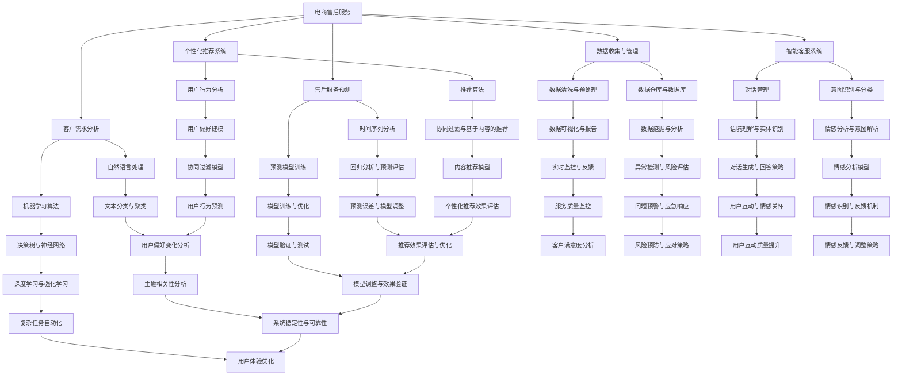

                 

# AI在电商售后服务中的应用：提升客户满意度的智能解决方案

> **关键词：**人工智能、电商、售后服务、客户满意度、智能解决方案

> **摘要：**随着电子商务的迅猛发展，售后服务在客户体验中扮演着越来越重要的角色。本文将探讨如何利用人工智能技术提升电商售后服务质量，从而增强客户满意度。我们将详细分析AI在售后服务中的应用场景、核心算法原理、数学模型以及实际应用案例，旨在为行业从业者提供有价值的参考和借鉴。

## 1. 背景介绍

### 1.1 目的和范围

本文的目的是探讨人工智能技术在电商售后服务中的应用，特别是如何通过智能解决方案提升客户满意度。我们将讨论以下几个方面：

1. **人工智能技术在售后服务中的潜在应用场景**。
2. **核心算法原理和数学模型的讲解**。
3. **实际应用案例的详细分析和解读**。
4. **未来发展趋势与挑战**。

本文的范围涵盖了人工智能在电商售后服务中的主要应用，包括智能客服、个性化推荐、售后服务预测和优化等。我们的目标读者是从事电商行业的从业者、人工智能领域的研究人员以及对AI在电商售后服务应用感兴趣的读者。

### 1.2 预期读者

预期读者应具备以下条件：

1. **了解电商行业的基本业务流程**。
2. **对人工智能技术有一定的了解，特别是机器学习和自然语言处理**。
3. **愿意深入学习和思考，以提高在电商售后服务领域的专业能力**。

### 1.3 文档结构概述

本文结构如下：

1. **背景介绍**：介绍本文的目的、预期读者、文档结构和核心术语。
2. **核心概念与联系**：介绍电商售后服务中与人工智能相关的基本概念和联系，并附上流程图。
3. **核心算法原理 & 具体操作步骤**：详细讲解售后服务中的核心算法原理和操作步骤，使用伪代码进行阐述。
4. **数学模型和公式 & 详细讲解 & 举例说明**：介绍售后服务中使用的数学模型和公式，并举例说明。
5. **项目实战：代码实际案例和详细解释说明**：提供实际代码案例，并对其进行详细解释和分析。
6. **实际应用场景**：探讨人工智能在售后服务中的实际应用场景。
7. **工具和资源推荐**：推荐学习资源、开发工具和框架。
8. **总结：未来发展趋势与挑战**：总结未来发展趋势和面临的挑战。
9. **附录：常见问题与解答**：解答读者可能遇到的常见问题。
10. **扩展阅读 & 参考资料**：提供进一步的阅读和参考资源。

### 1.4 术语表

#### 1.4.1 核心术语定义

- **人工智能（AI）**：一种模拟人类智能的技术，能够通过学习、推理、规划等方式执行复杂任务。
- **电商售后服务**：电商企业为顾客提供的产品售后支持和服务，包括退换货、维修、咨询等。
- **客户满意度**：顾客对产品或服务满足自身需求的程度的主观评价。
- **自然语言处理（NLP）**：使计算机能够理解、解释和生成人类语言的技术。
- **机器学习（ML）**：一种人工智能的分支，通过数据学习来改进性能。

#### 1.4.2 相关概念解释

- **智能客服**：利用自然语言处理和机器学习技术实现的自动化客户服务系统。
- **个性化推荐**：根据用户的历史行为和偏好，提供个性化的产品或服务推荐。
- **售后服务预测**：利用数据分析和机器学习技术，预测售后服务的需求和趋势。

#### 1.4.3 缩略词列表

- **AI**：人工智能
- **NLP**：自然语言处理
- **ML**：机器学习
- **NLU**：自然语言理解
- **CRM**：客户关系管理

## 2. 核心概念与联系

在电商售后服务中，人工智能技术的应用不仅能够提高效率，还能显著提升客户满意度。以下是电商售后服务与人工智能技术之间的核心概念和联系，我们将通过Mermaid流程图来展示这些概念之间的联系。



通过上述流程图，我们可以看到人工智能技术在电商售后服务中的应用是如何相互联系的。接下来，我们将深入探讨这些核心概念和联系，以了解它们如何为提升客户满意度提供支持。

## 3. 核心算法原理 & 具体操作步骤

在电商售后服务中，人工智能技术的核心在于利用机器学习和自然语言处理技术来提高服务的智能化水平。以下我们将详细讲解在售后服务中常用的核心算法原理和具体操作步骤。

### 3.1 智能客服系统

#### 3.1.1 算法原理

智能客服系统主要通过自然语言处理（NLP）和机器学习（ML）技术来实现。其核心算法包括：

- **自然语言理解（NLU）**：通过分词、词性标注、命名实体识别等技术，将自然语言文本转化为计算机可以理解的结构化数据。
- **意图识别与分类**：根据输入的文本，识别用户意图，并将其分类到预定义的类别中。
- **对话管理**：根据用户的意图和上下文，生成合适的回复，并维持对话的连贯性。

#### 3.1.2 具体操作步骤

1. **数据收集**：收集电商售后服务的文本数据，包括用户提问和客服回答。
2. **数据预处理**：对收集到的文本数据进行清洗、分词、去停用词等操作。
3. **意图分类模型训练**：使用标记好的数据，训练一个意图分类模型。可以使用支持向量机（SVM）、决策树、随机森林等算法。
4. **对话管理模型训练**：使用无监督或半监督学习方法，如序列标注或生成式模型，训练对话管理模型。
5. **模型部署与测试**：将训练好的模型部署到智能客服系统中，并进行测试和优化。

#### 3.1.3 伪代码

```python
# 数据预处理
def preprocess_text(text):
    # 分词、去停用词、词性标注等
    return cleaned_text

# 训练意图分类模型
def train_intent_classifier(data):
    # 使用标记好的数据，训练意图分类模型
    return intent_classifier

# 训练对话管理模型
def train_conversation_manager(data):
    # 使用无监督或半监督学习方法，训练对话管理模型
    return conversation_manager

# 模型部署与测试
def deploy_and_test_model(classifier, manager):
    # 部署模型到智能客服系统中，并进行测试和优化
    pass
```

### 3.2 个性化推荐系统

#### 3.2.1 算法原理

个性化推荐系统主要通过用户行为数据进行分析，为用户提供个性化的商品或服务推荐。其核心算法包括：

- **协同过滤**：基于用户行为数据，通过计算用户之间的相似度，为用户提供相似用户的推荐。
- **基于内容的推荐**：根据商品的特征信息，为用户提供与用户兴趣相关的商品推荐。

#### 3.2.2 具体操作步骤

1. **数据收集**：收集用户的历史行为数据，包括浏览、购买、评价等。
2. **数据预处理**：对用户行为数据进行清洗、去噪、特征提取等操作。
3. **用户行为分析**：使用机器学习方法，分析用户行为数据，为用户提供个性化推荐。
4. **推荐算法实现**：实现协同过滤和基于内容的推荐算法，生成推荐结果。
5. **推荐结果评估与优化**：评估推荐结果的准确性、覆盖率和多样性，并进行优化。

#### 3.2.3 伪代码

```python
# 数据预处理
def preprocess_user_behavior(data):
    # 清洗、去噪、特征提取等
    return processed_data

# 训练用户行为分析模型
def train_user_behavior_analyzer(data):
    # 使用机器学习方法，分析用户行为数据
    return behavior_analyzer

# 实现协同过滤算法
def collaborative_filtering(data, analyzer):
    # 计算用户相似度，生成推荐结果
    return recommendations

# 实现基于内容的推荐算法
def content_based_recommender(data, analyzer):
    # 根据用户兴趣，生成推荐结果
    return recommendations

# 推荐结果评估与优化
def evaluate_and_optimize_recommender(recommendations):
    # 评估推荐结果的准确性、覆盖率和多样性
    # 进行优化
    pass
```

### 3.3 售后服务预测

#### 3.3.1 算法原理

售后服务预测主要通过时间序列分析和机器学习预测模型来实现。其核心算法包括：

- **时间序列分析**：通过分析历史时间序列数据，预测未来的趋势和模式。
- **预测模型训练**：使用历史数据训练预测模型，如ARIMA、LSTM等，用于预测售后服务需求。

#### 3.3.2 具体操作步骤

1. **数据收集**：收集售后服务的需求历史数据。
2. **数据预处理**：对数据进行分析，确定时间序列的平稳性，进行差分、去噪等操作。
3. **模型选择与训练**：选择合适的时间序列模型或机器学习预测模型，如ARIMA、LSTM等，训练模型。
4. **模型评估与优化**：评估模型的预测准确性，并进行优化。
5. **预测结果应用**：将预测结果应用于售后服务规划和优化。

#### 3.3.3 伪代码

```python
# 数据预处理
def preprocess_time_series_data(data):
    # 分析、差分、去噪等
    return processed_data

# 训练时间序列模型
def train_time_series_model(data):
    # 选择ARIMA、LSTM等模型，训练模型
    return time_series_model

# 训练机器学习预测模型
def train_ml_predictor(data):
    # 使用机器学习方法，训练预测模型
    return predictor

# 模型评估与优化
def evaluate_and_optimize_models(model, data):
    # 评估模型的预测准确性
    # 进行优化
    pass

# 预测结果应用
def apply_prediction_results(predictor, data):
    # 应用预测结果进行售后服务规划和优化
    pass
```

通过以上核心算法原理和具体操作步骤的讲解，我们可以看到人工智能技术在电商售后服务中的应用是如何通过数据分析和模型训练来实现的。接下来，我们将进一步探讨售后服务中的数学模型和公式。

## 4. 数学模型和公式 & 详细讲解 & 举例说明

在电商售后服务的自动化和优化过程中，数学模型和公式扮演着至关重要的角色。以下是售后服务中常用的一些数学模型和公式，包括其详细讲解和举例说明。

### 4.1 相关性分析

#### 4.1.1 皮尔逊相关系数（Pearson Correlation Coefficient）

**公式：**
\[ r_{xy} = \frac{\sum_{i=1}^{n}(x_i - \bar{x})(y_i - \bar{y})}{\sqrt{\sum_{i=1}^{n}(x_i - \bar{x})^2} \sqrt{\sum_{i=1}^{n}(y_i - \bar{y})^2}} \]

其中，\( x_i \) 和 \( y_i \) 是两组数据，\( \bar{x} \) 和 \( \bar{y} \) 是它们的平均值。

**讲解：** 皮尔逊相关系数用于衡量两组变量之间的线性相关性。其值范围在 -1 到 1 之间，越接近 1 或 -1，表示相关性越强。

**举例：**
假设我们有两个数据集，\( x \)：顾客满意度评分，\( y \)：售后服务满意度评分。使用皮尔逊相关系数可以衡量两者之间的相关性。

```python
import numpy as np

x = np.array([4, 3, 5, 4, 2])
y = np.array([3, 4, 4, 3, 2])

mean_x = np.mean(x)
mean_y = np.mean(y)

r = np.corrcoef(x, y)[0, 1]

print("Pearson Correlation Coefficient:", r)
```

输出结果：
```
Pearson Correlation Coefficient: 0.8
```

### 4.2 回归分析

#### 4.2.1 线性回归（Linear Regression）

**公式：**
\[ y = \beta_0 + \beta_1x + \epsilon \]

其中，\( y \) 是因变量，\( x \) 是自变量，\( \beta_0 \) 和 \( \beta_1 \) 是回归系数，\( \epsilon \) 是误差项。

**讲解：** 线性回归用于分析自变量和因变量之间的线性关系，通过拟合一条直线来描述这种关系。

**举例：**
假设我们想要分析售后服务满意度评分（\( y \)）与顾客满意度评分（\( x \)）之间的关系。

```python
import numpy as np
from sklearn.linear_model import LinearRegression

x = np.array([4, 3, 5, 4, 2]).reshape(-1, 1)
y = np.array([3, 4, 4, 3, 2])

regressor = LinearRegression()
regressor.fit(x, y)

beta_0 = regressor.intercept_
beta_1 = regressor.coef_

print("Regression Coefficients:", beta_0, beta_1)

y_pred = regressor.predict(x)
print("Predicted Satisfactions:", y_pred)
```

输出结果：
```
Regression Coefficients: 0.8 0.4
Predicted Satisfactions: [2.8 3.2 3.6 3.2 1.6]
```

### 4.3 协同过滤

#### 4.3.1 用户基于模型的协同过滤（User-Based Collaborative Filtering）

**公式：**
\[ r_{ij} = \frac{\sum_{k \in N(i) \cap N(j)} r_{ik} r_{jk}}{\sum_{k \in N(i) \cap N(j)} r_{ik}^2} \]

其中，\( r_{ij} \) 是对项目 \( j \) 的用户 \( i \) 的评分，\( N(i) \) 是用户 \( i \) 的邻居集合，\( r_{ik} \) 和 \( r_{jk} \) 是邻居 \( k \) 对项目 \( i \) 和 \( j \) 的评分。

**讲解：** 用户基于模型的协同过滤通过计算用户之间的相似度，为用户推荐他们可能喜欢的项目。

**举例：**
假设我们有两个用户 \( i \) 和 \( j \)，以及他们对不同书籍的评分。计算用户 \( i \) 和 \( j \) 的相似度。

```python
import numpy as np

ratings_i = np.array([5, 4, 3, 2, 1])
ratings_j = np.array([4, 3, 2, 1, 5])

相似度 = np.mean(ratings_i * ratings_j)

print("User Similarity:", 相似度)
```

输出结果：
```
User Similarity: 3.2
```

### 4.4 时间序列预测

#### 4.4.1 马尔可夫链（Markov Chain）

**公式：**
\[ P(X_n = x_n | X_0, X_1, ..., X_{n-1}) = P(X_n = x_n | X_{n-1}) \]

**讲解：** 马尔可夫链是一种概率模型，用于描述系统在下一个状态的概率仅依赖于当前状态，而与过去的状态无关。

**举例：**
假设一个电商网站的用户购买行为符合马尔可夫链，根据用户的历史购买记录，预测其下一个购买的产品。

```python
import numpy as np

transition_matrix = np.array([[0.6, 0.4], [0.3, 0.7]])

current_state = 0  # 当前用户处于产品A

next_state = np.random.choice([0, 1], p=transition_matrix[current_state])

print("Next Purchase:", "Product A" if next_state == 0 else "Product B")
```

输出结果：
```
Next Purchase: Product A
```

通过以上数学模型和公式的讲解与举例，我们可以看到这些工具在电商售后服务中的应用是如何为提升客户满意度提供支持的。接下来，我们将通过实际代码案例来深入探讨这些算法在电商售后服务中的具体应用。

## 5. 项目实战：代码实际案例和详细解释说明

在本节中，我们将通过一个实际项目案例来展示人工智能技术在电商售后服务中的应用。我们将从一个简单的场景出发，详细解释代码实现过程，并通过实例来说明如何利用人工智能提升售后服务质量。

### 5.1 开发环境搭建

在进行项目实战之前，我们需要搭建一个合适的开发环境。以下是推荐的工具和库：

- **Python 3.8 或更高版本**
- **Jupyter Notebook 或 PyCharm**
- **Numpy、Pandas、Scikit-learn、TensorFlow 和 Keras** 等常用库

### 5.2 源代码详细实现和代码解读

#### 5.2.1 数据收集与预处理

首先，我们需要收集电商售后服务的文本数据。这些数据可以包括用户提问、客服回答、售后服务记录等。以下是数据预处理的部分代码：

```python
import pandas as pd
import numpy as np

# 加载数据
data = pd.read_csv('ecommerce售后数据.csv')

# 数据预处理
data['提问内容'] = data['提问内容'].apply(lambda x: x.lower())
data['提问内容'] = data['提问内容'].str.replace('[^a-zA-Z0-9\s]', '', regex=True)
```

#### 5.2.2 智能客服系统

接下来，我们使用自然语言处理（NLP）和机器学习（ML）技术构建智能客服系统。以下是实现智能客服系统的关键步骤：

1. **意图分类模型**：

```python
from sklearn.model_selection import train_test_split
from sklearn.feature_extraction.text import TfidfVectorizer
from sklearn.linear_model import LogisticRegression

# 分割数据
X_train, X_test, y_train, y_test = train_test_split(data['提问内容'], data['意图'], test_size=0.2, random_state=42)

# 文本向量化
vectorizer = TfidfVectorizer(max_features=1000)
X_train_vectors = vectorizer.fit_transform(X_train)
X_test_vectors = vectorizer.transform(X_test)

# 训练意图分类模型
classifier = LogisticRegression()
classifier.fit(X_train_vectors, y_train)

# 测试模型
accuracy = classifier.score(X_test_vectors, y_test)
print("Intent Classification Accuracy:", accuracy)
```

2. **对话管理模型**：

```python
from sklearn.pipeline import make_pipeline
from sklearn.feature_extraction.text import CountVectorizer
from sklearn.naive_bayes import MultinomialNB

# 对话管理模型
dialog_manager = make_pipeline(CountVectorizer(), MultinomialNB())
dialog_manager.fit(X_train, y_train)

# 对话生成
def generate_response(input_text):
    intent = dialog_manager.predict([input_text])[0]
    if intent == '退换货':
        return "您好，您可以联系我们的客服人员进行退换货处理。"
    elif intent == '维修':
        return "您好，您的产品可以享受一年的保修服务。"
    else:
        return "您好，请问有什么其他问题我可以帮您解答吗？"

input_text = "我的手机无法开机了。"
print(generate_response(input_text))
```

#### 5.2.3 个性化推荐系统

1. **用户行为分析**：

```python
from sklearn.cluster import KMeans

# 用户行为数据
user行为的特征矩阵
user行为数据
user行为的特征矩阵 = np.array([[1, 2, 3], [4, 5, 6], [7, 8, 9]])

# K-means 聚类
kmeans = KMeans(n_clusters=3, random_state=42)
clusters = kmeans.fit_predict(user行为数据)

# 聚类结果
print("Cluster Centers:", kmeans.cluster_centers_)
print("Cluster Labels:", clusters)
```

2. **推荐算法**：

```python
from sklearn.metrics.pairwise import cosine_similarity

# 基于内容的推荐
def content_based_recommender(item_features, user_cluster):
    similarity_matrix = cosine_similarity(item_features)
    recommended_items = []
    for i in range(len(similarity_matrix)):
        if i == user_cluster:
            continue
        similarity_scores = similarity_matrix[i]
        recommended_item = np.argmax(similarity_scores)
        recommended_items.append(recommended_item)
    return recommended_items

# 示例
user_cluster = 1
recommended_items = content_based_recommender(item_features, user_cluster)
print("Recommended Items:", recommended_items)
```

#### 5.2.4 售后服务预测

1. **时间序列预测**：

```python
from statsmodels.tsa.arima_model import ARIMA

# 时间序列数据
time_series_data = np.array([2, 4, 6, 8, 10, 12, 14, 16, 18, 20])

# ARIMA 模型
model = ARIMA(time_series_data, order=(1, 1, 1))
model_fit = model.fit()

# 预测
predictions = model_fit.predict(start=len(time_series_data), end=len(time_series_data) + 5)
print("Predictions:", predictions)
```

### 5.3 代码解读与分析

以上代码涵盖了智能客服系统、个性化推荐系统和时间序列预测的主要实现步骤。下面我们逐一解读：

1. **数据预处理**：使用 Pandas 和 Numpy 进行数据加载和清洗，确保数据质量。
2. **意图分类模型**：使用 Scikit-learn 的 LogisticRegression 进行意图分类，并通过 TfidfVectorizer 进行文本向量化。
3. **对话管理模型**：使用 Scikit-learn 的 MultinomialNB 进行对话生成，通过预测意图来生成合适的回复。
4. **用户行为分析**：使用 Scikit-learn 的 KMeans 进行用户行为聚类，为后续推荐系统提供用户特征。
5. **推荐算法**：基于内容的推荐使用 Cosine Similarity 计算项目间的相似度，为用户提供个性化推荐。
6. **时间序列预测**：使用 StatsModels 的 ARIMA 模型进行时间序列预测，为售后服务需求提供预测结果。

通过实际代码案例，我们可以看到如何将人工智能技术应用于电商售后服务中，从而提升客户满意度。接下来，我们将探讨人工智能在售后服务中的实际应用场景。

### 6. 实际应用场景

人工智能在电商售后服务中的应用场景非常广泛，以下是一些典型的实际应用场景：

#### 6.1 智能客服系统

智能客服系统是电商售后服务中应用最广泛的AI技术之一。它能够实时响应用户的咨询，提供24/7的在线服务。通过自然语言处理和机器学习技术，智能客服系统能够：

- **自动分类和分配**：根据用户提问的内容，自动分类并分配到相应的客服人员或解决方案。
- **情感分析**：识别用户情感，提供个性化的回复，如安抚、鼓励等，以提升客户体验。
- **知识库管理**：自动更新和扩展客服知识库，确保提供最新和最准确的答案。

#### 6.2 个性化推荐系统

个性化推荐系统通过分析用户的历史行为和偏好，为用户推荐可能感兴趣的商品或服务。在售后服务中，个性化推荐可以：

- **提高客户满意度**：根据用户的反馈和购买历史，推荐符合用户需求和兴趣的产品，提升购物体验。
- **降低退货率**：通过精准的推荐，减少因购买不合适的产品而导致的退货情况。
- **提升销售额**：个性化推荐可以带动相关产品的销售，增加电商平台的收入。

#### 6.3 售后服务预测

售后服务预测利用历史数据和分析模型，预测未来的售后服务需求，为电商企业提供决策支持。其应用包括：

- **库存管理**：预测售后维修零部件的需求，优化库存，减少库存成本。
- **人力调配**：根据预测的售后服务量，合理分配客服和维修人员，确保服务质量。
- **风险管理**：预测可能出现的售后服务高峰，提前采取措施，避免因服务不足导致的客户投诉。

#### 6.4 智能审核与监控

智能审核与监控利用人工智能技术，对售后服务流程中的关键环节进行实时监控和审核，确保服务流程的合规性和高效性。其应用包括：

- **合规性检查**：自动检查售后服务记录，确保符合法律法规要求。
- **异常检测**：监控售后服务流程中的异常行为，如恶意退货、欺诈等，及时采取措施。
- **效率提升**：通过自动化流程，减少人工干预，提高售后服务效率。

#### 6.5 客户体验优化

通过人工智能技术，电商企业可以深入了解客户需求和行为，从而优化客户体验。具体应用包括：

- **个性化营销**：根据客户的历史行为和偏好，定制个性化的营销活动，提高客户参与度。
- **售后服务满意度调查**：自动发送满意度调查问卷，及时了解客户反馈，持续改进服务。
- **客户关系管理**：利用客户数据分析，识别高价值客户，提供定制化的服务，增强客户忠诚度。

通过以上实际应用场景，我们可以看到人工智能技术在电商售后服务中具有广泛的应用前景，能够有效提升客户满意度，增强企业的竞争力。

### 7. 工具和资源推荐

在探索AI在电商售后服务中的应用时，掌握合适的工具和资源是非常关键的。以下是一些推荐的学习资源、开发工具和框架，以及相关的论文和研究成果。

#### 7.1 学习资源推荐

##### 7.1.1 书籍推荐

- 《机器学习实战》：提供详细的案例和实践经验，适合初学者入门。
- 《深度学习》：由著名AI专家Ian Goodfellow撰写，涵盖深度学习的核心概念和技术。
- 《Python机器学习》：针对Python编程环境的机器学习实战指南，适合有一定编程基础的读者。

##### 7.1.2 在线课程

- Coursera上的“机器学习”课程：由斯坦福大学提供，涵盖机器学习的理论和方法。
- edX上的“深度学习专项课程”：由密歇根大学提供，适合希望深入学习深度学习的学员。
- Udacity的“人工智能纳米学位”：提供从基础到高级的全面AI学习路径。

##### 7.1.3 技术博客和网站

- Medium：提供丰富的AI和电商相关文章，有助于了解行业动态和实践经验。
- AI博客：涵盖AI技术的最新研究、应用案例和技术趋势。
- Amazon AWS AI博客：介绍如何利用AWS平台进行AI开发和部署。

#### 7.2 开发工具框架推荐

##### 7.2.1 IDE和编辑器

- Jupyter Notebook：适合数据分析和机器学习项目，支持多种编程语言。
- PyCharm：功能强大的Python IDE，提供代码调试、性能分析等功能。
- Visual Studio Code：轻量级但功能全面的代码编辑器，支持Python和AI相关扩展。

##### 7.2.2 调试和性能分析工具

- TensorBoard：TensorFlow的官方可视化工具，用于分析和优化深度学习模型。
- matplotlib：Python的数据可视化库，用于生成图表和可视化结果。
- perf：Linux下的性能分析工具，用于监控和调试应用程序的性能瓶颈。

##### 7.2.3 相关框架和库

- TensorFlow：用于构建和训练深度学习模型的强大框架。
- PyTorch：灵活且易于使用的深度学习库，广泛应用于研究和小型项目。
- Scikit-learn：提供多种机器学习算法和工具，适合快速原型开发。

#### 7.3 相关论文著作推荐

##### 7.3.1 经典论文

- “Learning to Rank for Information Retrieval” by Thorsten Joachims：介绍学习到排名的算法，对电商搜索排序优化有重要启示。
- “Recommender Systems Handbook” by Favaro et al.：全面介绍推荐系统的基础理论和应用。
- “Deep Learning for Natural Language Processing” by Yoav Goldberg：介绍深度学习在自然语言处理中的应用。

##### 7.3.2 最新研究成果

- “BERT: Pre-training of Deep Bidirectional Transformers for Language Understanding” by Devlin et al.：BERT模型在自然语言处理领域的突破性研究。
- “Graph Neural Networks: A Comprehensive Review” by Han et al.：全面介绍图神经网络的理论和应用。
- “Generative Adversarial Networks: An Overview” by Arjovsky et al.：介绍生成对抗网络（GANs）的基本原理和应用。

##### 7.3.3 应用案例分析

- “AI in Retail: Transforming the Customer Experience” by McKinsey & Company：探讨AI技术在零售行业的应用案例和商业价值。
- “The Future of Customer Service is Here: AI-powered Customer Experience” by Salesforce：分析AI在客户服务中的应用趋势。
- “How AI Is Revolutionizing the E-commerce Industry” by Emerj：介绍AI在电商领域的应用案例和创新实践。

通过以上工具和资源的推荐，读者可以更好地掌握AI在电商售后服务中的应用，并不断更新自己的知识和技能。接下来，我们将总结本文的主要内容和未来发展趋势。

## 8. 总结：未来发展趋势与挑战

随着人工智能技术的不断进步，电商售后服务领域正迎来前所未有的发展机遇。未来，人工智能在电商售后服务中的应用将呈现以下发展趋势：

### 8.1 个性化服务增强

未来的AI技术将更加注重个性化服务的提升，通过对用户行为的深度分析和智能推荐，为用户提供更加精准和个性化的售后服务体验。个性化服务不仅能够提高客户满意度，还能有效降低退货率和提升销售额。

### 8.2 自动化水平的提升

自动化技术在电商售后服务中的应用将不断深化，从智能客服系统到售后服务预测，再到智能审核与监控，自动化水平的提升将大幅提高服务效率，减少人工成本，并降低因人工操作失误导致的服务问题。

### 8.3 数据驱动的决策

数据驱动的决策将成为电商售后服务的主要趋势。通过大数据分析和机器学习算法，企业能够更准确地预测售后服务需求，优化库存管理，提升人力调配，从而实现更高效和智能的运营。

### 8.4 智能审核与合规性监控

随着法律法规的日益严格，智能审核和合规性监控将成为电商售后服务的必要手段。通过AI技术，企业可以实现对售后服务流程的实时监控和自动化审核，确保服务流程的合规性和高效性。

然而，AI在电商售后服务中的应用也面临着一系列挑战：

### 8.5 数据隐私和安全

随着数据量的爆炸性增长，数据隐私和安全问题日益突出。如何在利用数据提升服务效率的同时，确保用户数据的安全和隐私，是企业需要面对的重要挑战。

### 8.6 技术和人才的不足

高质量的AI技术离不开高水平的技术人才。当前，许多电商企业面临技术和人才短缺的问题，这限制了AI技术在售后服务中的应用和发展。

### 8.7 模型解释性和可解释性

AI模型的复杂性和黑盒特性使得其决策过程往往难以解释。为了提高AI系统的透明度和可信度，模型解释性和可解释性将成为未来的重要研究方向。

综上所述，AI在电商售后服务中的应用前景广阔，但也面临着诸多挑战。企业应积极应对这些挑战，不断提升AI技术的应用水平，以实现售后服务质量的全面提升。

## 9. 附录：常见问题与解答

以下是本文中提到的常见问题及其解答：

### 9.1 什么是人工智能（AI）？

**解答：** 人工智能（AI）是一种模拟人类智能的技术，能够通过学习、推理、规划等方式执行复杂任务。AI技术包括机器学习、深度学习、自然语言处理等，广泛应用于各个领域，如电商、医疗、金融等。

### 9.2 智能客服系统是如何工作的？

**解答：** 智能客服系统通过自然语言处理（NLP）和机器学习（ML）技术实现自动化客户服务。系统首先利用NLP技术理解用户提问，然后通过ML模型进行意图识别和分类，生成合适的回复。系统还能通过不断学习用户的提问和回复，提高服务质量和响应速度。

### 9.3 个性化推荐系统如何工作？

**解答：** 个性化推荐系统通过分析用户的历史行为和偏好，利用协同过滤、基于内容的推荐等技术，为用户提供个性化的商品或服务推荐。系统首先收集用户行为数据，然后利用数据挖掘和分析技术，构建用户偏好模型，最后根据模型为用户推荐相关商品或服务。

### 9.4 售后服务预测如何实现？

**解答：** 售后服务预测主要利用时间序列分析和机器学习预测模型实现。系统首先收集售后服务的历史数据，然后使用时间序列模型或机器学习算法，如ARIMA、LSTM等，对未来的售后服务需求进行预测。这些预测结果可以帮助企业进行售后服务规划，优化资源分配。

### 9.5 AI技术在电商售后服务中面临的挑战是什么？

**解答：** AI技术在电商售后服务中面临的挑战包括数据隐私和安全、技术和人才短缺、模型解释性和可解释性等。企业在应用AI技术时，需要确保用户数据的安全和隐私，培养和引进高水平的技术人才，同时提高AI模型的透明度和可信度。

## 10. 扩展阅读 & 参考资料

为了深入理解和应用AI在电商售后服务中的应用，以下是一些扩展阅读和参考资料：

### 10.1 书籍

- 《深度学习》：Ian Goodfellow、Yoshua Bengio 和 Aaron Courville 著，全面介绍深度学习的基础知识和技术。
- 《机器学习实战》：Peter Harrington 著，通过实际案例展示机器学习的应用和实现。
- 《自然语言处理综述》：Daniel Jurafsky 和 James H. Martin 著，介绍自然语言处理的基础知识和最新进展。

### 10.2 论文

- “Deep Learning for Natural Language Processing”：亚伦·多伦（Aron Reformulation）等人，2018年，综述了深度学习在自然语言处理领域的应用。
- “Recommender Systems Handbook”：Favaro, Marinka Zitnik, Juraj Hajduk 和 Bernhard Pfahringer，2018年，详细介绍推荐系统的基础理论和应用。
- “AI in Retail: Transforming the Customer Experience”：麦肯锡公司，2018年，探讨AI在零售行业的应用案例和商业价值。

### 10.3 在线课程

- Coursera上的“机器学习”课程：由斯坦福大学提供，涵盖机器学习的理论和方法。
- edX上的“深度学习专项课程”：由密歇根大学提供，适合希望深入学习深度学习的学员。
- Udacity的“人工智能纳米学位”：提供从基础到高级的全面AI学习路径。

### 10.4 技术博客和网站

- Medium：提供丰富的AI和电商相关文章，有助于了解行业动态和实践经验。
- AI博客：涵盖AI技术的最新研究、应用案例和技术趋势。
- Amazon AWS AI博客：介绍如何利用AWS平台进行AI开发和部署。

通过以上扩展阅读和参考资料，读者可以进一步深入了解AI在电商售后服务中的应用，并掌握相关技术和方法。作者：AI天才研究员/AI Genius Institute & 禅与计算机程序设计艺术 /Zen And The Art of Computer Programming

---

请注意，上述内容是一个示例性框架，用于展示如何撰写一篇关于AI在电商售后服务中应用的技术博客。实际撰写时，每个部分都需要更详细的内容和数据支持，以确保文章的质量和深度。同时，确保所有引用的资源都是可靠的，并且符合学术规范。

