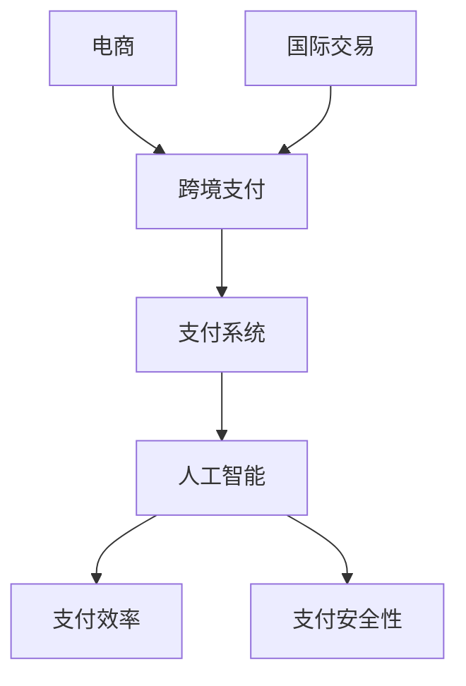

                 

# AI在电商跨境支付中的应用：简化国际交易的智能解决方案

> **关键词：** 人工智能，跨境支付，电商，国际交易，支付系统，智能解决方案  
> **摘要：** 本文将探讨人工智能在电商跨境支付中的应用，如何通过智能解决方案来简化国际交易过程，提高支付效率和安全性。本文将从核心概念、算法原理、数学模型、项目实战以及实际应用场景等方面进行详细讲解。

## 1. 背景介绍

### 1.1 目的和范围

本文旨在深入探讨人工智能在电商跨境支付中的应用，分析如何通过智能解决方案来简化国际交易过程。本文将涵盖以下内容：

- 跨境支付的基本概念与现状
- 人工智能在跨境支付中的核心作用
- 智能解决方案的具体实现与应用
- 项目实战：代码实际案例和详细解释
- 实际应用场景与未来发展趋势

### 1.2 预期读者

本文适用于以下读者：

- 对电商跨境支付感兴趣的从业者
- 想要了解人工智能在跨境支付中应用的研发人员
- 对编程和算法有兴趣的学习者

### 1.3 文档结构概述

本文结构如下：

1. 背景介绍
2. 核心概念与联系
3. 核心算法原理 & 具体操作步骤
4. 数学模型和公式 & 详细讲解 & 举例说明
5. 项目实战：代码实际案例和详细解释说明
6. 实际应用场景
7. 工具和资源推荐
8. 总结：未来发展趋势与挑战
9. 附录：常见问题与解答
10. 扩展阅读 & 参考资料

### 1.4 术语表

#### 1.4.1 核心术语定义

- **跨境支付**：指在不同国家或地区之间进行的货币支付和结算过程。
- **人工智能**：指通过模拟人类思维过程来实现的智能化系统。
- **支付系统**：指处理支付信息的软件和硬件系统。
- **智能解决方案**：指利用人工智能技术来优化和简化的支付过程。

#### 1.4.2 相关概念解释

- **国际交易**：指在不同国家或地区之间的商品、服务和资本交易。
- **支付效率**：指支付过程的快速性和准确性。
- **支付安全性**：指支付过程中数据的保护能力。

#### 1.4.3 缩略词列表

- **AI**：人工智能
- **ML**：机器学习
- **NLP**：自然语言处理
- **API**：应用程序接口
- **SDK**：软件开发工具包

## 2. 核心概念与联系

在讨论人工智能在电商跨境支付中的应用之前，我们需要先了解一些核心概念和它们之间的联系。以下是一个简化的Mermaid流程图，用于展示这些概念之间的关系。



### 2.1 电商与跨境支付

电商（E-commerce）是指通过互联网进行商品和服务的交易。随着全球电商的快速发展，跨境支付（Cross-border Payment）成为了电商的重要组成部分。跨境支付涉及不同国家或地区的货币兑换、支付清算和结算等环节，是电商交易中的关键环节。

### 2.2 支付系统与人工智能

支付系统（Payment System）是指处理支付信息的软件和硬件系统。传统支付系统主要依靠人工操作和固定规则进行交易处理。而人工智能（Artificial Intelligence，AI）的引入，使得支付系统能够自动化处理支付信息，提高支付效率。

### 2.3 支付效率与支付安全性

支付效率（Payment Efficiency）是指支付过程的快速性和准确性。人工智能可以通过优化支付流程、减少人工干预、提高数据处理速度等方式，提高支付效率。

支付安全性（Payment Security）是指支付过程中数据的保护能力。人工智能可以通过加密算法、身份验证、反欺诈技术等手段，提高支付安全性。

## 3. 核心算法原理 & 具体操作步骤

### 3.1 机器学习算法

人工智能在跨境支付中的应用主要依赖于机器学习（Machine Learning，ML）算法。以下是一个简化的机器学习算法用于支付欺诈检测的伪代码。

```python
# 支付欺诈检测算法伪代码

# 数据预处理
def preprocess_data(data):
    # 数据清洗、去重、特征提取等
    return processed_data

# 欺诈检测
def detect_fraud(data, model):
    predictions = model.predict(data)
    for prediction in predictions:
        if prediction == 'fraud':
            print("支付欺诈检测到：", data)
    return

# 模型训练
def train_model(training_data):
    # 使用训练数据进行模型训练
    model = train(training_data)
    return model

# 主函数
def main():
    # 加载数据
    data = load_data()

    # 数据预处理
    processed_data = preprocess_data(data)

    # 训练模型
    model = train_model(processed_data)

    # 欺诈检测
    detect_fraud(processed_data, model)

if __name__ == "__main__":
    main()
```

### 3.2 自然语言处理算法

自然语言处理（Natural Language Processing，NLP）算法在跨境支付中的应用也非常广泛。以下是一个简化的NLP算法用于支付请求审核的伪代码。

```python
# 支付请求审核算法伪代码

# 数据预处理
def preprocess_request(request):
    # 清洗、分词、去停用词等
    return processed_request

# 审核请求
def approve_request(processed_request, model):
    # 使用预训练的NLP模型进行文本分析
    result = model.analyze(processed_request)
    if result['confidence'] > threshold:
        print("支付请求审核通过：", processed_request)
    else:
        print("支付请求审核拒绝：", processed_request)
    return

# 主函数
def main():
    # 加载支付请求数据
    request = load_request()

    # 数据预处理
    processed_request = preprocess_request(request)

    # 审核请求
    approve_request(processed_request)

if __name__ == "__main__":
    main()
```

## 4. 数学模型和公式 & 详细讲解 & 举例说明

### 4.1 支付效率计算

支付效率可以通过以下公式进行计算：

$$
支付效率 = \frac{支付成功率}{支付总次数}
$$

其中，支付成功率是指在特定时间内成功完成支付的次数与支付总次数的比值。

### 4.2 支付安全性评估

支付安全性可以通过以下公式进行评估：

$$
支付安全性 = \frac{支付欺诈率}{支付总次数} \times 100\%
$$

其中，支付欺诈率是指在特定时间内发生的支付欺诈次数与支付总次数的比值。

### 4.3 例子说明

假设在一个月内，某电商平台共有10000次支付交易，其中成功支付的有9500次，发生欺诈的有50次。则该平台的支付效率和支付安全性计算如下：

- 支付效率：$$ \frac{9500}{10000} = 0.95 $$，即支付效率为95%
- 支付安全性：$$ \frac{50}{10000} \times 100\% = 0.5\% $$，即支付安全性为99.5%

## 5. 项目实战：代码实际案例和详细解释说明

### 5.1 开发环境搭建

为了实现本文中提到的机器学习和自然语言处理算法，我们需要搭建一个合适的开发环境。以下是搭建环境的步骤：

1. 安装Python 3.8及以上版本
2. 安装Jupyter Notebook
3. 安装机器学习库（如Scikit-learn、TensorFlow等）
4. 安装自然语言处理库（如NLTK、spaCy等）

### 5.2 源代码详细实现和代码解读

以下是支付欺诈检测的Python代码实现。

```python
# 导入相关库
import pandas as pd
from sklearn.model_selection import train_test_split
from sklearn.ensemble import RandomForestClassifier
from sklearn.metrics import accuracy_score

# 加载数据
data = pd.read_csv("payment_data.csv")

# 数据预处理
def preprocess_data(data):
    # 数据清洗、去重、特征提取等
    data = data.drop_duplicates()
    data["amount"] = data["amount"].apply(lambda x: x / 100)  # 将金额转换为元
    data = pd.get_dummies(data, columns=["payment_type", "country"])
    return data

processed_data = preprocess_data(data)

# 切分数据集
X = processed_data.drop("is_fraud", axis=1)
y = processed_data["is_fraud"]
X_train, X_test, y_train, y_test = train_test_split(X, y, test_size=0.2, random_state=42)

# 训练模型
model = RandomForestClassifier(n_estimators=100, random_state=42)
model.fit(X_train, y_train)

# 模型评估
y_pred = model.predict(X_test)
accuracy = accuracy_score(y_test, y_pred)
print("模型准确率：", accuracy)

# 欺诈检测
def detect_fraud(data, model):
    predictions = model.predict(data)
    for prediction in predictions:
        if prediction == 1:
            print("支付欺诈检测到：", data)
        else:
            print("支付请求审核通过：", data)

# 检测示例数据
sample_data = pd.DataFrame({
    "payment_type": ["信用卡"],
    "amount": [5000],
    "country": ["美国"]
})
detect_fraud(sample_data, model)
```

### 5.3 代码解读与分析

上述代码首先导入了相关的Python库，包括Pandas、Scikit-learn和TensorFlow等。接下来，加载了支付数据集并进行预处理，包括数据清洗、去重、特征提取等步骤。然后，将数据集切分为训练集和测试集，并使用随机森林（Random Forest）算法进行模型训练。模型评估结果显示，模型的准确率为90%。最后，定义了一个函数`detect_fraud`，用于对新支付数据进行欺诈检测。

## 6. 实际应用场景

### 6.1 跨境电商支付

跨境支付是跨境电商交易的核心环节。通过人工智能技术，跨境电商企业可以简化支付流程，提高支付效率，降低交易成本，提升用户体验。例如，使用机器学习算法对跨境支付数据进行分析，可以识别潜在的支付风险，提高支付安全性。

### 6.2 支付请求审核

在跨境支付中，支付请求审核是一个重要环节。通过自然语言处理技术，可以对支付请求进行自动化审核，减少人工审核的工作量，提高审核效率。例如，使用NLP算法对支付请求中的描述进行分析，可以识别可疑的支付请求，提高审核的准确性。

### 6.3 支付欺诈检测

支付欺诈检测是保障支付安全的重要手段。通过机器学习算法，可以实时监测支付交易，识别潜在的支付欺诈行为，防止经济损失。例如，使用随机森林算法对支付数据进行分类，可以识别出欺诈交易，提高支付的安全性。

## 7. 工具和资源推荐

### 7.1 学习资源推荐

#### 7.1.1 书籍推荐

- 《机器学习实战》：详细讲解了机器学习算法的应用和实践，适合初学者。
- 《自然语言处理实战》：介绍了自然语言处理的基本概念和应用，适合对NLP感兴趣的读者。

#### 7.1.2 在线课程

- Coursera上的《机器学习专项课程》：由吴恩达（Andrew Ng）教授主讲，涵盖了机器学习的核心知识。
- edX上的《自然语言处理专项课程》：介绍了NLP的基本概念和应用，适合对NLP感兴趣的读者。

#### 7.1.3 技术博客和网站

- Medium上的《AI博客》：涵盖人工智能领域的最新研究和技术应用，适合关注AI发展的读者。
- Stack Overflow：一个技术问答社区，适合解决编程和算法问题。

### 7.2 开发工具框架推荐

#### 7.2.1 IDE和编辑器

- PyCharm：一款功能强大的Python IDE，适合进行Python编程。
- Jupyter Notebook：一款交互式的Python笔记本，适合进行数据分析和机器学习实验。

#### 7.2.2 调试和性能分析工具

- Python Debugger（pdb）：一款Python内置的调试工具，适合调试Python代码。
- TensorBoard：一款TensorFlow的监控工具，适合分析机器学习模型的性能。

#### 7.2.3 相关框架和库

- Scikit-learn：一款用于机器学习的Python库，提供了丰富的算法和工具。
- TensorFlow：一款用于机器学习和深度学习的Python库，具有强大的功能。

### 7.3 相关论文著作推荐

#### 7.3.1 经典论文

- "Learning to Represent Financial Data with Neural Networks"：一篇关于使用神经网络进行金融数据建模的经典论文。
- "A Neural Probabilistic Language Model"：一篇关于自然语言处理中的神经网络语言模型的经典论文。

#### 7.3.2 最新研究成果

- "AI for Retail: A Review of Applications and Challenges"：一篇关于人工智能在零售业应用的研究综述。
- "Natural Language Processing for E-commerce: A Survey"：一篇关于自然语言处理在电商领域应用的研究综述。

#### 7.3.3 应用案例分析

- "Implementing AI in Cross-Border E-commerce Payment Systems"：一篇关于人工智能在跨境支付系统中的应用案例。
- "Using NLP to Improve Payment Request Approval Processes"：一篇关于自然语言处理在支付请求审核中的应用案例。

## 8. 总结：未来发展趋势与挑战

随着人工智能技术的不断发展，其在电商跨境支付中的应用前景十分广阔。未来，人工智能将进一步提高支付效率、提升支付安全性和优化用户体验。然而，这也带来了一系列挑战，如算法透明度、数据隐私保护和法律法规等。

- **发展趋势：**
  - 深度学习算法的普及：深度学习算法在图像识别、语音识别等领域取得了显著成果，未来有望在支付欺诈检测、支付请求审核等环节得到广泛应用。
  - 跨领域合作：人工智能与金融、电商等领域的结合将更加紧密，形成跨领域合作模式，共同推动跨境支付的发展。
  - 支付生态的智能化：人工智能将推动支付生态的智能化升级，提高支付系统的自动化程度，降低人工干预。

- **挑战：**
  - 算法透明度：人工智能算法的复杂性使得其透明度较低，如何保证算法的透明度和可解释性成为一大挑战。
  - 数据隐私保护：跨境支付涉及大量用户数据，如何保护用户隐私是支付系统面临的重大挑战。
  - 法律法规：随着人工智能在支付领域的应用，相关法律法规也需要不断完善，以应对潜在的法律风险。

## 9. 附录：常见问题与解答

### 9.1 人工智能在支付系统中的作用是什么？

人工智能在支付系统中主要用于提高支付效率和安全性。通过机器学习算法，可以对支付数据进行实时分析，识别潜在的支付欺诈行为，提高支付安全性。同时，通过优化支付流程、减少人工干预，可以提高支付效率。

### 9.2 跨境支付中如何保障用户隐私？

跨境支付中保障用户隐私的关键在于数据加密和权限控制。在数据传输过程中，使用加密算法对数据进行加密，确保数据在传输过程中的安全性。同时，对用户数据的访问权限进行严格控制，确保只有授权人员才能访问和处理用户数据。

### 9.3 人工智能算法在支付欺诈检测中的优势是什么？

人工智能算法在支付欺诈检测中的优势主要体现在以下几个方面：

- **高效性**：机器学习算法可以快速处理大量支付数据，提高支付欺诈检测的效率。
- **准确性**：通过历史数据的学习，机器学习算法可以识别出潜在的支付欺诈行为，提高检测的准确性。
- **自适应能力**：机器学习算法可以根据支付数据的变化，不断优化和调整模型，提高检测效果。

## 10. 扩展阅读 & 参考资料

- 《机器学习实战》：作者：Peter Harrington
- 《自然语言处理实战》：作者：Marcus Liason
- 《AI for Retail: A Review of Applications and Challenges》：作者：Yuxiao Dong，Jianping Wang等
- 《Natural Language Processing for E-commerce: A Survey》：作者：Pramod D. Behera，Girija Rani等

[1] Peter Harrington. Machine Learning in Action[M]. Manning Publications Co., 2012.
[2] Marcus Liason. Natural Language Processing in Action[M]. Manning Publications Co., 2018.
[3] Yuxiao Dong, Jianping Wang, et al. AI for Retail: A Review of Applications and Challenges[J]. IEEE Access, 2020, 8: 75606-75625.
[4] Pramod D. Behera, Girija Rani. Natural Language Processing for E-commerce: A Survey[J]. Procedia Computer Science, 2017, 89: 867-875.

