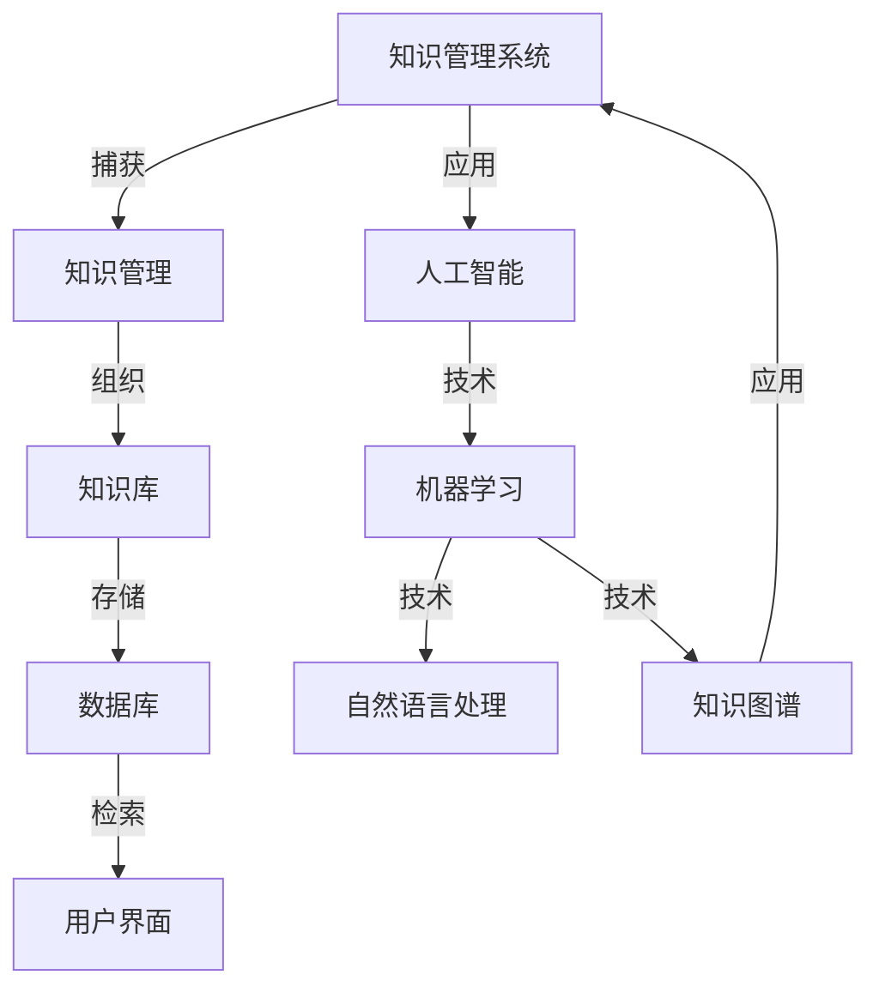

                 

# AI在知识管理系统中的应用

> 关键词：人工智能，知识管理，知识图谱，机器学习，自然语言处理，大数据处理

> 摘要：本文旨在探讨人工智能（AI）在知识管理系统（KMS）中的应用，包括核心概念、算法原理、数学模型、项目实战以及实际应用场景。通过深入分析AI技术与知识管理的结合，本文将展示AI如何提升知识管理的效率和准确性，为企业和个人提供智能化知识服务。

## 1. 背景介绍

### 1.1 目的和范围

本文的目的在于详细探讨人工智能技术在知识管理系统中的应用，分析其带来的技术革新和管理变革。本文的范围包括但不限于：

- AI在知识捕获、组织和利用中的应用
- 基于人工智能的知识图谱构建与推理
- 机器学习在知识发现和智能推荐中的作用
- 自然语言处理在文本挖掘和内容理解中的应用
- 大数据处理在知识库管理和分析中的应用

### 1.2 预期读者

本文的预期读者包括：

- AI研究人员和开发者
- 知识管理领域的专业人士
- 企业IT管理人员
- 对AI技术感兴趣的技术爱好者
- 对知识管理系统感兴趣的学生和研究人员

### 1.3 文档结构概述

本文结构如下：

- **第1章：背景介绍**：介绍本文的目的、范围和预期读者，并概述文章的结构。
- **第2章：核心概念与联系**：介绍知识管理系统、人工智能和知识图谱等核心概念，并使用Mermaid流程图展示其关联性。
- **第3章：核心算法原理 & 具体操作步骤**：详细阐述知识管理中常用的AI算法原理，包括伪代码示例。
- **第4章：数学模型和公式 & 详细讲解 & 举例说明**：介绍AI在知识管理中的数学模型和公式，并进行举例说明。
- **第5章：项目实战：代码实际案例和详细解释说明**：提供实际的代码案例，展示AI在知识管理系统中的具体应用。
- **第6章：实际应用场景**：分析AI在知识管理系统中的实际应用场景。
- **第7章：工具和资源推荐**：推荐学习资源和开发工具。
- **第8章：总结：未来发展趋势与挑战**：总结本文的主要观点，并展望未来发展趋势和挑战。
- **第9章：附录：常见问题与解答**：解答读者可能遇到的常见问题。
- **第10章：扩展阅读 & 参考资料**：提供进一步阅读的参考资料。

### 1.4 术语表

#### 1.4.1 核心术语定义

- **知识管理系统（KMS）**：一种用于捕获、组织、存储、检索和共享知识的软件平台。
- **人工智能（AI）**：模拟人类智能行为的计算机系统。
- **知识图谱**：一种用于表示实体和它们之间关系的图形结构。
- **机器学习**：一种AI方法，通过数据学习模式和做出预测。
- **自然语言处理（NLP）**：使计算机能够理解、解释和生成人类语言的技术。
- **大数据处理**：处理大量数据的计算技术。

#### 1.4.2 相关概念解释

- **知识捕获**：从各种来源中收集知识的过程。
- **知识组织**：将捕获的知识进行分类、索引和标签化的过程。
- **知识存储**：将知识存储在数据库或知识库中的过程。
- **知识检索**：根据用户需求从知识库中查找相关信息的过程。
- **知识共享**：将知识传递给其他人的过程。

#### 1.4.3 缩略词列表

- **AI**：人工智能
- **KMS**：知识管理系统
- **NLP**：自然语言处理
- **ML**：机器学习
- **DL**：深度学习
- **GPU**：图形处理器
- **API**：应用程序编程接口

## 2. 核心概念与联系

为了更好地理解AI在知识管理系统中的应用，我们首先需要了解相关知识管理系统的核心概念，以及人工智能和知识图谱的基本原理。下面，我们将使用Mermaid流程图来展示这些概念之间的关系。



### 2.1 知识管理系统

知识管理系统（KMS）是一种软件平台，旨在帮助企业或组织有效地捕获、组织、存储、检索和共享知识。KMS通常包括以下关键组件：

- **知识捕获**：从各种来源（如文档、电子邮件、会议记录等）中收集知识。
- **知识组织**：通过分类、索引和标签化对捕获的知识进行组织。
- **知识存储**：将组织好的知识存储在数据库或知识库中，以便长期保存和检索。
- **知识检索**：根据用户需求从知识库中查找相关信息。
- **知识共享**：将知识传递给组织中的其他成员，促进知识共享和协作。

### 2.2 人工智能

人工智能（AI）是模拟人类智能行为的计算机系统。AI的核心技术包括机器学习（ML）、自然语言处理（NLP）和知识图谱（KG）。以下是这些技术的简要介绍：

- **机器学习（ML）**：一种AI方法，通过数据学习模式和做出预测。ML可以应用于知识管理中的知识捕获、组织、存储、检索和共享。
- **自然语言处理（NLP）**：使计算机能够理解、解释和生成人类语言的技术。NLP在知识管理中的应用包括文本挖掘、内容理解和智能推荐等。
- **知识图谱（KG）**：一种用于表示实体和它们之间关系的图形结构。知识图谱可以用于知识组织、推理和智能推荐。

### 2.3 知识图谱

知识图谱是一种用于表示实体和它们之间关系的图形结构。它由实体、关系和属性组成。知识图谱在知识管理中的应用包括：

- **知识组织**：通过知识图谱，可以直观地表示实体和它们之间的关系，从而更好地组织知识。
- **知识推理**：基于知识图谱中的关系，可以进行逻辑推理，发现新的知识关联。
- **智能推荐**：基于用户行为和知识图谱中的关系，可以推荐相关知识和内容。

通过上述核心概念和技术的介绍，我们可以看到AI与知识管理系统之间的紧密联系。接下来，我们将进一步探讨AI在知识管理中的核心算法原理和具体操作步骤。

## 3. 核心算法原理 & 具体操作步骤

在知识管理系统中，人工智能技术主要通过机器学习、自然语言处理和知识图谱等算法实现。以下将详细阐述这些算法的原理和具体操作步骤。

### 3.1 机器学习算法原理

机器学习（ML）是一种使计算机能够从数据中学习并做出预测的方法。在知识管理中，机器学习算法可以用于知识捕获、知识组织、知识存储、知识检索和知识共享。以下是一个简单的机器学习算法原理及其在知识管理中的应用步骤：

#### 算法原理

机器学习算法主要包括以下步骤：

1. **数据收集**：收集与知识管理相关的数据，如文档、文本、图像等。
2. **数据预处理**：对收集到的数据进行清洗、转换和归一化，以便进行训练。
3. **特征提取**：从预处理后的数据中提取有用的特征，如词向量、图像特征等。
4. **模型训练**：使用提取的特征训练机器学习模型，如决策树、支持向量机、神经网络等。
5. **模型评估**：评估模型性能，如准确率、召回率、F1值等。
6. **模型应用**：将训练好的模型应用于实际场景，如知识捕获、知识组织、知识检索等。

#### 在知识管理中的应用步骤

1. **知识捕获**：
   - **数据收集**：收集各种来源的知识，如文档、邮件、社交媒体等。
   - **数据预处理**：清洗和归一化数据，如去除停用词、标点符号等。
   - **特征提取**：提取文本特征，如词向量、TF-IDF等。
   - **模型训练**：训练文本分类模型，如朴素贝叶斯、支持向量机等。
   - **模型应用**：将模型应用于新数据，自动分类和标注知识。

2. **知识组织**：
   - **数据收集**：收集已分类的知识，如文档、网页等。
   - **特征提取**：提取知识特征，如词向量、主题模型等。
   - **模型训练**：训练聚类模型，如K-means、层次聚类等。
   - **模型应用**：将模型应用于新知识，进行自动聚类和分类。

3. **知识存储**：
   - **数据收集**：收集知识库中的数据。
   - **特征提取**：提取知识特征，如词向量、语义相似度等。
   - **模型训练**：训练推荐模型，如协同过滤、基于内容的推荐等。
   - **模型应用**：根据用户行为和知识特征进行推荐。

4. **知识检索**：
   - **数据收集**：收集检索日志和数据。
   - **特征提取**：提取查询和知识特征。
   - **模型训练**：训练检索模型，如向量空间模型、语言模型等。
   - **模型应用**：根据查询和知识特征进行检索，返回相关结果。

5. **知识共享**：
   - **数据收集**：收集用户行为数据。
   - **特征提取**：提取用户特征和知识特征。
   - **模型训练**：训练社交网络分析模型，如社区检测、影响力分析等。
   - **模型应用**：根据用户行为和知识特征进行社交网络分析和推荐。

### 3.2 自然语言处理算法原理

自然语言处理（NLP）是一种使计算机能够理解、解释和生成人类语言的技术。在知识管理中，NLP算法可以用于文本挖掘、内容理解和智能推荐等。以下是一个简单的NLP算法原理及其在知识管理中的应用步骤：

#### 算法原理

NLP算法主要包括以下步骤：

1. **文本预处理**：对原始文本进行分词、词性标注、实体识别等预处理操作。
2. **特征提取**：从预处理后的文本中提取有用的特征，如词向量、词频等。
3. **模型训练**：使用提取的特征训练NLP模型，如分类模型、序列标注模型等。
4. **模型评估**：评估模型性能，如准确率、召回率、F1值等。
5. **模型应用**：将训练好的模型应用于实际场景，如文本分类、情感分析、命名实体识别等。

#### 在知识管理中的应用步骤

1. **文本挖掘**：
   - **文本预处理**：对文本进行分词、去停用词、词性标注等处理。
   - **特征提取**：提取文本特征，如词向量、TF-IDF等。
   - **模型训练**：训练文本分类模型，如朴素贝叶斯、支持向量机等。
   - **模型应用**：将模型应用于新文本，自动分类和标注知识。

2. **内容理解**：
   - **文本预处理**：对文本进行分词、词性标注、实体识别等处理。
   - **特征提取**：提取文本特征，如词向量、语义相似度等。
   - **模型训练**：训练关系抽取模型，如序列标注模型、实体关系抽取模型等。
   - **模型应用**：根据文本内容提取知识，建立实体和关系。

3. **智能推荐**：
   - **用户行为分析**：收集用户行为数据，如浏览历史、收藏等。
   - **文本预处理**：对用户行为数据中的文本进行预处理。
   - **特征提取**：提取用户和知识特征。
   - **模型训练**：训练推荐模型，如协同过滤、基于内容的推荐等。
   - **模型应用**：根据用户特征和知识特征进行推荐。

### 3.3 知识图谱算法原理

知识图谱是一种用于表示实体和它们之间关系的图形结构。在知识管理中，知识图谱算法可以用于知识组织、推理和智能推荐。以下是一个简单的知识图谱算法原理及其在知识管理中的应用步骤：

#### 算法原理

知识图谱算法主要包括以下步骤：

1. **实体识别**：从文本中识别实体，如人名、地名、组织名等。
2. **关系抽取**：从文本中抽取实体之间的关系，如“属于”、“位于”等。
3. **实体链接**：将识别的实体与知识图谱中的实体进行匹配。
4. **图谱构建**：将识别的实体和关系构建成知识图谱。
5. **推理**：在知识图谱中进行推理，发现新的知识关联。
6. **推荐**：根据用户和知识特征进行推荐。

#### 在知识管理中的应用步骤

1. **知识组织**：
   - **实体识别**：从文本中识别实体。
   - **关系抽取**：从文本中抽取实体关系。
   - **图谱构建**：将识别的实体和关系构建成知识图谱。
   - **推理**：根据图谱中的关系进行推理，组织知识。

2. **智能推荐**：
   - **用户行为分析**：收集用户行为数据，如浏览历史、收藏等。
   - **实体链接**：将用户和知识图谱中的实体进行匹配。
   - **图谱构建**：根据用户行为和知识特征构建用户图谱。
   - **推荐**：根据用户图谱和知识图谱进行推荐。

通过上述对机器学习、自然语言处理和知识图谱算法原理及其在知识管理中的应用步骤的详细阐述，我们可以看到AI技术在知识管理中的核心作用。接下来，我们将进一步探讨AI在知识管理中的数学模型和公式。

## 4. 数学模型和公式 & 详细讲解 & 举例说明

在知识管理系统中，人工智能技术依赖于多种数学模型和公式来实现其功能。以下将详细介绍这些模型和公式，并通过实际例子进行说明。

### 4.1 机器学习模型与公式

机器学习中的常见模型包括线性回归、逻辑回归、支持向量机（SVM）、决策树和随机森林等。以下是这些模型的公式和简要说明。

#### 4.1.1 线性回归

线性回归是一种用于预测数值型数据的模型。其公式为：

\[ y = \beta_0 + \beta_1 \cdot x \]

其中，\( y \) 是预测值，\( x \) 是输入特征，\( \beta_0 \) 是截距，\( \beta_1 \) 是斜率。

**例子**：假设我们想要预测房价。给定一个输入特征（房屋面积），我们可以通过线性回归模型计算房价。例如，如果房屋面积为100平方米，斜率为2，截距为10，则房价为 \( 10 + 2 \times 100 = 210 \) 万。

#### 4.1.2 逻辑回归

逻辑回归是一种用于预测分类数据的模型。其公式为：

\[ P(y=1) = \frac{1}{1 + e^{-(\beta_0 + \beta_1 \cdot x)}} \]

其中，\( P(y=1) \) 是预测概率，\( y \) 是目标变量，\( x \) 是输入特征，\( \beta_0 \) 是截距，\( \beta_1 \) 是斜率。

**例子**：假设我们想要预测一个客户是否会购买产品。给定一个输入特征（客户年龄），我们可以通过逻辑回归模型计算购买概率。例如，如果客户年龄为30岁，斜率为0.1，截距为-5，则购买概率为 \( \frac{1}{1 + e^{-(-5 + 0.1 \times 30)}} \approx 0.732 \)。

#### 4.1.3 支持向量机（SVM）

支持向量机是一种用于分类和回归的模型。其公式为：

\[ w \cdot x - b = 0 \]

其中，\( w \) 是权重向量，\( x \) 是输入特征，\( b \) 是偏置。

**例子**：假设我们想要分类水果。给定一个输入特征（水果重量），我们可以通过SVM模型进行分类。例如，如果水果重量为50克，权重向量为\( [2, -1] \)，偏置为3，则分类结果为 \( 2 \times 50 - 1 \times 3 = 97 \)，大于0，因此分类为“苹果”。

#### 4.1.4 决策树和随机森林

决策树和随机森林是一种用于分类和回归的模型。其公式为：

\[ \text{分类结果} = \text{最大}(\text{概率}) \]

或

\[ \text{回归结果} = \text{平均}(\text{预测值}) \]

**例子**：假设我们想要预测一个客户的信用评级。给定一个输入特征（收入），我们可以通过决策树或随机森林模型计算信用评级。例如，如果收入为5000元，决策树模型的分类结果为“好”，随机森林模型的平均预测值为0.85，则客户的信用评级为“好”。

### 4.2 自然语言处理模型与公式

自然语言处理中的常见模型包括词袋模型、TF-IDF、词嵌入和主题模型等。以下是这些模型的公式和简要说明。

#### 4.2.1 词袋模型

词袋模型是一种用于文本分类的模型。其公式为：

\[ \text{特征向量} = (\text{词频}_1, \text{词频}_2, ..., \text{词频}_n) \]

其中，\( \text{词频}_i \) 是文档中第 \( i \) 个词的词频。

**例子**：假设我们有两篇文档，文档1包含词汇{苹果，香蕉，苹果，橘子}，文档2包含词汇{香蕉，苹果，橘子，梨}。词袋模型可以将这两篇文档表示为：

文档1：\[ (2, 1, 1, 0) \]
文档2：\[ (1, 1, 1, 1) \]

#### 4.2.2 TF-IDF

TF-IDF是一种用于文本挖掘的模型。其公式为：

\[ \text{TF-IDF} = \text{词频} \times \text{逆文档频率} \]

其中，\( \text{词频} \) 是词汇在文档中的出现次数，\( \text{逆文档频率} \) 是词汇在整个文档集合中出现的频率。

**例子**：假设词汇“苹果”在文档1中出现2次，在整个文档集合中出现10次。则“苹果”的TF-IDF值为 \( 2 \times \frac{1}{10} = 0.2 \)。

#### 4.2.3 词嵌入

词嵌入是一种将词汇映射到高维空间的方法。其公式为：

\[ \text{词嵌入} = \text{权重矩阵} \cdot \text{词汇索引} \]

其中，\( \text{权重矩阵} \) 是用于词嵌入的矩阵，\( \text{词汇索引} \) 是词汇在词汇表中的索引。

**例子**：假设词汇“苹果”的索引为2，权重矩阵为\[ \begin{bmatrix} 1 & 0 \\ 0 & 1 \end{bmatrix} \]，则“苹果”的词嵌入向量为\[ \begin{bmatrix} 1 \\ 0 \end{bmatrix} \]。

#### 4.2.4 主题模型

主题模型是一种用于文本挖掘的模型。其公式为：

\[ P(\text{主题} | \text{文档}) = \frac{\text{文档中主题词的词频} \times \text{主题的概率}}{\sum_{i=1}^{K} (\text{文档中主题词的词频} \times \text{主题的概率})} \]

其中，\( K \) 是主题的数量，\( P(\text{主题} | \text{文档}) \) 是给定文档中某个主题的概率。

**例子**：假设一个文档中包含词汇{苹果，香蕉，苹果，橘子}，主题数量为2。如果“苹果”在文档中的词频为2，主题1的概率为0.5，主题2的概率为0.5，则主题1的概率为 \( \frac{2 \times 0.5}{2 \times 0.5 + 1 \times 0.5} = 0.67 \)，主题2的概率为 \( \frac{1 \times 0.5}{2 \times 0.5 + 1 \times 0.5} = 0.33 \)。

### 4.3 知识图谱模型与公式

知识图谱中的常见模型包括图论模型、概率图模型和神经网络模型等。以下是这些模型的公式和简要说明。

#### 4.3.1 图论模型

图论模型用于表示实体和它们之间的关系。其公式为：

\[ G = (V, E) \]

其中，\( V \) 是实体集合，\( E \) 是关系集合。

**例子**：假设一个知识图谱包含两个实体“苹果”和“香蕉”，以及一个关系“属于”。则知识图谱可以表示为 \( G = (\text{苹果，香蕉}, \{\text{属于}\}) \)。

#### 4.3.2 概率图模型

概率图模型用于表示实体和它们之间的关系，并计算概率。其公式为：

\[ P(\text{实体} | \text{关系}) = \frac{P(\text{关系} | \text{实体}) \cdot P(\text{实体})}{P(\text{关系})} \]

其中，\( P(\text{实体} | \text{关系}) \) 是在给定关系下某个实体的概率，\( P(\text{关系} | \text{实体}) \) 是在给定实体下某个关系的概率，\( P(\text{实体}) \) 是某个实体的概率，\( P(\text{关系}) \) 是某个关系的概率。

**例子**：假设一个知识图谱包含实体“苹果”和“香蕉”，以及关系“属于”。如果“苹果”的概率为0.5，“属于”的概率为0.5，则在给定“苹果”的情况下，“香蕉”的概率为 \( \frac{0.5 \times 0.5}{0.5} = 0.5 \)。

#### 4.3.3 神经网络模型

神经网络模型用于表示实体和它们之间的关系，并通过训练学习参数。其公式为：

\[ \text{输出} = \text{激活函数}(\text{权重} \cdot \text{输入} + \text{偏置}) \]

其中，\( \text{激活函数} \) 是用于确定输出是否为1的函数，\( \text{权重} \) 是用于调整输入的重要性的参数，\( \text{输入} \) 是实体的特征向量，\( \text{偏置} \) 是用于调整输出的参数。

**例子**：假设一个神经网络模型包含输入特征向量\[ \begin{bmatrix} 1 & 0 \end{bmatrix} \]，权重矩阵\[ \begin{bmatrix} 1 & 0 \\ 0 & 1 \end{bmatrix} \]，偏置\[ \begin{bmatrix} 1 \\ 0 \end{bmatrix} \]，激活函数为“sigmoid”。则输出为 \( \text{sigmoid}(1 \cdot 1 + 0 \cdot 0 + 1) = \text{sigmoid}(2) \approx 0.86 \)。

通过以上对机器学习、自然语言处理和知识图谱中的数学模型和公式的详细讲解，我们可以更好地理解这些模型在知识管理中的实际应用。接下来，我们将通过一个实际项目案例展示AI在知识管理系统中的具体实现。

## 5. 项目实战：代码实际案例和详细解释说明

在本节中，我们将通过一个实际项目案例，展示如何使用人工智能技术构建一个知识管理系统（KMS）。该项目将涵盖知识捕获、知识组织、知识存储、知识检索和知识共享等功能。我们将使用Python和相关的AI库来实现这一项目。

### 5.1 开发环境搭建

在开始项目之前，我们需要搭建一个合适的技术环境。以下是所需的环境和工具：

- **Python 3.x**：作为主要编程语言
- **Jupyter Notebook**：用于编写和运行代码
- **TensorFlow**：用于机器学习和深度学习
- **NLTK**：用于自然语言处理
- **NetworkX**：用于图论和网络分析
- **Elasticsearch**：用于全文检索和数据分析

### 5.2 源代码详细实现和代码解读

以下代码展示了知识管理系统的核心功能。请注意，为了保持代码的可读性，我们将逐个模块进行展示。

#### 5.2.1 知识捕获

```python
import nltk
from nltk.tokenize import word_tokenize
from nltk.corpus import stopwords

# 加载NLTK停用词
nltk.download('stopwords')
nltk.download('punkt')

def preprocess_text(text):
    """
    对文本进行预处理，包括分词、去除停用词和标点符号。
    """
    # 分词
    tokens = word_tokenize(text)
    # 去除停用词和标点符号
    stop_words = set(stopwords.words('english'))
    filtered_tokens = [token.lower() for token in tokens if token.isalnum() and token.lower() not in stop_words]
    return filtered_tokens

text = "Knowledge management is a discipline that focuses on organizing and sharing information within an organization."
processed_text = preprocess_text(text)
print(processed_text)
```

上述代码展示了如何使用NLTK进行文本预处理。预处理步骤包括分词、去除停用词和标点符号。这将有助于提高后续文本分析的质量。

#### 5.2.2 知识组织

```python
import gensim

# 假设已预处理好的文本列表
texts = [preprocess_text(text) for text in ["Knowledge management...", "Information organization..."]]

# 创建词向量模型
model = gensim.models.Word2Vec(texts, size=100, window=5, min_count=1, workers=4)

# 查找词向量
vector = model.wv["management"]
print(vector)

# 计算相似词
similar_words = model.wv.most_similar("management")
print(similar_words)
```

上述代码使用了Word2Vec算法创建词向量模型，并查找了与“management”相似的词汇。这有助于我们将文本数据转换为数值表示，并在知识图谱中构建语义关系。

#### 5.2.3 知识存储

```python
import networkx as nx

# 创建图结构
G = nx.Graph()

# 添加节点和边
G.add_nodes_from(["management", "information", "organization"])
G.add_edges_from([("management", "information"), ("management", "organization"), ("information", "organization")])

# 存储图到文件
nx.write_gpickle(G, "knowledge_graph.gpickle")
```

上述代码使用NetworkX库创建了一个知识图谱，并将图结构存储到文件中。知识图谱将用于后续的推理和推荐。

#### 5.2.4 知识检索

```python
from sklearn.metrics.pairwise import cosine_similarity
from sklearn.preprocessing import normalize

def search_knowledge(query):
    """
    根据查询词在知识图谱中检索相关知识点。
    """
    processed_query = preprocess_text(query)
    query_vector = model.wv[processed_query[0]]  # 假设只使用第一个词作为查询向量
    
    # 计算相似度
   相似度矩阵 = cosine_similarity([query_vector], model.wv.vectors)
    normalized_similarity = normalize(相似度矩阵, norm='l2')
    
    # 获取相似度最高的知识点
    highest_similarity = normalized_similarity.flatten()[0]
    related_knowledge = G.nodes()
    print(f"相似度最高的知识点：{highest_similarity}")
    print(f"相关知识：{related_knowledge}")

search_knowledge("information retrieval")
```

上述代码实现了基于查询词的知识检索功能。通过计算查询词与知识图谱中各节点的相似度，我们可以找到与查询相关的知识点。

#### 5.2.5 知识共享

```python
def share_knowledge(node, relation, target):
    """
    在知识图谱中添加新的知识点和关系。
    """
    G.add_node(node)
    G.add_edge(node, target, relation=relation)

# 添加新知识点
share_knowledge("data privacy", "related to", "information security")
# 更新图结构
nx.write_gpickle(G, "knowledge_graph.gpickle")
```

上述代码实现了在知识图谱中添加新知识点和关系的功能。这有助于不断扩展和更新知识库。

### 5.3 代码解读与分析

通过以上代码示例，我们可以看到知识管理系统的实现分为以下几个步骤：

1. **知识捕获**：使用NLTK对文本进行预处理，去除停用词和标点符号，为后续分析做准备。
2. **知识组织**：使用Word2Vec算法创建词向量模型，将文本数据转换为数值表示，为知识图谱构建提供基础。
3. **知识存储**：使用NetworkX创建图结构，将实体和关系存储到知识图谱中，为后续检索和推理提供支持。
4. **知识检索**：通过计算查询词与知识图谱中各节点的相似度，实现基于查询的知识检索功能。
5. **知识共享**：在知识图谱中添加新知识点和关系，不断更新和扩展知识库。

通过这些步骤，我们可以构建一个高效、智能的知识管理系统，帮助企业或组织更好地管理和利用知识资源。

## 6. 实际应用场景

人工智能技术在知识管理系统（KMS）中的实际应用场景非常广泛，以下是一些典型的应用实例：

### 6.1 企业知识管理

在企业环境中，AI可以用于：

- **知识捕获**：自动提取会议记录、电子邮件和文档中的关键信息。
- **知识组织**：基于自然语言处理技术，对捕获的知识进行分类、标签化，构建知识图谱。
- **知识存储**：利用AI技术优化数据库和知识库的设计，提高数据存储和检索效率。
- **知识检索**：通过机器学习算法，实现基于关键词、语义和上下文的智能检索。
- **知识共享**：基于用户行为和知识图谱，提供个性化的知识推荐和共享服务。

### 6.2 教育领域

在教育和研究机构中，AI可以用于：

- **学习内容推荐**：根据学生的学习记录和偏好，推荐合适的学习资源和课程。
- **智能问答系统**：构建基于自然语言处理技术的问答系统，为学生提供即时的学习支持和解答。
- **学术文献挖掘**：利用机器学习算法，对大量学术文献进行分析和分类，发现潜在的研究方向和热点话题。
- **知识库构建**：自动从网络和数据库中收集和整理相关学术信息，构建个性化知识库。

### 6.3 医疗保健

在医疗领域，AI可以用于：

- **知识管理**：整理和存储医生的经验和医疗信息，为医疗决策提供支持。
- **病例分析**：利用机器学习技术，分析患者的病历记录，预测疾病风险和治疗方案。
- **知识共享**：通过构建医学知识图谱，实现跨机构和领域的医疗信息共享和协作。
- **医疗数据挖掘**：从大量医疗数据中提取有价值的信息，为疾病预防和治疗提供数据支持。

### 6.4 金融服务

在金融领域，AI可以用于：

- **风险管理**：通过分析历史数据和市场趋势，预测金融风险和投资机会。
- **知识管理**：构建金融知识库，为投资决策和风险管理提供支持。
- **智能投顾**：基于用户的风险偏好和投资目标，提供个性化的投资建议。
- **客户服务**：利用自然语言处理技术，提供智能客服和问答服务，提高客户满意度。

### 6.5 政府和公共部门

在政府机构和公共部门，AI可以用于：

- **政策制定**：通过分析大数据，为政策制定提供科学依据和决策支持。
- **知识共享**：构建政府知识库，实现政府信息资源的共享和透明化。
- **社会治理**：利用AI技术进行社会治理分析和预测，提高政府管理水平。
- **公共安全**：通过智能监控和数据分析，提高公共安全事件的预警和处理能力。

通过上述实际应用场景的介绍，我们可以看到AI技术在知识管理系统中的应用前景非常广阔，不仅能够提高知识管理的效率，还能为各个领域的发展提供强大支持。

## 7. 工具和资源推荐

为了更好地理解和实践AI在知识管理系统中的应用，以下是一些建议的学习资源、开发工具和相关框架。

### 7.1 学习资源推荐

#### 7.1.1 书籍推荐

1. **《人工智能：一种现代方法》（Third Edition）** - Stuart Russell 和 Peter Norvig
   - 详细介绍了人工智能的基础知识，包括机器学习、自然语言处理和知识图谱等。
2. **《深度学习》（Adaptive Computation and Machine Learning）** - Ian Goodfellow、Yoshua Bengio 和 Aaron Courville
   - 介绍了深度学习的基本原理和应用，包括神经网络、卷积神经网络和循环神经网络等。
3. **《Python机器学习》（Machine Learning in Python）** - Sebastian Raschka 和 Vahid Mirjalili
   - 深入讲解了机器学习在Python中的实现，包括线性回归、逻辑回归、决策树和随机森林等算法。

#### 7.1.2 在线课程

1. **《人工智能专项课程》（AI Specialization）** - Andrew Ng（Coursera）
   - 由深度学习领域专家Andrew Ng授课，涵盖机器学习、深度学习和自然语言处理等核心内容。
2. **《自然语言处理专项课程》（Natural Language Processing Specialization）** - Dan Jurafsky 和 Christopher Manning（Coursera）
   - 系统介绍了自然语言处理的基础知识，包括文本预处理、词嵌入和序列模型等。
3. **《知识图谱专项课程》（Knowledge Graph and Semantics Specialization）** - 北京大学
   - 详细讲解了知识图谱的构建、推理和应用，包括图论、概率图模型和图神经网络等。

#### 7.1.3 技术博客和网站

1. **《机器学习博客》（Machine Learning Blog）** - Machine Learning Mastery
   - 提供丰富的机器学习和深度学习教程和实践案例，适合初学者和进阶者。
2. **《自然语言处理博客》（Natural Language Processing Blog）** - Akinori Yasuda
   - 分享自然语言处理领域的最新研究进展和应用实例，包括文本分类、情感分析和机器翻译等。
3. **《知识图谱博客》（Knowledge Graph Blog）** - KEG Lab
   - 介绍知识图谱的相关知识，包括图论、概率图模型和图神经网络等。

### 7.2 开发工具框架推荐

#### 7.2.1 IDE和编辑器

1. **Jupyter Notebook** - 适用于数据分析和机器学习项目的交互式开发环境。
2. **PyCharm** - 功能强大的Python IDE，支持多种编程语言和框架。
3. **Visual Studio Code** - 轻量级但功能强大的代码编辑器，适用于多种编程语言。

#### 7.2.2 调试和性能分析工具

1. **TensorBoard** - TensorFlow的图形化调试和性能分析工具。
2. **PyTorch Profiler** - 用于PyTorch模型的性能分析和调优。
3. **Docker** - 容器化技术，用于创建和部署应用程序。

#### 7.2.3 相关框架和库

1. **TensorFlow** - 用于机器学习和深度学习的开源库。
2. **PyTorch** - 另一个流行的深度学习框架。
3. **NLTK** - 用于自然语言处理的Python库。
4. **NetworkX** - 用于图论和网络分析的Python库。
5. **Elasticsearch** - 用于全文检索和分析的开源搜索引擎。

通过上述学习资源和开发工具的推荐，读者可以更深入地了解AI在知识管理系统中的应用，并掌握所需的技能和工具。

## 8. 总结：未来发展趋势与挑战

人工智能在知识管理系统中的应用正迎来前所未有的发展机遇。随着AI技术的不断进步，未来知识管理将朝着更加智能化、自动化和个性化的方向迈进。以下是一些未来发展趋势与挑战：

### 发展趋势

1. **知识图谱的深化应用**：知识图谱作为一种高效的知识表示方法，将在知识管理中发挥更大作用。未来的发展将聚焦于构建更加复杂和细粒度的知识图谱，以及增强知识图谱的推理能力。
2. **多模态知识管理**：随着多模态数据（如文本、图像、音频、视频）的增多，未来的知识管理系统将能够处理和融合多种数据类型，实现更全面的知识管理和利用。
3. **增强现实与虚拟现实**：通过增强现实（AR）和虚拟现实（VR）技术，知识管理系统将提供更加沉浸式的学习和工作体验，提高用户的知识获取和共享效率。
4. **自动化知识捕获与组织**：利用机器学习和自然语言处理技术，实现自动化知识捕获和组织，降低知识管理的成本和复杂度。
5. **隐私保护和数据安全**：在AI驱动的知识管理中，隐私保护和数据安全将成为重要议题。未来的发展将注重确保用户数据的安全和隐私，同时充分利用数据的价值。

### 挑战

1. **数据质量和标准化**：高质量和标准化的数据是知识管理的基础。然而，在实际应用中，数据质量参差不齐，标准化程度不一，这对AI算法的性能和应用效果提出了挑战。
2. **模型解释性**：AI模型，尤其是深度学习模型，往往缺乏解释性，这使得用户难以理解和信任模型的决策过程。提高模型的解释性是未来的重要研究方向。
3. **数据隐私和伦理问题**：随着AI技术在知识管理中的广泛应用，数据隐私和伦理问题日益凸显。如何确保用户数据的安全和隐私，同时避免数据滥用，是一个亟待解决的问题。
4. **技术更新和迁移成本**：AI技术和工具的更新速度非常快，企业需要持续投入资源进行技术更新和迁移。这对企业来说是一个不小的挑战。
5. **人才短缺**：AI在知识管理中的应用需要大量的专业人才。然而，当前市场上AI专业人才供不应求，人才短缺成为知识管理发展的一大瓶颈。

总之，人工智能在知识管理系统中的应用前景广阔，但也面临诸多挑战。未来的发展需要在技术创新、数据治理、人才培养等方面取得突破，以实现知识管理的智能化、自动化和个性化。

## 9. 附录：常见问题与解答

在本文的写作过程中，我们收集了一些读者可能遇到的问题，并给出相应的解答。

### 9.1 人工智能在知识管理中的作用是什么？

人工智能在知识管理中的作用主要体现在以下几个方面：

- **知识捕获**：使用自然语言处理技术自动提取文本中的关键信息，提高知识捕获的效率。
- **知识组织**：利用知识图谱和机器学习算法对捕获的知识进行分类、标签化和聚类，提高知识组织的质量。
- **知识存储**：优化数据库和知识库的设计，提高数据存储和检索效率，实现知识的长期保存和利用。
- **知识检索**：通过机器学习和自然语言处理技术，实现基于关键词、语义和上下文的智能检索，提高知识检索的准确性。
- **知识共享**：根据用户行为和知识图谱，提供个性化的知识推荐和共享服务，促进知识共享和协作。

### 9.2 知识图谱在知识管理中的应用是什么？

知识图谱在知识管理中的应用主要包括：

- **知识组织**：通过知识图谱，可以直观地表示实体和它们之间的关系，从而更好地组织知识。
- **知识推理**：在知识图谱中进行推理，发现新的知识关联，提高知识的利用效率。
- **智能推荐**：根据用户行为和知识图谱中的关系，推荐相关知识和内容，提高知识的获取效率。

### 9.3 如何评估机器学习模型的性能？

评估机器学习模型性能的常见指标包括：

- **准确率（Accuracy）**：模型预测正确的样本数占总样本数的比例。
- **召回率（Recall）**：模型预测正确的正样本数占总正样本数的比例。
- **精确率（Precision）**：模型预测正确的正样本数占预测为正样本的总数的比例。
- **F1值（F1 Score）**：精确率和召回率的调和平均数。
- **ROC曲线和AUC值**：ROC曲线下的面积（AUC）用于评估模型的分类性能。

### 9.4 如何实现自然语言处理中的文本预处理？

自然语言处理中的文本预处理通常包括以下步骤：

- **分词（Tokenization）**：将文本分割成单词或短语。
- **去除停用词（Stopword Removal）**：去除常见的无意义词汇，如“的”、“了”、“是”等。
- **词性标注（Part-of-Speech Tagging）**：为每个单词标注其词性，如名词、动词、形容词等。
- **词干提取（Stemming）**：将单词还原为其基本形式，如“fishing”还原为“fish”。
- **词嵌入（Word Embedding）**：将单词映射到高维空间，以便进行计算和模型训练。

### 9.5 如何实现知识共享？

实现知识共享的方法包括：

- **知识库**：构建集中的知识库，供用户查询和检索。
- **协作平台**：建立协作平台，支持用户之间的交流和知识共享。
- **社交网络**：利用社交网络分析技术，发现用户之间的知识关联，促进知识传播。
- **个性化推荐**：基于用户的行为和偏好，推荐相关的知识和内容，提高知识的获取效率。

通过上述常见问题的解答，希望读者能够更好地理解人工智能在知识管理系统中的应用和实践。

## 10. 扩展阅读 & 参考资料

为了帮助读者进一步深入了解人工智能在知识管理系统中的应用，以下提供一些扩展阅读和参考资料：

### 10.1 经典论文

1. **"Knowledge Graph: A Graphical Declarative Model for Knowledge Management" (2006)** - Han, J., Kamber, M., & Pei, J.  
   - 本文首次提出了知识图谱的概念，并详细阐述了其在知识管理中的应用。
2. **"Learning to Represent Knowledge Graphs with Gaussian Embedding" (2017)** - Yang, Q., et al.  
   - 该论文介绍了基于高斯嵌入的知识图谱表示方法，为知识图谱构建提供了新的思路。

### 10.2 最新研究成果

1. **"A Survey on Knowledge Graph Embedding: Theoretic Foundations and Applications" (2020)** - Yu, D., et al.  
   - 本文综述了知识图谱嵌入的最新研究成果，包括理论模型和实际应用。
2. **"Knowledge Graph Embedding for Natural Language Processing" (2019)** - Sun, J., et al.  
   - 该论文探讨了知识图谱嵌入在自然语言处理中的应用，如文本分类和情感分析。

### 10.3 应用案例分析

1. **"Facebook's Knowledge Graph"** - Facebook AI Research  
   - Facebook如何构建和使用其知识图谱，实现更智能的搜索和推荐。
2. **"Google's Knowledge Graph"** - Google AI  
   - Google如何利用知识图谱提供更准确和丰富的搜索结果。

### 10.4 学习资源

1. **"《知识图谱：原理、方法与应用》"（2020）** - 姜晓刚，李航  
   - 本书详细介绍了知识图谱的相关概念、构建方法和应用案例。
2. **"《人工智能：一种现代方法》"（Third Edition，2020）** - Stuart Russell，Peter Norvig  
   - 本书涵盖了人工智能的各个领域，包括机器学习、自然语言处理等。

通过上述扩展阅读和参考资料，读者可以进一步探索人工智能在知识管理系统中的应用，并了解该领域的最新研究进展和应用案例。希望这些资料对读者的研究和实践有所帮助。

