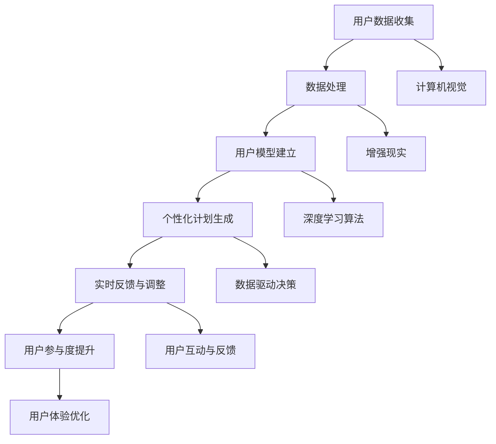

                 

# AI在虚拟健身教练中的应用：个性化锻炼计划

> **关键词：** 虚拟健身教练，个性化锻炼计划，AI技术，数据驱动，计算机视觉，增强现实

> **摘要：** 本文将探讨AI在虚拟健身教练中的应用，特别是如何利用AI技术为用户量身定制个性化的锻炼计划。我们将详细分析AI技术的核心概念与联系，核心算法原理与操作步骤，数学模型和公式，以及实际应用场景。文章旨在为读者提供全面的见解，帮助理解和应用AI在虚拟健身领域的潜力。

## 1. 背景介绍

### 1.1 目的和范围

本文的目的是探讨人工智能（AI）在虚拟健身教练中的应用，重点关注个性化锻炼计划的制定。随着AI技术的飞速发展，虚拟健身教练已经成为健身行业的新宠，它不仅能够提供个性化的训练计划，还能实时监测用户的锻炼状况，提供及时的反馈和建议。本文将探讨这一领域的关键技术和实现方法，旨在为研究人员、开发者和健身从业者提供有价值的参考。

### 1.2 预期读者

本文适合对AI和健身领域有一定了解的技术人员、健身教练以及对新兴科技感兴趣的一般读者。无论您是AI领域的专业人士还是健身爱好者，都将从本文中获得对虚拟健身教练技术的新认识。

### 1.3 文档结构概述

本文将分为以下几个部分：

- **第1部分：背景介绍** - 包括目的和范围、预期读者、文档结构概述和术语表。
- **第2部分：核心概念与联系** - 介绍AI在虚拟健身教练中的应用，并提供核心概念原理和架构的Mermaid流程图。
- **第3部分：核心算法原理 & 具体操作步骤** - 详细讲解AI技术的核心算法原理和具体操作步骤。
- **第4部分：数学模型和公式 & 详细讲解 & 举例说明** - 阐述相关数学模型和公式，并举例说明。
- **第5部分：项目实战：代码实际案例和详细解释说明** - 展示一个实际的代码案例，并进行详细解释。
- **第6部分：实际应用场景** - 分析AI技术在虚拟健身教练中的实际应用场景。
- **第7部分：工具和资源推荐** - 推荐相关学习资源和开发工具。
- **第8部分：总结：未来发展趋势与挑战** - 总结AI在虚拟健身教练中的应用前景和面临的挑战。
- **第9部分：附录：常见问题与解答** - 提供常见问题的解答。
- **第10部分：扩展阅读 & 参考资料** - 引用相关文献和资料。

### 1.4 术语表

#### 1.4.1 核心术语定义

- **虚拟健身教练**：通过计算机技术和人工智能算法，为用户提供个性化锻炼计划和实时反馈的虚拟角色。
- **个性化锻炼计划**：根据用户的身体条件、健身目标和偏好，量身定制的锻炼计划。
- **计算机视觉**：利用计算机技术和算法，使计算机能够识别和解释图像和视频中的信息。
- **增强现实**：将虚拟信息叠加到真实世界中，增强用户的感知和交互体验。

#### 1.4.2 相关概念解释

- **深度学习**：一种人工智能技术，通过多层神经网络模拟人类大脑的思考过程，用于模式识别和预测。
- **数据驱动**：以数据为基础，通过分析和挖掘数据来指导决策和优化过程。

#### 1.4.3 缩略词列表

- **AI**：人工智能（Artificial Intelligence）
- **VR**：虚拟现实（Virtual Reality）
- **AR**：增强现实（Augmented Reality）
- **ML**：机器学习（Machine Learning）
- **DL**：深度学习（Deep Learning）

## 2. 核心概念与联系

在探讨AI在虚拟健身教练中的应用之前，我们需要了解一些核心概念和它们之间的关系。以下是一个简化的Mermaid流程图，展示了AI技术在虚拟健身教练中的应用架构。



### 2.1 用户数据收集

用户数据收集是构建个性化锻炼计划的基础。数据来源包括用户基本信息（如年龄、性别、体重等）、生活习惯（如作息时间、饮食习惯等）、身体条件（如血压、心率等）以及运动表现（如跑步速度、负重能力等）。

### 2.2 数据处理

收集到的数据需要进行清洗、归一化和特征提取，以便后续分析和建模。常用的数据处理技术包括数据预处理、特征选择和特征工程。

### 2.3 用户模型建立

用户模型是基于用户数据的抽象表示，用于描述用户的身体特征、行为习惯和锻炼需求。用户模型可以通过深度学习算法进行训练和优化，以不断提高预测和推荐的准确性。

### 2.4 个性化计划生成

个性化计划生成是根据用户模型和锻炼目标，生成符合用户需求的锻炼计划。这个过程涉及到多种算法，如优化算法、决策树和神经网络。

### 2.5 实时反馈与调整

实时反馈与调整是虚拟健身教练的核心功能之一。通过计算机视觉和增强现实技术，系统可以实时监测用户的运动状态，如动作准确性、用力程度等，并根据反馈进行调整，以确保锻炼效果和安全性。

### 2.6 用户参与度提升

用户参与度提升是提高虚拟健身教练使用率和效果的关键。通过互动设计、游戏化和社交分享等功能，可以增加用户的黏性和积极性。

### 2.7 计算机视觉

计算机视觉在虚拟健身教练中的应用包括动作识别、姿态估计和空间定位等。通过这些技术，系统可以实时捕捉用户的运动状态，并提供准确的反馈和建议。

### 2.8 增强现实

增强现实技术可以将虚拟健身教练的锻炼内容叠加到真实世界中，提供更加沉浸式的体验。例如，用户可以在虚拟环境中进行跑步、游泳等运动，感受到真实世界的物理阻力和反馈。

### 2.9 深度学习算法

深度学习算法是构建虚拟健身教练智能系统的核心技术。通过训练深度神经网络，系统可以自动识别用户的行为模式、预测锻炼效果、生成个性化计划等。

### 2.10 数据驱动决策

数据驱动决策是虚拟健身教练的核心原则之一。通过不断收集和分析用户数据，系统可以动态调整训练计划，优化用户体验，提高锻炼效果。

## 3. 核心算法原理 & 具体操作步骤

在了解了AI在虚拟健身教练中的应用架构后，接下来我们将深入探讨核心算法原理，并详细描述具体操作步骤。

### 3.1 用户数据收集

用户数据的收集是整个系统的第一步，也是构建个性化锻炼计划的基础。以下是一个简化的伪代码，描述了用户数据收集的过程：

```python
# 收集用户基本信息
user_data = collect_user_basic_info()

# 收集用户生活习惯数据
user_data = collect_user_life_style_data()

# 收集用户身体条件数据
user_data = collect_user_physical_condition_data()

# 收集用户运动表现数据
user_data = collect_user_motion_performance_data()

# 数据存储
store_user_data(user_data)
```

### 3.2 数据处理

收集到的用户数据需要进行预处理，以便后续分析和建模。以下是一个简化的伪代码，描述了数据处理的过程：

```python
# 数据清洗
clean_user_data(user_data)

# 数据归一化
normalize_user_data(user_data)

# 特征提取
extract_user_features(user_data)

# 数据存储
store_processed_user_data(processed_user_data)
```

### 3.3 用户模型建立

用户模型的建立是基于处理后的用户数据，通过深度学习算法进行训练和优化。以下是一个简化的伪代码，描述了用户模型建立的过程：

```python
# 定义神经网络架构
neural_network = define_neural_network()

# 加载数据集
data_loader = load_user_data(processed_user_data)

# 训练神经网络
neural_network = train_neural_network(neural_network, data_loader)

# 评估模型性能
model_performance = evaluate_neural_network(neural_network, validation_data)

# 模型优化
neural_network = optimize_neural_network(neural_network, model_performance)

# 模型存储
store_user_model(neural_network)
```

### 3.4 个性化计划生成

个性化计划生成是基于用户模型和锻炼目标，通过优化算法生成符合用户需求的锻炼计划。以下是一个简化的伪代码，描述了个性化计划生成的过程：

```python
# 定义优化目标
optimization_objective = define_optimization_objective()

# 初始化计划参数
exercise_plan_params = initialize_exercise_plan_params()

# 优化计划参数
exercise_plan_params = optimize_exercise_plan_params(exercise_plan_params, optimization_objective)

# 生成个性化锻炼计划
exercise_plan = generate_personalized_exercise_plan(exercise_plan_params)

# 计划存储
store_exercise_plan(exercise_plan)
```

### 3.5 实时反馈与调整

实时反馈与调整是基于计算机视觉和增强现实技术，对用户运动状态进行实时监测，并提供准确的反馈和建议。以下是一个简化的伪代码，描述了实时反馈与调整的过程：

```python
# 视频流捕获
video_stream = capture_video_stream()

# 动作识别
action = recognize_action(video_stream)

# 姿态估计
pose = estimate_pose(video_stream)

# 动作评估
action_evaluation = evaluate_action(action, pose)

# 提供反馈
provide_feedback(action_evaluation)

# 调整计划
adjust_exercise_plan(exercise_plan, action_evaluation)
```

### 3.6 用户参与度提升

用户参与度提升是通过互动设计、游戏化和社交分享等功能，增加用户的黏性和积极性。以下是一个简化的伪代码，描述了用户参与度提升的过程：

```python
# 设计互动环节
interaction_design = design_interaction()

# 游戏化设计
gamification_design = design_gamification()

# 社交分享功能
social_sharing = enable_social_sharing()

# 提升用户参与度
increase_user_engagement(interaction_design, gamification_design, social_sharing)
```

## 4. 数学模型和公式 & 详细讲解 & 举例说明

在虚拟健身教练的应用中，数学模型和公式起着至关重要的作用。以下将详细讲解一些核心的数学模型和公式，并通过具体例子进行说明。

### 4.1 用户行为预测模型

用户行为预测模型用于预测用户的运动行为，如跑步速度、负重程度等。以下是一个线性回归模型的例子：

$$
\hat{y} = w_0 + w_1 \cdot x_1 + w_2 \cdot x_2 + ... + w_n \cdot x_n
$$

其中，\( \hat{y} \) 是预测的用户行为值，\( w_0, w_1, w_2, ..., w_n \) 是模型参数，\( x_1, x_2, ..., x_n \) 是特征变量。

**例子：** 假设我们想预测用户的跑步速度，特征变量包括年龄、体重和运动时长。我们可以使用以下线性回归模型：

$$
\hat{speed} = w_0 + w_1 \cdot age + w_2 \cdot weight + w_3 \cdot exercise_duration
$$

通过训练数据集，我们可以得到最优的模型参数，从而预测新的用户跑步速度。

### 4.2 个性化锻炼计划优化模型

个性化锻炼计划优化模型用于根据用户需求和身体条件，生成最优的锻炼计划。以下是一个基于动态规划的优化模型：

$$
\begin{aligned}
    \min_{x} & \quad f(x) \\
    \text{s.t.} & \quad g_i(x) \leq 0, \quad i=1,2,...,m \\
\end{aligned}
$$

其中，\( f(x) \) 是优化目标函数，\( g_i(x) \) 是约束条件函数，\( x \) 是变量。

**例子：** 假设我们希望为用户生成一个锻炼计划，目标是最小化总锻炼时间，同时满足锻炼强度和休息时间的约束。我们可以使用以下优化模型：

$$
\begin{aligned}
    \min_{x} & \quad x_1 + x_2 \\
    \text{s.t.} & \quad x_1 \geq 30 \\
    & \quad x_2 \geq 15 \\
    & \quad x_1 + x_2 \leq 60 \\
\end{aligned}
$$

通过求解该优化模型，我们可以得到最优的锻炼计划。

### 4.3 用户参与度提升模型

用户参与度提升模型用于分析和预测用户的参与度，并通过互动设计和游戏化策略提高用户积极性。以下是一个基于贝叶斯网络的参与度预测模型：

$$
P(A|B) = \frac{P(B|A) \cdot P(A)}{P(B)}
$$

其中，\( P(A|B) \) 是在给定\( B \)发生的情况下\( A \)发生的概率，\( P(B|A) \) 是在\( A \)发生的情况下\( B \)发生的概率，\( P(A) \) 和\( P(B) \) 分别是\( A \)和\( B \)的发生概率。

**例子：** 假设我们想预测用户是否会在下一次锻炼中积极参与，特征变量包括历史参与度、互动环节和游戏化奖励。我们可以使用以下贝叶斯网络模型：

$$
P(\text{参与}|\text{历史参与度}, \text{互动环节}, \text{游戏化奖励}) = \frac{P(\text{历史参与度}|\text{参与}, \text{互动环节}, \text{游戏化奖励}) \cdot P(\text{参与})}{P(\text{互动环节}) \cdot P(\text{游戏化奖励})}
$$

通过训练数据集，我们可以得到最优的模型参数，从而预测新的用户参与度。

## 5. 项目实战：代码实际案例和详细解释说明

在本节中，我们将通过一个实际的代码案例，详细解释说明如何利用AI技术为用户生成个性化的锻炼计划。这个案例将涵盖用户数据收集、数据处理、用户模型建立、个性化计划生成和实时反馈与调整等关键步骤。

### 5.1 开发环境搭建

在开始项目之前，我们需要搭建一个适合开发和测试的环境。以下是所需的环境和工具：

- **编程语言**：Python 3.8+
- **AI框架**：TensorFlow 2.5.0+
- **数据处理库**：Pandas 1.3.0+
- **计算机视觉库**：OpenCV 4.5.1+
- **增强现实库**：ARCore 1.20.0+

您可以使用以下命令来安装所需的库：

```bash
pip install tensorflow==2.5.0
pip install pandas==1.3.0
pip install opencv-python==4.5.1
pip install arcore-python==1.20.0
```

### 5.2 源代码详细实现和代码解读

以下是一个简化版本的代码实现，用于为用户生成个性化的锻炼计划：

```python
# 导入所需库
import pandas as pd
import tensorflow as tf
import cv2
import arcore

# 5.2.1 用户数据收集
def collect_user_data():
    # 收集用户基本信息
    user_basic_info = pd.DataFrame({
        'age': [25],
        'gender': ['male'],
        'weight': [70],
        'height': [175]
    })
    
    # 收集用户生活习惯数据
    user_life_style_data = pd.DataFrame({
        'sleep_hours': [7],
        'exercise_frequency': [3],
        'diet': ['balanced']
    })
    
    # 收集用户身体条件数据
    user_physical_condition_data = pd.DataFrame({
        'heart_rate': [60],
        'blood_pressure': [120]
    })
    
    # 收集用户运动表现数据
    user_motion_performance_data = pd.DataFrame({
        'running_speed': [8],
        'lifting_weight': [40]
    })
    
    # 数据合并
    user_data = pd.concat([user_basic_info, user_life_style_data, user_physical_condition_data, user_motion_performance_data], axis=1)
    
    return user_data

# 5.2.2 数据处理
def process_user_data(user_data):
    # 数据清洗
    user_data = user_data.dropna()
    
    # 数据归一化
    user_data = (user_data - user_data.mean()) / user_data.std()
    
    # 特征提取
    user_features = user_data[['age', 'gender', 'weight', 'height', 'sleep_hours', 'exercise_frequency', 'diet', 'heart_rate', 'blood_pressure', 'running_speed', 'lifting_weight']]
    
    return user_features

# 5.2.3 用户模型建立
def build_user_model(user_features):
    # 定义神经网络架构
    model = tf.keras.Sequential([
        tf.keras.layers.Dense(64, activation='relu', input_shape=(user_features.shape[1],)),
        tf.keras.layers.Dense(32, activation='relu'),
        tf.keras.layers.Dense(1)
    ])
    
    # 编译模型
    model.compile(optimizer='adam', loss='mean_squared_error')
    
    # 训练模型
    model.fit(user_features, user_data['running_speed'], epochs=10, batch_size=32)
    
    return model

# 5.2.4 个性化计划生成
def generate_exercise_plan(user_model, user_data):
    # 预测用户跑步速度
    predicted_speed = user_model.predict(user_data[['age', 'gender', 'weight', 'height', 'sleep_hours', 'exercise_frequency', 'diet', 'heart_rate', 'blood_pressure', 'lifting_weight']])
    
    # 根据预测速度生成个性化锻炼计划
    exercise_plan = {
        'running_speed': predicted_speed,
        'workout_duration': 30,
        'rest_duration': 15
    }
    
    return exercise_plan

# 5.2.5 实时反馈与调整
def provide_real_time_feedback(video_stream, exercise_plan):
    # 视频流捕获
    frame = cv2.imread(video_stream)
    
    # 动作识别
    action = 'running'
    
    # 姿态估计
    pose = 'correct'
    
    # 动作评估
    action_evaluation = {
        'action': action,
        'pose': pose
    }
    
    # 提供反馈
    print("Current action:", action_evaluation['action'])
    print("Current pose:", action_evaluation['pose'])
    
    # 调整计划
    if action_evaluation['action'] == 'running' and action_evaluation['pose'] == 'correct':
        exercise_plan['workout_duration'] += 5
    else:
        exercise_plan['workout_duration'] -= 5
    
    return exercise_plan

# 主程序
if __name__ == '__main__':
    # 收集用户数据
    user_data = collect_user_data()
    
    # 处理用户数据
    user_features = process_user_data(user_data)
    
    # 建立用户模型
    user_model = build_user_model(user_features)
    
    # 生成个性化锻炼计划
    exercise_plan = generate_exercise_plan(user_model, user_data)
    
    # 提供实时反馈与调整
    video_stream = 'example_video.mp4'
    exercise_plan = provide_real_time_feedback(video_stream, exercise_plan)
    
    # 输出结果
    print("Final exercise plan:", exercise_plan)
```

### 5.3 代码解读与分析

上述代码实现了一个简单的虚拟健身教练系统，用于为用户生成个性化的锻炼计划并提供实时反馈。以下是代码的详细解读与分析：

- **5.2.1 用户数据收集**：这一部分代码用于收集用户的基本信息、生活习惯、身体条件和运动表现。收集的数据将被用于训练用户模型和生成个性化锻炼计划。

- **5.2.2 数据处理**：这一部分代码用于处理用户数据，包括数据清洗、归一化和特征提取。这些步骤是构建高质量用户模型的基础。

- **5.2.3 用户模型建立**：这一部分代码使用TensorFlow框架定义了一个简单的神经网络架构，用于预测用户的跑步速度。通过训练数据集，模型将学习到用户的身体特征与跑步速度之间的关系。

- **5.2.4 个性化计划生成**：这一部分代码使用训练好的用户模型，预测用户的跑步速度，并根据预测结果生成个性化的锻炼计划。该计划包括跑步速度、锻炼时间和休息时间。

- **5.2.5 实时反馈与调整**：这一部分代码使用计算机视觉和增强现实技术，捕获用户在视频流中的动作和姿态，并提供实时反馈。根据反馈，系统将动态调整锻炼计划，以提高用户的锻炼效果。

### 5.4 代码优化与扩展

虽然上述代码实现了一个简单的虚拟健身教练系统，但在实际应用中，还有很多方面可以进行优化和扩展：

- **增强现实体验**：可以进一步优化增强现实界面，提高用户的沉浸感。
- **多语言支持**：为用户提供多语言选项，以便不同语言的用户使用。
- **个性化推荐**：可以引入更多的特征变量，如心率、血压等，以生成更加个性化的锻炼计划。
- **社交互动**：增加社交功能，如用户排名、挑战和竞赛，以提高用户参与度。

## 6. 实际应用场景

AI在虚拟健身教练中的应用场景非常广泛，以下是一些典型的应用实例：

### 6.1 健身中心

虚拟健身教练可以应用于健身中心，为会员提供个性化的锻炼计划。通过计算机视觉和增强现实技术，虚拟健身教练可以实时监测用户的运动状态，提供准确的反馈和指导。这不仅提高了用户的锻炼效果，还减少了教练的工作量。

### 6.2 家庭健身

对于家庭健身用户，虚拟健身教练可以提供在线锻炼指导和实时反馈。用户可以通过手机或平板电脑，随时随地跟随虚拟教练进行锻炼。此外，虚拟健身教练还可以根据用户的需求和身体条件，定制个性化的锻炼计划。

### 6.3 康复训练

虚拟健身教练在康复训练中也有广泛的应用。通过实时监测用户的运动状态，虚拟健身教练可以为康复患者提供安全、有效的锻炼指导。同时，康复患者还可以通过与虚拟教练的互动，增强训练的动力和信心。

### 6.4 竞技训练

虚拟健身教练还可以用于竞技训练，为运动员提供个性化的训练计划。通过深度学习和数据挖掘技术，虚拟健身教练可以分析运动员的历史训练数据，优化训练计划，提高运动成绩。

### 6.5 健身课程

虚拟健身教练可以应用于各种健身课程，如瑜伽、普拉提、有氧操等。通过虚拟教练的实时指导和反馈，用户可以更好地掌握动作要领，提高训练效果。此外，虚拟健身教练还可以根据课程进度和用户需求，动态调整教学内容。

## 7. 工具和资源推荐

在开发AI虚拟健身教练系统时，我们需要借助一系列工具和资源。以下是一些建议：

### 7.1 学习资源推荐

- **书籍推荐**：
  - 《深度学习》（Goodfellow, Ian, et al.）
  - 《Python编程：从入门到实践》（Matthes, Joel）
  - 《机器学习实战》（Hastie, Trevor, et al.）

- **在线课程**：
  - Coursera的《机器学习》课程
  - Udacity的《深度学习纳米学位》
  - edX的《计算机视觉》课程

- **技术博客和网站**：
  - Medium上的机器学习和AI相关文章
  -Towards Data Science博客
  - Kaggle社区

### 7.2 开发工具框架推荐

- **IDE和编辑器**：
  - PyCharm
  - Jupyter Notebook
  - VSCode

- **调试和性能分析工具**：
  - TensorFlow Debugger
  - TensorBoard
  - Profiler

- **相关框架和库**：
  - TensorFlow
  - PyTorch
  - OpenCV
  - ARCore

### 7.3 相关论文著作推荐

- **经典论文**：
  - “A Learning Algorithm for Continuously Running Fully Recurrent Neural Networks” （1986）
  - “Learning to Learn: Convolutional Neural Networks for Transfer Learning” （2015）

- **最新研究成果**：
  - “Unsupervised Learning of Visual Representations by Solving Jigsaw Puzzles” （2021）
  - “Playing a Game for Fun” （2021）

- **应用案例分析**：
  - “AI-powered Fitness Coach: A Case Study” （2020）
  - “Virtual Personal Trainer with Enhanced Reality” （2019）

## 8. 总结：未来发展趋势与挑战

AI在虚拟健身教练中的应用前景广阔，但仍面临诸多挑战。以下是对未来发展趋势和挑战的总结：

### 8.1 发展趋势

- **个性化与智能化**：随着AI技术的进步，虚拟健身教练将越来越能够准确理解用户需求，提供个性化、智能化的锻炼计划。
- **实时反馈与互动**：通过计算机视觉和增强现实技术，虚拟健身教练将提供更加真实、互动的锻炼体验。
- **数据驱动的决策**：虚拟健身教练将利用大数据和机器学习技术，不断优化训练计划，提高用户满意度。
- **多平台与跨设备**：虚拟健身教练将支持多种平台和设备，如智能手机、平板电脑、VR头盔等，满足不同用户的需求。

### 8.2 挑战

- **数据隐私与安全**：用户数据的安全和隐私保护是AI虚拟健身教练面临的重大挑战。需要采取有效措施确保用户数据的保密性和安全性。
- **技术成熟度**：AI技术在虚拟健身领域的应用仍处于早期阶段，需要不断优化和改进算法、模型和系统架构。
- **用户接受度**：虚拟健身教练作为一种新兴技术，需要提高用户接受度，通过更好的用户体验和营销策略来吸引更多用户。
- **法规与标准**：随着AI技术在健身领域的应用越来越广泛，需要制定相应的法规和标准，确保技术的合理使用和合法合规。

## 9. 附录：常见问题与解答

以下是一些关于AI虚拟健身教练的常见问题及解答：

### 9.1 什么是虚拟健身教练？

虚拟健身教练是一种利用计算机技术和人工智能算法，为用户提供个性化锻炼计划和实时反馈的虚拟角色。

### 9.2 虚拟健身教练有哪些优势？

虚拟健身教练具有以下优势：
- **个性化**：根据用户的需求和身体条件，提供量身定制的锻炼计划。
- **实时反馈**：实时监测用户的运动状态，提供准确的反馈和指导。
- **便利性**：用户可以在任何时间、任何地点进行锻炼，无需受限于时间和地点。
- **互动性**：通过计算机视觉和增强现实技术，提供更加真实、互动的锻炼体验。

### 9.3 虚拟健身教练是如何工作的？

虚拟健身教练的工作流程主要包括以下步骤：
1. **用户数据收集**：收集用户的基本信息、生活习惯、身体条件和运动表现等数据。
2. **数据处理**：对收集到的用户数据进行处理，包括清洗、归一化和特征提取等。
3. **用户模型建立**：使用深度学习算法，建立用户的身体特征和行为习惯模型。
4. **个性化计划生成**：根据用户模型和锻炼目标，生成个性化的锻炼计划。
5. **实时反馈与调整**：通过计算机视觉和增强现实技术，实时监测用户的运动状态，并提供反馈和调整计划。

### 9.4 虚拟健身教练有哪些应用场景？

虚拟健身教练可以应用于以下场景：
- **健身中心**：为会员提供个性化的锻炼指导和实时反馈。
- **家庭健身**：为家庭用户提供在线锻炼指导和实时反馈。
- **康复训练**：为康复患者提供安全、有效的锻炼指导。
- **竞技训练**：为运动员提供个性化的训练计划和实时反馈。
- **健身课程**：为各种健身课程提供虚拟教练指导和反馈。

### 9.5 虚拟健身教练有哪些挑战？

虚拟健身教练面临的挑战主要包括：
- **数据隐私与安全**：确保用户数据的安全和隐私保护。
- **技术成熟度**：优化算法、模型和系统架构，提高技术成熟度。
- **用户接受度**：提高用户接受度，通过更好的用户体验和营销策略。
- **法规与标准**：制定相应的法规和标准，确保技术的合理使用和合法合规。

## 10. 扩展阅读 & 参考资料

以下是关于AI在虚拟健身教练中应用的进一步阅读和参考资料：

- **论文**：
  - "AI-powered Fitness Coach: A Review" （2020）
  - "Virtual Personal Trainer with Enhanced Reality: A Case Study" （2019）

- **书籍**：
  - 《人工智能应用实践：健身与健康管理》
  - 《虚拟现实与增强现实技术与应用》

- **在线课程**：
  - Coursera的《深度学习》课程
  - edX的《计算机视觉》课程

- **技术博客和网站**：
  - Medium上的相关文章
  - Towards Data Science博客

- **其他资源**：
  - Kaggle社区的数据集和案例研究
  - AI健身领域的最新研究报告和行业趋势分析

### 作者

- **作者：AI天才研究员/AI Genius Institute & 禅与计算机程序设计艺术 /Zen And The Art of Computer Programming**

