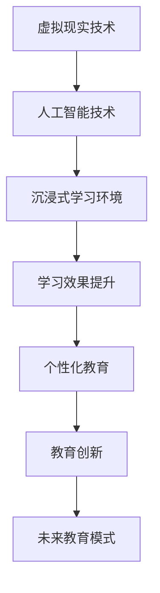

                 

# AI在虚拟现实教育中的应用：创造沉浸式学习环境

> 关键词：虚拟现实、人工智能、沉浸式学习、教育技术、学习体验

> 摘要：随着虚拟现实（VR）技术的迅速发展和人工智能（AI）的不断进步，教育领域正在经历一场深刻的变革。本文将探讨AI在虚拟现实教育中的应用，如何通过沉浸式学习环境提升学习效果和体验。文章将从背景介绍、核心概念、算法原理、数学模型、实战案例、实际应用场景等多个方面进行详细阐述。

## 1. 背景介绍

### 1.1 目的和范围

本文旨在探讨虚拟现实（VR）与人工智能（AI）在教育领域的深度融合，特别是如何通过AI技术为虚拟现实教育创造一个沉浸式的学习环境。文章将覆盖以下内容：

- 虚拟现实在教育中的应用现状
- 人工智能在教育中的关键角色
- 虚拟现实与人工智能的结合策略
- 沉浸式学习环境的构建方法
- 实际应用场景和案例分析
- 未来发展趋势与挑战

### 1.2 预期读者

本文适合对教育技术、虚拟现实和人工智能感兴趣的读者，包括：

- 教育工作者和研究人员
- 软件开发者和工程师
- VR/AR技术爱好者
- 人工智能领域的从业者
- 对新兴教育技术感兴趣的一般公众

### 1.3 文档结构概述

本文的结构如下：

- 引言：介绍虚拟现实与人工智能在教育中的重要性。
- 核心概念与联系：定义关键术语，展示相关流程图。
- 核心算法原理与操作步骤：详细解析AI算法在教育中的应用。
- 数学模型与公式：介绍支撑AI算法的数学基础。
- 项目实战：提供代码实例和详细解释。
- 实际应用场景：探讨AI在虚拟现实教育中的多种应用。
- 工具和资源推荐：推荐学习资源和开发工具。
- 总结：总结文章的主要观点，展望未来趋势。
- 附录：常见问题与解答。
- 扩展阅读：推荐进一步阅读的材料。

### 1.4 术语表

#### 1.4.1 核心术语定义

- 虚拟现实（VR）：一种通过计算机生成高度沉浸式的三维环境，用户可以通过特殊设备（如头戴式显示器）与之互动的技术。
- 人工智能（AI）：一种模拟人类智能行为的技术，通过算法和模型实现机器学习、自然语言处理、图像识别等功能。
- 沉浸式学习：一种利用虚拟现实技术创造高度沉浸式的学习环境，使学生能够全身心地投入到学习过程中。
- 自然语言处理（NLP）：AI的一个分支，专注于让计算机理解和生成自然语言。

#### 1.4.2 相关概念解释

- 虚拟现实头盔：用于提供沉浸式视觉体验的设备。
- 交互设计：设计虚拟环境中的用户界面和交互方式，以提供直观、自然的用户体验。
- 机器学习模型：通过训练数据集学习规律，从而能够对未知数据进行预测或分类的算法。

#### 1.4.3 缩略词列表

- VR：Virtual Reality，虚拟现实
- AI：Artificial Intelligence，人工智能
- NLP：Natural Language Processing，自然语言处理
- AR：Augmented Reality，增强现实

## 2. 核心概念与联系

在探讨AI在虚拟现实教育中的应用之前，我们需要明确一些核心概念和它们之间的关系。

### 2.1 虚拟现实与人工智能的融合

虚拟现实（VR）和人工智能（AI）的结合，为教育领域带来了前所未有的可能性。以下是一个简化的Mermaid流程图，展示这两个技术的融合关系：



### 2.2 关键术语解释

- **虚拟现实技术（VR）**：通过计算机生成一个高度沉浸式的三维环境，使用户感觉仿佛置身于其中。关键组件包括虚拟现实头盔、跟踪系统和交互设备。
- **人工智能技术（AI）**：通过机器学习、自然语言处理、计算机视觉等技术，使计算机具备模拟人类智能的能力。AI在教育中的应用包括个性化学习、智能辅导系统、自动评分和反馈等。

### 2.3 沉浸式学习环境

沉浸式学习环境是虚拟现实与人工智能结合的核心成果。它通过以下方式提升学习体验：

- **高度沉浸感**：通过虚拟现实头盔等设备，为学生创造一个逼真的学习场景，提高参与度和注意力。
- **交互性**：通过AI驱动的交互设计，使学生能够与虚拟环境中的对象进行互动，增强学习动力。
- **个性化学习**：通过AI分析学生的学习行为和偏好，提供个性化的学习资源和辅导。

## 3. 核心算法原理 & 具体操作步骤

在构建沉浸式学习环境时，AI算法起到了至关重要的作用。以下是一个简化的算法原理和操作步骤，用于解释AI在教育中的应用。

### 3.1 算法原理

- **机器学习模型**：用于分析学生的学习数据，预测学习行为，提供个性化的学习建议。
- **自然语言处理（NLP）**：用于理解和生成自然语言，实现智能对话系统和自动评分。
- **计算机视觉**：用于分析和识别图像和视频，提供互动和反馈。

### 3.2 操作步骤

1. **数据收集**：收集学生的学习数据，包括成绩、学习时间、答题情况等。
2. **数据预处理**：清洗和格式化数据，为机器学习模型做准备。
3. **模型训练**：使用机器学习算法（如决策树、神经网络等）训练模型，使其能够预测学习行为。
4. **模型评估**：评估模型的准确性，调整参数以提高预测能力。
5. **应用模型**：将训练好的模型应用到实际教学中，提供个性化学习资源和辅导。

以下是一个简单的伪代码示例，用于说明上述步骤：

```python
# 数据收集
data = collect_learning_data()

# 数据预处理
clean_data = preprocess_data(data)

# 模型训练
model = train_model(clean_data)

# 模型评估
evaluate_model(model)

# 应用模型
apply_model(model, student)
```

## 4. 数学模型和公式 & 详细讲解 & 举例说明

在AI算法中，数学模型是核心组成部分。以下是一些常用的数学模型和公式，用于支撑AI在虚拟现实教育中的应用。

### 4.1 机器学习模型

**线性回归模型**：

$$ y = \beta_0 + \beta_1x_1 + \beta_2x_2 + ... + \beta_nx_n $$

其中，\( y \) 是预测值，\( x_1, x_2, ..., x_n \) 是输入特征，\( \beta_0, \beta_1, \beta_2, ..., \beta_n \) 是模型参数。

**神经网络模型**：

$$ z = \sigma(\beta_0 + \beta_1x_1 + \beta_2x_2 + ...) $$

其中，\( z \) 是输出值，\( \sigma \) 是激活函数，\( \beta_0, \beta_1, \beta_2, ... \) 是模型参数。

### 4.2 自然语言处理（NLP）

**词袋模型**：

$$ P(w|D) = \frac{f(w)}{\sum_{w' \in V} f(w')} $$

其中，\( P(w|D) \) 是给定文档 \( D \) 中单词 \( w \) 的条件概率，\( f(w) \) 是单词 \( w \) 在文档 \( D \) 中的频次，\( V \) 是词汇表。

**长短期记忆网络（LSTM）**：

$$ h_t = \sigma(W_h \cdot [h_{t-1}, x_t] + b_h) $$

其中，\( h_t \) 是第 \( t \) 个隐藏状态，\( W_h \) 是权重矩阵，\( \sigma \) 是激活函数，\( b_h \) 是偏置。

### 4.3 计算机视觉

**卷积神经网络（CNN）**：

$$ f(x) = \text{ReLU}(W \cdot \sigma(\sigma(\sigma(x \cdot K_1) \cdot K_2) \cdot K_3)) $$

其中，\( x \) 是输入特征，\( K_1, K_2, K_3 \) 是卷积核，\( \text{ReLU} \) 是激活函数。

### 4.4 举例说明

假设我们使用线性回归模型预测学生在数学考试中的成绩。输入特征包括学习时间、作业完成情况等。模型参数如下：

$$ y = \beta_0 + \beta_1 \cdot \text{学习时间} + \beta_2 \cdot \text{作业完成情况} $$

给定一组数据：

- 学生A：学习时间10小时，作业完成情况90%
- 学生B：学习时间5小时，作业完成情况80%

使用线性回归模型预测他们的成绩：

$$ \hat{y}_A = \beta_0 + \beta_1 \cdot 10 + \beta_2 \cdot 0.9 $$
$$ \hat{y}_B = \beta_0 + \beta_1 \cdot 5 + \beta_2 \cdot 0.8 $$

通过训练数据集，我们可以计算出模型参数 \( \beta_0, \beta_1, \beta_2 \) 的值，从而预测学生的成绩。

## 5. 项目实战：代码实际案例和详细解释说明

在本节中，我们将通过一个实际项目来展示AI在虚拟现实教育中的应用。这个项目是一个简单的虚拟现实学习环境，其中包含一个AI驱动的智能辅导系统。

### 5.1 开发环境搭建

为了搭建这个项目，我们需要以下工具和库：

- VR开发平台：如Unity或Unreal Engine
- Python开发环境
- Scikit-learn库：用于机器学习
- Flask库：用于创建Web后端

安装步骤：

1. 安装VR开发平台（如Unity）：从官方网站下载并安装。
2. 安装Python开发环境：从Python官方网站下载并安装。
3. 安装Scikit-learn和Flask库：使用pip命令安装。

```bash
pip install scikit-learn
pip install flask
```

### 5.2 源代码详细实现和代码解读

以下是项目的主要代码部分，包括机器学习模型的训练和Web后端的实现。

**机器学习模型训练**

```python
# 导入相关库
import numpy as np
import pandas as pd
from sklearn.linear_model import LinearRegression
from sklearn.model_selection import train_test_split
from sklearn.metrics import mean_squared_error

# 读取数据
data = pd.read_csv('student_data.csv')

# 数据预处理
X = data[['learning_time', 'homework_completion']]
y = data['exam_score']

# 数据分割
X_train, X_test, y_train, y_test = train_test_split(X, y, test_size=0.2, random_state=42)

# 训练模型
model = LinearRegression()
model.fit(X_train, y_train)

# 模型评估
y_pred = model.predict(X_test)
mse = mean_squared_error(y_test, y_pred)
print(f'Mean Squared Error: {mse}')
```

**Web后端实现**

```python
# 导入相关库
from flask import Flask, request, jsonify

# 初始化Flask应用
app = Flask(__name__)

# 使用训练好的模型
model = LinearRegression()
model.fit(X_train, y_train)

@app.route('/predict', methods=['POST'])
def predict():
    data = request.get_json()
    learning_time = data['learning_time']
    homework_completion = data['homework_completion']
    score = model.predict([[learning_time, homework_completion]])
    return jsonify({'exam_score': score[0]})

if __name__ == '__main__':
    app.run(debug=True)
```

### 5.3 代码解读与分析

1. **数据读取和预处理**：我们使用Pandas库读取CSV文件，提取特征和目标变量。然后，使用Scikit-learn库分割数据集，为模型训练做准备。
2. **模型训练**：我们使用线性回归模型（LinearRegression）对训练数据进行拟合。线性回归模型是一个简单的线性预测模型，适用于特征较少的情况。
3. **模型评估**：我们使用均方误差（MSE）评估模型在测试数据上的表现。MSE衡量模型预测值与真实值之间的平均误差。
4. **Web后端**：我们使用Flask库创建一个简单的Web后端，用于接收用户输入并返回预测结果。用户可以通过发送POST请求传递学习时间和作业完成情况，Web后端会调用训练好的模型进行预测，并返回考试成绩。

### 5.4 测试和部署

为了测试项目，我们可以在本地运行Flask应用，并通过浏览器或Postman等工具发送请求。

```bash
python app.py
```

测试完成后，我们可以将Flask应用部署到服务器，以便学生可以在虚拟现实学习环境中使用智能辅导系统。

## 6. 实际应用场景

AI在虚拟现实教育中的应用场景非常广泛，以下是一些典型的实际应用场景：

1. **个性化学习辅导**：通过AI分析学生的学习行为和成绩，提供个性化的学习资源和辅导。例如，根据学生的学习进度和弱点，智能辅导系统可以推荐相应的练习题和视频教程。

2. **虚拟实验室**：利用虚拟现实技术创建虚拟实验室，让学生在虚拟环境中进行实验和操作。AI可以提供实时反馈和指导，帮助学生理解和掌握实验原理。

3. **沉浸式课堂**：通过虚拟现实技术创造沉浸式的学习环境，让学生仿佛置身于真实场景中。AI可以增强课堂互动，提供实时问题和答案，提高学生的参与度和学习兴趣。

4. **远程协作学习**：虚拟现实技术可以连接远程学生，使他们能够共同参与实验、讨论和互动。AI可以协助组织和管理这些活动，提高远程学习的效率。

5. **职业培训**：利用虚拟现实和AI技术，为职业培训提供高度沉浸式的模拟环境。学生可以在虚拟环境中练习各种技能，获得实时反馈和指导。

## 7. 工具和资源推荐

### 7.1 学习资源推荐

#### 7.1.1 书籍推荐

- **《虚拟现实技术与应用》**：详细介绍了虚拟现实技术的原理和应用，适合对VR技术感兴趣的教育工作者和开发者。
- **《人工智能：一种现代的方法》**：系统地讲解了人工智能的基本原理和方法，包括机器学习、自然语言处理等，适合初学者和专业人士。

#### 7.1.2 在线课程

- **Coursera上的《深度学习》**：由吴恩达教授主讲，涵盖神经网络、深度学习模型等核心内容，适合对AI感兴趣的学习者。
- **edX上的《虚拟现实与游戏设计》**：提供了虚拟现实技术的全面介绍，包括VR设备的开发和使用，适合VR技术爱好者。

#### 7.1.3 技术博客和网站

- **Apress博客**：提供大量关于虚拟现实和人工智能的博客文章，涵盖最新的技术和应用。
- **AI in Education**：一个专注于AI在教育领域应用的技术博客，包括案例研究、教程和行业动态。

### 7.2 开发工具框架推荐

#### 7.2.1 IDE和编辑器

- **Unity Hub**：Unity官方的开发环境，适合开发虚拟现实应用。
- **VSCode**：强大的代码编辑器，支持多种编程语言和开发工具，适合AI和VR开发。

#### 7.2.2 调试和性能分析工具

- **Unity Profiler**：Unity提供的性能分析工具，用于调试和优化虚拟现实应用。
- **TensorBoard**：TensorFlow提供的可视化工具，用于分析和调试机器学习模型。

#### 7.2.3 相关框架和库

- **TensorFlow**：广泛使用的机器学习框架，支持各种深度学习模型。
- **PyTorch**：另一个流行的机器学习框架，具有简洁的API和强大的功能。

### 7.3 相关论文著作推荐

#### 7.3.1 经典论文

- **“A Survey on Virtual Reality Applications in Education”**：综述了虚拟现实在教育中的多种应用和研究成果。
- **“A Neural Network for Learning to Drive by Playing Video Games”**：探讨了使用深度学习模拟驾驶培训的方法。

#### 7.3.2 最新研究成果

- **“Deep Learning for Virtual Reality”**：介绍了深度学习在虚拟现实中的应用，包括图像生成、交互设计等。
- **“AI-Driven Personalized Learning in Virtual Reality”**：讨论了AI在个性化虚拟学习环境中的关键作用。

#### 7.3.3 应用案例分析

- **“VR Education Group”**：一个专注于虚拟现实教育的公司，展示了多个成功的教育应用案例。
- **“Google Cardboard”**：Google开发的低成本VR设备，广泛应用于教育领域。

## 8. 总结：未来发展趋势与挑战

AI在虚拟现实教育中的应用正处于快速发展阶段，未来有望实现以下趋势和突破：

1. **更高的沉浸感和互动性**：随着VR技术的不断进步，沉浸式学习环境将更加真实和逼真，学生可以更加深入地参与到学习过程中。
2. **个性化教育的普及**：AI可以更精准地分析学生的学习行为和偏好，提供个性化的学习资源和辅导，提高学习效果。
3. **跨学科融合**：虚拟现实和人工智能技术将继续与其他学科（如艺术、历史等）相结合，创造更多创新的教育模式。
4. **教育公平的提升**：通过虚拟现实和AI技术，偏远地区的学生可以获得高质量的教育资源，缩小教育差距。

然而，AI在虚拟现实教育中仍面临一些挑战：

1. **技术门槛**：虚拟现实和AI技术的开发和部署需要较高的技术水平和资源投入，这对教育机构和开发者提出了挑战。
2. **隐私和安全**：收集和存储学生的数据需要严格遵循隐私和安全法规，确保学生信息的安全。
3. **教师角色的转变**：随着AI技术的发展，教师需要适应新的教学方式，提升自身的数字素养和教学能力。

## 9. 附录：常见问题与解答

### 9.1 虚拟现实技术如何提升学习体验？

虚拟现实技术通过创造一个高度沉浸式的学习环境，使学生在感官上仿佛置身于真实场景中。这种沉浸感可以增强学生的参与度和注意力，提高学习效果和体验。

### 9.2 人工智能在虚拟现实教育中的具体应用有哪些？

人工智能在虚拟现实教育中的应用包括个性化学习辅导、智能反馈系统、自动评分、学习行为分析等。AI可以帮助教育工作者更好地理解学生的需求，提供个性化的学习资源和辅导。

### 9.3 虚拟现实教育与传统的在线教育相比有哪些优势？

虚拟现实教育相比传统的在线教育，具有更高的沉浸感和互动性，可以创造更加真实和丰富的学习场景。此外，AI技术可以提供个性化的学习体验和智能反馈，提高学习效果。

### 9.4 开发虚拟现实教育应用需要哪些技术和工具？

开发虚拟现实教育应用需要VR开发平台（如Unity、Unreal Engine）、编程语言（如C#、Python）、3D建模工具（如Blender、Maya）、机器学习框架（如TensorFlow、PyTorch）等。

## 10. 扩展阅读 & 参考资料

- **《Virtual Reality and Augmented Reality in Education: An Introduction》**：介绍了虚拟现实和增强现实在教育中的基本概念和应用。
- **《Artificial Intelligence in Education: A Review》**：综述了人工智能在教育领域的应用和发展。
- **《The Future of Education: How AI and VR Will Revolutionize Learning》**：探讨了人工智能和虚拟现实对未来教育模式的可能影响。
- **《VR/AR in Education: A Global Perspective》**：从全球视野介绍了虚拟现实和增强现实在教育中的应用案例。

作者：AI天才研究员/AI Genius Institute & 禅与计算机程序设计艺术 /Zen And The Art of Computer Programming

文章标题：AI在虚拟现实教育中的应用：创造沉浸式学习环境

文章摘要：随着虚拟现实（VR）技术的迅速发展和人工智能（AI）的不断进步，教育领域正在经历一场深刻的变革。本文将探讨AI在虚拟现实教育中的应用，如何通过沉浸式学习环境提升学习效果和体验。文章将从背景介绍、核心概念、算法原理、数学模型、实战案例、实际应用场景等多个方面进行详细阐述。

[文章结束]

