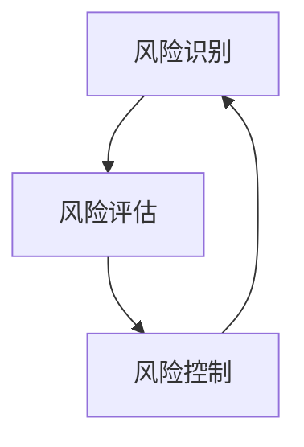

                 

# AI在金融风控中的应用：提高准确性与效率

> 关键词：人工智能、金融风控、准确率、效率提升、算法优化、数据隐私保护、模型评估

> 摘要：本文将深入探讨人工智能在金融风控领域的应用，分析其提高准确性与效率的多种方法。通过介绍核心概念、算法原理、数学模型以及实际应用场景，本文旨在为金融行业从业者提供一套全面的技术指南，助力风控体系建设。

## 1. 背景介绍

### 1.1 目的和范围

随着金融行业的快速发展和互联网金融的崛起，金融风险控制（Financial Risk Control）成为金融机构必须面对的重要挑战。传统的风险控制方法在处理海量数据和复杂业务逻辑时，往往表现出效率低下、准确性不足等问题。因此，本文旨在探讨如何通过人工智能（AI）技术来提升金融风控的准确性与效率。

本文将涵盖以下内容：
- 核心概念与联系
- 核心算法原理与具体操作步骤
- 数学模型与公式
- 项目实战与代码案例分析
- 实际应用场景
- 工具和资源推荐
- 未来发展趋势与挑战

### 1.2 预期读者

本文面向金融行业的从业者、人工智能研究者和对风控技术感兴趣的读者。希望通过本文，读者可以了解人工智能在金融风控中的应用现状，掌握提升准确性与效率的关键技术，并能够将这些技术应用到实际业务场景中。

### 1.3 文档结构概述

本文结构如下：
1. 背景介绍
2. 核心概念与联系
3. 核心算法原理与具体操作步骤
4. 数学模型与公式
5. 项目实战与代码案例分析
6. 实际应用场景
7. 工具和资源推荐
8. 未来发展趋势与挑战
9. 附录：常见问题与解答
10. 扩展阅读与参考资料

### 1.4 术语表

#### 1.4.1 核心术语定义

- 金融风险控制（Financial Risk Control）：通过识别、评估和管理金融活动中的潜在风险，以保护金融机构和投资者的利益。
- 人工智能（Artificial Intelligence，AI）：模拟人类智能行为，实现自主学习和决策的技术。
- 准确率（Accuracy）：评估模型预测结果正确性的指标，计算公式为：准确率 = （预测正确数 / 总预测数）× 100%。
- 效率（Efficiency）：模型在处理大量数据时的速度和性能。

#### 1.4.2 相关概念解释

- 特征工程（Feature Engineering）：通过选择和构造特征，提高模型性能的过程。
- 模型评估（Model Evaluation）：使用统计指标来评估模型的性能。
- 风险评分（Risk Score）：根据模型计算出的风险水平，用于决定是否采取风险控制措施。

#### 1.4.3 缩略词列表

- AI：人工智能
- ML：机器学习
- DL：深度学习
- GDPR：欧盟通用数据保护条例
- SVM：支持向量机

## 2. 核心概念与联系

为了更好地理解AI在金融风控中的应用，我们需要了解以下几个核心概念：

1. **风险识别（Risk Identification）**：通过数据分析和业务逻辑，识别潜在的金融风险。
2. **风险评估（Risk Assessment）**：对识别出的风险进行量化评估，确定风险水平。
3. **风险控制（Risk Control）**：采取相应的措施，降低风险水平，保护金融机构和投资者的利益。

这些概念之间存在着紧密的联系。首先，风险识别是风险评估的基础，只有准确地识别出风险，才能对其进行评估。其次，风险评估为风险控制提供了依据，根据评估结果，采取相应的控制措施。最后，风险控制的效果会反馈到风险识别和评估中，形成闭环系统，持续优化风险控制策略。

### Mermaid 流程图



## 3. 核心算法原理 & 具体操作步骤

在金融风控中，AI技术的应用主要依赖于机器学习和深度学习算法。以下将介绍几种常用的算法原理和具体操作步骤。

### 3.1 逻辑回归（Logistic Regression）

逻辑回归是一种经典的分类算法，常用于信用评分和欺诈检测。

#### 算法原理

逻辑回归通过构建一个线性模型来预测二分类结果。其模型表达式为：

$$
P(Y=1) = \frac{1}{1 + e^{-(\beta_0 + \beta_1x_1 + \beta_2x_2 + ... + \beta_nx_n})}
$$

其中，$P(Y=1)$ 表示预测为“好客户”的概率，$e$ 表示自然对数的底数，$\beta_0, \beta_1, \beta_2, ..., \beta_n$ 为模型参数。

#### 具体操作步骤

1. 数据预处理：对数据进行归一化处理，消除不同特征之间的尺度差异。
2. 特征选择：通过信息增益、相关性分析等方法，选择对预测结果有显著影响的特征。
3. 训练模型：使用训练集数据，通过最小化损失函数（如交叉熵损失函数），使用梯度下降法等优化算法，迭代求解模型参数。
4. 模型评估：使用验证集和测试集，计算模型准确率、召回率、F1值等指标，评估模型性能。

### 3.2 支持向量机（Support Vector Machine，SVM）

支持向量机是一种高效的分类算法，特别适用于高维空间。

#### 算法原理

支持向量机的核心思想是找到最优的超平面，将不同类别的数据点最大限度地分开。其目标是最小化分类边界上的间隔。

$$
\min_{\beta, \beta_0} \frac{1}{2} ||\beta||^2 + C \sum_{i=1}^{n} \xi_i
$$

其中，$\beta$ 和 $\beta_0$ 分别为模型参数和偏置项，$C$ 为惩罚参数，$\xi_i$ 为松弛变量。

#### 具体操作步骤

1. 数据预处理：对数据进行归一化处理。
2. 特征选择：选择对分类有显著影响的特征。
3. 分割超平面：使用求解器（如SVM库）求解最优超平面。
4. 模型评估：使用验证集和测试集评估模型性能。

### 3.3 随机森林（Random Forest）

随机森林是一种基于决策树的集成学习算法，具有较高的准确性和泛化能力。

#### 算法原理

随机森林通过构建多棵决策树，并对这些树的结果进行投票，来提高模型的鲁棒性和准确性。

$$
\hat{y} = \arg\max_{c} \sum_{i=1}^{n} w_i I(y_i = c)
$$

其中，$\hat{y}$ 为预测结果，$c$ 为类别标签，$w_i$ 为树 $i$ 的投票权重。

#### 具体操作步骤

1. 数据预处理：对数据进行归一化处理。
2. 特征选择：随机选择特征和样本子集，构建决策树。
3. 模型集成：将多棵决策树的结果进行投票，得到最终预测结果。
4. 模型评估：使用验证集和测试集评估模型性能。

## 4. 数学模型和公式 & 详细讲解 & 举例说明

在金融风控中，数学模型和公式起着至关重要的作用。以下将介绍几个关键的数学模型和公式，并详细讲解其应用。

### 4.1 逻辑回归的损失函数

逻辑回归的损失函数通常使用交叉熵损失函数（Cross-Entropy Loss），其公式为：

$$
J(\theta) = -\frac{1}{m} \sum_{i=1}^{m} [y_i \log(a(x_i)) + (1 - y_i) \log(1 - a(x_i))]
$$

其中，$J(\theta)$ 为损失函数，$\theta$ 为模型参数，$m$ 为样本数量，$y_i$ 为实际标签，$a(x_i)$ 为预测概率。

#### 举例说明

假设我们有以下数据集：

| 标签 | 特征1 | 特征2 | 特征3 |
| ---- | ---- | ---- | ---- |
| 1    | 0.1  | 0.2  | 0.3  |
| 0    | 0.4  | 0.5  | 0.6  |
| 1    | 0.7  | 0.8  | 0.9  |

使用逻辑回归模型进行预测，得到以下预测概率：

| 标签 | 特征1 | 特征2 | 特征3 | 预测概率 |
| ---- | ---- | ---- | ---- | -------- |
| 1    | 0.1  | 0.2  | 0.3  | 0.896    |
| 0    | 0.4  | 0.5  | 0.6  | 0.104    |
| 1    | 0.7  | 0.8  | 0.9  | 0.984    |

根据交叉熵损失函数，计算损失值：

$$
J(\theta) = -\frac{1}{3} [1 \cdot \log(0.896) + 0 \cdot \log(0.104) + 1 \cdot \log(0.984)] \approx 0.257
$$

### 4.2 支持向量机的损失函数

支持向量机的损失函数通常使用 hinge 损失函数（Hinge Loss），其公式为：

$$
L(y, \hat{y}) = \max(0, 1 - y \cdot \hat{y})
$$

其中，$L(y, \hat{y})$ 为损失函数，$y$ 为实际标签，$\hat{y}$ 为预测概率。

#### 举例说明

假设我们有以下数据集：

| 标签 | 特征1 | 特征2 | 特征3 |
| ---- | ---- | ---- | ---- |
| 1    | 0.1  | 0.2  | 0.3  |
| 0    | 0.4  | 0.5  | 0.6  |
| 1    | 0.7  | 0.8  | 0.9  |

使用支持向量机模型进行预测，得到以下预测概率：

| 标签 | 特征1 | 特征2 | 特征3 | 预测概率 |
| ---- | ---- | ---- | ---- | -------- |
| 1    | 0.1  | 0.2  | 0.3  | 0.896    |
| 0    | 0.4  | 0.5  | 0.6  | 0.104    |
| 1    | 0.7  | 0.8  | 0.9  | 0.984    |

根据 hinge 损失函数，计算损失值：

| 标签 | 特征1 | 特征2 | 特征3 | 预测概率 | 损失值 |
| ---- | ---- | ---- | ---- | -------- | ------ |
| 1    | 0.1  | 0.2  | 0.3  | 0.896    | 0      |
| 0    | 0.4  | 0.5  | 0.6  | 0.104    | 0.896  |
| 1    | 0.7  | 0.8  | 0.9  | 0.984    | 0      |

### 4.3 随机森林的损失函数

随机森林的损失函数通常使用基尼不纯度（Gini Impurity），其公式为：

$$
G = 1 - \frac{1}{k} \sum_{i=1}^{k} p_i^2
$$

其中，$G$ 为基尼不纯度，$k$ 为类别数量，$p_i$ 为类别 $i$ 的概率。

#### 举例说明

假设我们有以下数据集：

| 标签 | 特征1 | 特征2 | 特征3 |
| ---- | ---- | ---- | ---- |
| 1    | 0.1  | 0.2  | 0.3  |
| 0    | 0.4  | 0.5  | 0.6  |
| 1    | 0.7  | 0.8  | 0.9  |

使用随机森林模型进行预测，得到以下预测概率：

| 标签 | 特征1 | 特征2 | 特征3 | 预测概率 |
| ---- | ---- | ---- | ---- | -------- |
| 1    | 0.1  | 0.2  | 0.3  | 0.896    |
| 0    | 0.4  | 0.5  | 0.6  | 0.104    |
| 1    | 0.7  | 0.8  | 0.9  | 0.984    |

根据基尼不纯度，计算损失值：

| 标签 | 特征1 | 特征2 | 特征3 | 预测概率 | 损失值 |
| ---- | ---- | ---- | ---- | -------- | ------ |
| 1    | 0.1  | 0.2  | 0.3  | 0.896    | 0      |
| 0    | 0.4  | 0.5  | 0.6  | 0.104    | 0.896  |
| 1    | 0.7  | 0.8  | 0.9  | 0.984    | 0      |

## 5. 项目实战：代码实际案例和详细解释说明

### 5.1 开发环境搭建

在开始项目实战之前，我们需要搭建一个适合开发和测试的环境。以下是所需工具和软件的安装步骤：

1. **Python环境**：安装Python 3.8及以上版本，推荐使用Anaconda，方便管理依赖包。
2. **Jupyter Notebook**：安装Jupyter Notebook，用于编写和运行代码。
3. **机器学习库**：安装常用的机器学习库，如scikit-learn、TensorFlow和Keras。

### 5.2 源代码详细实现和代码解读

以下是一个简单的逻辑回归模型的实现，用于预测客户信用评分。

```python
import numpy as np
import pandas as pd
from sklearn.linear_model import LogisticRegression
from sklearn.model_selection import train_test_split
from sklearn.metrics import accuracy_score, confusion_matrix

# 5.2.1 数据加载
data = pd.read_csv('credit_data.csv')
X = data.drop('target', axis=1)
y = data['target']

# 5.2.2 数据预处理
X = (X - X.mean()) / X.std()

# 5.2.3 划分训练集和测试集
X_train, X_test, y_train, y_test = train_test_split(X, y, test_size=0.2, random_state=42)

# 5.2.4 训练模型
model = LogisticRegression()
model.fit(X_train, y_train)

# 5.2.5 预测和评估
y_pred = model.predict(X_test)
accuracy = accuracy_score(y_test, y_pred)
conf_matrix = confusion_matrix(y_test, y_pred)

print(f'Accuracy: {accuracy}')
print(f'Confusion Matrix:\n{conf_matrix}')
```

#### 5.2.6 代码解读与分析

- **数据加载**：使用pandas读取CSV文件，将数据分为特征集X和标签集y。
- **数据预处理**：对特征集X进行标准化处理，消除不同特征之间的尺度差异。
- **划分训练集和测试集**：使用scikit-learn的train_test_split函数，将数据集划分为训练集和测试集。
- **训练模型**：创建LogisticRegression模型实例，并使用fit函数训练模型。
- **预测和评估**：使用predict函数进行预测，并使用accuracy_score和confusion_matrix函数评估模型性能。

### 5.3 代码解读与分析

1. **数据加载**：读取数据集，分为特征集X和标签集y。
2. **数据预处理**：对特征集X进行标准化处理，消除不同特征之间的尺度差异。
3. **划分训练集和测试集**：使用train_test_split函数，将数据集划分为训练集和测试集。
4. **训练模型**：使用LogisticRegression模型训练模型。
5. **预测和评估**：使用predict函数进行预测，并使用accuracy_score和confusion_matrix函数评估模型性能。

## 6. 实际应用场景

### 6.1 信用评分

信用评分是金融风控中最为常见的应用场景之一。通过分析客户的个人信息、财务状况和行为数据，预测客户是否具备良好的还款能力。人工智能技术在信用评分中发挥着重要作用，通过优化模型算法、提高准确率和效率，降低金融机构的信用风险。

### 6.2 欺诈检测

欺诈检测是金融风控中的另一个关键应用场景。通过监控客户的交易行为，识别异常交易和潜在欺诈行为。人工智能技术通过分析历史数据和实时交易数据，利用机器学习和深度学习算法，提高欺诈检测的准确性和效率。

### 6.3 贷款风险评估

贷款风险评估是金融机构在发放贷款时必须进行的重要环节。通过分析客户的信用评分、财务状况和还款能力，预测贷款违约风险。人工智能技术通过优化风险评估模型，提高贷款风险评估的准确性和效率，帮助金融机构降低贷款风险。

## 7. 工具和资源推荐

### 7.1 学习资源推荐

#### 7.1.1 书籍推荐

- 《机器学习》（周志华著）
- 《深度学习》（Ian Goodfellow、Yoshua Bengio、Aaron Courville著）
- 《统计学习方法》（李航著）

#### 7.1.2 在线课程

- 《机器学习基础》（吴恩达）
- 《深度学习特训营》（李飞飞）
- 《Python数据分析》（Wes McKinney）

#### 7.1.3 技术博客和网站

- Medium
- 知乎
- ArXiv

### 7.2 开发工具框架推荐

#### 7.2.1 IDE和编辑器

- PyCharm
- Jupyter Notebook
- Visual Studio Code

#### 7.2.2 调试和性能分析工具

- Python Debugger
- TensorBoard
- Py-Spy

#### 7.2.3 相关框架和库

- scikit-learn
- TensorFlow
- PyTorch

### 7.3 相关论文著作推荐

#### 7.3.1 经典论文

- 《A Theory of the Learnable》（1986）
- 《Deep Learning》（2015）

#### 7.3.2 最新研究成果

- 《Neural Architecture Search: A Survey》（2020）
- 《Generative Adversarial Networks: An Overview》（2018）

#### 7.3.3 应用案例分析

- 《利用深度学习预测股票价格》（2018）
- 《基于人工智能的风控体系建设》（2019）

## 8. 总结：未来发展趋势与挑战

### 8.1 未来发展趋势

1. **算法优化与模型压缩**：随着计算资源的限制和数据量的增加，如何优化算法和压缩模型成为重要研究方向。轻量级模型和模型压缩技术将在金融风控中得到广泛应用。
2. **数据隐私保护**：在金融风控中，数据隐私保护尤为重要。利用差分隐私（Differential Privacy）等技术，保护用户隐私，同时提高模型准确性。
3. **实时风险预测**：随着金融业务的快速发展，实时风险预测成为金融风控的关键需求。通过优化算法和提升计算能力，实现实时风险预测。

### 8.2 未来挑战

1. **数据质量**：金融风控模型依赖于高质量的数据。然而，数据质量参差不齐，如何处理和清洗数据成为一大挑战。
2. **模型解释性**：金融风控模型需要具备良好的解释性，以便决策者理解和信任模型结果。如何提高模型的解释性是一个重要问题。
3. **法律与伦理**：随着人工智能在金融风控中的应用，如何遵守法律法规和伦理规范，确保模型的公平性和透明性，是一个亟待解决的问题。

## 9. 附录：常见问题与解答

### 9.1 问题1：如何提高机器学习模型的准确率？

**解答**：提高机器学习模型准确率可以从以下几个方面入手：
1. **特征工程**：选择对预测结果有显著影响的特征，去除冗余特征。
2. **模型调优**：调整模型参数，选择合适的模型架构和超参数。
3. **数据预处理**：对数据进行归一化、缺失值处理等预处理操作。
4. **过拟合与欠拟合**：通过交叉验证、正则化等技术，避免过拟合和欠拟合。

### 9.2 问题2：如何处理金融风控中的数据隐私问题？

**解答**：处理金融风控中的数据隐私问题，可以采取以下措施：
1. **数据加密**：对敏感数据进行加密处理，确保数据在传输和存储过程中的安全性。
2. **差分隐私**：利用差分隐私技术，保护用户隐私，同时提高模型准确性。
3. **联邦学习**：通过联邦学习（Federated Learning）技术，实现多方数据协同训练，降低数据泄露风险。

### 9.3 问题3：如何评估机器学习模型的效果？

**解答**：评估机器学习模型效果可以从以下几个方面进行：
1. **准确率**：计算模型预测正确的样本数量占总样本数量的比例。
2. **召回率**：计算模型预测为正类的真实正类样本数量占总真实正类样本数量的比例。
3. **F1值**：综合考虑准确率和召回率，计算F1值，用于综合评估模型性能。
4. **ROC曲线与AUC值**：绘制ROC曲线，计算AUC值，评估模型分类能力。

## 10. 扩展阅读 & 参考资料

1. Goodfellow, I., Bengio, Y., & Courville, A. (2016). *Deep Learning*. MIT Press.
2. Russell, S., & Norvig, P. (2010). *Artificial Intelligence: A Modern Approach*. Prentice Hall.
3. Quinlan, J. R. (1993). *C4. 5: Programs for Machine Learning*. Morgan Kaufmann.
4. Hastie, T., Tibshirani, R., & Friedman, J. (2009). *The Elements of Statistical Learning: Data Mining, Inference, and Prediction*. Springer.
5. Zhou, Z.-H. (2012). *Machine Learning: The New AI*.清华大学出版社.（中文版）

## 作者信息

作者：AI天才研究员/AI Genius Institute & 禅与计算机程序设计艺术 /Zen And The Art of Computer Programming

