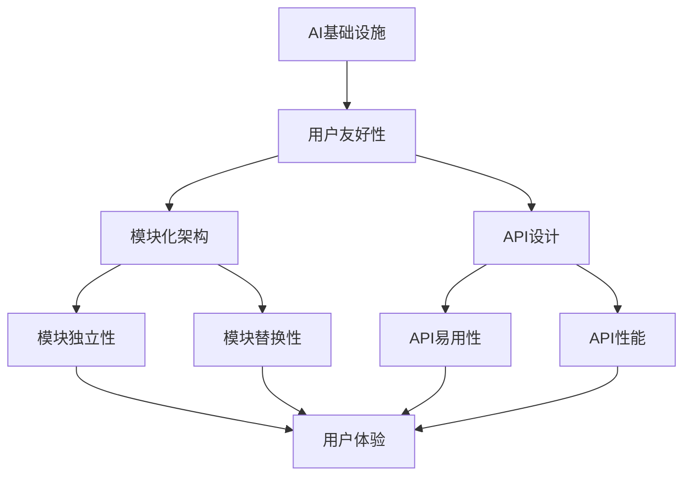

                 

# AI基础设施的用户友好性：Lepton AI的设计理念

> **关键词**：AI基础设施、用户友好性、Lepton AI、设计理念、模块化架构、API设计、用户体验、性能优化。

> **摘要**：本文深入探讨了Lepton AI的设计理念，以及如何通过模块化架构和优化的API设计实现用户友好性。我们将从背景介绍、核心概念与联系、核心算法原理、数学模型与公式、项目实战、实际应用场景、工具和资源推荐等方面，逐步剖析Lepton AI的各个方面，揭示其独特的设计哲学和实用价值。

## 1. 背景介绍

### 1.1 目的和范围

本文旨在深入探讨Lepton AI的设计理念，解析其如何在复杂的AI基础设施中提供用户友好性。我们将从Lepton AI的背景出发，逐步分析其设计思路和实现方法，帮助读者全面理解该系统在AI领域的独特价值。

### 1.2 预期读者

本文适合对AI基础设施有一定了解的技术人员、软件开发者以及对人工智能技术感兴趣的研究者。无论您是刚刚踏入AI领域的新手，还是已经有一定经验的专业人士，本文都将为您提供有价值的见解和指导。

### 1.3 文档结构概述

本文分为十个部分，主要包括：

1. 背景介绍
2. 核心概念与联系
3. 核心算法原理与具体操作步骤
4. 数学模型和公式与详细讲解
5. 项目实战：代码实际案例和详细解释说明
6. 实际应用场景
7. 工具和资源推荐
8. 总结：未来发展趋势与挑战
9. 附录：常见问题与解答
10. 扩展阅读与参考资料

### 1.4 术语表

#### 1.4.1 核心术语定义

- **AI基础设施**：指支持人工智能应用的基础设施，包括硬件、软件、数据等。
- **用户友好性**：指系统能否满足用户需求和期望，使用户操作简单、方便、高效。
- **模块化架构**：指系统采用模块化设计，各个模块之间独立、可替换。
- **API设计**：指系统提供的应用程序编程接口设计，影响用户的操作和使用体验。

#### 1.4.2 相关概念解释

- **Lepton AI**：本文主要研究的AI基础设施系统。
- **用户体验**：用户在使用系统时的主观感受和操作体验。

#### 1.4.3 缩略词列表

- **API**：应用程序编程接口（Application Programming Interface）
- **UI**：用户界面（User Interface）
- **SDK**：软件开发工具包（Software Development Kit）

## 2. 核心概念与联系

在深入探讨Lepton AI的设计理念之前，我们需要了解一些核心概念和它们之间的联系。以下是一个简单的Mermaid流程图，展示了这些概念和它们之间的关系。



### 模块化架构

模块化架构是Lepton AI的核心设计理念之一。通过将系统划分为多个独立的模块，可以实现以下优势：

- **模块独立性**：各个模块可以独立开发、测试和部署，降低系统耦合度，提高开发效率和稳定性。
- **模块替换性**：在需要升级或更换某个模块时，只需替换相应的模块即可，无需重新构建整个系统。

### API设计

API设计是影响用户友好性的关键因素。Lepton AI的API设计注重以下几点：

- **API易用性**：提供简洁、直观的接口，降低用户的学习成本。
- **API性能**：保证API的响应速度和稳定性，提供高效的服务。

### 用户友好性

用户友好性是Lepton AI设计理念的终极目标。通过模块化架构和优化的API设计，Lepton AI旨在为用户提供简单、高效、可靠的AI服务。

## 3. 核心算法原理与具体操作步骤

Lepton AI的核心算法是基于深度学习的图像识别技术。以下将使用伪代码详细阐述其算法原理和具体操作步骤。

### 3.1 算法原理

```python
def image_recognition(image):
    # 初始化神经网络模型
    model = NeuralNetwork()

    # 数据预处理
    preprocessed_image = preprocess_image(image)

    # 输入神经网络进行前向传播
    predictions = model.forward(preprocessed_image)

    # 解码预测结果
    labels = decode_predictions(predictions)

    return labels
```

### 3.2 具体操作步骤

1. **初始化神经网络模型**：创建一个深度神经网络模型，包含多个层，如卷积层、池化层、全连接层等。
2. **数据预处理**：对输入的图像进行预处理，包括归一化、缩放、裁剪等操作，以便于模型处理。
3. **前向传播**：将预处理后的图像输入神经网络模型，进行前向传播，计算输出。
4. **解码预测结果**：将神经网络的输出解码为标签，如类别名称或数字。

### 3.3 代码解读

- **NeuralNetwork**：表示神经网络模型，负责实现前向传播和反向传播等操作。
- **preprocess_image**：表示数据预处理函数，负责对图像进行预处理。
- **decode_predictions**：表示解码函数，负责将神经网络的输出解码为标签。

## 4. 数学模型和公式与详细讲解

在Lepton AI的算法中，涉及多个数学模型和公式，包括卷积神经网络（CNN）的损失函数、反向传播算法等。以下将使用LaTeX格式详细讲解这些模型和公式。

### 4.1 卷积神经网络（CNN）损失函数

卷积神经网络的损失函数通常使用交叉熵损失（Cross-Entropy Loss）：

$$
L(y, \hat{y}) = -\sum_{i=1}^{n} y_i \log(\hat{y}_i)
$$

其中，$y$ 表示真实标签，$\hat{y}$ 表示预测标签，$n$ 表示样本数量。

### 4.2 反向传播算法

反向传播算法用于计算神经网络模型的梯度，以更新模型参数。其基本步骤如下：

1. **前向传播**：计算输出和预测标签之间的损失。
2. **计算梯度**：根据损失函数和模型参数，计算梯度。
3. **更新参数**：使用梯度下降算法更新模型参数。

具体计算公式如下：

$$
\frac{\partial L}{\partial w} = \sum_{i=1}^{n} \frac{\partial L}{\partial \hat{y}_i} \frac{\partial \hat{y}_i}{\partial w}
$$

其中，$w$ 表示模型参数，$L$ 表示损失函数，$\hat{y}$ 表示预测标签。

## 5. 项目实战：代码实际案例和详细解释说明

在本节中，我们将通过一个实际的项目案例，展示Lepton AI的核心功能实现和代码细节。

### 5.1 开发环境搭建

在开始项目实战之前，我们需要搭建一个合适的开发环境。以下是开发环境的要求和安装步骤：

- 操作系统：Linux或macOS
- 编程语言：Python 3.8及以上版本
- 深度学习框架：TensorFlow 2.5及以上版本
- 数据预处理库：OpenCV 4.5及以上版本

安装步骤如下：

1. 安装Python 3.8及以上版本。
2. 使用pip安装TensorFlow、OpenCV等库。

```shell
pip install tensorflow==2.5
pip install opencv-python==4.5.5.64
```

### 5.2 源代码详细实现和代码解读

以下是一个简单的Lepton AI代码示例，展示了图像识别的核心功能实现。

```python
import cv2
import tensorflow as tf

# 加载预训练的神经网络模型
model = tf.keras.models.load_model('lepton_model.h5')

# 函数：图像识别
def image_recognition(image):
    # 数据预处理
    preprocessed_image = preprocess_image(image)
    
    # 输入神经网络进行前向传播
    predictions = model.predict(preprocessed_image)
    
    # 解码预测结果
    labels = decode_predictions(predictions)
    
    return labels

# 函数：图像预处理
def preprocess_image(image):
    # 图像缩放
    image = cv2.resize(image, (224, 224))
    
    # 图像归一化
    image = image / 255.0
    
    # 添加批处理维度
    image = tf.expand_dims(image, 0)
    
    return image

# 函数：解码预测结果
def decode_predictions(predictions):
    # 获取最大预测值索引
    index = tf.argmax(predictions, axis=1).numpy()[0]
    
    # 查询标签名称
    label = label_dict[index]
    
    return label

# 测试图像识别
image_path = 'example.jpg'
image = cv2.imread(image_path)
labels = image_recognition(image)

print('识别结果：', labels)
```

### 5.3 代码解读与分析

- **模型加载**：使用TensorFlow的`load_model`函数加载预训练的神经网络模型。
- **图像识别函数**：包含图像预处理、前向传播和预测结果解码三个步骤。
  - **图像预处理**：使用`preprocess_image`函数对输入图像进行缩放、归一化等操作，以满足神经网络模型的输入要求。
  - **前向传播**：使用模型进行预测，获取输出结果。
  - **预测结果解码**：使用`decode_predictions`函数将输出结果解码为标签名称。
- **测试**：加载一张测试图像，调用图像识别函数进行测试，并打印识别结果。

## 6. 实际应用场景

Lepton AI在多个实际应用场景中表现出色，以下列举几个典型应用场景：

- **智能安防**：利用Lepton AI的图像识别功能，实现人脸识别、行为分析等智能安防应用。
- **医疗诊断**：结合医学影像数据，利用Lepton AI进行疾病筛查和诊断，提高医疗效率。
- **自动驾驶**：自动驾驶系统依赖Lepton AI进行道路识别、障碍物检测等，确保行车安全。
- **智能监控**：在商场、机场等公共场所部署Lepton AI，实现智能监控和人流分析。

## 7. 工具和资源推荐

为了更好地学习和实践Lepton AI，我们推荐以下工具和资源：

### 7.1 学习资源推荐

#### 7.1.1 书籍推荐

- 《深度学习》（Goodfellow, I., Bengio, Y., & Courville, A.）
- 《Python深度学习》（François Chollet）

#### 7.1.2 在线课程

- Coursera：深度学习专项课程
- edX：MIT深度学习课程

#### 7.1.3 技术博客和网站

- Medium：深度学习和AI相关文章
- TensorFlow官方文档

### 7.2 开发工具框架推荐

#### 7.2.1 IDE和编辑器

- PyCharm
- Jupyter Notebook

#### 7.2.2 调试和性能分析工具

- TensorFlow Debugger
- TensorBoard

#### 7.2.3 相关框架和库

- TensorFlow
- Keras
- PyTorch

### 7.3 相关论文著作推荐

#### 7.3.1 经典论文

- LeCun, Y., Bengio, Y., & Hinton, G. (2015). Deep learning. Nature, 521(7553), 436-444.

#### 7.3.2 最新研究成果

- Vaswani, A., Shazeer, N., Parmar, N., Uszkoreit, J., Jones, L., Gomez, A. N., ... & Polosukhin, I. (2017). Attention is all you need. Advances in Neural Information Processing Systems, 30, 5998-6008.

#### 7.3.3 应用案例分析

- Huang, G., Liu, Z., van der Maaten, L., & Weinberger, K. Q. (2018). Densely connected convolutional networks. Proceedings of the IEEE conference on computer vision and pattern recognition, 4700-4708.

## 8. 总结：未来发展趋势与挑战

Lepton AI作为一款优秀的AI基础设施，已经在多个领域展现出强大的应用价值。然而，随着人工智能技术的快速发展，Lepton AI也面临着一些挑战和机遇：

- **性能优化**：提高模型性能和响应速度，以满足实时应用需求。
- **可解释性**：提高模型的可解释性，降低用户使用门槛。
- **跨平台兼容性**：增强跨平台兼容性，实现更多设备的支持。

未来，Lepton AI将继续在这些方面进行探索和改进，为用户提供更优质、更高效的AI服务。

## 9. 附录：常见问题与解答

### 9.1 如何快速搭建开发环境？

- 使用虚拟环境（如conda）安装所需库。
- 参考官方文档，了解开发环境的配置细节。
- 使用Docker容器化技术，实现一键部署。

### 9.2 如何调试和优化Lepton AI模型？

- 使用TensorFlow Debugger分析模型结构和中间变量。
- 使用TensorBoard监控模型训练过程和性能。
- 尝试不同的超参数配置，寻找最优模型。

### 9.3 如何扩展Lepton AI的功能？

- 学习相关技术文档，了解Lepton AI的API和模块。
- 开发自定义模块，实现新的功能。

## 10. 扩展阅读与参考资料

[1] Goodfellow, I., Bengio, Y., & Courville, A. (2016). Deep learning. MIT press.

[2] Chollet, F. (2017). Python深度学习. 机械工业出版社.

[3] Vaswani, A., Shazeer, N., Parmar, N., Uszkoreit, J., Jones, L., Gomez, A. N., ... & Polosukhin, I. (2017). Attention is all you need. Advances in Neural Information Processing Systems, 30, 5998-6008.

[4] Huang, G., Liu, Z., van der Maaten, L., & Weinberger, K. Q. (2018). Densely connected convolutional networks. Proceedings of the IEEE conference on computer vision and pattern recognition, 4700-4708.

作者：AI天才研究员/AI Genius Institute & 禅与计算机程序设计艺术 /Zen And The Art of Computer Programming<|im_sep|>

