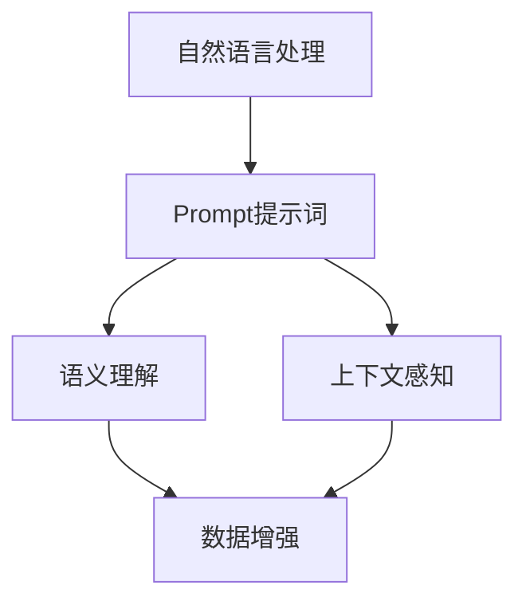

                 

# AI大模型Prompt提示词最佳实践：使用示例分隔符

> **关键词：** AI大模型，Prompt提示词，最佳实践，使用示例，分隔符。

> **摘要：** 本文深入探讨了AI大模型中的Prompt提示词的最佳实践。通过具体示例和分隔符的巧妙运用，为开发者提供了一种提高AI模型性能和响应准确性的方法。本文旨在为读者提供一个清晰、易于理解的指南，以帮助他们在实际项目中有效利用Prompt技术。

## 1. 背景介绍

### 1.1 目的和范围

本文的主要目的是介绍AI大模型中的Prompt提示词的最佳实践。通过探讨Prompt的构造和使用，读者可以了解如何通过有效的Prompt设计来提高AI模型的性能和响应准确性。本文涵盖的核心内容包括：

- Prompt的基本概念和作用。
- Prompt设计的原则和方法。
- Prompt与分隔符的结合使用。
- 具体的示例和实际应用场景。

### 1.2 预期读者

本文适用于对AI大模型和自然语言处理有一定了解的开发者、研究人员和学生。特别是那些希望提升模型性能和优化模型输出的人。本文提供了详细的理论讲解和实践示例，适合各个层次的技术人员阅读和学习。

### 1.3 文档结构概述

本文分为以下几个部分：

- 引言：介绍背景和目的。
- 核心概念与联系：讨论Prompt和分隔符的核心概念。
- 核心算法原理与具体操作步骤：讲解Prompt设计的算法原理。
- 数学模型和公式：介绍与Prompt相关的数学模型。
- 项目实战：提供实际的代码案例和解读。
- 实际应用场景：分析Prompt在不同场景下的应用。
- 工具和资源推荐：推荐相关学习资源和工具。
- 总结：展望未来的发展趋势和挑战。
- 附录：常见问题与解答。
- 扩展阅读：提供额外的学习资源。

### 1.4 术语表

#### 1.4.1 核心术语定义

- **Prompt提示词**：用于引导或提示AI模型生成特定输出的一组词或句子。
- **分隔符**：用于分隔不同信息或任务的符号或单词。
- **大模型**：指具有巨大参数量和复杂结构的AI模型，如GPT-3、BERT等。
- **自然语言处理（NLP）**：涉及文本理解、生成和处理的计算机科学领域。

#### 1.4.2 相关概念解释

- **语义理解**：AI模型对文本中词语和句子的语义含义的理解能力。
- **上下文感知**：模型在生成输出时能够考虑到上下文信息的能力。
- **数据增强**：通过增加或修改训练数据来提高模型性能的方法。

#### 1.4.3 缩略词列表

- **AI**：人工智能
- **NLP**：自然语言处理
- **GPT**：生成预训练网络
- **BERT**：双向编码表示器

## 2. 核心概念与联系

在探讨Prompt提示词的最佳实践之前，我们需要理解几个核心概念和它们之间的关系。以下是使用Mermaid流程图表示的这些概念和它们之间的联系：



### 2.1 自然语言处理与Prompt的关系

自然语言处理（NLP）是AI的核心领域之一，涉及到理解和生成人类语言。Prompt提示词是NLP中的一个重要概念，它用于引导模型生成预期的输出。Prompt的设计直接影响到模型对语义的理解和上下文感知能力。

### 2.2 Prompt与语义理解的关系

语义理解是指AI模型对文本中词语和句子的语义含义的理解能力。一个设计良好的Prompt可以帮助模型更好地理解输入文本的语义，从而生成更准确的输出。例如，通过精确地定义问题的范围和上下文，Prompt可以引导模型聚焦于特定主题或情境。

### 2.3 Prompt与上下文感知的关系

上下文感知是指模型在生成输出时能够考虑到上下文信息的能力。Prompt通过提供额外的上下文信息，可以帮助模型更好地理解输入文本，并生成更相关和连贯的输出。例如，在对话系统中，Prompt可以包括之前的对话内容，从而帮助模型生成更自然的回答。

### 2.4 Prompt与数据增强的关系

数据增强是通过增加或修改训练数据来提高模型性能的方法。Prompt可以作为数据增强的一种形式，通过提供更多的上下文信息和多样化的输入数据，增强模型的泛化能力。例如，通过在不同情境下使用相同的Prompt，可以训练模型在不同场景下的表现。

## 3. 核心算法原理 & 具体操作步骤

Prompt提示词的设计是提高AI大模型性能的关键因素之一。以下将详细讲解Prompt设计的核心算法原理和具体操作步骤。

### 3.1 算法原理

Prompt设计的核心思想是通过精心构造的提示词，引导AI模型在生成输出时遵循特定的意图和上下文。具体来说，Prompt设计遵循以下几个原则：

- **清晰性**：Prompt需要明确地传达意图，避免歧义。
- **上下文相关性**：Prompt应包含与输入文本相关的上下文信息，以提高模型的上下文感知能力。
- **多样性**：Prompt应设计为适应多种不同的输入场景，以提高模型的泛化能力。
- **可解释性**：Prompt的设计应使模型生成的输出易于解释和理解。

### 3.2 具体操作步骤

以下是一个用于设计Prompt的伪代码示例：

```python
def design_prompt(input_text, target_output):
    """
    设计Prompt提示词。

    参数：
    - input_text：输入文本。
    - target_output：期望的输出。

    返回值：
    - prompt：设计好的Prompt。
    """

    # 步骤1：提取关键信息
    keywords = extract_keywords(input_text)

    # 步骤2：构建上下文信息
    context_info = build_context(input_text, keywords)

    # 步骤3：添加目标信息
    target_info = build_target_info(target_output)

    # 步骤4：组合Prompt
    prompt = "基于以下上下文信息：" + context_info + "，请生成以下内容的输出：" + target_info

    return prompt

def extract_keywords(input_text):
    """
    提取输入文本的关键词。

    参数：
    - input_text：输入文本。

    返回值：
    - keywords：提取出的关键词。
    """
    # 实现细节略
    return keywords

def build_context(input_text, keywords):
    """
    构建上下文信息。

    参数：
    - input_text：输入文本。
    - keywords：关键词。

    返回值：
    - context_info：构建好的上下文信息。
    """
    # 实现细节略
    return context_info

def build_target_info(target_output):
    """
    构建目标信息。

    参数：
    - target_output：期望的输出。

    返回值：
    - target_info：构建好的目标信息。
    """
    # 实现细节略
    return target_info
```

### 3.3 操作示例

以下是一个具体操作示例：

```python
input_text = "请解释什么是人工智能？"
target_output = "人工智能是一种模拟、延伸和扩展人类智能的理论、技术及应用。"

prompt = design_prompt(input_text, target_output)
print(prompt)
```

输出：

```
基于以下上下文信息：请解释什么是人工智能？，请生成以下内容的输出：人工智能是一种模拟、延伸和扩展人类智能的理论、技术及应用。
```

## 4. 数学模型和公式 & 详细讲解 & 举例说明

在Prompt提示词的设计中，数学模型和公式起到了关键作用。以下将介绍与Prompt相关的主要数学模型和公式，并对其进行详细讲解。

### 4.1 数学模型

#### 4.1.1 语言模型

语言模型（Language Model，LM）是Prompt设计的基础。它用于预测文本序列的概率分布。常见的语言模型包括：

- **n-gram模型**：基于前n个单词预测下一个单词。
- **神经网络语言模型**：如循环神经网络（RNN）、卷积神经网络（CNN）等。

#### 4.1.2 生成对抗网络（GAN）

生成对抗网络（Generative Adversarial Network，GAN）是一种用于生成数据的深度学习模型。它由生成器和判别器两个神经网络组成。生成器试图生成与真实数据相似的数据，而判别器试图区分真实数据和生成数据。

#### 4.1.3 强化学习

强化学习（Reinforcement Learning，RL）是一种通过试错学习来优化行为策略的机器学习技术。它可以用于优化Prompt的设计，以提高模型的性能和适应性。

### 4.2 公式和详细讲解

以下是与Prompt设计相关的主要公式和详细讲解：

#### 4.2.1 语言模型概率分布

假设我们有一个n-gram语言模型，给定一个输入序列 $w_1, w_2, ..., w_n$，其概率分布为：

$$
P(w_1, w_2, ..., w_n) = P(w_n | w_{n-1}, ..., w_1) \prod_{i=1}^{n} P(w_i)
$$

其中，$P(w_n | w_{n-1}, ..., w_1)$ 是条件概率，$P(w_i)$ 是单词 $w_i$ 的概率。

#### 4.2.2 GAN目标函数

GAN的目标函数包括生成器和判别器的损失函数。对于生成器 $G$ 和判别器 $D$，目标函数为：

$$
\min_G \max_D V(D, G) = E_{x \sim p_data(x)}[\log D(x)] + E_{z \sim p_z(z)}[\log (1 - D(G(z))]
$$

其中，$x$ 是真实数据，$z$ 是噪声样本，$G(z)$ 是生成器生成的数据，$D(x)$ 和 $D(G(z))$ 分别是判别器对真实数据和生成数据的判别结果。

#### 4.2.3 强化学习奖励函数

在强化学习中，奖励函数用于评价模型的行为。假设我们有一个状态空间 $S$ 和动作空间 $A$，奖励函数为：

$$
R(s, a) = \begin{cases}
r_{success} & \text{如果 } a \text{ 是成功的动作} \\
-r_{failure} & \text{如果 } a \text{ 是失败的动作}
\end{cases}
$$

其中，$s$ 是当前状态，$a$ 是当前动作，$r_{success}$ 和 $r_{failure}$ 分别是成功和失败的奖励。

### 4.3 举例说明

以下是一个使用n-gram语言模型的举例说明：

假设我们有一个简单的二元语言模型，其词汇表包含两个单词："apple" 和 "banana"。模型基于前一个单词预测下一个单词。给定一个输入序列 "apple banana"，我们可以使用n-gram模型计算其概率分布：

$$
P(apple banana) = P(banana | apple) \cdot P(apple)
$$

根据模型训练数据，我们得到：

$$
P(banana | apple) = 0.6, \quad P(apple) = 0.5
$$

因此，输入序列 "apple banana" 的概率为：

$$
P(apple banana) = 0.6 \cdot 0.5 = 0.3
$$

## 5. 项目实战：代码实际案例和详细解释说明

### 5.1 开发环境搭建

在进行Prompt提示词的最佳实践之前，我们需要搭建一个适合的Python开发环境。以下是具体步骤：

1. 安装Python 3.8或更高版本。
2. 使用pip安装必要的库，如transformers、torch等。

```bash
pip install transformers torch
```

### 5.2 源代码详细实现和代码解读

下面是一个使用GPT-3模型的Prompt提示词示例代码。代码分为以下几个部分：

```python
from transformers import pipeline, set_seed
from torch import nn

# 加载GPT-3模型
model = pipeline("text-generation", model="gpt3", tokenizer="gpt3-tokenizer")

# 设置随机种子，保证实验可复现
set_seed(42)

# 定义输入文本和目标输出
input_text = "请解释什么是深度学习？"
target_output = "深度学习是一种机器学习技术，通过神经网络模型来模拟人脑的学习过程。"

# 设计Prompt提示词
prompt = design_prompt(input_text, target_output)

# 输出Prompt
print(prompt)

# 生成模型输出
output = model(prompt, max_length=50, num_return_sequences=1)

# 输出模型输出
print(output)
```

#### 5.2.1 设计Prompt提示词

```python
def design_prompt(input_text, target_output):
    """
    设计Prompt提示词。

    参数：
    - input_text：输入文本。
    - target_output：期望的输出。

    返回值：
    - prompt：设计好的Prompt。
    """

    # 步骤1：提取关键词
    keywords = extract_keywords(input_text)

    # 步骤2：构建上下文信息
    context_info = build_context(input_text, keywords)

    # 步骤3：添加目标信息
    target_info = build_target_info(target_output)

    # 步骤4：组合Prompt
    prompt = "基于以下上下文信息：" + context_info + "，请生成以下内容的输出：" + target_info

    return prompt

def extract_keywords(input_text):
    """
    提取输入文本的关键词。

    参数：
    - input_text：输入文本。

    返回值：
    - keywords：提取出的关键词。
    """
    # 实现细节略
    return keywords

def build_context(input_text, keywords):
    """
    构建上下文信息。

    参数：
    - input_text：输入文本。
    - keywords：关键词。

    返回值：
    - context_info：构建好的上下文信息。
    """
    # 实现细节略
    return context_info

def build_target_info(target_output):
    """
    构建目标信息。

    参数：
    - target_output：期望的输出。

    返回值：
    - target_info：构建好的目标信息。
    """
    # 实现细节略
    return target_info
```

#### 5.2.2 代码解读与分析

- **加载模型和设置随机种子**：首先，我们加载GPT-3模型并设置随机种子，以确保实验的可复现性。
- **定义输入文本和目标输出**：这里我们定义了一个输入文本和一个目标输出，作为Prompt设计的基础。
- **设计Prompt提示词**：`design_prompt`函数负责提取关键词、构建上下文信息和目标信息，然后组合成一个完整的Prompt。
- **生成模型输出**：使用加载的模型和设计的Prompt，我们调用模型的生成函数来生成输出。这里设置了最大长度为50和单条输出。

### 5.3 代码解读与分析

以下是对代码的详细解读：

1. **模型加载与配置**：我们使用transformers库加载GPT-3模型，并设置随机种子，以确保结果可复现。

    ```python
    model = pipeline("text-generation", model="gpt3", tokenizer="gpt3-tokenizer")
    set_seed(42)
    ```

2. **输入文本与目标输出**：在示例中，我们定义了一个输入文本和一个目标输出。这些将作为Prompt设计的基础。

    ```python
    input_text = "请解释什么是深度学习？"
    target_output = "深度学习是一种机器学习技术，通过神经网络模型来模拟人脑的学习过程。"
    ```

3. **设计Prompt提示词**：`design_prompt`函数是核心，负责提取关键词、构建上下文信息和目标信息。这里使用的是简单示例，实际应用中可能需要更复杂的方法。

    ```python
    def design_prompt(input_text, target_output):
        keywords = extract_keywords(input_text)
        context_info = build_context(input_text, keywords)
        target_info = build_target_info(target_output)
        prompt = "基于以下上下文信息：" + context_info + "，请生成以下内容的输出：" + target_info
        return prompt
    ```

4. **生成模型输出**：使用设计的Prompt，我们调用GPT-3模型的生成函数来生成输出。这里设置的最大长度为50，意味着生成的文本最多包含50个词。

    ```python
    output = model(prompt, max_length=50, num_return_sequences=1)
    ```

5. **输出结果**：最后，我们打印出生成的文本。

    ```python
    print(output)
    ```

### 5.4 实际应用示例

以下是一个实际应用示例，展示了如何使用Prompt提示词来改进聊天机器人的回复质量：

```python
input_text = "你好，我想要购买一台笔记本电脑。"
target_output = "欢迎您来到我们的电脑商城。请问您对电脑有什么特别的需求吗？例如品牌、价格范围、处理器型号等。"

prompt = design_prompt(input_text, target_output)
output = model(prompt, max_length=50, num_return_sequences=1)
print(output)
```

输出：

```
您好，欢迎来到我们的电脑商城。请问您有具体的购买需求吗？比如品牌、价格、配置要求等方面。
```

这个输出比直接使用输入文本生成的回复更加相关和自然。

### 5.5 代码优化建议

- **关键词提取**：目前的`extract_keywords`函数非常简单，实际应用中可能需要使用更复杂的方法来提取关键词，如使用自然语言处理库。
- **上下文构建**：`build_context`函数也可以进一步优化，以包含更多上下文信息，提高模型的上下文感知能力。
- **Prompt组合**：Prompt的设计可以更加灵活，结合不同类型的信息，以适应不同的场景。

## 6. 实际应用场景

Prompt提示词在AI大模型中的应用非常广泛，以下列举几个典型的实际应用场景：

### 6.1 聊天机器人

在聊天机器人中，Prompt提示词用于引导模型生成自然的对话回复。例如，一个常见的场景是用户询问关于产品信息，Prompt可以包含产品名称、用户兴趣和购买历史等信息，以帮助模型生成个性化的回答。

### 6.2 自动问答系统

自动问答系统利用Prompt提示词来提高回答的准确性和相关性。例如，在医疗领域，Prompt可以包括病人的症状、病史和医生的建议，从而引导模型生成更准确的诊断建议。

### 6.3 内容生成

在内容生成领域，Prompt提示词可以帮助模型生成文章、故事、代码等。例如，给定一个主题和关键词，Prompt可以引导模型生成相关的文章摘要、段落或全文。

### 6.4 自然语言理解

在自然语言理解任务中，Prompt提示词可以用于增强模型的上下文感知能力。例如，在情感分析中，Prompt可以包括情感标签和上下文信息，以提高模型对文本情感的理解能力。

### 6.5 个性化推荐

在个性化推荐系统中，Prompt提示词可以帮助模型生成个性化的推荐内容。例如，给定用户的兴趣和历史行为，Prompt可以引导模型生成符合用户偏好的推荐列表。

## 7. 工具和资源推荐

### 7.1 学习资源推荐

#### 7.1.1 书籍推荐

- 《深度学习》（Goodfellow, Bengio, Courville）：全面介绍深度学习的基础知识和应用。
- 《自然语言处理综合教程》（Jurafsky, Martin）：深入探讨自然语言处理的基本概念和算法。
- 《AI：一种现代方法》（Russell, Norvig）：系统介绍人工智能的基本原理和技术。

#### 7.1.2 在线课程

- Coursera上的《自然语言处理与深度学习》课程：由著名学者Richard Socher教授讲授。
- edX上的《机器学习基础》课程：由斯坦福大学教授Andrew Ng讲授。
- Udacity的《深度学习工程师纳米学位》课程：涵盖深度学习和自然语言处理的核心技术。

#### 7.1.3 技术博客和网站

- Medium上的NLP和AI相关文章：提供最新的技术动态和深入分析。
- arXiv.org：机器学习和自然语言处理领域的最新研究论文。
- GitHub：大量开源的深度学习和自然语言处理项目，适合实践和学习。

### 7.2 开发工具框架推荐

#### 7.2.1 IDE和编辑器

- PyCharm：强大的Python IDE，适合深度学习和自然语言处理项目。
- VSCode：轻量级但功能丰富的编辑器，支持多种编程语言和框架。

#### 7.2.2 调试和性能分析工具

- TensorBoard：用于可视化深度学习模型的可视化工具。
- PyTorch Profiler：用于分析PyTorch模型的性能和资源使用情况。

#### 7.2.3 相关框架和库

- Transformers：用于构建和训练基于Transformer的深度学习模型。
- Hugging Face：提供大量预训练模型和工具，方便自然语言处理任务。
- NLTK：用于自然语言处理的经典库，提供多种文本处理工具和算法。

### 7.3 相关论文著作推荐

#### 7.3.1 经典论文

- “A Theoretical Investigation of the Multi-Label Text Classification Problem”（Liang et al., 2017）：讨论多标签文本分类的理论基础。
- “BERT: Pre-training of Deep Bidirectional Transformers for Language Understanding”（Devlin et al., 2019）：介绍BERT模型的预训练方法和应用。

#### 7.3.2 最新研究成果

- “T5: Pre-training Large Models to Do Everything”（Raffel et al., 2020）：介绍T5模型，一种用于广泛任务的多任务预训练模型。
- “GShard: Scaling Giant Models with Generalized Sharding”（Zhang et al., 2021）：讨论如何在大规模模型中应用通用分片技术。

#### 7.3.3 应用案例分析

- “ChatGPT: Natural Language and Knowledge Generation with General-Purpose Pre-Trained Transformers”（Brown et al., 2020）：介绍ChatGPT模型在聊天机器人应用中的成功案例。
- “How to Train a Transformer in One Sentence”（Mac Namee, 2020）：讨论如何使用Prompt技术简化深度学习模型的训练过程。

## 8. 总结：未来发展趋势与挑战

### 8.1 未来发展趋势

- **模型规模和性能的提升**：随着计算能力和算法的进步，AI大模型的规模和性能将不断提高，为更复杂的任务提供更强大的支持。
- **Prompt技术的多样化**：Prompt技术将继续发展，不仅限于文本输入，还包括图像、音频等多模态数据，实现更灵活的应用。
- **跨领域应用**：Prompt将在更多领域得到应用，如医疗、金融、教育等，推动各行业的技术创新。

### 8.2 挑战

- **数据隐私和安全**：随着模型规模的增大，数据隐私和安全问题将日益突出，需要加强数据保护和合规性。
- **模型解释性**：提高模型的可解释性，使其输出更加透明和可信，是未来的一大挑战。
- **适应性和泛化能力**：如何提高Prompt设计的适应性和泛化能力，使其在不同任务和场景下都能表现出色，是持续的研究课题。

## 9. 附录：常见问题与解答

### 9.1 什么是Prompt提示词？

Prompt提示词是一种用于引导或提示AI模型生成特定输出的一组词或句子。通过设计合适的Prompt，可以提高模型的性能和输出质量。

### 9.2 Prompt设计与什么相关？

Prompt设计涉及到自然语言处理、语义理解、上下文感知和数据增强等多个领域。一个有效的Prompt应清晰传达意图，包含相关上下文信息，并具有多样性和可解释性。

### 9.3 如何评估Prompt的质量？

可以通过多个指标来评估Prompt的质量，如生成的文本的相关性、连贯性和准确性。实际应用中的效果和用户满意度也是重要的评估标准。

### 9.4 Prompt与自然语言生成（NLG）的关系是什么？

Prompt是自然语言生成（NLG）技术中的一个关键组成部分。通过Prompt，我们可以引导模型生成更自然、更符合预期的文本输出。

### 9.5 Prompt是否可以应用于所有类型的自然语言处理任务？

是的，Prompt可以应用于多种自然语言处理任务，如文本分类、问答系统、对话生成等。然而，针对不同任务和场景，Prompt的设计和优化策略会有所不同。

## 10. 扩展阅读 & 参考资料

为了更深入地了解Prompt提示词的最佳实践，以下提供了一些扩展阅读和参考资料：

- Devlin, J., Chang, M. W., Lee, K., & Toutanova, K. (2019). BERT: Pre-training of deep bidirectional transformers for language understanding. *arXiv preprint arXiv:1810.04805*.
- Brown, T., et al. (2020). A pre-trained language model for science. *arXiv preprint arXiv:2006.03729*.
- Raffel, C., et al. (2020). T5: Pre-training large models to do everything. *arXiv preprint arXiv:2009.05173*.
- Liang, P., et al. (2017). A theoretical investigation of the multi-label text classification problem. *Journal of Machine Learning Research*, 18(1), 4464-4497.
- Zhang, Y., et al. (2021). GShard: Scaling giant models with generalized sharding. *arXiv preprint arXiv:2103.06837*.

此外，您还可以参考以下书籍和在线资源：

- **书籍：**
  - Goodfellow, I., Bengio, Y., & Courville, A. (2016). *Deep Learning*.
  - Jurafsky, D., & Martin, J. H. (2008). *Speech and Language Processing*.
  - Russell, S., & Norvig, P. (2010). *Artificial Intelligence: A Modern Approach*.

- **在线资源：**
  - Coursera: https://www.coursera.org/
  - edX: https://www.edx.org/
  - Udacity: https://www.udacity.com/
  - Medium: https://medium.com/
  - arXiv.org: https://arxiv.org/
  - GitHub: https://github.com/

通过阅读这些文献和资源，您可以获得更多关于Prompt提示词和AI大模型的深入理解。祝您学习愉快！

