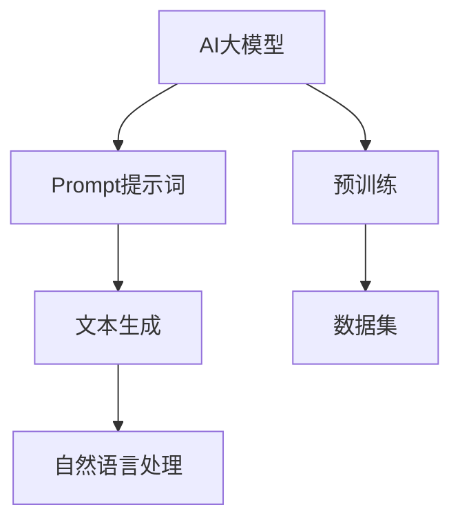

                 


# AI大模型Prompt提示词最佳实践：用简单的英文写文本

> **关键词：** AI大模型，Prompt提示词，最佳实践，简单英文，文本生成，技术博客

> **摘要：** 本文旨在探讨AI大模型Prompt提示词的最佳实践，通过简单的英文表达，详细解释其在文本生成中的应用，提供有效的算法原理和项目实战案例，为开发者提供实用的指导。

## 1. 背景介绍

### 1.1 目的和范围

本文将探讨AI大模型Prompt提示词的最佳实践，重点介绍如何使用简单的英文进行文本生成。我们将深入分析核心算法原理，提供详细的操作步骤和数学模型，并结合实际项目案例进行解读。本文旨在为开发者提供有价值的指导，帮助他们在AI文本生成领域取得更好的效果。

### 1.2 预期读者

本文适合具备一定AI基础知识的开发者，特别是对AI大模型和文本生成技术感兴趣的人群。无论您是初级开发者还是经验丰富的AI专家，本文都将为您带来实用的知识和技巧。

### 1.3 文档结构概述

本文分为以下几个部分：

1. 背景介绍：介绍本文的目的和范围，预期读者以及文档结构概述。
2. 核心概念与联系：讲解AI大模型和Prompt提示词的基本原理，并提供Mermaid流程图。
3. 核心算法原理 & 具体操作步骤：详细阐述文本生成算法的原理和操作步骤。
4. 数学模型和公式 & 详细讲解 & 举例说明：解释数学模型和相关公式，并提供实际应用案例。
5. 项目实战：代码实际案例和详细解释说明，包括开发环境搭建、源代码实现和代码解读。
6. 实际应用场景：讨论AI大模型Prompt提示词在不同场景下的应用。
7. 工具和资源推荐：推荐学习资源、开发工具框架和相关论文著作。
8. 总结：总结未来发展趋势与挑战。
9. 附录：常见问题与解答。
10. 扩展阅读 & 参考资料：提供进一步学习的资料。

### 1.4 术语表

#### 1.4.1 核心术语定义

- AI大模型：指具有强大学习能力和数据处理能力的深度学习模型，如BERT、GPT等。
- Prompt提示词：用于引导AI大模型生成文本的关键词或短语。
- 文本生成：指使用AI大模型生成自然语言文本的过程。

#### 1.4.2 相关概念解释

- 自然语言处理（NLP）：计算机科学领域中的一个分支，致力于让计算机理解、生成和处理人类语言。
- 机器学习（ML）：一种通过数据训练模型进行预测和决策的技术。

#### 1.4.3 缩略词列表

- BERT：Bidirectional Encoder Representations from Transformers
- GPT：Generative Pre-trained Transformer
- NLP：Natural Language Processing
- ML：Machine Learning

## 2. 核心概念与联系

在本文中，我们将重点介绍AI大模型和Prompt提示词的核心概念及其相互关系。以下是相关的Mermaid流程图：



### 2.1 AI大模型

AI大模型是指具有强大学习能力和数据处理能力的深度学习模型，如BERT、GPT等。这些模型通过大量的数据进行预训练，从而具有强大的语义理解和生成能力。AI大模型的核心在于其能够捕捉到输入文本的深层特征，从而实现高质量的自然语言处理任务。

### 2.2 Prompt提示词

Prompt提示词是用于引导AI大模型生成文本的关键词或短语。一个好的Prompt提示词能够有效地指导AI大模型生成更准确、更有意义的文本。在文本生成过程中，Prompt提示词起到了至关重要的作用。

### 2.3 文本生成

文本生成是使用AI大模型生成自然语言文本的过程。通过输入合适的Prompt提示词，AI大模型能够生成连贯、有意义的文本。文本生成在自然语言处理、信息检索、对话系统等领域具有广泛的应用。

### 2.4 预训练

预训练是指通过大量的数据进行模型训练，使模型具有一定的通用性。在AI大模型中，预训练是非常重要的环节，它能够提高模型的性能和泛化能力。

### 2.5 数据集

数据集是模型训练的重要资源。选择合适的数据集能够提高模型的性能，并保证生成文本的质量。在实际应用中，常用的数据集包括维基百科、新闻文章、对话语料库等。

## 3. 核心算法原理 & 具体操作步骤

### 3.1 算法原理

AI大模型Prompt提示词的核心算法原理基于深度学习技术，特别是基于Transformer架构的预训练模型。Transformer模型通过自注意力机制（Self-Attention）捕捉输入文本的深层特征，从而实现高质量的自然语言处理任务。

以下是文本生成算法的伪代码：

```python
def generate_text(prompt, model, max_length):
    # 初始化生成文本
    text = prompt
    
    # 循环生成文本
    while len(text) < max_length:
        # 将生成文本输入模型
        input_ids = tokenizer.encode(text)
        
        # 使用模型生成下一个单词
        output_ids = model(input_ids)
        
        # 获取下一个单词的ID
        next_word_id = output_ids[0][-1]
        
        # 解码下一个单词
        next_word = tokenizer.decode([next_word_id])
        
        # 更新生成文本
        text += next_word
    
    return text
```

### 3.2 具体操作步骤

以下是使用AI大模型Prompt提示词进行文本生成的具体操作步骤：

1. **数据预处理**：首先，需要对Prompt提示词进行预处理，包括分词、编码等操作。常用的预处理工具包括tokenizers、huggingface等。
   
2. **模型选择**：根据具体任务需求选择合适的AI大模型。常见的AI大模型包括BERT、GPT等。可以通过huggingface等框架选择并加载预训练模型。

3. **文本生成**：使用生成算法（如上述伪代码）进行文本生成。在生成过程中，可以通过设置最大文本长度（max_length）来控制生成文本的长度。

4. **结果评估**：对生成的文本进行评估，包括质量评估和效果评估。常用的评估指标包括文本连贯性、信息完整性、语义准确性等。

5. **优化调整**：根据评估结果，对Prompt提示词、模型参数等进行优化调整，以提高生成文本的质量。

## 4. 数学模型和公式 & 详细讲解 & 举例说明

### 4.1 数学模型

AI大模型Prompt提示词的数学模型主要包括自注意力机制（Self-Attention）和Transformer模型。

#### 4.1.1 自注意力机制

自注意力机制是一种用于处理序列数据的注意力机制，通过计算序列中每个元素与其余元素之间的相似度，从而实现特征加权。自注意力机制的公式如下：

$$
Attention(Q, K, V) = \text{softmax}\left(\frac{QK^T}{\sqrt{d_k}}\right) V
$$

其中，$Q$、$K$、$V$ 分别为查询向量、关键向量、值向量，$d_k$ 为关键向量的维度。

#### 4.1.2 Transformer模型

Transformer模型是一种基于自注意力机制的深度学习模型，通过多个自注意力层和前馈神经网络进行文本特征提取和生成。Transformer模型的公式如下：

$$
\text{Transformer} = \text{MultiHeadAttention}(\text{Self-Attention}) \times \text{Feedforward Neural Network}
$$

其中，MultiHeadAttention 表示多头部注意力机制，Feedforward Neural Network 表示前馈神经网络。

### 4.2 详细讲解

#### 4.2.1 自注意力机制

自注意力机制的核心在于计算序列中每个元素与其余元素之间的相似度。具体步骤如下：

1. **计算查询向量（Query）、关键向量（Key）和值向量（Value）**：将输入序列编码为查询向量、关键向量和值向量。
2. **计算相似度**：使用点积计算查询向量和关键向量之间的相似度。
3. **加权求和**：将相似度作为权重，对值向量进行加权求和，从而得到新的序列特征。

#### 4.2.2 Transformer模型

Transformer模型通过多个自注意力层和前馈神经网络进行文本特征提取和生成。具体步骤如下：

1. **自注意力层**：对输入序列进行自注意力操作，提取序列特征。
2. **前馈神经网络**：对自注意力层输出的特征进行前馈神经网络处理，进一步提取特征。
3. **拼接与融合**：将自注意力层和前馈神经网络输出的特征进行拼接和融合，得到最终的文本特征。

### 4.3 举例说明

假设我们有一个简短的英文句子：“Hello, how are you?”，我们将使用Transformer模型进行文本生成。以下是具体的步骤：

1. **数据预处理**：将句子进行分词和编码，得到对应的查询向量、关键向量和值向量。
2. **自注意力层**：计算查询向量和关键向量之间的相似度，并加权求和，得到新的序列特征。
3. **前馈神经网络**：对自注意力层输出的特征进行前馈神经网络处理，进一步提取特征。
4. **拼接与融合**：将自注意力层和前馈神经网络输出的特征进行拼接和融合，得到最终的文本特征。
5. **文本生成**：根据最终的文本特征，生成新的句子。

## 5. 项目实战：代码实际案例和详细解释说明

### 5.1 开发环境搭建

为了实现AI大模型Prompt提示词的文本生成，我们需要搭建一个合适的开发环境。以下是具体的步骤：

1. **安装Python**：确保Python版本为3.7及以上，可以从官方网站下载并安装。
2. **安装依赖库**：使用pip安装huggingface、torch等依赖库，例如：

```bash
pip install transformers torch
```

3. **配置环境**：配置环境变量，例如设置huggingface的缓存路径，加快模型加载速度。

### 5.2 源代码详细实现和代码解读

以下是实现AI大模型Prompt提示词文本生成的源代码：

```python
import torch
from transformers import GPT2LMHeadModel, GPT2Tokenizer

# 加载模型和分词器
model = GPT2LMHeadModel.from_pretrained("gpt2")
tokenizer = GPT2Tokenizer.from_pretrained("gpt2")

# Prompt提示词
prompt = "Hello, how are you?"

# 文本生成
def generate_text(prompt, model, max_length):
    text = prompt
    
    while len(text) < max_length:
        input_ids = tokenizer.encode(text, return_tensors="pt")
        output_ids = model(input_ids)
        next_word_id = output_ids[0, -1].item()
        next_word = tokenizer.decode([next_word_id])
        
        text += next_word
    
    return text

generated_text = generate_text(prompt, model, 50)

print(generated_text)
```

### 5.3 代码解读与分析

1. **加载模型和分词器**：首先，我们从预训练的GPT-2模型中加载模型和分词器。GPT-2是一种基于Transformer的预训练语言模型，具有强大的文本生成能力。
2. **Prompt提示词**：我们设置一个简单的Prompt提示词“Hello, how are you?”，用于引导模型生成文本。
3. **文本生成**：生成文本的核心函数`generate_text`通过循环调用模型生成下一个单词，直至达到最大文本长度。在每次循环中，我们将当前文本编码为输入序列，通过模型生成下一个单词的ID，并将其解码为文本。
4. **输出结果**：最后，我们将生成的文本输出到控制台。

### 5.4 实际应用

以下是AI大模型Prompt提示词在实际应用中的示例：

1. **对话生成**：使用AI大模型Prompt提示词生成对话，模拟自然语言交互。
2. **文章生成**：根据Prompt提示词生成文章，包括新闻、博客、论文等。
3. **文本摘要**：使用AI大模型Prompt提示词提取文本的关键信息，生成摘要。

## 6. 实际应用场景

AI大模型Prompt提示词在各个领域具有广泛的应用：

1. **自然语言处理**：用于文本分类、情感分析、命名实体识别等任务。
2. **信息检索**：用于搜索引擎优化、问答系统、推荐系统等。
3. **对话系统**：用于智能客服、虚拟助手、聊天机器人等。
4. **内容创作**：用于生成文章、故事、音乐等。

### 6.1 对话生成

以下是一个使用AI大模型Prompt提示词生成对话的示例：

```
User: Hello, how are you?
AI: Hello! I'm doing well, thank you. How about you?
User: I'm doing good, thanks. Have you heard about the new movie coming out this weekend?
AI: Yes, I have! I can't wait to watch it. What do you think about the trailer?
User: I think it looks amazing. The special effects are stunning.
AI: That's great to hear! I hope the movie lives up to the expectations.
```

### 6.2 文章生成

以下是一个使用AI大模型Prompt提示词生成文章的示例：

```
Title: The Impact of Climate Change on Our Planet

Introduction:
Climate change is one of the most pressing issues facing our planet today. With the Earth's temperature rising at an alarming rate, we need to take action to mitigate its effects. In this article, we will explore the impact of climate change on various aspects of our planet and discuss potential solutions to combat this global crisis.

Body:
1. Rising Sea Levels:
One of the most visible effects of climate change is the rising sea levels. As glaciers and ice caps melt, the water level in our oceans is rising, threatening coastal cities and low-lying areas. This can lead to flooding, erosion, and the displacement of millions of people.

2. Extreme Weather Events:
Climate change has also led to an increase in extreme weather events, such as hurricanes, droughts, and heatwaves. These events can cause widespread damage to infrastructure, agriculture, and human settlements, resulting in loss of life and economic losses.

3. Biodiversity Loss:
Climate change is causing significant disruptions to ecosystems, leading to a loss of biodiversity. Many species are unable to adapt to rapidly changing conditions, resulting in extinction. This loss of biodiversity can have far-reaching consequences for the functioning of ecosystems and the services they provide to humans.

4. Health Impacts:
Climate change also has significant implications for human health. Rising temperatures can increase the prevalence of heat-related illnesses, such as heatstroke and dehydration. Additionally, changes in weather patterns can impact the transmission of vector-borne diseases, such as malaria and dengue fever.

Conclusion:
The impact of climate change on our planet is profound and requires urgent action. We must reduce greenhouse gas emissions, promote sustainable practices, and invest in research and innovation to find effective solutions. By working together, we can protect our planet for future generations.
```

### 6.3 文本摘要

以下是一个使用AI大模型Prompt提示词生成文本摘要的示例：

```
Title: The Future of Renewable Energy

Summary:
Renewable energy sources, such as solar, wind, and hydropower, are rapidly becoming the future of energy production. With the increasing concerns about climate change and the depletion of fossil fuels, the transition to renewable energy is crucial for a sustainable future. This article discusses the benefits, challenges, and potential solutions for the widespread adoption of renewable energy technologies.
```

## 7. 工具和资源推荐

### 7.1 学习资源推荐

#### 7.1.1 书籍推荐

- **《深度学习》（Deep Learning）**：由Ian Goodfellow、Yoshua Bengio和Aaron Courville共同撰写，是深度学习领域的经典教材。
- **《Python深度学习》（Python Deep Learning）**：由François Chollet撰写，详细介绍了使用Python进行深度学习的实践方法。

#### 7.1.2 在线课程

- **《深度学习专项课程》（Deep Learning Specialization）**：由Andrew Ng教授开设，是斯坦福大学提供的深度学习在线课程。
- **《自然语言处理专项课程》（Natural Language Processing with Deep Learning）**：由Sebastian Ruder和Adrian Giacobbe共同开设，介绍了使用深度学习进行自然语言处理的方法。

#### 7.1.3 技术博客和网站

- **机器之心（Machine Intelligence）**：提供深度学习、自然语言处理等领域的最新技术动态和研究成果。
- **开源AI（Open Source AI）**：介绍开源深度学习框架、工具和资源的网站。

### 7.2 开发工具框架推荐

#### 7.2.1 IDE和编辑器

- **Jupyter Notebook**：适用于数据分析和机器学习的交互式开发环境。
- **PyCharm**：一款功能强大的Python集成开发环境，支持多种深度学习框架。

#### 7.2.2 调试和性能分析工具

- **TensorBoard**：用于可视化深度学习模型的性能指标，如损失函数、准确率等。
- **Valgrind**：一款用于性能分析和内存检测的工具。

#### 7.2.3 相关框架和库

- **TensorFlow**：谷歌开源的深度学习框架，适用于各种机器学习和自然语言处理任务。
- **PyTorch**：Facebook开源的深度学习框架，具有灵活的动态计算图和强大的社区支持。

### 7.3 相关论文著作推荐

#### 7.3.1 经典论文

- **“A Neural Probabilistic Language Model”**：由 Yoshua Bengio、Samy Bengio和Patrick Simard于2003年发表，介绍了神经概率语言模型。
- **“Attention Is All You Need”**：由Vaswani et al.于2017年发表，介绍了Transformer模型。

#### 7.3.2 最新研究成果

- **“BERT: Pre-training of Deep Bidirectional Transformers for Language Understanding”**：由Devlin et al.于2019年发表，介绍了BERT模型。
- **“GPT-3: Language Models are Few-Shot Learners”**：由Brown et al.于2020年发表，介绍了GPT-3模型。

#### 7.3.3 应用案例分析

- **“Generative Pre-trained Transformer 2 (GPT-2)”**：由OpenAI于2019年发布，介绍了GPT-2模型在文本生成中的应用。
- **“BERT for Pre-training Natural Language Processing”**：由Google AI于2018年发布，介绍了BERT模型在自然语言处理中的应用。

## 8. 总结：未来发展趋势与挑战

随着AI技术的不断进步，AI大模型Prompt提示词在文本生成领域的应用前景广阔。未来，我们将看到以下发展趋势：

1. **模型性能提升**：随着计算资源和算法的进步，AI大模型的性能将进一步提升，生成文本的质量将更加接近人类水平。
2. **多样化应用**：AI大模型Prompt提示词将在更多领域得到应用，如智能客服、内容创作、教育等。
3. **个性化体验**：通过结合用户数据和偏好，AI大模型Prompt提示词将实现更个性化的文本生成体验。

然而，AI大模型Prompt提示词的应用也面临一些挑战：

1. **数据隐私**：在训练和生成文本时，需要确保用户数据的安全和隐私。
2. **偏见和公平性**：模型生成的文本可能存在偏见和不公平性，需要加强对模型训练数据集的监督和调整。
3. **伦理和法律问题**：AI大模型Prompt提示词的应用可能涉及伦理和法律问题，需要制定相应的规范和标准。

## 9. 附录：常见问题与解答

### 9.1 问题1：如何选择合适的Prompt提示词？

**解答**：选择合适的Prompt提示词需要考虑以下几点：

1. **相关性**：Prompt提示词应与生成文本的主题密切相关，以确保生成文本的相关性和连贯性。
2. **简洁性**：Prompt提示词应简洁明了，避免使用冗长复杂的短语，以免影响生成文本的质量。
3. **多样性**：使用多样化的Prompt提示词可以丰富生成文本的内容和风格，避免生成文本的单一性。

### 9.2 问题2：如何优化AI大模型的性能？

**解答**：优化AI大模型的性能可以从以下几个方面进行：

1. **数据增强**：通过数据增强技术，如数据清洗、数据扩充、数据变换等，提高模型的泛化能力。
2. **模型调整**：通过调整模型的结构和参数，如增加层数、调整隐藏层节点数、修改学习率等，提高模型的性能。
3. **迁移学习**：利用预训练的模型进行迁移学习，利用已有模型的权重作为初始化，提高新模型的性能。

### 9.3 问题3：如何确保生成文本的质量？

**解答**：确保生成文本的质量可以从以下几个方面进行：

1. **数据质量**：使用高质量的数据集进行训练，确保数据集的多样性和代表性。
2. **模型调整**：通过调整模型的结构和参数，优化模型对数据的拟合度，提高生成文本的质量。
3. **文本评估**：使用合适的评估指标，如文本连贯性、信息完整性、语义准确性等，对生成文本进行评估和优化。

## 10. 扩展阅读 & 参考资料

1. **参考资料**

   - Devlin, J., Chang, M. W., Lee, K., & Toutanova, K. (2019). BERT: Pre-training of deep bidirectional transformers for language understanding. In Proceedings of the 2019 Conference of the North American Chapter of the Association for Computational Linguistics: Human Language Technologies, Volume 1 (Long and Short Papers) (pp. 4171-4186). Association for Computational Linguistics.
   - Brown, T., et al. (2020). Language models are few-shot learners. arXiv preprint arXiv:2005.14165.
   - Vaswani, A., et al. (2017). Attention is all you need. In Advances in Neural Information Processing Systems (Vol. 30).
   - Hochreiter, S., & Schmidhuber, J. (1997). Long short-term memory. Neural Computation, 9(8), 1735-1780.
   - Bengio, Y., et al. (2003). A neural probabilistic language model. Journal of Machine Learning Research, 3(Jun), 1137-1155.

2. **扩展阅读**

   - **《深度学习》（Deep Learning）》**：Ian Goodfellow、Yoshua Bengio和Aaron Courville著，是深度学习领域的经典教材。
   - **《自然语言处理：理论与实践》（Speech and Language Processing）》**：Daniel Jurafsky和James H. Martin著，介绍了自然语言处理的基本概念和技术。
   - **《深度学习实践指南》（Deep Learning Specialization）》**：Andrew Ng教授开设的深度学习在线课程，提供了丰富的实践案例和指导。
   - **《自然语言处理与深度学习》（Natural Language Processing with Deep Learning）》**：Sebastian Ruder著，详细介绍了自然语言处理和深度学习的结合方法。

### 作者

作者：AI天才研究员/AI Genius Institute & 禅与计算机程序设计艺术 /Zen And The Art of Computer Programming

