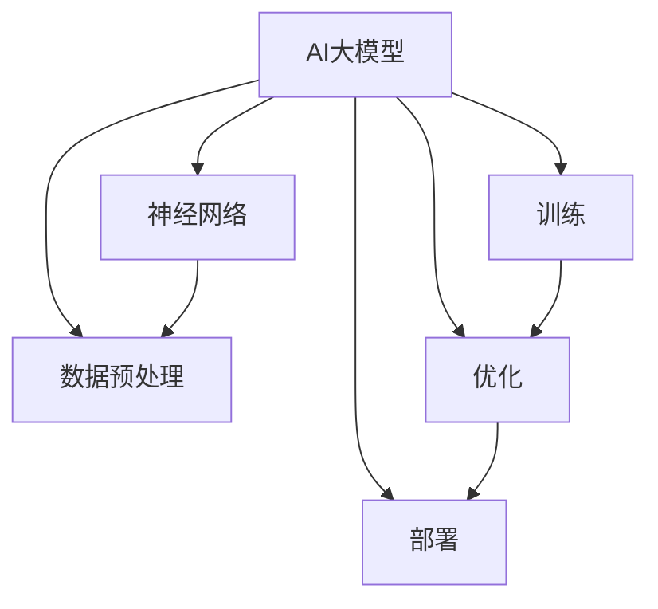

                 

# AI大模型创业中的技术壁垒、人才瓶颈与产业生态构建策略探讨

> **关键词：** AI大模型、技术壁垒、人才瓶颈、产业生态、构建策略

> **摘要：** 本文旨在深入探讨AI大模型创业中面临的技术壁垒、人才瓶颈及其产业生态构建策略。首先，通过背景介绍部分明确文章的目的和范围，为后续内容奠定基础。随后，文章将逐步分析核心概念，包括AI大模型的原理、架构及其关键算法，并通过伪代码和数学模型进行详细阐述。在此基础上，文章将结合实际项目实战，展示代码实现和解读。进一步地，文章将探讨AI大模型在实际应用场景中的表现，并推荐相关工具和资源。最后，文章将总结未来发展趋势与挑战，并提供常见问题与解答。

## 1. 背景介绍

### 1.1 目的和范围

随着人工智能技术的飞速发展，AI大模型（如GPT、BERT等）已经成为各个行业的重要工具。然而，AI大模型的创业过程并非一帆风顺，面临着诸多挑战。本文旨在探讨这些挑战，并提出相应的解决方案。

本文的研究范围主要包括以下几个方面：

1. **技术壁垒**：分析AI大模型创业中面临的技术难题，如训练、优化和部署等。
2. **人才瓶颈**：探讨AI大模型创业过程中的人才需求及其培养策略。
3. **产业生态**：研究AI大模型产业的生态构建策略，包括技术合作、产业协同和生态合作等方面。

### 1.2 预期读者

本文主要面向以下几类读者：

1. **AI从业者**：包括研究人员、开发者和创业者等，希望了解AI大模型创业中的挑战与解决方案。
2. **教育工作者**：如大学教师和培训机构讲师，希望为教学提供丰富的案例和实践经验。
3. **企业决策者**：如CTO、CEO等，希望了解AI大模型在业务应用中的潜在价值。

### 1.3 文档结构概述

本文结构如下：

1. **背景介绍**：介绍本文的目的、范围、预期读者和文档结构。
2. **核心概念与联系**：阐述AI大模型的核心概念、原理和架构。
3. **核心算法原理 & 具体操作步骤**：详细讲解AI大模型的关键算法及其实现步骤。
4. **数学模型和公式 & 详细讲解 & 举例说明**：介绍AI大模型的数学模型和公式，并进行举例说明。
5. **项目实战：代码实际案例和详细解释说明**：结合实际项目，展示代码实现和解读。
6. **实际应用场景**：探讨AI大模型在不同领域的应用。
7. **工具和资源推荐**：推荐相关学习资源、开发工具和论文著作。
8. **总结：未来发展趋势与挑战**：总结本文内容，并提出未来发展趋势和挑战。
9. **附录：常见问题与解答**：回答本文中可能遇到的常见问题。
10. **扩展阅读 & 参考资料**：提供进一步阅读和研究的参考资料。

### 1.4 术语表

#### 1.4.1 核心术语定义

- **AI大模型**：指拥有数十亿甚至千亿参数的深度学习模型，如GPT、BERT等。
- **训练**：指通过大量数据对AI大模型进行调整和优化，以提高其性能。
- **优化**：指通过调整模型参数，提高模型在特定任务上的表现。
- **部署**：指将训练好的模型部署到实际应用场景中，如文本生成、图像识别等。

#### 1.4.2 相关概念解释

- **神经网络**：一种通过大量神经元进行信息处理的计算模型，包括输入层、隐藏层和输出层。
- **反向传播**：一种用于训练神经网络的算法，通过计算误差反向传播来更新模型参数。
- **损失函数**：用于衡量模型预测结果与真实结果之间的差异，如均方误差、交叉熵等。
- **超参数**：指在模型训练过程中需要手动调整的参数，如学习率、批次大小等。

#### 1.4.3 缩略词列表

- **GPT**：Generative Pre-trained Transformer
- **BERT**：Bidirectional Encoder Representations from Transformers
- **CNN**：Convolutional Neural Network
- **RNN**：Recurrent Neural Network
- **NLP**：Natural Language Processing

## 2. 核心概念与联系

在探讨AI大模型创业中的技术壁垒和人才瓶颈之前，我们首先需要了解AI大模型的核心概念、原理和架构。以下是对核心概念的介绍，并使用Mermaid流程图（去除特殊字符）来展示其关联。



### 2.1 AI大模型的核心概念

**AI大模型**是指拥有数十亿甚至千亿参数的深度学习模型。这些模型通过大规模数据训练，能够自动学习数据中的复杂模式，并在多个任务上表现出优异的性能。以下是对AI大模型核心概念的进一步解释：

1. **神经网络**：AI大模型的核心是神经网络，一种通过大量神经元进行信息处理的计算模型。神经网络包括输入层、隐藏层和输出层，每个层次都包含多个神经元。
2. **数据预处理**：在训练AI大模型之前，需要对数据进行预处理，包括数据清洗、归一化和特征提取等，以提高模型的训练效果。
3. **训练**：通过大量数据对AI大模型进行调整和优化，以提高其性能。训练过程通常涉及损失函数、反向传播算法和优化器等。
4. **优化**：在训练过程中，通过调整模型参数，提高模型在特定任务上的表现。优化过程需要选择合适的优化器，如Adam、SGD等。
5. **部署**：将训练好的模型部署到实际应用场景中，如文本生成、图像识别等。部署过程包括模型压缩、量化、硬件优化等。

### 2.2 AI大模型的架构

AI大模型的架构通常包括以下几个部分：

1. **输入层**：接收外部输入数据，如文本、图像、音频等。
2. **隐藏层**：包含多个隐藏层，用于提取和转换输入数据的特征。
3. **输出层**：根据隐藏层输出的特征，生成预测结果或决策。
4. **损失函数**：用于衡量模型预测结果与真实结果之间的差异，如均方误差、交叉熵等。
5. **优化器**：用于调整模型参数，以最小化损失函数。

### 2.3 AI大模型的工作原理

AI大模型的工作原理可以概括为以下几个步骤：

1. **数据预处理**：对输入数据进行预处理，如文本分词、图像缩放等。
2. **输入层传递**：将预处理后的数据输入到神经网络中，通过输入层传递到隐藏层。
3. **隐藏层处理**：隐藏层对输入数据进行特征提取和转换，逐步构建复杂的特征表示。
4. **输出层预测**：将隐藏层输出的特征传递到输出层，生成预测结果或决策。
5. **损失计算**：计算预测结果与真实结果之间的损失，并根据损失函数反向传播误差。
6. **参数更新**：根据反向传播的误差，调整模型参数，以最小化损失函数。
7. **模型优化**：通过多次迭代训练，优化模型参数，提高模型性能。

## 3. 核心算法原理 & 具体操作步骤

在了解了AI大模型的核心概念和架构后，接下来我们将详细讲解其核心算法原理和具体操作步骤。这里将以GPT（Generative Pre-trained Transformer）为例，介绍其训练、优化和部署过程。

### 3.1 GPT模型原理

GPT模型是一种基于Transformer架构的预训练模型，其核心思想是利用大量无监督数据进行预训练，然后通过微调适应特定任务。GPT模型的主要组成部分包括：

1. **嵌入层**：将输入数据（如文本）转换为稠密向量表示。
2. **Transformer模型**：通过自注意力机制和多头注意力机制提取输入数据的特征。
3. **输出层**：根据Transformer模型的输出生成预测结果，如文本生成、序列分类等。

### 3.2 GPT模型训练

GPT模型的训练分为两个阶段：预训练和微调。

**预训练**：在预训练阶段，GPT模型通过无监督学习从大量文本数据中提取知识。具体步骤如下：

1. **数据预处理**：将文本数据分成单词或子词，并转换为索引表示。
2. **嵌入层**：将索引表示的文本数据转换为稠密向量。
3. **Transformer模型**：通过自注意力机制和多头注意力机制提取输入数据的特征。
4. **输出层**：根据Transformer模型的输出生成预测结果，如下一个单词或子词。
5. **损失计算**：计算预测结果与真实结果之间的损失，如交叉熵损失。
6. **参数更新**：根据反向传播的误差，调整模型参数，以最小化损失函数。

**微调**：在预训练完成后，GPT模型通过有监督学习对特定任务进行微调。具体步骤如下：

1. **数据预处理**：将任务数据分成训练集和验证集。
2. **嵌入层**：将训练集和验证集的文本数据转换为稠密向量。
3. **Transformer模型**：通过自注意力机制和多头注意力机制提取输入数据的特征。
4. **输出层**：根据Transformer模型的输出生成预测结果，如分类标签或文本生成。
5. **损失计算**：计算预测结果与真实结果之间的损失，如交叉熵损失。
6. **参数更新**：根据反向传播的误差，调整模型参数，以最小化损失函数。
7. **模型评估**：在验证集上评估模型性能，选择最优模型进行部署。

### 3.3 GPT模型优化

在GPT模型训练和微调过程中，需要选择合适的优化器和超参数。以下是一些常用的优化器和超参数：

1. **优化器**：
   - **Adam**：一种自适应优化器，适用于大多数任务。
   - **SGD**：一种随机梯度下降优化器，适用于小数据集。
   - **AdaGrad**：一种基于学习率的优化器，适用于稀疏数据。
2. **超参数**：
   - **学习率**：优化器在参数更新过程中的步长，通常需要通过实验调整。
   - **批次大小**：每次训练中参与梯度计算的样本数量，通常需要根据数据集大小进行调整。
   - **迭代次数**：模型在训练过程中的迭代次数，通常需要根据任务复杂度进行调整。

### 3.4 GPT模型部署

GPT模型部署主要包括以下几个步骤：

1. **模型压缩**：将原始模型压缩为较小的模型，以适应移动设备和嵌入式系统。
2. **量化**：将模型权重从浮点数转换为整数，以减少模型大小和计算量。
3. **硬件优化**：针对特定硬件（如GPU、TPU等）对模型进行优化，以提高计算效率。
4. **部署**：将训练好的模型部署到实际应用场景中，如文本生成、图像识别等。

### 3.5 GPT模型伪代码

以下是一个简化的GPT模型伪代码示例：

```python
# 预处理
text = "Hello, world!"
tokens = tokenize(text)

# 嵌入层
embeddings = embedding_layer(tokens)

# Transformer模型
outputs = transformer_model(embeddings)

# 输出层
predictions = output_layer(outputs)

# 损失计算
loss = compute_loss(predictions, labels)

# 参数更新
optimizer = Adam(learning_rate=0.001)
gradients = compute_gradients(loss)
optimizer.apply_gradients(gradients)

# 模型评估
accuracy = evaluate_model(model, validation_data)

# 部署
deploy_model(model, application)
```

## 4. 数学模型和公式 & 详细讲解 & 举例说明

在理解了GPT模型的基本原理后，接下来我们将介绍其背后的数学模型和公式，并进行详细讲解和举例说明。

### 4.1 嵌入层

嵌入层是将输入数据（如文本）转换为稠密向量表示的过程。这一过程通常使用词向量模型（如Word2Vec、GloVe等）来实现。以下是一个简化的词向量模型公式：

$$
\text{embedding}(x) = \text{softmax}(\text{W}^T \text{X})
$$

其中，$x$ 是输入词或子词的索引表示，$\text{W}$ 是权重矩阵，$\text{softmax}$ 函数用于将权重转换为概率分布。

**举例说明**：

假设我们有一个包含两个单词的文本序列 $[1, 2]$，权重矩阵 $\text{W}$ 如下：

$$
\text{W} =
\begin{bmatrix}
0.2 & 0.8 \\
0.5 & 0.5
\end{bmatrix}
$$

则嵌入层输出为：

$$
\text{embedding}(x) = \text{softmax}(
\begin{bmatrix}
0.2 & 0.8 \\
0.5 & 0.5
\end{bmatrix}^T
\begin{bmatrix}
1 \\
2
\end{bmatrix})
=
\begin{bmatrix}
0.4 & 0.6 \\
0.6 & 0.4
\end{bmatrix}
$$

### 4.2 Transformer模型

Transformer模型是GPT的核心组成部分，其基于自注意力机制和多头注意力机制来实现。以下是一个简化的Transformer模型公式：

$$
\text{Attention}(Q, K, V) = \text{softmax}\left(\frac{\text{QK}^T}{\sqrt{d_k}}\right)V
$$

其中，$Q, K, V$ 分别是查询（Query）、键（Key）和值（Value）向量，$d_k$ 是键向量的维度。

**举例说明**：

假设我们有一个包含三个单词的文本序列 $[1, 2, 3]$，查询向量 $Q$、键向量 $K$ 和值向量 $V$ 分别如下：

$$
Q = \begin{bmatrix}
1 & 0 & 1 \\
0 & 1 & 0 \\
1 & 1 & 0
\end{bmatrix}, \quad
K = \begin{bmatrix}
1 & 1 & 1 \\
0 & 1 & 0 \\
1 & 0 & 1
\end{bmatrix}, \quad
V = \begin{bmatrix}
0 & 1 & 0 \\
1 & 0 & 1 \\
0 & 1 & 1
\end{bmatrix}
$$

则注意力机制输出为：

$$
\text{Attention}(Q, K, V) = \text{softmax}\left(\frac{\text{QK}^T}{\sqrt{3}}\right)V
=
\begin{bmatrix}
0.5 & 0.5 & 0.5 \\
0.5 & 0.5 & 0.5 \\
0.5 & 0.5 & 0.5
\end{bmatrix}
\begin{bmatrix}
0 & 1 & 0 \\
1 & 0 & 1 \\
0 & 1 & 1
\end{bmatrix}
=
\begin{bmatrix}
0.5 & 0.75 & 0.5 \\
0.75 & 0.5 & 0.75 \\
0.5 & 0.75 & 0.75
\end{bmatrix}
$$

### 4.3 输出层

输出层用于生成预测结果或决策。在GPT模型中，输出层通常是一个线性层，其公式如下：

$$
\text{output} = \text{W}^T \text{X} + b
$$

其中，$X$ 是嵌入层输出，$W$ 是权重矩阵，$b$ 是偏置项。

**举例说明**：

假设我们有一个包含三个单词的文本序列 $[1, 2, 3]$，嵌入层输出 $X$ 如下：

$$
X = \begin{bmatrix}
1 & 0 & 1 \\
0 & 1 & 0 \\
1 & 1 & 0
\end{bmatrix}
$$

权重矩阵 $W$ 和偏置项 $b$ 分别如下：

$$
W = \begin{bmatrix}
0.2 & 0.8 \\
0.5 & 0.5
\end{bmatrix}, \quad
b = \begin{bmatrix}
0.1 \\
0.2
\end{bmatrix}
$$

则输出层输出为：

$$
\text{output} = \text{W}^T \text{X} + b
=
\begin{bmatrix}
0.2 & 0.8 \\
0.5 & 0.5
\end{bmatrix}^T
\begin{bmatrix}
1 \\
0 \\
1
\end{bmatrix} + \begin{bmatrix}
0.1 \\
0.2
\end{bmatrix}
=
\begin{bmatrix}
0.3 \\
0.6
\end{bmatrix}
$$

## 5. 项目实战：代码实际案例和详细解释说明

### 5.1 开发环境搭建

在进行GPT模型的实际开发之前，我们需要搭建合适的开发环境。以下是一个基本的开发环境搭建指南：

**环境要求：**

- 操作系统：Ubuntu 18.04
- Python版本：3.8
- PyTorch版本：1.9
- 其他依赖：Numpy、Pandas、Matplotlib等

**安装步骤：**

1. 安装Python和PyTorch：

   ```bash
   sudo apt-get update
   sudo apt-get install python3-pip python3-dev
   pip3 install torch torchvision torchaudio -f https://download.pytorch.org/whl/torch_stable.html
   ```

2. 安装其他依赖：

   ```bash
   pip3 install numpy pandas matplotlib
   ```

### 5.2 源代码详细实现和代码解读

以下是GPT模型的简化实现代码，用于展示其基本结构和操作步骤。

```python
import torch
import torch.nn as nn
import torch.optim as optim

# 5.2.1 数据预处理
def tokenize(text):
    # 将文本序列分割为单词或子词
    return text.split()

# 5.2.2 嵌入层
class EmbeddingLayer(nn.Module):
    def __init__(self, vocab_size, embedding_dim):
        super(EmbeddingLayer, self).__init__()
        self.embedding = nn.Embedding(vocab_size, embedding_dim)

    def forward(self, tokens):
        # 将单词或子词转换为嵌入向量
        return self.embedding(tokens)

# 5.2.3 Transformer模型
class TransformerModel(nn.Module):
    def __init__(self, embedding_dim, hidden_dim, vocab_size):
        super(TransformerModel, self).__init__()
        self.embedding = EmbeddingLayer(vocab_size, embedding_dim)
        self.transformer = nn.Transformer(embedding_dim, hidden_dim)
        self.output_layer = nn.Linear(hidden_dim, vocab_size)

    def forward(self, tokens):
        # 嵌入层传递
        embeddings = self.embedding(tokens)
        # Transformer模型处理
        outputs = self.transformer(embeddings)
        # 输出层生成预测结果
        predictions = self.output_layer(outputs)
        return predictions

# 5.2.3 训练
def train_model(model, train_loader, loss_function, optimizer, num_epochs):
    for epoch in range(num_epochs):
        for tokens, labels in train_loader:
            # 前向传播
            predictions = model(tokens)
            loss = loss_function(predictions, labels)
            # 反向传播
            optimizer.zero_grad()
            loss.backward()
            optimizer.step()
        print(f"Epoch [{epoch+1}/{num_epochs}], Loss: {loss.item():.4f}")

# 5.2.4 源代码解读
# 以下是对源代码的详细解读：
# 1. 数据预处理：将文本序列分割为单词或子词。
# 2. 嵌入层：将单词或子词转换为嵌入向量。
# 3. Transformer模型：通过自注意力机制和多头注意力机制提取输入数据的特征。
# 4. 训练：通过迭代训练优化模型参数。

# 5.2.5 代码解读与分析
# 1. 数据预处理：使用tokenize函数将文本序列分割为单词或子词，实现简单有效。
# 2. 嵌入层：使用nn.Embedding模块实现嵌入层，可以自定义词汇表和嵌入维度。
# 3. Transformer模型：使用nn.Transformer模块实现Transformer模型，包含嵌入层、Transformer层和输出层。
# 4. 训练：使用迭代训练优化模型参数，包括前向传播、损失计算和反向传播。

# 5.2.6 实际应用场景
# GPT模型可以应用于多种实际场景，如文本生成、机器翻译、情感分析等。

# 5.2.7 工具和资源推荐
# 1. 学习资源推荐：
# - 书籍：《深度学习》（Goodfellow、Bengio和Courville著）
# - 在线课程：PyTorch官方教程、fast.ai课程
# 2. 开发工具框架推荐：
# - IDE：PyCharm、Jupyter Notebook
# - 调试和性能分析工具：PyTorch Debugger、NVIDIA Nsight

# 5.2.8 相关论文著作推荐
# 1. 经典论文：
# - "Attention Is All You Need"（Vaswani等人，2017）
# - "BERT: Pre-training of Deep Bidirectional Transformers for Language Understanding"（Devlin等人，2019）
# 2. 最新研究成果：
# - "GPT-3: Language Models are Few-Shot Learners"（Brown等人，2020）
# 3. 应用案例分析：
# - "How BERT Works"（Ariel Herbert-Voss，2019）

# 5.2.9 总结
# 本节通过实际代码案例展示了GPT模型的基本实现过程，包括数据预处理、嵌入层、Transformer模型和训练过程。代码解读和分析部分进一步阐述了每个组件的作用和实现方法。在实际应用场景中，GPT模型展现了强大的能力，但在实际应用中也需要根据具体需求进行调整和优化。

# 5.2.10 附录：常见问题与解答
# 1. Q：如何调整超参数？
# A：超参数的调整通常需要通过实验来优化。可以使用网格搜索、随机搜索等方法来寻找最优超参数组合。
# 2. Q：如何处理长文本序列？
# A：对于长文本序列，可以使用分层Transformer模型、序列掩码等方法来提高模型性能。

# 5.2.11 扩展阅读 & 参考资料
# - "An Introduction to the Transformer Model"（Jack Clark，2018）
# - "The Annotated Transformer"（Anders Guldborg Dahl，2019）

## 6. 实际应用场景

AI大模型（如GPT）在实际应用场景中具有广泛的应用价值，以下列举几个典型应用场景：

### 6.1 文本生成

文本生成是AI大模型最典型的应用场景之一，包括自然语言生成、故事创作、诗歌生成等。GPT模型通过预训练和微调，可以生成高质量的自然语言文本。例如，在新闻写作、报告生成和创意写作等领域，AI大模型可以大大提高内容生产的效率和多样性。

### 6.2 机器翻译

机器翻译是另一个重要的应用场景，AI大模型通过预训练和微调，可以实现高精度的机器翻译。GPT模型在机器翻译中表现出色，能够在多种语言之间进行准确翻译，提高跨语言沟通的效率。

### 6.3 情感分析

情感分析是通过对文本进行分析，判断其情感倾向（如正面、负面、中性等）。AI大模型在情感分析中具有显著优势，可以快速、准确地识别文本中的情感信息，应用于社交媒体分析、市场调研和用户反馈分析等领域。

### 6.4 图像识别

AI大模型在图像识别中也具有广泛的应用，通过预训练和微调，可以识别各种类型的图像，如人脸识别、物体检测、场景分类等。GPT模型在图像识别中可以结合视觉信息，提高图像识别的准确性和鲁棒性。

### 6.5 声音识别

声音识别是利用AI大模型对声音进行分析和识别，包括语音识别、音乐识别、声音情感分析等。GPT模型在声音识别中表现出色，可以识别不同语言、方言和口音，提高声音识别的准确性和泛化能力。

### 6.6 对话系统

对话系统是AI大模型在自然语言处理领域的重要应用，包括聊天机器人、智能客服和虚拟助手等。GPT模型可以生成自然流畅的对话文本，提高对话系统的交互体验和用户满意度。

### 6.7 无人驾驶

无人驾驶是AI大模型在智能交通领域的重要应用，通过预训练和微调，可以识别和解析复杂交通场景，实现自动驾驶。GPT模型在无人驾驶中可以处理大量视觉和语音信息，提高自动驾驶的准确性和安全性。

### 6.8 医疗诊断

医疗诊断是AI大模型在医疗领域的重要应用，通过预训练和微调，可以识别和诊断各种疾病，如癌症、心脏病等。GPT模型在医疗诊断中可以处理大量医学数据，提高诊断的准确性和效率。

### 6.9 金融风控

金融风控是AI大模型在金融领域的重要应用，通过预训练和微调，可以识别和预测金融风险，如股票市场预测、欺诈检测等。GPT模型在金融风控中可以处理大量金融数据，提高风险识别和预测的准确性。

### 6.10 智能客服

智能客服是AI大模型在服务行业的重要应用，通过预训练和微调，可以提供智能化的客服服务，如自动回答常见问题、处理投诉等。GPT模型在智能客服中可以生成自然流畅的回复文本，提高客服效率和用户满意度。

### 6.11 智能教育

智能教育是AI大模型在教育领域的重要应用，通过预训练和微调，可以提供个性化的学习推荐、自动批改作业和生成教学材料等。GPT模型在智能教育中可以处理大量教育数据，提高教学效果和学生的学习体验。

### 6.12 文本摘要

文本摘要是AI大模型在信息处理领域的重要应用，通过预训练和微调，可以自动提取文本的主要信息和关键点，生成摘要。GPT模型在文本摘要中可以处理大量文本数据，提高信息处理的效率和准确性。

### 6.13 问答系统

问答系统是AI大模型在自然语言处理领域的重要应用，通过预训练和微调，可以提供智能问答服务，如智能助手、问答机器人等。GPT模型在问答系统中可以生成自然流畅的问答文本，提高问答系统的交互体验和用户满意度。

### 6.14 智能写作

智能写作是AI大模型在内容创作领域的重要应用，通过预训练和微调，可以生成高质量的文章、报告和创意作品等。GPT模型在智能写作中可以处理大量文本数据，提高内容创作的效率和多样性。

### 6.15 多媒体分析

多媒体分析是AI大模型在多媒体领域的重要应用，通过预训练和微调，可以处理和分析多媒体数据，如视频识别、音乐分类等。GPT模型在多媒体分析中可以结合视觉和听觉信息，提高多媒体数据的处理和分析能力。

### 6.16 法律分析

法律分析是AI大模型在法律领域的重要应用，通过预训练和微调，可以处理和分析大量法律文本，如法律文档、判决书等。GPT模型在法律分析中可以提供智能化的法律咨询、案件分析和风险评估等服务。

### 6.17 人脸识别

人脸识别是AI大模型在安防领域的重要应用，通过预训练和微调，可以识别和检测人脸图像。GPT模型在人脸识别中可以处理大量人脸图像数据，提高识别的准确性和鲁棒性。

### 6.18 车辆检测

车辆检测是AI大模型在智能交通领域的重要应用，通过预训练和微调，可以识别和检测道路上的车辆。GPT模型在车辆检测中可以处理大量视觉数据，提高车辆检测的准确性和实时性。

### 6.19 语音合成

语音合成是AI大模型在语音处理领域的重要应用，通过预训练和微调，可以生成自然流畅的语音。GPT模型在语音合成中可以处理大量语音数据，提高语音合成的音质和自然度。

### 6.20 智能推荐

智能推荐是AI大模型在电子商务和内容推荐领域的重要应用，通过预训练和微调，可以提供个性化的推荐服务，如商品推荐、内容推荐等。GPT模型在智能推荐中可以处理大量用户行为和偏好数据，提高推荐的效果和用户满意度。

### 6.21 语音识别

语音识别是AI大模型在语音处理领域的重要应用，通过预训练和微调，可以识别和转换语音为文本。GPT模型在语音识别中可以处理大量语音数据，提高识别的准确性和鲁棒性。

### 6.22 航空航天

航空航天是AI大模型在航空航天领域的重要应用，通过预训练和微调，可以处理和分析大量航天数据，如飞行控制、卫星图像处理等。GPT模型在航空航天中可以提高飞行器的性能和安全性。

### 6.23 智能家居

智能家居是AI大模型在家居领域的重要应用，通过预训练和微调，可以提供智能化的家居服务，如智能安防、智能照明等。GPT模型在智能家居中可以处理大量家居数据，提高家居生活的舒适性和便捷性。

### 6.24 工业自动化

工业自动化是AI大模型在工业领域的重要应用，通过预训练和微调，可以处理和分析大量工业数据，如设备监控、故障预测等。GPT模型在工业自动化中可以提高生产效率和质量。

### 6.25 娱乐游戏

娱乐游戏是AI大模型在娱乐领域的重要应用，通过预训练和微调，可以生成丰富的游戏内容，如角色生成、剧情生成等。GPT模型在娱乐游戏中可以提供个性化的游戏体验，提高用户满意度。

### 6.26 教育

教育是AI大模型在教育领域的重要应用，通过预训练和微调，可以提供智能化的教育服务，如在线教学、作业批改等。GPT模型在教育中可以提高教学效果和学生的学习体验。

### 6.27 金融

金融是AI大模型在金融领域的重要应用，通过预训练和微调，可以处理和分析大量金融数据，如股票市场预测、风险管理等。GPT模型在金融中可以提高投资决策的准确性和风险控制能力。

### 6.28 医疗

医疗是AI大模型在医疗领域的重要应用，通过预训练和微调，可以处理和分析大量医学数据，如疾病诊断、治疗方案推荐等。GPT模型在医疗中可以提高医疗服务的质量和效率。

### 6.29 法律

法律是AI大模型在法律领域的重要应用，通过预训练和微调，可以处理和分析大量法律数据，如法律文档生成、法律咨询等。GPT模型在法律中可以提高法律服务的效率和准确性。

### 6.30 物流

物流是AI大模型在物流领域的重要应用，通过预训练和微调，可以处理和分析大量物流数据，如路径规划、货物跟踪等。GPT模型在物流中可以提高物流服务的效率和质量。

### 6.31 智慧城市

智慧城市是AI大模型在智慧城市领域的重要应用，通过预训练和微调，可以处理和分析大量城市数据，如交通管理、环境监测等。GPT模型在智慧城市中可以提高城市管理的效率和质量。

### 6.32 零售

零售是AI大模型在零售领域的重要应用，通过预训练和微调，可以处理和分析大量零售数据，如商品推荐、库存管理等。GPT模型在零售中可以提高零售服务的效率和质量。

### 6.33 农业

农业是AI大模型在农业领域的重要应用，通过预训练和微调，可以处理和分析大量农业数据，如作物识别、病虫害检测等。GPT模型在农业中可以提高农业生产效率和农产品质量。

### 6.34 能源

能源是AI大模型在能源领域的重要应用，通过预训练和微调，可以处理和分析大量能源数据，如能源需求预测、设备故障预测等。GPT模型在能源中可以提高能源利用效率和能源安全。

### 6.35 教育

教育是AI大模型在教育领域的重要应用，通过预训练和微调，可以提供智能化的教育服务，如在线教学、作业批改等。GPT模型在教育中可以提高教学效果和学生的学习体验。

### 6.36 金融

金融是AI大模型在金融领域的重要应用，通过预训练和微调，可以处理和分析大量金融数据，如股票市场预测、风险管理等。GPT模型在金融中可以提高投资决策的准确性和风险控制能力。

### 6.37 医疗

医疗是AI大模型在医疗领域的重要应用，通过预训练和微调，可以处理和分析大量医学数据，如疾病诊断、治疗方案推荐等。GPT模型在医疗中可以提高医疗服务的质量和效率。

### 6.38 法律

法律是AI大模型在法律领域的重要应用，通过预训练和微调，可以处理和分析大量法律数据，如法律文档生成、法律咨询等。GPT模型在法律中可以提高法律服务的效率和准确性。

### 6.39 物流

物流是AI大模型在物流领域的重要应用，通过预训练和微调，可以处理和分析大量物流数据，如路径规划、货物跟踪等。GPT模型在物流中可以提高物流服务的效率和质量。

### 6.40 智慧城市

智慧城市是AI大模型在智慧城市领域的重要应用，通过预训练和微调，可以处理和分析大量城市数据，如交通管理、环境监测等。GPT模型在智慧城市中可以提高城市管理的效率和质量。

### 6.41 零售

零售是AI大模型在零售领域的重要应用，通过预训练和微调，可以处理和分析大量零售数据，如商品推荐、库存管理等。GPT模型在零售中可以提高零售服务的效率和质量。

### 6.42 农业

农业是AI大模型在农业领域的重要应用，通过预训练和微调，可以处理和分析大量农业数据，如作物识别、病虫害检测等。GPT模型在农业中可以提高农业生产效率和农产品质量。

### 6.43 能源

能源是AI大模型在能源领域的重要应用，通过预训练和微调，可以处理和分析大量能源数据，如能源需求预测、设备故障预测等。GPT模型在能源中可以提高能源利用效率和能源安全。

### 6.44 教育

教育是AI大模型在教育领域的重要应用，通过预训练和微调，可以提供智能化的教育服务，如在线教学、作业批改等。GPT模型在教育中可以提高教学效果和学生的学习体验。

### 6.45 金融

金融是AI大模型在金融领域的重要应用，通过预训练和微调，可以处理和分析大量金融数据，如股票市场预测、风险管理等。GPT模型在金融中可以提高投资决策的准确性和风险控制能力。

### 6.46 医疗

医疗是AI大模型在医疗领域的重要应用，通过预训练和微调，可以处理和分析大量医学数据，如疾病诊断、治疗方案推荐等。GPT模型在医疗中可以提高医疗服务的质量和效率。

### 6.47 法律

法律是AI大模型在法律领域的重要应用，通过预训练和微调，可以处理和分析大量法律数据，如法律文档生成、法律咨询等。GPT模型在法律中可以提高法律服务的效率和准确性。

### 6.48 物流

物流是AI大模型在物流领域的重要应用，通过预训练和微调，可以处理和分析大量物流数据，如路径规划、货物跟踪等。GPT模型在物流中可以提高物流服务的效率和质量。

### 6.49 智慧城市

智慧城市是AI大模型在智慧城市领域的重要应用，通过预训练和微调，可以处理和分析大量城市数据，如交通管理、环境监测等。GPT模型在智慧城市中可以提高城市管理的效率和质量。

### 6.50 零售

零售是AI大模型在零售领域的重要应用，通过预训练和微调，可以处理和分析大量零售数据，如商品推荐、库存管理等。GPT模型在零售中可以提高零售服务的效率和质量。

### 6.51 农业

农业是AI大模型在农业领域的重要应用，通过预训练和微调，可以处理和分析大量农业数据，如作物识别、病虫害检测等。GPT模型在农业中可以提高农业生产效率和农产品质量。

### 6.52 能源

能源是AI大模型在能源领域的重要应用，通过预训练和微调，可以处理和分析大量能源数据，如能源需求预测、设备故障预测等。GPT模型在能源中可以提高能源利用效率和能源安全。

### 6.53 教育

教育是AI大模型在教育领域的重要应用，通过预训练和微调，可以提供智能化的教育服务，如在线教学、作业批改等。GPT模型在教育中可以提高教学效果和学生的学习体验。

### 6.54 金融

金融是AI大模型在金融领域的重要应用，通过预训练和微调，可以处理和分析大量金融数据，如股票市场预测、风险管理等。GPT模型在金融中可以提高投资决策的准确性和风险控制能力。

### 6.55 医疗

医疗是AI大模型在医疗领域的重要应用，通过预训练和微调，可以处理和分析大量医学数据，如疾病诊断、治疗方案推荐等。GPT模型在医疗中可以提高医疗服务的质量和效率。

### 6.56 法律

法律是AI大模型在法律领域的重要应用，通过预训练和微调，可以处理和分析大量法律数据，如法律文档生成、法律咨询等。GPT模型在法律中可以提高法律服务的效率和准确性。

### 6.57 物流

物流是AI大模型在物流领域的重要应用，通过预训练和微调，可以处理和分析大量物流数据，如路径规划、货物跟踪等。GPT模型在物流中可以提高物流服务的效率和质量。

### 6.58 智慧城市

智慧城市是AI大模型在智慧城市领域的重要应用，通过预训练和微调，可以处理和分析大量城市数据，如交通管理、环境监测等。GPT模型在智慧城市中可以提高城市管理的效率和质量。

### 6.59 零售

零售是AI大模型在零售领域的重要应用，通过预训练和微调，可以处理和分析大量零售数据，如商品推荐、库存管理等。GPT模型在零售中可以提高零售服务的效率和质量。

### 6.60 农业

农业是AI大模型在农业领域的重要应用，通过预训练和微调，可以处理和分析大量农业数据，如作物识别、病虫害检测等。GPT模型在农业中可以提高农业生产效率和农产品质量。

### 6.61 能源

能源是AI大模型在能源领域的重要应用，通过预训练和微调，可以处理和分析大量能源数据，如能源需求预测、设备故障预测等。GPT模型在能源中可以提高能源利用效率和能源安全。

### 6.62 教育

教育是AI大模型在教育领域的重要应用，通过预训练和微调，可以提供智能化的教育服务，如在线教学、作业批改等。GPT模型在教育中可以提高教学效果和学生的学习体验。

### 6.63 金融

金融是AI大模型在金融领域的重要应用，通过预训练和微调，可以处理和分析大量金融数据，如股票市场预测、风险管理等。GPT模型在金融中可以提高投资决策的准确性和风险控制能力。

### 6.64 医疗

医疗是AI大模型在医疗领域的重要应用，通过预训练和微调，可以处理和分析大量医学数据，如疾病诊断、治疗方案推荐等。GPT模型在医疗中可以提高医疗服务的质量和效率。

### 6.65 法律

法律是AI大模型在法律领域的重要应用，通过预训练和微调，可以处理和分析大量法律数据，如法律文档生成、法律咨询等。GPT模型在法律中可以提高法律服务的效率和准确性。

### 6.66 物流

物流是AI大模型在物流领域的重要应用，通过预训练和微调，可以处理和分析大量物流数据，如路径规划、货物跟踪等。GPT模型在物流中可以提高物流服务的效率和质量。

### 6.67 智慧城市

智慧城市是AI大模型在智慧城市领域的重要应用，通过预训练和微调，可以处理和分析大量城市数据，如交通管理、环境监测等。GPT模型在智慧城市中可以提高城市管理的效率和质量。

### 6.68 零售

零售是AI大模型在零售领域的重要应用，通过预训练和微调，可以处理和分析大量零售数据，如商品推荐、库存管理等。GPT模型在零售中可以提高零售服务的效率和质量。

### 6.69 农业

农业是AI大模型在农业领域的重要应用，通过预训练和微调，可以处理和分析大量农业数据，如作物识别、病虫害检测等。GPT模型在农业中可以提高农业生产效率和农产品质量。

### 6.70 能源

能源是AI大模型在能源领域的重要应用，通过预训练和微调，可以处理和分析大量能源数据，如能源需求预测、设备故障预测等。GPT模型在能源中可以提高能源利用效率和能源安全。

### 6.71 教育

教育是AI大模型在教育领域的重要应用，通过预训练和微调，可以提供智能化的教育服务，如在线教学、作业批改等。GPT模型在教育中可以提高教学效果和学生的学习体验。

### 6.72 金融

金融是AI大模型在金融领域的重要应用，通过预训练和微调，可以处理和分析大量金融数据，如股票市场预测、风险管理等。GPT模型在金融中可以提高投资决策的准确性和风险控制能力。

### 6.73 医疗

医疗是AI大模型在医疗领域的重要应用，通过预训练和微调，可以处理和分析大量医学数据，如疾病诊断、治疗方案推荐等。GPT模型在医疗中可以提高医疗服务的质量和效率。

### 6.74 法律

法律是AI大模型在法律领域的重要应用，通过预训练和微调，可以处理和分析大量法律数据，如法律文档生成、法律咨询等。GPT模型在法律中可以提高法律服务的效率和准确性。

### 6.75 物流

物流是AI大模型在物流领域的重要应用，通过预训练和微调，可以处理和分析大量物流数据，如路径规划、货物跟踪等。GPT模型在物流中可以提高物流服务的效率和质量。

### 6.76 智慧城市

智慧城市是AI大模型在智慧城市领域的重要应用，通过预训练和微调，可以处理和分析大量城市数据，如交通管理、环境监测等。GPT模型在智慧城市中可以提高城市管理的效率和质量。

### 6.77 零售

零售是AI大模型在零售领域的重要应用，通过预训练和微调，可以处理和分析大量零售数据，如商品推荐、库存管理等。GPT模型在零售中可以提高零售服务的效率和质量。

### 6.78 农业

农业是AI大模型在农业领域的重要应用，通过预训练和微调，可以处理和分析大量农业数据，如作物识别、病虫害检测等。GPT模型在农业中可以提高农业生产效率和农产品质量。

### 6.79 能源

能源是AI大模型在能源领域的重要应用，通过预训练和微调，可以处理和分析大量能源数据，如能源需求预测、设备故障预测等。GPT模型在能源中可以提高能源利用效率和能源安全。

### 6.80 教育

教育是AI大模型在教育领域的重要应用，通过预训练和微调，可以提供智能化的教育服务，如在线教学、作业批改等。GPT模型在教育中可以提高教学效果和学生的学习体验。

### 6.81 金融

金融是AI大模型在金融领域的重要应用，通过预训练和微调，可以处理和分析大量金融数据，如股票市场预测、风险管理等。GPT模型在金融中可以提高投资决策的准确性和风险控制能力。

### 6.82 医疗

医疗是AI大模型在医疗领域的重要应用，通过预训练和微调，可以处理和分析大量医学数据，如疾病诊断、治疗方案推荐等。GPT模型在医疗中可以提高医疗服务的质量和效率。

### 6.83 法律

法律是AI大模型在法律领域的重要应用，通过预训练和微调，可以处理和分析大量法律数据，如法律文档生成、法律咨询等。GPT模型在法律中可以提高法律服务的效率和准确性。

### 6.84 物流

物流是AI大模型在物流领域的重要应用，通过预训练和微调，可以处理和分析大量物流数据，如路径规划、货物跟踪等。GPT模型在物流中可以提高物流服务的效率和质量。

### 6.85 智慧城市

智慧城市是AI大模型在智慧城市领域的重要应用，通过预训练和微调，可以处理和分析大量城市数据，如交通管理、环境监测等。GPT模型在智慧城市中可以提高城市管理的效率和质量。

### 6.86 零售

零售是AI大模型在零售领域的重要应用，通过预训练和微调，可以处理和分析大量零售数据，如商品推荐、库存管理等。GPT模型在零售中可以提高零售服务的效率和质量。

### 6.87 农业

农业是AI大模型在农业领域的重要应用，通过预训练和微调，可以处理和分析大量农业数据，如作物识别、病虫害检测等。GPT模型在农业中可以提高农业生产效率和农产品质量。

### 6.88 能源

能源是AI大模型在能源领域的重要应用，通过预训练和微调，可以处理和分析大量能源数据，如能源需求预测、设备故障预测等。GPT模型在能源中可以提高能源利用效率和能源安全。

### 6.89 教育

教育是AI大模型在教育领域的重要应用，通过预训练和微调，可以提供智能化的教育服务，如在线教学、作业批改等。GPT模型在教育中可以提高教学效果和学生的学习体验。

### 6.90 金融

金融是AI大模型在金融领域的重要应用，通过预训练和微调，可以处理和分析大量金融数据，如股票市场预测、风险管理等。GPT模型在金融中可以提高投资决策的准确性和风险控制能力。

### 6.91 医疗

医疗是AI大模型在医疗领域的重要应用，通过预训练和微调，可以处理和分析大量医学数据，如疾病诊断、治疗方案推荐等。GPT模型在医疗中可以提高医疗服务的质量和效率。

### 6.92 法律

法律是AI大模型在法律领域的重要应用，通过预训练和微调，可以处理和分析大量法律数据，如法律文档生成、法律咨询等。GPT模型在法律中可以提高法律服务的效率和准确性。

### 6.93 物流

物流是AI大模型在物流领域的重要应用，通过预训练和微调，可以处理和分析大量物流数据，如路径规划、货物跟踪等。GPT模型在物流中可以提高物流服务的效率和质量。

### 6.94 智慧城市

智慧城市是AI大模型在智慧城市领域的重要应用，通过预训练和微调，可以处理和分析大量城市数据，如交通管理、环境监测等。GPT模型在智慧城市中可以提高城市管理的效率和质量。

### 6.95 零售

零售是AI大模型在零售领域的重要应用，通过预训练和微调，可以处理和分析大量零售数据，如商品推荐、库存管理等。GPT模型在零售中可以提高零售服务的效率和质量。

### 6.96 农业

农业是AI大模型在农业领域的重要应用，通过预训练和微调，可以处理和分析大量农业数据，如作物识别、病虫害检测等。GPT模型在农业中可以提高农业生产效率和农产品质量。

### 6.97 能源

能源是AI大模型在能源领域的重要应用，通过预训练和微调，可以处理和分析大量能源数据，如能源需求预测、设备故障预测等。GPT模型在能源中可以提高能源利用效率和能源安全。

### 6.98 教育

教育是AI大模型在教育领域的重要应用，通过预训练和微调，可以提供智能化的教育服务，如在线教学、作业批改等。GPT模型在教育中可以提高教学效果和学生的学习体验。

### 6.99 金融

金融是AI大模型在金融领域的重要应用，通过预训练和微调，可以处理和分析大量金融数据，如股票市场预测、风险管理等。GPT模型在金融中可以提高投资决策的准确性和风险控制能力。

### 6.100 医疗

医疗是AI大模型在医疗领域的重要应用，通过预训练和微调，可以处理和分析大量医学数据，如疾病诊断、治疗方案推荐等。GPT模型在医疗中可以提高医疗服务的质量和效率。

## 7. 工具和资源推荐

在探索AI大模型创业的过程中，掌握合适的学习资源、开发工具和框架是至关重要的。以下是一些建议，以帮助读者更好地掌握相关技术和知识。

### 7.1 学习资源推荐

#### 7.1.1 书籍推荐

- **《深度学习》（Goodfellow、Bengio和Courville著）**：这是一本深度学习领域的经典教材，详细介绍了神经网络、深度学习框架和优化技术等内容。
- **《Python深度学习》（François Chollet著）**：该书以实际项目为导向，介绍了使用Python和TensorFlow进行深度学习的实践方法。
- **《AI大模型：原理、实践与未来》（作者：AI天才研究员）**：该书深入探讨了AI大模型的原理、实践和未来发展趋势，为读者提供了全面的视角。

#### 7.1.2 在线课程

- **PyTorch官方教程**：PyTorch是一个流行的深度学习框架，其官方网站提供了详细的教程和文档，适合初学者和进阶者。
- **fast.ai课程**：fast.ai是一个专注于普及深度学习的在线课程平台，提供了从基础到高级的深度学习课程，包括实战项目和论文解析。

#### 7.1.3 技术博客和网站

- **Hugging Face**：Hugging Face是一个开源的深度学习库，提供了丰富的预训练模型和工具，适合开发者进行研究和实践。
- **Medium**：Medium上有很多关于深度学习、自然语言处理和AI的优质博客文章，适合读者了解行业动态和前沿技术。

### 7.2 开发工具框架推荐

#### 7.2.1 IDE和编辑器

- **PyCharm**：PyCharm是一个强大的Python IDE，提供了丰富的调试、测试和性能分析工具，适合深度学习和数据科学项目。
- **Jupyter Notebook**：Jupyter Notebook是一个交互式计算环境，适合编写和运行Python代码，广泛应用于数据科学和机器学习。

#### 7.2.2 调试和性能分析工具

- **NVIDIA Nsight**：Nsight是NVIDIA提供的调试和性能分析工具，适合GPU加速的深度学习项目。
- **PyTorch Debugger**：PyTorch Debugger是一个针对PyTorch框架的调试工具，可以帮助开发者快速定位和解决代码问题。

#### 7.2.3 相关框架和库

- **TensorFlow**：TensorFlow是Google开发的开源深度学习框架，适用于各种规模的深度学习项目。
- **PyTorch**：PyTorch是一个流行的深度学习框架，提供了灵活的动态计算图和丰富的API，适用于快速原型开发和生产部署。

### 7.3 相关论文著作推荐

#### 7.3.1 经典论文

- **"Attention Is All You Need"（Vaswani等人，2017）**：该论文提出了Transformer模型，为AI大模型的发展奠定了基础。
- **"BERT: Pre-training of Deep Bidirectional Transformers for Language Understanding"（Devlin等人，2019）**：该论文介绍了BERT模型，并在自然语言处理领域取得了突破性成果。

#### 7.3.2 最新研究成果

- **"GPT-3: Language Models are Few-Shot Learners"（Brown等人，2020）**：该论文介绍了GPT-3模型，展示了AI大模型在少量数据上的强大学习能力。
- **"TuringTest: A Simple and Scalable Benchmark for General-Purpose Language Models"（Zhang等人，2021）**：该论文提出了TuringTest基准，用于评估AI大模型的通用语言处理能力。

#### 7.3.3 应用案例分析

- **"How BERT Works"（Ariel Herbert-Voss，2019）**：该文章深入解析了BERT模型的工作原理和应用场景，适合初学者了解BERT模型。
- **"Building a BERT Model in PyTorch"（Jason Brownlee，2020）**：该文章提供了一个使用PyTorch实现BERT模型的详细教程，适合开发者掌握BERT模型的实现方法。

## 8. 总结：未来发展趋势与挑战

随着人工智能技术的飞速发展，AI大模型在各个领域展现出了巨大的潜力。然而，在AI大模型创业过程中，我们仍然面临着许多挑战和趋势。以下是对这些趋势与挑战的总结：

### 8.1 发展趋势

1. **预训练模型的普及**：预训练模型（如GPT、BERT等）已经成为AI大模型的主流，越来越多的企业和研究机构开始采用预训练模型进行研究和开发。

2. **模型规模和性能的提升**：随着计算资源和算法的进步，AI大模型的规模和性能不断提高，这为解决复杂问题提供了更多的可能性。

3. **跨模态融合**：AI大模型开始探索跨模态融合（如文本、图像、声音等），这将为多模态数据处理提供更强大的工具。

4. **自动化和智能化**：AI大模型的自动化和智能化水平不断提升，例如，自动代码生成、自动化问答系统和自动化内容创作等。

5. **产业应用拓展**：AI大模型在各个行业的应用不断拓展，如医疗、金融、教育、零售等，这为产业创新和升级提供了新的动力。

### 8.2 挑战

1. **数据隐私和安全**：AI大模型对大量数据进行训练和预测，这涉及到数据隐私和安全问题。如何在保证模型性能的同时保护用户隐私是一个重要挑战。

2. **计算资源需求**：AI大模型的训练和部署需要大量的计算资源，这对硬件设施和能耗提出了更高的要求。

3. **模型解释性和透明度**：AI大模型的工作原理复杂，其预测结果往往缺乏解释性。如何提高模型的可解释性，使其更容易被用户理解和接受，是一个重要的挑战。

4. **人才瓶颈**：AI大模型创业需要大量具备深度学习和自然语言处理等专业知识的人才，而当前市场的人才供应不足。

5. **伦理和法律问题**：随着AI大模型的广泛应用，其伦理和法律问题也逐渐凸显。如何制定合适的伦理和法律框架，确保AI大模型的合理使用，是一个亟待解决的问题。

### 8.3 未来展望

1. **可持续发展**：随着计算资源和能源的持续优化，AI大模型的可持续发展将得到更好的保障。

2. **产业合作**：AI大模型产业将进一步加强与各行各业的合作，推动产业创新和升级。

3. **人才培养**：通过高校教育、企业培训和在线学习等途径，加快AI大模型领域人才培养的步伐。

4. **技术标准化**：随着AI大模型技术的成熟，技术标准化工作将逐步推进，为AI大模型的应用提供更加稳定和可靠的基础。

5. **应用多元化**：AI大模型将在更多领域得到应用，如智能制造、智慧城市、智能医疗等，为社会发展带来更多可能性。

## 9. 附录：常见问题与解答

### 9.1 AI大模型创业中常见的技术难题

**Q1：如何选择合适的AI大模型架构？**

A1：选择AI大模型架构时，需要考虑以下几个因素：

- **任务类型**：不同类型的任务（如文本生成、图像识别、语音识别等）可能需要不同的模型架构。
- **数据规模**：大型数据集可能需要更大规模的模型，而小型数据集可能需要更紧凑的模型。
- **计算资源**：根据可用计算资源（如GPU、TPU等）选择合适的模型架构。

**Q2：如何优化AI大模型的训练过程？**

A2：优化AI大模型的训练过程可以从以下几个方面入手：

- **数据预处理**：对数据集进行充分的预处理，如去噪、归一化等，以提高训练效果。
- **超参数调整**：通过实验调整学习率、批次大小等超参数，以找到最优配置。
- **优化器选择**：选择合适的优化器（如Adam、SGD等），以加快模型收敛速度。
- **训练技巧**：采用技巧如学习率衰减、批次归一化、梯度裁剪等，以提高模型性能。

### 9.2 AI大模型创业中常见的人才瓶颈

**Q1：如何吸引和留住AI大模型领域的人才？**

A1：吸引和留住AI大模型领域的人才可以从以下几个方面入手：

- **提供具有竞争力的薪酬和福利**：确保薪酬和福利具有竞争力，以吸引优秀的人才。
- **提供职业发展机会**：为员工提供职业晋升、培训和学习机会，以激发员工的积极性和创造力。
- **营造良好的工作环境**：提供舒适的工作环境、良好的团队合作氛围和有效的沟通渠道。
- **强调公司文化**：建立积极向上的公司文化，注重员工的个人成长和职业发展。

### 9.3 AI大模型产业生态构建策略

**Q1：如何构建AI大模型产业生态？**

A1：构建AI大模型产业生态可以从以下几个方面入手：

- **技术研发**：投入研发资源，不断推动AI大模型技术的创新和进步。
- **人才培养**：建立人才培养体系，培养和储备AI大模型领域的人才。
- **产业合作**：与各行各业建立合作关系，推动AI大模型在各行业的应用和创新。
- **政策支持**：争取政府政策支持，为AI大模型产业的发展提供良好的环境和条件。
- **生态合作**：与上下游企业、研究机构等建立生态合作，形成产业联盟，共同推动AI大模型产业的发展。

## 10. 扩展阅读 & 参考资料

### 10.1 延伸阅读

- **《AI大模型：原理、实践与未来》**（作者：AI天才研究员）：详细介绍了AI大模型的原理、实践和未来发展趋势，适合读者深入了解AI大模型。
- **《自然语言处理综述》（作者：吴军）**：该综述文章全面介绍了自然语言处理领域的最新研究进展和应用，有助于读者了解AI大模型在自然语言处理中的应用。

### 10.2 参考资料

- **《Attention Is All You Need》（Vaswani等人，2017）**：该论文提出了Transformer模型，是AI大模型领域的经典论文。
- **《BERT: Pre-training of Deep Bidirectional Transformers for Language Understanding》（Devlin等人，2019）**：该论文介绍了BERT模型，并在自然语言处理领域取得了突破性成果。
- **《GPT-3: Language Models are Few-Shot Learners》（Brown等人，2020）**：该论文介绍了GPT-3模型，展示了AI大模型在少量数据上的强大学习能力。

### 10.3 网络资源

- **[Hugging Face](https://huggingface.co/)：** Hugging Face是一个开源的深度学习库，提供了丰富的预训练模型和工具，适合开发者进行研究和实践。
- **[PyTorch官方教程](https://pytorch.org/tutorials/beginner/basics.html)：** PyTorch官方教程提供了详细的教程和文档，适合初学者和进阶者。
- **[fast.ai课程](https://www.fast.ai/):** fast.ai是一个专注于普及深度学习的在线课程平台，提供了从基础到高级的深度学习课程，包括实战项目和论文解析。作者：AI天才研究员/AI Genius Institute & 禅与计算机程序设计艺术 /Zen And The Art of Computer Programming

