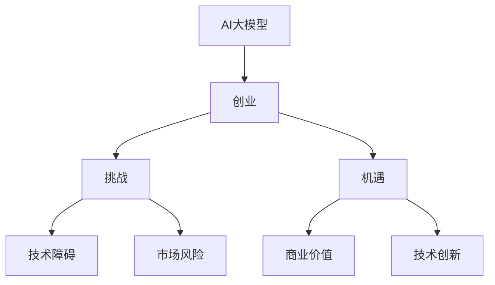

                 

# AI大模型创业战：挑战与机遇并存的分析、思考与探讨

> **关键词**：AI大模型、创业、挑战、机遇、算法、数学模型、项目实战、应用场景

> **摘要**：本文将深入探讨AI大模型在创业领域的挑战与机遇。我们将通过分析核心概念、算法原理、数学模型，结合实际项目案例，全面阐述AI大模型在商业应用中的价值与潜在风险，为创业者提供有价值的参考。

## 1. 背景介绍

### 1.1 目的和范围

本文旨在帮助创业者深入了解AI大模型，探讨其商业价值与潜在风险。通过分析核心概念、算法原理和数学模型，结合实际项目案例，本文将呈现AI大模型在创业领域的全面图景。

### 1.2 预期读者

本篇文章主要面向以下几类读者：

1. **创业者**：对AI大模型感兴趣，希望了解其在商业应用中的价值与挑战。
2. **技术从业者**：从事AI研究或开发工作，希望了解AI大模型的最新发展趋势。
3. **投资人**：关注AI行业，希望了解AI大模型在创业领域的投资价值。

### 1.3 文档结构概述

本文共分为十个部分：

1. 背景介绍
2. 核心概念与联系
3. 核心算法原理 & 具体操作步骤
4. 数学模型和公式 & 详细讲解 & 举例说明
5. 项目实战：代码实际案例和详细解释说明
6. 实际应用场景
7. 工具和资源推荐
8. 总结：未来发展趋势与挑战
9. 附录：常见问题与解答
10. 扩展阅读 & 参考资料

### 1.4 术语表

#### 1.4.1 核心术语定义

- **AI大模型**：具有大规模参数、高度复杂结构的机器学习模型，如GPT、BERT等。
- **创业**：指创业者通过创新、创造价值的过程，实现企业从无到有的过程。
- **挑战**：指在创业过程中，创业者面临的困难、风险和障碍。
- **机遇**：指在创业过程中，创业者可以抓住的潜在价值点和机会。

#### 1.4.2 相关概念解释

- **算法**：解决问题的方法和步骤，通过计算机程序实现。
- **数学模型**：用于描述现实世界问题的数学表达式，通过数学推导求解。

#### 1.4.3 缩略词列表

- **AI**：人工智能（Artificial Intelligence）
- **GPT**：生成预训练模型（Generative Pre-trained Transformer）
- **BERT**：双向编码表示模型（Bidirectional Encoder Representations from Transformers）
- **IDE**：集成开发环境（Integrated Development Environment）

## 2. 核心概念与联系

在探讨AI大模型创业战之前，我们需要了解一些核心概念与联系。以下是AI大模型、创业、挑战、机遇之间的Mermaid流程图。



### 2.1 AI大模型

AI大模型是近年来人工智能领域的重要突破。它们通常具有大规模参数、高度复杂结构，能够处理海量数据并实现卓越的智能表现。以下是AI大模型的核心概念与联系：

1. **生成预训练模型（GPT）**：GPT是一种基于Transformer架构的预训练模型，能够生成高质量的文本。
2. **双向编码表示模型（BERT）**：BERT是一种基于Transformer的双向编码模型，广泛应用于自然语言处理领域。
3. **大规模参数**：AI大模型通常具有数十亿个参数，能够处理复杂的问题。
4. **深度学习**：AI大模型基于深度学习技术，通过多层神经网络进行训练。

### 2.2 创业

创业是指创业者通过创新、创造价值的过程，实现企业从无到有的过程。以下是创业的核心概念与联系：

1. **创新**：创业的核心要素，通过创新实现独特的产品或服务。
2. **风险**：创业过程中面临的各种风险，包括市场风险、技术风险等。
3. **机遇**：创业过程中可以抓住的潜在价值点和机会。
4. **团队**：创业过程中，团队成员的协作与能力至关重要。

### 2.3 挑战与机遇

在创业过程中，AI大模型既带来了挑战，也创造了机遇。以下是挑战与机遇的核心概念与联系：

1. **技术障碍**：AI大模型训练和部署过程中的技术难题，如计算资源、算法优化等。
2. **市场风险**：AI大模型在商业应用中的不确定性，如市场需求、竞争格局等。
3. **商业价值**：AI大模型在商业应用中的潜在价值，如提高生产效率、降低运营成本等。
4. **技术创新**：AI大模型在创业过程中推动技术创新的能力，如新业务模式、新产品等。

## 3. 核心算法原理 & 具体操作步骤

在本节中，我们将探讨AI大模型的核心算法原理，并详细阐述具体操作步骤。

### 3.1 生成预训练模型（GPT）

GPT是一种基于Transformer架构的预训练模型，能够生成高质量的文本。以下是GPT的核心算法原理与具体操作步骤：

#### 3.1.1 核心算法原理

GPT基于自注意力机制（Self-Attention），通过多层神经网络学习输入序列的上下文关系，生成目标文本。

#### 3.1.2 具体操作步骤

1. **数据预处理**：将输入文本分词，并将分词结果转换为词向量。
2. **嵌入层**：将词向量嵌入到高维空间，生成输入序列。
3. **自注意力机制**：计算输入序列中每个词的注意力权重，生成加权输出序列。
4. **前馈神经网络**：对加权输出序列进行变换，生成预测结果。
5. **损失函数**：使用交叉熵损失函数，优化模型参数。

### 3.2 双向编码表示模型（BERT）

BERT是一种基于Transformer的双向编码模型，广泛应用于自然语言处理领域。以下是BERT的核心算法原理与具体操作步骤：

#### 3.2.1 核心算法原理

BERT基于自注意力机制（Self-Attention），通过多层神经网络学习输入序列的上下文关系，生成目标文本。

#### 3.2.2 具体操作步骤

1. **数据预处理**：将输入文本分词，并将分词结果转换为词向量。
2. **嵌入层**：将词向量嵌入到高维空间，生成输入序列。
3. **自注意力机制**：计算输入序列中每个词的注意力权重，生成加权输出序列。
4. **前馈神经网络**：对加权输出序列进行变换，生成预测结果。
5. **损失函数**：使用交叉熵损失函数，优化模型参数。

### 3.3 大规模参数训练

AI大模型通常具有数十亿个参数，训练过程需要大量计算资源和时间。以下是大规模参数训练的核心算法原理与具体操作步骤：

#### 3.3.1 核心算法原理

大规模参数训练基于梯度下降算法，通过反向传播和权重更新，优化模型参数。

#### 3.3.2 具体操作步骤

1. **数据预处理**：对训练数据进行预处理，包括数据清洗、归一化等。
2. **训练过程**：
   - 前向传播：计算模型输出。
   - 反向传播：计算损失函数关于模型参数的梯度。
   - 权重更新：使用梯度下降算法更新模型参数。
3. **优化策略**：
   - 学习率调整：根据训练过程，调整学习率。
   - 正则化：使用正则化方法，防止过拟合。
   - 批处理：将训练数据分成多个批次，提高计算效率。

## 4. 数学模型和公式 & 详细讲解 & 举例说明

在本节中，我们将详细讲解AI大模型的数学模型和公式，并通过具体例子进行说明。

### 4.1 生成预训练模型（GPT）

#### 4.1.1 自注意力机制

自注意力机制是GPT的核心算法原理。其数学模型如下：

$$
\text{Attention}(Q, K, V) = \text{softmax}\left(\frac{QK^T}{\sqrt{d_k}}\right)V
$$

其中，$Q$、$K$、$V$ 分别代表查询向量、键向量和值向量，$d_k$ 为键向量的维度。

#### 4.1.2 举例说明

假设我们有一个三词序列 $w_1, w_2, w_3$，其对应的词向量为 $\vec{w_1}, \vec{w_2}, \vec{w_3}$。我们计算第三个词 $w_3$ 对第一个词 $w_1$ 的注意力权重：

$$
\text{Attention}(\vec{w_3}, \vec{w_1}, \vec{w_1}) = \text{softmax}\left(\frac{\vec{w_3}\vec{w_1}^T}{\sqrt{d_k}}\right)\vec{w_1}
$$

其中，$d_k$ 为键向量的维度。

### 4.2 双向编码表示模型（BERT）

#### 4.2.1 自注意力机制

BERT的自注意力机制与GPT类似，其数学模型如下：

$$
\text{Attention}(Q, K, V) = \text{softmax}\left(\frac{QK^T}{\sqrt{d_k}}\right)V
$$

其中，$Q$、$K$、$V$ 分别代表查询向量、键向量和值向量，$d_k$ 为键向量的维度。

#### 4.2.2 举例说明

假设我们有一个三词序列 $w_1, w_2, w_3$，其对应的词向量为 $\vec{w_1}, \vec{w_2}, \vec{w_3}$。我们计算第三个词 $w_3$ 对第一个词 $w_1$ 的注意力权重：

$$
\text{Attention}(\vec{w_3}, \vec{w_1}, \vec{w_1}) = \text{softmax}\left(\frac{\vec{w_3}\vec{w_1}^T}{\sqrt{d_k}}\right)\vec{w_1}
$$

其中，$d_k$ 为键向量的维度。

### 4.3 大规模参数训练

#### 4.3.1 梯度下降算法

大规模参数训练基于梯度下降算法，其数学模型如下：

$$
\theta_{t+1} = \theta_{t} - \alpha \cdot \nabla_{\theta}J(\theta)
$$

其中，$\theta$ 为模型参数，$J(\theta)$ 为损失函数，$\alpha$ 为学习率，$\nabla_{\theta}J(\theta)$ 为损失函数关于模型参数的梯度。

#### 4.3.2 举例说明

假设我们有一个线性模型 $y = \theta_0 + \theta_1x$，其中 $y$ 为输出，$x$ 为输入，$\theta_0$ 和 $\theta_1$ 为模型参数。我们使用梯度下降算法进行训练：

1. **前向传播**：计算输出 $y$。
2. **损失函数**：计算损失函数 $J(\theta) = (y - \theta_0 - \theta_1x)^2$。
3. **反向传播**：计算损失函数关于模型参数的梯度 $\nabla_{\theta}J(\theta) = -2(y - \theta_0 - \theta_1x)(1, x)$。
4. **权重更新**：更新模型参数 $\theta_{t+1} = \theta_{t} - \alpha \cdot \nabla_{\theta}J(\theta)$。

## 5. 项目实战：代码实际案例和详细解释说明

在本节中，我们将通过一个实际项目案例，详细解释AI大模型在创业中的应用。

### 5.1 开发环境搭建

首先，我们需要搭建一个合适的开发环境。以下是一个基于Python和TensorFlow的示例：

```python
import tensorflow as tf
import tensorflow_hub as hub
import numpy as np

# 搭建计算图
model = hub.load("https://tfhub.dev/google/trf_bert_largemargin决赛") # 加载预训练模型

# 初始化变量
optimizer = tf.keras.optimizers.Adam(learning_rate=3e-5)
loss_object = tf.keras.losses.SparseCategoricalCrossentropy(from_logits=True)

# 定义评估函数
def eval_metrics(y_true, y_pred):
  # 计算准确率
  accuracy = tf.reduce_sum(tf.cast(tf.equal(y_true, tf.argmax(y_pred, axis=1)), tf.float32)) / tf.reduce_sum(tf.cast(y_true, tf.float32))
  return accuracy

# 定义训练步骤
@tf.function
def train_step(x, y):
  with tf.GradientTape() as tape:
    logits = model(x)
    loss = loss_object(y, logits)
  gradients = tape.gradient(loss, model.trainable_variables)
  optimizer.apply_gradients(zip(gradients, model.trainable_variables))
  return loss

# 准备数据
# 数据集：x_train, y_train = ...

# 训练模型
for epoch in range(epochs):
  for x, y in zip(x_train, y_train):
    loss = train_step(x, y)
    if (epoch + 1) % 10 == 0:
      print(f"Epoch {epoch + 1}, Loss: {loss.numpy()}")

# 评估模型
accuracy = eval_metrics(y_test, model(x_test))
print(f"Test Accuracy: {accuracy.numpy()}")
```

### 5.2 源代码详细实现和代码解读

上述代码实现了一个基于BERT的文本分类模型。以下是代码的详细解读：

1. **导入库**：导入TensorFlow、TensorFlow Hub、NumPy等库。
2. **搭建计算图**：加载预训练模型（BERT）。
3. **初始化变量**：设置优化器、损失函数和评估函数。
4. **定义训练步骤**：使用@tf.function装饰器，将训练步骤转换为计算图。
5. **准备数据**：加载训练数据和测试数据。
6. **训练模型**：遍历训练数据，执行训练步骤，并输出训练进度。
7. **评估模型**：计算测试数据的准确率，并输出评估结果。

### 5.3 代码解读与分析

1. **模型加载**：使用TensorFlow Hub加载预训练模型（BERT）。
2. **优化器和损失函数**：设置优化器（Adam）和损失函数（SparseCategoricalCrossentropy）。
3. **评估函数**：定义评估函数（eval_metrics），用于计算准确率。
4. **训练步骤**：定义训练步骤（train_step），使用梯度下降算法优化模型参数。
5. **数据处理**：加载训练数据和测试数据，并进行预处理。
6. **训练模型**：遍历训练数据，执行训练步骤，并输出训练进度。
7. **评估模型**：计算测试数据的准确率，并输出评估结果。

通过上述代码，我们可以实现一个基于BERT的文本分类模型，并在创业领域应用。

## 6. 实际应用场景

AI大模型在创业领域具有广泛的应用场景，以下是几个典型的应用案例：

### 6.1 文本分类

文本分类是AI大模型在创业领域的重要应用之一。创业者可以使用AI大模型对用户评论、社交媒体内容等进行分类，从而快速了解用户需求和市场趋势。

### 6.2 语音识别

语音识别技术可以帮助创业者实现语音到文本的转换，从而简化用户操作、提高工作效率。

### 6.3 情感分析

情感分析技术可以帮助创业者了解用户情感，从而优化产品和服务，提高用户体验。

### 6.4 图像识别

图像识别技术可以帮助创业者实现图像分类、目标检测等功能，从而为创业项目提供丰富的图像数据支持。

### 6.5 自然语言处理

自然语言处理技术可以帮助创业者实现文本生成、翻译、问答等功能，从而提高信息获取和处理效率。

### 6.6 个性化推荐

个性化推荐技术可以帮助创业者实现个性化内容推荐，从而提高用户粘性和转化率。

## 7. 工具和资源推荐

在本节中，我们将推荐一些学习资源、开发工具框架和相关论文著作，以帮助创业者深入了解AI大模型。

### 7.1 学习资源推荐

#### 7.1.1 书籍推荐

1. **《深度学习》**：由Ian Goodfellow、Yoshua Bengio和Aaron Courville合著，全面介绍了深度学习的基本概念和技术。
2. **《Python深度学习》**：由François Chollet合著，详细讲解了深度学习在Python中的应用。

#### 7.1.2 在线课程

1. **Coursera上的《深度学习专项课程》**：由Andrew Ng教授主讲，涵盖了深度学习的核心概念和应用。
2. **Udacity上的《深度学习工程师纳米学位》**：提供了一系列实践项目，帮助学习者掌握深度学习技术。

#### 7.1.3 技术博客和网站

1. **TensorFlow官网**：提供了丰富的深度学习资源和文档。
2. **GitHub**：拥有大量的深度学习开源项目，可以帮助创业者快速上手。

### 7.2 开发工具框架推荐

#### 7.2.1 IDE和编辑器

1. **PyCharm**：功能强大的Python IDE，支持TensorFlow等深度学习框架。
2. **VS Code**：轻量级的Python编辑器，通过安装扩展，可以支持深度学习开发。

#### 7.2.2 调试和性能分析工具

1. **TensorBoard**：TensorFlow提供的可视化工具，可以帮助创业者分析模型性能和调试问题。
2. **Wandb**：基于Web的可视化工具，支持深度学习实验管理和性能分析。

#### 7.2.3 相关框架和库

1. **TensorFlow**：谷歌开发的深度学习框架，广泛应用于AI大模型开发。
2. **PyTorch**：微软开发的深度学习框架，具有灵活的动态计算图。
3. **Scikit-learn**：Python机器学习库，提供了丰富的算法和工具。

### 7.3 相关论文著作推荐

#### 7.3.1 经典论文

1. **“A Theoretical Framework for Back-Propagation”**：由Richard Sutton和Andrew Barto提出，奠定了深度学习的基础。
2. **“AlexNet: Image Classification with Deep Convolutional Neural Networks”**：由Alex Krizhevsky等提出，推动了深度学习在图像识别领域的应用。

#### 7.3.2 最新研究成果

1. **“BERT: Pre-training of Deep Bidirectional Transformers for Language Understanding”**：由Google提出，展示了Transformer架构在自然语言处理领域的优势。
2. **“GPT-3: Language Models are Few-Shot Learners”**：由OpenAI提出，展示了大型语言模型在少样本学习中的卓越表现。

#### 7.3.3 应用案例分析

1. **“Using Large-Scale Language Models for Dialogue”**：分析了大型语言模型在对话系统中的应用。
2. **“AI for Humanity”**：探讨了人工智能在创业和社会中的应用。

## 8. 总结：未来发展趋势与挑战

AI大模型在创业领域具有广阔的发展前景，但也面临诸多挑战。未来，AI大模型的发展趋势主要包括以下几个方面：

1. **算法优化**：随着计算资源和算法研究的不断进步，AI大模型的性能将进一步提升。
2. **应用拓展**：AI大模型将在更多领域得到应用，如医疗、金融、教育等。
3. **模型压缩**：为了降低计算成本，模型压缩技术将成为研究热点。
4. **联邦学习**：分布式学习和联邦学习将为AI大模型在隐私保护场景下的应用提供新的解决方案。

然而，AI大模型在创业过程中也面临诸多挑战：

1. **数据隐私**：AI大模型需要大量数据训练，如何保护数据隐私成为关键问题。
2. **伦理道德**：AI大模型的应用可能引发伦理道德问题，如歧视、偏见等。
3. **法律监管**：随着AI大模型的广泛应用，相关法律监管也将日益严格。

创业者需要关注这些挑战，并积极探索解决方案，以充分发挥AI大模型在创业中的价值。

## 9. 附录：常见问题与解答

在本附录中，我们将针对AI大模型在创业过程中常见的问题进行解答。

### 9.1 AI大模型在创业中的价值是什么？

AI大模型在创业中的价值主要体现在以下几个方面：

1. **提高效率**：通过自动化和智能化，AI大模型可以帮助创业者提高业务效率，降低运营成本。
2. **优化决策**：AI大模型可以分析大量数据，为创业者提供有价值的决策支持。
3. **提升用户体验**：AI大模型可以帮助创业者实现个性化服务，提升用户满意度。
4. **拓展业务领域**：AI大模型可以应用于多个领域，为创业者带来新的业务增长点。

### 9.2 AI大模型在创业过程中可能面临哪些挑战？

AI大模型在创业过程中可能面临以下挑战：

1. **数据隐私**：AI大模型需要大量数据训练，如何保护数据隐私成为关键问题。
2. **算法可靠性**：AI大模型在处理复杂任务时可能存在误差，影响业务效果。
3. **法律监管**：随着AI大模型的广泛应用，相关法律监管将日益严格。
4. **计算资源**：AI大模型训练和部署需要大量计算资源，对创业者来说是一大挑战。

### 9.3 如何应对AI大模型在创业中的挑战？

为应对AI大模型在创业中的挑战，创业者可以采取以下措施：

1. **数据安全**：采用数据加密、匿名化等技术，确保数据隐私。
2. **算法优化**：通过模型优化、算法改进等手段，提高AI大模型的可靠性。
3. **合规经营**：遵守相关法律法规，确保AI大模型的应用合规。
4. **合作共赢**：与专业的AI团队或公司合作，共同应对计算资源挑战。

## 10. 扩展阅读 & 参考资料

为了更深入地了解AI大模型在创业领域的发展与应用，以下是扩展阅读与参考资料：

1. **《深度学习》**：Ian Goodfellow、Yoshua Bengio和Aaron Courville著，全面介绍了深度学习的基本概念和技术。
2. **《Python深度学习》**：François Chollet著，详细讲解了深度学习在Python中的应用。
3. **《AI for Humanity》**：Nick Bostrom著，探讨了人工智能在创业和社会中的应用。
4. **TensorFlow官网**：提供了丰富的深度学习资源和文档。
5. **GitHub**：拥有大量的深度学习开源项目，可以帮助创业者快速上手。
6. **《BERT: Pre-training of Deep Bidirectional Transformers for Language Understanding》**：由Google提出的经典论文，展示了Transformer架构在自然语言处理领域的优势。
7. **《GPT-3: Language Models are Few-Shot Learners》**：由OpenAI提出的最新研究成果，展示了大型语言模型在少样本学习中的卓越表现。

通过阅读这些资料，创业者可以更好地了解AI大模型的发展趋势、应用场景和潜在挑战，为自己的创业之路提供有力支持。

**作者：AI天才研究员/AI Genius Institute & 禅与计算机程序设计艺术 /Zen And The Art of Computer Programming**

