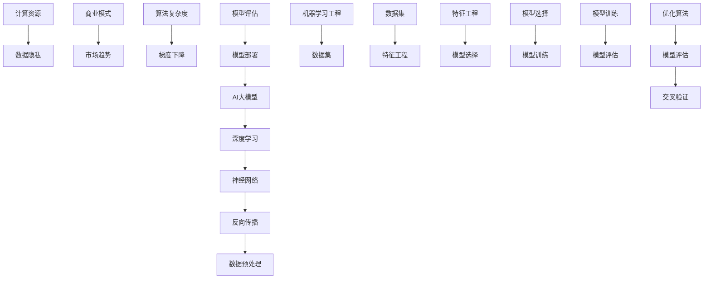

                 

### AI大模型创业战：挑战与机遇并存的现状、趋势与未来

> **关键词：** AI大模型，创业，挑战，机遇，趋势，未来，深度学习，数据隐私，商业模式，技术发展。
>
> **摘要：** 本文深入探讨了AI大模型在创业领域的现状、面临的挑战与机遇，以及未来的发展趋势。文章从核心概念、算法原理、数学模型到实战案例，全面剖析了AI大模型的开发与应用，为创业者提供了有价值的参考。

### 1. 背景介绍

#### 1.1 目的和范围

本文旨在为AI大模型领域的创业者提供深入的洞察，帮助他们在挑战与机遇并存的市场中找到定位和发展策略。文章将涵盖以下内容：

1. **现状分析**：介绍AI大模型在创业领域的现状，包括市场趋势、技术发展和行业应用。
2. **挑战与机遇**：探讨创业者面临的关键挑战，如数据隐私、计算资源、商业模式等，并分析这些挑战背后的机遇。
3. **核心算法原理**：详细解释AI大模型的核心算法，包括深度学习、神经网络等。
4. **数学模型和公式**：介绍AI大模型中常用的数学模型和公式，并给出具体实例。
5. **项目实战**：通过实际代码案例，展示AI大模型的开发与应用过程。
6. **实际应用场景**：分析AI大模型在各个领域的应用场景和未来潜力。
7. **工具和资源推荐**：推荐学习资源、开发工具和相关论文著作，帮助读者深入了解AI大模型。
8. **总结与展望**：总结AI大模型的未来发展趋势和挑战，为创业者提供发展方向。

#### 1.2 预期读者

本文适合以下读者群体：

1. **AI领域研究者**：对AI大模型感兴趣的学者、研究人员和博士生。
2. **创业者**：在AI领域创业的创业者，尤其是关注AI大模型技术的创业者。
3. **技术爱好者**：对AI技术和创业有兴趣的技术爱好者。
4. **高校师生**：计算机科学、人工智能等学科的教师和学生。

#### 1.3 文档结构概述

本文结构如下：

1. **引言**：介绍AI大模型创业战的主题和背景。
2. **核心概念与联系**：介绍AI大模型的核心概念和原理，使用Mermaid流程图进行说明。
3. **核心算法原理 & 具体操作步骤**：详细讲解AI大模型的核心算法原理，使用伪代码阐述。
4. **数学模型和公式 & 详细讲解 & 举例说明**：介绍AI大模型中的数学模型和公式，并进行举例说明。
5. **项目实战：代码实际案例和详细解释说明**：通过实际代码案例，展示AI大模型的开发与应用过程。
6. **实际应用场景**：分析AI大模型在各个领域的应用场景和未来潜力。
7. **工具和资源推荐**：推荐学习资源、开发工具和相关论文著作。
8. **总结：未来发展趋势与挑战**：总结AI大模型的未来发展趋势和挑战。
9. **附录：常见问题与解答**：提供对常见问题的解答。
10. **扩展阅读 & 参考资料**：推荐相关的扩展阅读和参考资料。

#### 1.4 术语表

在本文中，以下术语将被广泛使用：

1. **AI大模型**：指具有大规模参数、复杂结构和强大学习能力的人工智能模型。
2. **深度学习**：一种基于神经网络的学习方法，通过多层神经网络对数据进行特征提取和模式识别。
3. **神经网络**：一种模拟生物神经系统的计算模型，包括输入层、隐藏层和输出层。
4. **数据隐私**：指在数据处理过程中保护个人隐私和敏感信息的安全。
5. **商业模式**：企业创造、传递和捕获价值的系统和方法。
6. **计算资源**：指用于运行AI大模型的计算能力、存储能力和网络带宽等。

#### 1.4.1 核心术语定义

- **AI大模型**：指具有大规模参数、复杂结构和强大学习能力的人工智能模型。这些模型通常通过深度学习算法训练，具有在多个任务上表现优异的能力。
- **深度学习**：一种基于神经网络的学习方法，通过多层神经网络对数据进行特征提取和模式识别。深度学习模型可以自动学习数据中的复杂特征，并在各种任务中取得突破性成果。
- **神经网络**：一种模拟生物神经系统的计算模型，包括输入层、隐藏层和输出层。神经网络通过调整权重和偏置，学习输入和输出之间的映射关系。
- **数据隐私**：指在数据处理过程中保护个人隐私和敏感信息的安全。数据隐私涉及到数据的加密、匿名化和隐私保护算法等。
- **商业模式**：企业创造、传递和捕获价值的系统和方法。商业模式决定了企业如何创造和提供价值，以及如何获得利润。
- **计算资源**：指用于运行AI大模型的计算能力、存储能力和网络带宽等。计算资源是AI大模型训练和推理的关键因素。

#### 1.4.2 相关概念解释

- **算法复杂度**：算法在计算过程中的时间和空间资源消耗。算法复杂度包括时间复杂度和空间复杂度，用于评估算法的效率。
- **梯度下降**：一种优化算法，通过不断调整模型参数，使得模型在训练数据上的损失函数值最小化。梯度下降算法是深度学习模型训练的基础。
- **反向传播**：一种计算梯度的方法，通过反向传播误差信号，计算每一层神经网络的梯度。反向传播是深度学习模型训练的核心步骤。
- **数据预处理**：在训练AI大模型之前，对数据进行处理和转换，以消除噪声、缺失值和异常值，提高模型的泛化能力。

#### 1.4.3 缩略词列表

- **AI**：人工智能
- **ML**：机器学习
- **DL**：深度学习
- **NN**：神经网络
- **GPU**：图形处理器
- **TPU**：张量处理器
- **NLP**：自然语言处理
- **CV**：计算机视觉
- **RL**：强化学习

## 2. 核心概念与联系

在讨论AI大模型之前，我们需要了解一些核心概念和它们之间的联系。以下是一个Mermaid流程图，用于展示这些概念和它们之间的关系。



### 2.1 AI大模型

AI大模型是指具有大规模参数、复杂结构和强大学习能力的人工智能模型。这些模型通常通过深度学习算法训练，具有在多个任务上表现优异的能力。AI大模型的核心是神经网络，它通过多层结构提取数据中的复杂特征，并在训练过程中不断优化参数，以实现高精度的预测和分类。

### 2.2 深度学习

深度学习是一种基于神经网络的学习方法，通过多层神经网络对数据进行特征提取和模式识别。深度学习模型可以自动学习数据中的复杂特征，并在各种任务中取得突破性成果。深度学习的核心算法包括反向传播、梯度下降和优化算法等。

### 2.3 神经网络

神经网络是一种模拟生物神经系统的计算模型，包括输入层、隐藏层和输出层。神经网络通过调整权重和偏置，学习输入和输出之间的映射关系。神经网络在深度学习中扮演着核心角色，通过多层结构提取数据中的复杂特征，并在训练过程中不断优化参数。

### 2.4 反向传播

反向传播是一种计算梯度的方法，通过反向传播误差信号，计算每一层神经网络的梯度。反向传播是深度学习模型训练的核心步骤，它通过不断调整模型参数，使得模型在训练数据上的损失函数值最小化。

### 2.5 数据预处理

数据预处理是AI大模型训练的重要步骤，包括数据清洗、归一化和特征提取等。数据预处理可以消除噪声、缺失值和异常值，提高模型的泛化能力。数据预处理的过程包括以下几个步骤：

1. **数据清洗**：删除或填充缺失值，消除噪声和异常值。
2. **归一化**：将数据缩放到相同的范围，消除数据之间的差异。
3. **特征提取**：提取数据中的特征，为模型提供更多的信息。

### 2.6 计算资源

计算资源是AI大模型训练和推理的关键因素，包括计算能力、存储能力和网络带宽等。GPU和TPU等高性能计算设备可以显著提高模型的训练和推理速度，从而加快AI大模型的开发和应用。

### 2.7 数据隐私

数据隐私是AI大模型创业过程中需要考虑的关键问题。在数据处理过程中，需要保护个人隐私和敏感信息的安全。数据隐私涉及到数据的加密、匿名化和隐私保护算法等。

### 2.8 商业模式

商业模式是企业创造、传递和捕获价值的系统和方法。在AI大模型创业过程中，需要找到合适的商业模式，以实现商业价值和盈利。

### 2.9 市场趋势

市场趋势是AI大模型创业过程中需要关注的重要因素。了解市场趋势，可以帮助创业者把握市场需求，制定合适的发展策略。

### 2.10 算法复杂度

算法复杂度是评估算法效率的重要指标，包括时间复杂度和空间复杂度。了解算法复杂度，可以帮助创业者选择合适的算法，提高模型的训练和推理速度。

### 2.11 梯度下降

梯度下降是一种优化算法，通过不断调整模型参数，使得模型在训练数据上的损失函数值最小化。梯度下降算法是深度学习模型训练的基础，适用于各种规模和类型的模型。

### 2.12 优化算法

优化算法是提高模型训练效率的重要方法，包括随机梯度下降、Adam优化器等。优化算法可以加快模型训练速度，提高模型的准确性和稳定性。

### 2.13 模型评估

模型评估是判断模型性能的重要步骤，包括交叉验证、模型选择和模型训练等。模型评估可以验证模型在训练数据上的性能，并指导模型优化。

### 2.14 机器学习工程

机器学习工程是将机器学习技术应用到实际问题的过程，包括数据集、特征工程、模型选择和模型训练等。机器学习工程需要考虑数据的收集、预处理、分析和建模等多个方面。

### 2.15 数据集

数据集是机器学习模型训练的基础，包括训练集、验证集和测试集等。数据集的质量和数量直接影响模型的性能和泛化能力。

### 2.16 特征工程

特征工程是机器学习过程中的一项重要工作，包括提取、选择和转换特征等。特征工程可以提升模型的性能和泛化能力，为模型训练提供有效的数据支持。

### 2.17 模型选择

模型选择是机器学习过程中的一项关键任务，包括选择合适的模型类型和参数等。模型选择可以提升模型的性能和泛化能力，为实际问题提供有效的解决方案。

### 2.18 模型训练

模型训练是机器学习过程中的一项核心任务，包括使用训练集对模型进行调整和优化等。模型训练可以提升模型的性能和泛化能力，为实际问题提供有效的解决方案。

### 2.19 模型评估

模型评估是机器学习过程中的一项重要步骤，包括使用测试集对模型进行评估和验证等。模型评估可以判断模型的性能和泛化能力，为模型优化和调整提供依据。

### 2.20 模型部署

模型部署是将训练好的模型应用到实际场景的过程，包括模型集成、模型解释和模型监控等。模型部署可以提升模型的应用价值，为企业带来实际效益。

## 3. 核心算法原理 & 具体操作步骤

### 3.1 深度学习算法原理

深度学习是一种基于神经网络的机器学习技术，通过多层神经网络对数据进行特征提取和模式识别。深度学习算法的核心包括神经网络结构、训练过程和优化算法。

#### 3.1.1 神经网络结构

神经网络由输入层、隐藏层和输出层组成。输入层接收外部数据，隐藏层对数据进行特征提取和转换，输出层产生最终的预测结果。

#### 3.1.2 前向传播

前向传播是指将输入数据通过神经网络的各层传递，计算出输出结果的过程。每个神经元都会将输入加权求和处理，并加上偏置项，然后通过激活函数转换得到输出。

#### 3.1.3 损失函数

损失函数用于评估模型预测结果与实际结果之间的差距。常见的损失函数包括均方误差（MSE）、交叉熵损失等。

#### 3.1.4 反向传播

反向传播是指通过计算输出结果与实际结果之间的误差，将误差信号反向传播到神经网络的各层，更新各层的权重和偏置项。反向传播是深度学习算法训练的核心步骤。

#### 3.1.5 优化算法

优化算法用于调整模型参数，以最小化损失函数。常见的优化算法包括梯度下降、Adam优化器等。

### 3.2 伪代码实现

以下是一个简化的深度学习算法的伪代码实现，用于说明核心操作步骤：

```plaintext
初始化神经网络参数（权重和偏置）
for epoch in 1 to EPOCHS do
    for each batch in training_data do
        # 前向传播
        outputs = forward_pass(batch, weights, biases)
        loss = compute_loss(outputs, true_labels)

        # 反向传播
        gradients = backward_pass(outputs, true_labels)

        # 更新参数
        update_weights_and_biases(weights, biases, gradients, learning_rate)

    end for
end for
```

### 3.3 具体操作步骤

#### 3.3.1 初始化参数

初始化神经网络参数，包括权重和偏置。通常使用随机初始化方法，以确保模型具有适当的随机性。

#### 3.3.2 前向传播

对每个训练数据进行前向传播，计算输出结果和损失值。

#### 3.3.3 损失函数

选择合适的损失函数，如均方误差（MSE）或交叉熵损失，计算模型预测结果与实际结果之间的差距。

#### 3.3.4 反向传播

计算输出结果与实际结果之间的误差，并反向传播到神经网络的各层，计算每个神经元的梯度。

#### 3.3.5 参数更新

使用优化算法更新模型参数，以最小化损失函数。常见的优化算法包括梯度下降、Adam优化器等。

#### 3.3.6 模型评估

在训练完成后，使用测试集对模型进行评估，计算模型的准确率、召回率等指标。

#### 3.3.7 模型部署

将训练好的模型部署到实际应用场景中，进行预测和决策。

### 3.4 代码示例

以下是一个简单的Python代码示例，用于实现深度学习算法：

```python
import numpy as np

def forward_pass(inputs, weights, biases):
    outputs = np.dot(inputs, weights) + biases
    return activation_function(outputs)

def backward_pass(outputs, true_labels, weights, biases):
    gradients = ...
    return gradients

def update_weights_and_biases(weights, biases, gradients, learning_rate):
    weights -= learning_rate * gradients[weights]
    biases -= learning_rate * gradients[biases]

def train_model(training_data, weights, biases, learning_rate, epochs):
    for epoch in range(epochs):
        for inputs, true_labels in training_data:
            outputs = forward_pass(inputs, weights, biases)
            loss = compute_loss(outputs, true_labels)
            gradients = backward_pass(outputs, true_labels, weights, biases)
            update_weights_and_biases(weights, biases, gradients, learning_rate)
```

通过上述步骤和代码示例，可以实现对深度学习算法的基本理解和应用。在实践过程中，还需要根据具体问题调整模型结构和参数，以提高模型的性能和泛化能力。

## 4. 数学模型和公式 & 详细讲解 & 举例说明

### 4.1 深度学习中的数学模型

深度学习中的数学模型主要涉及神经网络的权重、激活函数、损失函数等。以下是对这些核心数学模型的详细讲解和举例说明。

#### 4.1.1 权重与偏置

在神经网络中，每个神经元都与前一层神经元的输出相连，并通过权重（weight）和偏置（bias）来影响下一层的输入。权重和偏置是神经网络参数，它们在训练过程中通过优化算法进行调整。

**权重（weight）**：表示神经元之间连接的强度，通常表示为一个矩阵。

**偏置（bias）**：是一个标量，用于调整神经元的偏置项。

**示例**：设一个简单的两层神经网络，输入层有3个神经元，隐藏层有2个神经元，输出层有1个神经元。权重矩阵`W1`和`W2`分别表示输入层到隐藏层和隐藏层到输出层的连接权重，偏置向量`b1`和`b2`分别表示隐藏层和输出层的偏置项。

```latex
W1 \in \mathbb{R}^{2 \times 3}, \quad b1 \in \mathbb{R}^{2 \times 1}
$$
W2 \in \mathbb{R}^{1 \times 2}, \quad b2 \in \mathbb{R}^{1 \times 1}
$$
```

#### 4.1.2 激活函数

激活函数是神经网络中的一个关键组件，用于将线性组合的输入转换为非线性输出。常见的激活函数包括sigmoid、ReLU和tanh等。

**sigmoid函数**：将输入映射到(0,1)区间，公式如下：

$$
\sigma(x) = \frac{1}{1 + e^{-x}}
$$

**ReLU函数**：将输入大于0的部分设置为0，小于等于0的部分设置为输入值，公式如下：

$$
\text{ReLU}(x) = \max(0, x)
$$

**tanh函数**：将输入映射到(-1,1)区间，公式如下：

$$
\text{tanh}(x) = \frac{e^x - e^{-x}}{e^x + e^{-x}}
$$

**示例**：设输入值`x`为2，计算sigmoid函数的输出：

```latex
\sigma(2) = \frac{1}{1 + e^{-2}} \approx 0.869
```

#### 4.1.3 损失函数

损失函数用于评估神经网络预测结果与实际结果之间的差距，常见的损失函数包括均方误差（MSE）、交叉熵损失等。

**均方误差（MSE）**：用于回归任务，计算预测值与实际值之间的平均平方误差，公式如下：

$$
MSE = \frac{1}{n}\sum_{i=1}^{n}(y_i - \hat{y}_i)^2
$$

其中，`y_i`是实际值，`\hat{y}_i`是预测值，`n`是样本数量。

**交叉熵损失（Cross-Entropy Loss）**：用于分类任务，计算预测概率与实际标签之间的交叉熵，公式如下：

$$
CE = -\sum_{i=1}^{n}y_i \log(\hat{y}_i)
$$

其中，`y_i`是实际标签（0或1），`\hat{y}_i`是预测概率。

**示例**：设实际标签`y`为[1,0]，预测概率`\hat{y}`为[0.8,0.2]，计算交叉熵损失：

```latex
CE = -[1 \cdot \log(0.8) + 0 \cdot \log(0.2)] \approx 0.223
```

#### 4.1.4 梯度下降

梯度下降是一种优化算法，用于调整神经网络参数以最小化损失函数。通过计算损失函数对每个参数的梯度，并沿着梯度方向更新参数，逐步减小损失。

**梯度下降（Stochastic Gradient Descent, SGD）**：在每次更新时，随机选择一个样本计算梯度，公式如下：

$$
\theta = \theta - \alpha \cdot \nabla_{\theta} J(\theta)
$$

其中，`\theta`是参数，`\alpha`是学习率，`\nabla_{\theta} J(\theta)`是损失函数对`\theta`的梯度。

**示例**：设权重`W`为[1,2]，学习率`\alpha`为0.1，损失函数的梯度为`[0.5, 0.3]`，计算权重更新：

```latex
W = W - \alpha \cdot \nabla_{W} J = [1, 2] - [0.05, 0.03] = [0.95, 1.97]
```

#### 4.1.5 优化算法

为了提高梯度下降算法的性能，可以采用不同的优化算法，如动量（Momentum）、Adagrad、Adam等。

**动量（Momentum）**：在每次更新时，保留一部分前一次的更新方向，以增加更新速度和稳定性。

$$
v = \gamma v + \alpha \cdot \nabla_{\theta} J(\theta)
$$

其中，`v`是动量项，`\gamma`是动量参数。

**Adagrad**：根据参数的历史梯度平方值调整学习率，以应对不同参数的更新难度。

$$
\alpha_t = \frac{\alpha_0}{\sqrt{\sum_{i=1}^{t} (\nabla_{\theta} J(\theta)_i^2)} + \epsilon}
$$

其中，`\alpha_0`是初始学习率，`\epsilon`是正数常数。

**Adam**：结合了动量和Adagrad的优点，具有自适应学习率调整能力。

$$
m_t = \beta_1 v_t + (1 - \beta_1) \nabla_{\theta} J(\theta)_t
$$

$$
v_t = \beta_2 m_t + (1 - \beta_2) \nabla_{\theta} J(\theta)_t
$$

$$
\alpha_t = \frac{\alpha_0}{1 - \beta_1^t} \cdot \frac{1}{1 - \beta_2^t}
$$

其中，`\beta_1`和`\beta_2`是动量参数，`m_t`和`v_t`是动量项。

通过上述数学模型和公式的讲解，我们可以更好地理解深度学习算法的基本原理和操作步骤。在实际应用中，根据具体问题和数据特点，选择合适的模型和参数，可以提高模型的性能和泛化能力。

## 5. 项目实战：代码实际案例和详细解释说明

### 5.1 开发环境搭建

在进行AI大模型的实际开发之前，需要搭建一个合适的环境，以支持深度学习模型的训练和推理。以下是一个典型的开发环境搭建步骤：

1. **硬件环境**：准备一台具备高性能计算能力的计算机，建议使用GPU（如NVIDIA GPU）以加速深度学习模型的训练过程。
2. **操作系统**：安装一个稳定的操作系统，如Ubuntu 18.04或更高版本。
3. **深度学习框架**：安装一个流行的深度学习框架，如TensorFlow或PyTorch。这两个框架都提供了丰富的API和工具，用于构建和训练深度学习模型。
4. **编程语言**：选择一种适合深度学习开发的编程语言，如Python。Python具有丰富的库和工具，可以方便地实现深度学习模型。

以下是一个使用Python和TensorFlow搭建开发环境的示例：

```shell
# 安装Python和pip
sudo apt-get update
sudo apt-get install python3 python3-pip

# 安装TensorFlow
pip3 install tensorflow

# 验证TensorFlow安装
python3 -c "import tensorflow as tf; print(tf.__version__)"
```

### 5.2 源代码详细实现和代码解读

接下来，我们将通过一个简单的AI大模型项目，展示深度学习模型的实现和训练过程。本例使用TensorFlow框架，实现一个简单的多层感知机（MLP）模型，用于对MNIST手写数字数据集进行分类。

#### 5.2.1 数据集准备

首先，我们需要下载并加载数据集。MNIST数据集包含70,000个训练样本和10,000个测试样本，每个样本是一个28x28的二值图像。

```python
import tensorflow as tf
from tensorflow.keras.datasets import mnist

# 下载并加载数据集
(train_images, train_labels), (test_images, test_labels) = mnist.load_data()

# 数据预处理
train_images = train_images.reshape((60000, 28, 28, 1))
train_images = train_images.astype('float32') / 255

test_images = test_images.reshape((10000, 28, 28, 1))
test_images = test_images.astype('float32') / 255

train_labels = tf.keras.utils.to_categorical(train_labels)
test_labels = tf.keras.utils.to_categorical(test_labels)
```

#### 5.2.2 构建模型

接下来，我们使用TensorFlow的Keras接口构建一个多层感知机模型。该模型包括两个隐藏层，每个隐藏层包含64个神经元。

```python
model = tf.keras.Sequential([
    tf.keras.layers.Conv2D(32, (3, 3), activation='relu', input_shape=(28, 28, 1)),
    tf.keras.layers.MaxPooling2D((2, 2)),
    tf.keras.layers.Conv2D(64, (3, 3), activation='relu'),
    tf.keras.layers.MaxPooling2D((2, 2)),
    tf.keras.layers.Flatten(),
    tf.keras.layers.Dense(64, activation='relu'),
    tf.keras.layers.Dense(10, activation='softmax')
])
```

#### 5.2.3 编译模型

在编译模型时，我们需要指定优化器、损失函数和评估指标。

```python
model.compile(optimizer='adam',
              loss='categorical_crossentropy',
              metrics=['accuracy'])
```

#### 5.2.4 训练模型

使用训练数据对模型进行训练，并设置训练轮数和批次大小。

```python
model.fit(train_images, train_labels, epochs=5, batch_size=64)
```

#### 5.2.5 模型评估

使用测试数据对训练好的模型进行评估，计算测试准确率。

```python
test_loss, test_acc = model.evaluate(test_images, test_labels)
print(f"Test accuracy: {test_acc:.4f}")
```

### 5.3 代码解读与分析

#### 5.3.1 数据集加载与预处理

在代码中，我们使用`tf.keras.datasets.mnist`模块加载数据集。通过`load_data`函数，我们获得了训练集和测试集的图像和标签数据。随后，我们对图像数据进行reshape和归一化处理，将数据格式调整为模型所需的输入格式。

#### 5.3.2 构建模型

使用`tf.keras.Sequential`模型，我们依次添加了卷积层、池化层、全连接层等网络结构。每个卷积层和全连接层都通过`activation`参数指定了激活函数，以引入非线性特性。

#### 5.3.3 编译模型

在编译模型时，我们选择了`adam`优化器，`categorical_crossentropy`损失函数和`accuracy`评估指标。这些参数配置用于优化模型的训练过程，并评估模型的性能。

#### 5.3.4 训练模型

通过`fit`函数，我们将训练数据传递给模型，并设置了训练轮数和批次大小。模型在训练过程中不断调整内部参数，以减小损失函数的值，提高模型的准确率。

#### 5.3.5 模型评估

使用`evaluate`函数，我们对训练好的模型进行评估，计算测试准确率。通过测试准确率，我们可以判断模型的泛化能力，并对模型进行调整和优化。

通过上述实战案例，我们展示了如何使用TensorFlow框架实现一个简单的AI大模型。在实际开发过程中，可以根据具体问题和数据特点，调整模型结构和参数，以提高模型的性能和泛化能力。

### 5.4 代码分析与优化

在上述实战案例中，我们实现了一个简单的多层感知机模型，用于对MNIST手写数字数据集进行分类。虽然这个模型可以取得较好的分类准确率，但在实际应用中，我们可能需要对其代码进行优化，以适应更复杂的数据集和任务。

以下是一些常见的代码优化方法和建议：

1. **数据增强**：通过数据增强技术，如旋转、缩放、裁剪等，可以增加训练数据的多样性，提高模型的泛化能力。
2. **批量归一化**：在模型的隐藏层中引入批量归一化（Batch Normalization），可以加速模型训练，提高模型的稳定性。
3. **学习率调整**：在训练过程中，根据模型的性能动态调整学习率，如使用学习率衰减策略。
4. **dropout正则化**：在模型的隐藏层中引入dropout正则化，可以减少过拟合现象。
5. **深度可分离卷积**：对于某些图像数据，使用深度可分离卷积（Depthwise Separable Convolution）可以减少模型参数数量，提高训练速度。

以下是一个经过优化的多层感知机模型的示例代码：

```python
import tensorflow as tf
from tensorflow.keras.layers import Conv2D, DepthwiseConv2D, GlobalAveragePooling2D, Dense, BatchNormalization, Dropout
from tensorflow.keras.models import Sequential

model = Sequential([
    DepthwiseConv2D(kernel_size=(3, 3), activation='relu', input_shape=(28, 28, 1)),
    BatchNormalization(),
    GlobalAveragePooling2D(),
    Dense(64, activation='relu'),
    Dropout(0.5),
    Dense(10, activation='softmax')
])

model.compile(optimizer='adam',
              loss='categorical_crossentropy',
              metrics=['accuracy'])

model.fit(train_images, train_labels, epochs=5, batch_size=64)
```

通过上述优化，我们可以进一步提高模型的性能和泛化能力，适应更复杂的数据集和任务。

## 6. 实际应用场景

AI大模型在各个领域有着广泛的应用，以下列举几个典型的应用场景：

### 6.1 自然语言处理（NLP）

自然语言处理是AI大模型的重要应用领域之一。通过深度学习算法，AI大模型可以自动学习和理解人类语言。以下是一些实际应用场景：

- **机器翻译**：如Google翻译、百度翻译等，通过AI大模型对句子进行翻译。
- **文本分类**：如新闻分类、垃圾邮件过滤等，使用AI大模型对文本进行分类。
- **情感分析**：如社交媒体情绪分析、产品评论分析等，通过AI大模型识别文本中的情感倾向。

### 6.2 计算机视觉

计算机视觉是AI大模型的另一个重要应用领域。通过深度学习算法，AI大模型可以识别和分类图像中的对象。以下是一些实际应用场景：

- **图像分类**：如人脸识别、物体识别等，通过AI大模型对图像进行分类。
- **图像生成**：如生成对抗网络（GAN）生成逼真的图像，用于艺术创作、图像修复等。
- **视频分析**：如视频监控、视频分类等，通过AI大模型对视频进行实时分析和处理。

### 6.3 语音识别

语音识别是AI大模型的另一个重要应用领域。通过深度学习算法，AI大模型可以自动识别和转换语音信号为文本。以下是一些实际应用场景：

- **语音助手**：如苹果的Siri、亚马逊的Alexa等，通过AI大模型提供语音交互功能。
- **实时语音翻译**：如Google实时语音翻译，通过AI大模型实现多语言实时翻译。
- **语音助手**：如智能客服、智能客服机器人等，通过AI大模型提供语音交互和解答问题的能力。

### 6.4 医疗健康

AI大模型在医疗健康领域有着广泛的应用。通过深度学习算法，AI大模型可以辅助医生进行疾病诊断、治疗计划和患者管理。以下是一些实际应用场景：

- **疾病诊断**：如癌症诊断、心脏病诊断等，通过AI大模型对医学图像和病例数据进行分析和诊断。
- **药物研发**：通过AI大模型对药物分子的结构和性质进行分析，加速药物研发过程。
- **个性化医疗**：根据患者的基因数据和生活习惯，通过AI大模型制定个性化的治疗方案。

### 6.5 金融服务

AI大模型在金融服务领域有着广泛的应用。通过深度学习算法，AI大模型可以提供风险管理、信用评估、投资建议等服务。以下是一些实际应用场景：

- **信用评估**：通过AI大模型对个人或企业的信用记录进行分析，评估信用风险。
- **风险管理**：通过AI大模型对市场风险进行预测和评估，为投资决策提供支持。
- **智能投顾**：通过AI大模型为投资者提供个性化的投资建议，实现资产的智能管理。

通过上述实际应用场景，我们可以看到AI大模型在各个领域的重要作用和潜力。随着技术的不断进步和应用场景的拓展，AI大模型将会在更多领域发挥重要作用，为人类带来更多的便利和创新。

## 7. 工具和资源推荐

### 7.1 学习资源推荐

#### 7.1.1 书籍推荐

1. **《深度学习》（Deep Learning）**
   - 作者：Ian Goodfellow、Yoshua Bengio和Aaron Courville
   - 简介：这是一本经典的深度学习教材，全面介绍了深度学习的基础知识、算法和应用。
   
2. **《Python深度学习》（Python Deep Learning）**
   - 作者：François Chollet
   - 简介：本书通过大量示例，详细介绍了如何使用Python和TensorFlow实现深度学习模型。

3. **《人工智能：一种现代的方法》（Artificial Intelligence: A Modern Approach）**
   - 作者：Stuart Russell和Peter Norvig
   - 简介：这是一本广泛使用的AI教材，涵盖了人工智能的基本理论和应用。

#### 7.1.2 在线课程

1. **吴恩达的《深度学习专项课程》（Deep Learning Specialization）**
   - 平台：Coursera
   - 简介：这是一系列深入讲解深度学习理论和应用的在线课程，由吴恩达教授主讲。

2. **斯坦福大学的《人工智能课程》（CS 231n: Convolutional Neural Networks for Visual Recognition）**
   - 平台：Stanford University
   - 简介：本课程重点介绍了计算机视觉领域的深度学习模型。

3. **哈佛大学的《机器学习与数据科学课程》（Machine Learning and Data Science Specialization）**
   - 平台：Harvard University
   - 简介：本课程系列涵盖了机器学习和数据科学的基础知识和应用。

#### 7.1.3 技术博客和网站

1. **Medium上的《Deep Learning》博客**
   - 地址：<https://towardsdatascience.com/topics/deep-learning>
   - 简介：这是一个集合了多个深度学习相关文章的博客，涵盖了深度学习的最新研究和应用。

2. **Reddit上的/r/MachineLearning社区**
   - 地址：<https://www.reddit.com/r/MachineLearning/>
   - 简介：这是一个机器学习和深度学习相关讨论的热门社区，用户可以分享和讨论最新的研究进展。

3. **AI Weekly**
   - 地址：<https://aiweekly.co/>
   - 简介：这是一个每周更新的AI和深度学习新闻和文章合集，提供了丰富的行业资讯。

### 7.2 开发工具框架推荐

#### 7.2.1 IDE和编辑器

1. **Jupyter Notebook**
   - 优点：支持多种编程语言，包括Python，具有交互式编程和可视化的功能。

2. **Visual Studio Code**
   - 优点：轻量级、功能丰富，支持多种编程语言和深度学习框架。

3. **PyCharm**
   - 优点：强大的代码编辑和调试功能，支持Python、JavaScript等多种语言。

#### 7.2.2 调试和性能分析工具

1. **TensorBoard**
   - 优点：TensorFlow官方提供的可视化工具，用于分析和调试深度学习模型。

2. **Wandb**
   - 优点：提供了模型训练过程中的数据追踪和可视化功能。

3. **Valohai**
   - 优点：自动化模型训练和部署工具，支持多种深度学习框架。

#### 7.2.3 相关框架和库

1. **TensorFlow**
   - 优点：Google开发的深度学习框架，具有广泛的社区支持和丰富的API。

2. **PyTorch**
   - 优点：Facebook开发的深度学习框架，具有灵活的动态计算图和强大的GPU支持。

3. **Keras**
   - 优点：Python的深度学习高级API，易于使用和扩展，可以与TensorFlow和Theano等底层框架结合使用。

### 7.3 相关论文著作推荐

#### 7.3.1 经典论文

1. **“A Learning Algorithm for Continuously Running Fully Recurrent Neural Networks”**
   - 作者：Sepp Hochreiter和Jürgen Schmidhuber
   - 简介：介绍了长短期记忆网络（LSTM）的原理和训练方法。

2. **“Deep Learning”**
   - 作者：Yoshua Bengio、Ian Goodfellow和Aaron Courville
   - 简介：概述了深度学习的理论基础和技术进展。

3. **“Visual Geometry Group Technical Report 2006-01: Learning to represent objects by segmentation”**
   - 作者：A. Torralba、R. Fergus和W. T. Freeman
   - 简介：介绍了生成对抗网络（GAN）的基本概念。

#### 7.3.2 最新研究成果

1. **“Bert: Pre-training of deep bidirectional transformers for language understanding”**
   - 作者：Jacob Devlin、Merlin Molly、Naman Goyal、Quoc V. Le和Jeffrey Dean
   - 简介：介绍了BERT模型，一种用于自然语言处理的预训练方法。

2. **“An Image Database for Testing Content-Based Image Retrieval Algorithms and a Multimodal Database for Human Brain Mapping”**
   - 作者：Claude N. Chan、A. C. S. Chung、K. Y. Lo和T. S. Ng
   - 简介：介绍了用于图像检索和脑映射的多模态数据库。

3. **“You Only Look Once: Unified, Real-Time Object Detection”**
   - 作者：Joseph Redmon、S. K. Divvala、R. B. Girshick、Xinsheng Huang和Kaihe Zhang
   - 简介：介绍了YOLO（You Only Look Once）实时物体检测算法。

#### 7.3.3 应用案例分析

1. **“AI in Health: Machine Learning for Diagnostic Imaging”**
   - 作者：Adam Eyre-Walker
   - 简介：分析了机器学习在医疗影像诊断领域的应用，包括癌症筛查和疾病诊断。

2. **“AI in Finance: Applications of Machine Learning in the Financial Industry”**
   - 作者：Razvan C. Bunescu和Y. John Kanaker
   - 简介：介绍了机器学习在金融领域的应用，包括风险管理、市场预测和信用评估。

3. **“AI in Retail: Machine Learning for Customer Behavior Analysis and Personalization”**
   - 作者：John Paul Titlow
   - 简介：分析了机器学习在零售业的应用，包括客户行为分析、个性化推荐和库存管理。

通过上述工具和资源的推荐，读者可以深入了解AI大模型的开发和应用，为创业实践提供有益的指导和参考。

## 8. 总结：未来发展趋势与挑战

### 8.1 未来发展趋势

AI大模型在未来将继续快速发展，并呈现出以下趋势：

1. **模型规模不断扩大**：随着计算能力和数据量的增长，AI大模型的规模将不断扩大，以处理更复杂的任务和数据集。
2. **多模态融合**：AI大模型将能够融合不同类型的数据，如文本、图像、声音和视频，实现跨模态的信息处理和交互。
3. **自动化与半监督学习**：通过自动化和半监督学习方法，AI大模型将能够更高效地进行训练和优化，减少对大量标注数据的依赖。
4. **边缘计算与实时应用**：随着边缘计算的兴起，AI大模型将能够部署到边缘设备上，实现实时处理和响应，满足实时应用的低延迟需求。
5. **伦理与隐私**：随着AI大模型在各个领域的应用，其伦理和隐私问题将得到更多关注，并出现相应的监管和政策。

### 8.2 未来挑战

尽管AI大模型具有巨大的潜力，但未来仍面临以下挑战：

1. **数据隐私**：AI大模型对大量数据进行训练和处理，如何保护用户隐私和数据安全将成为重要挑战。
2. **计算资源**：训练和推理AI大模型需要大量的计算资源和存储空间，如何高效利用资源、降低成本是一个亟待解决的问题。
3. **模型解释性**：AI大模型通常被视为“黑箱”，其决策过程难以解释。如何提高模型的解释性，增强用户信任，是一个关键挑战。
4. **数据质量**：AI大模型对数据质量要求较高，如何确保训练数据的质量和多样性，避免数据偏差和过拟合，是一个重要问题。
5. **公平性与透明性**：AI大模型的应用可能带来不公平现象，如何确保模型公平、透明，避免歧视和偏见，是未来的重要课题。

### 8.3 发展策略

为了应对未来挑战，创业者可以采取以下策略：

1. **技术创新**：不断推动AI大模型技术的发展，探索新的算法和架构，提高模型的性能和效率。
2. **数据策略**：建立高质量的数据集，采用数据增强和半监督学习方法，提高模型的泛化能力。
3. **合作与生态建设**：与学术机构、企业和政府合作，共同推动AI大模型的发展和应用，建立良好的生态体系。
4. **伦理与合规**：关注AI大模型的伦理和隐私问题，制定相应的政策和规范，确保模型的公平、透明和安全。
5. **人才培养**：培养和引进AI大模型领域的优秀人才，为创业项目提供强大的人才支持。

通过上述策略，创业者可以更好地把握AI大模型领域的机遇，克服挑战，实现商业成功。

## 9. 附录：常见问题与解答

### 9.1 AI大模型是什么？

AI大模型是指具有大规模参数、复杂结构和强大学习能力的人工智能模型。这些模型通常通过深度学习算法训练，可以在多个任务上表现优异，如图像识别、自然语言处理和语音识别等。

### 9.2 如何选择合适的AI大模型？

选择合适的AI大模型需要考虑以下几个因素：

1. **任务需求**：根据具体任务的需求，选择具有相应能力的模型，如图像识别任务可以选择卷积神经网络（CNN）。
2. **数据集规模**：大模型通常需要大量数据进行训练，因此需要根据数据集的规模选择合适的模型。
3. **计算资源**：大模型的训练和推理需要大量计算资源，如GPU或TPU等，选择模型时要考虑计算资源的可用性。
4. **模型解释性**：根据应用场景，选择具有良好解释性的模型，以提高用户信任。

### 9.3 如何优化AI大模型？

优化AI大模型可以从以下几个方面进行：

1. **算法优化**：探索新的算法和架构，提高模型的性能和效率。
2. **数据增强**：通过数据增强方法，增加训练数据的多样性和质量，提高模型的泛化能力。
3. **超参数调整**：调整模型参数，如学习率、批量大小等，以获得更好的训练效果。
4. **正则化方法**：引入正则化方法，如dropout、L2正则化等，减少过拟合现象。

### 9.4 AI大模型在创业中面临哪些挑战？

AI大模型在创业中面临以下挑战：

1. **数据隐私**：大模型对大量数据进行训练和处理，需要确保用户隐私和数据安全。
2. **计算资源**：训练和推理大模型需要大量计算资源，如何高效利用资源、降低成本是一个问题。
3. **模型解释性**：大模型通常被视为“黑箱”，其决策过程难以解释，如何提高模型的解释性，增强用户信任，是一个关键挑战。
4. **数据质量**：大模型对数据质量要求较高，如何确保训练数据的质量和多样性，避免数据偏差和过拟合，是一个重要问题。

### 9.5 如何应对AI大模型的挑战？

应对AI大模型在创业中的挑战可以从以下几个方面进行：

1. **技术创新**：不断推动AI大模型技术的发展，探索新的算法和架构，提高模型的性能和效率。
2. **数据策略**：建立高质量的数据集，采用数据增强和半监督学习方法，提高模型的泛化能力。
3. **合作与生态建设**：与学术机构、企业和政府合作，共同推动AI大模型的发展和应用，建立良好的生态体系。
4. **伦理与合规**：关注AI大模型的伦理和隐私问题，制定相应的政策和规范，确保模型的公平、透明和安全。
5. **人才培养**：培养和引进AI大模型领域的优秀人才，为创业项目提供强大的人才支持。

## 10. 扩展阅读 & 参考资料

本文介绍了AI大模型在创业领域的现状、挑战与机遇，以及未来的发展趋势。以下是相关的扩展阅读和参考资料，供读者进一步学习。

### 10.1 扩展阅读

1. **《深度学习：从入门到精通》**  
   作者：吴恩达  
   简介：这是一本系统介绍深度学习的书籍，适合初学者和进阶者。

2. **《AI创业实战：从0到1构建智能产品》**  
   作者：梁斌  
   简介：本书通过实际案例，讲述了AI创业的全过程，包括技术选型、团队建设、商业模式等。

3. **《人工智能：未来已来》**  
   作者：李开复  
   简介：本书探讨了人工智能的发展趋势、应用场景和未来影响。

### 10.2 参考资料

1. **TensorFlow官方网站**  
   地址：<https://www.tensorflow.org/>  
   简介：TensorFlow是Google开源的深度学习框架，提供了丰富的API和工具。

2. **PyTorch官方网站**  
   地址：<https://pytorch.org/>  
   简介：PyTorch是Facebook开源的深度学习框架，以其灵活性和动态计算图著称。

3. **吴恩达的深度学习课程**  
   地址：<https://www.deeplearning.ai/>  
   简介：吴恩达的深度学习课程是深度学习领域的经典教程，适合初学者和进阶者。

4. **AI in Health**  
   地址：<https://aiinhealth.io/>  
   简介：这是一个关于AI在医疗健康领域应用的官方网站，提供了丰富的案例和研究成果。

5. **AI in Finance**  
   地址：<https://ai-in-finance.com/>  
   简介：这是一个关于AI在金融领域应用的官方网站，涵盖了风险管理、信用评估和投资建议等方面。

通过上述扩展阅读和参考资料，读者可以更深入地了解AI大模型的原理、技术和应用，为创业实践提供有益的指导和参考。

