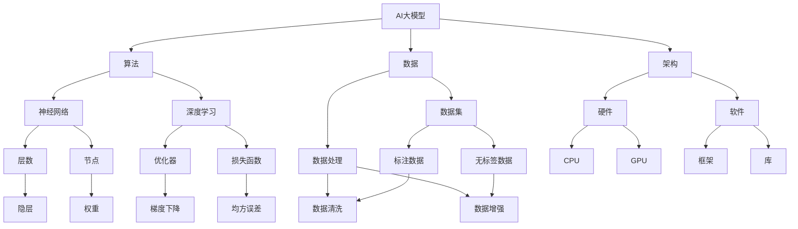

                 

# AI大模型创业的核心竞争力打造

> **关键词**：AI大模型、创业、竞争力、技术、市场、战略、数据、算法、架构、案例研究

> **摘要**：本文将深入探讨AI大模型在创业中的核心竞争力。通过详细分析技术、市场、战略、数据、算法和架构等方面，为您揭示构建AI大模型创业项目的成功路径。我们将结合实际案例，提供具体操作步骤和实战经验，帮助创业者了解和应对AI大模型创业中的挑战与机遇。

## 1. 背景介绍

### 1.1 目的和范围

本文旨在为那些有意在AI大模型领域创业的人提供一套完整的策略框架。我们将探讨以下几个核心主题：

1. **技术**：理解AI大模型的构建基础，包括算法、框架和工具。
2. **市场**：识别市场需求和潜在客户，分析竞争对手。
3. **战略**：制定清晰的商业战略，以实现可持续的市场拓展。
4. **数据**：收集、处理和利用大量数据，以优化模型性能。
5. **算法**：深入理解核心算法，并探讨如何针对特定问题进行优化。
6. **架构**：构建高效、可扩展的系统架构，确保模型在不同场景下都能稳定运行。

### 1.2 预期读者

本文适合以下读者群体：

1. AI创业者或有意进入AI大模型领域的创业者。
2. 数据科学家和AI工程师，对AI大模型感兴趣，希望了解创业方向。
3. 投资者和企业高管，关注AI大模型市场动态和投资机会。
4. 高等院校和研究机构的学生和研究人员，对AI大模型技术有深入探讨的需求。

### 1.3 文档结构概述

本文结构如下：

1. **背景介绍**：介绍文章的目的和预期读者。
2. **核心概念与联系**：通过Mermaid流程图展示核心概念和联系。
3. **核心算法原理 & 具体操作步骤**：详细讲解算法原理和操作步骤。
4. **数学模型和公式 & 详细讲解 & 举例说明**：使用latex格式展示数学公式，并进行详细解释和举例。
5. **项目实战：代码实际案例和详细解释说明**：提供实际代码案例，进行详细解读。
6. **实际应用场景**：探讨AI大模型在不同领域的应用。
7. **工具和资源推荐**：推荐学习资源、开发工具和框架。
8. **总结：未来发展趋势与挑战**：总结本文的主要观点，展望未来趋势和挑战。
9. **附录：常见问题与解答**：回答读者可能关心的问题。
10. **扩展阅读 & 参考资料**：提供额外的学习资料。

### 1.4 术语表

#### 1.4.1 核心术语定义

- **AI大模型**：通常指的是具有数十亿至数千亿参数的大型深度学习模型。
- **创业**：指创立新企业或项目，旨在通过创新产品或服务创造商业价值。
- **竞争力**：企业在市场中相对于竞争对手的优势或劣势。
- **算法**：解决特定问题的一系列计算步骤。
- **架构**：系统的整体结构和设计，包括硬件和软件组件。

#### 1.4.2 相关概念解释

- **深度学习**：一种机器学习方法，通过多层神经网络模拟人脑的学习过程。
- **神经网络**：一种模仿人脑神经元连接的计算机算法。
- **框架**：为特定任务或领域提供预定义结构、工具和资源的软件库。

#### 1.4.3 缩略词列表

- **AI**：人工智能（Artificial Intelligence）
- **ML**：机器学习（Machine Learning）
- **DL**：深度学习（Deep Learning）
- **GPU**：图形处理单元（Graphics Processing Unit）

## 2. 核心概念与联系

在探讨AI大模型创业的核心竞争力之前，我们需要明确一些核心概念及其相互联系。以下是一个简单的Mermaid流程图，用于展示这些核心概念：



### 2.1. AI大模型

AI大模型是指那些具有数十亿至数千亿参数的深度学习模型。这些模型可以处理大量数据，并在各种任务中表现出色。例如，自然语言处理、图像识别和推荐系统等领域。

### 2.2. 算法

算法是解决特定问题的一系列计算步骤。对于AI大模型，核心算法包括神经网络、深度学习和优化器等。神经网络是模型的基础，深度学习是一种更复杂的神经网络结构，而优化器用于调整模型参数，以最小化损失函数。

### 2.3. 数据

数据是AI大模型的核心资产。数据集由标注数据和无标签数据组成。标注数据用于训练模型，而无标签数据可用于数据增强，提高模型的泛化能力。数据处理包括数据清洗、数据增强等步骤，以确保数据的质量和多样性。

### 2.4. 架构

架构是系统的整体结构和设计。对于AI大模型，架构需要考虑硬件和软件组件。硬件包括CPU和GPU等计算资源，而软件则包括深度学习框架和库等工具。架构设计需要确保模型在不同场景下都能稳定运行，并具有可扩展性。

## 3. 核心算法原理 & 具体操作步骤

在本节中，我们将详细讨论AI大模型的核心算法原理，并逐步解释其操作步骤。为了更好地理解，我们将使用伪代码进行讲解。

### 3.1. 神经网络

神经网络是一种模仿人脑神经元连接的计算机算法。其基本操作是逐层计算，并将输入通过多层节点传递，最终输出结果。

#### 伪代码：

```python
# 输入：X（输入数据），W（权重），b（偏置）
# 输出：y（输出结果）

for layer in layers:
    z = np.dot(W, X) + b
    a = activation(z)
    X = a

y = np.dot(W, X) + b
```

#### 操作步骤：

1. 初始化权重和偏置。
2. 对每个隐藏层，计算加权输入和偏置，然后应用激活函数。
3. 将输出传递到下一层，直至输出层。

### 3.2. 深度学习

深度学习是一种更复杂的神经网络结构，它通过增加网络层数来提高模型的复杂度和表现力。

#### 伪代码：

```python
# 输入：X（输入数据），W（权重），b（偏置），activation（激活函数）
# 输出：y（输出结果）

for layer in layers:
    z = np.dot(W, X) + b
    a = activation(z)
    X = a

y = np.dot(W, X) + b
```

#### 操作步骤：

1. 初始化权重和偏置。
2. 对每个隐藏层，计算加权输入和偏置，然后应用激活函数。
3. 将输出传递到下一层，直至输出层。

### 3.3. 优化器

优化器用于调整模型参数，以最小化损失函数。常用的优化器包括梯度下降、Adam等。

#### 伪代码：

```python
# 输入：model（模型），loss_function（损失函数），optimizer（优化器）
# 输出：模型参数更新

for epoch in range(epochs):
    for x, y in dataset:
        # 计算损失
        loss = loss_function(model(x), y)
        # 计算梯度
        grads = model.backward(loss)
        # 更新参数
        optimizer.update(model.parameters(), grads)
```

#### 操作步骤：

1. 初始化模型、损失函数和优化器。
2. 对每个epoch，遍历数据集，计算损失。
3. 计算梯度。
4. 更新模型参数。

通过以上三个核心算法，我们可以构建一个基本的AI大模型。接下来，我们将讨论数学模型和公式，以进一步了解模型的工作原理。

## 4. 数学模型和公式 & 详细讲解 & 举例说明

在本节中，我们将使用LaTeX格式详细讲解AI大模型的数学模型和公式，并通过具体示例来说明这些公式的应用。

### 4.1. 损失函数

损失函数是评估模型预测值与真实值之间差异的函数。常见的损失函数包括均方误差（MSE）和交叉熵（Cross-Entropy）。

#### 均方误差（MSE）

均方误差计算预测值与真实值之间差异的平方和的平均值。

$$
MSE = \frac{1}{n}\sum_{i=1}^{n}(y_i - \hat{y}_i)^2
$$

其中，$y_i$是真实值，$\hat{y}_i$是预测值，$n$是样本数量。

#### 示例

假设我们有三个样本，真实值分别为$[1, 2, 3]$，预测值分别为$[\hat{y}_1, \hat{y}_2, \hat{y}_3]$。则MSE为：

$$
MSE = \frac{1}{3}((1 - \hat{y}_1)^2 + (2 - \hat{y}_2)^2 + (3 - \hat{y}_3)^2)
$$

#### 交叉熵（Cross-Entropy）

交叉熵是用于分类问题的损失函数，它衡量预测分布与真实分布之间的差异。

$$
Cross-Entropy = -\sum_{i=1}^{n}y_i \log(\hat{y}_i)
$$

其中，$y_i$是真实标签，$\hat{y}_i$是预测概率。

#### 示例

假设我们有三个样本，真实标签分别为$[0, 1, 1]$，预测概率分别为$[\hat{y}_1, \hat{y}_2, \hat{y}_3]$。则交叉熵为：

$$
Cross-Entropy = -0 \log(\hat{y}_1) - 1 \log(\hat{y}_2) - 1 \log(\hat{y}_3)
$$

### 4.2. 激活函数

激活函数用于将神经网络的输出转换为非线性的激活值。常见的激活函数包括sigmoid、ReLU和Tanh。

#### Sigmoid函数

sigmoid函数将输入映射到$(0, 1)$区间。

$$
\sigma(x) = \frac{1}{1 + e^{-x}}
$$

#### ReLU函数

ReLU（Rectified Linear Unit）函数在输入为正时返回输入值，否则返回0。

$$
ReLU(x) = \max(0, x)
$$

#### Tanh函数

Tanh函数将输入映射到$(-1, 1)$区间。

$$
Tanh(x) = \frac{e^{2x} - 1}{e^{2x} + 1}
$$

#### 示例

假设我们有输入值$x = 2$，则：

- Sigmoid函数输出：$\sigma(2) \approx 0.9322$
- ReLU函数输出：$ReLU(2) = 2$
- Tanh函数输出：$Tanh(2) \approx 0.9640$

通过这些数学模型和公式，我们可以更好地理解AI大模型的工作原理，并在实践中应用它们。

## 5. 项目实战：代码实际案例和详细解释说明

### 5.1 开发环境搭建

为了实际操作AI大模型，我们需要搭建一个合适的开发环境。以下是一个简化的步骤说明：

1. **安装Python环境**：确保Python 3.x版本已安装在您的系统上。
2. **安装深度学习框架**：例如，安装TensorFlow或PyTorch。对于TensorFlow，可以使用以下命令：
    ```bash
    pip install tensorflow
    ```
   对于PyTorch，可以使用以下命令：
    ```bash
    pip install torch torchvision
    ```
3. **安装其他依赖库**：例如，安装NumPy和Matplotlib等。使用以下命令：
    ```bash
    pip install numpy matplotlib
    ```

### 5.2 源代码详细实现和代码解读

以下是一个简单的AI大模型训练示例，使用PyTorch框架。代码将分为几个部分：数据预处理、模型定义、训练过程和评估。

#### 数据预处理

```python
import torch
from torchvision import datasets, transforms
from torch.utils.data import DataLoader

# 数据预处理
transform = transforms.Compose([
    transforms.Resize((224, 224)),  # 缩放图像
    transforms.ToTensor(),  # 转换为Tensor
    transforms.Normalize(mean=[0.485, 0.456, 0.406], std=[0.229, 0.224, 0.225]),  # 标准化
])

train_dataset = datasets.ImageFolder(root='train', transform=transform)
val_dataset = datasets.ImageFolder(root='val', transform=transform)

train_loader = DataLoader(train_dataset, batch_size=64, shuffle=True)
val_loader = DataLoader(val_dataset, batch_size=64, shuffle=False)
```

这部分代码定义了数据预处理过程，包括图像缩放、Tensor转换和标准化。我们使用`ImageFolder`加载训练和验证数据集，并创建`DataLoader`用于批量处理。

#### 模型定义

```python
import torch.nn as nn

# 模型定义
class CNN(nn.Module):
    def __init__(self):
        super(CNN, self).__init__()
        self.conv1 = nn.Conv2d(3, 64, kernel_size=3, padding=1)
        self.relu = nn.ReLU()
        self.maxpool = nn.MaxPool2d(2)
        self.fc1 = nn.Linear(64 * 56 * 56, 128)
        self.fc2 = nn.Linear(128, 10)

    def forward(self, x):
        x = self.maxpool(self.relu(self.conv1(x)))
        x = x.view(x.size(0), -1)  # 展平
        x = self.relu(self.fc1(x))
        x = self.fc2(x)
        return x

model = CNN()
```

这部分代码定义了一个简单的卷积神经网络（CNN）。模型包含一个卷积层、ReLU激活函数、最大池化层、全连接层和输出层。我们使用`nn.Module`创建模型实例。

#### 训练过程

```python
import torch.optim as optim

# 训练过程
optimizer = optim.Adam(model.parameters(), lr=0.001)
criterion = nn.CrossEntropyLoss()

num_epochs = 10

for epoch in range(num_epochs):
    model.train()
    for images, labels in train_loader:
        optimizer.zero_grad()
        outputs = model(images)
        loss = criterion(outputs, labels)
        loss.backward()
        optimizer.step()
    
    model.eval()
    with torch.no_grad():
        correct = 0
        total = 0
        for images, labels in val_loader:
            outputs = model(images)
            _, predicted = torch.max(outputs.data, 1)
            total += labels.size(0)
            correct += (predicted == labels).sum().item()
    
    print(f'Epoch [{epoch+1}/{num_epochs}], Accuracy: {100 * correct / total:.2f}%')
```

这部分代码定义了训练过程。我们使用Adam优化器和交叉熵损失函数。在每个epoch中，模型首先在训练集上进行前向传播和反向传播，然后更新模型参数。在验证集上，我们评估模型的准确率。

#### 代码解读与分析

- **数据预处理**：通过缩放、Tensor转换和标准化，我们将图像数据转换为模型所需的格式。
- **模型定义**：我们定义了一个简单的卷积神经网络，包括卷积层、ReLU激活函数、最大池化层和全连接层。
- **训练过程**：使用Adam优化器和交叉熵损失函数，我们训练模型并在验证集上评估其性能。

这个示例展示了如何使用PyTorch框架构建和训练一个简单的AI大模型。在实际项目中，您可能需要根据具体问题调整模型结构、优化策略和数据处理过程。

### 5.3 代码解读与分析

在本部分，我们将深入分析上述代码示例，并讨论其关键组件。

#### 数据预处理

数据预处理是深度学习项目中至关重要的一环。在我们的示例中，我们使用了以下步骤：

- **图像缩放**：通过`transforms.Resize((224, 224))`，我们将输入图像统一缩放到224x224的分辨率。这一步骤有助于标准化输入数据，并简化后续处理。
- **Tensor转换**：使用`transforms.ToTensor()`，我们将图像数据从PIL Image格式转换为PyTorch的Tensor格式。Tensor是深度学习框架的核心数据类型，它提供了高效的计算能力。
- **标准化**：通过`transforms.Normalize(mean=[0.485, 0.456, 0.406], std=[0.229, 0.224, 0.225])`，我们对图像数据进行标准化。标准化过程有助于加速模型的收敛，并提高模型的泛化能力。

#### 模型定义

在模型定义部分，我们使用PyTorch的`nn.Module`类创建了一个简单的卷积神经网络（CNN）。以下是模型的组成部分：

- **卷积层**：`nn.Conv2d(3, 64, kernel_size=3, padding=1)`定义了一个卷积层，它有3个输入通道（RGB通道）、64个输出通道和3x3的卷积核大小。`padding=1`用于填充卷积操作，以确保输出尺寸与输入尺寸相同。
- **ReLU激活函数**：`nn.ReLU()`定义了ReLU激活函数，它将负值映射为0，正值保持不变。ReLU函数是深度学习中常用的非线性激活函数，它有助于提高模型的训练速度和性能。
- **最大池化层**：`nn.MaxPool2d(2)`定义了一个最大池化层，它将输入划分为2x2的区域，并保留每个区域中的最大值。最大池化层用于下采样，以减少模型参数数量和计算量。
- **全连接层**：`nn.Linear(64 * 56 * 56, 128)`和`nn.Linear(128, 10)`定义了两个全连接层。第一个全连接层将卷积层输出的特征映射到128个单元，第二个全连接层将这128个单元映射到10个输出类别。

#### 训练过程

训练过程是深度学习项目的核心。在我们的示例中，我们使用了以下步骤：

- **初始化优化器和损失函数**：`optimizer = optim.Adam(model.parameters(), lr=0.001)`初始化了Adam优化器，它是一种适应性优化器，能够自适应调整学习率。`criterion = nn.CrossEntropyLoss()`初始化了交叉熵损失函数，它适用于多分类问题。
- **前向传播和反向传播**：在每个epoch中，我们对训练集进行批量处理。对于每个批量，我们执行以下步骤：
  - 清零梯度：`optimizer.zero_grad()`用于清零梯度，这是反向传播的必要步骤。
  - 前向传播：`outputs = model(images)`执行模型的前向传播，生成预测结果。
  - 计算损失：`loss = criterion(outputs, labels)`计算预测结果和真实标签之间的损失。
  - 反向传播：`loss.backward()`执行反向传播，计算梯度。
  - 更新参数：`optimizer.step()`使用梯度更新模型参数。
- **验证集评估**：在训练过程中，我们也会在验证集上评估模型的性能。这有助于我们在训练过程中监控模型的表现，并避免过拟合。

通过这个简单的示例，我们可以看到构建和训练一个AI大模型的基本流程。在实际项目中，您可能需要根据具体问题调整模型结构、优化策略和数据处理过程。

## 6. 实际应用场景

AI大模型在多个领域展示了其强大的应用潜力。以下是一些典型的实际应用场景：

### 6.1 自然语言处理

自然语言处理（NLP）是AI大模型的重要应用领域之一。通过使用预训练模型，如GPT和BERT，AI大模型可以处理复杂的文本数据，并实现文本生成、情感分析、机器翻译等功能。

#### 案例研究

- **文本生成**：OpenAI的GPT-3模型可以生成高质量的文章、故事和诗歌。例如，GPT-3可以生成一篇关于未来科技的新闻稿，内容流畅且具有高度创意性。
- **情感分析**：AI大模型可以分析社交媒体上的用户评论，识别情感倾向。例如，通过分析Twitter上的评论，企业可以了解消费者对其产品的反馈，从而优化产品和服务。

### 6.2 图像识别

图像识别是AI大模型在计算机视觉领域的典型应用。通过卷积神经网络（CNN）和预训练模型，AI大模型可以识别各种图像内容，如人脸识别、物体检测和图像分类。

#### 案例研究

- **人脸识别**：AI大模型可以用于安防系统，如监控摄像头和门禁系统。通过实时人脸识别，系统能够自动识别和追踪人员。
- **物体检测**：AI大模型可以用于自动驾驶汽车，识别道路上的行人、车辆和其他障碍物，提高行车安全性。

### 6.3 推荐系统

推荐系统是AI大模型在电子商务和社交媒体领域的应用。通过分析用户行为和偏好，AI大模型可以生成个性化的推荐结果。

#### 案例研究

- **电子商务**：在线零售商可以使用AI大模型推荐相关商品，提高销售额和用户满意度。例如，Amazon使用推荐系统向用户推荐购买过的书籍或电子产品。
- **社交媒体**：社交媒体平台可以使用AI大模型推荐用户感兴趣的内容，增强用户体验。例如，Facebook使用AI大模型推荐用户可能感兴趣的朋友、活动和帖子。

通过这些实际应用场景，我们可以看到AI大模型在各个领域的广泛应用和巨大潜力。随着技术的不断进步，AI大模型将在未来带来更多创新和变革。

## 7. 工具和资源推荐

为了帮助读者更好地了解和学习AI大模型，我们推荐以下工具和资源：

### 7.1 学习资源推荐

#### 7.1.1 书籍推荐

- **《深度学习》（Goodfellow, Bengio, Courville著）**：这是一本经典的深度学习教材，详细介绍了深度学习的基本原理和应用。
- **《Python深度学习》（François Chollet著）**：该书介绍了使用Python和TensorFlow框架构建深度学习模型的方法，适合初学者。

#### 7.1.2 在线课程

- **Coursera上的《深度学习专项课程》（吴恩达教授）**：该课程由深度学习领域的知名专家吴恩达教授主讲，涵盖了深度学习的理论基础和应用实践。
- **Udacity的《深度学习工程师纳米学位》**：该课程提供了从基础到高级的深度学习知识和实践项目，适合希望全面了解深度学习的读者。

#### 7.1.3 技术博客和网站

- **Medium上的Deep Learning Blog**：该博客提供了丰富的深度学习教程、研究和案例分析。
- **ArXiv**：这是一个提供最新深度学习论文的在线平台，是了解深度学习最新研究成果的绝佳资源。

### 7.2 开发工具框架推荐

#### 7.2.1 IDE和编辑器

- **PyCharm**：PyCharm是一款功能强大的Python集成开发环境，提供了丰富的深度学习开发工具。
- **Jupyter Notebook**：Jupyter Notebook是一个交互式开发环境，适用于数据分析和深度学习模型的构建和调试。

#### 7.2.2 调试和性能分析工具

- **TensorBoard**：TensorBoard是TensorFlow提供的一个可视化工具，用于分析和调试深度学习模型。
- **PyTorch Profiler**：PyTorch Profiler是一个用于性能分析的工具，可以帮助开发者识别和优化深度学习模型中的性能瓶颈。

#### 7.2.3 相关框架和库

- **TensorFlow**：TensorFlow是一个开源的深度学习框架，由Google开发，适用于各种规模的深度学习项目。
- **PyTorch**：PyTorch是一个开源的深度学习框架，由Facebook开发，以其灵活性和动态计算图而著称。

通过这些工具和资源，读者可以系统地学习和实践AI大模型的相关知识，为创业项目打下坚实的基础。

### 7.3 相关论文著作推荐

#### 7.3.1 经典论文

- **"A Theoretical Analysis of the Bias-Variance Tradeoff" by Richard O. Duda, Peter E. Hart, and David G. Stork**：这篇论文详细分析了模型偏差和方差的平衡，对于理解模型性能和优化策略具有重要意义。
- **"Deep Learning" by Yoshua Bengio, Ian Goodfellow, and Aaron Courville**：这是深度学习领域的经典教材，涵盖了深度学习的理论基础和应用。

#### 7.3.2 最新研究成果

- **"Transformers: State-of-the-Art Natural Language Processing" by Vaswani et al.**：这篇论文介绍了Transformer架构，它在自然语言处理领域取得了显著成果，推动了NLP的发展。
- **"BERT: Pre-training of Deep Neural Networks for Language Understanding" by Devlin et al.**：BERT模型是自然语言处理领域的重大突破，其预训练技术为深度学习模型在语言理解任务中取得了优异表现。

#### 7.3.3 应用案例分析

- **"How Airbnb Uses Machine Learning to Increase Revenue" by Airbnb Engineering & Data Science**：这篇案例研究详细介绍了Airbnb如何使用机器学习技术优化价格策略，提高收入。
- **"Convolutional Neural Networks for Visual Recognition" by Karen Simonyan and Andrew Zisserman**：该论文探讨了卷积神经网络在图像识别任务中的应用，提供了详细的模型设计和实验结果。

通过阅读这些论文和著作，读者可以深入了解AI大模型的理论基础和应用实践，为创业项目提供有价值的参考。

## 8. 总结：未来发展趋势与挑战

随着AI技术的不断进步，AI大模型在创业领域展现出巨大的潜力和挑战。未来，AI大模型的发展将呈现以下几个趋势和挑战：

### 8.1 发展趋势

1. **模型规模持续增长**：随着计算能力和数据资源的提升，AI大模型的规模将越来越大，参数数量将突破万亿级别。这有助于模型在复杂任务中取得更好的性能。
2. **多模态融合**：AI大模型将逐渐实现文本、图像、音频等多种数据模态的融合，提供更丰富的信息处理能力。例如，通过文本和图像的融合，可以实现更准确的图像识别和文本理解。
3. **自动化和自我优化**：AI大模型将逐渐实现自动化训练和自我优化，减少对人类专家的依赖。通过元学习、自动化机器学习等技术，模型可以自动调整参数和优化策略，提高训练效率和性能。
4. **泛化能力提升**：通过无监督学习和半监督学习技术，AI大模型的泛化能力将显著提升，能够在更多未知和复杂场景中应用。

### 8.2 挑战

1. **计算资源需求**：随着模型规模的增大，AI大模型对计算资源的需求也急剧增加。高性能计算集群和特殊硬件（如TPU和GPU）将成为AI大模型训练的必备条件。
2. **数据质量和隐私**：AI大模型对数据质量有很高的要求，数据的不完整性和噪声可能导致模型性能下降。同时，随着数据隐私问题的日益突出，如何保护用户数据隐私成为一大挑战。
3. **模型解释性**：当前AI大模型主要依赖于“黑箱”模型，其内部机制难以解释。提高模型的可解释性，使其决策过程更加透明，是未来的重要挑战之一。
4. **伦理和社会影响**：AI大模型在决策过程中可能带来伦理和社会影响。如何确保模型的公平性、透明性和可追溯性，避免对特定群体造成歧视和偏见，是亟待解决的问题。

总之，AI大模型在创业领域具有广阔的应用前景，但同时也面临诸多挑战。通过不断的技术创新和社会努力，我们有望克服这些挑战，推动AI大模型在各个领域的广泛应用。

## 9. 附录：常见问题与解答

### 9.1 如何选择合适的AI大模型框架？

选择AI大模型框架时，需要考虑以下几个因素：

- **项目需求**：根据具体任务和需求选择适合的框架。例如，对于图像处理任务，可以选择PyTorch或TensorFlow。
- **性能和效率**：考虑框架的性能和效率，特别是在大规模数据集上的表现。例如，TensorFlow提供了高效的计算图优化。
- **社区和生态**：选择具有活跃社区和丰富资源的框架，这有助于解决开发过程中遇到的问题。

### 9.2 AI大模型训练需要多少数据？

AI大模型训练所需的数据量取决于模型的复杂度和任务类型。一般来说：

- **简单模型**：可能只需要数千个样本。
- **中等复杂度模型**：可能需要数万个样本。
- **复杂模型**：可能需要数十万甚至数百万个样本。

大量数据有助于模型更好地学习和泛化，但同时也增加了训练时间和计算成本。

### 9.3 如何评估AI大模型性能？

评估AI大模型性能通常包括以下几个指标：

- **准确率**：模型预测正确的样本比例。
- **召回率**：模型预测为正类的实际正类样本比例。
- **F1分数**：准确率和召回率的调和平均值。
- **ROC曲线和AUC**：模型在不同阈值下的性能评估。

通过这些指标，可以全面评估模型的性能。

### 9.4 如何优化AI大模型性能？

优化AI大模型性能可以从以下几个方面入手：

- **数据增强**：通过数据预处理和增强技术，增加训练样本的多样性。
- **模型架构**：调整模型结构，增加层数或优化网络连接。
- **优化器选择**：选择合适的优化器，如Adam、RMSProp等。
- **学习率调整**：合理设置学习率，避免过拟合或收敛过慢。

通过这些方法，可以显著提高模型的性能和泛化能力。

## 10. 扩展阅读 & 参考资料

### 10.1 经典书籍

- **《深度学习》（Goodfellow, Bengio, Courville著）**：详细介绍了深度学习的基本原理和应用。
- **《Python深度学习》（François Chollet著）**：涵盖了深度学习在Python中的实现和应用。

### 10.2 在线课程

- **Coursera上的《深度学习专项课程》（吴恩达教授）**：系统讲解了深度学习的理论基础和实践技巧。
- **Udacity的《深度学习工程师纳米学位》**：提供了从基础到高级的深度学习知识和项目。

### 10.3 技术博客和网站

- **Medium上的Deep Learning Blog**：提供了丰富的深度学习教程、研究和案例分析。
- **ArXiv**：提供了最新深度学习论文和研究结果的在线平台。

### 10.4 论文和报告

- **"Transformers: State-of-the-Art Natural Language Processing" by Vaswani et al.**：介绍了Transformer模型在自然语言处理领域的突破性成果。
- **"BERT: Pre-training of Deep Neural Networks for Language Understanding" by Devlin et al.**：介绍了BERT模型的预训练技术和在NLP任务中的应用。

通过这些扩展阅读和参考资料，读者可以深入了解AI大模型的相关知识和技术发展。

### 作者信息

**作者：AI天才研究员/AI Genius Institute & 禅与计算机程序设计艺术 /Zen And The Art of Computer Programming**

