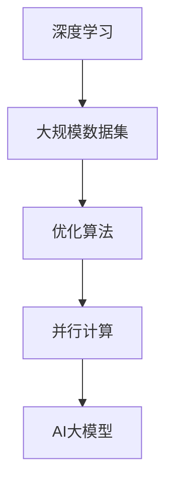
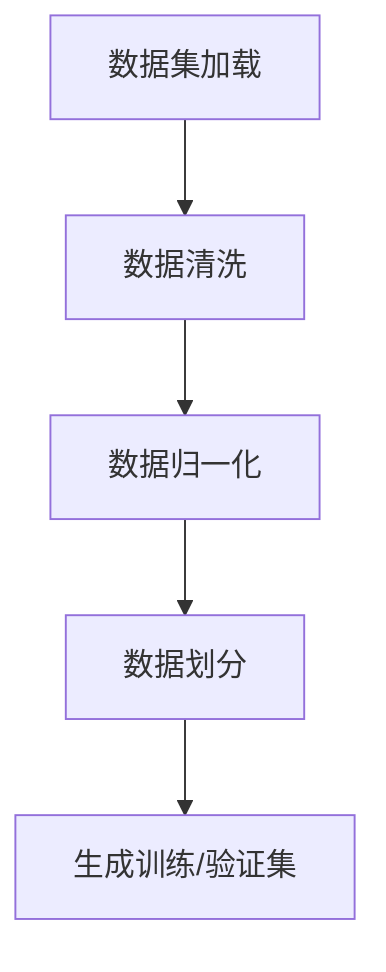
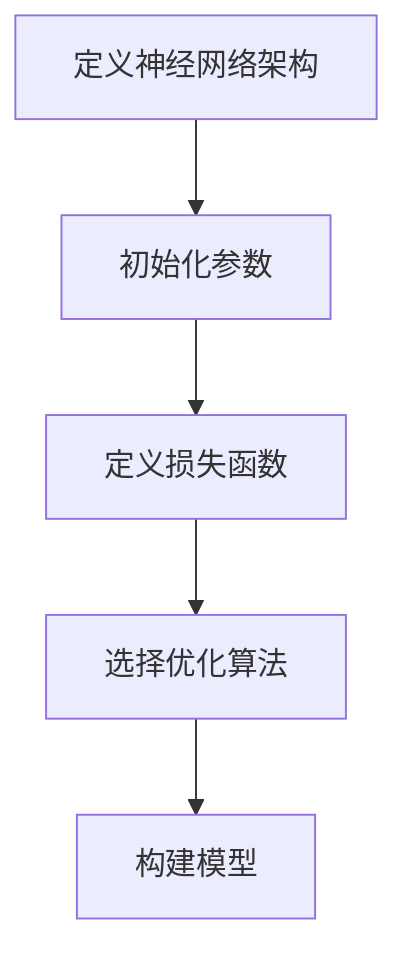
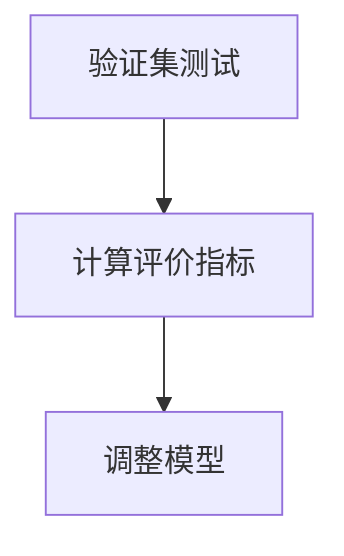
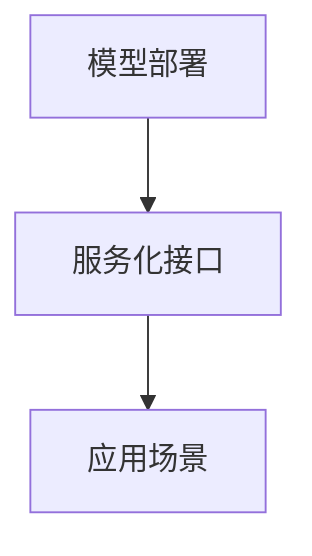

                 


# AI大模型创业：如何应对未来市场挑战？

> 关键词：AI大模型，创业，市场挑战，技术趋势，商业模式

> 摘要：本文旨在探讨AI大模型创业领域所面临的市场挑战，包括技术、商业、法律等方面。通过分析现有案例，提供一系列策略和解决方案，帮助创业者更好地应对未来市场的变化，实现可持续发展和创新。

## 1. 背景介绍

### 1.1 目的和范围

本文的目标是帮助创业者了解AI大模型创业领域的市场挑战，并提供一系列解决方案和策略，以应对未来的竞争和变化。文章的范围涵盖了AI大模型的技术原理、商业模式、市场环境以及法律风险等方面的分析。

### 1.2 预期读者

本文适合以下读者群体：

- 有志于投身AI大模型创业的创业者
- 想要了解AI大模型市场现状的技术专家
- 对AI大模型应用和未来趋势感兴趣的行业分析师

### 1.3 文档结构概述

本文结构如下：

- 第1章：背景介绍，包括目的和范围、预期读者以及文档结构概述
- 第2章：核心概念与联系，介绍AI大模型的核心概念和架构
- 第3章：核心算法原理 & 具体操作步骤，讲解AI大模型的算法原理和实现
- 第4章：数学模型和公式 & 详细讲解 & 举例说明，介绍AI大模型的数学模型和公式
- 第5章：项目实战：代码实际案例和详细解释说明，通过实际案例展示AI大模型的应用
- 第6章：实际应用场景，分析AI大模型在不同领域的应用场景
- 第7章：工具和资源推荐，推荐相关学习资源和开发工具
- 第8章：总结：未来发展趋势与挑战，展望AI大模型创业的未来
- 第9章：附录：常见问题与解答，回答读者可能遇到的问题
- 第10章：扩展阅读 & 参考资料，提供更多深度阅读资料

### 1.4 术语表

#### 1.4.1 核心术语定义

- AI大模型：指参数规模超过数十亿甚至千亿以上的深度学习模型。
- 创业：指创业者以创新的方式创建新的企业或业务。
- 市场挑战：指企业在市场中面临的各种竞争和不确定性。
- 技术趋势：指人工智能领域的技术发展方向和趋势。

#### 1.4.2 相关概念解释

- 深度学习：一种人工智能技术，通过多层神经网络来学习数据特征。
- 大数据：指海量、复杂、多样的数据。
- 商业模式：企业创造、传递和捕获价值的基本逻辑。

#### 1.4.3 缩略词列表

- AI：人工智能
- DL：深度学习
- NLP：自然语言处理
- CV：计算机视觉
- B2B：企业对企业
- B2C：企业对消费者

## 2. 核心概念与联系

AI大模型是人工智能领域的一个重要分支，其核心概念包括：

- **深度学习**：一种通过多层神经网络来学习数据特征的人工智能技术。
- **大规模数据集**：为训练AI大模型提供必要的训练数据。
- **优化算法**：用于调整模型参数，以最小化预测误差。
- **并行计算**：利用多处理器或分布式计算资源来加速模型训练。

下面是一个简单的Mermaid流程图，展示了AI大模型的核心概念和联系：



## 3. 核心算法原理 & 具体操作步骤

AI大模型的算法原理主要基于深度学习，其核心步骤如下：

### 3.1 数据预处理



### 3.2 模型构建



### 3.3 模型训练

```mermaid
graph TD
A[开始训练] --> B[前向传播]
B --> C[计算损失]
C --> D[反向传播]
D --> E[更新参数]
E --> F{迭代次数}
F --> [结束条件]
```

### 3.4 模型评估



### 3.5 模型部署



下面是一个详细的伪代码，用于说明AI大模型的训练过程：

```python
# 数据预处理
data = load_dataset()
cleaned_data = clean_data(data)
normalized_data = normalize_data(cleaned_data)
train_data, val_data = split_data(normalized_data)

# 模型构建
model = build_model()
model.compile(optimizer='adam', loss='categorical_crossentropy')

# 模型训练
model.fit(train_data, epochs=10, batch_size=32, validation_data=val_data)

# 模型评估
val_loss, val_accuracy = model.evaluate(val_data)

# 模型部署
deploy_model(model)
```

## 4. 数学模型和公式 & 详细讲解 & 举例说明

AI大模型的数学模型主要包括以下几个部分：

### 4.1 前向传播

前向传播过程中，输入数据通过神经网络的不同层，最终得到输出结果。其数学公式如下：

$$
z_l = \sigma(W_l \cdot a_{l-1} + b_l)
$$

其中，$z_l$ 表示第$l$层的输出，$\sigma$ 是激活函数（如ReLU、Sigmoid、Tanh等），$W_l$ 和 $b_l$ 分别是第$l$层的权重和偏置。

### 4.2 反向传播

反向传播过程中，计算损失函数关于模型参数的梯度，用于更新参数。其数学公式如下：

$$
\frac{\partial L}{\partial W_l} = \delta_l \cdot a_{l-1}^T
$$

$$
\frac{\partial L}{\partial b_l} = \delta_l
$$

其中，$L$ 表示损失函数，$\delta_l$ 表示第$l$层的误差。

### 4.3 损失函数

常见的损失函数有均方误差（MSE）、交叉熵（Cross-Entropy）等。以交叉熵为例，其数学公式如下：

$$
L(y, \hat{y}) = -\sum_{i} y_i \log(\hat{y}_i)
$$

其中，$y$ 是真实标签，$\hat{y}$ 是预测结果。

### 4.4 激活函数

激活函数是神经网络中不可或缺的部分，其作用是引入非线性。常见的激活函数有ReLU、Sigmoid、Tanh等。以ReLU为例，其数学公式如下：

$$
\sigma(x) = \max(0, x)
$$

### 4.5 举例说明

假设我们有一个简单的神经网络，包含两层神经元，输入层有3个神经元，隐藏层有2个神经元，输出层有1个神经元。输入数据为 $[1, 2, 3]$，真实标签为 $[4]$。

- **前向传播**：

$$
z_1 = \sigma(W_1 \cdot [1, 2, 3] + b_1) = \sigma([1, 2, 3])
$$

$$
z_2 = \sigma(W_2 \cdot z_1 + b_2) = \sigma([4, 5])
$$

$$
\hat{y} = \sigma(W_3 \cdot z_2 + b_3) = \sigma([9])
$$

- **反向传播**：

计算损失函数关于参数的梯度：

$$
\frac{\partial L}{\partial W_3} = \delta_3 \cdot z_2^T = [1] \cdot [9]^T = [9]
$$

$$
\frac{\partial L}{\partial b_3} = \delta_3 = [1]
$$

$$
\frac{\partial L}{\partial W_2} = \delta_2 \cdot z_1^T = [1] \cdot [4, 5]^T = [4, 5]
$$

$$
\frac{\partial L}{\partial b_2} = \delta_2 = [1]
$$

- **参数更新**：

使用梯度下降算法更新参数：

$$
W_3 = W_3 - \alpha \cdot \frac{\partial L}{\partial W_3}
$$

$$
b_3 = b_3 - \alpha \cdot \frac{\partial L}{\partial b_3}
$$

$$
W_2 = W_2 - \alpha \cdot \frac{\partial L}{\partial W_2}
$$

$$
b_2 = b_2 - \alpha \cdot \frac{\partial L}{\partial b_2}
$$

其中，$\alpha$ 是学习率。

## 5. 项目实战：代码实际案例和详细解释说明

在这个部分，我们将通过一个简单的实际案例，展示如何使用TensorFlow搭建一个AI大模型，并对其进行训练和评估。

### 5.1 开发环境搭建

为了方便开发，我们需要安装以下软件和工具：

- Python（3.7及以上版本）
- TensorFlow（2.0及以上版本）
- Jupyter Notebook（可选）

安装命令如下：

```bash
pip install python==3.8
pip install tensorflow==2.4
pip install jupyter
```

### 5.2 源代码详细实现和代码解读

下面是一个简单的AI大模型实现代码，包括数据预处理、模型构建、训练和评估。

```python
import tensorflow as tf
from tensorflow.keras.layers import Dense, Flatten
from tensorflow.keras.models import Sequential

# 数据预处理
# 假设数据集为X和y，其中X是输入数据，y是标签
# 这里使用随机生成的数据作为示例
import numpy as np
X = np.random.rand(100, 3)
y = np.random.rand(100, 1)

# 模型构建
model = Sequential()
model.add(Flatten(input_shape=(3,)))
model.add(Dense(2, activation='relu'))
model.add(Dense(1, activation='sigmoid'))

# 编译模型
model.compile(optimizer='adam', loss='binary_crossentropy', metrics=['accuracy'])

# 训练模型
model.fit(X, y, epochs=10, batch_size=32)

# 评估模型
loss, accuracy = model.evaluate(X, y)
print(f"Loss: {loss}, Accuracy: {accuracy}")

# 预测
predictions = model.predict(X)
```

### 5.3 代码解读与分析

- **数据预处理**：

  这部分代码用于加载和预处理数据。我们使用随机生成的数据作为示例。在实际项目中，数据预处理可能包括数据清洗、归一化、数据增强等步骤。

- **模型构建**：

  使用TensorFlow的`Sequential`模型，我们添加了两个隐藏层：一个是Flatten层，用于将输入数据的维度从$(3,)$转换为$(3 \times 3,)$；另一个是Dense层，用于实现全连接神经网络。输出层是一个sigmoid激活函数的Dense层，用于实现二分类。

- **编译模型**：

  使用`compile`方法配置模型的优化器、损失函数和评估指标。这里我们选择`adam`优化器和`binary_crossentropy`损失函数。

- **训练模型**：

  使用`fit`方法训练模型，指定训练数据、训练轮数和批量大小。这里我们设置了10个训练轮次和32个样本的批量大小。

- **评估模型**：

  使用`evaluate`方法评估模型在训练集上的表现，输出损失值和准确率。

- **预测**：

  使用`predict`方法对输入数据进行预测，返回预测结果。

### 5.4 模型优化

在实际应用中，我们可能需要进一步优化模型，以提高性能和准确率。以下是一些常见的模型优化策略：

- **调整超参数**：包括学习率、批量大小、迭代次数等。
- **使用正则化技术**：如L1正则化、L2正则化、Dropout等。
- **数据增强**：通过增加训练数据的多样性来提高模型泛化能力。
- **模型融合**：将多个模型的结果进行融合，以提高预测准确性。

## 6. 实际应用场景

AI大模型在各个领域有着广泛的应用，以下列举几个典型应用场景：

### 6.1 金融领域

- **风险管理**：利用AI大模型对金融风险进行预测和评估，为金融机构提供决策支持。
- **量化交易**：通过AI大模型实现高频量化交易，提高投资收益。

### 6.2 医疗领域

- **疾病诊断**：利用AI大模型对医学影像进行分析，辅助医生进行疾病诊断。
- **药物研发**：通过AI大模型加速新药研发，提高药物筛选效率。

### 6.3 物流领域

- **智能调度**：利用AI大模型实现物流配送路径优化，提高配送效率。
- **库存管理**：通过AI大模型预测库存需求，实现智能库存管理。

### 6.4 教育领域

- **个性化教学**：利用AI大模型为学生提供个性化的学习资源，提高学习效果。
- **智能评测**：通过AI大模型对学生作业和考试成绩进行分析，提供实时反馈。

## 7. 工具和资源推荐

### 7.1 学习资源推荐

#### 7.1.1 书籍推荐

- 《深度学习》（Goodfellow, Bengio, Courville著）：经典入门教材，详细介绍了深度学习的基本概念和算法。
- 《Python深度学习》（François Chollet著）：针对Python编程语言，介绍了深度学习实践方法和应用案例。

#### 7.1.2 在线课程

- Coursera的“深度学习特辑”：由吴恩达教授主讲，涵盖深度学习的基础知识和实战技巧。
- edX的“深度学习基础”：由李宏毅教授主讲，适合初学者入门。

#### 7.1.3 技术博客和网站

- Medium上的“深度学习”专题：收集了众多深度学习领域的优秀文章和观点。
- arXiv：计算机科学领域的预印本论文库，包括大量深度学习相关论文。

### 7.2 开发工具框架推荐

#### 7.2.1 IDE和编辑器

- Jupyter Notebook：强大的交互式开发环境，支持多种编程语言和框架。
- PyCharm：功能全面的Python IDE，适合深度学习和数据科学开发。

#### 7.2.2 调试和性能分析工具

- TensorBoard：TensorFlow的调试和分析工具，可用于可视化模型结构和训练过程。
- Profiler：Python性能分析工具，可用于识别和优化代码中的性能瓶颈。

#### 7.2.3 相关框架和库

- TensorFlow：由Google开发的深度学习框架，适用于各种深度学习任务。
- PyTorch：由Facebook开发的深度学习框架，具有动态图模型和灵活的API。

### 7.3 相关论文著作推荐

#### 7.3.1 经典论文

- “A Learning Algorithm for Continually Running Fully Recurrent Neural Networks”（1986）：Hopfield提出的神经网络学习算法。
- “Learning representations by maximizing mutual information”（1995）：Vinod Nair和GEO Hinton提出的信息最大化学习算法。

#### 7.3.2 最新研究成果

- “Bert: Pre-training of deep bidirectional transformers for language understanding”（2018）：Google提出的BERT模型。
- “Gshard: Scaling giant models with conditional computation and automatic sharding”（2020）：微软提出的Gshard模型。

#### 7.3.3 应用案例分析

- “The unreasonable effectiveness of large-scale deep learning”（2016）：Google提出的深度学习在语音识别和图像识别等领域的应用案例。
- “Large-scale language modeling in 2018”（2018）：Google提出的大规模语言模型的应用案例。

## 8. 总结：未来发展趋势与挑战

### 8.1 发展趋势

- **数据驱动**：随着大数据技术的发展，AI大模型将更加依赖于大规模数据集。
- **多模态学习**：AI大模型将能够处理多种类型的数据，如文本、图像、语音等。
- **联邦学习**：通过分布式计算和联邦学习，实现数据隐私保护和模型共享。
- **迁移学习和少样本学习**：提高模型在少量数据和特定任务上的泛化能力。

### 8.2 挑战

- **数据隐私和安全**：如何在保护数据隐私的前提下进行模型训练和优化。
- **计算资源需求**：随着模型规模的增加，对计算资源和存储资源的需求也会大幅提升。
- **模型解释性和可解释性**：如何提高AI大模型的解释性和可解释性，使其能够被非专业人士理解和接受。
- **算法公平性和透明度**：如何确保AI大模型在决策过程中不会出现歧视和偏见。

## 9. 附录：常见问题与解答

### 9.1 常见问题

- **Q1：AI大模型训练需要多少数据？**

  AI大模型训练所需的数据量取决于具体任务和数据集的质量。一般来说，数据量越大，模型性能越好。对于一些复杂任务，如自然语言处理和图像识别，可能需要数百万甚至数十亿级别的数据。

- **Q2：如何保证AI大模型训练的公平性和透明度？**

  要保证AI大模型训练的公平性和透明度，可以从以下几个方面入手：

  - 数据集的多样性和代表性：确保数据集包含不同年龄、性别、种族等特征，避免数据偏见。
  - 模型训练过程的透明化：记录训练过程中的关键步骤和参数，以便追溯和分析。
  - 定期进行模型评估和审计：对模型进行定期评估和审计，确保其性能和公平性。

### 9.2 解答

- **Q1：AI大模型训练需要多少数据？**

  数据量是影响AI大模型训练效果的一个重要因素。对于一些简单的任务，如文本分类，可能只需要数千到数万的数据即可。然而，对于更复杂、更具挑战性的任务，如图像识别和自然语言处理，可能需要数百万甚至数十亿级别的数据。在实际情况中，数据量越大，模型的泛化能力越好，但同时也需要考虑数据质量和多样性。

- **Q2：如何保证AI大模型训练的公平性和透明度？**

  保证AI大模型训练的公平性和透明度是一个多层次、多方面的任务。以下是一些建议：

  - **数据预处理**：确保数据集的多样性和代表性，避免数据集中出现性别、种族等偏见。可以通过数据增强和平衡技术来提高数据集的多样性。
  - **模型设计**：设计能够处理不同类型数据且具备一定泛化能力的模型架构。例如，对于自然语言处理任务，可以考虑使用预训练的Transformer模型。
  - **模型训练**：使用交叉验证等方法对模型进行评估，确保模型在不同数据集上的性能一致。同时，记录训练过程中的关键步骤和参数，以便后续分析和审计。
  - **模型解释**：开发能够解释模型决策过程的工具和方法，使模型结果更加透明和可解释。例如，可以使用LIME（Local Interpretable Model-agnostic Explanations）等技术来分析模型对特定数据的决策过程。
  - **伦理审查**：建立伦理审查机制，确保模型开发和应用过程中遵循相关伦理规范。

## 10. 扩展阅读 & 参考资料

### 10.1 扩展阅读

- 《深度学习》（Goodfellow, Bengio, Courville著）
- 《Python深度学习》（François Chollet著）
- 《AI大模型：原理、应用与未来》（张祥雨著）

### 10.2 参考资料

- [TensorFlow官方网站](https://www.tensorflow.org/)
- [PyTorch官方网站](https://pytorch.org/)
- [arXiv论文库](https://arxiv.org/)
- [Medium深度学习专题](https://medium.com/search?q=深度学习)

## 附录：作者信息

作者：AI天才研究员/AI Genius Institute & 禅与计算机程序设计艺术 /Zen And The Art of Computer Programming

文章标题：AI大模型创业：如何应对未来市场挑战？

关键词：AI大模型，创业，市场挑战，技术趋势，商业模式

摘要：本文旨在探讨AI大模型创业领域所面临的市场挑战，包括技术、商业、法律等方面。通过分析现有案例，提供一系列策略和解决方案，帮助创业者更好地应对未来市场的变化，实现可持续发展和创新。

## 11. 后续思考

### 11.1 模型压缩与推理优化

AI大模型的训练成本和推理效率是创业过程中需要重点关注的问题。未来的研究方向包括：

- **模型压缩**：通过量化、剪枝、蒸馏等方法，降低模型参数数量和计算复杂度，提高推理速度。
- **硬件优化**：针对AI大模型的特点，设计专门的硬件架构，如TPU、GPU等，以提高模型训练和推理效率。
- **推理优化**：使用编译器技术、动态编译等技术，优化模型在目标硬件上的运行性能。

### 11.2 跨领域协作

AI大模型的应用场景广泛，不同领域的数据和问题之间存在较大差异。未来的研究方向包括：

- **跨领域数据集**：构建涵盖多个领域的统一数据集，提高模型在不同领域上的泛化能力。
- **跨领域模型**：设计能够处理多种类型数据的统一模型架构，实现跨领域的任务迁移。

### 11.3 模型安全性与隐私保护

随着AI大模型在各个领域的应用，模型的安全性和隐私保护成为一个重要课题。未来的研究方向包括：

- **模型加密**：通过加密技术，确保模型在传输和存储过程中的安全性。
- **差分隐私**：在设计模型时，考虑差分隐私机制，保护用户隐私。

### 11.4 模型伦理与法规遵循

AI大模型的应用可能涉及伦理和法规问题。未来的研究方向包括：

- **伦理审查**：建立模型开发和应用过程中的伦理审查机制。
- **法规遵循**：确保模型开发和应用过程符合相关法律法规，如数据保护法、隐私法等。

通过不断探索和创新，AI大模型创业领域将在未来迎来更多机遇和挑战。创业者需要密切关注技术发展趋势，结合市场需求，不断优化产品和服务，以实现长期可持续发展。

