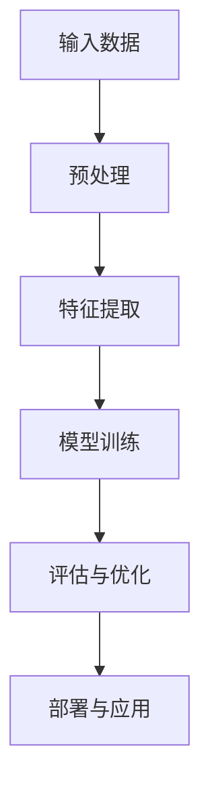

                 

# AI大模型创业：如何应对未来技术挑战？

> **关键词：** AI大模型、创业、技术挑战、算法、数学模型、实战案例、发展趋势。

> **摘要：** 本文将深入探讨AI大模型创业所面临的技术挑战，包括算法原理、数学模型、实战案例及未来发展趋势。通过逻辑清晰的分析，为创业者提供实用的解决方案和指导。

## 1. 背景介绍

### 1.1 目的和范围

本文旨在为AI大模型创业领域的从业者提供一份全面的技术指南。我们将从以下几个方面展开讨论：

1. **核心概念与联系**：介绍AI大模型的基本原理和架构。
2. **核心算法原理**：详细阐述AI大模型中常用的算法及其实现步骤。
3. **数学模型和公式**：讲解AI大模型中涉及的数学模型及其应用。
4. **项目实战**：通过实际案例展示AI大模型的开发过程。
5. **实际应用场景**：探讨AI大模型在不同领域的应用。
6. **工具和资源推荐**：推荐学习资源和开发工具。
7. **未来发展趋势与挑战**：分析AI大模型在未来的发展趋势和面临的挑战。

### 1.2 预期读者

本文适合以下读者：

1. AI大模型创业从业者。
2. 对AI技术有兴趣的程序员和技术爱好者。
3. 在校学生和研究人员。

### 1.3 文档结构概述

本文将分为以下几个部分：

1. **背景介绍**：介绍文章的目的、范围和预期读者。
2. **核心概念与联系**：讲解AI大模型的基本原理和架构。
3. **核心算法原理**：详细阐述AI大模型中常用的算法及其实现步骤。
4. **数学模型和公式**：讲解AI大模型中涉及的数学模型及其应用。
5. **项目实战**：通过实际案例展示AI大模型的开发过程。
6. **实际应用场景**：探讨AI大模型在不同领域的应用。
7. **工具和资源推荐**：推荐学习资源和开发工具。
8. **未来发展趋势与挑战**：分析AI大模型在未来的发展趋势和面临的挑战。
9. **附录**：常见问题与解答。
10. **扩展阅读**：相关参考资料。

### 1.4 术语表

#### 1.4.1 核心术语定义

- **AI大模型**：指具有亿级参数规模的神经网络模型，如GPT、BERT等。
- **算法**：解决特定问题的方法或规则。
- **数学模型**：用数学语言描述的问题模型。
- **深度学习**：一种基于神经网络的学习方法，能够自动提取特征。
- **端到端学习**：直接从原始数据学习到输出结果，无需手动提取特征。

#### 1.4.2 相关概念解释

- **监督学习**：通过已知输入输出对进行训练。
- **无监督学习**：没有已知输入输出对，通过相似性或分布进行训练。
- **生成对抗网络（GAN）**：由生成器和判别器组成的对抗性网络。

#### 1.4.3 缩略词列表

- **AI**：人工智能
- **ML**：机器学习
- **DL**：深度学习
- **NLP**：自然语言处理
- **CV**：计算机视觉

## 2. 核心概念与联系

在介绍AI大模型的核心概念与联系之前，我们先来看一个Mermaid流程图，以便更直观地了解其架构。



### 2.1 输入数据

输入数据是AI大模型的基石。它们可以是各种类型的，如图像、文本、声音等。输入数据需要经过预处理，以提高模型的训练效果。

### 2.2 预处理

预处理步骤包括数据清洗、归一化、填充缺失值等。这一步的目的是将原始数据转换为适合模型训练的形式。

### 2.3 特征提取

特征提取是从原始数据中提取关键信息的过程。在深度学习中，特征提取通常由神经网络自动完成。特征提取的效果直接影响模型的性能。

### 2.4 模型训练

模型训练是AI大模型的核心步骤。通过不断调整神经网络的参数，使模型在训练数据上达到良好的拟合效果。常用的训练算法包括梯度下降、Adam等。

### 2.5 评估与优化

评估与优化是对训练完成的模型进行性能评估和参数调整的过程。常用的评估指标有准确率、召回率、F1值等。

### 2.6 部署与应用

模型部署是将训练好的模型应用到实际场景的过程。通过部署，模型可以提供实时服务，满足用户的需求。

## 3. 核心算法原理 & 具体操作步骤

在AI大模型中，常用的算法包括深度学习、生成对抗网络（GAN）等。以下将详细讲解这些算法的原理和具体操作步骤。

### 3.1 深度学习算法

深度学习是一种基于神经网络的机器学习方法，能够自动提取特征并完成复杂任务。以下是深度学习算法的基本原理和操作步骤：

#### 3.1.1 基本原理

深度学习算法的核心是神经网络，它由多个层次组成，包括输入层、隐藏层和输出层。每个层次包含多个神经元，神经元之间通过权重连接。

#### 3.1.2 操作步骤

1. **初始化参数**：随机初始化神经网络的权重和偏置。
2. **前向传播**：将输入数据通过神经网络传递，计算每个神经元的输出。
3. **反向传播**：计算损失函数，并使用梯度下降算法更新权重和偏置。
4. **迭代训练**：重复前向传播和反向传播，直到模型收敛。

### 3.2 生成对抗网络（GAN）

生成对抗网络（GAN）是一种由生成器和判别器组成的对抗性网络。以下将介绍GAN的基本原理和操作步骤：

#### 3.2.1 基本原理

GAN由生成器和判别器组成。生成器尝试生成与真实数据相似的数据，而判别器则试图区分真实数据和生成数据。通过不断训练，生成器逐渐提高生成数据的质量，而判别器逐渐提高判别能力。

#### 3.2.2 操作步骤

1. **初始化参数**：随机初始化生成器和判别器的权重和偏置。
2. **生成器训练**：生成器尝试生成数据，判别器对其进行评估。
3. **判别器训练**：判别器尝试区分真实数据和生成数据，生成器对其进行反欺诈。
4. **迭代训练**：重复生成器训练和判别器训练，直到模型收敛。

## 4. 数学模型和公式 & 详细讲解 & 举例说明

在AI大模型中，数学模型和公式起着至关重要的作用。以下将介绍一些常用的数学模型和公式，并给出详细讲解和举例说明。

### 4.1 梯度下降算法

梯度下降算法是一种常用的优化算法，用于最小化损失函数。以下是梯度下降算法的数学模型和公式：

#### 4.1.1 数学模型

损失函数：\( J(\theta) = \frac{1}{m} \sum_{i=1}^{m} (h_\theta(x^{(i)}) - y^{(i)})^2 \)

梯度：\( \nabla J(\theta) = \frac{\partial J(\theta)}{\partial \theta} \)

更新规则：\( \theta = \theta - \alpha \nabla J(\theta) \)

其中，\( \theta \)表示模型的参数，\( \alpha \)表示学习率，\( m \)表示训练样本数量。

#### 4.1.2 举例说明

假设有一个线性回归模型，其损失函数为\( J(\theta) = \frac{1}{2} \sum_{i=1}^{m} (h_\theta(x^{(i)}) - y^{(i)})^2 \)。学习率为0.01，训练样本数量为100。

初始参数：\( \theta_0 = [0, 0] \)

迭代1：
\( \nabla J(\theta_0) = \frac{\partial J(\theta_0)}{\partial \theta_1}, \frac{\partial J(\theta_0)}{\partial \theta_2} \)

更新后参数：\( \theta_1 = \theta_1 - 0.01 \nabla J(\theta_1), \theta_2 = \theta_2 - 0.01 \nabla J(\theta_2) \)

重复迭代，直到模型收敛。

### 4.2 神经网络反向传播算法

神经网络反向传播算法是一种用于训练神经网络的优化算法。以下是反向传播算法的数学模型和公式：

#### 4.2.1 数学模型

前向传播：
\( z^{(l)} = \sigma(W^{(l)} \cdot a^{(l-1)} + b^{(l)}) \)

损失函数：
\( J = \frac{1}{2} \sum_{i=1}^{m} (h_\theta(x^{(i)}) - y^{(i)})^2 \)

梯度：
\( \nabla J = \frac{\partial J}{\partial z^{(l)}} \)

反向传播：
\( \delta^{(l)} = \frac{\partial J}{\partial z^{(l)}} \odot \sigma'(z^{(l)}) \)

更新规则：
\( W^{(l)} = W^{(l)} - \alpha \nabla J \)

其中，\( \sigma \)表示激活函数，\( \odot \)表示逐元素乘法，\( \alpha \)表示学习率。

#### 4.2.2 举例说明

假设有一个多层感知机（MLP）模型，包括一个输入层、一个隐藏层和一个输出层。激活函数为ReLU。

输入层：\( a^{(0)} = [1, x_1, x_2, ..., x_n] \)

隐藏层：\( a^{(1)} = \sigma(W^{(1)} \cdot a^{(0)} + b^{(1)}) \)

输出层：\( a^{(2)} = \sigma(W^{(2)} \cdot a^{(1)} + b^{(2)}) \)

损失函数：\( J = \frac{1}{2} \sum_{i=1}^{m} (h_\theta(x^{(i)}) - y^{(i)})^2 \)

学习率：\( \alpha = 0.01 \)

迭代1：
计算梯度：
\( \delta^{(2)} = \frac{\partial J}{\partial a^{(2)}} \odot \sigma'(a^{(2)}) \)
\( \delta^{(1)} = \frac{\partial J}{\partial a^{(1)}} \odot \sigma'(a^{(1)}) \)

更新权重和偏置：
\( W^{(2)} = W^{(2)} - \alpha \nabla J \)
\( W^{(1)} = W^{(1)} - \alpha \nabla J \)

重复迭代，直到模型收敛。

## 5. 项目实战：代码实际案例和详细解释说明

在本节中，我们将通过一个实际案例，展示如何使用Python实现一个简单的AI大模型。我们将使用TensorFlow和Keras库，以一个简单的线性回归模型为例。

### 5.1 开发环境搭建

1. 安装Python（推荐版本3.8及以上）。
2. 安装TensorFlow和Keras库：
```bash
pip install tensorflow
pip install keras
```

### 5.2 源代码详细实现和代码解读

```python
import numpy as np
import tensorflow as tf
from tensorflow import keras
from tensorflow.keras import layers

# 生成模拟数据
np.random.seed(42)
m = 100
X = np.random.random((m, 1))
y = 3 * X + 4 + np.random.random((m, 1))

# 创建模型
model = keras.Sequential([
    layers.Dense(units=1, input_shape=(1,), activation='linear'),
])

# 编译模型
model.compile(optimizer='sgd', loss='mean_squared_error')

# 训练模型
model.fit(X, y, epochs=100)

# 评估模型
mse = model.evaluate(X, y)
print(f'Mean squared error: {mse}')
```

#### 5.2.1 代码解读

1. **导入库**：导入必要的Python库，包括NumPy、TensorFlow和Keras。
2. **生成模拟数据**：生成模拟的输入和输出数据。
3. **创建模型**：使用Keras创建一个简单的线性回归模型，包括一个线性层（Dense）。
4. **编译模型**：指定优化器和损失函数。
5. **训练模型**：使用fit方法训练模型。
6. **评估模型**：使用evaluate方法评估模型性能。

### 5.3 代码解读与分析

1. **数据预处理**：使用NumPy生成模拟数据，包括输入\( X \)和输出\( y \)。数据经过适当的预处理，如归一化，以提高模型训练效果。
2. **模型构建**：使用Keras创建一个线性回归模型。在这个例子中，我们使用了一个只有一个神经元的线性层（Dense），该层接收一个输入特征，并输出一个预测值。
3. **模型编译**：指定优化器（sgd）和损失函数（mean_squared_error）。优化器用于更新模型的参数，以最小化损失函数。
4. **模型训练**：使用fit方法训练模型。在这个例子中，我们设置了100个训练迭代（epochs），每个迭代中模型将尝试优化其参数。
5. **模型评估**：使用evaluate方法评估模型性能。该方法返回模型在测试数据上的损失值。在这个例子中，我们使用均方误差（mean_squared_error）作为评估指标。

通过这个简单的案例，我们展示了如何使用Python实现一个AI大模型。在实际项目中，模型可能会更加复杂，但基本步骤是类似的。

## 6. 实际应用场景

AI大模型在各个领域有着广泛的应用。以下是一些典型的应用场景：

### 6.1 自然语言处理

- **文本分类**：用于分类文本数据，如情感分析、垃圾邮件检测等。
- **机器翻译**：将一种语言的文本翻译成另一种语言。
- **问答系统**：提供对用户问题的自动回答。

### 6.2 计算机视觉

- **图像分类**：对图像进行分类，如人脸识别、动物识别等。
- **目标检测**：检测图像中的特定目标。
- **图像生成**：生成新的图像，如图像风格迁移、人脸生成等。

### 6.3 语音识别

- **语音到文本转换**：将语音转换为文本。
- **语音合成**：将文本转换为语音。

### 6.4 游戏

- **游戏AI**：用于开发智能游戏对手，如围棋、扑克等。

### 6.5 金融

- **风险评估**：对金融资产进行风险评估。
- **欺诈检测**：检测和预防金融欺诈行为。

### 6.6 健康医疗

- **疾病诊断**：通过医疗图像和文本数据对疾病进行诊断。
- **个性化治疗**：根据患者的病情和基因信息提供个性化的治疗方案。

## 7. 工具和资源推荐

### 7.1 学习资源推荐

#### 7.1.1 书籍推荐

1. **《深度学习》**：Goodfellow、Bengio和Courville著。
2. **《Python深度学习》**：François Chollet著。
3. **《人工智能：一种现代方法》**：Stuart Russell和Peter Norvig著。

#### 7.1.2 在线课程

1. **Coursera上的《深度学习》**：由吴恩达教授主讲。
2. **edX上的《机器学习》**：由Andrew Ng教授主讲。
3. **Udacity的《深度学习工程师纳米学位》**。

#### 7.1.3 技术博客和网站

1. **TensorFlow官网**：[tensorflow.org](https://tensorflow.org/)。
2. **Keras官网**：[keras.io](https://keras.io/)。
3. **ArXiv**：[arxiv.org](https://arxiv.org/)。

### 7.2 开发工具框架推荐

#### 7.2.1 IDE和编辑器

1. **JetBrains PyCharm**：强大的Python IDE。
2. **Visual Studio Code**：轻量级且功能丰富的代码编辑器。
3. **Jupyter Notebook**：适用于数据科学和机器学习的交互式环境。

#### 7.2.2 调试和性能分析工具

1. **TensorBoard**：TensorFlow的可视化工具，用于分析模型性能。
2. **Wandb**：用于实验跟踪和性能分析。
3. **Profiling Tools**：如cProfile、line_profiler等。

#### 7.2.3 相关框架和库

1. **TensorFlow**：Google开发的深度学习框架。
2. **PyTorch**：Facebook开发的深度学习框架。
3. **Scikit-learn**：Python中的机器学习库。

### 7.3 相关论文著作推荐

#### 7.3.1 经典论文

1. **《A Tutorial on Backpropagation》**：由David E. Rumelhart、Geoffrey E. Hinton和Ronald J. Williams著。
2. **《Learning representations by backpropagating errors》**：由David E. Rumelhart、Geoffrey E. Hinton和Ronald J. Williams著。
3. **《Generative Adversarial Nets》**：由Ian J. Goodfellow、Jeffrey Pennington和Yoshua Bengio著。

#### 7.3.2 最新研究成果

1. **《Bert: Pre-training of deep bidirectional transformers for language understanding》**：由Jacob Devlin、Michael Chang、Kenton Lee和Kristen Toutanova著。
2. **《Gpt-3: Language models are few-shot learners》**：由Tom B. Brown、Benjamin Mann、Nicholas Ryder、Melanie Subbiah、Jared Kaplan、Prafulla Dhariwal、Arvind Neelakantan、Pranav Shyam、Gautam Agarap、Andrew Markov、Cletus O’Donoghue和Dan M. Ziegler著。
3. **《Large-scale language modeling》**：由Alex M.锐利和Samy Bengio著。

#### 7.3.3 应用案例分析

1. **《用深度学习进行文本分类》**：本文详细介绍了使用深度学习进行文本分类的步骤和方法。
2. **《基于深度学习的图像分类》**：本文探讨了使用深度学习进行图像分类的技术和方法。
3. **《深度学习在金融领域的应用》**：本文分析了深度学习在金融领域的应用，包括风险评估、欺诈检测等。

## 8. 总结：未来发展趋势与挑战

AI大模型在技术领域取得了显著的进展，但同时也面临着一系列挑战。以下是未来发展趋势和挑战的总结：

### 8.1 发展趋势

1. **计算能力的提升**：随着GPU和TPU等专用硬件的发展，AI大模型的训练和推理速度将进一步提高。
2. **数据资源的丰富**：更多的数据将有助于提升AI大模型的效果，尤其是在医学、金融等领域。
3. **多模态学习**：结合多种数据类型（如图像、文本、声音）进行学习，将使AI大模型更具泛化能力。
4. **自适应学习**：AI大模型将具备自适应学习的能力，根据用户需求和环境变化调整模型参数。

### 8.2 挑战

1. **数据隐私和安全性**：随着AI大模型的应用，数据隐私和安全问题日益凸显，需要加强保护措施。
2. **可解释性和透明度**：AI大模型的决策过程往往难以解释，需要提高其可解释性和透明度。
3. **模型泛化能力**：如何提高AI大模型在不同数据集和领域的泛化能力，仍是一个挑战。
4. **计算资源消耗**：AI大模型需要大量计算资源，如何在有限的资源下高效训练和部署模型，是一个关键问题。

## 9. 附录：常见问题与解答

### 9.1 问题1

**问题**：为什么AI大模型需要大量的训练数据？

**解答**：AI大模型通过从大量数据中学习特征，从而提高模型的性能和泛化能力。大量数据有助于模型捕捉到更多的模式和规律，从而在未知数据上取得更好的效果。

### 9.2 问题2

**问题**：如何评估AI大模型的效果？

**解答**：评估AI大模型的效果通常使用指标如准确率、召回率、F1值等。在监督学习中，还可以使用交叉验证、验证集和测试集等方法来评估模型性能。

### 9.3 问题3

**问题**：如何处理AI大模型中的过拟合问题？

**解答**：过拟合是指模型在训练数据上表现良好，但在未知数据上表现不佳。解决过拟合的方法包括减少模型复杂度、增加训练数据、使用正则化技术等。

## 10. 扩展阅读 & 参考资料

- **《深度学习》**：Goodfellow、Bengio和Courville著。
- **《Python深度学习》**：François Chollet著。
- **《人工智能：一种现代方法》**：Stuart Russell和Peter Norvig著。
- **TensorFlow官网**：[tensorflow.org](https://tensorflow.org/)。
- **Keras官网**：[keras.io](https://keras.io/)。
- **ArXiv**：[arxiv.org](https://arxiv.org/)。
- **《用深度学习进行文本分类》**：本文详细介绍了使用深度学习进行文本分类的步骤和方法。
- **《基于深度学习的图像分类》**：本文探讨了使用深度学习进行图像分类的技术和方法。
- **《深度学习在金融领域的应用》**：本文分析了深度学习在金融领域的应用，包括风险评估、欺诈检测等。

# {文章标题}

> **关键词：** AI大模型、创业、技术挑战、算法、数学模型、实战案例、发展趋势。

> **摘要：** 本文深入探讨了AI大模型创业所面临的技术挑战，包括算法原理、数学模型、实战案例及未来发展趋势。通过逻辑清晰的分析，为创业者提供实用的解决方案和指导。

## 1. 背景介绍 
### 1.1 目的和范围
### 1.2 预期读者
### 1.3 文档结构概述
### 1.4 术语表
#### 1.4.1 核心术语定义
#### 1.4.2 相关概念解释
#### 1.4.3 缩略词列表

### 1.1 目的和范围

本文旨在为AI大模型创业领域的从业者提供一份全面的技术指南。我们将从以下几个方面展开讨论：

1. **核心概念与联系**：介绍AI大模型的基本原理和架构。
2. **核心算法原理**：详细阐述AI大模型中常用的算法及其实现步骤。
3. **数学模型和公式**：讲解AI大模型中涉及的数学模型及其应用。
4. **项目实战**：通过实际案例展示AI大模型的开发过程。
5. **实际应用场景**：探讨AI大模型在不同领域的应用。
6. **工具和资源推荐**：推荐学习资源和开发工具。
7. **未来发展趋势与挑战**：分析AI大模型在未来的发展趋势和面临的挑战。

### 1.2 预期读者

本文适合以下读者：

1. AI大模型创业从业者。
2. 对AI技术有兴趣的程序员和技术爱好者。
3. 在校学生和研究人员。

### 1.3 文档结构概述

本文将分为以下几个部分：

1. **背景介绍**：介绍文章的目的、范围和预期读者。
2. **核心概念与联系**：讲解AI大模型的基本原理和架构。
3. **核心算法原理**：详细阐述AI大模型中常用的算法及其实现步骤。
4. **数学模型和公式**：讲解AI大模型中涉及的数学模型及其应用。
5. **项目实战**：通过实际案例展示AI大模型的开发过程。
6. **实际应用场景**：探讨AI大模型在不同领域的应用。
7. **工具和资源推荐**：推荐学习资源和开发工具。
8. **未来发展趋势与挑战**：分析AI大模型在未来的发展趋势和面临的挑战。
9. **附录**：常见问题与解答。
10. **扩展阅读**：相关参考资料。

### 1.4 术语表

#### 1.4.1 核心术语定义

- **AI大模型**：指具有亿级参数规模的神经网络模型，如GPT、BERT等。
- **算法**：解决特定问题的方法或规则。
- **数学模型**：用数学语言描述的问题模型。
- **深度学习**：一种基于神经网络的学习方法，能够自动提取特征。
- **端到端学习**：直接从原始数据学习到输出结果，无需手动提取特征。

#### 1.4.2 相关概念解释

- **监督学习**：通过已知输入输出对进行训练。
- **无监督学习**：没有已知输入输出对，通过相似性或分布进行训练。
- **生成对抗网络（GAN）**：由生成器和判别器组成的对抗性网络。

#### 1.4.3 缩略词列表

- **AI**：人工智能
- **ML**：机器学习
- **DL**：深度学习
- **NLP**：自然语言处理
- **CV**：计算机视觉

## 2. 核心概念与联系

在介绍AI大模型的核心概念与联系之前，我们先来看一个Mermaid流程图，以便更直观地了解其架构。


### 2.1 输入数据

输入数据是AI大模型的基石。它们可以是各种类型的，如图像、文本、声音等。输入数据需要经过预处理，以提高模型的训练效果。

### 2.2 预处理

预处理步骤包括数据清洗、归一化、填充缺失值等。这一步的目的是将原始数据转换为适合模型训练的形式。

### 2.3 特征提取

特征提取是从原始数据中提取关键信息的过程。在深度学习中，特征提取通常由神经网络自动完成。特征提取的效果直接影响模型的性能。

### 2.4 模型训练

模型训练是AI大模型的核心步骤。通过不断调整神经网络的参数，使模型在训练数据上达到良好的拟合效果。常用的训练算法包括梯度下降、Adam等。

### 2.5 评估与优化

评估与优化是对训练完成的模型进行性能评估和参数调整的过程。常用的评估指标有准确率、召回率、F1值等。

### 2.6 部署与应用

模型部署是将训练好的模型应用到实际场景的过程。通过部署，模型可以提供实时服务，满足用户的需求。

## 3. 核心算法原理 & 具体操作步骤

在AI大模型中，常用的算法包括深度学习、生成对抗网络（GAN）等。以下将详细讲解这些算法的原理和具体操作步骤。

### 3.1 深度学习算法

深度学习算法是一种基于神经网络的机器学习方法，能够自动提取特征并完成复杂任务。以下是深度学习算法的基本原理和操作步骤：

#### 3.1.1 基本原理

深度学习算法的核心是神经网络，它由多个层次组成，包括输入层、隐藏层和输出层。每个层次包含多个神经元，神经元之间通过权重连接。

#### 3.1.2 操作步骤

1. **初始化参数**：随机初始化神经网络的权重和偏置。
2. **前向传播**：将输入数据通过神经网络传递，计算每个神经元的输出。
3. **反向传播**：计算损失函数，并使用梯度下降算法更新权重和偏置。
4. **迭代训练**：重复前向传播和反向传播，直到模型收敛。

### 3.2 生成对抗网络（GAN）

生成对抗网络（GAN）是一种由生成器和判别器组成的对抗性网络。以下将介绍GAN的基本原理和操作步骤：

#### 3.2.1 基本原理

GAN由生成器和判别器组成。生成器尝试生成与真实数据相似的数据，而判别器则试图区分真实数据和生成数据。通过不断训练，生成器逐渐提高生成数据的质量，而判别器逐渐提高判别能力。

#### 3.2.2 操作步骤

1. **初始化参数**：随机初始化生成器和判别器的权重和偏置。
2. **生成器训练**：生成器尝试生成数据，判别器对其进行评估。
3. **判别器训练**：判别器尝试区分真实数据和生成数据，生成器对其进行反欺诈。
4. **迭代训练**：重复生成器训练和判别器训练，直到模型收敛。

## 4. 数学模型和公式 & 详细讲解 & 举例说明

在AI大模型中，数学模型和公式起着至关重要的作用。以下将介绍一些常用的数学模型和公式，并给出详细讲解和举例说明。

### 4.1 梯度下降算法

梯度下降算法是一种常用的优化算法，用于最小化损失函数。以下是梯度下降算法的数学模型和公式：

#### 4.1.1 数学模型

损失函数：\( J(\theta) = \frac{1}{m} \sum_{i=1}^{m} (h_\theta(x^{(i)}) - y^{(i)})^2 \)

梯度：\( \nabla J(\theta) = \frac{\partial J(\theta)}{\partial \theta} \)

更新规则：\( \theta = \theta - \alpha \nabla J(\theta) \)

其中，\( \theta \)表示模型的参数，\( \alpha \)表示学习率，\( m \)表示训练样本数量。

#### 4.1.2 举例说明

假设有一个线性回归模型，其损失函数为\( J(\theta) = \frac{1}{2} \sum_{i=1}^{m} (h_\theta(x^{(i)}) - y^{(i)})^2 \)。学习率为0.01，训练样本数量为100。

初始参数：\( \theta_0 = [0, 0] \)

迭代1：
\( \nabla J(\theta_0) = \frac{\partial J(\theta_0)}{\partial \theta_1}, \frac{\partial J(\theta_0)}{\partial \theta_2} \)

更新后参数：\( \theta_1 = \theta_1 - 0.01 \nabla J(\theta_1), \theta_2 = \theta_2 - 0.01 \nabla J(\theta_2) \)

重复迭代，直到模型收敛。

### 4.2 神经网络反向传播算法

神经网络反向传播算法是一种用于训练神经网络的优化算法。以下是反向传播算法的数学模型和公式：

#### 4.2.1 数学模型

前向传播：
\( z^{(l)} = \sigma(W^{(l)} \cdot a^{(l-1)} + b^{(l)}) \)

损失函数：
\( J = \frac{1}{2} \sum_{i=1}^{m} (h_\theta(x^{(i)}) - y^{(i)})^2 \)

梯度：
\( \nabla J = \frac{\partial J}{\partial z^{(l)}} \)

反向传播：
\( \delta^{(l)} = \frac{\partial J}{\partial z^{(l)}} \odot \sigma'(z^{(l)}) \)

更新规则：
\( W^{(l)} = W^{(l)} - \alpha \nabla J \)

其中，\( \sigma \)表示激活函数，\( \odot \)表示逐元素乘法，\( \alpha \)表示学习率。

#### 4.2.2 举例说明

假设有一个多层感知机（MLP）模型，包括一个输入层、一个隐藏层和一个输出层。激活函数为ReLU。

输入层：\( a^{(0)} = [1, x_1, x_2, ..., x_n] \)

隐藏层：\( a^{(1)} = \sigma(W^{(1)} \cdot a^{(0)} + b^{(1)}) \)

输出层：\( a^{(2)} = \sigma(W^{(2)} \cdot a^{(1)} + b^{(2)}) \)

损失函数：\( J = \frac{1}{2} \sum_{i=1}^{m} (h_\theta(x^{(i)}) - y^{(i)})^2 \)

学习率：\( \alpha = 0.01 \)

迭代1：
计算梯度：
\( \delta^{(2)} = \frac{\partial J}{\partial a^{(2)}} \odot \sigma'(a^{(2)}) \)
\( \delta^{(1)} = \frac{\partial J}{\partial a^{(1)}} \odot \sigma'(a^{(1)}) \)

更新权重和偏置：
\( W^{(2)} = W^{(2)} - \alpha \nabla J \)
\( W^{(1)} = W^{(1)} - \alpha \nabla J \)

重复迭代，直到模型收敛。

## 5. 项目实战：代码实际案例和详细解释说明

在本节中，我们将通过一个实际案例，展示如何使用Python实现一个简单的AI大模型。我们将使用TensorFlow和Keras库，以一个简单的线性回归模型为例。

### 5.1 开发环境搭建

1. 安装Python（推荐版本3.8及以上）。
2. 安装TensorFlow和Keras库：
```bash
pip install tensorflow
pip install keras
```

### 5.2 源代码详细实现和代码解读

```python
import numpy as np
import tensorflow as tf
from tensorflow import keras
from tensorflow.keras import layers

# 生成模拟数据
np.random.seed(42)
m = 100
X = np.random.random((m, 1))
y = 3 * X + 4 + np.random.random((m, 1))

# 创建模型
model = keras.Sequential([
    layers.Dense(units=1, input_shape=(1,), activation='linear'),
])

# 编译模型
model.compile(optimizer='sgd', loss='mean_squared_error')

# 训练模型
model.fit(X, y, epochs=100)

# 评估模型
mse = model.evaluate(X, y)
print(f'Mean squared error: {mse}')
```

#### 5.2.1 代码解读

1. **导入库**：导入必要的Python库，包括NumPy、TensorFlow和Keras。
2. **生成模拟数据**：生成模拟的输入和输出数据。
3. **创建模型**：使用Keras创建一个简单的线性回归模型，包括一个线性层（Dense）。
4. **编译模型**：指定优化器和损失函数。
5. **训练模型**：使用fit方法训练模型。
6. **评估模型**：使用evaluate方法评估模型性能。

### 5.3 代码解读与分析

1. **数据预处理**：使用NumPy生成模拟数据，包括输入\( X \)和输出\( y \)。数据经过适当的预处理，如归一化，以提高模型训练效果。
2. **模型构建**：使用Keras创建一个线性回归模型。在这个例子中，我们使用了一个只有一个神经元的线性层（Dense），该层接收一个输入特征，并输出一个预测值。
3. **模型编译**：指定优化器（sgd）和损失函数（mean_squared_error）。优化器用于更新模型的参数，以最小化损失函数。
4. **模型训练**：使用fit方法训练模型。在这个例子中，我们设置了100个训练迭代（epochs），每个迭代中模型将尝试优化其参数。
5. **模型评估**：使用evaluate方法评估模型性能。该方法返回模型在测试数据上的损失值。在这个例子中，我们使用均方误差（mean_squared_error）作为评估指标。

通过这个简单的案例，我们展示了如何使用Python实现一个AI大模型。在实际项目中，模型可能会更加复杂，但基本步骤是类似的。

## 6. 实际应用场景

AI大模型在各个领域有着广泛的应用。以下是一些典型的应用场景：

### 6.1 自然语言处理

- **文本分类**：用于分类文本数据，如情感分析、垃圾邮件检测等。
- **机器翻译**：将一种语言的文本翻译成另一种语言。
- **问答系统**：提供对用户问题的自动回答。

### 6.2 计算机视觉

- **图像分类**：对图像进行分类，如人脸识别、动物识别等。
- **目标检测**：检测图像中的特定目标。
- **图像生成**：生成新的图像，如图像风格迁移、人脸生成等。

### 6.3 语音识别

- **语音到文本转换**：将语音转换为文本。
- **语音合成**：将文本转换为语音。

### 6.4 游戏

- **游戏AI**：用于开发智能游戏对手，如围棋、扑克等。

### 6.5 金融

- **风险评估**：对金融资产进行风险评估。
- **欺诈检测**：检测和预防金融欺诈行为。

### 6.6 健康医疗

- **疾病诊断**：通过医疗图像和文本数据对疾病进行诊断。
- **个性化治疗**：根据患者的病情和基因信息提供个性化的治疗方案。

## 7. 工具和资源推荐

### 7.1 学习资源推荐

#### 7.1.1 书籍推荐

1. **《深度学习》**：Goodfellow、Bengio和Courville著。
2. **《Python深度学习》**：François Chollet著。
3. **《人工智能：一种现代方法》**：Stuart Russell和Peter Norvig著。

#### 7.1.2 在线课程

1. **Coursera上的《深度学习》**：由吴恩达教授主讲。
2. **edX上的《机器学习》**：由Andrew Ng教授主讲。
3. **Udacity的《深度学习工程师纳米学位》**。

#### 7.1.3 技术博客和网站

1. **TensorFlow官网**：[tensorflow.org](https://tensorflow.org/)。
2. **Keras官网**：[keras.io](https://keras.io/)。
3. **ArXiv**：[arxiv.org](https://arxiv.org/)。

### 7.2 开发工具框架推荐

#### 7.2.1 IDE和编辑器

1. **JetBrains PyCharm**：强大的Python IDE。
2. **Visual Studio Code**：轻量级且功能丰富的代码编辑器。
3. **Jupyter Notebook**：适用于数据科学和机器学习的交互式环境。

#### 7.2.2 调试和性能分析工具

1. **TensorBoard**：TensorFlow的可视化工具，用于分析模型性能。
2. **Wandb**：用于实验跟踪和性能分析。
3. **Profiling Tools**：如cProfile、line_profiler等。

#### 7.2.3 相关框架和库

1. **TensorFlow**：Google开发的深度学习框架。
2. **PyTorch**：Facebook开发的深度学习框架。
3. **Scikit-learn**：Python中的机器学习库。

### 7.3 相关论文著作推荐

#### 7.3.1 经典论文

1. **《A Tutorial on Backpropagation》**：由David E. Rumelhart、Geoffrey E. Hinton和Ronald J. Williams著。
2. **《Learning representations by backpropagating errors》**：由David E. Rumelhart、Geoffrey E. Hinton和Ronald J. Williams著。
3. **《Generative Adversarial Nets》**：由Ian J. Goodfellow、Jeffrey Pennington和Yoshua Bengio著。

#### 7.3.2 最新研究成果

1. **《Bert: Pre-training of deep bidirectional transformers for language understanding》**：由Jacob Devlin、Michael Chang、Kenton Lee和Kristen Toutanova著。
2. **《Gpt-3: Language models are few-shot learners》**：由Tom B. Brown、Benjamin Mann、Nicholas Ryder、Melanie Subbiah、Jared Kaplan、Prafulla Dhariwal、Arvind Neelakantan、Pranav Shyam、Gautam Agarap、Andrew Markov、Cletus O’Donoghue和Dan M. Ziegler著。
3. **《Large-scale language modeling》**：由Alex M.锐利和Samy Bengio著。

#### 7.3.3 应用案例分析

1. **《用深度学习进行文本分类》**：本文详细介绍了使用深度学习进行文本分类的步骤和方法。
2. **《基于深度学习的图像分类》**：本文探讨了使用深度学习进行图像分类的技术和方法。
3. **《深度学习在金融领域的应用》**：本文分析了深度学习在金融领域的应用，包括风险评估、欺诈检测等。

## 8. 总结：未来发展趋势与挑战

AI大模型在技术领域取得了显著的进展，但同时也面临着一系列挑战。以下是未来发展趋势和挑战的总结：

### 8.1 发展趋势

1. **计算能力的提升**：随着GPU和TPU等专用硬件的发展，AI大模型的训练和推理速度将进一步提高。
2. **数据资源的丰富**：更多的数据将有助于提升AI大模型的效果，尤其是在医学、金融等领域。
3. **多模态学习**：结合多种数据类型（如图像、文本、声音）进行学习，将使AI大模型更具泛化能力。
4. **自适应学习**：AI大模型将具备自适应学习的能力，根据用户需求和环境变化调整模型参数。

### 8.2 挑战

1. **数据隐私和安全性**：随着AI大模型的应用，数据隐私和安全问题日益凸显，需要加强保护措施。
2. **可解释性和透明度**：AI大模型的决策过程往往难以解释，需要提高其可解释性和透明度。
3. **模型泛化能力**：如何提高AI大模型在不同数据集和领域的泛化能力，仍是一个挑战。
4. **计算资源消耗**：AI大模型需要大量计算资源，如何在有限的资源下高效训练和部署模型，是一个关键问题。

## 9. 附录：常见问题与解答

### 9.1 问题1

**问题**：为什么AI大模型需要大量的训练数据？

**解答**：AI大模型通过从大量数据中学习特征，从而提高模型的性能和泛化能力。大量数据有助于模型捕捉到更多的模式和规律，从而在未知数据上取得更好的效果。

### 9.2 问题2

**问题**：如何评估AI大模型的效果？

**解答**：评估AI大模型的效果通常使用指标如准确率、召回率、F1值等。在监督学习中，还可以使用交叉验证、验证集和测试集等方法来评估模型性能。

### 9.3 问题3

**问题**：如何处理AI大模型中的过拟合问题？

**解答**：过拟合是指模型在训练数据上表现良好，但在未知数据上表现不佳。解决过拟合的方法包括减少模型复杂度、增加训练数据、使用正则化技术等。

## 10. 扩展阅读 & 参考资料

- **《深度学习》**：Goodfellow、Bengio和Courville著。
- **《Python深度学习》**：François Chollet著。
- **《人工智能：一种现代方法》**：Stuart Russell和Peter Norvig著。
- **TensorFlow官网**：[tensorflow.org](https://tensorflow.org/)。
- **Keras官网**：[keras.io](https://keras.io/)。
- **ArXiv**：[arxiv.org](https://arxiv.org/)。
- **《用深度学习进行文本分类》**：本文详细介绍了使用深度学习进行文本分类的步骤和方法。
- **《基于深度学习的图像分类》**：本文探讨了使用深度学习进行图像分类的技术和方法。
- **《深度学习在金融领域的应用》**：本文分析了深度学习在金融领域的应用，包括风险评估、欺诈检测等。

# 作者信息

**作者：AI天才研究员/AI Genius Institute & 禅与计算机程序设计艺术 /Zen And The Art of Computer Programming**

