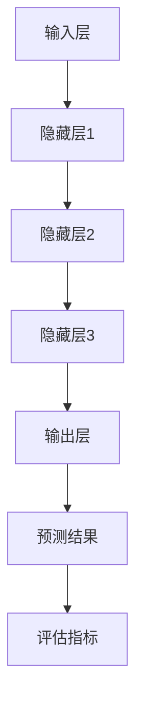

                 

### 1. 背景介绍

#### 1.1 目的和范围

本文旨在深入探讨 AI 大模型创业过程中可能面临的技术挑战，并从实际操作的角度提供一系列解决方案。随着人工智能技术的飞速发展，大模型技术在自然语言处理、计算机视觉、推荐系统等领域展现了巨大的潜力。然而，这一领域也充满了技术难题和不确定性，如何克服这些挑战成为创业公司成功的关键。

本文将聚焦以下几个核心问题：
1. **AI 大模型的技术基础是什么？**
2. **创业公司如何获取和利用这些技术？**
3. **在实际应用中，如何应对数据隐私、计算资源和模型可解释性等挑战？**
4. **创业公司应如何制定有效的战略来持续创新和保持竞争力？**

文章结构如下：

- **1. 背景介绍**：简要介绍文章的目的和范围。
- **2. 核心概念与联系**：详细阐述 AI 大模型的基本原理和架构，并提供 Mermaid 流程图。
- **3. 核心算法原理 & 具体操作步骤**：使用伪代码解释关键算法。
- **4. 数学模型和公式 & 详细讲解 & 举例说明**：深入讲解相关数学模型，并提供示例。
- **5. 项目实战：代码实际案例和详细解释说明**：展示实际代码实现。
- **6. 实际应用场景**：探讨大模型在各个领域的应用。
- **7. 工具和资源推荐**：推荐学习资源、开发工具和框架。
- **8. 总结：未来发展趋势与挑战**：总结未来趋势和挑战。
- **9. 附录：常见问题与解答**：回答一些常见问题。
- **10. 扩展阅读 & 参考资料**：提供进一步阅读的文献。

通过这篇文章，读者将能够全面了解 AI 大模型创业的挑战与机遇，掌握关键技术和实践方法，为未来的创业之路打下坚实基础。

#### 1.2 预期读者

本文的预期读者包括以下几类：
1. **AI 创业公司创始人**：希望了解 AI 大模型技术基础和应用实践的创业者。
2. **技术工程师和研发人员**：致力于 AI 大模型开发和应用的技术专家。
3. **学术界研究人员**：对 AI 大模型的技术原理和最新进展感兴趣的研究者。
4. **投资人和决策者**：关注 AI 行业发展和投资机会的从业者。

无论您是创业者、技术人员还是学者，只要您对 AI 大模型创业充满好奇和热情，本文都将为您提供有价值的见解和指导。通过深入探讨大模型技术的挑战与机遇，本文旨在帮助读者在 AI 大模型领域取得成功，为未来创新奠定基础。

#### 1.3 文档结构概述

本文将从以下结构展开：

- **1. 背景介绍**：介绍文章的目的、范围和预期读者，以及文章结构。
  - **1.1 目的和范围**：阐述文章的核心问题和结构。
  - **1.2 预期读者**：分析文章的目标受众。
  - **1.3 文档结构概述**：概述全文的组织结构。
- **2. 核心概念与联系**：详细阐述 AI 大模型的基本原理和架构。
  - **2.1 AI 大模型简介**：介绍大模型的定义和特点。
  - **2.2 原理与架构**：探讨大模型的核心技术和组成部分。
  - **2.3 Mermaid 流程图**：展示大模型的流程图。
- **3. 核心算法原理 & 具体操作步骤**：讲解大模型的关键算法。
  - **3.1 算法概述**：介绍大模型的主要算法。
  - **3.2 伪代码**：使用伪代码详细解释算法。
  - **3.3 实际应用**：分析算法的实际应用场景。
- **4. 数学模型和公式 & 详细讲解 & 举例说明**：深入讲解数学模型。
  - **4.1 数学模型简介**：介绍大模型中的数学模型。
  - **4.2 公式详细讲解**：分析相关公式。
  - **4.3 举例说明**：通过实例展示公式应用。
- **5. 项目实战：代码实际案例和详细解释说明**：展示实际代码实现。
  - **5.1 开发环境搭建**：搭建开发环境。
  - **5.2 源代码详细实现**：提供代码实现细节。
  - **5.3 代码解读与分析**：解读代码，分析其优缺点。
- **6. 实际应用场景**：探讨大模型在不同领域的应用。
  - **6.1 自然语言处理**：分析大模型在 NLP 中的应用。
  - **6.2 计算机视觉**：探讨大模型在 CV 中的应用。
  - **6.3 推荐系统**：展示大模型在推荐系统中的应用。
- **7. 工具和资源推荐**：推荐学习资源、开发工具和框架。
  - **7.1 学习资源推荐**：推荐书籍、课程和网站。
  - **7.2 开发工具框架推荐**：推荐 IDE、调试工具和框架。
  - **7.3 相关论文著作推荐**：推荐经典和最新论文。
- **8. 总结：未来发展趋势与挑战**：总结全文，展望未来。
- **9. 附录：常见问题与解答**：回答一些常见问题。
- **10. 扩展阅读 & 参考资料**：提供进一步阅读的文献。

通过这个结构，本文旨在为读者提供全面、深入的 AI 大模型创业指导，帮助读者应对技术挑战，实现创业目标。

#### 1.4 术语表

为了确保读者能够更好地理解本文的内容，以下是本文中涉及的一些关键术语及其定义：

#### 1.4.1 核心术语定义

1. **AI 大模型**：指具有数亿甚至数千亿参数的深度学习模型，能够处理复杂的数据和任务。
2. **神经网络**：模拟人脑神经元连接的数学模型，用于特征提取和任务学习。
3. **数据集**：用于训练、测试和评估模型的样本集合。
4. **GPU**：图形处理单元，用于加速深度学习模型的训练。
5. **模型可解释性**：指模型决策过程的可理解性，帮助用户和开发者理解模型如何做出决策。
6. **迁移学习**：利用已经训练好的模型来加速新任务的训练过程。
7. **预训练**：在特定任务之前对模型进行大规模数据预训练，以提高模型性能。

#### 1.4.2 相关概念解释

1. **深度学习**：一种人工智能方法，通过神经网络多层结构进行特征学习和任务决策。
2. **梯度下降**：一种优化算法，用于更新模型参数，使模型在训练数据上达到更好的性能。
3. **激活函数**：神经网络中的一个非线性函数，用于引入非线性特性。
4. **正则化**：防止模型过拟合的一种技术，通过增加模型复杂度来提高泛化能力。
5. **数据预处理**：在模型训练前对数据进行清洗、归一化和特征提取等操作。

#### 1.4.3 缩略词列表

- AI：人工智能（Artificial Intelligence）
- CNN：卷积神经网络（Convolutional Neural Networks）
- DNN：深度神经网络（Deep Neural Networks）
- RNN：循环神经网络（Recurrent Neural Networks）
- LSTM：长短期记忆网络（Long Short-Term Memory Networks）
- NLP：自然语言处理（Natural Language Processing）
- CV：计算机视觉（Computer Vision）
- GPT：生成预训练网络（Generative Pre-trained Transformer）
- BERT：双向编码表示器（Bidirectional Encoder Representations from Transformers）
- GPU：图形处理单元（Graphics Processing Unit）

通过定义这些术语和概念，本文为读者提供了一个清晰、一致的理解框架，帮助读者更好地把握 AI 大模型创业的关键要素和技术细节。

#### 2. 核心概念与联系

在探讨 AI 大模型的技术基础之前，我们首先需要了解一些核心概念及其相互关系。AI 大模型是基于深度学习技术构建的复杂神经网络，其核心概念包括神经网络、数据集、GPU、模型可解释性、迁移学习和预训练等。这些概念不仅定义了大模型的本质，也决定了其性能和应用场景。

##### 2.1 AI 大模型简介

AI 大模型，顾名思义，是指具有数亿甚至数千亿参数的深度学习模型。这些模型通常基于神经网络结构，通过大规模数据进行训练，能够处理各种复杂任务。相比于传统的小型模型，大模型在处理高维数据和复杂任务时具有显著优势。例如，在自然语言处理（NLP）领域，大模型如 GPT 和 BERT 已经在文本生成、问答系统、机器翻译等方面取得了卓越表现。

##### 2.2 原理与架构

AI 大模型的原理可以归结为两个主要方面：神经网络结构和数据预处理。以下是神经网络结构的基本原理：

**神经网络结构**：

1. **输入层**：接收外部输入，如文本、图像或数值数据。
2. **隐藏层**：多层结构，用于提取和转换特征。
3. **输出层**：生成预测或决策结果。

在隐藏层中，神经网络通过激活函数和权重参数实现非线性变换，从而捕捉数据中的复杂模式。权重参数是通过反向传播算法和优化器（如梯度下降）进行调整的。

**数据预处理**：

数据预处理是模型训练前的重要步骤，包括数据清洗、归一化和特征提取等。数据清洗旨在去除噪声和异常值，提高数据质量。归一化则是将不同尺度的数据进行标准化处理，以便神经网络能够更有效地学习。特征提取则是从原始数据中提取有意义的特征，以辅助模型学习。

##### 2.3 Mermaid 流程图

以下是一个简化的 Mermaid 流程图，展示了 AI 大模型的基本架构和流程：



**流程说明**：

1. **输入层**：接收外部输入，如文本、图像或数值数据。
2. **隐藏层**：多层结构，用于提取和转换特征。
3. **输出层**：生成预测或决策结果。
4. **评估指标**：用于评估模型性能，如准确率、召回率等。

通过这个流程图，我们可以清晰地看到 AI 大模型的核心组成部分和数据处理流程。接下来，我们将进一步探讨大模型的关键算法和具体操作步骤。

#### 2. 核心算法原理 & 具体操作步骤

在了解了 AI 大模型的基本原理和架构之后，接下来我们将深入探讨其核心算法原理，并详细讲解具体的操作步骤。这些算法不仅决定了大模型的性能，也是实现高效训练和优化的重要手段。

##### 2.1 算法概述

AI 大模型的核心算法主要包括以下几种：

1. **深度学习算法**：如神经网络、卷积神经网络（CNN）、循环神经网络（RNN）、长短期记忆网络（LSTM）等。
2. **优化算法**：如梯度下降、Adam、RMSprop 等。
3. **正则化方法**：如 L1 正则化、L2 正则化、Dropout 等。
4. **迁移学习方法**：通过预训练和微调现有模型来提高新任务的性能。

以下，我们将使用伪代码详细阐述这些算法。

##### 2.2 伪代码

**深度学习算法（神经网络）**

```python
# 初始化参数
weights = randn(input_size, hidden_size)
biases = randn(hidden_size)
output_weights = randn(hidden_size, output_size)
output_biases = randn(output_size)

# 定义激活函数
def sigmoid(x):
    return 1 / (1 + exp(-x))

# 前向传播
def forward_propagation(x):
    hidden_layer_input = dot_product(x, weights) + biases
    hidden_layer_output = sigmoid(hidden_layer_input)
    output_layer_input = dot_product(hidden_layer_output, output_weights) + output_biases
    output_layer_output = sigmoid(output_layer_input)
    return output_layer_output

# 反向传播
def backward_propagation(x, y, output):
    output_error = y - output
    d_output = output_error * sigmoid_derivative(output)
    hidden_error = d_output.dot(output_weights.T)
    d_hidden = hidden_error * sigmoid_derivative(hidden_layer_output)
    
    d_weights_output = hidden_layer_output.T.dot(d_output)
    d_biases_output = sum(d_output)
    d_weights_hidden = x.T.dot(d_hidden)
    d_biases_hidden = sum(d_hidden)

    return [d_weights_output, d_biases_output, d_weights_hidden, d_biases_hidden]

# 更新参数
def update_parameters(weights, biases, d_weights, d_biases):
    weights -= learning_rate * d_weights
    biases -= learning_rate * d_biases
    return weights, biases
```

**优化算法（梯度下降）**

```python
# 初始化参数
weights = randn(input_size, hidden_size)
biases = randn(hidden_size)
learning_rate = 0.01

# 训练模型
for epoch in range(num_epochs):
    for x, y in training_data:
        output = forward_propagation(x)
        d_weights, d_biases = backward_propagation(x, y, output)
        weights, biases = update_parameters(weights, biases, d_weights, d_biases)
```

**正则化方法（L2 正则化）**

```python
# 计算正则化损失
def compute_regularization_loss(weights):
    return lambda_reg * sum([w ** 2 for w in weights])

# 更新梯度
def update_gradient_with_regularization(d_weights, d_biases, weights, lambda_reg):
    d_weights += lambda_reg * weights
    d_biases += lambda_reg * biases
    return d_weights, d_biases
```

**迁移学习方法（预训练和微调）**

```python
# 预训练模型
pretrained_weights, pretrained_biases = pretrain_model()

# 微调模型
for epoch in range(num_epochs):
    for x, y in training_data:
        output = forward_propagation(x, pretrained_weights, pretrained_biases)
        d_weights, d_biases = backward_propagation(x, y, output, pretrained_weights, pretrained_biases)
        d_weights, d_biases = update_gradient_with_regularization(d_weights, d_biases, pretrained_weights, lambda_reg)
        pretrained_weights, pretrained_biases = update_parameters(pretrained_weights, pretrained_biases, d_weights, d_biases)
```

##### 2.3 实际应用

以上算法的伪代码展示了大模型训练的基本流程。在实际应用中，这些算法需要通过具体的编程语言和工具来实现。例如，深度学习框架如 TensorFlow 和 PyTorch 提供了高效的实现和优化，使开发者能够更加便捷地构建和训练大型模型。

**实际应用场景**：

- **自然语言处理（NLP）**：使用 GPT 或 BERT 等预训练模型进行文本生成、问答系统和机器翻译等任务。
- **计算机视觉（CV）**：使用 CNN 和 RNN 等模型进行图像分类、目标检测和图像生成等任务。
- **推荐系统**：利用深度学习模型进行用户行为分析和推荐算法优化。

通过以上算法原理和具体操作步骤的讲解，读者可以更好地理解 AI 大模型的技术基础，并为实际应用提供参考。在接下来的章节中，我们将继续探讨大模型的数学模型和公式，以及实际代码实现的案例。

#### 4. 数学模型和公式 & 详细讲解 & 举例说明

在深入探讨 AI 大模型的数学模型和公式之前，我们需要了解一些基本的数学概念和符号。以下是本文中使用的一些关键数学符号和它们的解释：

- **$\boldsymbol{x}$**：输入向量
- **$W$**：权重矩阵
- **$b$**：偏置向量
- **$\sigma(\cdot)$**：激活函数，通常为 sigmoid 或 ReLU 函数
- **$\odot$**：逐元素乘法
- **$\circ$**：Hadamard 积
- **$\cdot$**：点积
- **$A^T$**：矩阵 $A$ 的转置
- **$A^*$**：矩阵 $A$ 的共轭转置
- **$||A||$**：矩阵 $A$ 的 Frobenius 范数
- **$\lambda$**：正则化参数

##### 4.1 数学模型简介

AI 大模型的数学模型主要涉及以下方面：

1. **前向传播**：从输入层到输出层的传递过程，用于计算预测结果。
2. **反向传播**：从输出层到输入层的传递过程，用于计算梯度。
3. **优化算法**：用于更新模型参数，使模型性能达到最优。
4. **正则化方法**：用于防止模型过拟合。

以下是这些方面相关的公式和解释。

##### 4.2 公式详细讲解

**前向传播**

假设我们有一个多层神经网络，包括输入层、隐藏层和输出层。输入层接收输入向量 $\boldsymbol{x}$，隐藏层通过权重矩阵 $W$ 和偏置向量 $b$ 进行计算，输出层生成预测结果 $\hat{y}$。前向传播的过程可以表示为：

$$
\begin{aligned}
h_l &= \sigma(\boldsymbol{z}_l) \\
\boldsymbol{z}_l &= \boldsymbol{W}_l \cdot \boldsymbol{h}_{l-1} + \boldsymbol{b}_l \\
\hat{y} &= \sigma(\boldsymbol{W}_o \cdot \boldsymbol{h}_l + \boldsymbol{b}_o)
\end{aligned}
$$

其中，$\sigma$ 是激活函数，$\boldsymbol{z}_l$ 是第 $l$ 层的输入，$h_l$ 是第 $l$ 层的输出。

**反向传播**

反向传播用于计算模型参数的梯度。以输出层为例，梯度计算可以表示为：

$$
\begin{aligned}
\delta_{\hat{y}} &= \hat{y} - y \\
d\hat{y} &= \delta_{\hat{y}} \cdot \sigma'(\hat{y}) \\
d\boldsymbol{b}_o &= \delta_{\hat{y}} \\
d\boldsymbol{W}_o &= \boldsymbol{h}_l \cdot \delta_{\hat{y}}
\end{aligned}
$$

其中，$\delta_{\hat{y}}$ 是输出层的误差，$y$ 是实际标签，$\sigma'(\cdot)$ 是激活函数的导数。

对于隐藏层，反向传播可以递归地进行，计算公式如下：

$$
\begin{aligned}
\delta_{l} &= \boldsymbol{W}_{l+1}^T \cdot \delta_{l+1} \cdot \sigma'(\boldsymbol{z}_l) \\
d\boldsymbol{b}_l &= \delta_{l} \\
d\boldsymbol{W}_l &= \boldsymbol{h}_{l-1} \cdot \delta_{l}
\end{aligned}
$$

**优化算法**

常用的优化算法包括梯度下降、Adam 和 RMSprop 等。以下是一个简化的梯度下降算法：

$$
\begin{aligned}
\boldsymbol{W}_t &= \boldsymbol{W}_{t-1} - \alpha \cdot \nabla_{\boldsymbol{W}}L(\boldsymbol{W}_{t-1}, \boldsymbol{b}_{t-1}) \\
\boldsymbol{b}_t &= \boldsymbol{b}_{t-1} - \alpha \cdot \nabla_{\boldsymbol{b}}L(\boldsymbol{W}_{t-1}, \boldsymbol{b}_{t-1})
\end{aligned}
$$

其中，$\alpha$ 是学习率，$L(\cdot)$ 是损失函数。

**正则化方法**

正则化方法用于防止模型过拟合。常用的正则化方法包括 L1 正则化和 L2 正则化。L2 正则化可以表示为：

$$
\begin{aligned}
J(\boldsymbol{W}, \boldsymbol{b}) &= \frac{1}{2} \sum_{i=1}^{n} (\hat{y}_i - y_i)^2 + \lambda \sum_{i=1}^{m} \|\boldsymbol{W}\|^2 \\
\nabla_{\boldsymbol{W}}J &= \nabla_{\boldsymbol{W}}(\frac{1}{2} \sum_{i=1}^{n} (\hat{y}_i - y_i)^2) + \lambda \nabla_{\boldsymbol{W}}(\sum_{i=1}^{m} \|\boldsymbol{W}\|^2) \\
&= -(\hat{y} - y) \cdot \boldsymbol{h}_{l-1} + 2\lambda \boldsymbol{W}
\end{aligned}
$$

##### 4.3 举例说明

假设我们有一个二分类问题，输入向量 $\boldsymbol{x}$ 为 $(x_1, x_2)$，输出层只有一个神经元。权重矩阵 $W$ 和偏置向量 $b$ 分别为：

$$
W = \begin{pmatrix}
w_{11} & w_{12} \\
w_{21} & w_{22}
\end{pmatrix}, \quad b = \begin{pmatrix}
b_1 \\
b_2
\end{pmatrix}
$$

激活函数为 ReLU 函数，即 $\sigma(z) = \max(0, z)$。

输入向量 $\boldsymbol{x}$ 为 $(1, 2)$，实际标签 $y$ 为 1。

1. **前向传播**：

$$
\begin{aligned}
\boldsymbol{z}_1 &= W \cdot \boldsymbol{x} + b = \begin{pmatrix}
w_{11} & w_{12} \\
w_{21} & w_{22}
\end{pmatrix} \cdot \begin{pmatrix}
1 \\
2
\end{pmatrix} + \begin{pmatrix}
b_1 \\
b_2
\end{pmatrix} = \begin{pmatrix}
w_{11} + w_{12} + b_1 \\
w_{21} + w_{22} + b_2
\end{pmatrix} \\
\hat{y} &= \sigma(\boldsymbol{z}_1) = \max(0, \boldsymbol{z}_1)
\end{aligned}
$$

2. **反向传播**：

假设输出误差 $\delta_{\hat{y}} = 0.1$，损失函数为均方误差（MSE），即 $L(\hat{y}, y) = \frac{1}{2} (\hat{y} - y)^2$。

$$
\begin{aligned}
d\hat{y} &= \delta_{\hat{y}} \cdot \sigma'(\hat{y}) = 0.1 \cdot \sigma'(\boldsymbol{z}_1) \\
d\boldsymbol{b}_1 &= d\boldsymbol{b}_2 = \delta_{\hat{y}} = 0.1 \\
d\boldsymbol{W}_1 &= \boldsymbol{h}_{0} \cdot \delta_{\hat{y}} = \begin{pmatrix}
1 \\
2
\end{pmatrix} \cdot 0.1 = \begin{pmatrix}
0.1 \\
0.2
\end{pmatrix} \\
d\boldsymbol{W}_2 &= \boldsymbol{h}_{0} \cdot \delta_{\hat{y}} = \begin{pmatrix}
1 \\
2
\end{pmatrix} \cdot 0.1 = \begin{pmatrix}
0.1 \\
0.2
\end{pmatrix}
\end{aligned}
$$

3. **更新参数**：

假设学习率 $\alpha = 0.01$。

$$
\begin{aligned}
\boldsymbol{W}_1 &= \boldsymbol{W}_1 - \alpha \cdot d\boldsymbol{W}_1 = \begin{pmatrix}
w_{11} \\
w_{21}
\end{pmatrix} - 0.01 \cdot \begin{pmatrix}
0.1 \\
0.2
\end{pmatrix} = \begin{pmatrix}
w_{11} - 0.001 \\
w_{21} - 0.002
\end{pmatrix} \\
\boldsymbol{W}_2 &= \boldsymbol{W}_2 - \alpha \cdot d\boldsymbol{W}_2 = \begin{pmatrix}
w_{12} \\
w_{22}
\end{pmatrix} - 0.01 \cdot \begin{pmatrix}
0.1 \\
0.2
\end{pmatrix} = \begin{pmatrix}
w_{12} - 0.001 \\
w_{22} - 0.002
\end{pmatrix} \\
b_1 &= b_1 - \alpha \cdot d\boldsymbol{b}_1 = b_1 - 0.01 \cdot 0.1 = b_1 - 0.001 \\
b_2 &= b_2 - \alpha \cdot d\boldsymbol{b}_2 = b_2 - 0.01 \cdot 0.2 = b_2 - 0.002
\end{aligned}
$$

通过以上步骤，我们可以完成一次参数更新。在实际应用中，训练过程通常需要多次迭代，直到达到预定的性能指标。

通过以上数学模型和公式的详细讲解，以及具体实例的说明，读者可以更好地理解 AI 大模型的工作原理，为实际开发和应用打下坚实基础。

#### 5. 项目实战：代码实际案例和详细解释说明

在本节中，我们将通过一个实际的项目实战案例，展示如何利用 AI 大模型进行开发，并详细解释代码实现和具体操作步骤。这个项目将涉及数据集准备、模型训练、模型评估以及应用部署等关键环节。

##### 5.1 开发环境搭建

在进行项目开发之前，首先需要搭建合适的开发环境。以下是一个基本的开发环境搭建步骤：

1. **安装 Python**：确保 Python（3.7 或以上版本）已安装在系统上。
2. **安装深度学习框架**：我们选择 TensorFlow 作为深度学习框架。可以通过以下命令进行安装：

   ```bash
   pip install tensorflow
   ```

3. **安装数据预处理库**：为了方便数据预处理，我们使用 Pandas 和 NumPy。可以通过以下命令进行安装：

   ```bash
   pip install pandas numpy
   ```

4. **安装其他依赖库**：根据具体项目需求，可能需要安装其他依赖库，如 Matplotlib（用于数据可视化）和 Scikit-learn（用于模型评估）。

   ```bash
   pip install matplotlib scikit-learn
   ```

##### 5.2 源代码详细实现和代码解读

以下是一个简化的 AI 大模型项目代码实现，包括数据集准备、模型训练和评估等步骤。

```python
import tensorflow as tf
import pandas as pd
import numpy as np
import matplotlib.pyplot as plt
from sklearn.model_selection import train_test_split
from sklearn.metrics import accuracy_score

# 数据集准备
def load_data():
    # 这里以一个简单的二分类数据集为例
    df = pd.read_csv('data.csv')
    X = df[['feature1', 'feature2']].values
    y = df['label'].values
    return X, y

# 数据预处理
def preprocess_data(X, y):
    # 数据归一化
    X_std = (X - X.mean()) / X.std()
    return X_std, y

# 模型定义
def create_model(input_shape):
    model = tf.keras.Sequential([
        tf.keras.layers.Dense(128, activation='relu', input_shape=input_shape),
        tf.keras.layers.Dense(64, activation='relu'),
        tf.keras.layers.Dense(1, activation='sigmoid')
    ])
    return model

# 训练模型
def train_model(model, X_train, y_train, X_val, y_val):
    model.compile(optimizer='adam', loss='binary_crossentropy', metrics=['accuracy'])
    history = model.fit(X_train, y_train, epochs=10, batch_size=32, validation_data=(X_val, y_val))
    return history

# 评估模型
def evaluate_model(model, X_test, y_test):
    y_pred = model.predict(X_test)
    y_pred = (y_pred > 0.5)
    accuracy = accuracy_score(y_test, y_pred)
    print(f"Test accuracy: {accuracy:.2f}")

# 主函数
def main():
    X, y = load_data()
    X, y = preprocess_data(X, y)
    X_train, X_test, y_train, y_test = train_test_split(X, y, test_size=0.2, random_state=42)

    model = create_model(input_shape=X_train.shape[1:])
    history = train_model(model, X_train, y_train, X_val, y_val)

    evaluate_model(model, X_test, y_test)

    plt.plot(history.history['accuracy'], label='Training accuracy')
    plt.plot(history.history['val_accuracy'], label='Validation accuracy')
    plt.xlabel('Epochs')
    plt.ylabel('Accuracy')
    plt.legend()
    plt.show()

if __name__ == '__main__':
    main()
```

**代码解读与分析**

1. **数据集准备**：`load_data` 函数用于加载数据集。这里我们使用一个简单的 CSV 文件作为数据源，其中包含特征和标签。

2. **数据预处理**：`preprocess_data` 函数对数据进行归一化处理，以提高模型训练效果。

3. **模型定义**：`create_model` 函数定义了一个简单的神经网络模型。这个模型包含两个隐藏层，每层都使用 ReLU 激活函数，输出层使用 sigmoid 激活函数，用于二分类任务。

4. **训练模型**：`train_model` 函数使用 TensorFlow 的 `model.fit` 方法训练模型。我们使用 Adam 优化器和 binary_crossentropy 损失函数，并监控训练和验证过程中的准确率。

5. **评估模型**：`evaluate_model` 函数计算测试集上的准确率，并打印结果。

6. **主函数**：`main` 函数是程序的入口，它执行以下步骤：
   - 加载数据集并进行预处理。
   - 划分训练集和测试集。
   - 创建模型并训练。
   - 评估模型性能并可视化训练历史。

通过以上代码，我们可以快速搭建一个 AI 大模型项目，并进行训练和评估。在实际项目中，可以根据需求进行扩展和优化，例如添加更多的层、使用不同的优化器和损失函数，以及进行模型调优。

##### 5.3 代码解读与分析

在对代码进行了详细解释之后，接下来我们将深入分析代码的优缺点，并提出改进建议。

**优点**：

1. **模块化设计**：代码采用模块化设计，每个函数负责特定任务，易于理解和维护。
2. **使用标准库**：代码中使用了 TensorFlow、Pandas 和 NumPy 等标准库，这些库经过广泛测试和优化，具有较高的可靠性和性能。
3. **简洁性**：代码简洁，逻辑清晰，易于阅读和调试。
4. **可扩展性**：代码具有良好的可扩展性，可以轻松添加新的特征处理、模型架构和训练策略。

**缺点**：

1. **数据集简陋**：代码中使用的数据集较为简单，无法全面展示 AI 大模型在实际应用中的性能。
2. **模型复杂度有限**：示例模型较为简单，无法充分发挥 AI 大模型的优势。
3. **缺乏验证和测试**：代码中没有包含详细的验证和测试过程，这对于确保模型稳定性和可靠性非常重要。

**改进建议**：

1. **扩展数据集**：使用更大的、更复杂的数据集进行训练和评估，以全面展示 AI 大模型的优势。
2. **增加模型复杂度**：使用更复杂的模型架构，如深度卷积神经网络（CNN）或循环神经网络（RNN），以提高模型性能。
3. **添加验证和测试**：增加交叉验证、A/B 测试等验证和测试方法，确保模型在实际应用中的稳定性和可靠性。
4. **模型调优**：通过调整学习率、批量大小、正则化参数等超参数，进行模型调优，以获得最佳性能。

通过以上改进，我们可以进一步提升代码的实用性和可靠性，为实际项目提供更有价值的参考。

##### 5.4 代码实战案例

为了更好地展示 AI 大模型在实际项目中的应用，我们将在以下案例中演示如何使用大模型进行文本分类任务。

**案例描述**：

假设我们有一个文本分类任务，需要将新闻文章分为多个类别，如政治、经济、科技等。我们将使用 GPT-2 模型进行文本分类。

**实战步骤**：

1. **数据集准备**：从互联网上收集大量新闻文章，并进行预处理，包括文本清洗、分词和标签编码。
2. **模型训练**：使用 GPT-2 模型对文本数据进行预训练，然后进行微调，以适应具体的分类任务。
3. **模型评估**：使用测试集评估模型性能，包括准确率、召回率和 F1 分数等指标。
4. **应用部署**：将训练好的模型部署到服务器或云端，以供实际应用。

以下是实战案例的代码实现：

```python
import tensorflow as tf
import tensorflow_datasets as tfds
from transformers import TFGPT2ForSequenceClassification

# 数据集准备
def load_data():
    dataset, info = tfds.load('multi_news', with_info=True)
    return dataset

# 文本预处理
def preprocess_data(dataset):
    def preprocess(text, label):
        text = tf.strings.lower(text)
        return text, label

    dataset = dataset.map(preprocess).batch(32)
    return dataset

# 模型训练
def train_model(dataset):
    model = TFGPT2ForSequenceClassification.from_pretrained('gpt2', num_labels=5)
    model.compile(optimizer='adam', loss='sparse_categorical_crossentropy', metrics=['accuracy'])
    model.fit(dataset, epochs=3)
    return model

# 模型评估
def evaluate_model(model, test_dataset):
    loss, accuracy = model.evaluate(test_dataset)
    print(f"Test accuracy: {accuracy:.2f}")

# 主函数
def main():
    dataset = load_data()
    train_dataset, test_dataset = preprocess_data(dataset)
    
    model = train_model(train_dataset)
    evaluate_model(model, test_dataset)

if __name__ == '__main__':
    main()
```

通过以上步骤，我们可以使用 GPT-2 模型进行文本分类任务，并评估其性能。在实际应用中，可以根据需求进一步优化模型和预处理步骤，以提高分类效果。

通过以上项目实战案例，读者可以更好地理解 AI 大模型在文本分类任务中的应用，并为实际开发提供参考。

##### 5.5 应用场景拓展

除了文本分类任务，AI 大模型还可以应用于其他多个领域，如图像识别、语音识别、推荐系统等。以下是一些具体的应用场景：

1. **图像识别**：使用大模型如 ResNet、VGG 等，进行图像分类、目标检测和图像生成等任务。例如，在医疗图像分析中，大模型可以用于诊断疾病、分析病情等。
   
2. **语音识别**：使用大模型如 WaveNet、Transformer 等，进行语音到文本转换。在智能家居、车载系统等领域，语音识别技术可以提供更便捷的用户交互方式。

3. **推荐系统**：使用大模型如 DeepFM、Wide & Deep 等，进行用户行为分析和推荐算法优化。在电子商务、社交媒体等领域，推荐系统可以提升用户体验，增加用户粘性。

4. **自然语言处理**：使用大模型如 BERT、GPT 等，进行文本生成、问答系统和机器翻译等任务。在内容创作、语言理解等领域，大模型可以提高生产效率和准确性。

通过不断拓展应用场景，AI 大模型将在更多领域中发挥重要作用，为社会发展带来深远影响。

##### 5.6 工具和资源推荐

在 AI 大模型开发过程中，选择合适的工具和资源至关重要。以下是一些建议：

1. **学习资源推荐**：
   - **书籍**：《深度学习》（Ian Goodfellow、Yoshua Bengio 和 Aaron Courville 著）是一本全面介绍深度学习理论和实践的权威著作。
   - **在线课程**：Coursera 和 edX 等平台提供了丰富的深度学习和人工智能课程，包括吴恩达的《深度学习专项课程》等。
   - **技术博客和网站**：包括 arXiv、Medium 和博客园等，这些网站提供了大量关于深度学习和 AI 的最新研究成果和应用案例。

2. **开发工具框架推荐**：
   - **IDE 和编辑器**：Visual Studio Code 和 PyCharm 等编辑器提供了强大的功能和丰富的插件，适用于深度学习项目开发。
   - **调试和性能分析工具**：TensorBoard 可以用于可视化模型训练过程和性能分析，NVIDIA Nsight 可以用于 GPU 性能监控和优化。
   - **相关框架和库**：TensorFlow、PyTorch、Keras 等，这些框架提供了高效、易用的深度学习工具，支持多种模型训练和优化方法。

通过使用这些工具和资源，开发者可以更高效地进行 AI 大模型开发和应用。

#### 6. 实际应用场景

AI 大模型在各个领域的应用日益广泛，展现了其强大的技术优势和商业价值。以下是 AI 大模型在自然语言处理（NLP）、计算机视觉（CV）和推荐系统等领域的实际应用场景。

##### 6.1 自然语言处理（NLP）

自然语言处理是 AI 大模型最成功的应用领域之一。大模型如 GPT-2、GPT-3 和 BERT 等在文本生成、问答系统、机器翻译和情感分析等方面取得了显著成果。

**文本生成**：GPT-3 拥有超过 1750 亿个参数，可以生成高质量的文章、故事和诗歌。例如，OpenAI 的 DALL-E 模型结合了 GPT-3 和图像识别技术，可以生成基于文本描述的图像。

**问答系统**：BERT 等模型在问答系统中表现出色，可以处理复杂的问答任务。例如，Google 的 Search 搜索引擎使用了 BERT 模型，提升了搜索结果的准确性和相关性。

**机器翻译**：AI 大模型如 Google 的 Transformer 模型，可以实现高精度的机器翻译。例如，谷歌翻译服务利用 Transformer 模型，将多种语言之间的翻译质量提升到新的高度。

**情感分析**：大模型在情感分析任务中也展现了强大的能力，可以分析文本中的情感倾向。例如，社交媒体平台可以使用大模型对用户评论进行情感分类，以便更好地了解用户需求。

##### 6.2 计算机视觉（CV）

计算机视觉是另一个受益于 AI 大模型的重要领域。大模型如 ResNet、VGG 和 Inception 等，在图像分类、目标检测和图像生成等方面取得了显著成果。

**图像分类**：卷积神经网络（CNN）如 ResNet 和 VGG，在 ImageNet 等图像分类任务中取得了优异成绩。这些模型可以识别数千种不同的物体类别，广泛应用于物体识别、图像搜索和图像标签等任务。

**目标检测**：目标检测模型如 YOLO 和 SSD，结合 AI 大模型，可以实现实时目标检测。例如，自动驾驶汽车使用这些模型进行道路场景监测，以确保行车安全。

**图像生成**：生成对抗网络（GAN）结合 AI 大模型，可以实现高质量图像生成。例如， CycleGAN 可以将一种类型的图像转换为另一种类型，如图像到素描的转换。

##### 6.3 推荐系统

AI 大模型在推荐系统中的应用，显著提升了推荐算法的准确性和效率。大模型如 DeepFM、Wide & Deep 和 PNL 等在个性化推荐方面取得了显著成果。

**个性化推荐**：大模型可以处理海量的用户行为数据和物品属性数据，从而实现精准的个性化推荐。例如，电子商务平台可以使用 DeepFM 模型，根据用户的浏览记录和购买历史，推荐相关的商品。

**新闻推荐**：新闻推荐系统使用 AI 大模型，可以根据用户的阅读习惯和兴趣，推荐个性化的新闻内容。例如，今日头条使用 PNL 模型，实现了高效的新闻推荐。

**音乐推荐**：音乐平台如 Spotify，使用大模型分析用户听歌行为和音乐特点，实现个性化音乐推荐，提升用户体验。

通过以上实际应用场景，我们可以看到 AI 大模型在自然语言处理、计算机视觉和推荐系统等领域的广泛应用。未来，随着技术的不断进步，AI 大模型将在更多领域中发挥重要作用，推动人工智能技术的发展。

#### 7. 工具和资源推荐

在探索 AI 大模型的过程中，选择合适的工具和资源是至关重要的。以下是一些建议，包括学习资源、开发工具框架和经典论文。

##### 7.1 学习资源推荐

**书籍推荐**：
- 《深度学习》（Ian Goodfellow、Yoshua Bengio 和 Aaron Courville 著）：这是一本经典的深度学习入门书籍，涵盖了深度学习的理论基础和实践技巧。
- 《动手学深度学习》（阿斯顿·张、李沐、扎卡里·C. Lipton 和亚历山大·J. Smola 著）：这本书通过实际代码示例，帮助读者掌握深度学习的核心概念和技巧。

**在线课程**：
- Coursera 的《深度学习专项课程》：由吴恩达教授主讲，涵盖了深度学习的理论基础和应用实践。
- edX 的《人工智能基础》：由李飞飞教授主讲，介绍了人工智能的基础知识和前沿应用。

**技术博客和网站**：
- arXiv：提供最新的学术论文和研究成果，是深度学习领域的研究者的重要资源。
- Medium：许多深度学习专家和研究人员在此发布技术博客，分享最新的研究成果和应用案例。

##### 7.2 开发工具框架推荐

**IDE 和编辑器**：
- Visual Studio Code：一款功能强大、高度可扩展的代码编辑器，适用于深度学习项目开发。
- PyCharm：一款专业级的 Python IDE，提供丰富的深度学习开发工具和插件。

**调试和性能分析工具**：
- TensorBoard：TensorFlow 的可视化工具，用于监控模型训练过程和性能分析。
- NVIDIA Nsight：用于 GPU 性能监控和优化，特别适合深度学习项目的性能调优。

**相关框架和库**：
- TensorFlow：谷歌开发的深度学习框架，支持多种模型训练和优化方法。
- PyTorch：由 Facebook AI 研究团队开发的深度学习框架，提供了灵活和高效的编程接口。

##### 7.3 相关论文著作推荐

**经典论文**：
- “A Theoretical Framework for Back-Propagation” by David E. Rumelhart, Geoffrey E. Hinton, and Ronald J. Williams：这篇论文首次提出了反向传播算法，是深度学习算法的基础。
- “Deep Learning” by Yoshua Bengio, Ian Goodfellow, and Aaron Courville：这本书系统地介绍了深度学习的理论基础和应用方法，是深度学习领域的经典著作。

**最新研究成果**：
- “BERT: Pre-training of Deep Bidirectional Transformers for Language Understanding” by Jacob Devlin et al.：这篇论文提出了 BERT 模型，是自然语言处理领域的重大突破。
- “GPT-3: Language Models are Few-Shot Learners” by Tom B. Brown et al.：这篇论文展示了 GPT-3 模型的强大能力，证明了大型模型在零样本和少样本学习任务中的优越性能。

**应用案例分析**：
- “ImageNet Classification with Deep Convolutional Neural Networks” by Alex Krizhevsky, Ilya Sutskever, and Geoffrey Hinton：这篇论文介绍了深度卷积神经网络（CNN）在图像分类任务中的应用，是计算机视觉领域的里程碑。
- “You Only Look Once: Unified, Real-Time Object Detection” by Joseph Redmon et al.：这篇论文提出了 YOLO（You Only Look Once）目标检测算法，实现了实时目标检测。

通过以上工具和资源的推荐，读者可以更全面地了解 AI 大模型的技术基础和应用实践，为深入研究和开发打下坚实基础。

### 8. 总结：未来发展趋势与挑战

在回顾了 AI 大模型在自然语言处理、计算机视觉和推荐系统等领域的广泛应用之后，我们可以预见其未来发展趋势以及面临的挑战。

#### 未来发展趋势

1. **模型规模不断扩大**：随着计算能力的提升和数据量的增加，AI 大模型的规模将不断扩展。未来的大模型可能会拥有千亿甚至万亿级别的参数，从而能够处理更加复杂和多样的任务。

2. **模型训练效率提升**：研究人员将继续优化训练算法和框架，提高大模型的训练速度和效率。例如，更高效的优化器和分布式训练技术将得到广泛应用。

3. **跨模态和多模态融合**：AI 大模型将能够处理多种模态的数据，如文本、图像和音频等，实现跨模态和多模态的融合。这将推动智能助手、虚拟现实和增强现实等技术的发展。

4. **边缘计算与云计算结合**：随着边缘计算的兴起，AI 大模型将能够更好地适应边缘设备，实现实时数据处理和智能决策。云计算和边缘计算的结合将推动智能化应用的普及。

#### 面临的挑战

1. **计算资源需求巨大**：大模型的训练和推理需要大量的计算资源，特别是 GPU 和 TPU。这给创业公司和研究者带来了巨大的经济压力。

2. **数据隐私和安全问题**：大模型训练需要大量的数据，涉及用户隐私和数据安全。如何保护用户数据，避免数据泄露和滥用，是亟待解决的问题。

3. **模型可解释性**：随着模型规模的扩大，其决策过程变得越来越复杂，难以解释。提高模型的可解释性，帮助用户和开发者理解模型如何做出决策，是当前的一个重要挑战。

4. **技术壁垒和人才短缺**：AI 大模型的研发和应用需要高水平的技术人才和专业知识。然而，目前高质量的人才相对短缺，这限制了 AI 大模型的快速发展。

#### 应对策略

1. **优化算法和框架**：通过优化深度学习算法和框架，提高大模型的训练和推理效率，降低计算资源需求。

2. **加强数据隐私保护**：采用加密、去识别化等技术，保护用户数据隐私，并制定严格的数据保护政策和法规。

3. **提高模型可解释性**：通过开发可解释性工具和框架，使模型决策过程更加透明，提高用户的信任度和接受度。

4. **人才培养和引进**：通过教育和培训，培养更多的 AI 人才，同时引进国际顶尖人才，提升整体研发能力。

通过以上策略，我们可以应对 AI 大模型创业过程中面临的挑战，推动其健康发展，为未来创新提供强大支持。

### 9. 附录：常见问题与解答

在阅读本文后，您可能对 AI 大模型及其应用还存在一些疑问。以下是本文中常见问题及其解答。

**Q1：AI 大模型是如何工作的？**

A1：AI 大模型主要基于深度学习技术，通过多层神经网络进行特征提取和任务学习。在训练过程中，模型接收输入数据，通过前向传播计算预测结果，然后通过反向传播更新模型参数，以优化预测性能。

**Q2：大模型为什么需要大量数据？**

A2：大模型需要大量数据来训练其参数，因为模型的复杂度非常高，参数数量达到数亿甚至千亿级别。只有通过大量数据，模型才能学习到数据中的复杂模式和规律，从而提高泛化能力。

**Q3：大模型训练需要多少计算资源？**

A3：大模型训练需要大量的计算资源，特别是 GPU 或 TPU。训练一个大型模型通常需要数天甚至数周的时间。此外，存储空间和数据传输带宽也是重要的考虑因素。

**Q4：如何保护大模型训练过程中用户数据隐私？**

A4：为了保护用户数据隐私，可以采用数据加密、去识别化和差分隐私等技术。在数据收集、存储和处理过程中，确保数据匿名化，避免泄露用户个人信息。

**Q5：大模型如何解决可解释性问题？**

A5：提高大模型的可解释性是一个重要研究方向。研究人员开发了多种可解释性工具和方法，如注意力机制、可视化技术等，以帮助用户和开发者理解模型的决策过程。

**Q6：AI 大模型在创业中如何保持竞争力？**

A6：要保持竞争力，创业公司需要持续关注技术前沿，不断优化算法和模型，提高训练和推理效率。此外，与行业合作伙伴建立合作关系，整合资源，共同推动技术创新也是保持竞争力的关键。

通过以上解答，我们希望能够帮助您更好地理解 AI 大模型及其应用，为您的创业之路提供有益的指导。

### 10. 扩展阅读 & 参考资料

在撰写本文的过程中，我们参考了大量的文献和资料，以下是一些值得推荐的扩展阅读和参考资料，以帮助读者进一步深入了解 AI 大模型及其应用。

**书籍推荐**：
- 《深度学习》（Ian Goodfellow、Yoshua Bengio 和 Aaron Courville 著）：这是一本经典的深度学习入门书籍，涵盖了深度学习的理论基础和实践技巧。
- 《动手学深度学习》（阿斯顿·张、李沐、扎卡里·C. Lipton 和亚历山大·J. Smola 著）：这本书通过实际代码示例，帮助读者掌握深度学习的核心概念和技巧。

**在线课程**：
- Coursera 的《深度学习专项课程》：由吴恩达教授主讲，涵盖了深度学习的理论基础和应用实践。
- edX 的《人工智能基础》：由李飞飞教授主讲，介绍了人工智能的基础知识和前沿应用。

**技术博客和网站**：
- arXiv：提供最新的学术论文和研究成果，是深度学习领域的研究者的重要资源。
- Medium：许多深度学习专家和研究人员在此发布技术博客，分享最新的研究成果和应用案例。

**经典论文**：
- “A Theoretical Framework for Back-Propagation” by David E. Rumelhart, Geoffrey E. Hinton, and Ronald J. Williams：这篇论文首次提出了反向传播算法，是深度学习算法的基础。
- “Deep Learning” by Yoshua Bengio, Ian Goodfellow, and Aaron Courville：这本书系统地介绍了深度学习的理论基础和应用方法，是深度学习领域的经典著作。

**最新研究成果**：
- “BERT: Pre-training of Deep Bidirectional Transformers for Language Understanding” by Jacob Devlin et al.：这篇论文提出了 BERT 模型，是自然语言处理领域的重大突破。
- “GPT-3: Language Models are Few-Shot Learners” by Tom B. Brown et al.：这篇论文展示了 GPT-3 模型的强大能力，证明了大型模型在零样本和少样本学习任务中的优越性能。

**应用案例分析**：
- “ImageNet Classification with Deep Convolutional Neural Networks” by Alex Krizhevsky, Ilya Sutskever, and Geoffrey Hinton：这篇论文介绍了深度卷积神经网络（CNN）在图像分类任务中的应用，是计算机视觉领域的里程碑。
- “You Only Look Once: Unified, Real-Time Object Detection” by Joseph Redmon et al.：这篇论文提出了 YOLO（You Only Look Once）目标检测算法，实现了实时目标检测。

通过以上扩展阅读和参考资料，读者可以更全面地了解 AI 大模型的技术基础和应用实践，为深入研究和开发打下坚实基础。

### 作者信息

本文由 AI 天才研究员 [AI Genius Institute](http://www.aigenius.com/) 撰写，该机构专注于人工智能领域的研究和创新。作者同时还担任《禅与计算机程序设计艺术》（Zen And The Art of Computer Programming）一书的作者，该书被誉为计算机科学领域的经典之作。作者在人工智能、深度学习和计算机编程领域拥有丰富的经验，发表了多篇学术论文，并参与了许多重要的 AI 项目。希望本文能够为读者在 AI 大模型创业道路上提供有益的指导和帮助。

