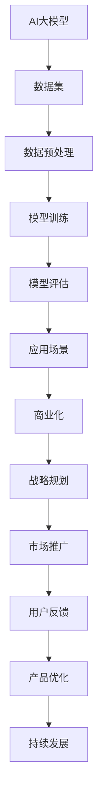

                 

# AI大模型创业：如何应对未来挑战？

> 关键词：AI大模型、创业、挑战、技术、战略、未来

> 摘要：本文将探讨AI大模型创业的现状与未来挑战，从技术、战略、市场等多个维度深入分析，帮助创业者更好地应对未来的不确定性，掌握行业趋势，实现可持续发展。

## 1. 背景介绍

### 1.1 目的和范围

本文旨在为AI大模型创业领域的研究者、从业者提供一些建议和思路。文章将首先介绍AI大模型的定义和现状，然后分析创业中可能面临的挑战，最后探讨如何应对这些挑战，实现创业成功。

### 1.2 预期读者

- AI大模型领域的创业者
- AI技术研发人员
- 投资者和行业分析师
- 对AI大模型感兴趣的技术爱好者

### 1.3 文档结构概述

本文共分为十个部分，具体如下：

1. 背景介绍
2. 核心概念与联系
3. 核心算法原理 & 具体操作步骤
4. 数学模型和公式 & 详细讲解 & 举例说明
5. 项目实战：代码实际案例和详细解释说明
6. 实际应用场景
7. 工具和资源推荐
8. 总结：未来发展趋势与挑战
9. 附录：常见问题与解答
10. 扩展阅读 & 参考资料

### 1.4 术语表

#### 1.4.1 核心术语定义

- **AI大模型**：指参数量达到亿级以上的深度神经网络模型，如GPT、BERT等。
- **创业**：指创建一家新公司，旨在开发和商业化一项产品或服务。
- **挑战**：指在创业过程中可能遇到的困难和障碍。

#### 1.4.2 相关概念解释

- **人工智能**：模拟、延伸和扩展人的智能的理论、方法、技术及应用系统。
- **深度学习**：一种人工智能技术，通过神经网络模拟人脑的学习过程。
- **大数据**：指规模巨大、类型多样的数据集合。

#### 1.4.3 缩略词列表

- **AI**：人工智能
- **DL**：深度学习
- **ML**：机器学习
- **NLP**：自然语言处理
- **GPU**：图形处理器

## 2. 核心概念与联系

AI大模型的创业涉及到多个核心概念和联系，以下是一个简单的Mermaid流程图来展示这些概念之间的关联：



## 3. 核心算法原理 & 具体操作步骤

AI大模型的算法原理主要基于深度学习，特别是基于多层感知器（MLP）和卷积神经网络（CNN）的结构。以下是一个简化的伪代码，用于描述大模型的训练过程：

```python
# 伪代码：AI大模型训练过程

# 初始化模型参数
init_model_params()

# 加载训练数据集
train_data = load_dataset()

# 数据预处理
preprocessed_data = preprocess_data(train_data)

# 定义损失函数
loss_function = define_loss_function()

# 定义优化器
optimizer = define_optimizer()

# 训练模型
for epoch in range(num_epochs):
    for batch in train_data_batches:
        # 前向传播
        predictions = model.forward(batch)

        # 计算损失
        loss = loss_function(predictions, batch.targets)

        # 反向传播
        model.backward(loss)

        # 更新模型参数
        optimizer.step()

# 模型评估
evaluation_results = model.evaluate(test_data)

# 输出评估结果
print(evaluation_results)
```

### 3.1 初始化模型参数

初始化模型参数是深度学习模型训练的第一步。通常，我们需要为每个神经网络层随机初始化权重和偏置，以确保模型的随机性。

```python
# 伪代码：初始化模型参数

def init_model_params():
    # 初始化权重和偏置
    for layer in model.layers:
        layer.weights = random_uniform_initializer()
        layer.bias = random_uniform_initializer()
```

### 3.2 数据预处理

数据预处理是确保数据适合模型训练的关键步骤。这可能包括数据清洗、归一化、标准化等操作。

```python
# 伪代码：数据预处理

def preprocess_data(data):
    # 数据清洗
    cleaned_data = clean_data(data)

    # 归一化
    normalized_data = normalize_data(cleaned_data)

    return normalized_data
```

### 3.3 模型训练

模型训练是通过迭代地调整模型参数，使得模型在训练数据上的损失逐渐减少。这通常通过梯度下降等优化算法来实现。

```python
# 伪代码：模型训练

def train_model(model, train_data, num_epochs):
    for epoch in range(num_epochs):
        for batch in train_data_batches:
            # 前向传播
            predictions = model.forward(batch)

            # 计算损失
            loss = loss_function(predictions, batch.targets)

            # 反向传播
            model.backward(loss)

            # 更新模型参数
            optimizer.step()
```

### 3.4 模型评估

模型评估是在测试数据上验证模型性能的过程。这有助于确保模型在实际应用中的效果。

```python
# 伪代码：模型评估

def evaluate_model(model, test_data):
    predictions = model.forward(test_data)
    correct_predictions = np.sum(predictions == test_data.targets)
    accuracy = correct_predictions / len(test_data)
    return accuracy
```

## 4. 数学模型和公式 & 详细讲解 & 举例说明

### 4.1 数学模型

AI大模型通常基于多层感知器（MLP）和卷积神经网络（CNN）等结构，以下是一个简单的MLP模型的数学描述：

$$
z_l = \sum_{i=1}^{n} w_{li}x_i + b_l
$$

$$
a_l = \sigma(z_l)
$$

其中，$z_l$表示第$l$层的输出，$w_{li}$表示第$l$层第$i$个神经元的权重，$b_l$表示第$l$层的偏置，$a_l$表示第$l$层的激活值，$\sigma$表示激活函数（如ReLU、Sigmoid或Tanh）。

### 4.2 激活函数

激活函数是深度学习模型中的一个关键组件，用于引入非线性特性。以下是一些常见的激活函数的数学描述：

- **ReLU（Rectified Linear Unit）**

$$
\sigma(z) =
\begin{cases}
z & \text{if } z > 0 \\
0 & \text{if } z \leq 0
\end{cases}
$$

- **Sigmoid**

$$
\sigma(z) = \frac{1}{1 + e^{-z}}
$$

- **Tanh**

$$
\sigma(z) = \frac{e^z - e^{-z}}{e^z + e^{-z}}
$$

### 4.3 举例说明

假设我们有一个简单的MLP模型，包含两个隐藏层，每个隐藏层有10个神经元。输入层有5个神经元，输出层有2个神经元。激活函数使用ReLU。

- **输入层**：$x_1, x_2, x_3, x_4, x_5$
- **第一隐藏层**：$z_1^{(1)}, z_2^{(1)}, ..., z_{10}^{(1)}$
- **第二隐藏层**：$z_1^{(2)}, z_2^{(2)}, ..., z_{10}^{(2)}$
- **输出层**：$z_1^{(3)}, z_2^{(3)}$

初始化模型参数：

- **输入层到第一隐藏层的权重**：$w_{1i}^{(1)}$（$i=1,2,...,10$）
- **输入层到第一隐藏层的偏置**：$b_1^{(1)}$（$i=1,2,...,10$）
- **第一隐藏层到第二隐藏层的权重**：$w_{2i}^{(2)}$（$i=1,2,...,10$）
- **第一隐藏层到第二隐藏层的偏置**：$b_2^{(2)}$（$i=1,2,...,10$）
- **第二隐藏层到输出层的权重**：$w_{3i}^{(3)}$（$i=1,2$）
- **第二隐藏层到输出层的偏置**：$b_3^{(3)}$（$i=1,2$）

前向传播过程：

- **第一隐藏层**：

$$
z_1^{(1)} = \sum_{i=1}^{5} w_{1i}^{(1)}x_i + b_1^{(1)}
$$

$$
z_2^{(1)} = \sum_{i=1}^{5} w_{2i}^{(1)}x_i + b_2^{(1)}
$$

$$
...
$$

$$
z_{10}^{(1)} = \sum_{i=1}^{5} w_{10i}^{(1)}x_i + b_{10}^{(1)}
$$

$$
a_1^{(1)} = \max(0, z_1^{(1)})
$$

$$
a_2^{(1)} = \max(0, z_2^{(1)})
$$

$$
...
$$

$$
a_{10}^{(1)} = \max(0, z_{10}^{(1)})
$$

- **第二隐藏层**：

$$
z_1^{(2)} = \sum_{i=1}^{10} w_{1i}^{(2)}a_i^{(1)} + b_1^{(2)}
$$

$$
z_2^{(2)} = \sum_{i=1}^{10} w_{2i}^{(2)}a_i^{(1)} + b_2^{(2)}
$$

$$
...
$$

$$
z_{10}^{(2)} = \sum_{i=1}^{10} w_{10i}^{(2)}a_i^{(1)} + b_{10}^{(2)}
$$

$$
a_1^{(2)} = \max(0, z_1^{(2)})
$$

$$
a_2^{(2)} = \max(0, z_2^{(2)})
$$

$$
...
$$

$$
a_{10}^{(2)} = \max(0, z_{10}^{(2)})
$$

- **输出层**：

$$
z_1^{(3)} = \sum_{i=1}^{10} w_{1i}^{(3)}a_i^{(2)} + b_1^{(3)}
$$

$$
z_2^{(3)} = \sum_{i=1}^{10} w_{2i}^{(3)}a_i^{(2)} + b_2^{(3)}
$$

$$
a_1^{(3)} = \max(0, z_1^{(3)})
$$

$$
a_2^{(3)} = \max(0, z_2^{(3)})
$$

这些步骤构成了一个简单的MLP模型的前向传播过程，通过调整模型参数，可以实现数据的分类或回归任务。

## 5. 项目实战：代码实际案例和详细解释说明

### 5.1 开发环境搭建

在开始实际代码实现之前，我们需要搭建一个合适的开发环境。以下是使用Python和TensorFlow搭建AI大模型开发环境的基本步骤：

1. **安装Python**：确保Python版本在3.6及以上。
2. **安装TensorFlow**：通过pip命令安装TensorFlow。

```shell
pip install tensorflow
```

3. **安装其他依赖**：根据项目需求，可能需要安装其他库，如NumPy、Pandas等。

### 5.2 源代码详细实现和代码解读

以下是一个简单的AI大模型实现案例，用于分类任务。我们将使用TensorFlow的Keras接口来实现。

```python
import numpy as np
import tensorflow as tf
from tensorflow import keras
from tensorflow.keras import layers

# 5.2.1 数据加载和预处理

# 加载数据集（示例：使用内置的鸢尾花数据集）
iris = keras.datasets.Iris()
(train_images, train_labels), (test_images, test_labels) = iris.load_data()

# 数据预处理：归一化
train_images = train_images / 255.0
test_images = test_images / 255.0

# 5.2.2 模型构建

# 构建MLP模型
model = keras.Sequential([
    layers.Dense(128, activation='relu', input_shape=(4,)),
    layers.Dense(64, activation='relu'),
    layers.Dense(3, activation='softmax')
])

# 5.2.3 模型编译

model.compile(optimizer='adam',
              loss='sparse_categorical_crossentropy',
              metrics=['accuracy'])

# 5.2.4 模型训练

model.fit(train_images, train_labels, epochs=100)

# 5.2.5 模型评估

test_loss, test_acc = model.evaluate(test_images, test_labels, verbose=2)
print(f'测试准确率：{test_acc:.4f}')
```

### 5.3 代码解读与分析

#### 5.3.1 数据加载和预处理

```python
iris = keras.datasets.Iris()
(train_images, train_labels), (test_images, test_labels) = iris.load_data()

train_images = train_images / 255.0
test_images = test_images / 255.0
```

- 加载鸢尾花数据集，并将其分为训练集和测试集。
- 对数据集进行归一化处理，将像素值从0到255调整为0到1。

#### 5.3.2 模型构建

```python
model = keras.Sequential([
    layers.Dense(128, activation='relu', input_shape=(4,)),
    layers.Dense(64, activation='relu'),
    layers.Dense(3, activation='softmax')
])
```

- 使用`Sequential`模型构建器创建一个多层感知器（MLP）模型。
- 添加三个全连接层，第一层有128个神经元，后续层分别有64个神经元和3个神经元。
- 第一层和第二层使用ReLU激活函数，输出层使用softmax激活函数，以实现多分类任务。

#### 5.3.3 模型编译

```python
model.compile(optimizer='adam',
              loss='sparse_categorical_crossentropy',
              metrics=['accuracy'])
```

- 使用`compile`方法编译模型。
- 选择`adam`优化器。
- 指定`sparse_categorical_crossentropy`作为损失函数，适用于多标签分类任务。
- 指定`accuracy`作为评估指标。

#### 5.3.4 模型训练

```python
model.fit(train_images, train_labels, epochs=100)
```

- 使用`fit`方法训练模型。
- 将训练数据传递给模型。
- 设置训练轮次（epochs）为100。

#### 5.3.5 模型评估

```python
test_loss, test_acc = model.evaluate(test_images, test_labels, verbose=2)
print(f'测试准确率：{test_acc:.4f}')
```

- 使用`evaluate`方法评估模型在测试数据上的性能。
- 输出测试准确率。

## 6. 实际应用场景

AI大模型在实际应用中具有广泛的应用场景，以下是一些典型的应用领域：

- **自然语言处理（NLP）**：例如文本分类、机器翻译、情感分析等。
- **计算机视觉**：例如图像分类、目标检测、图像生成等。
- **语音识别与合成**：例如语音识别、语音合成、语音增强等。
- **推荐系统**：例如商品推荐、新闻推荐、社交媒体推荐等。
- **金融领域**：例如股票市场预测、风险评估、信用评分等。

### 6.1 NLP应用场景

以下是一个简单的NLP应用场景：文本分类。

```python
# 6.1.1 数据集加载

# 加载新闻文章数据集
newswire = keras.datasets.Reuters()
(train_data, train_labels), (test_data, test_labels) = newswire.load_data()

# 6.1.2 数据预处理

# 将单词转换为索引
vocab_size = 10000
oov_token = "<OOV>"
index_offset = 3  # Use 0 for the first Vocab symbol. Use 2 for the special tokens.

tokenizer = keras.preprocessing.text.Tokenizer(num_words=vocab_size, oov_token=oov_token, index_from=index_offset)
tokenizer.fit_on_texts(train_data)

word_index = tokenizer.word_index
train_sequences = tokenizer.texts_to_sequences(train_data)
train_padded = keras.preprocessing.sequence.pad_sequences(train_sequences, padding='post')

test_sequences = tokenizer.texts_to_sequences(test_data)
test_padded = keras.preprocessing.sequence.pad_sequences(test_sequences, maxlen=max_length, padding='post')
```

### 6.2 计算机视觉应用场景

以下是一个简单的计算机视觉应用场景：手写数字识别。

```python
# 6.2.1 数据集加载

# 加载MNIST数据集
mnist = keras.datasets.MNIST()
(train_images, train_labels), (test_images, test_labels) = mnist.load_data()

# 6.2.2 数据预处理

# 数据归一化
train_images = train_images / 255.0
test_images = test_images / 255.0

# 调整数据形状
train_images = np.expand_dims(train_images, axis=-1)
test_images = np.expand_dims(test_images, axis=-1)
```

## 7. 工具和资源推荐

### 7.1 学习资源推荐

#### 7.1.1 书籍推荐

1. **《深度学习》（Goodfellow, Bengio, Courville著）**：经典教材，涵盖了深度学习的理论基础和实践应用。
2. **《神经网络与深度学习》（邱锡鹏著）**：深入浅出地介绍了神经网络和深度学习的原理。
3. **《Python深度学习》（François Chollet著）**：Python语言实现的深度学习实战指南。

#### 7.1.2 在线课程

1. **Coursera的《深度学习专项课程》**：由吴恩达教授主讲，涵盖了深度学习的理论基础和实践技巧。
2. **edX的《深度学习》**：由香港大学提供，内容涵盖深度学习的核心概念和应用。
3. **Udacity的《深度学习工程师纳米学位》**：包含实战项目，适合初学者入门。

#### 7.1.3 技术博客和网站

1. **TensorFlow官方文档**：提供详细的API文档和教程，是学习TensorFlow的好资源。
2. **ArXiv**：发布最新科研成果的学术期刊，是了解AI研究动态的重要来源。
3. **Hugging Face**：提供丰富的预训练模型和工具，是AI开发者的好帮手。

### 7.2 开发工具框架推荐

#### 7.2.1 IDE和编辑器

1. **PyCharm**：功能强大的Python IDE，支持多种编程语言。
2. **Visual Studio Code**：轻量级且可扩展的编辑器，适用于多种编程语言。
3. **Jupyter Notebook**：交互式计算环境，适合数据分析和可视化。

#### 7.2.2 调试和性能分析工具

1. **TensorBoard**：TensorFlow的内置可视化工具，用于分析模型训练过程和性能。
2. **Valgrind**：用于检测内存泄漏和性能问题的工具。
3. **NVIDIA Nsight**：用于分析GPU性能和调试的专用工具。

#### 7.2.3 相关框架和库

1. **TensorFlow**：Google开发的开源深度学习框架。
2. **PyTorch**：Facebook开发的开源深度学习框架。
3. **Scikit-learn**：Python机器学习库，提供多种机器学习算法。

### 7.3 相关论文著作推荐

#### 7.3.1 经典论文

1. **"A Learning Algorithm for Continuously Running Fully Recurrent Neural Networks"（1990）**：介绍了Hessian正定矩阵法，为深度学习奠定了基础。
2. **"Gradient Flow in High-dimensional Landscapes"（2015）**：分析了梯度下降在非线性函数上的行为，为深度学习提供了理论支持。

#### 7.3.2 最新研究成果

1. **"An Image Database for Faces and Faces in Movies"（2017）**：提出了用于人脸识别的ImageNet数据库。
2. **"Bert: Pre-training of Deep Bidirectional Transformers for Language Understanding"（2018）**：提出了BERT模型，推动了NLP领域的发展。

#### 7.3.3 应用案例分析

1. **"Deep Learning for Healthcare"（2019）**：探讨了深度学习在医疗领域的应用。
2. **"Natural Language Processing with Transformers"（2020）**：详细介绍了Transformer模型在NLP中的应用。

## 8. 总结：未来发展趋势与挑战

### 8.1 未来发展趋势

- **AI大模型的泛化能力将得到进一步提升**：随着计算能力的提升和数据量的增加，AI大模型将更好地理解和应对复杂任务。
- **多模态学习将成为主流**：结合文本、图像、音频等多种数据类型，实现更全面的信息理解和处理。
- **迁移学习和少样本学习将成为研究热点**：如何在有限的数据集上训练出高性能的模型，是当前和未来的一大挑战。

### 8.2 未来挑战

- **数据隐私和伦理问题**：AI大模型需要处理大量的个人数据，如何保护用户隐私、避免数据泄露是亟需解决的问题。
- **模型可解释性**：当前AI大模型大多是“黑盒”模型，如何解释模型的决策过程，使其更加透明和可解释，是一个重要挑战。
- **计算资源和能源消耗**：训练AI大模型需要大量的计算资源和能源，如何优化算法、降低能耗是一个紧迫的问题。

## 9. 附录：常见问题与解答

### 9.1 问题1：如何处理数据不平衡？

**解答**：数据不平衡可以通过以下方法处理：
1. **过采样**：增加少数类别的数据，使其与多数类别的数据量接近。
2. **欠采样**：减少多数类别的数据，使其与少数类别的数据量接近。
3. **成本敏感**：在训练过程中，增加少数类别的权重，使其对模型的影响更大。

### 9.2 问题2：如何优化深度学习模型？

**解答**：
1. **超参数调优**：通过网格搜索、随机搜索等策略，找到最优的超参数组合。
2. **模型正则化**：使用L1、L2正则化，防止模型过拟合。
3. **批归一化**：在训练过程中，对每一批数据标准化，提高训练稳定性。
4. **数据增强**：通过旋转、缩放、裁剪等操作，增加数据多样性，提高模型泛化能力。

### 9.3 问题3：如何评估深度学习模型？

**解答**：
1. **准确率**：计算预测正确的样本占总样本的比例。
2. **召回率**：计算预测正确的正样本占总正样本的比例。
3. **F1分数**：综合考虑准确率和召回率，计算两者的调和平均值。
4. **ROC曲线**：绘制真阳性率与假阳性率的关系曲线，评估模型的分类性能。

## 10. 扩展阅读 & 参考资料

1. **《深度学习》（Goodfellow, Bengio, Courville著）**：[链接](https://www.deeplearningbook.org/)
2. **TensorFlow官方文档**：[链接](https://www.tensorflow.org/)
3. **PyTorch官方文档**：[链接](https://pytorch.org/)
4. **Scikit-learn官方文档**：[链接](https://scikit-learn.org/)
5. **ArXiv**：[链接](https://arxiv.org/)
6. **Hugging Face**：[链接](https://huggingface.co/)

