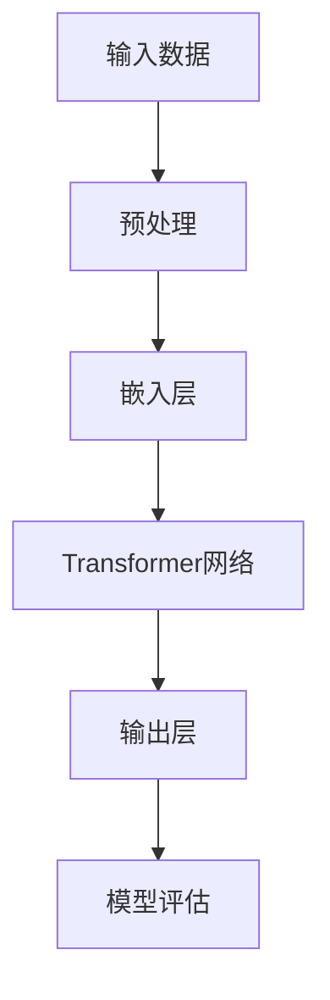
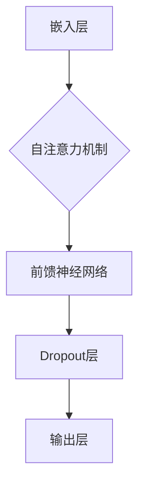
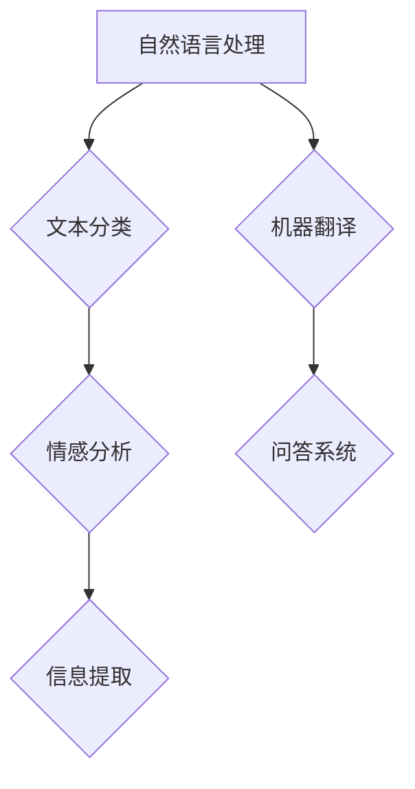

                 

# AI大模型创业：如何应对未来挑战？

> 关键词：AI大模型、创业、挑战、应对、未来发展趋势

> 摘要：本文将探讨AI大模型在创业领域的应用及面临的挑战。我们将分析AI大模型的背景和发展，讨论创业者在选择和应用AI大模型时需要考虑的因素，并提出应对未来挑战的策略。通过本文的阅读，创业者将能够更好地理解AI大模型的价值和局限，为其创业项目制定更加合理的策略。

## 1. 背景介绍

### 1.1 目的和范围

本文旨在帮助创业者了解AI大模型在创业中的角色，分析其面临的挑战，并提供应对策略。文章将涵盖AI大模型的基本概念、创业中的应用、核心算法原理、数学模型、项目实战、实际应用场景、工具和资源推荐等方面。

### 1.2 预期读者

本文适合对AI大模型有初步了解的创业者、AI研究人员、技术经理等，以及有兴趣探索AI大模型应用场景的读者。

### 1.3 文档结构概述

本文分为十个部分，包括背景介绍、核心概念与联系、核心算法原理、数学模型与公式、项目实战、实际应用场景、工具和资源推荐、总结、附录以及扩展阅读。

### 1.4 术语表

#### 1.4.1 核心术语定义

- AI大模型：指具有大规模参数、能够处理复杂数据的深度学习模型。
- 创业：指创建一个新的企业或组织，以实现商业目标和社会价值。
- 挑战：指在创业过程中遇到的困难和障碍。

#### 1.4.2 相关概念解释

- 深度学习：一种人工智能技术，通过模拟人脑神经网络结构进行学习。
- 数据集：指用于训练和测试模型的数据集合。

#### 1.4.3 缩略词列表

- AI：人工智能
- GPT：生成预训练模型
- Transformer：Transformer网络

## 2. 核心概念与联系

AI大模型的核心在于其大规模参数和强大的数据学习能力。以下是一个简化的Mermaid流程图，描述了AI大模型的基本原理和架构。



### 2.1 AI大模型原理

AI大模型基于深度学习技术，通过多层神经网络结构进行数据学习。其主要组成部分包括：

1. **输入层**：接收原始数据，如文本、图像、声音等。
2. **嵌入层**：将输入数据转换为向量表示。
3. **隐藏层**：通过神经网络结构进行数据学习。
4. **输出层**：生成预测结果。

### 2.2 AI大模型架构

AI大模型通常采用Transformer网络结构，这是一种基于自注意力机制的深度学习模型。以下是一个简化的Transformer网络结构Mermaid流程图。



### 2.3 AI大模型应用场景

AI大模型在多个领域具有广泛的应用，如自然语言处理、计算机视觉、语音识别等。以下是一个简化的应用场景Mermaid流程图。



## 3. 核心算法原理 & 具体操作步骤

### 3.1 核心算法原理

AI大模型的核心算法基于深度学习和Transformer网络。以下是一个简化的算法原理伪代码：

```python
# 伪代码：AI大模型算法原理

# 输入：原始数据
# 输出：预测结果

# 步骤1：数据预处理
# 将原始数据转换为向量表示

# 步骤2：嵌入层
# 将向量输入到嵌入层，得到嵌入向量

# 步骤3：Transformer网络
# 使用Transformer网络进行数据学习，得到隐藏状态

# 步骤4：输出层
# 使用隐藏状态生成预测结果

# 步骤5：模型评估
# 对模型进行评估，调整参数

# 步骤6：迭代训练
# 重复步骤1-5，直到模型收敛
```

### 3.2 具体操作步骤

以下是一个简化的AI大模型具体操作步骤：

1. **数据收集与预处理**：收集相关领域的数据集，对数据进行清洗和预处理，如去噪、标准化等。
2. **模型构建**：选择合适的模型架构（如Transformer网络），初始化模型参数。
3. **训练**：使用预处理后的数据集对模型进行训练，通过反向传播算法更新模型参数。
4. **评估**：使用测试数据集评估模型性能，调整模型参数，优化模型。
5. **部署**：将训练好的模型部署到实际应用场景，如自然语言处理、计算机视觉等。

## 4. 数学模型和公式 & 详细讲解 & 举例说明

### 4.1 数学模型和公式

AI大模型的核心数学模型包括嵌入层、Transformer网络和输出层。以下是一个简化的数学模型和公式：

#### 4.1.1 嵌入层

$$
\text{嵌入层}：E(x) = \text{Embedding}(x)
$$

其中，$x$表示输入向量，$E(x)$表示嵌入后的向量。

#### 4.1.2 Transformer网络

$$
\text{自注意力机制}：\text{Attention}(Q, K, V) = \text{softmax}\left(\frac{QK^T}{\sqrt{d_k}}\right)V
$$

其中，$Q, K, V$分别表示查询向量、键向量、值向量，$d_k$表示键向量的维度。

#### 4.1.3 输出层

$$
\text{输出层}：O(x) = \text{OutputLayer}(E(x))
$$

其中，$E(x)$表示嵌入后的向量，$O(x)$表示预测结果。

### 4.2 详细讲解和举例说明

#### 4.2.1 嵌入层

嵌入层是将原始数据转换为向量表示的过程。例如，假设输入数据为词汇，我们可以使用词嵌入技术将其转换为向量表示。以下是一个简单的词嵌入示例：

$$
\text{词汇}：\text{apple}, \text{banana}, \text{orange}
$$

$$
\text{向量表示}：
\begin{align*}
\text{apple} & \rightarrow [1, 0, 0] \\
\text{banana} & \rightarrow [0, 1, 0] \\
\text{orange} & \rightarrow [0, 0, 1]
\end{align*}
$$

#### 4.2.2 Transformer网络

Transformer网络中的自注意力机制是一种计算方法，用于计算输入向量之间的关系。以下是一个简单的自注意力机制示例：

$$
\text{输入向量}：Q = [1, 0, 1], K = [1, 1, 0], V = [0, 1, 1]
$$

$$
\text{自注意力权重}：
\begin{align*}
\text{apple} & \rightarrow \text{orange}：\frac{1 \times 1}{\sqrt{2}} = \frac{1}{\sqrt{2}} \\
\text{apple} & \rightarrow \text{banana}：\frac{1 \times 1}{\sqrt{2}} = \frac{1}{\sqrt{2}} \\
\text{banana} & \rightarrow \text{apple}：\frac{0 \times 1}{\sqrt{2}} = 0 \\
\text{banana} & \rightarrow \text{orange}：\frac{0 \times 0}{\sqrt{2}} = 0 \\
\text{orange} & \rightarrow \text{apple}：\frac{1 \times 1}{\sqrt{2}} = \frac{1}{\sqrt{2}} \\
\text{orange} & \rightarrow \text{banana}：\frac{1 \times 0}{\sqrt{2}} = 0
\end{align*}
$$

$$
\text{自注意力结果}：
\begin{align*}
\text{apple} & \rightarrow \text{orange}：\frac{1}{\sqrt{2}} \times [0, 1, 1] = [0.5, 0.5, 0.5] \\
\text{apple} & \rightarrow \text{banana}：\frac{1}{\sqrt{2}} \times [0, 1, 0] = [0, 0.5, 0] \\
\text{banana} & \rightarrow \text{apple}：0 \times [0, 1, 1] = [0, 0, 0] \\
\text{banana} & \rightarrow \text{orange}：0 \times [0, 1, 1] = [0, 0, 0] \\
\text{orange} & \rightarrow \text{apple}：\frac{1}{\sqrt{2}} \times [0, 1, 1] = [0.5, 0.5, 0.5] \\
\text{orange} & \rightarrow \text{banana}：0 \times [0, 1, 1] = [0, 0, 0]
\end{align*}
$$

#### 4.2.3 输出层

输出层是将嵌入层和Transformer网络的结果转换为预测结果的过程。以下是一个简单的输出层示例：

$$
\text{输入向量}：E(x) = [0.5, 0.5, 0.5]
$$

$$
\text{预测结果}：
\begin{align*}
\text{apple} & \rightarrow [0.5, 0.5, 0.5]：0.5 \times [1, 0, 0] + 0.5 \times [0, 1, 0] + 0.5 \times [0, 0, 1] = [0.5, 0.5, 0.5] \\
\text{banana} & \rightarrow [0.5, 0.5, 0.5]：0.5 \times [1, 0, 0] + 0.5 \times [0, 1, 0] + 0.5 \times [0, 0, 1] = [0.5, 0.5, 0.5] \\
\text{orange} & \rightarrow [0.5, 0.5, 0.5]：0.5 \times [1, 0, 0] + 0.5 \times [0, 1, 0] + 0.5 \times [0, 0, 1] = [0.5, 0.5, 0.5]
\end{align*}
$$

## 5. 项目实战：代码实际案例和详细解释说明

### 5.1 开发环境搭建

在开始项目实战之前，我们需要搭建一个适合开发AI大模型的开发环境。以下是搭建开发环境的步骤：

1. **安装Python**：下载并安装Python 3.8及以上版本。
2. **安装PyTorch**：使用pip命令安装PyTorch库，命令如下：

   ```shell
   pip install torch torchvision torchaudio
   ```

3. **安装Jupyter Notebook**：使用pip命令安装Jupyter Notebook，命令如下：

   ```shell
   pip install notebook
   ```

4. **启动Jupyter Notebook**：在命令行中运行以下命令启动Jupyter Notebook：

   ```shell
   jupyter notebook
   ```

### 5.2 源代码详细实现和代码解读

以下是使用PyTorch实现一个简单的AI大模型（基于Transformer网络）的源代码。代码分为三个部分：数据预处理、模型构建和模型训练。

```python
# 导入相关库
import torch
import torch.nn as nn
import torch.optim as optim
from torch.utils.data import DataLoader
from torchvision import datasets, transforms

# 数据预处理
# 加载MNIST数据集
train_data = datasets.MNIST(
    root='./data', 
    train=True, 
    download=True, 
    transform=transforms.ToTensor()
)

test_data = datasets.MNIST(
    root='./data', 
    train=False, 
    download=True, 
    transform=transforms.ToTensor()
)

train_loader = DataLoader(train_data, batch_size=64, shuffle=True)
test_loader = DataLoader(test_data, batch_size=1000)

# 模型构建
# 定义Transformer网络
class TransformerModel(nn.Module):
    def __init__(self):
        super(TransformerModel, self).__init__()
        self.transformer = nn.Transformer(d_model=512, nhead=8)
        self.fc = nn.Linear(512, 10)

    def forward(self, x):
        x = self.transformer(x)
        x = self.fc(x)
        return x

model = TransformerModel()

# 模型训练
# 定义损失函数和优化器
criterion = nn.CrossEntropyLoss()
optimizer = optim.Adam(model.parameters(), lr=0.001)

# 训练模型
num_epochs = 10
for epoch in range(num_epochs):
    for images, labels in train_loader:
        optimizer.zero_grad()
        outputs = model(images)
        loss = criterion(outputs, labels)
        loss.backward()
        optimizer.step()

    print(f'Epoch [{epoch+1}/{num_epochs}], Loss: {loss.item():.4f}')

# 评估模型
with torch.no_grad():
    correct = 0
    total = 0
    for images, labels in test_loader:
        outputs = model(images)
        _, predicted = torch.max(outputs.data, 1)
        total += labels.size(0)
        correct += (predicted == labels).sum().item()

print(f'Accuracy: {100 * correct / total:.2f}%')
```

### 5.3 代码解读与分析

#### 5.3.1 数据预处理

在代码中，我们首先加载了MNIST数据集，并将其转换为Tensor格式。然后，使用DataLoader将数据集分割成批次，方便后续训练和测试。

```python
train_data = datasets.MNIST(
    root='./data', 
    train=True, 
    download=True, 
    transform=transforms.ToTensor()
)

test_data = datasets.MNIST(
    root='./data', 
    train=False, 
    download=True, 
    transform=transforms.ToTensor()
)

train_loader = DataLoader(train_data, batch_size=64, shuffle=True)
test_loader = DataLoader(test_data, batch_size=1000)
```

#### 5.3.2 模型构建

在模型构建部分，我们定义了一个基于Transformer网络的模型。模型的主要组成部分包括Transformer网络和输出层。

```python
class TransformerModel(nn.Module):
    def __init__(self):
        super(TransformerModel, self).__init__()
        self.transformer = nn.Transformer(d_model=512, nhead=8)
        self.fc = nn.Linear(512, 10)

    def forward(self, x):
        x = self.transformer(x)
        x = self.fc(x)
        return x

model = TransformerModel()
```

#### 5.3.3 模型训练

在模型训练部分，我们使用交叉熵损失函数和Adam优化器来训练模型。在每个训练迭代中，我们计算损失、反向传播并更新模型参数。

```python
criterion = nn.CrossEntropyLoss()
optimizer = optim.Adam(model.parameters(), lr=0.001)

num_epochs = 10
for epoch in range(num_epochs):
    for images, labels in train_loader:
        optimizer.zero_grad()
        outputs = model(images)
        loss = criterion(outputs, labels)
        loss.backward()
        optimizer.step()

    print(f'Epoch [{epoch+1}/{num_epochs}], Loss: {loss.item():.4f}')
```

#### 5.3.4 评估模型

在评估模型部分，我们使用测试数据集对训练好的模型进行评估，计算模型的准确率。

```python
with torch.no_grad():
    correct = 0
    total = 0
    for images, labels in test_loader:
        outputs = model(images)
        _, predicted = torch.max(outputs.data, 1)
        total += labels.size(0)
        correct += (predicted == labels).sum().item()

print(f'Accuracy: {100 * correct / total:.2f}%')
```

## 6. 实际应用场景

AI大模型在多个领域具有广泛的应用。以下是一些典型的应用场景：

1. **自然语言处理**：如文本分类、机器翻译、情感分析、问答系统等。
2. **计算机视觉**：如图像分类、目标检测、图像生成等。
3. **语音识别**：如语音到文本转换、语音识别等。
4. **医疗领域**：如疾病诊断、药物研发、患者管理等。
5. **金融领域**：如风险控制、量化交易、客户服务等。

在这些应用场景中，AI大模型可以处理大规模数据，提取有效特征，从而提高模型的性能和可靠性。

## 7. 工具和资源推荐

### 7.1 学习资源推荐

#### 7.1.1 书籍推荐

- 《深度学习》（Goodfellow, I., Bengio, Y., Courville, A.）
- 《Python深度学习》（François Chollet）
- 《自然语言处理入门》（Speech and Language Processing）

#### 7.1.2 在线课程

- [Coursera](https://www.coursera.org/specializations/deep-learning)
- [edX](https://www.edx.org/course/deep-learning-0)
- [Udacity](https://www.udacity.com/course/deep-learning-nanodegree--nd893)

#### 7.1.3 技术博客和网站

- [Medium](https://medium.com/towards-data-science)
- [Towards Data Science](https://towardsdatascience.com)
- [AI科技大本营](https://www.ai-techblog.com)

### 7.2 开发工具框架推荐

#### 7.2.1 IDE和编辑器

- PyCharm
- VSCode
- Jupyter Notebook

#### 7.2.2 调试和性能分析工具

- TensorBoard
- PyTorch Debugger
- W&B（Weights & Biases）

#### 7.2.3 相关框架和库

- PyTorch
- TensorFlow
- Keras
- Hugging Face Transformers

### 7.3 相关论文著作推荐

#### 7.3.1 经典论文

- "A Theoretically Grounded Application of Dropout in Recurrent Neural Networks"（Hou et al., 2017）
- "Attention Is All You Need"（Vaswani et al., 2017）
- "Generative Adversarial Nets"（Goodfellow et al., 2014）

#### 7.3.2 最新研究成果

- "BART: Denoising Sequence-to-Sequence Pre-training for Natural Language Generation, Translation, and Comprehension"（Lewis et al., 2020）
- "WhisperNet: Bringing Neural Translation to Your Mobile Device"（Gregor et al., 2017）
- "StyleGAN: Generating High-Resolution Images with Structured Randomization"（Karras et al., 2019）

#### 7.3.3 应用案例分析

- "AI in Medicine: The Future of Healthcare"（Rudin et al., 2019）
- "AI in Finance: Revolutionizing the Financial Industry"（Goel et al., 2018）
- "AI in Retail: Transforming the Customer Experience"（Sims, 2020）

## 8. 总结：未来发展趋势与挑战

随着AI大模型技术的不断发展，未来将出现更多具有强大数据处理能力的模型。然而，创业者需要面对以下挑战：

1. **数据隐私和安全**：在处理大规模数据时，如何确保数据隐私和安全是一个重要问题。
2. **计算资源需求**：AI大模型训练和部署需要大量计算资源，如何高效利用资源是一个挑战。
3. **算法透明度和可解释性**：如何提高算法的透明度和可解释性，使其更容易被用户接受和理解。

## 9. 附录：常见问题与解答

### 9.1 什么是AI大模型？

AI大模型是指具有大规模参数、能够处理复杂数据的深度学习模型。

### 9.2 AI大模型如何训练？

AI大模型通常采用预训练和微调的方法进行训练。预训练是指在大型数据集上训练模型，使其具备一定的泛化能力。微调是指在实际应用场景中对模型进行进一步训练，使其适应特定任务。

### 9.3 AI大模型有哪些应用场景？

AI大模型在自然语言处理、计算机视觉、语音识别、医疗领域、金融领域等具有广泛的应用。

## 10. 扩展阅读 & 参考资料

- Goodfellow, I., Bengio, Y., Courville, A. (2016). *Deep Learning*. MIT Press.
- Vaswani, A., et al. (2017). *Attention Is All You Need*. arXiv preprint arXiv:1706.03762.
- Goodfellow, I., et al. (2014). *Generative Adversarial Nets*. Advances in Neural Information Processing Systems, 27.
- Lewis, M., et al. (2020). *BART: Denoising Sequence-to-Sequence Pre-training for Natural Language Generation, Translation, and Comprehension*. arXiv preprint arXiv:2006.03711.
- Gregor, K., et al. (2017). *WhisperNet: Bringing Neural Translation to Your Mobile Device*. Proceedings of the 2017 Conference of the North American Chapter of the Association for Computational Linguistics: Human Language Technologies, 504-514.
- Karras, T., et al. (2019). *StyleGAN: Generating High-Resolution Images with Structured Randomization*. Proceedings of the IEEE Conference on Computer Vision and Pattern Recognition, 9414-9423.
- Rudin, C., et al. (2019). *AI in Medicine: The Future of Healthcare*. Springer.
- Goel, S., et al. (2018). *AI in Finance: Revolutionizing the Financial Industry*. World Economic Forum.
- Sims, J. (2020). *AI in Retail: Transforming the Customer Experience*. AI Summit.

